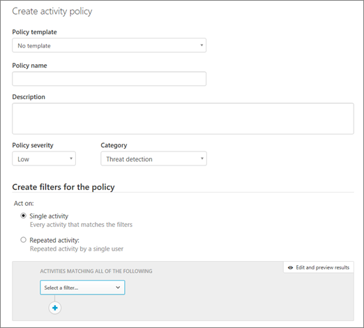

# Criteri delle attività e avvisi in Office 365 Cloud App Security

Gestione di sicurezza avanzata di Office 365 è sicurezza App Cloud di Office 365.
  
|Valutazione * *\>**|Pianificazione * *\>**|Distribuzione * *\>**|Utilizzo * * *|
|:-----|:-----|:-----|:-----|
|[Avviare la valutazione](office-365-cas-overview.md)   |[Iniziare a pianificare](get-ready-for-office-365-cas.md)   |Si è seguito!    [Passaggio successivo](anomaly-detection-policies-in-ocas.md)   |[Avviare utilizzando](utilization-activities-for-ocas.md)   |
   
Con Office 365 Cloud App protezione, i criteri di gestione avanzata cloud attivano gli avvisi per attività specifiche eseguite o avvenire troppo spesso. Si supponga, ad esempio, un utente tenta di accedere a Office 365 e si verifica un errore volte 70 in un minuto. Si supponga che consente di scaricare 7.000 file un altro utente o sembra essere effettuato l'accesso dal Canada, quando l'utente deve per essere in un'altra posizione. O peggiori, si supponga che di un utente account è stata danneggiata e un utente malintenzionato utilizza tale account per l'accesso applicazioni basate su cloud dell'organizzazione e i dati riservati.
  
Se si è un [amministratore globale o amministratore di protezione](permissions-in-the-security-and-compliance-center.md), gli avvisi attività notificare è quando questi eventi si verificano. È quindi possibile eseguire azioni specifiche, ad esempio la sospensione di un account utente fino a quando non è possibile provare a utilizzare Dov'.
  
> [!NOTE]
> Criteri di protezione di applicazione Cloud di Office 365 sono diversi dai [avviso criteri in Office 365 Security &amp; centro conformità](alert-policies.md). L'attività criteri descritti in questo articolo vengono definiti nel portale di Office 365 Cloud App protezione e consentono di migliorare la gestione ambiente basato su cloud dell'organizzazione. 
  
## Informazioni preliminari

Verificare quanto segue:
  
- L'organizzazione dispone di [Protezione di Office 365 Cloud App](office-365-cas-overview.md)e il servizio è [attivata](turn-on-office-365-cas.md).
    
- [Registrazione di controllo](turn-audit-log-search-on-or-off.md) è attivata per l'ambiente Office 365. 
    
- Si è un amministratore globale o un amministratore di protezione per Office 365.
    
## Creare un nuovo criterio di attività

1. Un amministratore globale o un amministratore di protezione, passare a [https://protection.office.com](https://protection.office.com) e accedere utilizzando l'account di lavoro o della scuola. 
    
2. In sicurezza &amp; centro conformità, selezionare **avvisi** \> **Gestione avanzata degli avvisi**.
    
3. Scegliere **Vai a Office 365 Cloud App protezione**.
    
    Verrà visualizzata la pagina Criteri di protezione di Office 365 Cloud App.
    
    
  
4. Fare clic su **Crea un criterio**e quindi selezionare **il criterio di attività**.
    
    
  
5. Nella pagina **Crea un criterio attività** consente di specificare il **nome del criterio** e la **Descrizione**. Per definire un criterio di base su un modello predefinito, scegliere uno nell'elenco **modello dei criteri** o creare i criteri senza utilizzare un modello. 
    
    
  
6. Selezionare un **livello di gravità criteri** (bassa, Media o alta) che misura come gravi è all'utente se questo criterio viene generato un avviso. Sarà quindi possibile filtrare gli avvisi quando è esame più avanti. 
    
7. Scegliere una **categoria** per questo criterio. Ciò consente di filtrare e ordinare gli avvisi che sono stati attivati o criteri di gruppo quando viene esaminata al loro di apportare modifiche. 
    
8. Scegliere **filtri attività** di configurazione di altre azioni o metriche che verranno generato un avviso in base a questo criterio. 
    
9. In **attività corrispondenza con i parametri**, specificare se la violazione dei criteri viene attivata quando una singola attività genera una corrispondenza per i filtri, o se è necessario un numero specificato di attività ripetute prima di trigger avviso.
    
    Se si seleziona **Repeated attività**, specificare il numero di attività, l'intervallo di tempo, e indica se una violazione verrà inclusi nel conteggio di un utente all'interno di un'app specifica o per lo stesso utente con le app.
    
10. Facoltativamente, è possibile selezionare **avviso crea** per creare ulteriori avvisi per la ricezione di notifiche da questo criterio (tramite posta elettronica, SMS o entrambi). 
    
    > [!IMPORTANT]
    > Assicurarsi che il provider di posta elettronica non Blocca messaggi di posta elettronica inviati da no-reply@cloudappsecurity.com. 
  
11. Scegliere le **Azioni** da eseguire quando viene generato un avviso per sospendere l'utente o richiedere all'utente di effettuare nuovamente l'accesso alle app di Office 365. 
    
12. Scegliere **Crea** per completare la creazione del criterio. 
    
## Passaggi successivi

- [Criteri di rilevamento anomalia](anomaly-detection-policies-in-ocas.md)
    
- [Integrare il server SIEM](integrate-your-siem-server-with-office-365-cas.md)
    
- [Leggere ed eseguire l'azione gli avvisi](review-office-365-cas-alerts.md)
    
- [Gli indirizzi IP per semplificare la gestione di gruppo](group-your-ip-addresses-in-ocas.md)
    

