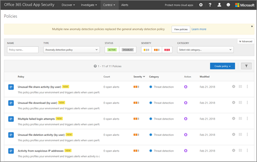

# Criteri di rilevamento delle anomalie in Office 365 Cloud App Security

Gestione di sicurezza avanzata di Office 365 è sicurezza App Cloud di Office 365.
  
|Valutazione * *\>**|Pianificazione * *\>**|Distribuzione * *\>**|Utilizzo * * *|
|:-----|:-----|:-----|:-----|
|[Avviare la valutazione](office-365-cas-overview.md)   |[Iniziare a pianificare](get-ready-for-office-365-cas.md)   |Si è seguito!    [Passaggio successivo](integrate-your-siem-server-with-office-365-cas.md)   |[Avviare utilizzando](utilization-activities-for-ocas.md)   |
   
A partire da [Microsoft Cloud App Security versione 116](new-in-office-365-cas-2018.md#office-365-cloud-app-security-release-116-3), sicurezza App Cloud di Office 365 include diverse anomalia predefiniti rilevamento criteri ("predefinito") che includono utenti e analitica comportamento entità (UEBA) e apprendimento automatico (ML).
  

  
Questi criteri di rilevamento anomalia forniscono risultati immediati fornendo rilevamenti immediati, assegnazione numerose alterazioni comportamentali tra gli utenti e computer e dispositivi collegati alla rete. Inoltre, i nuovi criteri di espongono i dati più dal motore di rilevamento della protezione applicazione Cloud per accelerare il processo di analisi e contiene minacce in corso.
  
Come un amministratore globale di Office 365 o sicurezza, è possibile esaminare e se necessario, modificare i criteri predefiniti disponibili in Office 365 Cloud App sicurezza.
  
 > [!IMPORTANT]
> Non esiste un periodo di formazione iniziale di sette (7) giorni non attivati durante il quale gli avvisi comportamenti anomali. Algoritmo di rilevamento anomalia è ottimizzato per ridurre il numero dei falsi allarmi. 
  
## Informazioni preliminari

Verificare quanto segue:
  
- L'organizzazione dispone di [Protezione di Office 365 Cloud App](office-365-cas-overview.md)e il servizio è [attivata](turn-on-office-365-cas.md).
    
- [Registrazione di controllo](turn-audit-log-search-on-or-off.md) è attivata per l'ambiente Office 365. 
    
- Si è un amministratore globale o un amministratore di protezione per Office 365.
    
## Consente di visualizzare i criteri di rilevamento anomalia

1. Un amministratore globale o un amministratore di protezione, passare al portale di protezione di applicazione Cloud ([https://portal.cloudappsecurity.com](https://portal.cloudappsecurity.com)) ed eseguire l'accesso. Verrà visualizzata la pagina Criteri di protezione di Office 365 Cloud App.
    
2. Nell'elenco **tipo** selezionare **criterio rilevamento anomalia**. L'organizzazione predefinita (o esistenti) vengono visualizzati i criteri di rilevamento anomalia. 
  
3. Selezionare un criterio per visualizzare o modificare le impostazioni.
    
4. Scegliere **Update** per salvare le modifiche. 
    
## Ulteriori informazioni sui criteri di rilevamento anomalia

Criteri di rilevamento anomalia vengono automaticamente abilitati; Tuttavia, sicurezza App Cloud di Office 365 ha un periodo di formazione iniziale di sette giorni durante la quale anomalia non tutti vengono generati avvisi di rilevamento. Al termine, ogni sessione viene confrontato con le attività quando gli utenti sono stati attivi, indirizzi IP, dispositivi e così via rilevata su mese scorso e il punteggio di rischio di queste attività. Questi rilevamenti fanno parte del motore di rilevamento euristico anomalia che l'ambiente di profili e Attiva avvisi rispetto alla linea di base che è stata individuata sull'attività dell'organizzazione. Inoltre i rilevamenti di sfruttano gli algoritmi di apprendimento automatica progettati per gli utenti e i modelli di registro per ridurre i falsi positivi dei profili.
  
Grazie alla scansione attività dell'utente vengono rilevate alterazioni. Il rischio che viene valutato esaminando più di 30 indicatori di rischio diversi, raggruppati in più fattori di rischio, ad esempio rischioso indirizzo IP, errori di accesso, attività di amministrazione, account inattivi, posizione, impossibili viaggi, dispositivi e agente utente e frequenza di attività.
  
Avviso di sicurezza in base ai criteri risultati, viene attivate. Protezione di Office 365 Cloud App esamina tutte le sessioni utente in Office 365 e avvisa l'utente ogni volta che un elemento effetti che è diversa dalla linea di base della propria organizzazione o da normali attività dell'utente.
  
Nella tabella seguente vengono descritti i criteri di rilevamento anomalia predefinita, lo scopo e sul relativo funzionamento.
  
|**Nome del criterio rilevamento anomalia**|**Funzionamento**|
|:-----|:-----|
|Impossibile viaggi    |Vengono identificate due attività dell'utente (è di uno o più sessioni) che hanno origine da posizioni geograficamente distanti entro un periodo di tempo più breve rispetto all'ora avrebbe richiesto all'utente di viaggiare dal primo percorso al secondo, che indica che un diverso utilizza le stesse credenziali utente. Questo rilevamento utilizza un computer apprendimento algoritmo che ignora evidenti "falsi positivi" che contribuisce a condizione impossibili viaggi, ad esempio le reti private virtuali e i percorsi regolarmente utilizzati da altri utenti nell'organizzazione. Il rilevamento dispone di un periodo di formazione iniziale di sette giorni durante il quale viene informato della presenza motivo attività del nuovo utente.    |
|Attività da poco frequenti paese    |Considera precedenti ubicazioni attività per determinare i percorsi nuovi e occasionali. Il motore di rilevamento anomalia archivia informazioni sulle posizioni precedenti utilizzato dagli utenti nell'organizzazione. Viene generato un avviso quando si verifica un'attività da un percorso a cui è non stato recentemente o mai visitati a partire dall'utente o da un utente nell'organizzazione.    |
|Attività di indirizzi IP anonimi    |Identifica che gli utenti sono stati attivi da un indirizzo IP che è stato identificato come un indirizzo IP proxy anonimo. Vengono utilizzati dagli utenti a cui si desidera nascondere l'indirizzo IP del dispositivo in uso e possono essere utilizzati per finalità dannose. Questo rilevamento utilizza un computer apprendimento algoritmo che riduce i "falsi positivi", ad esempio non contrassegnati indirizzi IP utilizzati frequentemente dagli utenti nell'organizzazione.    |
|Attività di indirizzi IP sospetti    |Identifica che gli utenti sono stati attivi da un indirizzo IP che è stato identificato come rischioso da Microsoft Threat Intelligence. Tali indirizzi IP coinvolti nelle attività dannosa, ad esempio C Botnet&amp;C e può indicare account compromesso. Questo rilevamento utilizza un computer apprendimento algoritmo che riduce i "falsi positivi", ad esempio non contrassegnati indirizzi IP utilizzati frequentemente dagli utenti nell'organizzazione.    |
|Attività anomale (per utente)    | Identificare gli utenti che eseguono le attività anomale, ad esempio:     -Download file più     -- Attività di condivisione file.     -Attività di eliminazione file     -Attività rappresentazione     -Amministrazione delle attività     Questi criteri cercare attività all'interno di una singola sessione rispetto alla linea di base maturata, che potrebbe indicare un tentativo di violazione. I rilevamenti di utilizzare un algoritmo che profili gli utenti eseguono l'accesso motivo di apprendimento e riduce i falsi positivi. Questi rilevamenti fanno parte del motore di rilevamento euristico anomalia che l'ambiente di profili e Attiva avvisi rispetto alla linea di base che è stata individuata sull'attività dell'organizzazione.    |
|Più tentativi di accesso non riuscito    |Identificare gli utenti che non è più tentativi di accesso in una singola sessione per quanto riguarda la previsione maturata, che potrebbe indicare un tentativo di violazione.    |
   
## Avvisi di rilevamento anomalia diagnosi

Come gli avvisi sono disponibili in, è possibile esaminare gli avvisi in modo rapido e determinare quali gestire prima. Contesto per un avviso consente di verificare la visione e determinare se un elemento dannoso avviene in effetti. Per iniziare l'esplorazione di un avviso, utilizzare la procedura seguente:
  
1. Un amministratore globale o un amministratore di protezione, passare al portale di protezione di applicazione Cloud ([https://portal.cloudappsecurity.com](https://portal.cloudappsecurity.com)) ed eseguire l'accesso. 
    
2. Scegliere **gli avvisi** per visualizzare gli avvisi. 
    
3. Per ottenere il contesto per un avviso, procedere come segue:
    
4. Scegliere **indagare** \> **registro attività**.
    
5. Selezionare un elemento, ad esempio un utente o l'indirizzo IP. Verrà aperto il cassetto informazioni pertinenti. 
  
6. Nel cassetto rilevanti sui concetti, fare clic su dei comandi disponibili, ad esempio un'icona nell'area **Mostra simili** .  
  
7. Ottenere informazioni sull'elemento selezionato continuando esplorare i dettagli relativi a quell'elemento.
    
Un avviso in più account di accesso non riuscito effettivamente potrebbe essere potenzialmente dannoso e può indicare un potenziali attacchi di forza bruta. Tuttavia, ad esempio un avviso può inoltre essere una configurazione non corretta applicazione, causando l'avviso da un vero positivo benigno. Se viene visualizzato un avviso di accessi non è riuscita più con ulteriori attività sospetti, esiste una maggiore probabilità che un account viene compromesso. Ad esempio, si supponga che un avviso di accesso non riuscito multiplo è seguito da attività da un indirizzo IP TOR e attività impossibili viaggi, entrambi forti indicatori compromesso. Se viene visualizzata anche che lo stesso utente eseguita un'attività di massa download, spesso è un indicatore dell'autore dell'attacco esegue exfiltration dei dati. Di informazioni simili a quelle che potrebbero essere utili nella sicurezza di Office 365 Cloud App di visualizzare e valutare gli avvisi e intervenire in caso di necessità.
  
## Passaggi successivi

- [Integrare il server SIEM](integrate-your-siem-server-with-office-365-cas.md)
    
- [Leggere ed eseguire l'azione gli avvisi](review-office-365-cas-alerts.md)
    
- [Gli indirizzi IP per semplificare la gestione di gruppo](group-your-ip-addresses-in-ocas.md)
    

