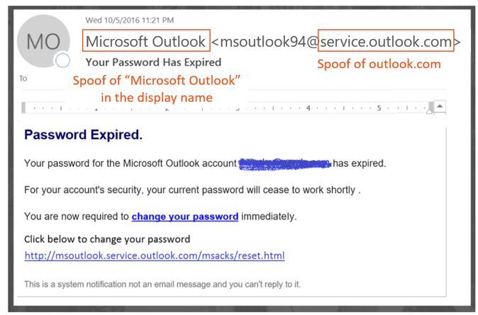
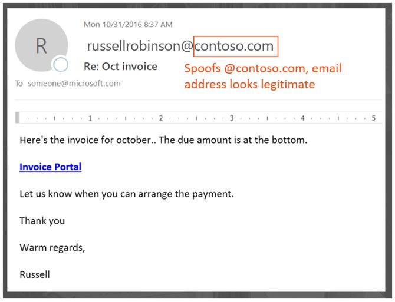
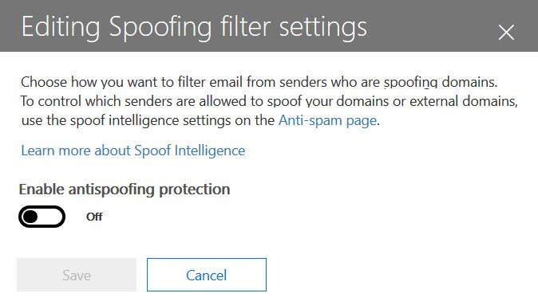

# <a name="anti-spoofing-protection-in-office-365"></a>Protezione anti-spoofing in Office 365

Questo articolo descrive come Office 365 riduce gli attacchi di phishing che usoano domini di mittenti contraffatti, vale a dire che sono oggetto di spoofing. Per ottenere questo risultato analizza i messaggi e blocca quelli che non possono essere autenticati né tramite metodi di autenticazione di posta elettronica standard né con altre tecniche di reputazione del mittente. Questa modifica è stata implementata per ridurre il numero di attacchi di phishing a cui sono esposte le organizzazioni in Office 365.
  
In questo articolo si descrive anche perché è stata effettuata questa modifica, come i clienti possono prepararsi alla modifica, come visualizzare i messaggi che saranno interessati, come creare un report di messaggi, come ridurre i falsi positivi, nonché come i mittenti per Microsoft devono prepararsi alla modifica.
  
La tecnologia anti-spoofing di Microsoft è stata distribuita inizialmente alle organizzazioni che avevano un abbonamento a Office 365 Enterprise E5 o che avevano acquistato il componente aggiuntivo di Office 365 Advanced Threat Protection (ATP) per la sottoscrizione. A ottobre 2018 la protezione è stata estesa alle organizzazioni che hanno anche Exchange Online Protection (EOP). Inoltre, grazie alla modalità con cui tutti i nostri filtri apprendono l’uno dall’altro, anche gli utenti di Outlook.com possono essere interessati.
  
## <a name="how-spoofing-is-used-in-phishing-attacks"></a>Come si usa lo spoofing negli attacchi di phishing

Quando si tratta di proteggere gli utenti, Microsoft prende seriamente in considerazione il rischio di phishing. Una delle tecniche usate per l’invio di posta elettronica indesiderata e per il phishing è lo spoofing, che avviene quando il mittente è contraffatto e appare un messaggio che sembra provenire da un utente o da un punto di origine diversi da quelli effettivi. Questa tecnica è spesso utilizzata durante le campagne di phishing progettate per ottenere le credenziali dell’utente. La tecnologia anti-spoofing di Microsoft esamina in particolare l'autenticità in "Da: intestazione" che compare in un client di posta elettronica come Outlook. Quando Microsoft è sicuro che “Da: intestazione” è oggetto di spoofing, identifica il messaggio come spoofing.
  
I messaggi di spoofing hanno due implicazioni negative per gli utenti reali:
  
### <a name="1-spoofed-messages-deceive-users"></a>1. I messaggi oggetto di spoofing sono ingannevoli
  
Prima di tutto un messaggio oggetto di spoofing potrebbe indurre un utente a fare clic su un collegamento e a lasciare le proprie credenziali, a scaricare malware o a rispondere a un messaggio con contenuti sensibili (il secondo dei quali è noto come compromesso per la posta elettronica aziendale). Ad esempio, di seguito è riportato un messaggio di phishing con mittente contraffatto di msoutlook94@service.outlook.com:
  

  
I messaggi riportati non provengono effettivamente da service.outlook.com, ma sono stati falsificati da un truffatore per farli sembrare tali. Si sta tentando di indurre l’utente a fare clic sul collegamento all'interno del messaggio.
  
L’esempio seguente indica lo spoofing di contoso.com:
  

  
Il messaggio sembra legittimo ma è in realtà contraffatto. Questo messaggio di phishing è un tipo di compromesso di posta elettronica aziendale che è una sottocategoria di phishing.

### <a name="2-users-confuse-real-messages-for-fake-ones"></a>2. Gli utenti confondono i messaggi autentici con quelli contraffatti
  
In secondo luogo, i messaggi contraffatti creano incertezza negli utenti che conoscono i messaggi di phishing ma non sono in grado di distinguere tra un messaggio autentico e uno contraffatto. Ad esempio, di seguito è riportato un esempio di reimpostazione della password effettiva dall'indirizzo di posta elettronica di un account di sicurezza Microsoft:
  

  
Il messaggio proviene da Microsoft ma, allo stesso tempo, gli utenti ricevono messaggi di phishing che potrebbero indurli a fare clic su un collegamento e a lasciare le credenziali, a scaricare malware o rispondere a un messaggio con informazioni sensibili. Poiché è difficile capire la differenza tra una reimpostazione della password autentica e una contraffatta, molti utenti ignorano questi messaggi, li segnalano come posta indesiderata o li segnalano inutilmente a Microsoft come tentativi di phishing.

Per interrompere lo spoofing, le industrie che gestiscono i filtri di posta elettronica hanno sviluppato dei protocolli di autenticazione di posta elettronica, come i protocolli [SPF](https://docs.microsoft.com/office365/SecurityCompliance/set-up-spf-in-office-365-to-help-prevent-spoofing), [DKIM](https://docs.microsoft.com/office365/SecurityCompliance/use-dkim-to-validate-outbound-email), e [DMARC](https://docs.microsoft.com/office365/SecurityCompliance/use-dmarc-to-validate-email). DMARC impedisce lo spoofing analizzando il mittente di un messaggio, quello visualizzato dall’utente nel client di posta elettronica (negli esempi precedenti, è service.outlook.com, outlook.com e accountprotection.microsoft.com), con il dominio che ha superato i controlli SPF o DKIM. Ovvero, il dominio visualizzato dall'utente è stato autenticato e pertanto non è contraffatto. Per maggiori dettagli, consultare la sezione "*Informazioni sul motivo per cui l’autenticazione della posta elettronica non è sempre sufficiente per interrompere lo spoofing"* più avanti in questo articolo.
  
Tuttavia, il problema è che i record di autenticazione della posta elettronica sono facoltativi, non necessari. Di conseguenza, mentre i domini con criteri di autenticazione sicuri come microsoft.com e skype.com sono protetti dallo spoofing, i domini che pubblicano con criteri di autenticazione più deboli o senza criteri sono obiettivi che possono essere contraffatti. A partire da marzo 2018, solo il 9% dei domini delle aziende Fortune 500 ha pubblicato con criteri di autenticazione di posta elettronica sicuri.  Il restante 91% può essere contraffatto da un truffatore e, a meno che il filtro della posta elettronica non lo rilevi utilizzando un altro criterio, il messaggio contraffatto può essere recapitato a un utente finale per ingannarlo:
  

  
La percentuale di aziende piccole e di medie dimensioni che non rientrano in Fortune 500 e che pubblicano con criteri di autenticazione di posta elettronica sicuri è piccola, ed è ancora più piccola per i domini esterni al Nord America e all'Europa occidentale.
  
Si tratta di un problema importante perché, mentre le aziende potrebbero non essere a conoscenza di come funziona l'autenticazione di posta elettronica, i truffatori lo sanno bene e approfittano di questa mancanza.
  
Per informazioni su come configurare SPF, DKIM e DMARC, vedere la sezione "*Clienti di Office 365"* più avanti in questo documento. 
  
## <a name="stopping-spoofing-with-implicit-email-authentication"></a>Interruzione dello spoofing con l'autenticazione implicita della posta elettronica

Dal momento che il phishing e la posta indesiderata sono un problema e, a causa dell'adozione limitata di criteri di autenticazione di posta elettronica sicuri, Microsoft continua a investire in funzionalità per la protezione dei clienti. Di conseguenza, Microsoft procede con l'*autenticazione implicita della posta elettronica*: se un dominio non esegue l'autenticazione, Microsoft lo tratterà come se avesse pubblicato i record di autenticazione della posta elettronica e lo gestirà di conseguenza in caso di non superamento della procedura. 
  
Per ottenere questo risultato, Microsoft ha creato numerose estensioni alla regolare autenticazione della posta elettronica, tra cui la reputazione mittente, la cronologia mittente/destinatario, l'analisi comportamentale e altre tecniche avanzate.  Un messaggio inviato da un dominio che non pubblica l'autenticazione della posta elettronica sarà contrassegnato come contraffatto, a meno che non contenga altri segnali per indicare che è legittimo.
  
In questo modo, gli utenti finali possono avere la certezza che un messaggio di posta elettronica inviato a loro non sia stato contraffatto, i mittenti possono essere certi che nessuno si stia spacciando per il proprio dominio e i clienti di Office 365 possono offrire una protezione più efficace, ad esempio la Protezione di rappresentazione.
  
Per visualizzare l'annuncio generale di Microsoft, vedere [Un mare di phishing parte 2 - Anti-spoofing avanzato in Office 365](https://techcommunity.microsoft.com/t5/Security-Privacy-and-Compliance/Schooling-A-Sea-of-Phish-Part-2-Enhanced-Anti-spoofing/ba-p/176209).
  
## <a name="identifying-that-a-message-is-classified-as-spoofed"></a>Identificazione di un messaggio classificato come oggetto di spoofing

### <a name="composite-authentication"></a>Autenticazione composita

Anche se SPF, DKIM e DMARC sono tutti utili singolarmente, non comunicano un sufficiente stato di autenticazione nel caso in cui un messaggio non disponga di record di autenticazione espliciti.  Di conseguenza, Microsoft ha sviluppato un algoritmo che combina più segnali in un singolo valore denominato autenticazione composita o compauth in breve. I clienti di Office 365 dispongono di valori compauth indicati nell’intestazione*Authentication-Results* nelle intestazioni del messaggio. 
  
```
Authentication-Results:
  compauth=<fail|pass|softpass|none> reason=<yyy>

```

|**Risultato CompAuth**|**Descrizione**|
|:-----|:-----|
|errore|Il messaggio non ha eseguito l'autenticazione esplicita (il dominio di invio ha pubblicato esplicitamente i record in DNS) né l'autenticazione implicita ( il dominio di invio non ha pubblicato i record in DNS, quindi Office 365 ha interpolato il risultato come se avesse pubblicato i record).
|
|superato|Il messaggio ha eseguito l'autenticazione esplicita (il messaggio ha superato DMARC o [Best Guess Passed DMARC](https://blogs.msdn.microsoft.com/tzink/2015/05/06/what-is-dmarc-bestguesspass-in-office-365)) o l'autenticazione implicita con elevata sicurezza (il dominio di invio non pubblica i record di autenticazione della posta elettronica, ma Office 365 riceve segnali di back-end sicuri per indicare che il messaggio è probabilmente legittimo).|
|softpass|Il messaggio ha eseguito l'autenticazione implicita con sicurezza media o bassa (il dominio di invio non pubblica l'autenticazione della posta elettronica, ma Office 365 riceve segnali di back-end per indicare che il messaggio è legittimo, ma la forza del segnale è debole).
|
|nessuno|Il messaggio non ha eseguito l'autenticazione (o ha eseguito l'autenticazione ma non è stato allineato), ma l'autenticazione composita non è stata applicata a causa della reputazione mittente o di altri fattori.|
   
|||
|:-----|:-----|
|**Motivo**|**Descrizione**|
|0xx|Il messaggio non ha eseguito l’autenticazione composita.<br/>**000** indica che il messaggio ha avuto esito negativo per DMARC con un'azione di rifiuto o quarantena.   <br/>**001** indica che il messaggio non ha eseguito l’autenticazione implicita della posta elettronica. Questo significa che non ha pubblicato record di posta elettronica l'autenticazione del dominio mittente o in caso affermativo, sono stati prevedono criteri errore (errore contorni SPF o indipendente, criteri DMARC p = nessuna).  <br/>**002** indica che l'organizzazione dispone di un criterio per la coppia mittente/dominio esplicitamente vietato dall'invio di messaggi di posta elettronica contraffatti, questa impostazione è impostata manualmente da un amministratore.   <br/>**010** indica che il messaggio ha generato errore per DMARC con un'azione di rifiuto o quarantena, e che il dominio di invio è uno dei domini accettati dell'organizzazione (questo fa parte dello spoofing self-to-self o intra-org).  <br/>**011** indica che il messaggio non ha eseguito l'autenticazione implicita della posta elettronica e che il dominio di invio è uno dei domini accettati dell'organizzazione (questo fa parte dello spoofing self-to-self o intra-org).|
|Tutti gli altri codici (1xx, 2xx, 3xx, 4xx, 5xx)|Corrispondono a vari codici interni che indicano i motivi per cui un messaggio ha superato l'autenticazione implicita o non ha ricevuto l'autenticazione ma non è stata applicata alcuna azione.|
   
Esaminando le intestazioni del messaggio, un amministratore o persino un utente finale possono determinare in che modo Office 365 arriva alla conclusione che il mittente potrebbe essere contraffatto.
  
### <a name="differentiating-between-different-types-of-spoofing"></a>Differenziazione tra diversi tipi di spoofing

Microsoft differenzia due diversi tipi di messaggi di spoofing:
  
 **Spoofing intra-org**
  
Conosciuto anche come spoofing self-to-self, si verifica quando il dominio nell'indirizzo Da: è lo stesso o si allinea al dominio del destinatario (quando il dominio del destinatario è uno dei [Domini accettati](https://technet.microsoft.com/it-IT/library/jj945194%28v=exchg.150%29.aspx) dalla tua organizzazione). In alternativa, quando il dominio nell'indirizzo Da: fa parte della stessa organizzazione.
  
Ad esempio, il mittente e il destinatario seguenti sono presenti nello stesso dominio (contoso.com).  Sono inseriti degli spazi nell'indirizzo di posta elettronica per impedire la raccolta di spambot in questa pagina):
  
Da: mittente @ contoso.com
  
A: destinatario @ contoso.com
  
Di seguito sono riportati i domini del mittente e del destinatario che si allineano al dominio dell'organizzazione (fabrikam.com):
  
Da: mittente @ foo.fabrikam.com
  
A: destinatario @ bar.fabrikam.com
  
I domini del mittente e del destinatario seguenti sono diversi (microsoft.com e bing.com), ma appartengono alla stessa organizzazione (entrambi fanno parte dei Domini accettati dell'organizzazione):
  
Da: mittente @ microsoft.com
  
A: destinatario @ bing.com
  
I messaggi che non riescono a eseguire lo spoofing intra-org contengono i valori seguenti nelle intestazioni:
  
X-Forefront-Antispam-Report: ...CAT:SPM/HSPM/PHSH;...SFTY:9.11
  
CAT è la categoria del messaggio ed è normalmente contrassegnata come SPM (posta indesiderata), ma occasionalmente può essere HSPM (protezione da posta indesiderata elevata) o PHISH (phishing) a seconda di quali altri tipi di modelli si verificano nel messaggio.
  
SFTY è il livello di sicurezza del messaggio, la prima cifra (9) indica che il messaggio è di phishing e le cifre dopo il punto (11) indicano che si tratta di spoofing intra-org.
  
Non esiste alcun codice motivo specifico per l'Autenticazione composita dello spoofing intra-org, questo sarà stampato in un secondo momento nel 2018 (la timeline non è stata ancora definita).
  
 **Spoofing fra domini**
  
Questo problema si verifica quando il dominio di invio nell'indirizzo Da: è un dominio esterno all'organizzazione che riceve il messaggio. I messaggi che non riescono ad eseguire l'autenticazione composita a causa dello spoofing tra domini contengono i seguenti valori nelle intestazioni:
  
Authentication-Results: … compauth=fail reason=000/001
  
X-Forefront-Antispam-Report: ...CAT:SPOOF;...SFTY:9.22
  
In entrambi i casi, viene contrassegnato il seguente suggerimento per la sicurezza in rosso nel messaggio, oppure un messaggio equivalente personalizzato nella lingua della cassetta postale del destinatario:
  

  
Solo osservando l'indirizzo Da: e sapendo di cosa è composta la posta elettronica del destinatario, o ispezionando le intestazioni di posta elettronica, è possibile distinguere tra lo spoofing intra-org o fra domini.
  
## <a name="how-customers-of-office-365-can-prepare-themselves-for-the-new-anti-spoofing-protection"></a>In che modo i clienti di Office 365 possono prepararsi per la nuova protezione anti-spoofing

### <a name="information-for-administrators"></a>Informazioni per gli amministratori

In qualità di amministratore di un'organizzazione di Office 365, è necessario tenere presenti diverse informazioni importanti.
  
### <a name="understanding-why-email-authentication-is-not-always-enough-to-stop-spoofing"></a>Informazioni sul motivo per cui l'autenticazione della posta elettronica non è sempre sufficiente per arrestare la contraffazione

La nuova protezione anti-spoofing si basa sull'autenticazione della posta elettronica (SPF, DKIM e DMARC) per non contrassegnare un messaggio come spoofing. Un esempio comune è il momento in cui un dominio di invio non ha mai pubblicato i record di SPF. Se non sono presenti record di SPF o non sono stati configurati correttamente, un messaggio inviato verrà contrassegnato come contraffatto, a meno che Microsoft non disponga di informazioni di back-end che indicano il messaggio come legittimo.
  
Ad esempio, prima dell’identificazione come anti-spoofing, un messaggio potrebbe essere simile al seguente senza record di SPF, senza record di DKIM o record di DMARC: 
  
```
Authentication-Results: spf=none (sender IP is 1.2.3.4)
  smtp.mailfrom=example.com; contoso.com; dkim=none
  (message not signed) header.d=none; contoso.com; dmarc=none
  action=none header.from=example.com;
From: sender @ example.com
To: receiver @ contoso.com
```
Dopo aver eseguito l'anti-spoofing, se si dispone di Office 365 Enterprise E5, EOP o ATP, il valore compauth viene contrassegnato come indicato di seguito:
  
```
Authentication-Results: spf=none (sender IP is 1.2.3.4)
  smtp.mailfrom=example.com; contoso.com; dkim=none
  (message not signed) header.d=none; contoso.com; dmarc=none
  action=none header.from=example.com; compauth=fail reason=001
From: sender @ example.com
To: receiver @ contoso.com

```

Se example.com ha risolto questo valore impostando un record di SPF ma non un record di DKIM, si eseguirebbe l'autenticazione composita perché il dominio che ha superato SPF è stato allineato al dominio nell'indirizzo Da: 
  
```
Authentication-Results: spf=pass (sender IP is 1.2.3.4)
  smtp.mailfrom=example.com; contoso.com; dkim=none
  (message not signed) header.d=none; contoso.com; dmarc=bestguesspass
  action=none header.from=example.com; compauth=pass reason=109
From: sender @ example.com
To: receiver @ contoso.com
```

In alternativa, se si configura un record di DKIM ma non un record di SPF, si eseguirebbe l'autenticazione composita anche perché il dominio superato DKIM-signature è stato allineato al dominio nell'indirizzo Da: 
  
```
Authentication-Results: spf=none (sender IP is 1.2.3.4)
  smtp.mailfrom=example.com; contoso.com; dkim=pass
  (signature was verified) header.d=outbound.example.com;
  contoso.com; dmarc=bestguesspass action=none
  header.from=example.com; compauth=pass reason=109
From: sender @ example.com
To: receiver @ contoso.com
```

Tuttavia, un truffatore può anche configurare SPF e DKIM e firmare il messaggio con il proprio dominio, ma specificare un dominio diverso nell'indirizzo Da: .  Né SPF né DKIM richiedono che il dominio sia allineato al dominio nell'indirizzo Da:, quindi, a meno che example.com non abbia pubblicato record di DMARC, questa operazione non verrebbe contrassegnata come contraffazione tramite DMARC: 
  
```
Authentication-Results: spf=pass (sender IP is 5.6.7.8)
  smtp.mailfrom=maliciousDomain.com; contoso.com; dkim=pass
  (signature was verified) header.d=maliciousDomain.com;
  contoso.com; dmarc=none action=none header.from=example.com;
From: sender @ example.com
To: receiver @ contoso.com
```

Nel client di posta elettronica (Outlook, Outlook sul Web o in qualsiasi altro client di posta elettronica), viene visualizzato solo il dominio Da:, non il dominio in SPF o DKIM, e questo può indurre l'utente a pensare che il messaggio proviene da example.com, provenendo in realtà da maliciousDomain.com.
  

  
Per questo motivo, Office 365 richiede che il dominio nell'indirizzo Da: sia allineato al dominio nella firma di SPF o DKIM e, in caso contrario, contenga altri segnali interni che indichino il messaggio come legittimo. In caso contrario, il messaggio sarebbe contrassegnato come errore compauth. 
  
```
Authentication-Results: spf=none (sender IP is 5.6.7.8)
  smtp.mailfrom=maliciousDomain.com; contoso.com; dkim=pass
  (signature was verified) header.d=maliciousDomain.com;
  contoso.com; dmarc=none action=none header.from=contoso.com;
  compauth=fail reason=001
From: sender@contoso.com
To: someone@example.com
```

Pertanto, l’anti-spoofing di Office 365 protegge contro i domini senza autenticazione e i domini che configurano l'autenticazione ma non corrispondono al dominio nell'indirizzo Da:, ossia l’indirizzo che l'utente vede e ritiene essere il mittente del messaggio. Questo è vero sia per i domini esterni all'organizzazione che per i domini all'interno dell'organizzazione.
  
Pertanto, se si riceve un messaggio che non ha avuto esito positivo durante l'autenticazione composita ed è contrassegnato come contraffatto, anche se il messaggio ha superato le procedure SPF e DKIM, questo avverrà perché il dominio che ha superato SPF e DKIM non è allineato al dominio nell'indirizzo Da: .
  
### <a name="understanding-changes-in-how-spoofed-emails-are-treated"></a>Informazioni sulle modifiche apportate alla modalità di trattamento dei messaggi contraffatti

Attualmente, per tutte le organizzazioni di Office 365 - ATP e non-ATP i messaggi che non superano il controllo DMARC con un criterio di rifiuto o quarantena sono contrassegnati come posta indesiderata e di solito si intraprende l'azione di posta indesiderata ad alta sicurezza o talvolta la regolare azione di posta indesiderata (se altre regole intervengo a identificare il messaggio come posta indesiderata). I rilevamenti della contraffazione intra-org intraprendono le regolari azioni di posta indesiderata. Non è necessario abilitare o disabilitare questo comportamento.
  
Tuttavia, per i messaggi di spoofing tra domini, prima di questa modifica si passa attraverso la posta indesiderata e i controlli anti-phishing e anti-malware, e se le altre parti del filtro li identificano come sospetti, saranno contrassegnati rispettivamente come posta indesiderata, phishing o malware.  Con la nuova protezione da spoofing tra domini, tutti i messaggi che non possono essere autenticati per impostazione predefinita eseguono l'azione definita nel \> Criterio di anti -spoofing e anti-phishing.  Se non definito, il messaggio sarà spostato in una cartella di posta indesiderata degli utenti. In alcuni casi, i messaggi più sospetti mostreranno in aggiunta il suggerimento per la sicurezza in rosso.
  
Il risultato è che alcuni messaggi in precedenza contrassegnati come posta indesiderata continueranno a essere contrassegnati come posta indesiderata ma mostreranno ora anche un suggerimento per la sicurezza in rosso; in altri casi, i messaggi precedentemente non contrassegnati come posta indesiderata inizieranno a essere indicati come posta indesiderata (CAT: SPOOF) con un suggerimento per la sicurezza in rosso. In altri casi ancora, i clienti che spostavano tutti i messaggi di posta indesiderata e di phishing in quarantena potrebbero ora visualizzarli nella cartella Posta indesiderata (questo comportamento può essere modificato, vedere [Modifica delle impostazioni di anti-spoofing](#changing-your-anti-spoofing-settings)).
  
Un messaggio può essere contraffatto in diversi modi (vedere [Differenziazione tra diversi tipi di spoofing ](#differentiating-between-different-types-of-spoofing)sopra in questo articolo) ma da marzo 2018 il modo in cui Office 365 tratta questi messaggi non è ancora stato unificato. La tabella seguente è un breve riepilogo sulla protezione da spoofing tra domini secondo il nuovo comportamento: 
  
|**Tipo di spoofing**|**Categoria**|**Suggerimento sulla sicurezza presente?**|**Si applica a**|
|:-----|:-----|:-----|:-----|
|Errore DMARC (quarantena o rifiuto)  <br/> |HSPM (impostazione predefinita), può anche essere SPM o PHSH  <br/> |No (non ancora)  <br/> |Tutti i clienti di Office 365, Outlook.com  <br/> |
|Self-to-self  <br/> |SPM  <br/> |Sì  <br/> |Tutte le organizzazioni di Office 365, Outlook.com  <br/> |
|Fra domini  <br/> |SPOOFING  <br/> |Sì  <br/> |Clienti di Office 365 Advanced Threat Protection e E5   <br/> |

### <a name="changing-your-anti-spoofing-settings"></a>Modifica delle impostazioni di protezione da spoofing

Per creare o aggiornare le impostazioni di protezione da spoofing (fra domini), passare alle \> Impostazioni anti-spoofing anti-phishing nella \> Scheda criteri di gestione delle minacce del&amp; Centro conformità e sicurezza. Se non sono mai state create impostazioni anti-phishing, sarà necessario crearne una:
  

  
Se ne è già stato creato uno, è possibile selezionarlo per modificarlo:
  

  
Selezionare il criterio appena creato e procedere con i passaggi descritti in [Ulteriori informazioni su spoof intelligence](learn-about-spoof-intelligence.md).
  

  

  
Per creare un nuovo criterio tramite PowerShell: 
  
```powershell
$org = Get-OrganizationConfig
$name = "My first anti-phishing policy for " + $org.Name
# Note: The name should not exclude 64 characters, including spaces.
# If it does, you will need to pick a smaller name.
# Next, create a new anti-phishing policy with the default values
New-AntiphishPolicy -Name $Name
# Select the domains to scope it to
# Multiple domains are specified in a comma-separated list
$domains = "domain1.com, domain2.com, domain3.com"
# Next, create the anti-phishing rule, scope it to the anti-phishing rule
New-AntiphishRule -Name $name -AntiphishPolicy $name -RecipientDomainIs $domains
```

È quindi possibile modificare i parametri anti-phishing con PowerShell, seguendo la documentazione in [Set-AntiphishPolicy](https://docs.microsoft.com/powershell/module/exchange/advanced-threat-protection/Set-AntiPhishPolicy?view=exchange-ps). È possibile specificare il $name come parametro:
  
```powershell
Set-AntiphishPolicy -Identity $name <fill in rest of parameters>
```

Più avanti nel 2018, invece di dover creare un criterio predefinito, sarà creato un ambito per tutti i destinatari dell'organizzazione, in modo che non sarà necessario specificarlo manualmente (gli screenshot riportati di seguito sono soggetti a modifiche prima dell'implementazione finale).
  

  
A differenza di un criterio creato, non è possibile eliminare il criterio predefinito, modificarne la priorità oppure scegliere gli utenti, i domini o i gruppi a cui si desidera applicare l'ambito.
  

  
Per configurare la protezione predefinita tramite PowerShell:
  
```powershell
$defaultAntiphishPolicy = Get-AntiphishPolicy | ? {$_.IsDefault -eq $true}
Set-AntiphishPolicy -Identity $defaultAntiphishPolicy.Name -EnableAntispoofEnforcement <$true|$false>
```

È consigliabile disabilitare la protezione anti-spoofing solo se si dispone di un altro server di posta o di altri server davanti a Office 365 (vedere gli Scenari legittimi per disabilitare l'anti-spoofing per ulteriori dettagli).
  
```powershell
$defaultAntiphishPolicy = Get-AntiphishiPolicy | ? {$_.IsDefault $true}
Set-AntiphishPolicy -Identity $defaultAntiphishPolicy.Name -EnableAntispoofEnforcement $false 

```
> [!IMPORTANT]
> Se il primo hop nel percorso di posta elettronica è Office 365 e si ricevono troppi messaggi di posta elettronica legittimi contrassegnati come spoofing, è consigliabile configurare i mittenti autorizzati a inviare messaggi di posta elettronica contraffatti al proprio dominio (vedere la sezione *"Gestione dei mittenti legittimi che inviano posta elettronica non autenticata"* ).  Se si ottengono ancora troppi falsi positivi (ovvero messaggi legittimi contrassegnati come spoofing), non è consigliabile disabilitare completamente la protezione anti-spoofing. Al contrario, è consigliabile scegliere una protezione di base invece di una protezione elevata. È preferibile utilizzare i falsi positivi piuttosto che esporre la propria organizzazione a messaggi di posta elettronica contraffatti che potrebbero imporre costi significativamente più alti a lungo termine.

### <a name="managing-legitimate-senders-who-are-sending-unauthenticated-email"></a>Gestione dei mittenti legittimi che inviano posta elettronica non autenticati

Office 365 tiene conto di chi sta inviando messaggi di posta elettronica non autenticati alla propria organizzazione. Se il servizio pensa che il mittente non sia legittimo, lo contrassegnerà come errore *compauth*.  Questo verrà classificato come SPOOF, anche se dipende dal criterio di anti-spoofing applicato al messaggio.
  
Tuttavia, l’amministratore può specificare quali mittenti sono autorizzati a inviare messaggi di posta elettronica come spoof, ignorando la decisione di Office 365.
  
**Metodo 1: se l'organizzazione è proprietaria del dominio, configurare l'autenticazione della posta elettronica**
  
Questo metodo può essere utilizzato per risolvere lo spoofing intra-org e lo spoofing fra domini nei casi in cui si è proprietari o si interagisce con più tenant.  Consente inoltre di risolvere lo spoofing fra domini in cui si invia ad altri clienti all'interno di Office 365 e anche a terze parti ospitate in altri provider.
  
Per ulteriori informazioni, vedere [Clienti di Office 365](#customers-of-office-365).

**Metodo 2: utilizzare l'Intelligence spoof per configurare i mittenti consentiti di posta elettronica non autenticata**
  
È inoltre possibile utilizzare l' [Intelligence spoof ](https://support.office.com/article/Learn-more-about-spoof-intelligence-978c3173-3578-4286-aaf4-8a10951978bf) per consentire ai mittenti di trasmettere messaggi non autenticati alla propria organizzazione. 
  
Per i domini esterni, l'utente falsificato è il dominio nell'indirizzo Da:, mentre l'infrastruttura di invio è l'indirizzo IP di invio (suddiviso in /24 intervalli CIDR) o il dominio dell'organizzazione del record PTR (nella schermata seguente, l'IP di invio potrebbe essere 131.107.18.4 il cui record PTR è outbound.mail.protection.outlook.com e quest’ultimo sarebbe visualizzato come outlook.com per l'infrastruttura di invio).
  
Per consentire al mittente di inviare messaggi di posta elettronica non autenticati, modificare il **No** in un **Sì**.
  

  
Per consentire a un mittente specifico di effettuare lo spoofing del dominio, è possibile usare anche PowerShell:
  
```powershell
$file = "C:\My Documents\Summary Spoofed Internal Domains and Senders.csv"
```

```powershell
Get-PhishFilterPolicy -Detailed -SpoofAllowBlockList -SpoofType External | Export-CSV $file
```


  
Nell'immagine precedente sono state aggiunte altre interruzioni di riga per adattare la schermata. In genere, tutti i valori sono visualizzati su una singola riga.
  
Modificare il file e cercare la riga corrispondente a outlook.com e a bing.com e modificare la voce AllowedToSpoof da No a Sì:
  

  
Salvare il file e quindi eseguire:
  
```powershell
$UpdateSpoofedSenders = Get-Content -Raw "C:\My Documents\Spoofed Senders.csv"
Set-PhishFilterPolicy -Identity Default -SpoofAllowBlockList $UpdateSpoofedSenders
```

Questo consentirà a bing.com di inviare messaggi di posta elettronica non autenticati da \*.outlook.com.

**Metodo 3: creare una voce Consenti per la coppia mittente/destinatario**
  
È inoltre possibile scegliere di ignorare tutti i filtri di posta indesiderata per un mittente specifico. Per ulteriori informazioni, vedere [Come aggiungere il mittente a un elenco di indirizzi in Office 365 in modo sicuro](https://blogs.msdn.microsoft.com/tzink/2017/11/29/how-to-securely-add-a-sender-to-an-allow-list-in-office-365/).
  
Se si utilizza questo metodo, si ignorerà la posta indesiderata e parte del filtro per phishing, ma non il filtro per malware.
  
**Metodo 4: contattare il mittente e chiedere di configurare l'autenticazione della posta elettronica**
  
A causa dei problemi generati dalla posta indesiderata e dal phishing, Microsoft consiglia a tutti i mittenti di configurare l'autenticazione della posta elettronica.  Se si conosce un amministratore del dominio di invio, contattarlo e richiedere di configurare i record di autenticazione della posta elettronica in modo che non sia necessario aggiungere eventuali sostituzioni.  Per ulteriori informazioni, vedere [Amministratori di domini che non sono clienti di Office 365](#administrators-of-domains-that-are-not-office-365-customers)"più avanti in questo articolo. 
  
Anche se in un primo momento può essere difficile ottenere l'autenticazione dei domini di invio, nel corso del tempo, poiché sempre più filtri per la posta elettronica iniziano a selezionare i loro messaggi come posta indesiderata o addirittura li rifiutano, questo li indurrà a configurare correttamente i record per garantire una migliore distribuzione.
  
### <a name="viewing-reports-of-how-many-messages-were-marked-as-spoofed"></a>Visualizzazione di report relativi al numero di messaggi contrassegnati come spoofing

Dopo aver abilitato il criterio di anti-spoofing, è possibile usare le funzionalità di analisi alle minacce e risposta alle minacce per ottenere i valori relativi al numero di messaggi contrassegnati come phishing. A tale scopo, accedere al Centro sicurezza e conformità in Gestione delle minacce \> Esplora, impostare la visualizzazione su Phishing e raggruppare per Dominio mittente o Stato protezione:
  

  
È possibile interagire con i diversi report per vedere quanti sono stati contrassegnati come phishing, inclusi i messaggi contrassegnati come SPOOFING.  Per altre informazioni, vedere [Introduzione all'analisi delle minacce e alla risposta alle minacce in Office 365](get-started-with-ti.md).
  
Non è ancora possibile dividere i messaggi contrassegnati a causa dello spoofing rispetto ad altri tipi di phishing (phishing generale, rappresentazione di dominio o utente e così via). Tuttavia, in seguito, sarà possibile eseguire questa operazione tramite il Centro &amp;sicurezza e conformità.  Dopo aver eseguito questo passaggio, è possibile utilizzare questo report come punto di partenza per identificare i domini di invio che possono diventare legittimi anche se sono stati contrassegnati come spoofing a causa di un'autenticazione non riuscita.
  
La schermata seguente è una proposta per la modalità di visualizzazione dei dati, che potrà variare al rilascio della versione:
  

  
Per i clienti non ATP e E5, questi report saranno disponibili in un secondo momento nei report di Stato di protezione dalle minacce (TPS), ma saranno posticipati di almeno 24 ore.  Questa pagina sarà aggiornata perché è integrata nel Centro &amp; sicurezza e conformità.
  
### <a name="predicting-how-many-messages-will-be-marked-as-spoof"></a>Predizione del numero di messaggi che saranno contrassegnati come spoofing

Una volta che Office 365 aggiorna le impostazioni in modo da consentire all'utente di disattivare o attivare l'applicazione di anti-spoofing, con applicazione di base o alta, viene data la possibilità di vedere come cambierà la disposizione dei messaggi nelle varie impostazioni. Ossia, se l'anti-spoofing è disattivato, sarà possibile visualizzare il numero di messaggi che verranno rilevati come spoofing attivando la funzionalità di base. In alternativa, se l’anti-spoofing è in funzionalità di base, sarà possibile visualizzare il numero di messaggi che verranno rilevati come spoofing attivando la funzionalità alta.
  
Questa funzionalità è attualmente in fase di sviluppo. Con la definizione di ulteriori dettagli, questa pagina sarà aggiornata sia con schermate del Centro sicurezza e conformità, sia con esempi di PowerShell.
  

  

  
### <a name="understanding-how-spam-phishing-and-advanced-phishing-detections-are-combined"></a>Informazioni sul modo in cui sono combinati posta indesiderata, phishing e rilevamento avanzato di phishing

Le organizzazioni che utilizzano Exchange Online, con o senza ATP, possono specificare le azioni da intraprendere quando il servizio identifica i messaggi come malware, posta indesiderata, alta probabilità di posta indesiderata, phishing e invio in blocco.  Tramite i criteri di anti-phishing ATP per i clienti ATP e i criteri di anti-phishing per i clienti di EOP e dato che un messaggio può colpire più tipi di rilevamento (ad esempio, malware, phishing e rappresentazione di utenti), può verificarsi una certa confusione su quale criterio applicare.
  
In generale, il criterio applicato a un messaggio è identificato nell'intestazione X-Forefront-Antispam-Report nella proprietà CAT (categoria).
  
|**Priorità **|**Criterio**|**Categoria**|**Dove è gestito?**|**Si applica a**|
|:-----|:-----|:-----|:-----|:-----|
|1  <br/> |Malware  <br/> |MALW  <br/> |[Criteri anti-malware](configure-anti-malware-policies.md) <br/> |Tutte le organizzazioni  <br/> |
|2  <br/> |Phishing  <br/> |PHSH  <br/> |[Configurare i criteri di filtro della posta indesiderata](configure-your-spam-filter-policies.md) <br/> |Tutte le organizzazioni  <br/> |
|3  <br/> |Alta probabilità di posta indesiderata  <br/> |HSPM  <br/> |[Configurare i criteri di filtro della posta indesiderata](configure-your-spam-filter-policies.md) <br/> |Tutte le organizzazioni  <br/> |
|4  <br/> |Spoofing  <br/> |SPOOFING  <br/> |[Criteri di anti-phishing](https://go.microsoft.com/fwlink/?linkid=864553), [Spoof intelligence](learn-about-spoof-intelligence.md) <br/> |Tutte le organizzazioni  <br/> |
|5  <br/> |Posta indesiderata  <br/> |SPM  <br/> |[Configurare i criteri di filtro della posta indesiderata](configure-your-spam-filter-policies.md) <br/> |Tutte le organizzazioni  <br/> |
|6  <br/> |Invio in blocco  <br/> |BULK  <br/> |[Configurare i criteri di filtro della posta indesiderata](configure-your-spam-filter-policies.md) <br/> |Tutte le organizzazioni  <br/> |
|7  <br/> |Rappresentazione del dominio  <br/> |DIMP  <br/> |[Impostare i criteri di anti-phishing e l’anti-phishing di Office 365 ATP ](set-up-anti-phishing-policies.md) <br/> |Organizzazioni con solo ATP  <br/> |
|8  <br/> |Rappresentazione utente  <br/> |UIMP  <br/> |[Impostare i criteri di anti-phishing e l’anti-phishing di Office 365 ATP ](set-up-anti-phishing-policies.md) <br/> |Organizzazioni con solo ATP <br/> |

Se si dispone di più criteri di anti-phishing, verrà applicato il criterio con la priorità più alta. Si supponga, ad esempio, che si dispone di due criteri:

|**Criterio**|**Priorità **|**Rappresentazione del dominio/utente**|**Anti-spoofing**|
|:-----|:-----|:-----|:-----|
|A  <br/> |1  <br/> |Attivato  <br/> |Disattivato  <br/> |
|B  <br/> |2  <br/> |Disattivato  <br/> |Attivato  <br/> |

Se un messaggio viene identificato come spoofing e rappresentazione utente, e lo stesso insieme di utenti ha come ambito il criterio A e il criterio B, il messaggio viene considerato come spoofing ma non è applicata alcuna azione poiché l'anti-spoofing è disattivato e SPOOF viene eseguito con una priorità più alta (4) rispetto alla rappresentazione dell'utente (8).
  
Per applicare altri criteri di phishing, è necessario modificare le impostazioni che definiscono a chi sono applicati i diversi criteri.
  
### <a name="legitimate-scenarios-to-disable-anti-spoofing"></a>Scenari legittimi per disabilitare l'anti-spoofing

L'anti-spoofing protegge meglio i clienti dagli attacchi di phishing e quindi la disabilitazione della protezione anti-spoofing è fortemente scoraggiata. Disabilitandolo, è possibile risolvere alcuni falsi positivi a breve termine, ma a lungo termine si sarà esposti a più rischi. Il costo per la configurazione dell'autenticazione da parte del mittente o la modifica dei criteri di phishing è in genere una tantum o richiede una manutenzione periodica minima.  Tuttavia, il costo per il ripristino da un attacco di phishing, in cui i dati sono stati esposti o in cui le risorse sono state compromesse, è molto più alto.
  
Per questo motivo, è preferibile utilizzare i falsi positivi anti-spoofing anziché disabilitare la protezione anti-spoofing.
  
Tuttavia, esiste uno scenario legittimo in cui è necessario disabilitare l'anti-spoofing, ovvero quando sono presenti ulteriori prodotti per il filtro della posta elettronica nel routing dei messaggi e Office 365 non è il primo hop nel percorso di posta elettronica:
  

  
L'altro server può essere un server di posta elettronica locale di Exchange, un dispositivo di filtro della posta, ad esempio IronPort, o un altro servizio ospitato su cloud.
  
Se il record MX del dominio del destinatario non sceglie Office 365, non è necessario disabilitare l'anti-spoofing perché Office 365 cerca il record MX del dominio di destinazione ed elimina l'anti-spoofing se sceglie un altro servizio.  Se il dominio ha un altro server in primo piano, e non si è a conoscenza di questa informazione, è possibile utilizzare un sito web come la casella degli strumenti MX per cercare il record MX. Potrebbe riportare un avviso simile al seguente:
  

  
Questo dominio ha un record MX che non punta a Office 365, quindi Office 365 non avvia l'applicazione anti-spoofing.
  
Tuttavia, se il record MX del dominio del destinatario *punta*a Office 365, anche se esiste un altro service in primo piano rispetto a Office 365, è necessario disabilitare l'anti-spoofing. L'esempio più comune è l'utilizzo di una riscrittura dei destinatari: 
  

  
Il record MX del dominio contoso. com punta al server locale, mentre il dominio @office365. contoso.net del record MX punta a Office 365 perché contiene \*.protection.outlook.com, o .eo.outlook.com\* nel record MX:
  

  
Assicurarsi di distinguere quando il record MX di un dominio del destinatario non punta a Office 365 e quando ha subito una riscrittura del destinatario. È importante capire la differenza tra questi due casi.
  
Se non si è certi che il dominio di destinazione abbia subito una riscrittura del destinatario, a volte si può capire guardando le intestazioni del messaggio.
  
a) per prima cosa, esaminare le intestazioni del messaggio per il dominio del destinatario nell'intestazione Authentication-Results:
  
```
Authentication-Results: spf=fail (sender IP is 1.2.3.4)
  smtp.mailfrom=example.com; office365.contoso.net; dkim=fail
  (body hash did not verify) header.d=simple.example.com;
  office365.contoso.net; dmarc=none action=none
  header.from=example.com; compauth=fail reason=001
```

Il dominio del destinatario si trova nel testo in grassetto rosso in alto, in questo caso office365.contoso.net.  Quest’ultimo può essere diverso dal destinatario nell'intestazione A:
  
A: esempio destinatario \<destinatario @ contoso.com\>
  
Eseguire una ricerca di record MX del dominio del destinatario effettivo. Se contiene \*. protection.outlook.com, mail.messaging.microsoft.com, \*. eo.outlook.com o frontbridge.com, significa che MX punta a Office 365.
  
Se non contiene i valori, significa che MX non punta a Office 365. Uno strumento che è possibile utilizzare per verificare questo passaggio è la Casella degli strumenti MX.
  
In questo esempio viene indicato che contoso.com, il dominio che assomiglia al destinatario poiché è presente nell’iintestazione A:, ha un record MX che punta a un server locale:
  

  
Tuttavia, il destinatario effettivo è office365.contoso.net il cui record MX punta a Office 365:
  

  
Pertanto, è probabile che questo messaggio abbia subito una riscrittura del destinatario.
  
b) in secondo luogo, accertarsi di distinguere tra i casi di utilizzo comune delle riscritture dei destinatari.  Se si desidera riscrivere il dominio del destinatario per \*. onmicrosoft.com, riscriverlo in \*. mail.onmicrosoft.com.
  
Dopo aver identificato il dominio del destinatario finale distribuito dietro un altro server e il record MX del dominio del destinatario punta effettivamente a Office 365 (come pubblicato nei suoi record DNS), è possibile procedere per disabilitare l'anti-spoofing.
  
Tenere presente che non si consiglia di disabilitare la funzionalità di anti-spoofing se il primo hop del dominio nel percorso di routing è Office 365, solo quando si è dietro uno o più service.
  
### <a name="how-to-disable-anti-spoofing"></a>Come abilitare o disabilitare l'anti-spoofing

Se è già stato creato un criterio anti-phishing, impostare il parametro EnableAntispoofEnforcement su $false:
  
```
$name = "<name of policy>"
Set-AntiphishPolicy -Identity $name -EnableAntiSpoofEnforcement $false

```

Se non si conosce il nome del criterio (o dei criteri) da disabilitare, è possibile visualizzarli:
  
```
Get-AntiphishPolicy | fl Name
```

Se non si dispone di criteri di anti-phishing esistenti, è possibile crearne uno e disabilitarlo (anche se non si dispone di un criterio, l'anti-spoofing è ancora applicato; nel corso del 2018, verrà creato un criterio predefinito e sarà quindi possibile disabilitarlo anziché crearne uno) .  È necessario eseguire questa operazione in più passaggi:
  
```
$org = Get-OrganizationConfig
$name = "My first anti-phishing policy for " + $org.Name
# Note: If the name is more than 64 characters, you will need to choose a smaller one
```

```
# Next, create a new anti-phishing policy with the default values
New-AntiphishPolicy -Name $Name
# Select the domains to scope it to
# Multiple domains are specified in a comma-separated list
$domains = "domain1.com, domain2.com, domain3.com"
# Next, create the anti-phishing rule, scope it to the anti-phishing rule
New-AntiphishRule -Name $name -AntiphishPolicy -RecipientDomainIs $domains
# Finally, scope the anti-phishing policy to the domains
Set-AntiphishPolicy -Identity $name -EnableAntispoofEnforcement $false

```

La disabilitazione dell'anti-spoofing è disponibile solo tramite cmdlet (in seguito sarà disponibile nel Centro di &amp; sicurezza e conformità). Se non si ha accesso a PowerShell, creare un ticket di supporto.
  
Tenere presente che quest’ultimo dovrebbe essere applicato solo ai domini sottoposti a routing indiretto quando sono inviati a Office 365. Resistere alla tentazione di disabilitare l'anti-spoofing a causa di alcuni falsi positivi apporterà benefici a lungo termine al fine di lavorare su di essi.
  
### <a name="information-for-individual-users"></a>Informazioni per i singoli utenti

I singoli utenti sono limitati nel modo in cui possono interagire con il suggerimento per la sicurezza anti-spoofing. Tuttavia, esistono diverse operazioni che è possibile eseguire per risolvere gli scenari comuni.
  
### <a name="common-scenario-1---mailbox-forwarding"></a>Scenario comune N.1 - inoltro delle cassette postali

Se si utilizza un altro servizio di posta elettronica e si inoltra la posta elettronica a Office 365 o Outlook.com, è possibile che la posta elettronica sia contrassegnata come spoofing e riceva un suggerimento per la sicurezza in rosso.  Office 365 e Outlook.com pianificano l'inoltro automatico quando il mittente appartiene a Outlook.com, Office 365, Gmail o qualsiasi altro servizio che utilizzi il [protocollo Arc](https://arc-spec.org). Tuttavia, finché non viene distribuita la correzione, gli utenti devono utilizzare la funzionalità Account connessi per importare i propri messaggi direttamente, anziché utilizzare l'opzione di inoltro.
  
Per configurare gli account connessi in Office 365, selezionare l'icona a ingranaggio nell'angolo in alto a destra, quindi \> Account connessi \> Account, \>di \> Posta elettronica nell'interfaccia web di Office 365.
  

  
In Outlook.com, il processo è icona dell'ingranaggio \> Opzioni \> Account di \> posta elettronica \>Account connessi.
  
### <a name="common-scenario-2---discussion-lists"></a>Scenario comune N.2: elenchi di discussione

Gli elenchi di discussione sono noti per avere problemi con l'anti-spoofing a causa del modo in cui inoltrano il messaggio e ne modificano il contenuto conservando l'indirizzo originale Da:.
  
Si supponga, ad esempio, che l'indirizzo di posta elettronica sia user @ contoso.com e di avere interesse per il Birdwatching, decidendo di unirsi all'elenco di discussione birdwatching @ example.com. Quando si invia un messaggio all'elenco di discussione, è possibile farlo in questo modo:
  
**Da:** Luca Udinesi \<utente @ contoso.com\> 
  
**A:** elenco della discussione di Birdwatching \<birdwatchers @ example.com\> 
  
**Oggetto:** ottimo avvistamento dei Jays blu sula cima del Monte Rainier questa settimana 
  
Qualche utente desidera vedere la visualizzazione di questa settimana dal monte Rainier?
  
Quando l'elenco di posta elettronica riceve il messaggio, formatta il messaggio, ne modifica il contenuto e lo riproduce altri membri dell'elenco di discussione, costituito da partecipanti provenienti da numerosi destinatari di posta elettronica diversi.
  
**Da:** Luca Udinesi \<utente @ contoso.com\> 
  
**A:** elenco della discussione di Birdwatching \<birdwatchers @ example.com\> 
  
**Oggetto:** [BIRDWATCHING] ottimo avvistamento dei Jays blu sula cima del Monte Rainier questa settimana 
  
Qualche utente desidera vedere la visualizzazione di questa settimana dal monte Rainier?
  
---
  
Questo messaggio è stato inviato all'elenco di discussione degli amanti del birdwatching. È possibile annullare l’iscrizione in qualsiasi momento.
  
In questo modo, il messaggio riprodotto ha lo stesso indirizzo: Da:(user @ contoso.com), ma il messaggio originale è stato modificato aggiungendo un tag alla riga dell'oggetto e un piè di pagina nella parte inferiore del messaggio.  Questo tipo di modifica dei messaggi è comune negli elenchi di distribuzione e può generare falsi positivi.
  
Se l'utente o un utente dell'organizzazione è un amministratore della mailing list, potrebbe essere possibile configurarlo in modo che superi i controlli di anti-spoofing.
  
- Controllare le domande frequenti su DMARC.org: [Gestisco una lista di distribuzione e desidero interagire con DMARC, cosa devo fare?](https://dmarc.org/wiki/FAQ#I_operate_a_mailing_list_and_I_want_to_interoperate_with_DMARC.2C_what_should_I_do.3F)

- Leggere le istruzioni riportate in questo post di blog: [Un suggerimento per gli operatori delle liste di distribuzione che interagiscono con DMARC per evitare errori](https://blogs.msdn.microsoft.com/tzink/2017/03/22/a-tip-for-mailing-list-operators-to-interoperate-with-dmarc-to-avoid-failures/)

- Prendere in considerazione l'installazione degli aggiornamenti nel server delle liste di distribuzione per supportare ARC, vedere[https://arc-spec.org](https://arc-spec.org/)

Se non si dispone della proprietà dell’elenco di distribuzione:
  
- È possibile richiedere al manutentore dell’elenco di distribuzione di implementare una delle opzioni sopra riportate (devono essere configurate anche le impostazioni di autenticazione della posta elettronica per il dominio da cui viene inoltrata la lista di distribuzione)

- È possibile creare regole delle cassette postali nel client di posta elettronica per spostare i messaggi nella cartella Posta in arrivo. È inoltre possibile richiedere agli amministratori dell'organizzazione di configurare le regole di autorizzazione o le sostituzioni come descritto nella sezione Gestione dei mittenti legittimi che inviano messaggi di posta elettronica non autenticati

- È possibile creare un ticket di supporto con Office 365 per creare una sostituzione per la lista di distribuzione al fine di trattarla come legittima

### <a name="other-scenarios"></a>Altri scenari

1. Se nessuno degli scenari comuni precedenti si applica alla situazione, inviare un report di messaggio come falso positivo a Microsoft.  Per ulteriori informazioni, vedere la sezione [Come è possibile segnalare messaggi di posta indesiderata e non a Microsoft?](#how-can-i-report-spam-or-non-spam-messages-back-to-microsoft) più avanti in questo articolo. 

2. È inoltre possibile contattare l'amministratore di posta elettronica che può generare un ticket di supporto con Microsoft. Il team di ingegneri Microsoft analizzerà il motivo per cui il messaggio è stato contrassegnato come spoofing.

3. Inoltre, se si conosce il mittente e si è sicuri che non ci saranno contraffazioni intenzionali, è possibile rispondere al mittente indicando che stanno inviando messaggi da un server di posta che non esegue l'autenticazione. In questo modo, il mittente originale deciderà di contattare l'amministratore IT che consentirà di impostare i record di autenticazione della posta elettronica necessari.
  
Quando un numero sufficiente di mittenti risponde ai proprietari dei domini che dovrebbero impostare i record di autenticazione della posta elettronica, li sprona a intervenire. Anche se Microsoft è compatibile con i proprietari di dominio per pubblicare i record necessari, è ancora più utile quando i singoli utenti lo richiedono.

4. Facoltativamente, aggiungere il mittente all'elenco Mittenti attendibili. Tuttavia, tenere presente che se un truffatore falsifica quell'account, sarà recapitato alla cassetta postale.  Di conseguenza, questa opzione è da utilizzare con moderazione.

## <a name="how-senders-to-microsoft-should-prepare-for-anti-spoofing-protection"></a>Come i mittenti di Microsoft devono prepararsi per la protezione anti-spoofing

Se si è un amministratore che attualmente invia messaggi a Microsoft, Office 365 o Outlook.com, è necessario assicurarsi che la posta elettronica sia autenticata in modo appropriato altrimenti potrebbe essere contrassegnata come posta indesiderata o phishing.
  
### <a name="customers-of-office-365"></a>Clienti di Office 365

Se si è un cliente di Office 365 e si usa Office 365 per inviare la posta elettronica in uscita:
  
- Per i domini, [impostare SPF in Office 365 per evitare lo spoofing](set-up-spf-in-office-365-to-help-prevent-spoofing.md)

- Per i domini primari, [utilizzare DKIM per convalidare la posta elettronica in uscita inviata dal dominio personalizzato in Office 365](use-dkim-to-validate-outbound-email.md)

- [Valutare la possibilità di configurare i record di DMARC](use-dmarc-to-validate-email.md) per il dominio per determinare chi sono i mittenti legittimi

Microsoft non fornisce istruzioni dettagliate per l’implementazione SPF, DKIM e DMARC. Esistono tuttavia numerose informazioni pubblicate online. Ci sono anche società terze parti dedicate per aiutare l'organizzazione a configurare i record di autenticazione della posta elettronica.
  
### <a name="administrators-of-domains-that-are-not-office-365-customers"></a>Amministratori di dominio che non sono clienti di Office 365

Se si è un amministratore di dominio, ma non un cliente di Office 365:
  
- È necessario configurare SPF per pubblicare gli indirizzi IP di invio del dominio e configurare DKIM (se disponibile) per la firma digitale dei messaggi. È inoltre possibile prendere in considerazione la configurazione dei record di DMARC.

- Se si dispone di mittenti in blocco che trasmettono messaggi di posta elettronica per conto dell'utente, è necessario collaborare con essi per inviare messaggi di posta elettronica in modo tale che il dominio di invio nell'indirizzo Da: (se appartiene all'utente) sia allineato al dominio che supera i controlli di SPF o DMARC.

- Se si dispone di server di posta elettronica locali o si invia da un provider di servizi come Software-as-a-service, o da un hosting cloud come Microsoft Azure, GoDaddy, Rackspace, Amazon Web Services o simili, è necessario verificare che vengano aggiunti al record SPF.

- Se si è un dominio di piccole dimensioni ospitato da un ISP, è necessario configurare il record SPF in base alle istruzioni fornite dall'ISP. La maggior parte degli ISP fornisce questo tipo di istruzioni e può essere trovato nelle pagine di supporto della società.

- Anche se non è stato necessario pubblicare i record di autenticazione della posta elettronica prima e questo ha funzionato, è comunque necessario pubblicare i record di autenticazione della posta elettronica da inviare a Microsoft. In questo modo, si contribuisce alla lotta contro il phishing e si riduce la possibilità che l'utente o le organizzazioni a cui si invia siano vittime di phishing.

### <a name="what-if-you-dont-know-who-sends-email-as-your-domain"></a>Che cosa succede se non si conosce chi invia messaggi di posta elettronica come dominio?

Molti domini non pubblicano i record SPF perché non sanno chi sono tutti i mittenti. Va bene, non è necessario sapere chi sono tutti. È consigliabile, invece, iniziare con la pubblicazione di un record SPF per quelli che si conoscono, soprattutto laddove si trova il traffico aziendale e pubblicare un criterio SPF neutro, ? all:
  
example.com IN TXT "v=spf1 include:spf.example.com ?all"
  
Il criterio SPF neutro indica che qualsiasi messaggio di posta elettronica che fuoriesce dall'infrastruttura aziendale passerà l'autenticazione della posta elettronica a tutti gli altri destinatari di posta elettronica.  La posta elettronica proveniente da mittenti che non si conoscono sarà riconosciuta come neutra, che è quasi uguale alla pubblicazione di nessun record SPF.
  
Quando si invia un messaggio a Office 365, la posta elettronica proveniente dal traffico aziendale verrà contrassegnata come autenticata, ma il messaggio di posta elettronica proveniente da fonti non riconosciute potrebbe essere ancora contrassegnato come sporofing (a seconda che Office 365 possa autenticarlo implicitamente).  Tuttavia, questo è ancora un miglioramento da tutti i messaggi di posta elettronica contrassegnati come spoofing da Office 365.
  
Dopo aver iniziato con un record SPF con un criterio di fallback di ?all, è possibile includere gradualmente sempre più infrastruttura di invio e quindi pubblicare un criterio più rigoroso. 
  
### <a name="what-if-you-are-the-owner-of-a-mailing-list"></a>Che cosa succede se si è il proprietario di una mailing list?

Vedere la sezione [Scenario comune N.2: elenchi di discussione](#common-scenario-2---discussion-lists).
  
### <a name="what-if-you-are-an-infrastructure-provider-such-as-an-internet-service-provider-isp-email-service-provider-esp-or-cloud-hosting-service"></a>Che cosa succede se si è un provider di infrastruttura, ad esempio un Internet Service Provider (ISP), un Email Service Provider (ESP), o un cloud hosting service?

Se si ospita il messaggio di posta elettronica di un dominio e si invia la posta elettronica o si fornisce un'infrastruttura di hosting in grado di inviare messaggi di posta elettronica, è consigliabile eseguire le operazioni seguenti:
  
- Verificare che i clienti dispongano di documentazione dettagliata su cosa pubblicare nei propri record SPF

- Valutare la possibilità di firmare in DKIM nei messaggi di posta elettronica in uscita anche se il cliente non l'ha esplicitamente configurata (firmare con un dominio predefinito). È anche possibile firmare due volte il messaggio di posta elettronica con DKIM (una volta con il dominio del cliente se è stato configurato e una seconda volta con la firma DKIM della società)

La distribuzione di Microsoft non è garantita anche se si autentica la posta elettronica proveniente dalla piattaforma, ma almeno garantisce che Microsoft non rifiuti la posta elettronica perché non è autenticata.  Per ulteriori informazioni sul modo in cui Outlook.com filtra la posta elettronica, vedere la [pagina Postmaster in Outlook.com](https://postmaster.live.com/pm/postmaster.aspx).
  
Per ulteriori informazioni sulle procedure consigliate dei provider di servizi, vedere [Procedure consigliate per la messaggistica mobile di M3AAWG per i provider di servizi](https://www.m3aawg.org/sites/default/files/M3AAWG-Mobile-Messaging-Best-Practices-Service-Providers-2015-08.pdf).
  
## <a name="frequently-asked-questions"></a>Domande frequenti

### <a name="why-is-microsoft-making-this-change"></a>Perché Microsoft sta effettuando questa modifica?

A causa dell'impatto degli attacchi di phishing e poiché l'autenticazione della posta elettronica è in circolazione da oltre 15 anni, Microsoft ritiene che il rischio di continuare a consentire la posta elettronica non autenticata sia superiore al rischio di perdere la posta elettronica legittima.
  
### <a name="will-this-change-cause-legitimate-email-to-be-marked-as-spam"></a>Questa modifica condurrà alla contrassegnazione della posta elettronica legittima come posta indesiderata?

All'inizio, vi saranno alcuni messaggi contrassegnati come posta indesiderata. Tuttavia, nel corso del tempo, i mittenti verranno adattati e quindi la quantità di messaggi erroneamente falsificati come contraffatti sarà trascurabile per la maggior parte dei percorsi di posta elettronica.
  
Microsoft stesso ha adottato questa funzionalità alcune settimane prima di distribuirlo al resto dei suoi clienti. Anche se all'inizio si è verificato un problema di disgregazione, ed è diminuito gradualmente.
  
### <a name="will-microsoft-bring-this-feature-to-outlookcom-and-non-advanced-threat-protection-customers-of-office-365"></a>Microsoft offrirà questa funzionalità a Outlook.com e ai clienti di Office 365 non-Advanced Threat Protection?

La tecnologia anti-spoofing di Microsoft è stata distribuita inizialmente alle organizzazioni che avevano un abbonamento a Office 365 Enterprise E5 o che avevano acquistato il componente aggiuntivo di Office 365 Advanced Threat Protection (ATP) per la sottoscrizione. A partire da ottobre 2018 è stata estesa la protezione alle organizzazioni che dispongono anche di Exchange Online Protection (EOP). In futuro, potrebbe essere disponibile per Outlook.com. Tuttavia, in questo caso, potrebbero essere presenti alcune funzionalità non applicate, ad esempio la creazione di report e le sostituzioni personalizzate.
  
### <a name="how-can-i-report-spam-or-non-spam-messages-back-to-microsoft"></a>Come si fa a segnalare messaggi di posta indesiderata o non a Microsoft?

È possibile utilizzare il componente aggiuntivo per i [messaggi di report per Outlook](https://support.office.com/article/use-the-report-message-add-in-b5caa9f1-cdf3-4443-af8c-ff724ea719d2) oppure, se non è installato, [inviare messaggi di posta indesiderata e non insieme ai tentativi di phishing a Microsoft per l'analisi](https://technet.microsoft.com/it-IT/library/jj200769%28v=exchg.150%29.aspx).
  
### <a name="im-a-domain-administrator-who-doesnt-know-who-all-my-senders-are"></a>Sono un amministratore di dominio che non sa chi sono tutti i mittenti.

Consultare gli[amministratori dei domini che non sono clienti di Office 365.](#administrators-of-domains-that-are-not-office-365-customers).
  
### <a name="what-happens-if-i-disable-anti-spoofing-protection-for-my-organization-even-though-office-365-is-my-primary-filter"></a>Cosa succede se si disattiva la protezione anti-spoofing per la propria organizzazione, anche se Office 365 è il filtro principale?

Non è consigliabile perché si è più esposti a messaggi di posta indesiderata e di phishing. Non tutti i tentativi di phishing sono spoofing e non saranno persi tutti i messaggi di spoofing. Tuttavia, il rischio sarà maggiore rispetto a un cliente che abilita l'anti-spoofing.
  
### <a name="does-enabling-anti-spoofing-protection-mean-i-will-be-protected-from-all-phishing"></a>L'abilitazione della protezione anti-spoofing significa che sarò protetto da tutti i tentativi di phishing?

Purtroppo no, perché i truffatori si adatteranno a utilizzare altre tecniche come gli account compromessi o a configurare gli account dei servizi gratuiti. Tuttavia, la protezione anti-phishing funziona molto meglio per rilevare questi altri tipi di metodi di phishing, perché i livelli di protezione di Office 365 sono stati progettati insieme e si costruiscono uno sull'altro.
  
### <a name="do-other-large-email-receivers-block-unauthenticated-email"></a>Gli altri destinatari di posta elettronica di grandi dimensioni bloccano la posta elettronica non autenticata?

Quasi tutti i destinatari di posta elettronica di grandi dimensioni implementano i tradizionali SPF, DKIM e DMARC.  Alcuni destinatari dispongono di altri controlli che sono più severi rispetto a quelli standard, ma pochi sono disponibili laddove Office 365 riesce a bloccare il messaggio di posta elettronica non autenticato e trattarlo come spoofing. Tuttavia, la maggior parte del settore sta diventando sempre più rigorosa su questo tipo di messaggio di posta elettronica, in particolare a causa del problema del phishing.
  
### <a name="do-i-still-need-the-advanced-spam-filtering-option-enabled-for-spf-hard-fail-if-i-enable-anti-spoofing"></a>Se si abilita l'anti-spoofing, è ancora necessaria l'opzione di filtro per la posta indesiderata avanzata abilitata per "SPF Hard Fail"?

No, questa opzione non è più necessaria perché la funzionalità di anti-spoofing non considera solo l'esito negativo di SPF, ma un insieme di criteri molto più ampio.  Se è abilitata la funzionalità di anti-spoofing e l'opzione di SPF Hard Fail è abilitata, è probabile che vengano configurati più falsi positivi. Si consiglia di disabilitare questa funzionalità poiché non fornirà quasi nessun ulteriore catch per la posta indesiderata o il phishing e invece genererà principalmente falsi positivi.
  
### <a name="does-sender-rewriting-scheme-srs-help-fix-forwarded-email"></a>Lo schema di riscrittura del mittente (SRS) consente di risolvere i messaggi di posta elettronica inoltrati?

L’SRS risolve solo parzialmente il problema del messaggio di posta elettronica inoltrato. Riscrivendo SMTP MAIL FROM, l’SRS può garantire che il messaggio inoltrato superi SPF alla destinazione successiva.  Tuttavia, poiché l'anti-spoofing è basato sull'indirizzo Da: in combinazione con il dominio di posta elettronica o con DKIM (o altri segnali), non è sufficiente impedire che la posta elettronica inoltrata venga contrassegnata come contraffatta.