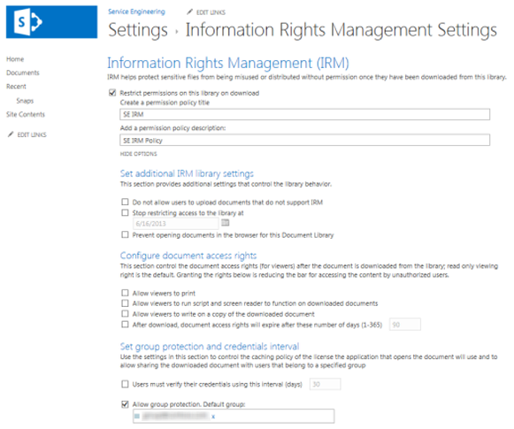

# Applicazione di Information Rights Management (IRM) a un elenco o a una raccoltaApply Information Rights Management (IRM) to a list or library

È possibile utilizzare Information Rights Management (IRM) per controllare e proteggere i file scaricati da elenchi o raccolte.You can use Information Rights Management (IRM) to help control and protect files that are downloaded from lists or libraries.
  
## Informazioni preliminariBefore you begin

- Il servizio Azure Rights Management (Azure RMS) di Azure Information Protection e l'equivalente locale, Active Directory Rights Management Services (AD RMS), supportano Information Rights Management per i siti. Non sono necessarie installazioni separate o aggiuntive.The Azure Rights Management service (Azure RMS) from Azure Information Protection, and the on-premises equivalent, Active Directory Rights Management Services (AD RMS), support Information Rights Management for sites. No separate or additional installations are required.
    
- Prima di applicare IRM a un elenco o a una raccolta, è necessario che sia abilitato per la prima volta da un amministratore del sito.Before you apply IRM to a list or library it must first be enabled by an administrator for your site.
    
- Per applicare IRM a un elenco o a una raccolta, è necessario disporre delle autorizzazioni di amministratore per l'elenco o la raccolta.To apply IRM to a list or library, you must have administrator permissions for that list or library.
    
- Se si utilizza SharePoint Online, è possibile che gli utenti verifichino timeout durante il download di file protetti con IRM di grandi dimensioni. In questo caso, applicare la protezione IRM tramite le applicazioni di Office e archiviare file di grandi dimensioni in una raccolta di SharePoint che non utilizza IRM.If you are using SharePoint Online, your users might experience timeouts when downloading larger IRM-protected files. If this happens, then apply IRM protection by using your Office programs, and store larger files in a SharePoint library that does not use IRM.
    
> [!NOTE]
> Se si utilizza SharePoint Server 2013, è necessario che un amministratore del server installi protettori su tutti i server Web front-end per ogni tipo di file che gli utenti dell'organizzazione desiderano proteggere tramite IRM.If you're using SharePoint Server 2013, a server administrator must install protectors on all front-end Web servers for every file type that the people in your organization want to protect by using IRM. 
  
## Applicazione di IRM a un elenco o a una raccoltaApply IRM to a list or library

  
1. Passare all'elenco o alla raccolta per cui si desidera configurare IRM.Go to the list or library for which you want to configure IRM.
    
2. Sulla barra multifunzione fare clic sulla scheda **raccolta** e quindi su **Impostazioni raccolta**. Se si utilizza un elenco, fare clic sulla scheda **elenco** e quindi su **Impostazioni elenco**.On the ribbon, click the **Library** tab, and then click **Library Settings**. (If you are working in a list, click the **List** tab, and then click **List Settings**).
    
    
  
3. In **autorizzazioni e gestione**fare clic su **Information Rights Management**. Se il collegamento Information Rights Management non è visualizzato, IRM potrebbe non essere abilitato per il sito. Contattare l'amministratore del server per verificare se è possibile abilitare IRM per il sito. Il collegamento Information Rights Management non è visualizzato per le raccolte immagini.Under **Permissions and Management**, click **Information Rights Management**. If the Information Rights Management link does not appear, IRM might not be enabled for your site. Contact your server administrator to see if it is possible to enable IRM for your site. The Information Rights Management link does not appear for picture libraries.
    
4. Nella pagina **impostazioni di Information Rights Management** selezionare la casella di controllo **limitare l'autorizzazione per i documenti in questa raccolta** per applicare le autorizzazioni limitate ai documenti scaricati dall'elenco o dalla raccolta.On the **Information Rights Management Settings** page, select the **Restrict permission to documents in this library on download** check box to apply restricted permission to documents that are downloaded from this list or library. 
    
5. Nella casella **Crea un titolo** per i criteri di autorizzazione digitare un nome descrittivo per il criterio che è possibile utilizzare in un secondo momento per differenziare questo criterio da altri criteri. Ad esempio, è possibile digitare **Confidential Company** se si sta applicando un'autorizzazione limitata a un elenco o a una raccolta che conterrà documenti aziendali riservati.In the **Create a permission policy title** box, type a descriptive name for the policy that you can use later to differentiate this policy from other policies. For example, you can type **Company Confidential** if you are applying restricted permission to a list or library that will contain company documents that are confidential. 
    
6. Nella casella di testo **Aggiungi una** descrizione per i criteri di autorizzazione digitare una descrizione che verrà visualizzata agli utenti che utilizzano l'elenco o la raccolta che spiega come gestire i documenti in questo elenco o nella raccolta. Ad esempio, è possibile digitare **Discuti il contenuto del documento solo con altri dipendenti** se si desidera limitare l'accesso alle informazioni contenute in questi documenti ai dipendenti interni.In the **Add a permission policy description** box, type a description that will appear to people who use this list or library that explains how they should handle the documents in this list or library. For example, you can type **Discuss the contents of this document only with other employees** if you want to restrict access to the information in these documents to internal employees. 
    
7. Per applicare ulteriori restrizioni ai documenti presenti in questo elenco o raccolta, fare clic su **Mostra opzioni**e quindi eseguire una delle operazioni seguenti:To apply additional restrictions to the documents in this list or library, click **Show Options**, and do any of the following:
    
|**Per eseguire questa operazione:****To do this:**|**Procedere come segue:****Do this:**|
|:-----|:-----|
|Consenti agli utenti di stampare documenti da questo elenco o dalla raccoltaAllow people to print documents from this list or library    |Selezionare la casella **di controllo Consenti stampa visualizzatori** .Select the **Allow viewers to print** check box.    |
|Consentire alle persone con almeno l'autorizzazione Visualizza elementi di eseguire codice incorporato o macro in un documento.Allow people with at least the View Items permission to run embedded code or macros on a document.    |Selezionare la casella di controllo **Consenti agli utenti di eseguire lo script e il lettore schermo per funzionare nei documenti scaricati** .Select the **Allow viewers to run script and screen reader to function on downloaded documents** check box.    Se si seleziona questa opzione, gli utenti potrebbero eseguire codice per estrarre il contenuto di un documento.If you select this option, users could run code to extract the contents of a document.           |
|Richiedere che gli utenti verifichino le proprie credenziali a intervalli specifici.Require that people verify their credentials at specific intervals.    Selezionare questa opzione se si desidera limitare l'accesso al contenuto a un determinato periodo di tempo. Se si seleziona questa opzione, le licenze di pubblicazione degli utenti per accedere al contenuto scadranno dopo il numero di giorni specificato e gli utenti saranno tenuti a tornare al server per verificare le credenziali e scaricare una nuova copia.Select this option if you want to restrict access to content to a specified period of time. If you select this option, people's issuance licenses to access the content will expire after the specified number of days, and people will be required to return to the server to verify their credentials and download a new copy.    |Selezionare la casella di controllo **intervalli (giorni) per gli utenti devono verificare le proprie credenziali** e quindi specificare il numero di giorni per cui si desidera visualizzare il documento.Select the **Users must verify their credentials using this interval (days)** check box, and then specify the number of days for which you want the document to be viewable.    |
| Impedire agli utenti di caricare documenti che non supportano IRM nell'elenco o nella raccolta.Prevent people from uploading documents that do not support IRM to this list or library.     Se si seleziona questa opzione, gli utenti non saranno in grado di caricare uno dei tipi di file seguenti:If you select this option, people will not be able to upload any of the following file types:     I tipi di file che non dispongono di protettori IRM corrispondenti sono installati in tutti i server Web front-end.File types that do not have corresponding IRM protectors installed on all of the front-end Web servers.     Tipi di file che SharePoint Server 2010 non è in grado di decrittografare.File types that SharePoint Server 2010 cannot decrypt.     Tipi di file che sono protetti da IRM in un altro programmaFile types that are IRM protected in another program    |Selezionare la casella di controllo non **consentire agli utenti di caricare i documenti che non supportano IRM** .Select the **Do not allow users to upload documents that do not support IRM** check box.    |
|Rimuovere le autorizzazioni limitate dall'elenco o dalla raccolta in base a una data specifica.Remove restricted permissions from this list or library on a specific date.    |Selezionare la casella di controllo Interrompi la **limitazione dell'accesso alla raccolta** e quindi selezionare la data desiderata.Select the **Stop restricting access to the library at** check box, and then select the date that you want.    |
|Controllare l'intervallo di memorizzazione nella cache delle credenziali per il programma concesso in licenza per l'apertura del documento.Control the interval that credentials are cached for the program that is licensed to open the document.    |Nell' **intervallo imposta protezione e credenziali di gruppo**immettere theinterval per le credenziali di memorizzazione nella cache in numero di giorni.In the **Set group protection and credentials interval**, enter theinterval for caching credentials in number of days.    |
|Consenti protezione di gruppo in modo che gli utenti possano condividerli con i membri dello stesso gruppo.Allow group protection so that users can share with members of the same group.    |Selezionare **Consenti protezione gruppo**e immettere il nome del gruppo per la condivisione.Select **Allow group protection**, and enter the group's name for sharing.    |
   
8. Dopo aver selezionato le opzioni desiderate, fare clic su **OK**.After you finish selecting the options you want, click **OK**.
  
## Che cos'è Information Rights Management?What is Information Rights Management?

Information Rights Management (IRM) consente di limitare le operazioni che gli utenti possono eseguire sui file scaricati da elenchi o raccolte. IRM consente di crittografare i file scaricati e limita l'insieme di utenti e programmi autorizzati a decrittografare tali file. IRM può anche limitare i diritti degli utenti autorizzati a leggere i file in modo che non possano intraprendere azioni come la stampa di copie dei file o la copia di testo da essi.Information Rights Management (IRM) enables you to limit the actions that users can take on files that have been downloaded from lists or libraries. IRM encrypts the downloaded files and limits the set of users and programs that are allowed to decrypt these files. IRM can also limit the rights of the users who are allowed to read files, so that they cannot take actions such as print copies of the files or copy text from them.
  
È possibile utilizzare IRM in elenchi o raccolte per limitare la diffusione di contenuto riservato. Se ad esempio si sta creando una raccolta documenti per condividere informazioni sui prodotti imminenti con rappresentanti di marketing selezionati, è possibile utilizzare IRM per impedire a tali utenti di condividere questo contenuto con altri dipendenti dell'azienda.You can use IRM on lists or libraries to limit the dissemination of sensitive content. For example, if you are creating a document library to share information about upcoming products with selected marketing representatives, you can use IRM to prevent these individuals from sharing this content with other employees in the company.
  
In un sito, è possibile applicare IRM a un intero elenco o raccolta anziché a singoli file. In questo modo è più facile garantire un livello di protezione omogeneo per un intero insieme di documenti o file. IRM può quindi aiutare l'organizzazione a applicare i criteri aziendali che regolano l'utilizzo e la divulgazione di informazioni riservate o proprietarie.On a site, you apply IRM to an entire list or library, rather than to individual files. This makes it easier to ensure a consistent level of protection for an entire set of documents or files. IRM can thus help your organization to enforce corporate policies that govern the use and dissemination of confidential or proprietary information.
  
> [!NOTE]
> Le informazioni contenute in questa pagina per informazioni su Information Rights Management sostituiscono qualsiasi termine che fa riferimento a' Information Rights Management ' nei contratti di licenza di Microsoft SharePoint Server 2013 e SharePoint Server 2016.The information on this page regarding Information Rights Management supersedes any terms that reference 'Information Rights Management' in any Microsoft SharePoint Server 2013 and SharePoint Server 2016 license term agreements. 
  
### Informazioni su come IRM può contribuire alla protezione del contenutoHow IRM can help protect content

IRM consente di proteggere il contenuto limitato nei modi seguenti:IRM helps to protect restricted content in the following ways:
  
- Consente di impedire a un visualizzatore autorizzato la copia, la modifica, la stampa, l'invio di fax o la copia e incolla del contenuto per l'utilizzo non autorizzatoHelps to prevent an authorized viewer from copying, modifying, printing, faxing, or copying and pasting the content for unauthorized use
    
- Consente di impedire a un visualizzatore autorizzato di copiare il contenuto utilizzando la funzionalità Stampa schermo in Microsoft WindowsHelps to prevent an authorized viewer from copying the content by using the Print Screen feature in Microsoft Windows
    
- Consente di impedire a un visualizzatore non autorizzato di visualizzare il contenuto se viene inviato in un messaggio di posta elettronica dopo che è stato scaricato dal serverHelps to prevent an unauthorized viewer from viewing the content if it is sent in e-mail after it is downloaded from the server
    
- Limita l'accesso al contenuto a un determinato periodo di tempo, dopo il quale gli utenti devono confermare le proprie credenziali e scaricare di nuovo il contenuto.Restricts access to content to a specified period of time, after which users must confirm their credentials and download the content again
    
- Consente di applicare i criteri aziendali che regolano l'utilizzo e la divulgazione dei contenuti all'interno dell'organizzazioneHelps to enforce corporate policies that govern the use and dissemination of content within your organization
    
### Informazioni su come IRM non è in grado di proteggere il contenutoHow IRM cannot help protect content

IRM non è in grado di proteggere il contenuto limitato dai seguenti elementi:IRM cannot protect restricted content from the following:
  
- Cancellazione, furto, acquisizione o trasmissione da parte di programmi dannosi, ad esempio cavalli di cavallo, logger di tasti e alcuni tipi di spywareErasure, theft, capture, or transmission by malicious programs such as Trojan horses, keystroke loggers, and certain types of spyware
    
- Perdita o danneggiamento a causa delle azioni dei virus informaticiLoss or corruption because of the actions of computer viruses
    
- Copia manuale o ridigitazione del contenuto dalla visualizzazione su schermoManual copying or retyping of content from the display on a screen
    
- Fotografia digitale o cinematografica del contenuto visualizzato in uno schermoDigital or film photography of content that is displayed on a screen
    
- Copia tramite l'utilizzo di programmi di acquisizione schermo di terze partiCopying through the use of third-party screen-capture programs
    
- Copia dei metadati del contenuto (valori di colonna) tramite l'utilizzo di programmi di acquisizione schermo di terze parti o di un'azione copia e incollaCopying of content metadata (column values) through the use of third-party screen-capture programs or copy-and-paste action
    
[Applicare Information Rights Management a un elenco o a una raccoltaApply Information Rights Management to a list or library](https://support.office.com/article/6714cfe3-ef39-43b0-bb65-a887726bb63c)
  
## Funzionamento di IRM per elenchi e raccolteHow IRM works for lists and libraries

La protezione IRM viene applicata ai file a livello di elenco o di raccolta. Quando IRM è abilitato per una raccolta, Rights Management si applica a tutti i file della raccolta. Quando IRM è abilitato per un elenco, Rights Management si applica solo ai file associati a voci di elenco e non alle voci di elenco effettive.IRM protection is applied to files at the list or library level. When IRM is enabled for a library, rights management applies to all of the files in that library. When IRM is enabled for a list, rights management applies only to files that are attached to list items, not the actual list items.
  
Quando gli utenti scaricano i file in un elenco o in una raccolta abilitata per IRM, i file vengono crittografati in modo che solo le persone autorizzate possano visualizzarle. Ogni file con diritti gestiti contiene anche una licenza di pubblicazione che impone restrizioni agli utenti che visualizzano il file. Le restrizioni tipiche includono l'esecuzione di un file di sola lettura, la disattivazione della copia del testo, impedire agli utenti di salvare una copia locale e impedire agli utenti di stampare il file. I programmi client in grado di leggere i tipi di file supportati da IRM utilizzano la licenza di pubblicazione all'interno del file Rights-Managed per applicare queste restrizioni. Questo è il modo in cui un file con diritti gestiti conserva la propria protezione anche dopo che è stato scaricato dal server.When people download files in an IRM-enabled list or library, the files are encrypted so that only authorized people can view them. Each rights-managed file also contains an issuance license that imposes restrictions on the people who view the file. Typical restrictions include making a file read-only, disabling the copying of text, preventing people from saving a local copy, and preventing people from printing the file. Client programs that can read IRM-supported file types use the issuance license within the rights-managed file to enforce these restrictions. This is how a rights-managed file retains its protection even after it is downloaded from the server.
  
I tipi di restrizioni applicati a un file quando vengono scaricati da un elenco o da una raccolta si basano sulle autorizzazioni dei singoli utenti nel sito che contiene il file. Nella tabella seguente viene illustrato il modo in cui le autorizzazioni per i siti corrispondono alle autorizzazioni IRM.The types of restrictions that are applied to a file when it is downloaded from a list or library are based on the individual user's permissions on the site that contains the file. The following table explains how the permissions on sites correspond to IRM permissions.
  
|**Autorizzazioni****Permissions**|**Autorizzazioni IRM****IRM Permissions**|
|:-----|:-----|
|Gestione delle autorizzazioni, gestione sito WebManage Permissions, Manage Web Site    |**Controllo completo** (come definito dal programma client): questa autorizzazione consente in genere a un utente di leggere, modificare, copiare, salvare e modificare le autorizzazioni per il contenuto protetto.**Full control** (as defined by the client program): This permission generally allows a user to read, edit, copy, save, and modify permissions of rights-managed content.    |
|Modifica elementi, gestione elenchi, aggiunta e personalizzazione pagineEdit Items, Manage Lists, Add and Customize Pages    |**Modifica**, **copia**e **Salva**: un utente può stampare un file solo se la casella **di controllo Consenti agli utenti di stampare i documenti** è selezionata nella pagina impostazioni di Information Rights Management per l'elenco o la raccolta.**Edit**, **Copy**, and **Save**: A user can print a file only if the **Allow users to print documents** check box is selected on the Information Rights Management Settings page for the list or library.    |
|Visualizzazione elementiView Items    |**Lettura**: un utente può leggere il documento, ma non è in grado di copiarlo o modificarne il contenuto. Un utente può stampare solo se la casella **di controllo Consenti agli utenti di stampare i documenti** è selezionata nella pagina delle impostazioni di Information Rights Management per l'elenco o la raccolta.**Read**: A user can read the document, but cannot copy or modify its content. A user can print only if the **Allow users to print documents** check box is selected on the Information Rights Management Settings page for the list or library.    |
|AltroOther    |Nessun'altra autorizzazione corrisponde direttamente alle autorizzazioni IRM.No other permissions correspond directly to IRM permissions.    |
   
Quando si abilita IRM per un elenco o una raccolta in SharePoint Server 2013, è possibile proteggere solo i tipi di file nell'elenco o nella raccolta di cui è installato un Protector su tutti i server Web front-end. Un Protector è un programma che controlla la crittografia e la decrittografia dei file con diritti gestiti di un formato di file specifico. SharePoint include protettori per i seguenti tipi di file:When you enable IRM for a list or library in SharePoint Server 2013, you can only protect file types in that list or library for which a protector is installed on all front-end Web servers. A protector is a program that controls the encryption and decryption of rights-managed files of a specific file format. SharePoint includes protectors for the following file types:
  
- Moduli di Microsoft Office InfoPathMicrosoft Office InfoPath forms
    
- Formati di file di 97-2003 per le seguenti applicazioni di Microsoft Office: Word, Excel e PowerPointThe 97-2003 file formats for the following Microsoft Office programs: Word, Excel, and PowerPoint
    
- Formati di Office Open XML per le seguenti applicazioni di Microsoft Office: Word, Excel e PowerPointThe Office Open XML Formats for the following Microsoft Office programs: Word, Excel, and PowerPoint
    
- Formato XML Paper Specification (XPS)The XML Paper Specification (XPS) format
    
Se l'organizzazione prevede di utilizzare IRM per proteggere altri tipi di file oltre a quelli sopra elencati, è necessario che l'amministratore del server installi i protettori per questi formati di file aggiuntivi.If your organization plans to use IRM to protect any other file types in addition to those listed above, your server administrator must install protectors for these additional file formats.
  

