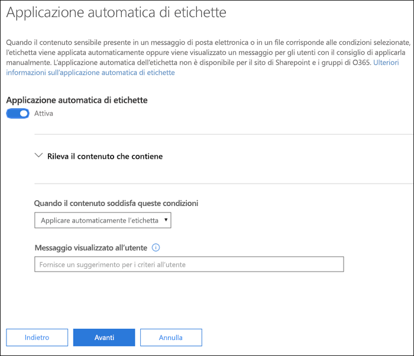
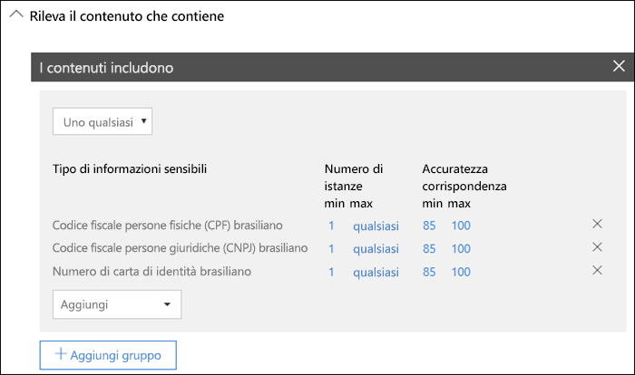
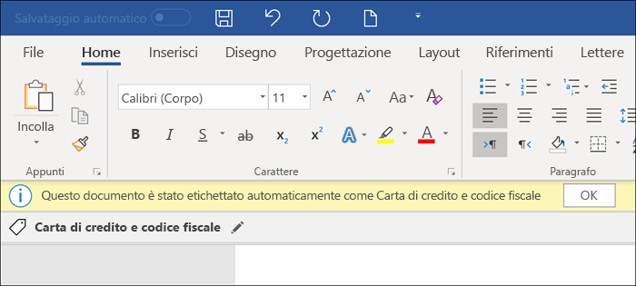
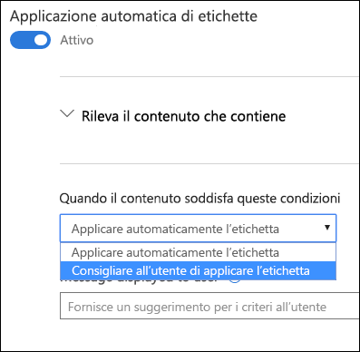
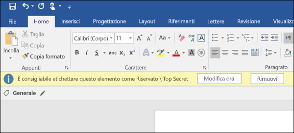

# Applicare automaticamente un'etichetta di riservatezza al contenuto

Quando si crea automaticamente un'etichetta di riservatezza, è possibile assegnarla automaticamente a contenuti che includono informazioni riservate oppure è possibile chiedere agli utenti di applicare l'etichetta consigliata.

La possibilità di applicare automaticamente etichette di riservatezza al contenuto è importante perché:

- Non è necessario formare gli utenti su tutte le classificazioni.

- Non è necessario affidarsi solo agli utenti per la classificazione corretta di tutto il contenuto.

- Gli utenti non hanno più bisogno di conoscere i criteri e possono concentrarsi sul loro lavoro.

> [!NOTE]
> La possibilità di applicare automaticamente le etichette richiede automaticamente una sottoscrizione ad Azure Information Protection P2. A tale scopo, è necessario [scaricare e installare il client di assegnazione delle etichette unificato Azure Information Protection](https://docs.microsoft.com/it-IT/azure/information-protection/rms-client/install-unifiedlabelingclient-app). Microsoft sta lavorando al supporto nativo per questa funzionalità nelle applicazioni di Office, in modo che il client di assegnazione delle etichette unificato Azure Information Protection non sia necessario. In più, il client di assegnazione delle etichette unificato viene eseguito solo in Windows, quindi questa funzionalità non è ancora supportata in Mac, iOS e Android.

## Applicare automaticamente un'etichetta di riservatezza in base alle condizioni

Una delle funzionalità più efficaci delle etichette di riservatezza è la possibilità di applicarle automaticamente al contenuto che soddisfa determinate condizioni. In questo caso, gli utenti dell'organizzazione non dovranno applicare le etichette di riservatezza, perché Office 365 lo farà al loro posto.
   
Si può scegliere di applicare automaticamente le etichette di riservatezza al contenuto se include tipi specifici di informazioni riservate. Quando si configura l'applicazione automatica di un'etichetta di riservatezza, viene visualizzato lo stesso elenco di tipi di informazioni riservate relativo alla creazione di un criterio di prevenzione della perdita di dati. È quindi possibile, ad esempio, applicare automaticamente un'etichetta Estremamente riservato a qualsiasi contenuto che includa informazioni personali dei clienti (PII), ad esempio numeri di carta di credito o numeri di previdenza sociale. 

Dopo aver scelto i tipi di informazioni riservate, è possibile definire la condizione modificando il numero di istanze o l'accuratezza della corrispondenza. Per altre informazioni, vedere [Tuning rules to make them easier or harder to match](data-loss-prevention-policies.md#tuning-rules-to-make-them-easier-or-harder-to-match) (Ottimizzazione delle regole per rendere più facile o difficile la corrispondenza).

È anche possibile scegliere se una condizione deve rilevare tutti i tipi di informazioni riservate o solo uno di essi. Infine, per rendere le condizioni più flessibili o complesse, è possibile aggiungere gruppi e usare gli operatori logici tra i gruppi. Per altre informazioni, vedere [Grouping and logical operators](data-loss-prevention-policies.md#grouping-and-logical-operators) (Raggruppamento e operatori logici).

Quando viene applicata automaticamente un'etichetta di riservatezza, l'utente riceve una notifica nella propria applicazione di Office, quindi potrà scegliere **OK** per chiudere la notifica.

## Consigliare all'utente di applicare un'etichetta di riservatezza

Se si preferisce, invece di applicare automaticamente un'etichetta di riservatezza al contenuto, si può consigliare agli utenti di applicarla. Questa opzione offre agli utenti la flessibilità di accettare la classificazione e l'eventuale protezione associata o di chiudere il suggerimento, se l'etichetta non è adatta al documento o al messaggio di posta elettronica.

Le etichette consigliate sono supportate in Word, PowerPoint ed Excel e richiedono l'installazione del client di etichettatura unificata di Azure Information Protection. Microsoft sta lavorando al supporto per le etichette consigliate in Outlook.

Ecco un esempio di un avviso quando si configura una condizione per applicare un'etichetta come azione consigliata, con un suggerimento per i criteri personalizzati. È possibile scegliere quale testo visualizzare nel suggerimento per i criteri.

## Come vengono applicate le etichette automatiche o consigliate

- L'assegnazione automatica delle etichette si applica a Word, Excel e PowerPoint al salvataggio dei documenti e in Outlook all'invio di messaggi di posta elettronica. Queste condizioni rilevano le informazioni riservate nel corpo del testo nei documenti e nei messaggi di posta elettronica e nelle intestazioni e piè di pagina, ma non nella riga dell'oggetto o negli allegati di posta elettronica.

- Non è possibile usare la classificazione automatica per i documenti e i messaggi di posta elettronica in precedenza etichettati manualmente o associati automaticamente a una classificazione superiore. È possibile applicare una singola etichetta di riservatezza a un documento o un messaggio di posta elettronica (oltre a una singola etichetta di conservazione).

- La classificazione consigliata si applica a Word, Excel e PowerPoint al salvataggio dei documenti. Microsoft sta lavorando al supporto per l'assegnazione di etichette consigliate in Outlook.

- Non è possibile usare la classificazione consigliata per i documenti etichettati in precedenza con una classificazione superiore. In questo caso, quando il contenuto è già stato etichettato con una classificazione superiore, l'utente non visualizzerà l'avviso con il consiglio e il suggerimento per i criteri.

## Modalità di valutazione di più condizioni quando si applicano a più etichette

Le etichette sono ordinate per la valutazione in base alla posizione specificata nei criteri: la prima etichetta ha la posizione più bassa (meno riservata) mentre l'ultima etichetta ha la posizione più alta (più riservata). Per altre informazioni sulla priorità, vedere [Priorità dell’etichetta (l’ordine è importante)](sensitivity-labels.md#label-priority-order-matters).

## Non configurare un'etichetta padre in modo che venga applicata automaticamente o consigliata

Tenere presente che non è possibile applicare al contenuto un'etichetta padre (un'etichetta con sottoetichette). Assicurarsi di non configurare un'etichetta padre in modo che venga applicata automaticamente o consigliata perché le etichette padre non vengono applicate al contenuto in app di Office che usano con il client di assegnazione delle etichette unificato Azure Information Protection. Per ulteriori informazioni sulle etichette padre e sulle sottoetichette, vedere [Sottoetichette (raggruppamento etichette)](sensitivity-labels.md#sublabels-grouping-labels).
