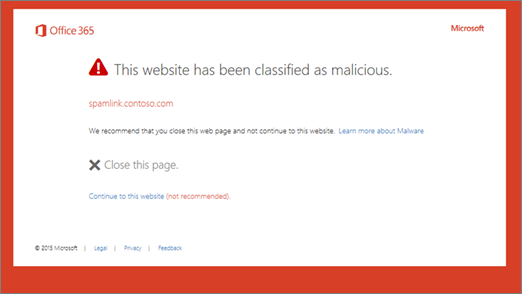

# Pagine di avviso degli strumenti di analisi collegamenti attendibili di Office 365Office 365 ATP Safe Links warning pages

[Protezione di Office 365 rischio avanzate](office-365-atp.md) (Degli strumenti di analisi) contribuisce a proteggere l'organizzazione di tentativi di phishing e malware tramite le funzionalità, ad esempio [Collegamenti sicuro degli strumenti di analisi](atp-safe-links.md), [Gli allegati sicuri degli strumenti di analisi](atp-safe-attachments.md)e [protezione anti - phishing](anti-phishing-protection.md). Una volta protezione sul posto, vengono verificati i collegamenti (URL) in Office documenti e messaggi di posta elettronica. Se un URL viene identificato come potenzialmente dannoso o volontario, potrebbe essere bloccati di aprire l'URL quando si fa clic sopra. Anziché accedere direttamente del sito, è possibile visualizzare una pagina di avviso.[Office 365 Advanced Threat Protection](office-365-atp.md) (ATP) helps protect your organization from phishing attempts and malware through features, such as [ATP Safe Links](atp-safe-links.md), [ATP Safe Attachments](atp-safe-attachments.md), and [anti-phishing protection](anti-phishing-protection.md). When protection is in place, links (URLs) in email messages and Office documents are checked. If a URL is identified as suspicious or malicious, you might be blocked from opening the URL when you click it. Instead of going directly to the site, you might see a warning page instead. 
  
In questo articolo per visualizzare [esempi di pagine di avviso](atp-safe-links-warning-pages.md#examples) che possono essere visualizzate, insieme ai [recenti aggiornamenti alle pagine di avviso](atp-safe-links-warning-pages.md#updates).Read this article to see [Examples of warning pages](atp-safe-links-warning-pages.md#examples) that might appear, along with [Recent updates to warning pages](atp-safe-links-warning-pages.md#updates).
  
## Esempi di pagine di avvisoExamples of warning pages

### Il collegamento scansione degli strumenti di analisiATP is scanning the link

Un URL viene analizzato da collegamenti sicuro degli strumenti di analisi. Potrebbe essere necessario attendere qualche minuto e riprovare a eseguire il collegamento.A URL is being scanned by ATP Safe Links. You might have to wait a few moments to try the link again.

### È un URL in un messaggio di posta elettronica sospettoA URL is in a suspicious email message

L'URL è un messaggio di posta elettronica che sembra simile per altri messaggi di posta elettronica sono considerati potenzialmente dannoso. È consigliabile che si fare doppio clic sul messaggio di posta elettronica prima di procedere al sito.The URL is in an email message that seems similar to other email messages that are considered suspicious. We recommend that you double-check the email message before proceeding to the site.

### È un URL in un messaggio identificato come un tentativo di phishingA URL is in a message identified as a phishing attempt

L'URL è un messaggio di posta elettronica che è stato identificato come un attacco di phishing. Di conseguenza, tutti gli URL nel messaggio di posta elettronica sono bloccati. È consigliabile non procedere al sito.The URL is in an email message that has been identified as a phishing attack. As a result, all URLs in the email message are blocked. We recommend that you do not proceed to the site.

### Un sito è stato identificato come dannosiA site has been identified as malicious

L'URL punta a un sito in cui è stato identificato come dannose.The URL points to a site that has been identified as malicious.    È consigliabile non procedere al sito.We recommend that you do not proceed to the site.

### Un sito è bloccatoA site is blocked

L'URL è bloccata per l'organizzazione. Non vi sono diversi i motivi per cui un URL può essere bloccato. È consigliabile contattare l'amministratore di Office 365 dell'organizzazione.The URL is blocked for your organization. There are several reasons why a URL might be blocked. We recommend that you contact your organization's Office 365 administrator.

### An error has occurredAn error has occurred

Si è verificato un tipo di errore e l'URL può essere aperto.Some kind of error has occurred, and the URL cannot be opened.

## Recenti aggiornamenti alle pagine di avvisoRecent updates to warning pages

Più pagine avviso siano state aggiornate recentemente per strumenti di analisi di Office 365. Se non è già vengono visualizzati le pagine aggiornate, sarà presto disponibili. Gli aggiornamenti includono una nuova combinazione di colori, ulteriori informazioni e la possibilità di passare a un sito nonostante l'avviso e suggerimenti.Several warning pages were recently updated for Office 365 ATP. If you're not already seeing the updated pages, you will soon. The updates include a new color scheme, more details, and the ability to proceed to a site despite the given warning and recommendations.

### Analisi di URL in corsoURL scan in progress

Pagina avviso originale:Original warning page:

Pagina avviso aggiornata:Updated warning page:

### Avviso siti dannosiMalicious site warning

Pagina avviso originale:Original warning page:

Pagina avviso aggiornata:Updated warning page:

### Bloccato Avviso URLBlocked URL warning

Pagina avviso originale:Original warning page:

Pagina avviso aggiornata:Updated warning page:

### "Errore" pagina avviso"Error occurred" warning page

Pagina avviso originale:Original warning page:

Pagina avviso aggiornata:Updated warning page:

   
