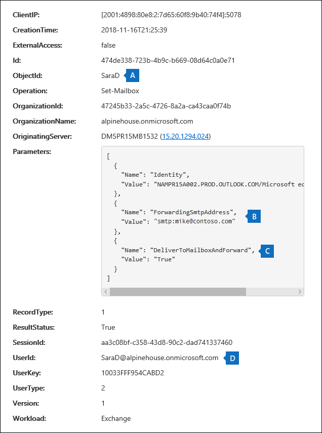

# <a name="search-the-office-365-audit-log-to-troubleshoot-common-scenarios"></a>Eseguire una ricerca nel registro di controllo di Office 365 per la risoluzione dei problemi comuni

In questo articolo viene descritto come utilizzare lo strumento di ricerca del registro di controllo di Office 365 per la risoluzione dei problemi relativi agli scenari di supporto comuni. Ciò include l'utilizzo del log di controllo per:

- Individuare l'indirizzo IP del computer utilizzato per accedere a un account compromesso
- Determinare gli utenti che configurano l'inoltro della posta elettronica per una cassetta postale
- Determinare se un utente ha eliminato gli elementi di posta elettronica nella propria cassetta postale
- Determinare se un utente ha creato una regola di posta in arrivo

## <a name="using-the-office-365-audit-log-search-tool"></a>Utilizzo dello strumento di ricerca del registro di controllo di Office 365

Tutti gli scenari di risoluzione dei problemi descritti in questo articolo si basano sull'utilizzo dello strumento di ricerca del registro di controllo nel centro conformità di Office 365 Security &. In questa sezione sono elencate le autorizzazioni necessarie per eseguire una ricerca nel registro di controllo e vengono descritti i passaggi per accedere alle ricerche del registro di controllo e eseguirle. Ogni sezione scenario fornisce indicazioni specifiche su come configurare una query di ricerca del registro di controllo e su cosa cercare nelle informazioni dettagliate nei record di controllo corrispondenti ai criteri di ricerca.

### <a name="permissions-required-to-use-the-audit-log-search-tool"></a>Autorizzazioni necessarie per l'utilizzo dello strumento di ricerca del registro di controllo

È necessario essere assegnati al ruolo di controllo di sola visualizzazione o ai registri di controllo in Exchange Online per eseguire una ricerca nel registro di controllo di Office 365. Per impostazione predefinita, questi ruoli sono assegnati ai gruppi di ruoli Gestione conformità e gestione organizzazione nella pagina **autorizzazioni** nell'interfaccia di amministrazione di Exchange. Per ulteriori informazioni, vedere [gestire i gruppi di ruoli in Exchange Online](https://go.microsoft.com/fwlink/p/?LinkID=730688).

### <a name="running-audit-log-searches"></a>Esecuzione delle ricerche nei registri di controllo

In questa sezione vengono descritte le nozioni di base per la creazione e l'esecuzione di ricerche nei registri Utilizzare queste istruzioni come punto di partenza per ogni scenario di risoluzione dei problemi in questo articolo. Per istruzioni dettagliate, vedere [Search the audit log in the Office 365 Security _AMP_ Compliance Center ](search-the-audit-log-in-security-and-compliance.md#step-1-run-an-audit-log-search).

1. Passare a [https://protection.office.com](https://protection.office.com).
  
2. Accedere a Office 365 usando l'account aziendale o dell'istituto di istruzione.

3. Nel riquadro sinistro del Centro sicurezza & Compliance fare clic su **Search & Investigation** > **log audit Search**.
    
    Viene visualizzata la pagina di **ricerca del registro di controllo** . 
    
    
  
4. È possibile configurare i criteri di ricerca seguenti. Si noti che ogni scenario di risoluzione dei problemi in questo articolo consiglia informazioni specifiche per la configurazione di questi campi.
    
    a. **Activities** -fare clic sull'elenco a discesa per visualizzare le attività che è possibile cercare. Dopo aver eseguito la ricerca, vengono visualizzati solo i record di controllo per le attività selezionate. Se si seleziona **Mostra risultati per tutte le attività** , verranno visualizzati i risultati di tutte le attività che soddisfano gli altri criteri di ricerca. È inoltre necessario lasciare vuoto questo campo in alcuni degli scenari di risoluzione dei problemi.
    
    b. Data di **inizio** e **Data di fine** : selezionare un intervallo di data e ora per visualizzare gli eventi che si sono verificati entro quel periodo. Gli ultimi sette giorni sono selezionati per impostazione predefinita. La data e l'ora vengono visualizzate in formato UTC (Coordinated Universal Time). L'intervallo di date massimo che è possibile specificare è 90 giorni.

    c. **Users** -fare clic in questa casella e quindi selezionare uno o più utenti per visualizzare i risultati della ricerca. I record di controllo per l'attività selezionata eseguita dagli utenti selezionati in questa casella vengono visualizzati nell'elenco dei risultati. Lasciare vuota questa casella per restituire le voci per tutti gli utenti (e gli account di servizio) nell'organizzazione.
    
    d. **file, cartella o sito** Digitare alcuni o tutti i nomi di file o cartelle per cercare attività relative al file della cartella che contiene la parola chiave specificata. È inoltre possibile specificare un URL di un file o di una cartella. Se si utilizza un URL, accertarsi che il percorso URL completo sia digitato o se si digita solo una parte dell'URL, non includere caratteri o spazi speciali. Lasciare vuota questa casella per restituire le voci per tutti i file e le cartelle nell'organizzazione. Tenere presente che questo campo viene lasciato vuoto in tutti gli scenari di risoluzione dei problemi descritti in questo articolo.
    
5. Fare clic su **Cerca** per eseguire la ricerca utilizzando i criteri di ricerca. 
    
    I risultati della ricerca vengono caricati e, dopo alcuni istanti, vengono visualizzati in **risultati** nella pagina **Ricerca log di controllo** . Ognuna delle sezioni seguenti fornisce indicazioni sulle operazioni da eseguire per individuare lo scenario di risoluzione dei problemi specifico.

    Per ulteriori informazioni sulla visualizzazione, il filtro o l'esportazione dei risultati di ricerca del registro di controllo, vedere:

    - [Visualizzare i risultati della ricerca](search-the-audit-log-in-security-and-compliance.md#step-2-view-the-search-results)
    - [Filtrare i risultati della ricerca](search-the-audit-log-in-security-and-compliance.md#step-3-filter-the-search-results)
    - [Esportare i risultati della ricerca](search-the-audit-log-in-security-and-compliance.md#step-4-export-the-search-results-to-a-file)

## <a name="finding-the-ip-address-of-the-computer-used-to-access-a-compromised-account"></a>Trovare l'indirizzo IP del computer utilizzato per accedere a un account compromesso

L'indirizzo IP corrispondente a un'attività eseguita da qualsiasi utente è incluso nella maggior parte dei record di controllo. Le informazioni sul client utilizzato sono incluse anche nel record di controllo.

Ecco come configurare una query di ricerca del registro di controllo per questo scenario:

**Attività** -se pertinente per il caso, selezionare un'attività specifica da cercare. Per la risoluzione dei problemi relativi agli account compromessi, è consigliabile selezionare l' **utente connesso all'attività della cassetta postale** in **attività Cassetta postale di Exchange**. Questo restituirà i record di controllo che mostrano l'indirizzo IP che è stato utilizzato per l'accesso alla cassetta postale. In caso contrario, lasciare vuoto questo campo per restituire i record di controllo per tutte le attività. 

> [!TIP]
> Se si lascia questo campo vuoto, verranno restituite le attività di **UserLoggedIn** , che è un'attività di Azure Active Directory che indica che un utente ha eseguito l'accesso a un account di Office 365. Utilizzare il filtro nei risultati della ricerca per visualizzare i record di controllo di **UserLoggedIn** .

Data di **inizio** e **Data di fine** : selezionare un intervallo di date applicabile all'indagine.

**Utenti** : se si sta indagando su un account compromesso, selezionare l'utente il cui account è stato compromesso. Questo restituirà i record di controllo per le attività eseguite dall'account utente.

**File, cartella o sito** : lasciare vuoto questo campo.

Dopo aver eseguito la ricerca, l'indirizzo IP di ogni attività viene visualizzato nella colonna **indirizzo IP** nei risultati della ricerca. Fare clic sul record nei risultati della ricerca per visualizzare informazioni più dettagliate sulla pagina a comparsa.

## <a name="determining-who-set-up-email-forwarding-for-a-mailbox"></a>Determinare gli utenti che configurano l'inoltro della posta elettronica per una cassetta postale

Quando l'inoltro della posta elettronica è configurato per una cassetta postale, i messaggi di posta elettronica inviati alla cassetta postale vengono inoltrati a un'altra cassetta postale. I messaggi possono essere inoltrati agli utenti all'interno o all'esterno dell'organizzazione. Quando l'inoltro della posta elettronica è configurato in una cassetta postale, il cmdlet Exchange Online sottostante utilizzato è **Set-Mailbox**.

Ecco come configurare una query di ricerca del registro di controllo per questo scenario:

**Attività** -lasciare vuoto questo campo in modo che la ricerca restituisca i record di controllo per tutte le attività. Questa operazione è necessaria per restituire tutti i record di controllo relativi al cmdlet **Set-Mailbox** .

Data di **inizio** e **Data di fine** : selezionare un intervallo di date applicabile all'indagine.

**Utenti** , a meno che non si stia esaminando un problema di inoltro della posta elettronica per un utente specifico, lasciare vuoto questo campo. Questo ti aiuterà a identificare se l'inoltro della posta elettronica è stato configurato per qualsiasi utente.

**File, cartella o sito** : lasciare vuoto questo campo.

Dopo aver eseguito la ricerca, fare clic su **Filtra risultati** nella pagina dei risultati di ricerca. Nella casella in intestazione colonna **attività** digitare **Set-Mailbox** in modo che vengano visualizzati solo i record di controllo correlati al cmdlet **Set-Mailbox** .


A questo punto, è necessario esaminare i dettagli di ogni record di controllo per determinare se l'attività è correlata all'inoltro della posta elettronica. Fare clic sul record di controllo per visualizzare la pagina dei **Dettagli** dell'icona a comparsa e quindi fare clic su **altre informazioni**. Nella schermata e nelle descrizioni seguenti vengono evidenziate le informazioni che indicano che l'inoltro della posta elettronica è stato impostato sulla cassetta postale.



a. nel campo **ObjectID** , viene visualizzato l'alias della cassetta postale in cui è stato impostato l'inoltro della posta elettronica. Questa cassetta postale viene visualizzata anche nella colonna **elemento** nella pagina dei risultati di ricerca.

b. nel campo **Parameters** , il valore *ForwardingSmtpAddress* indica che la posta elettronica inoltrata è stata impostata sulla cassetta postale. In questo esempio, la posta viene inoltrata all'indirizzo di posta elettronica mike@contoso.com, che si trova all'esterno dell'organizzazione di alpinehouse.onmicrosoft.com.

c. il valore *true* per il parametro *DeliverToMailboxAndForward* indica che una copia del messaggio viene recapitata a Sarad@alpinehouse.onmicrosoft.com *e* viene inoltrata all'indirizzo di posta elettronica specificato dal *ForwardingSmtpAddress *parametro, che in questo esempio è Mike@contoso.com. Se il valore del parametro *DeliverToMailboxAndForward* è impostato su *false*, la posta elettronica viene inoltrata solo all'indirizzo specificato dal parametro *ForwardingSmtpAddress* . Non viene recapitato alla cassetta postale specificata nel campo **ObjectID** .

d. il campo **userid** indica l'utente che ha impostato l'inoltro della posta elettronica sulla cassetta postale specificata nel campo del campo **ObjectID** . Questo utente viene inoltre visualizzato nella colonna **utente** della pagina dei risultati di ricerca. In questo caso, sembra che il proprietario della cassetta postale abbia impostato l'inoltro della posta elettronica sulla sua cassetta postale.

Se si determina che l'inoltro della posta elettronica non deve essere impostato sulla cassetta postale, è possibile rimuoverlo eseguendo il comando seguente in PowerShell di Exchange Online:

```
Set-Mailbox <mailbox alias> -ForwardingSmtpAddress $null 
```

Per ulteriori informazioni sui parametri relativi all'inoltro della posta elettronica, vedere l'articolo [Set-Mailbox](https://docs.microsoft.com/powershell/module/exchange/mailboxes/set-mailbox) .

## <a name="determining-if-a-user-deleted-email-items"></a>Determinare se un utente ha eliminato gli elementi di posta elettronica

Prima che i record del registro di controllo relativi agli elementi di posta elettronica eliminati vengano salvati nel log di controllo di Office 365, è necessario abilitare il controllo delle cassette postali per ogni cassetta postale dell'organizzazione. Inoltre, le azioni delle cassette postali di SoftDelete e HardDelete devono essere abilitate per il controllo. Per istruzioni, vedere [abilitare il controllo delle cassette postali in Office 365](enable-mailbox-auditing.md). Se il controllo delle cassette postali è già abilitato per gli utenti, eseguire la procedura seguente per eseguire una ricerca nel registro di controllo per gli eventi relativi agli elementi di posta elettronica eliminati.

Ecco come configurare una query di ricerca del registro di controllo per questo scenario:

**Attività** -in **attività Cassetta postale di Exchange**, selezionare una o entrambe le seguenti attività:

- **Messaggi eliminati dalla cartella Posta eliminata** -questa attività corrisponde all'azione di controllo delle cassette postali di **SoftDelete** . Questa attività viene inoltre registrata quando un utente Elimina definitivamente un elemento selezionandolo e premendo **MAIUSC + CANC**. Dopo l'eliminazione definitiva di un elemento, l'utente può ripristinarlo fino alla scadenza del periodo di conservazione degli elementi eliminati.

- **Messaggi eliminati dalla cassetta postale** -questa attività corrisponde all'azione di controllo delle cassette postali di **HardDelete** . Questa operazione viene registrata quando un utente elimina un elemento dalla cartella elementi ripristinabili. Gli amministratori possono utilizzare lo strumento di ricerca contenuto nel centro conformità di Office 365 Security & per cercare e recuperare gli elementi eliminati finché il periodo di conservazione degli elementi eliminati non scade o più a lungo se la cassetta postale dell'utente è in attesa.

Data di **inizio** e **Data di fine** : selezionare un intervallo di date applicabile all'indagine.

**Utenti** : se si seleziona un utente in questo campo, lo strumento di ricerca del registro di controllo restituirà i record di controllo per gli elementi di posta elettronica eliminati (SoftDeleted o HardDeleted) dall'utente specificato. In alcuni casi, l'utente che elimina un messaggio di posta elettronica potrebbe non essere il proprietario della cassetta postale.

**File, cartella o sito** : lasciare vuoto questo campo.

Dopo aver eseguito la ricerca, è possibile filtrare i risultati della ricerca per visualizzare i record di controllo per gli elementi eliminati temporaneamente o per gli elementi eliminati in modo rigido. Fare clic sul record di controllo per visualizzare la pagina dei **Dettagli** dell'icona a comparsa e quindi fare clic su **altre informazioni**. Ulteriori informazioni sull'elemento eliminato, ad esempio la riga dell'oggetto e la posizione dell'elemento quando è stata eliminata, vengono visualizzate nel campo **AffectedItems** . Nelle schermate seguenti viene mostrato un esempio del campo **AffectedItems** da un elemento eliminato temporaneamente e da un elemento eliminato definitivamente.

**Esempio di campo AffectedItems per l'elemento eliminato temporaneamente**


**Esempio di campo AffectedItems per gli elementi eliminati in modo rigido**


### <a name="recovering-deleted-email-items"></a>Ripristino degli elementi di posta elettronica eliminati

Gli utenti possono recuperare gli elementi eliminati temporaneamente se il periodo di conservazione degli elementi eliminati non è scaduto. In Exchange Online, il periodo di conservazione degli elementi eliminati predefinito è di 14 giorni, ma gli amministratori possono aumentare questa impostazione fino a un massimo di 30 giorni. Indirizzare gli utenti a [recuperare elementi o messaggi di posta elettronica eliminati in Outlook sul Web](https://support.office.com/article/Recover-deleted-items-or-email-in-Outlook-Web-App-C3D8FC15-EEEF-4F1C-81DF-E27964B7EDD4) per istruzioni sul ripristino degli elementi eliminati.

Come spiegato in precedenza, gli amministratori potrebbero essere in grado di recuperare gli elementi eliminati definitivamente se il periodo di conservazione degli elementi eliminati non è scaduto o se la cassetta postale è in attesa, in questo caso gli elementi vengono conservati fino alla scadenza della durata del blocco. Quando si esegue una ricerca di contenuto, gli elementi eliminati temporaneamente e eliminati nella cartella elementi ripristinabili vengono restituiti nei risultati della ricerca se corrispondono alla query di ricerca. Per ulteriori informazioni sull'esecuzione di ricerche di contenuto, vedere [Content search in Office 365](content-search.md).

> [!TIP]
> Per cercare gli elementi di posta elettronica eliminati, cercare tutto o parte della riga dell'oggetto visualizzata nel campo **AffectedItems** del record di controllo.

## <a name="determining-if-a-user-created-an-inbox-rule"></a>Determinare se un utente ha creato una regola di posta in arrivo

Quando gli utenti creano una regola di posta in arrivo per la cassetta postale di Exchange Online, il record di controllo corrispondente viene salvato nel log di controllo. Per ulteriori informazioni sulle regole di posta in arrivo, vedere:

- [Utilizzare le regole di posta in arrivo in Outlook sul Web](https://support.office.com/article/use-inbox-rules-in-outlook-on-the-web-8400435c-f14e-4272-9004-1548bb1848f2)
- [Gestione dei messaggi di posta elettronica in Outlook tramite le regole](https://support.office.com/article/Manage-email-messages-by-using-rules-C24F5DEA-9465-4DF4-AD17-A50704D66C59)

Ecco come configurare una query di ricerca del registro di controllo per questo scenario:

**Attività** -in **attività Cassetta postale di Exchange**, selezionare **New-InboxRule creare/modificare/abilitare/disabilitare la regola di posta in arrivo**.

Data di **inizio** e **Data di fine** : selezionare un intervallo di date applicabile all'indagine.

**Utenti** , a meno che non si stia esaminando un utente specifico, lasciare vuoto questo campo. Ciò consentirà di identificare le nuove regole di posta in arrivo configurate da qualsiasi utente.

**File, cartella o sito** : lasciare vuoto questo campo.

Dopo aver eseguito la ricerca, i record di controllo per questa attività vengono visualizzati nei risultati della ricerca. Fare clic su un record di controllo per visualizzare la pagina dei **Dettagli** del riquadro a comparsa e quindi fare clic su **altre informazioni**. Le informazioni sulle impostazioni delle regole di posta in arrivo vengono visualizzate nel campo **parametri** . Nella schermata e nelle descrizioni seguenti vengono evidenziate le informazioni sulle regole di posta in arrivo.


a. nel campo **ObjectID** viene visualizzato il nome completo della regola di posta in arrivo. Questo nome include l'alias della cassetta postale dell'utente (ad esempio, Sarad) e il nome della regola di posta in arrivo (ad esempio, "move messages from admin").

b. nel campo **Parameters** , viene visualizzata la condizione della regola di posta in arrivo. In questo esempio, la condizione è specificata dal parametro *from* . Il valore definito per il parametro *from* indica che la regola di posta in arrivo agisce sul messaggio di posta elettronica inviato da admin@alpinehouse.onmicrosoft.com. Per un elenco completo dei parametri che possono essere utilizzati per definire le condizioni delle regole di posta in arrivo, vedere l'articolo [New-InboxRule](https://docs.microsoft.com/powershell/module/exchange/mailboxes/new-inboxrule) .

c. il parametro *MoveToFolder* consente di specificare l'azione per la regola di posta in arrivo. in questo esempio, i messaggi ricevuti da admin@alpinehouse.onmicrosoft.com vengono spostati nella cartella denominata *AdminSearch*. Per un elenco completo dei parametri che possono essere utilizzati per definire l'azione di una regola di posta in arrivo, vedere anche l'articolo [New-InboxRule](https://docs.microsoft.com/powershell/module/exchange/mailboxes/new-inboxrule) .

d. il campo **userid** indica l'utente che ha creato la regola di posta in arrivo specificata nel campo **ObjectID** . Questo utente viene inoltre visualizzato nella colonna **utente** della pagina dei risultati di ricerca.