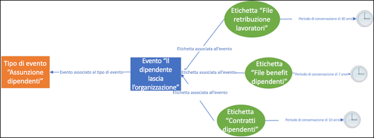
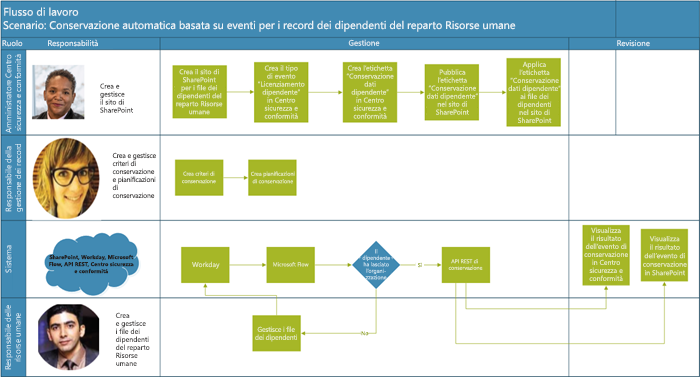
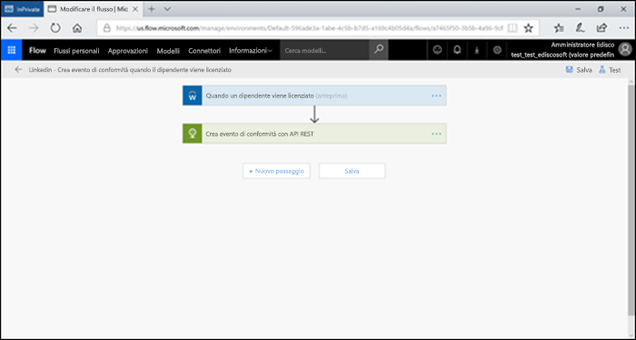
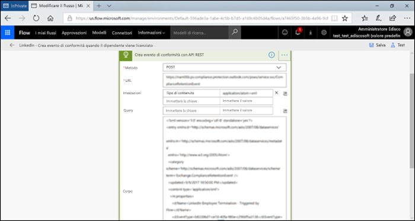
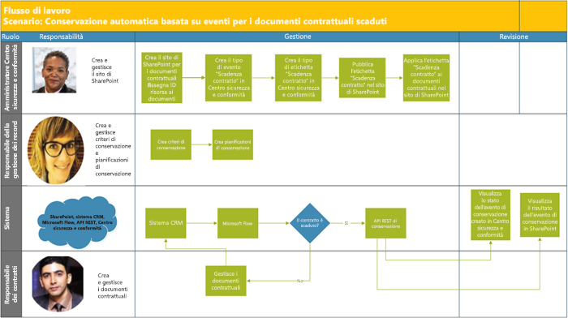
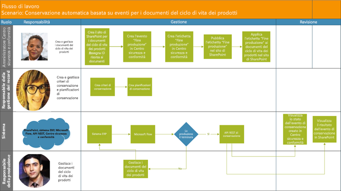

# Automatizzare la conservazione basata su eventi

L'esplosione del contenuto nelle organizzazioni e il modo in cui può diventare ROT (redundant, obsolete, trivial, cioè ridondante, obsoleto e banale), è una cosa seria. Per continuare a soddisfare gli obblighi di conformità normativa, legale e finanziaria, le aziende devono poter conservare e proteggere le informazioni importanti e trovare rapidamente ciò che conta. Conservare solo informazioni importanti e pertinenti è fondamentale per il successo di un'azienda.

Di conseguenza, le organizzazioni possono sfruttare le soluzioni di conservazione nel Centro sicurezza e conformità di Office 365. La conservazione può essere attivata usando [etichette di conservazione](labels.md), che consentono di [basare il periodo di conservazione su un evento specifico](event-driven-retention.md). In genere, il periodo di conservazione si basa su una data nota, come la data di creazione o dell'ultima modifica del contenuto. Tuttavia, le organizzazioni fanno fronte anche a requisiti di smaltimento dei contenuti in base al verificarsi di un evento, ad esempio 7 anni dopo che un dipendente ha lasciato l'azienda.

Per garantire lo smaltimento conforme del contenuto, è fondamentale conoscere la data in cui si verifica un evento. Con il rapido aumento del volume di contenuti, diventa sempre più difficile conservare e smaltire i contenuti in maniera puntuale e conforme.

La conservazione basata sugli eventi è la soluzione a questo problema. Questo argomento illustra come configurare i flussi di processo aziendale in modo da automatizzare la conservazione attraverso gli eventi usando l'API REST di Microsoft 365.

## Informazioni sulla conservazione basata su eventi

Un'organizzazione può avere dimensioni piccole, medie o grandi. Il numero di documenti aziendali e legali, dossier del personale, contratti e documenti sul prodotto che vengono creati e gestiti su base quotidiana è in drastico aumento.

Ad esempio, ogni giorno decine o centinaia di dipendenti entrano a far parte delle organizzazioni o le lasciano. Il reparto Risorse umane continua a creare, aggiornare o eliminare i documenti relativi ai dipendenti in base ai requisiti aziendali. Questo processo è soggetto ai diversi criteri di conservazione indicati per l'azienda:

- **Il periodo di conservazione del contenuto può essere una data nota**, ad esempio la data di creazione, dell'ultima modifica o dell'assegnazione di un'etichetta al contenuto. Ad esempio, si potrebbero conservare documenti per sette anni dalla creazione per poi eliminarli.

- **Il periodo di conservazione del contenuto può essere anche una data sconosciuta**. Ad esempio, con le etichette di conservazione è anche possibile basare anche un periodo di conservazione sul momento in cui si verifica un determinato tipo di evento, ad esempio quando un dipendente lascia l'organizzazione.

L'evento fa scattare l'inizio del periodo di conservazione e tutto il contenuto con un'etichetta applicata per quel tipo di evento riceve le azioni di conservazione dell'etichetta applicate su di esso. È ciò che si intende con conservazione basata sugli eventi. Per altre informazioni, vedere [Panoramica della conservazione basata su eventi](event-driven-retention.md).

## Configurare la conservazione basata su eventi

Questa sezione descrive le operazioni da eseguire prima della conservazione del contenuto.

### Identificare i ruoli

Identificare i ruoli diversi in un'organizzazione che esegue attività di Gestione record, responsabile della conservazione efficace ed efficiente dei documenti aziendali.

  | **Persona**| **Ruolo**|
  | - | - |
  | Amministratore del Centro sicurezza e conformità | Crea tipi di eventi di conservazione, etichette di conservazione e repository dei record in SharePoint |
  | Responsabile della gestione dei record                                  | Fornisce linee guida su criteri di conservazione e pianificazioni della conservazione, oltre a informazioni dettagliate sulla conformità   |
  | Amministratore di sistema (azienda)                          | Configura e gestisce i sistemi esterni in modo da utilizzare Microsoft 365                       |
  | Information Worker                               | Gestisce il ciclo di vita del proprio processo aziendale (risorse umane, finanza, IT ecc.)                 |

### Configurare il Centro sicurezza e conformità
  
1. L'amministratore di conformità crea un tipo di evento, ad esempio Licenziamento dipendente, Scadenza contratto oppure Fine produzione (consultare la procedura dettagliata nell'[articolo sulla conservazione degli eventi](https://docs.microsoft.com/it-IT/office365/securitycompliance/event-driven-retention))
    
1. L'amministratore di conformità crea un'etichetta di conservazione in base a un evento e l'associa a un tipo di evento
    
1. Ci sono 4 tipi di trigger per le etichette di conservazione:
            
    1. Data creazione
                
    1. Data ultima modifica
                
    1. Data etichetta (quando il contenuto è stato etichettato)
                
    1. Basata su eventi
    
1. L'amministratore di conformità pubblica l'etichetta

### Configurare SharePoint
   
Per creare un repository dei record, l'amministratore di conformità deve:

1. Creare un sito di SharePoint.

1. Eseguire una delle operazioni seguenti:
        
    - Creare una raccolta di SharePoint: configurare un'etichetta basata su eventi a livello di raccolta. Per altre informazioni, vedere [Applicazione di un'etichetta di conservazione predefinita a tutto il contenuto in una raccolta, una cartella o un set di documenti di SharePoint](labels.md#applying-a-default-retention-label-to-all-content-in-a-sharepoint-library-folder-or-document-set).
          
    - Configurare un set di documenti in SharePoint. Per altre informazioni, vedere [Introduzione ai set di documenti](https://support.office.com/it-IT/article/Introduction-to-Document-Sets-3DBCD93E-0BED-46B7-B1BA-B31DE2BCD234).
      
1. Assegnare ID risorsa (cioè un nome o codice del prodotto usato dall'organizzazione, ad esempio il numero dipendente) al set di documenti di ogni dipendente. Assegnando l'ID risorsa alla cartella, ogni elemento in essa contenuto eredita automaticamente lo stesso ID risorsa. Ciò significa che è possibile attivare il periodo di conservazione di tutti gli elementi con lo stesso evento.

## Modi per attivare la conservazione basata su eventi

Esistono due modi in cui è possibile attivare la conservazione basata su eventi:

- **Con l'interfaccia utente del Centro sicurezza e conformità**: questo processo può essere utile per conservare meno contenuti contemporaneamente o quando la frequenza di attivazione della conservazione è bassa, ad esempio mensile o annuale. Per altre informazioni su questo metodo, vedere [Panoramica della conservazione basata su eventi](event-driven-retention.md). Questa modalità di attivazione della conservazione può tuttavia comportare tempi eccessivi ed è predisposta all'errore, impedendo così la scalabilità. Di conseguenza, una soluzione semplificata e automatica per attivare la conservazione può migliorare la sicurezza e la conformità dei dati.

- **Con l'API REST di M365**: questo processo è utile quando occorre conservare grandi quantità di contenuto contemporaneamente e/o la frequenza di attivazione della conservazione è alta, ad esempio giornaliera o settimanale. Il flusso rileva il verificarsi di un evento nel sistema line-of-business e crea automaticamente un evento correlato nel Centro di sicurezza e conformità. Non è necessario creare manualmente un evento nell'interfaccia ogni volta che se ne verifica uno.

Sono disponibili due opzioni per usare l'API REST:

- **Microsoft Flow o un'applicazione simile** consente di attivare automaticamente l'occorrenza di un evento. Microsoft Flow è un agente di orchestrazione per la connessione ad altri sistemi. Microsoft Flow non richiede una soluzione personalizzata.

- **PowerShell o un client HTTP per le chiamate all'API REST**: usare PowerShell (versione 6 o successive) per chiamare l'API REST di Microsoft 365 per creare eventi. 

Un'API REST è un endpoint del servizio che supporta i set di operazioni HTTP (metodi), che consentono di creare/recuperare/aggiornare/eliminare l'accesso alle risorse del servizio. Per altre informazioni, vedere [Components of a REST API request/response](https://docs.microsoft.com/it-IT/rest/api/gettingstarted/#components-of-a-rest-api-requestresponse) (Componenti della richiesta-risposta di un'API REST). In questo caso, con le API REST di Microsoft 365, è possibile creare e recuperare eventi con le operazioni (metodi) POST e GET.

## Scenari di esempio

Considerare i seguenti scenari.

### Scenario 1: Dipendenti che lasciano l'organizzazione 

Un'organizzazione crea e archivia per ogni dipendente numerosi documenti che vengono gestiti e conservati durante il rispettivo periodo di impiego. Tuttavia, quando il dipendente lascia l'organizzazione o alla cessazione del rapporto di lavoro, l'organizzazione è obbligata in virtù dei requisiti legali e aziendali a conservare la documentazione relativa al dipendente per un periodo concordato.

Quindi, se più dipendenti lasciassero l'organizzazione ogni giorno, l'organizzazione dovrebbe attivare quotidianamente l'intervallo di conservazione per centinaia o migliaia di documenti.

Oltre a tutto questo, occorre calcolare il periodo di conservazione per ciascun dipendente in base alla formula Data licenziamento dipendente + numero di giorni, mesi o anni in base al tipo di record del dipendente. Ad esempio, il periodo di conservazione dei documenti di assicurazione contro gli infortuni sul lavoro rispetto ai benefit del dipendente potrebbe differire.

Il diagramma seguente mostra come è possibile associare più etichette a un singolo evento. In questo caso, tutti i file con l'etichetta Assicurazione contro gli infortuni sul lavoro e quelli con l'etichetta Benefit dipendenti sono associati a un singolo evento, cioè l'abbandono dell'organizzazione da parte del dipendente. Ciascuno di questi file ha un diverso intervallo di conservazione, perciò quando un dipendente lascia l'organizzazione i file con ciascuna etichetta saranno caratterizzati da un diverso periodo di conservazione. Per attivare i diversi intervalli di conservazione per ogni tipo di file o etichetta per ciascun dipendente è un'attività davvero complessa, figurarsi per più dipendenti.

Di conseguenza, un processo automatizzato per attivare i diversi intervalli di conservazione per più dipendenti consente di risparmiare tempo, è privo di errori ed estremamente efficiente.

**Configurazione della conservazione basata su eventi automatizzata per questo scenario:**

  - L'amministratore crea le cartelle del dipendente nel set di documenti, ad esempio Angela Barbariol, Luca Udinesi.

  - L'amministratore aggiunge i documenti dei dipendenti, ad esempio Benefit, Paghe, Assicurazione contro gli infortuni sul lavoro, a ogni cartella dipendente

  - L'amministratore assegna l'ID risorsa a ogni cartella dipendente. 

  - L'amministratore SCC

  - accede al Centro sicurezza e conformità

  - L'amministratore SCC crea tipi di eventi correlati al dipendente, come "Licenziamento del dipendente", "Assunzione del dipendente", nel Centro sicurezza e conformità.

  - L'amministratore SCC crea l'etichetta "Conservazione dipendente" nel Centro sicurezza e conformità.

  - L'etichetta "Conservazione dipendente" viene pubblicata e applicata manualmente o automaticamente ai documenti dei dipendenti in SharePoint

  - Un sistema di gestione delle risorse umane come Workday può eseguire periodicamente Microsoft Flow per gestire i documenti dei dipendenti

  - Se un dipendente ha lasciato l'organizzazione, Flow attiverà l'API REST di conservazione basata sugli eventi di M365 che avvierà l'intervallo di conservazione nei documenti del dipendente specifico.

#### Uso di Microsoft Flow

Passaggio 1: Creare un flusso per creare un evento usando le API REST di Microsoft 365

##### Creare un evento

Codice di esempio per chiamare l'API REST

<table>
<thead>
<tr class="header">
<th>Metodo</th>
<th>POST</th>
<th></th>
</tr>
</thead>
<tbody>
<tr class="odd">
<td>URL</td>
<td>https://ps.compliance.protection.outlook.com/psws/service.svc/ComplianceRetentionEvent)</td>
<td></td>
</tr>
<tr class="even">
<td>Intestazioni</td>
<td>Content-Type</td>
<td>application/atom+xml</td>
</tr>
<tr class="odd">
<td>Corpo</td>
<td>
&lt;?xml version='1.0' encoding='utf-8' standalone='yes'?&gt;

&lt;entry xmlns:d='http://schemas.microsoft.com/ado/2007/08/dataservices'

xmlns:m='http://schemas.microsoft.com/ado/2007/08/dataservices/metadata'

xmlns='http://www.w3.org/2005/Atom'&gt;

&lt;category scheme='http://schemas.microsoft.com/ado/2007/08/dataservices/scheme' term='Exchange.ComplianceRetentionEvent' /&gt;

&lt;updated&gt;9/9/2017 10:50:00 PM&lt;/updated&gt;

&lt;content type='application/xml'&gt;

&lt;m:properties&gt;

&lt;d:Name&gt;Employee Termination &lt;/d:Name&gt;

&lt;d:EventType&gt;99e0ae64-a4b8-40bb-82ed-645895610f56&lt;/d:EventType&gt;

&lt;d:SharePointAssetIdQuery&gt;1234&lt;/d:SharePointAssetIdQuery&gt;

&lt;d:EventDateTime&gt;2018-12-01T00:00:00Z &lt;/d:EventDateTime&gt;

&lt;/m:properties&gt;

&lt;/content&gt;

&lt;/entry&gt;
</td>
<td></td>
</tr>
<tr class="even">
<td>Autenticazione</td>
<td>Di base</td>
<td></td>
</tr>
<tr class="odd">
<td>Nome utente</td>
<td>“Complianceuser”</td>
<td></td>
</tr>
<tr class="even">
<td>Password</td>
<td>“Compliancepassword”</td>
<td></td>
</tr>
</tbody>
</table>

##### Parametri disponibili

<table>
<thead>
<tr class="header">
<th><strong>Parametri</strong></th>
<th><strong>Descrizione</strong></th>
<th><strong>Note</strong></th>
</tr>
</thead>
<tbody>
<tr class="odd">
<td>&lt;d:Name&gt;&lt;/d:Name&gt;</td>
<td>Immettere un nome univoco per l'evento,</td>
<td>Non può contenere spazi e i caratteri seguenti: % * \ &amp; &lt; &gt; | # ? , : ,</td>
</tr>
<tr class="even">
<td>&lt;d:EventType&gt;&lt;/d:EventType&gt;</td>
<td>Immettere il nome del tipo di evento (o Guid)</td>
<td>Esempio: "Licenziamento dipendente". Il tipo di evento deve essere associato a un'etichetta di conservazione.</td>
</tr>
<tr class="odd">
<td>&lt;d:SharePointAssetIdQuery&gt;&lt;/d:SharePointAssetIdQuery&gt;</td>
<td>Immettere "ComplianceAssetId:" + ID dipendente</td>
<td>Esempio:&quot;ComplianceAssetId:12345&quot;</td>
</tr>
<tr class="even">
<td>&lt;d:EventDateTime&gt;&lt;/d:EventDateTime&gt;</td>
<td>Data e ora evento</td>
<td>
Formato: aaaa-MM-ggTHH:mm:ssZ, esempio:

2018-12-01T00:00:00Z
</td>
</tr>
</tbody>
</table>

##### Codici di risposta

| **Codice di risposta** | **Descrizione**       |
| ----------------- | --------------------- |
| 302               | Reindirizzare              |
| 201               | Creato               |
| 403               | Autorizzazione non riuscita  |
| 401               | Autenticazione non riuscita |

##### Ricevere gli eventi in base all'intervallo di tempo

<table>
<thead>
<tr class="header">
<th>Metodo</th>
<th>GET</th>
<th></th>
</tr>
</thead>
<tbody>
<tr class="odd">
<td>URL</td>
<td><ol start="4" type="1">
<li>
https://ps.compliance.protection.outlook.com/psws/service.svc/ComplianceRetentionEvent?BeginDateTime=2019-01-11&amp;EndDateTime=2019-01-16
</li>
</ol></td>
<td></td>
</tr>
<tr class="even">
<td>Intestazioni</td>
<td>Content-Type</td>
<td>application/atom+xml</td>
</tr>
<tr class="odd">
<td></td>
<td></td>
<td></td>
</tr>
<tr class="even">
<td>Autenticazione</td>
<td>Di base</td>
<td></td>
</tr>
<tr class="odd">
<td>Nome utente</td>
<td>“Complianceuser”</td>
<td></td>
</tr>
<tr class="even">
<td>Password</td>
<td>“Compliancepassword”</td>
<td></td>
</tr>
</tbody>
</table>

##### Codici di risposta

| **Codice di risposta** | **Descrizione**                   |
| ----------------- | --------------------------------- |
| 200               | OK, un elenco di eventi in atom+ xml |
| 404               | Non trovato                         |
| 302               | Reindirizzare                          |
| 401               | Autorizzazione non riuscita              |
| 403               | Autenticazione non riuscita             |

##### Ottenere un evento in base all'ID

| Metodo         | GET   |                      |
| -------------- | ------------------------------------------------------------------------------------------------------------------------------------------------------------------------------------------------------------------------------------------------------------------ | -------------------- |
| URL            | [https://ps.compliance.protection.outlook.com/psws/service.svc/ComplianceRetentionEvent(‘174e9a86-74ff-4450-8666-7c11f7730f66’)](https://ps.compliance.protection.outlook.com/psws/service.svc/ComplianceRetentionEvent\('174e9a86-74ff-4450-8666-7c11f7730f66'\)) |                      |
| Intestazione         | Content-Type                                                                                                                                                                                                                                                       | application/atom+xml |
| Autenticazione | Di base                                                                                                                                                                                                                                                              |                      |
| Nome utente       | “Complianceuser”                                                                                                                                                                                                                                                   |                      |
| Password       | “Compliancepassword”                                                                                                                                                                                                                                               |                      |

##### Codici di risposta

| **Codice di risposta** | **Descrizione**                                      |
| ----------------- | ---------------------------------------------------- |
| 200               | OK, il corpo della risposta contiene l'evento in atom+xml |
| 404               | Non trovato                                            |
| 302               | Reindirizzare                                             |
| 401               | Autorizzazione non riuscita                                 |
| 403               | Autenticazione non riuscita                                |

##### Ottenere un evento in base al nome

| Metodo         | GET       |                      |
| -------------- | -------------------------------------------------------------------------------------------------------------------------------------------- | -------------------- |
| URL            | <https://ps.compliance.protection.outlook.com/psws/service.svc/ComplianceRetentionEvent('EventByRESTPost-2226bfebcc2841a8968ba71f9516b763')> |                      |
| Intestazioni        | Content-Type                                                                                                                                 | application/atom+xml |
| Autenticazione | Di base                                                                                                                                        |                      |
| Nome utente       | “Complianceuser”                                                                                                                             |                      |
| Password       | “Compliancepassword”                                                                                                                         |                      |

##### Codici di risposta

| **Codice di risposta** | **Descrizione**                                      |
| ----------------- | ---------------------------------------------------- |
| 200               | OK, il corpo della risposta contiene l'evento in atom+xml |
| 404               | Non trovato                                            |
| 302               | Reindirizzare                                             |
| 401               | Autorizzazione non riuscita                                 |
| 403               | Autenticazione non riuscita                                |

#### Uso di PowerShell (versione 6 o successiva) o un client HTTP

Passaggio 1: Connettersi a PowerShell.

Passaggio 2: Eseguire lo script seguente.

<table>
<tbody>
<tr class="odd">
<td>
param([string]$baseUri)

$userName = &quot;UserName&quot;

$password = &quot;Password&quot;

$securePassword = ConvertTo-SecureString $password -AsPlainText -Force

$credentials = New-Object System.Management.Automation.PSCredential($userName, $securePassword)

$EventName=&quot;EventByRESTPost-$(([Guid]::NewGuid()).ToString('N'))&quot;

Write-Host &quot;Start to create an event with name: $EventName&quot;

$body = &quot;&lt;?xml version='1.0' encoding='utf-8' standalone='yes'?&gt;

&lt;entry xmlns:d='http://schemas.microsoft.com/ado/2007/08/dataservices'

xmlns:m='http://schemas.microsoft.com/ado/2007/08/dataservices/metadata'

xmlns='http://www.w3.org/2005/Atom'&gt;

&lt;category scheme='http://schemas.microsoft.com/ado/2007/08/dataservices/scheme' term='Exchange.ComplianceRetentionEvent' /&gt;

&lt;updated&gt;7/14/2017 2:03:36 PM&lt;/updated&gt;

&lt;content type='application/xml'&gt;

&lt;m:properties&gt;

&lt;d:Name&gt;$EventName&lt;/d:Name&gt;

&lt;d:EventType&gt;e823b782-9a07-4e30-8091-034fc01f9347&lt;/d:EventType&gt;

&lt;d:SharePointAssetIdQuery&gt;'ComplianceAssetId:123'&lt;/d:SharePointAssetIdQuery&gt;

&lt;/m:properties&gt;

&lt;/content&gt;

&lt;/entry&gt;&quot;

$event = $null

try

{

$event = Invoke-RestMethod -Body $body -Method 'POST' -Uri &quot;$baseUri/ComplianceRetentionEvent&quot; -ContentType &quot;application/atom+xml&quot; -Authentication Basic -Credential $credentials -MaximumRedirection 0

}

catch

{

$response = $_.Exception.Response

if($response.StatusCode -eq &quot;Redirect&quot;)

{

$url = $response.Headers.Location

Write-Host &quot;redirected to $url&quot;

$event = Invoke-RestMethod -Body $body -Method 'POST' -Uri $url -ContentType &quot;application/atom+xml&quot; -Authentication Basic -Credential $credentials -MaximumRedirection 0

}

}

$event | fl *
</td>
</tr>
</tbody>
</table>

#### Verificare il risultato in entrambe le opzioni

Passaggio1: Passare al Centro sicurezza e conformità

Passaggio 2: Scegliere Eventi in Governance dei dati

Passaggio 3: Verificare di aver creato l'evento.

È possibile usare le opzioni precedenti per automatizzare la conservazione basata sugli eventi anche per gli scenari seguenti.

### Scenario 2: Contratti in scadenza

Un'organizzazione può avere più record per un unico contratto con clienti, fornitori e partner. Questi documenti possono trovarsi in una raccolta documenti, ad esempio SharePoint. La fine del contratto determina l'inizio del periodo di conservazione dei documenti associati al contratto. Ad esempio: è necessario conservare tutti i record relativi ai contratti per cinque anni dalla scadenza del contratto. L'evento che attiva il periodo di conservazione di cinque anni è la scadenza del contratto.

Un sistema di Customer Relationship Management (CRM) può interagire con Microsoft 365 per attivare la conservazione dei documenti contrattuali

**Configurazione della conservazione basata su eventi automatizzata per questo scenario:**

  - L'amministratore crea una raccolta di SharePoint con varie cartelle per ogni tipo di contratto.

  - L'amministratore aggiunge i documenti contrattuali, ad esempio Contratti di licenza e Contratti di sviluppo, a ogni cartella di contratto

  - L'amministratore assegna l'ID risorsa a ogni cartella di contratto

  - L'amministratore SCC accede al Centro sicurezza e conformità

  - L'amministratore SCC crea tipi di eventi correlati al contratto, come "Creazione contratto", "Scadenza contratto", nel Centro sicurezza e conformità.

  - L'amministratore SCC crea l'etichetta "Scadenza contratto" nel Centro sicurezza e conformità.

  - L'etichetta "Scadenza contratto" viene pubblicata e applicata manualmente o automaticamente ai documenti contrattuali in SharePoint

  - Il sistema di gestione dei contrati può eseguire periodicamente Microsoft Flow o un'applicazione simile per gestire i documenti contrattuali

  - Se un contratto scade, Microsoft Flow attiverà l'API REST di conservazione basata sugli eventi di M365 che avvierà l'intervallo di conservazione nei documenti del contratto specifico.

### Scenario 3: Fine produzione

Un'impresa che produce diverse linee di prodotti crea molte specifiche di produzione e tariffari. Quando il prodotto esce fuori produzione, tutte le specifiche e i documenti a esso collegati devono essere conservati per un determinato periodo di tempo dopo la fine del ciclo di vita del prodotto.

Un sistema ERP (Enterprise Resource Planning) può utilizzare Microsoft 365 e Microsoft Flow per attivare la conservazione.

**Configurazione della conservazione basata su eventi automatizzata per questo scenario:**

  - L'amministratore crea cartelle del prodotto nel set di documenti, ad esempio Prodotto 1, Prodotto 2, ecc.

  - L'amministratore aggiunge i documenti del prodotto, ad esempio Specifiche di produzione, Prezzi del prodotto, Licenze del prodotto a ogni cartella di prodotto

  - L'amministratore assegna l'ID risorsa a ogni cartella di prodotto.

  - L'amministratore SCC accede al Centro sicurezza e conformità

  - L'amministratore SCC crea tipi di eventi correlati al prodotto, come "Inizio produzione", "Fine produzione", nel Centro sicurezza e conformità.

  - L'amministratore SCC crea l'etichetta "Fine produzione" nel Centro sicurezza e conformità.

  - L'etichetta "Fine produzione" viene pubblicata e applicata manualmente o automaticamente ai documenti del prodotto in SharePoint

  - I sistemi ERP possono eseguire periodicamente Microsoft Flow o applicazioni simili per gestire i documenti del prodotto

  - Se un prodotto esce fuori produzione, Microsoft Flow attiverà l'API REST di conservazione basata sugli eventi di M365 che avvierà l'intervallo di conservazione nei documenti del prodotto specifico.

## Appendice

### Uso dei risultati della risposta Redirect 302 per chiamare l'API REST

1.  Chiamare un evento di conservazione POST usando l'URL dell'API REST <https://ps.compliance.protection.outlook.com/psws/service.svc/ComplianceRetentionEvent> (sono necessarie le autorizzazioni di amministratore globale)

2.  Controllare il codice di risposta. Se è 302, ottenere l'URL reindirizzato dalla proprietà Posizione dell'intestazione della risposta

3.  Chiamare nuovamente l'evento di conservazione POST usando l'URL reindirizzato.

## Riconoscimenti

Questo argomento è stato rivisto da:

Antonio Maio MVP App e servizi di Microsoft Office  Antonio.Maio@Protiviti.com
