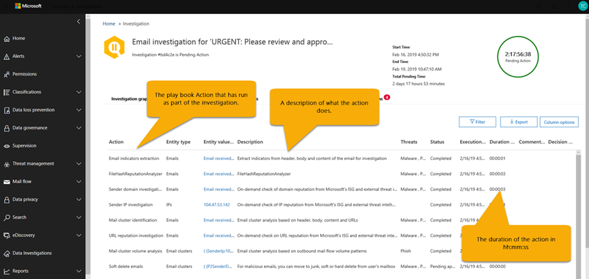

# Indagine automatizzata e risposta (aria) con Office 365Automated Investigation and Response (AIR) with Office 365

Indagine automatizzata e risposta (AIR) (prossimamente a [Office 365 Threat Investigation and response capabilities](office-365-ti.md)) consente di eseguire indagini automatizzate e il risanamento di minacce ben note che esistono oggi.Automated Investigation and Response (AIR) (coming soon to [Office 365 Threat investigation and response capabilities](office-365-ti.md)) enables you to run automated investigation and remediation to well-known threats that exist today. Leggere questo articolo per ottenere una panoramica di AIR e del modo in cui può essere utile per i team delle operazioni di sicurezza e dell'organizzazione attenuare le minacce in modo più efficace ed efficiente.Read this article to get an overview of AIR and how it can help your organization and security operations teams mitigate threats more effectively and efficiently. 

Per ulteriori informazioni su quando saranno disponibili le funzionalità AEREe, vedere la Guida di [orientamento di Microsoft 365](https://www.microsoft.com/microsoft-365/roadmap).To learn more about when  AIR features will be available, see the [Microsoft 365 Roadmap](https://www.microsoft.com/microsoft-365/roadmap).

## AvvisiAlerts

Gli [avvisi](alert-policies.md#viewing-alerts) rappresentano trigger per i flussi di lavoro del team di operazioni di sicurezza per la risposta agli incidenti.[Alerts](alert-policies.md#viewing-alerts) represent triggers for security operations team workflows for incident response. Definire la priorità del set di avvisi appropriato per l'analisi, assicurandosi che non vi siano minacce non indirizzate.Prioritizing the right set of alerts for investigation, while making sure no threats are unaddressed is challenging. Quando le indagini sugli avvisi vengono eseguite manualmente, i team delle operazioni di sicurezza devono cercare e correlare le entità (ad esempio, il contenuto, i dispositivi e gli utenti) a rischio di minacce.When investigations into alerts are performed manually, Security Operations teams must hunt and correlate entities (e.g. content, devices and users) at risk from threats. Tali attività e flussi di lavoro richiedono molto tempo e coinvolgono più strumenti e sistemi.Such tasks and workflows are very time consuming and involve multiple tools and systems. Con AIR, l'analisi e la risposta vengono automatizzate in avvisi chiave per la sicurezza e la gestione delle minacce che attivano automaticamente gli schemi di risposta alla sicurezza.With AIR, investigation and response are automated into key security and threat management alerts that trigger your security response playbooks automatically. 

Nella versione iniziale di AIR del 2019 aprile, gli avvisi generati dai criteri di avviso dei singoli eventi vengono analizzati automaticamente.In the initial release of AIR in April 2019, alerts generated from following single events alert policies will be auto-investigated. 

1. È stato rilevato un clic URL potenzialmente dannosoA potentially malicious URL click was detected
2. Messaggi di posta elettronica segnalati dall'utente come phishing \*Email reported by user as phish\*
3. Messaggi di posta elettronica contenenti malware rimossi dopo il recapito \*Email messages containing malware removed after delivery\*
4. Messaggi di posta elettronica contenenti gli URL di phishing rimossi dopo il recapito \*Email messages containing phish URLs removed after delivery\*

\***Nota**: a questi avvisi è stata assegnata una gravità "informativa" nei rispettivi criteri di avviso all'interno del Centro sicurezza & compliance con notifiche tramite posta elettronica disattivata.\***Note**: These alerts have been assigned an "Informational" severity in the respective alert policies within the Security & Compliance Center with email notifications turned off. Questi possono essere attivati tramite la configurazione dei criteri di avviso.These can be turned on through the Alert policy configuration.

Per visualizzare gli avvisi, nel centro sicurezza & Compliance scegliere **avvisi** > **Visualizza avvisi**.To view alerts, in the Security & Compliance Center, choose **Alerts** > **View alerts**. Selezionare un avviso per visualizzare i dettagli, quindi utilizzare il collegamento **Visualizza analisi** per passare all' [analisi](#investigation-graph)corrispondente.Select an alert to view its details, and from there, use the **View investigation** link to go to the corresponding [investigation](#investigation-graph). Tenere presente che gli avvisi informativi sono nascosti nella visualizzazione avviso per impostazione predefinita.Note that informational alerts are hidden in the alert view by default. Per visualizzarli, è necessario modificare il filtro degli avvisi per includere gli avvisi informativi.To see them, you need to change the alert filtering to include informational alerts.

Se l'organizzazione gestisce gli avvisi di sicurezza tramite un sistema di gestione degli avvisi, un sistema di gestione dei servizi o un sistema di gestione eventi e informazioni di sicurezza, è possibile inviare avvisi di Office 365 a tale sistema tramite notifica tramite posta elettronica o tramite la [ API di attività di gestione di Office 365](https://docs.microsoft.com/office/office-365-management-api/office-365-management-activity-api-reference).If your organization manages your security alerts through a alert management system, service management system, or Security Information and Event Management (SIEM) system, you can send Office 365 alerts to that system via either email notification or via the [Office 365 Management Activity API](https://docs.microsoft.com/office/office-365-management-api/office-365-management-activity-api-reference). Le notifiche di avviso per l'analisi tramite posta elettronica o API includono collegamenti per accedere agli avvisi nel centro conformità di sicurezza &, consentendo all'amministratore della sicurezza assegnato di passare rapidamente all'indagine.The investigation alert notifications via email or API will include links to access the alerts in the Security & Compliance Center, enabling the assigned security administrator to navigate quickly to the investigation.

 

## Schemi di sicurezzaSecurity playbooks

Gli schemi di sicurezza sono criteri di back-end che sono al centro dell'automazione in Microsoft Threat Protection.Security playbooks are back-end policies that are at the heart of automation in Microsoft Threat Protection. Gli schemi di sicurezza forniti in AIR sono basati su scenari comuni di sicurezza del mondo reale.The security playbooks provided in AIR are based on common real-world security scenarios. Un playbook di sicurezza viene avviato automaticamente quando un avviso viene attivato all'interno dell'organizzazione.A security playbook is launched automatically when an alert is triggered within your organization. Dopo che l'avviso è stato attivato, l'oggetto PlayBook associato viene eseguito automaticamente.Once the alert triggers, the associated playbook is run automatically. Il PlayBook esegue un'indagine, esaminando tutti i metadati associati (compresi messaggi di posta elettronica, utenti, soggetti, mittenti e così via).The playbook runs an investigation, looking at all the associated metadata (including email messages, users, subjects, senders, etc.). In base ai risultati del PlayBook, AIR consiglia una serie di azioni che il team di sicurezza dell'organizzazione può intraprendere per controllare e mitigare la minaccia.Based on the playbook's findings, AIR recommends a set of actions that your organization's security team can take to control and mitigate the threat. 

Gli schemi di sicurezza che otterrete con AIR sono studiati per affrontare le minacce più frequenti che le organizzazioni devono affrontare oggi.The security playbooks you'll get with AIR are designed to tackle the most frequent threats that organizations face today. Sono basati sull'input dalle operazioni di sicurezza e dai team di risposta agli incidenti, compresi quelli che aiutano a difendere Microsoft e le risorse dei clienti.They're based on input from Security Operations and Incident Response teams, including those who help defend Microsoft and our customers assets.

### Gli schemi di sicurezza vengono implementati in fasiSecurity playbooks are rolling out in phases

Come parte di AIR, i PlayBook di sicurezza stanno per essere implementati in fasiAs part of AIR, security playbooks are rolling out in phases

- **Fase 1 (2019 aprile)**: i PlayBook includono suggerimenti per le azioni riesaminate e approvate dagli amministratori di sicurezza.**Phase 1 (April 2019)**: Playbooks include recommendations for actions that security administrators review and approve. 

- **Fase 2 (post-giugno 2019)**: miglioramenti al PlayBook, oltre agli amministratori della sicurezza avranno la possibilità di configurare i PlayBook di sicurezza per intraprendere alcune azioni automaticamente senza interazione amministrativa.**Phase 2 (post-June 2019)**: Playbook improvements, plus security administrators will have the option to configure security playbooks to take some actions automatically without administrative interaction.

La fase 1 includerà gli schemi seguenti:Phase 1 will include the following playbooks:
- Messaggio phishing visualizzato dall'utenteUser-reported phish message
- URL fare clic su modifica verdettoURL click verdict change 
- Malware rilevato dopo il recapito (ZAP malware)Malware detected post-delivery (Malware ZAP)
- Phishing rilevato dopo il recapito dello ZAP (phishing ZAP)Phish detected post-delivery ZAP (Phish ZAP)
- Indagini manuali tramite posta elettronica (tramite Esplora minacce)Manual e-mail investigations (using Threat Explorer)

Sono previste diverse altre PlayBook per la fase 2.Several other playbooks are planned for Phase 2.

### I PlayBook includono analisi e suggerimentiPlaybooks include investigation and recommendations

Ogni PlayBook include:Each playbook includes: 
- un'indagine radice,a root investigation, 
- passaggi necessari per identificare e correlare altre potenziali minacce esteps taken to identify and correlate other potential threats, and 
- azioni di correzione delle minacce consigliate.recommended threat remediation actions.

Ogni passaggio di alto livello include numerosi passaggi secondari eseguiti per fornire una risposta profonda, dettagliata ed esaustiva alle minacce.Each high-level step includes many sub-steps that are executed to provide a deep, detailed, and exhaustive response to threats.

## Esempio: un messaggio di phishing riferito dall'utente avvia un playbook di analisiExample: A user-reported phish message launches an investigation playbook

Quando un utente dell'organizzazione invia un messaggio di posta elettronica e lo segnala a Microsoft utilizzando il [componente aggiuntivo per i messaggi di report per Outlook o Outlook Web Access](enable-the-report-message-add-in.md), il report viene inviato anche al sistema ed è visibile in Esplora nella visualizzazione segnalata dall'utente.When a user in your organization submits an email message and reports it to Microsoft by using the [Report Message add-in for Outlook or Outlook Web Access](enable-the-report-message-add-in.md), the report is also sent to your system and is visible in Explorer in the User-reported view. Questo messaggio visualizzato dall'utente ora attiva un avviso informativo basato sul sistema, che avvia automaticamente il PlayBook di analisi.This user-reported message now triggers a system-based informational alert, which automatically launches the investigation playbook.

Durante la fase di analisi radice, vengono valutati vari aspetti del messaggio di posta elettronica.During the root investigation phase, various aspects of the email are assessed. Queste funzionalità sono:These include:
- Determinazione del tipo di minaccia che potrebbe essere;A determination about what type of threat it might be;
- Chi lo ha inviato;Who sent it;
- In cui è stato inviato il messaggio di posta elettronica (infrastruttura di invio);Where the email was sent from (sending infrastructure);
- Se sono state recapitate o bloccate altre istanze del messaggio di posta elettronica;Whether other instances of the email were delivered or blocked;
- Una valutazione dei nostri analisti;An assessment from our analysts;
- Se il messaggio di posta elettronica è associato a qualsiasi campagna Nota;Whether the email is associated with any known campaigns;
- e altro ancora.and more.

Dopo aver completato l'analisi radice, il PlayBook fornisce un elenco delle azioni consigliate da intraprendere sul messaggio di posta elettronica originale e le entità ad esso associate.After the root investigation is complete, the playbook provides a list of recommended actions to take on the original email and entities associated with it.
  
Successivamente, vengono eseguiti diversi passaggi di indagine e di ricerca di minacce:Next, several threat investigation and hunting steps are executed:

- Vengono ricercati messaggi di posta elettronica simili in altri cluster di posta elettronica.Similar email messages in other email clusters are searched.
- Il segnale viene condiviso con altre piattaforme, ad esempio [Windows Defender ATP](https://docs.microsoft.com/windows/security/threat-protection/windows-defender-atp/windows-defender-advanced-threat-protection).The signal is shared with other platforms, such as [Windows Defender ATP](https://docs.microsoft.com/windows/security/threat-protection/windows-defender-atp/windows-defender-advanced-threat-protection).
- Si determina se gli utenti hanno fatto clic su eventuali collegamenti dannosi nei messaggi di posta elettronica sospetti.A determination is made on whether any users have clicked through any malicious links in suspicious email messages.
- Viene effettuato un controllo in Office 365 Exchange Online Protection ([EOP](eop/exchange-online-protection-eop.md)) e Office 365 Advanced Threat Protection ([ATP](office-365-atp.md)) per verificare se sono presenti altri messaggi simili segnalati dagli utenti.A check is done across Office 365 Exchange Online Protection ([EOP](eop/exchange-online-protection-eop.md)) and Office 365 Advanced Threat Protection ([ATP](office-365-atp.md)) to see if there are any other similar messages reported by users.
- Viene effettuato un controllo per verificare se un utente è stato compromesso.A check is done to see if a user has been compromised. Questa verifica utilizza i segnali di [Microsoft cloud app Security](https://docs.microsoft.com/cloud-app-security) e [Azure Active Directory](https://docs.microsoft.com/azure/active-directory), correlando eventuali anomalie relative all'attività degli utenti.This check leverages signals across [Microsoft Cloud App Security](https://docs.microsoft.com/cloud-app-security) and [Azure Active Directory](https://docs.microsoft.com/azure/active-directory), correlating any related user activity anomalies. 

Durante la fase di caccia, i rischi e le minacce sono assegnati a vari passaggi di caccia.During the hunting phase, risks and threats are assigned to various hunting steps. 

La correzione è la fase finale del PlayBook.Remediation is the final phase of the playbook. Durante questa fase, vengono eseguite le operazioni di correzione, in base alle fasi di ricerca e caccia.During this phase, remediation steps are taken, based on the investigation and hunting phases. 

## Esempio: un amministratore della sicurezza attiva un'indagine da Esplora minacceExample: A security administrator triggers an investigation from Threat Explorer

Oltre alle indagini automatiche attivate da un avviso, il team delle operazioni di sicurezza dell'organizzazione può attivare un'analisi automatica da una visualizzazione in [Esplora minacce](use-explorer-in-security-and-compliance.md).In addition to automatic investigations that are triggered by an alert, your organization's security operations team can trigger an automatic investigation from a view in [Threat Explorer](use-explorer-in-security-and-compliance.md).

Si supponga, ad esempio, di visualizzare i dati in Esplora informazioni sui messaggi segnalati dall'utente.For example, suppose that you are viewing data in Explorer about user-reported messages. È possibile selezionare un elemento nell'elenco dei risultati e quindi fare clic su **indaga**.You can select an item in the list of results, and then click **Investigate**.

Come un altro esempio, si supponga di visualizzare i dati relativi ai messaggi di posta elettronica rilevati come contenenti malware e che sono stati rilevati diversi messaggi di posta elettronica come contenenti malware.As another example, suppose you are viewing data about email messages detected as containing malware, and there are several email messages detected as containing malware. È possibile selezionare la scheda **posta elettronica** , selezionare uno o più messaggi di posta elettronica e quindi scegliere **indaga**dal menu **azioni** .You can select the **Email** tab, select one or more email messages, and then, on the **Actions** menu, select **Investigate**. 

Analogamente ai PlayBook attivati da un avviso, le indagini automatiche che vengono attivate da una visualizzazione in Esplora risorse includono un'analisi radice, procedure per identificare e correlare le minacce e le azioni consigliate per attenuare tali minacce.Similar to playbooks triggered by an alert, automatic investigations that are triggered from a view in Explorer include a root investigation, steps to identify and correlate threats, and recommended actions to mitigate those threats.

## Attività inizialiGet started

Per accedere alle indagini, come un amministratore globale di Office 365, un amministratore della sicurezza o un lettore di sicurezza, passare al centro sicurezza &[https://protection.office.com](https://protection.office.com)Compliance () ed eseguire l'accesso.To access your investigations, as an Office 365 global administrator, security administrator, or security reader, go to the Security & Compliance Center ([https://protection.office.com](https://protection.office.com)) and sign in. Eseguire una delle operazioni seguenti:Then, do one of the following:

- Nella barra di spostamento a sinistra, \*\*\*\* > passare a avvisi**visualizzazione**avvisi, aprire uno degli avvisi correlati all'analisi, quindi fare clic sul collegamento **Visualizza analisi** nella parte inferiore del riquadro a comparsa di avviso.In the left navigation, go to **Alerts** > **View alerts**, open one of the investigation related alerts, then click the **View investigation** link at the bottom of the alert flyout. 

    oppureor

- Nella barra di spostamento a sinistra, andare a > **indagini**sulla **gestione delle minacce**.In the left navigation, go to **Threat management** > **Investigations**.

    oppureor

- Visitare il dashboard di gestione delle minacce (nel centro sicurezza e conformità di &, accedere a **Threat Management** > **Dashboard**).Visit the Threat management dashboard (In the Security & Compliance Center, go to **Threat management** > **Dashboard**).

I widget aria verranno visualizzati nella parte superiore del dashboard di [sicurezza](security-dashboard.md).Your AIR widgets will appear across the top of the [Security Dashboard](security-dashboard.md). Selezionare un widget per iniziare.Select a widget to get started.

È inoltre possibile accedere a un'indagine direttamente dagli avvisi correlati.You may also access an investigation directly from the related Alerts.

### Indagini automatizzateAutomated investigations

Nella pagina indagini automatizzate vengono visualizzate le indagini dell'organizzazione e gli stati correnti.The automated investigations page shows your organization's investigations and their current states.

 
  
È possibile:You can:
- Passare direttamente a un'indagine (selezionare un **ID di ricerca**).Navigate directly to an investigation (select an **Investigation ID**).
- Applicare filtri.Apply filters. Scegliere tra il **tipo di analisi**, l'intervallo di **tempo**, **lo stato**o una combinazione di questi.Choose from **Investigation Type**, **Time range**, **Status**, or a combination of these.
- Esportare i dati in un file CSV.Export the data to a CSV file.

Lo stato dell'indagine indica lo stato di avanzamento dell'analisi e delle azioni.The investigation status indicates the progress of the analysis and actions. Durante l'esecuzione dell'indagine, lo stato cambierà per indicare se sono state trovate minacce e indicare se le azioni sono state approvate.As the investigation runs, the status will change to indicate whether threats were found, as well as indicate whether actions have been approved. 
- **Inizio**: l'analisi viene accodata per iniziare a breve**Starting**: The investigation is queued to begin soon
- **Running**: l'inchiesta è iniziata e sta conducendo la propria analisi**Running**: The investigation has started and is conducting its' analysis
- **Non sono state trovate minacce**: l'inchiesta ha completato l'analisi e non sono state trovate minacce**No Threats Found**: The investigation has completed its' analysis and no threats were found
- **Terminato dal sistema**: l'inchiesta non è stata chiusa ed è scaduta dopo 7 giorni**Terminated By System**: The investigation was not closed and expired after 7 days
- **Azione in sospeso**: l'inchiesta ha rilevato minacce con azioni consigliate**Pending Action**: The investigation found threats with actions recommended
- **Minacce trovate**: l'inchiesta ha rilevato minacce, ma le minacce non sono disponibili in Air**Threats Found**: The investigation found threats, but the threats do not have actions available within AIR
- **Correzione**: la investgation è stata completata ed è stata completamente rimediata (tutte le azioni sono state approvate)**Remediated**: The investgation finished and was fully remediated (all actions were approved)
- **Parzialmente**rimediato: l'inchiesta è terminata e sono state approvate alcune delle azioni consigliate**Partially Remediated**: The investigation finished and some of the recommended actions were approved
- **Terminato dall'utente**: un amministratore ha terminato l'indagine**Terminated By User**: An admin terminated the investigation
- **Failed**: si è verificato un errore durante l'analisi che impediva di raggiungere una conclusione sulle minacce**Failed**: An error occurred during the investigation that prevented it from reaching a conclusion on threats
- **AccodaMento tramite limitazione**: l'analisi è in attesa di essere analizzata a causa di limitazioni di elaborazione del sistema (per proteggere le prestazioni del servizio)**Queued By Throttling**: The investigation is waiting for analysis due to system processing limitations (to protect service performance)
- **TerminaTa mediante limitazione**: l'analisi non è stata completata in tempi sufficienti a causa di limitazioni dell'elaborazione del volume e del sistema di analisi.**Terminated By Throttling**: The investigation could not be completed in sufficient time due to investigation volume and system processing limitations. È possibile riattivare l'indagine selezionando il messaggio di posta elettronica in Esplora risorse e selezionando l'azione indaga.You can re-trigger the investigation by selecting the email in Explorer and selecting the Investigate action.

### Grafico di analisiInvestigation graph

Quando si apre una specifica indagine, viene visualizzata la pagina del grafico delle indagini.When you open a specific investigation, you see the investigation graph page. In questa pagina vengono illustrate tutte le diverse entità: messaggi di posta elettronica, utenti (e loro attività) e dispositivi che sono stati analizzati automaticamente come parte dell'avviso che è stato attivato.This page shows all the different entities: email messages, users (and their activities), and devices that were automatically investigated as part of the alert that was triggered.

È possibile:You can:
- Ottenere una panoramica visiva dell'indagine corrente.Get a visual overview of the current investigation.
- Visualizzare un riepilogo della durata dell'indagine.View a summary of the investigation duration.
- Selezionare un nodo nella visualizzazione per visualizzare i dettagli per il nodo.Select a node in the visualization to view details for that node.
- Selezionare una scheda all'interno della parte superiore per visualizzare i dettagli per tale scheda.Select a tab across the top to view details for that tab.

### Indagine sugli avvisiAlert investigation

Nella scheda **avvisi** per un'indagine, è possibile visualizzare gli avvisi rilevanti per l'indagine.On the **Alerts** tab for an investigation, you can see alerts relevant to the investigation. I dettagli includono l'avviso che ha attivato l'indagine e altri avvisi, ad esempio l'accesso a rischio, il download di massa e così via, che sono correlati all'inchiesta.Details include the alert that triggered the investigation and other alerts, such as risky sign-in, mass download, etc., that are correlated to the investigation. Da questa pagina, un analista di sicurezza può anche visualizzare ulteriori dettagli sui singoli avvisi.From this page, a security analyst can also view additional details on individual alerts.

È possibile:You can:
- Ottenere una panoramica visiva dell'avviso di attivazione corrente e degli eventuali avvisi associati.Get a visual overview of the current triggering alert and any associated alerts.
- Selezionare un avviso nell'elenco per aprire una pagina di volo che Visualizza i dettagli degli avvisi completi.Select an alert in the list to open a fly-out page that shows full alert details.

### Indagine tramite posta elettronicaEmail investigation

Nella scheda **posta elettronica** per un'indagine, è possibile visualizzare tutti i cluster di messaggi di posta elettronica identificati come parte dell'indagine.On the **Email** tab for an investigation, you can see all the clusters of email identified as part of the investigation. 

Dato il volume totale di messaggi di posta elettronica che gli utenti di un'organizzazione inviano e ricevono, il processo diGiven the sheer volume of email that users in an organization send and receive, the process of 
- clustering dei messaggi di posta elettronica basati su attributi simili provenienti da un'intestazione, corpo, URL e allegati del messaggio;clustering email messages based on similar attributes from a message header, body, URL and attachments; 
- separazione di messaggi di posta elettronica dannosi dal buon messaggio di posta elettronica; eseparating malicious email from the good email; and 
- esecuzione di un'azione su messaggi di posta elettronica dannositaking action on malicious email messages 

può richiedere molte ore.can take many hours. AIR ora automatizza questo processo, salvando il tempo e lo sforzo del team di sicurezza dell'organizzazione.AIR now automates this process, saving your organization's security team time and effort. 

Durante il passaggio di analisi della posta elettronica sono stati identificati due tipi di cluster di posta elettronica, ovvero i cluster di somiglianza e gli indicatori.Two different types of email clusters may be identified during the email analysis step: similarity clusters, and indicator clusters. 
- I cluster di somiglianza sono messaggi di posta elettronica che contengono attributi di contenuto e mittente simili.Similarity clusters are email messages that contain similar sender and content attributes. Tali cluster vengono valutati per i contenuti dannosi in base ai risultati di rilevamento originali.These clusters are evaluated for malicious content based on the original detection findings. I cluster di posta elettronica che contengono un numero sufficiente di rilevamenti dannosi saranno considerati dannosi.Email clusters that contain enough malicious detections will be considered malicious.
- I cluster di indicatori sono messaggi di posta elettronica che contengono la stessa entità indicatore (hash di file o URL) del messaggio di posta elettronica originale.Indicator clusters are email messages that contain the same indicator entity (file hash or URL) from the original email. Quando l'entità file/URL originale viene identificata come dannosa, l'aria applicherà l'indicatore verdetto all'intero gruppo di messaggi di posta elettronica che contiene tale entità.When the original file/URL entity is identified as malicious, AIR will apply the indicator verdict to the entire cluster of email messages containing that entity. Come un file identificato come malware significherà che il cluster di messaggi di posta elettronica che contiene il file verrà considerato come messaggio di posta elettronica antimalware.As a file identified as malware will mean that the cluster of email messages containing that file will be treated as malware email messages.

L'obiettivo del clustering consiste nel reperire altri messaggi di posta elettronica correlati inviati dallo stesso mittente come parte di un attacco o di una campagna.The goal of clustering is to find other related email messages that are sent by the same sender as part of an attack or a campaign.

La scheda **posta elettronica** mostrerà anche gli elementi di posta elettronica relativi all'indagine, ad esempio i dettagli di posta elettronica segnalati dall'utente, il messaggio di posta elettronica originale riportato, i messaggi di posta elettronica con zapping a causa di malware/phishing e così via.The **Email** tab will also show email items related to the investigation, such as the user-reported email details, the original email reported, the email message(s) zapped due to malware/phish, etc.

Il numero di messaggi di posta elettronica identificati nella scheda posta elettronica rappresenta attualmente la somma totale di tutti gli SMS visualizzati nella scheda **posta elettronica** . Poiché i messaggi di posta elettronica saranno presenti in più cluster, il conteggio totale effettivo dei messaggi di posta elettronica identificati (ed è influenzato dalle azioni correttive) sarà il numero di messaggi di posta elettronica univoci presenti in tutti i cluster e la posta elettronica dei destinatari originali. messaggi.The email count identified on the email tab currently represents the sum total of all email messages shown on the **Email** tab. Since email messages will be present in multiple clusters, the actual total count of email messages identified (and affected by remediation actions) will be the count of unique email messages present across all of the clusters and original recipients' email messages. 

Entrambi i messaggi di posta elettronica di Explorer e conteggio aria sono per ogni destinatario, in quanto i verdetti di sicurezza, le azioni e i percorsi di recapito variano in base al destinatario.Both Explorer and AIR count email messages on a per recipient basis, since the security verdicts, actions, and delivery locations will vary on a per recipient basis. Pertanto, un messaggio di posta elettronica originale inviato a tre utenti conterà come un totale di tre messaggi di posta elettronica anziché un solo messaggio di posta elettronica.Thus an original email sent to three users will count as a total of three email messages instead of one email. Nota potrebbero verificarsi casi in cui un messaggio di posta elettronica viene contato due o più volte, poiché il messaggio di posta elettronica può avere più azioni su di esso e potrebbe essere più copie del messaggio di posta elettronica una volta che tutte le azioni si verificano.Note there may be cases where an email gets counted two or more times, since the email may have multiple actions on it and there may be multiple copies of the email once all actions occur. Ad esempio, un messaggio di posta elettronica antimalware rilevato al momento del parto può comportare sia un messaggio di posta elettronica bloccato (in quarantena) che un messaggio di posta elettronica sostituito (file di minacce sostituito da un file di avviso, quindi recapitato alla cassetta postaleFor example a malware email that is detected at delivery may result in both a blocked (quarantined) email and a replaced email (threat file replaced with an warning file, then delivered to user's mailbox). Poiché vi sono letteralmente due copie del messaggio di posta elettronica nel sistema, queste possono essere entrambe conteggiate nei conteggi dei cluster.Since there are literally two copies of the email in the system - these may both be counted in cluster counts. 

I conteggi dei messaggi di posta elettronica vengono calcolati al momento dell'indagine e alcuni conteggi vengono ricalcolati quando si apre l'indagine comparsa (in base a una query sottostante).Email counts are calculated at the time of the investigation and some counts are re-calculated when you open investigation flyouts (based on an underlying query). Il numero di messaggi di posta elettronica visualizzati per i cluster di posta elettronica nella scheda posta elettronica e il valore della quantità di posta elettronica visualizzato nel riquadro a comparsa del cluster vengono calcolati al momento dell'indagine.The email counts shown for the email clusters on the email tab and the email quantity value shown on cluster flyout are calculated at the time of investigation. Il numero di posta elettronica visualizzato nella parte inferiore della scheda posta elettronica del riquadro a comparsa del cluster e il numero di messaggi di posta elettronica visualizzati in Esplora riflettono i messaggi di posta elettronica ricevuti dopo l'analisi iniziale dell'indagine.The email count shown at the bottom of the email tab of the cluster flyout, as well as the count of email messages shown in Explorer will reflect email messages received after the investigation's initial analysis. In questo modo un cluster di posta elettronica che mostra una quantità originale di 10 messaggi di posta elettronica mostrerà una lista di posta elettronica pari a 15 quando 5 messaggi di posta elettronica arrivano tra la fase di analisi dell'inchiesta e quando l'amministratore esamina l'indagine.Thus an email cluster that shows an original quantity of 10 email messages would show an email list total of 15 when 5 more email messages arrive between the investigation analysis phase and when the admin reviews the investigation. La visualizzazione di entrambi i conteggi in visualizzazioni diverse viene eseguita per indicare l'impatto della posta elettronica al momento dell'indagine e l'impatto corrente fino al momento in cui viene eseguita la correzione.Showing both counts in different views is done to indicate the email impact at the time of investigation and the current impact up until the time that remediation is run.

Si consideri, ad esempio, lo scenario seguente.As an example, consider the following scenario. Il primo gruppo di tre messaggi di posta elettronica è stato ritenuto phishing.The first cluster of three email messages were deemed to be phish. Un altro gruppo di messaggi simili con lo stesso IP e l'oggetto è stato trovato e considerato dannoso, in quanto alcuni di essi sono stati identificati come phishing durante il rilevamento iniziale.Another cluster of similar messages with the same IP and subject was found and considered malicious, as some of them were identified as phish during initial detection. 

È possibile:You can:
- Ottenere una panoramica visiva dei risultati del clustering corrente e delle minacce trovate.Get a visual overview of the current clustering results and threats found.
- Fare clic su un'entità cluster o su un elenco di minacce per aprire una pagina di volo che Visualizza i dettagli degli avvisi completi.Click a cluster entity or a threat list to open a fly-out page that shows the full alert details.
- Esaminare ulteriormente il cluster di posta elettronica facendo clic sul collegamento ' Apri in Esplora risorse ' nella parte superiore della scheda ' dettagli cluster di posta elettronica 'Further investigate the email cluster by clicking the 'Open in Explorer' link at the top of the 'Email cluster details' tab

\* Nota: nel contesto della posta elettronica, è possibile che venga visualizzata una superficie di minaccia per l'anomalia dei volumi come parte dell'indagine.\*Note: In the context of email, you may see a volume anomaly threat surface as part of the investigation. Un'anomalia del volume indica un picco nei messaggi di posta elettronica simili nei pressi del tempo dell'evento di indagine rispetto ai tempi precedenti.A volume anomaly indicates a spike in similar email messages around the investigation event time compared to earlier timeframes. Questo picco del traffico di posta elettronica con caratteristiche simili (ad esempio, dominio del mittente e del soggetto, somiglianza del corpo e IP del mittente) è tipico dell'inizio delle campagne di posta elettronica o degli attacchi.This spike in email traffic with similar characteristics (e.g. subject and sender domain, body similarity and sender IP) is typical of the start of email campaigns or attacks. Tuttavia, la massa, la posta indesiderata e le campagne di posta elettronica legittime condividono queste caratteristiche.However, bulk, spam, and legitimate email campaigns commonly share these characteristics. Le anomalie dei volumi rappresentano una potenziale minaccia e, di conseguenza, potrebbero essere meno gravi rispetto alle minacce di malware o phishing identificate con motori anti-virus, detonazione o reputazione dannosa.Volume anomalies represent a potential threat, and accordingly could be less severe compared to malware or phish threats that are identified using anti-virus engines, detonation or malicious reputation.

### Analisi degli utentiUser investigation

Nella scheda **utenti** è possibile visualizzare tutti gli utenti identificati come parte dell'indagine.On the **Users** tab, you can see all the users identified as part of the investigation. Gli utenti verranno visualizzati nell'inchiesta quando è presente un evento o un'indicazione del fatto che l'utente può essere influenzato o compromesso.Users will appear in the investigation when there is an event or indication that the user may be affected or compromised.

Ad esempio, nell'immagine seguente, l'aria ha identificato indicatori di compromesso e anomalie basate su una nuova regola di posta in arrivo che è stata creata.For example, in the following image, AIR has identified indicators of compromise and anomalies based on a new inbox rule that was created. Ulteriori dettagli (prova) dell'indagine sono disponibili tramite visualizzazioni dettagliate all'interno di questa scheda. gli indicatori di compromesso e anomalie possono includere anche rilevamenti di anomalie dalla [sicurezza delle app cloud di Microsoft](https://docs.microsoft.com/cloud-app-security).Additional details (evidence) of the investigation are available through detailed views within this tab. Indicators of compromise and anomalies may also include anomaly detections from [Microsoft Cloud App Security](https://docs.microsoft.com/cloud-app-security).

È possibile:You can:
- Ottenere una panoramica visiva dei risultati e dei rischi individuati dall'utente.Get a visual overview of identified user results and risks found.
- Selezionare un utente per l'apertura di una pagina di fly-out che Visualizza i dettagli degli avvisi completi.Select a user to open a fly-out page that shows the full alert details.

### Indagine del computerMachine investigation

Nella scheda **computer** , è possibile visualizzare tutti i computer identificati come parte dell'indagine.On the **Machines** tab, you can see all the machines identified as part of the investigation. 

Nell'ambito dell'inchiesta, AIR correla le minacce alla posta elettronica ai dispositivi.As part of the investigation, AIR correlates email threats to devices. Ad esempio, un'analisi passa un hash di file dannosi su [Windows Defender ATP](https://docs.microsoft.com/windows/security/threat-protection/windows-defender-atp/windows-defender-advanced-threat-protection) per esaminare.For example, an investigation passes a malicious file hash across to [Windows Defender ATP](https://docs.microsoft.com/windows/security/threat-protection/windows-defender-atp/windows-defender-advanced-threat-protection) to investigate. Questo consente l'analisi automatizzata delle macchine rilevanti per gli utenti, per garantire che le minacce vengano affrontate sia nel cloud che negli endpoint.This allows for automated investigation of relevant machines for your users, to help ensure that threats are addressed both in the cloud and across your endpoints. 

È possibile:You can:
- Ottenere una panoramica visiva dei computer e delle minacce correnti trovati.Get a visual overview of the current machines and threats found.
- Selezionare un computer per aprire una visualizzazione che si riferisce alle [indagini di Windows Defender](https://docs.microsoft.com/windows/security/threat-protection/windows-defender-atp/automated-investigations-windows-defender-advanced-threat-protection) ATP correlate in Windows Defender ATP Security Center.Select a machine to open a view that into the related [Windows Defender ATP investigations](https://docs.microsoft.com/windows/security/threat-protection/windows-defender-atp/automated-investigations-windows-defender-advanced-threat-protection) in the Windows Defender ATP Security Center.

### Indagine su entitàEntity investigation

Nella scheda **entità** , è possibile visualizzare tutte le entità identificate come parte dell'indagine.On the **Entities** tab, you can see all the entities identified as part of the investigation. 

In questa sezione, è possibile visualizzare le entità indagate e i dettagli dei tipi di entità, ad esempio i messaggi di posta elettronica, i cluster, gli indirizzi IP, gli utenti e altro ancora.Here, you can see the investigated entities and details of the types of entities, such as email messages, clusters, IP addresses, users, and more. È inoltre possibile vedere quante entità sono state analizzate e le minacce che sono state associate a ognuna di esse.You can also see how many entities were analyzed, and the threats that were associated with each. 

È possibile:You can:
- Ottenere una panoramica visiva delle entità investigative e delle minacce trovate.Get a visual overview of the investigation entities and threats found.
- Selezionare un'entità per aprire una pagina di fly-out che Visualizza i dettagli dell'entità correlata.Select an entity to open a fly-out page that shows the related entity details.

### Registro PlayBookPlaybook log

Nella scheda **log** , è possibile visualizzare tutti i passaggi del PlayBook che si sono verificati durante l'indagine.On the **Log** tab, you can see all the playbook steps that have occurred during the investigation. Il log acquisisce un inventario completo di tutte le azioni completate dalle funzionalità di analisi automatica di Office 365 come parte di AIR.The log captures a complete inventory of all actions completed by Office 365 auto-investigation capabilities as part of AIR. Viene fornita una chiara visualizzazione di tutti i passaggi, tra cui l'azione stessa, una descrizione e la durata dell'effettivo dall'inizio alla fine.It provides a clear view of all the steps taken, including the action itself, a description, and the duration of the actual from start to finish. 

È possibile:You can:
- Ottenere una panoramica visiva dei passaggi di PlayBook eseguiti.Get see a visual overview of the playbook steps taken.
- Esportare i risultati in un file CSV.Export the results to a CSV file.
- Filtrare la visualizzazione.Filter the view.

### Azioni consigliateRecommended actions

Nella scheda **azioni** , è possibile visualizzare tutte le azioni di PlayBook consigliate per la correzione dopo il completamento dell'indagine.On the **Actions** tab, you can see all the playbook actions that are recommended for remediation after the investigation has completed. 

Azioni acquisire i passaggi consigliati da Microsoft al termine di un'indagine.Actions capture the steps Microsoft recommends you take at the end of a investigation. È possibile eseguire le azioni di correzione selezionando una o più azioni.You can take remediation actions here by selecting one or more actions. Se si fa clic su **approva** , verrà avviata la correzione.Clicking **Approve** will allow remediation to begin. (Sono necessarie autorizzazioni appropriate: il ruolo ' Search and Purge ' è necessario per eseguire azioni da Explorer e AIR).(Appropriate permissions are needed - the 'Search And Purge' role is required to run actions from Explorer and AIR). Ad esempio, un lettore di sicurezza è in grado di visualizzare le azioni, ma non di approvarle.For example, a Security Reader can view actions but not approve them. Nota: non è necessario approvare ogni azione.Note - you do not have to approve every action. Se non si è d'accordo con l'azione consigliata o l'organizzazione non sceglie alcuni tipi di azioni, è possibile scegliere di **rifiutare** le azioni o semplicemente ignorarle e non eseguire alcuna azione.If you do not agree with the recommended action or your organization does not choose certain types of actions - then you can either choose to **Reject** the actions or simply ignore them and take no action. L'approvazione e/o il rifiuto di tutte le azioni consentiranno di chiudere completamente l'indagine, lasciando che alcune azioni incomplete provochino lo stato di indagine che cambia in uno stato parzialmente rimediato.Approving and/or rejecting all actions will let the investigation fully close, while leaving some actions incomplete will result in the investigation status changing to a partially remediated state.

È possibile:You can:
- Ottenere una panoramica visiva delle azioni consigliate in PlayBook.Get a visual overview of the playbook-recommended actions.
- Selezionare una singola azione o più azioni.Select a single action or multiple actions.
- ApProvare o rifiutare le azioni consigliate con i commenti.Approve or reject recommended actions with comments.
- Esportare i risultati in un file CSV.Export the results to a CSV file.
- Filtrare la visualizzazione.Filter the view.

## Come ottenere ariaHow to get AIR

Attualmente, le funzionalità di Office 365 AIR sono in anteprima.Currently, Office 365 AIR features are in preview. Quando si è in genere disponibili, le funzionalità di Office 365 AIR verranno incluse nei seguenti abbonamenti:When generally available, Office 365 AIR features will be included in the following subscriptions:

- Microsoft 365 Enterprise E5Microsoft 365 Enterprise E5
- Office 365 Enterprise E5Office 365 Enterprise E5
- Microsoft Threat ProtectionMicrosoft Threat Protection
- Office 365 Advanced Threat Protection piano 2Office 365 Advanced Threat Protection Plan 2

Per ulteriori informazioni sulla disponibilità delle funzionalità, visitare la Guida di [orientamento di Microsoft 365](https://www.microsoft.com/microsoft-365/roadmap).To learn more about feature availability, visit the [Microsoft 365 Roadmap](https://www.microsoft.com/microsoft-365/roadmap).
