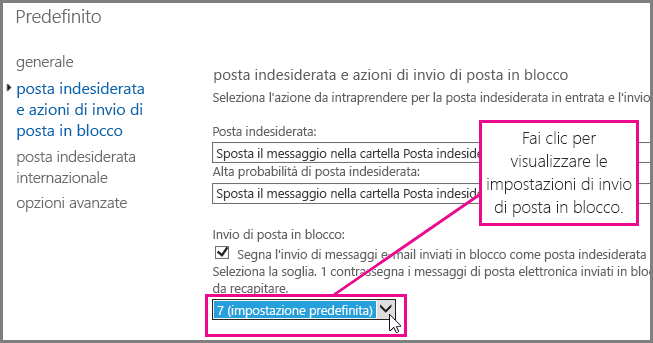
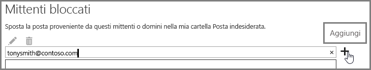

# <a name="block-email-spam-with-the-office-365-spam-filter-to-prevent-false-negative-issues"></a><span data-ttu-id="8e3c8-103">Bloccare la posta indesiderata utilizzando il filtro di Office 365 per evitare problemi di falsi negativi</span><span class="sxs-lookup"><span data-stu-id="8e3c8-103">Block email spam with the Office 365 spam filter to prevent false negative issues</span></span>

<span data-ttu-id="8e3c8-p101">Exchange Online Protection (EOP) è un servizio di filtraggio della posta elettronica basato sul cloud che contribuisce a proteggere l'organizzazione da posta indesiderata e malware. Se si dispone di cassette postali in Office 365, queste sono già protette per impostazione predefinita con Exchange Online Protection (EOP).</span><span class="sxs-lookup"><span data-stu-id="8e3c8-p101">Exchange Online Protection (EOP) is a cloud-based email filtering service that helps protect your organization against spam and malware. If you have mailboxes in Office 365, they are already protected by default with EOP.</span></span> 
  
<span data-ttu-id="8e3c8-p102">È possibile garantire che i messaggi di posta indesiderata vengano bloccati modificando il filtro protezione da posta indesiderata di Office 365. In questo modo è possibile impedire problemi di falsi negativi per cui alla posta indesiderata viene concesso di arrivare nella posta in arrivo dell'utente. Gli amministratori di Exchange Online ed Exchange Online Protection possono usare la seguente procedura per modificare il filtro protezione da posta indesiderata di Office 365 e impedire che la posta indesiderata venga recapitata nella posta in arrivo degli utenti.</span><span class="sxs-lookup"><span data-stu-id="8e3c8-p102">You can help to ensure spam and junk messages are blocked by adjusting your Office 365 spam filter. This helps to prevent the false negative issue, where email spam is allowed through to a user inbox. As an Exchange Online or Exchange Online Protection (EOP) administrator, use the following steps to adjust your Office 365 anti-spam filter and help prevent spam from being delivered to your user's inboxes.</span></span>
  
## <a name="customize-the-office-365-anti-spam-filter-with-these-settings"></a><span data-ttu-id="8e3c8-109">Personalizzare il filtro protezione da posta indesiderata di Office 365 con le seguenti impostazioni</span><span class="sxs-lookup"><span data-stu-id="8e3c8-109">Customize the Office 365 anti-spam filter with these settings</span></span>

<span data-ttu-id="8e3c8-p103">Un amministratore può utilizzare diverse impostazioni del filtro protezione da posta indesiderata di Office 365 per impedire l'invio della posta indesiderata alla posta in arrivo di un utente. Il filtro protezione da posta indesiderata di Office 365 imparerà a bloccare la posta indesiderata e a evitare messaggi falsi negativi se si usano le opzioni elencate qui. In questo contesto, un falso negativo si riferisce a un messaggio di posta indesiderata inviato alla posta in arrivo di un utente.</span><span class="sxs-lookup"><span data-stu-id="8e3c8-p103">An Admin can use several Office 365 spam filter settings to help prevent email spam from being sent to a user inbox. The Office 365 spam filter will become better able to block email spam and prevent false negative messages if you use the options listed here. In this context, a false negative refers to email spam or junk messages that are getting sent to a user inbox.</span></span>
  
### <a name="block-ip-addresses-with-a-connection-filter"></a><span data-ttu-id="8e3c8-113">Bloccare gli indirizzi IP con un filtro connessioni</span><span class="sxs-lookup"><span data-stu-id="8e3c8-113">Block IP addresses with a connection filter</span></span>

<span data-ttu-id="8e3c8-114">È possibile personalizzare il filtro protezione da posta indesiderata di Office 365 aggiungendo l'indirizzo IP del mittente all'elenco indirizzi IP bloccati del filtro connessioni:</span><span class="sxs-lookup"><span data-stu-id="8e3c8-114">Customize your Office 365 spam filter by adding the sender IP address to the connection filter IP block list:</span></span>
  
1. <span data-ttu-id="8e3c8-115">Ottenere le intestazioni del messaggio da bloccare nel client di posta come Outlook o Outlook Web App, come descritto in [Analizzatore intestazione messaggio](https://go.microsoft.com/fwlink/p/?LinkId=306583).</span><span class="sxs-lookup"><span data-stu-id="8e3c8-115">Obtain the headers for the message you want to block in your mail client such as Outlook or Outlook Web App, as described in [Message Header Analyzer](https://go.microsoft.com/fwlink/p/?LinkId=306583).</span></span>
    
2. <span data-ttu-id="8e3c8-116">Cercare l'indirizzo IP dopo il tag CIP nell'intestazione X-Forefront-Antispam-Report tramite l'[analizzatore intestazione messaggio](https://testconnectivity.microsoft.com/?tabid=mha) o manualmente.</span><span class="sxs-lookup"><span data-stu-id="8e3c8-116">Search for the IP address following the CIP tag in the X-Forefront-Antispam-Report header using the [message header analyzer](https://testconnectivity.microsoft.com/?tabid=mha) or manually.</span></span> 
    
3. <span data-ttu-id="8e3c8-117">Aggiungere l'indirizzo IP all'elenco indirizzi IP bloccati seguendo la procedura in "Utilizzare EAC per modificare il criterio del filtro connessioni predefinito" in [Configurare il criterio del filtro connessioni](https://technet.microsoft.com/it-IT/library/jj200718%28v=exchg.150%29.aspx).</span><span class="sxs-lookup"><span data-stu-id="8e3c8-117">Add the IP address to the IP Block list by following the steps in "Use the EAC to edit the default connection filter policy" in [Configure the Connection Filter Policy](https://technet.microsoft.com/it-IT/library/jj200718%28v=exchg.150%29.aspx).</span></span>
    
### <a name="block-bulk-mail-with-transport-rules-or-the-spam-filter"></a><span data-ttu-id="8e3c8-118">Bloccare i messaggi in blocco con regole di trasporto o con il filtro protezione da posta indesiderata</span><span class="sxs-lookup"><span data-stu-id="8e3c8-118">Block bulk mail with transport rules or the spam filter</span></span>

<span data-ttu-id="8e3c8-p104">La posta indesiderata è per lo più composta da posta inviata in massa, come ad esempio, newsletter o promozioni? È possibile personalizzare il filtro protezione da posta indesiderata in Office 365 se si [usano regole di trasporto per filtrare in modo aggressivo i messaggi di posta elettronica inviati in massa](https://technet.microsoft.com/it-IT/library/dn720438%28v=exchg.150%29.aspx) o attivare l'impostazione **Invio di posta in blocco** nelle [Opzioni ASF](https://technet.microsoft.com/it-IT/library/jj200750%28v=exchg.150%29.aspx) del filtro protezione da posta indesiderata. Nell'interfaccia di amministrazione di Exchange, iniziare facendo clic su **Protezione** \> **Filtro contenuto**, quindi fare doppio clic sul criterio del filtro da modificare. Fare clic su **Azioni posta inviata in massa e indesiderata** per modificare le impostazioni, come mostrato qui.</span><span class="sxs-lookup"><span data-stu-id="8e3c8-p104">Is the spam primarily bulk mail, for example, newsletters or promotions? You can customize the spam filter in Office 365 if you [Use transport rules to aggressively filter bulk email messages](https://technet.microsoft.com/it-IT/library/dn720438%28v=exchg.150%29.aspx) or turn on the **Bulk mail** setting in your spam filter's [Advanced Spam Filtering Options](https://technet.microsoft.com/it-IT/library/jj200750%28v=exchg.150%29.aspx). In the Exchange Admin center, get started by clicking **Protection** \> **Content filter** and then double click the filter policy you want to adjust. Click **Spam and bulk mail actions** to adjust the settings, as shown here.</span></span> 
  

  
### <a name="block-email-spam-using-spam-filter-block-lists"></a><span data-ttu-id="8e3c8-124">Bloccare la posta indesiderata tramite gli elenchi elementi bloccati del filtro protezione da posta indesiderata</span><span class="sxs-lookup"><span data-stu-id="8e3c8-124">Block email spam using spam filter block lists</span></span>

<span data-ttu-id="8e3c8-p105">[Configurare i criteri del filtro protezione da posta indesiderata](https://technet.microsoft.com/it-IT/library/jj200684%28v=exchg.150%29.aspx) per aggiungere l'indirizzo del mittente all'elenco di mittenti bloccati o il dominio all'elenco di domini bloccati nel filtro protezione da posta indesiderata. I messaggi di posta elettronica di un mittente o dominio in un elenco elementi bloccati del filtro protezione da posta indesiderata verranno contrassegnati come posta indesiderata.</span><span class="sxs-lookup"><span data-stu-id="8e3c8-p105">[Configure your spam filter policies](https://technet.microsoft.com/it-IT/library/jj200684%28v=exchg.150%29.aspx) to add the sender address to the sender block list or domain to the domain block list in the spam filter. Emails from a sender or domain on a spam filter block list will marked as spam.</span></span> 
  
### <a name="advanced-spam-filtering-options"></a><span data-ttu-id="8e3c8-127">Opzioni avanzate per il filtraggio della posta indesiderata</span><span class="sxs-lookup"><span data-stu-id="8e3c8-127">Advanced Spam Filtering Options</span></span>

<span data-ttu-id="8e3c8-128">[Configurare i criteri del filtro protezione da posta indesiderata](https://technet.microsoft.com/it-IT/library/jj200684%28v=exchg.150%29.aspx) e attivare ulteriori [opzioni ASF](https://technet.microsoft.com/it-IT/library/jj200750%28v=exchg.150%29.aspx).</span><span class="sxs-lookup"><span data-stu-id="8e3c8-128">[Configure your spam filter policies](https://technet.microsoft.com/it-IT/library/jj200684%28v=exchg.150%29.aspx) and turn on additional [Advanced Spam Filtering Options](https://technet.microsoft.com/it-IT/library/jj200750%28v=exchg.150%29.aspx).</span></span>
  
<span data-ttu-id="8e3c8-p106">Per maggiori informazioni sulle impostazioni relative alla posta indesiderata per un'intera organizzazione, consultare [Evitare che la posta elettronica venga erroneamente contrassegnata come posta indesiderata tramite un elenco di indirizzi attendibili o altre tecniche](prevent-email-from-being-marked-as-spam-0.md). Questo articolo è utile se si svolge il ruolo di amministratore e si desidera impedire la visualizzazione di falsi negativi o di falsi positivi.</span><span class="sxs-lookup"><span data-stu-id="8e3c8-p106">You can enable advanced spam filtering options if you want to pursue an aggressive approach to spam filtering. For general spam settings that apply to the whole organization, take a look at [Prevent false positive email marked as spam with a safelist or other techniques](prevent-email-from-being-marked-as-spam-0.md) or Block email spam with the Office 365 spam filter to prevent false negative issues. These are helpful if you have administrator-level control and you want to prevent false positives or false negatives.</span></span>
  
## <a name="email-users-can-also-help-ensure-that-false-negative-and-email-spam-is-blocked-with-office-365-spam-filter"></a><span data-ttu-id="8e3c8-131">Anche gli utenti di posta elettronica possono contribuire a garantire che i falsi negativi e la posta indesiderata vengano bloccati con il filtro protezione da posta indesiderata di Office 365</span><span class="sxs-lookup"><span data-stu-id="8e3c8-131">Email users can also help ensure that false negative and email spam is blocked with Office 365 spam filter</span></span>

<span data-ttu-id="8e3c8-p107">Può risultare utile per le iniziative di protezione dalla posta indesiderata di Office 365 volte a evitare falsi negativi e posta indesiderata, dire agli utenti di aggiungere l'indirizzo del mittente della posta indesiderata all'elenco dei mittenti bloccati in [Outlook](https://go.microsoft.com/fwlink/p/?LinkId=270065) o [Outlook Web App](https://go.microsoft.com/fwlink/p/?LinkId=294862). In Outlook Web App, iniziare facendo clic su **impostazioni** \> **Opzioni** \> **Blocca o consenti**, quindi aggiungere l'indirizzo all'elenco **Mittenti bloccati**, come illustrato di seguito.</span><span class="sxs-lookup"><span data-stu-id="8e3c8-p107">It will help your Office 365 anti-spam efforts to prevent false negatives and junk mail if you tell your users to add the spam sender address to their blocked sender list in [Outlook](https://go.microsoft.com/fwlink/p/?LinkId=270065) or [Outlook Web App](https://go.microsoft.com/fwlink/p/?LinkId=294862). In Outlook Web App, get started by clicking **Settings** \> **Options** \> **Block or allow**, and then adding the address to the **Blocked senders** list, as shown here.</span></span> 
  

  
> [!NOTE]
> <span data-ttu-id="8e3c8-135">Per informazioni più dettagliate sugli elenchi di mittenti attendibili, vedere [Domande frequenti sugli elenchi di mittenti attendibili e mittenti bloccati](https://technet.microsoft.com/it-IT/library/dn133608%28v=exchg.150%29.aspx).</span><span class="sxs-lookup"><span data-stu-id="8e3c8-135">For more detailed information about safe sender lists, see [Safe Sender and Blocked Sender Lists FAQ](https://technet.microsoft.com/it-IT/library/dn133608%28v=exchg.150%29.aspx).</span></span> 
  
<span data-ttu-id="8e3c8-p108">I paragrafi precedenti di questa sottosezione si applicano solo ai clienti che usano EOP come servizio per proteggere i sistemi di posta elettronica in locale o nell'ambito di una distribuzione di posta elettronica ibrida. Altre informazioni su EOP sono disponibili nella [home page di Exchange Online Protection](https://products.office.com/it-IT/exchange/exchange-email-security-spam-protection).</span><span class="sxs-lookup"><span data-stu-id="8e3c8-p108">The previous paragraphs in this subsection applies only to customers who use EOP as service to protect on-premises email systems or as part of a hybrid email deployment. Learn more about EOP at the [Exchange Online Protection home page](https://products.office.com/it-IT/exchange/exchange-email-security-spam-protection).</span></span>
  
## <a name="eop-only-customers-set-up-the-office-365-spam-filter-to-block-email-spam"></a><span data-ttu-id="8e3c8-138">I clienti solo di Exchange Online Protection: devono configurare il filtro protezione da posta indesiderata di Office 365 per bloccare la posta indesiderata</span><span class="sxs-lookup"><span data-stu-id="8e3c8-138">EOP-only customers: Set up the Office 365 spam filter to block email spam</span></span>

<span data-ttu-id="8e3c8-p109">Per i clienti solo di EOP con cassette postali locali: se si configura un filtro protezione da posta indesiderata per l'azione predefinita, spostare i messaggi nella posta indesiderata, seguire i passaggi necessari forniti in Verificar che la posta indesiderata venga reindirizzata nella cartella Posta indesiderata di ogni utente. Abbiamo provato a facilitare questa operazione fornendo comandi di Exchange Management Shell in un argomento separato e un link a informazioni più generali su come iniziare a usare la shell.</span><span class="sxs-lookup"><span data-stu-id="8e3c8-p109">For EOP-only customers with on-premises mailboxes: If you setup a spam filter for the default action, Move message to Junk Email folder, follow the required steps provided in Ensure that spam is routed to each user's Junk Email folder. We've tried to make this easy by providing the Exchange Management Shell commands in a separate topic, as well as a link to more general information about how to get started with the shell.</span></span>
  
<span data-ttu-id="8e3c8-p110">In questo modo, sarà possibile evitare falsi negativi di posta indesiderata se si sincronizzano le impostazioni dell'utente con il servizio attraverso la sincronizzazione della directory per garantire che i mittenti bloccati siano rispettati. Per ulteriori informazioni, vedere "Usare la sincronizzazione della directory per gestire gli utenti di posta elettronica" in Gestione degli utenti di posta elettronica in EOP.</span><span class="sxs-lookup"><span data-stu-id="8e3c8-p110">It will help you to avoid false negative email spam if you sync user settings with the service via directory synchronization to ensure that your blocked senders are respected. For more information, see "Use directory synchronization to manage mail users" in Manage mail users in EOP.</span></span>
  
## <a name="eop-only-customers-who-are-not-using-directory-synchronization"></a><span data-ttu-id="8e3c8-143">I clienti solo di EOP che non usano la sincronizzazione della directory</span><span class="sxs-lookup"><span data-stu-id="8e3c8-143">EOP-only customers who are not using directory synchronization</span></span>

<span data-ttu-id="8e3c8-p111">Il servizio Exchange Online Protection è progettato per applicare i mittenti attendibili e i mittenti bloccati se tali informazioni sono state condivise con il servizio. Se un cliente EOP usa Outlook, ma non ha configurato la sincronizzazione della directory per sincronizzare gli utenti con Office 365, è comunque possibile impedire che i messaggi vengano recapitato nella posta in arrivo degli utenti utilizzando i mittenti bloccati. Tuttavia, potrebbe essere necessario configurare alcune regole relative al flusso di posta di Exchange nelle seguenti situazioni:</span><span class="sxs-lookup"><span data-stu-id="8e3c8-p111">The EOP service is designed to honor the user's safe and blocked senders, if the information has been shared with the service. If you are an EOP customer using Outlook, but do not have Directory Synchronization configured to sync your users to Office 365, you can still stop messages from being delivered to your users' inbox using blocked senders. However, you may have to set up some Exchange mail flow rules in the following situations:</span></span>
  
- <span data-ttu-id="8e3c8-147">Se un messaggio supera un filtro protezione da posta indesiderata regolare attraverso EOP e viene quindi recapitato in un server Exchange locale, e EOP assegna un risultato di posta indesiderata pari a SCL 1-4 (non posta indesiderata), l'elenco dei mittenti bloccati locale dell'utente ignorerà quindi il risultato del filtro protezione da posta indesiderata EOP e invierà il messaggio nella cartella di posta indesiderata.</span><span class="sxs-lookup"><span data-stu-id="8e3c8-147">If a message goes through regular spam filtering through EOP and then is delivered to a local on-premises Exchange server, and EOP assigns a spam verdict of SCL 1-4 (non-spam), then your users' local blocked senders list will override the EOP spam filter verdict and deliver it to their junk email folder.</span></span>
    
- <span data-ttu-id="8e3c8-p112">Se a un messaggio in EOP viene assegnato il risultato SCL-1 da una regola del flusso di posta di Exchange o perché l'indirizzo IP o il dominio è uno di quelli consentiti, il livello di probabilità di posta indesiderata viene propagato nel server Exchange locale utilizzando connettori. In questo caso, l'elenco mittenti bloccati dell'utente non verrà applicato. Per modificare tale comportamento, è possibile creare una regola del flusso di posta locale che imposti il livello di probabilità di posta indesiderata su 0. In questo modo, Outlook applicherà l'elenco mittenti bloccati dell'utente.</span><span class="sxs-lookup"><span data-stu-id="8e3c8-p112">If a message in EOP is assigned SCL -1 by an Exchange mail flow rule or because the IP address or domain is in your allow list, the SCL is propagated to the on-premise Exchange server using connectors. In this case, your user's blocked senders list will not be enforced. To change this, you can create a local mail flow rule that sets the SCL to 0. This will cause Outlook to enforce your user's local blocked senders list.</span></span>
    
<span data-ttu-id="8e3c8-152">**Per configurare una regola del flusso di posta per impedire che i messaggi vengano recapitati nella posta in arrivo dell'utente tramite l'elenco mittenti bloccati**</span><span class="sxs-lookup"><span data-stu-id="8e3c8-152">**To set up a mail flow rule to stop messages from being delivered to your users' inbox by using the blocked senders list**</span></span>
  
1. <span data-ttu-id="8e3c8-p113">Aprire Exchange Management Shell nel server locale. Per informazioni su come aprire Shell nell'organizzazione di Exchange locale, vedere [Aprire Exchange Management Shell](https://technet.microsoft.com/library/dd638134%28v=exchg.160%29.aspx).</span><span class="sxs-lookup"><span data-stu-id="8e3c8-p113">To learn how to open the Exchange Management Shell in your on-premises Exchange organization, see [Open the Exchange Management Shell](https://technet.microsoft.com/library/dd638134%28v=exchg.160%29.aspx).</span></span>
    
2. <span data-ttu-id="8e3c8-155">Eseguire il comando seguente per indirizzare i messaggi di posta indesiderata filtrati in base al contenuto alla cartella Posta indesiderata per aggiornare il livello di probabilità di posta indesiderata di ogni messaggio contrassegnato con SCL -1:</span><span class="sxs-lookup"><span data-stu-id="8e3c8-155">Run the following command to route content-filtered spam messages to the Junk Email folder in order to update the SCL on every message that was marked with SCL -1:</span></span>
    
  ```
  New-TransportRule "NameForRule" -HeaderContainsMessageHeader "X-Forefront-Antispam-Report" -HeaderContainsWords "SCL:-1" -SetSCL 0
  ```

    <span data-ttu-id="8e3c8-p114">Poiché il livello di probabilità di posta indesiderata è 0 nel server Exchange locale, la posta non contrassegnata come posta indesiderata verrà comunque recapitata nella posta in arrivo degli utenti, ma l'elenco mittenti bloccati locale degli utenti potrà comunque inviarla nella posta indesiderata. Se si usa la quarantena della posta indesiderata in EOP, è comunque possibile che i mittenti presenti nell'elenco mittenti attendibili vengano identificati come posta indesiderata e inviati in quarantena. Tuttavia, se si usa la cartella Posta indesiderata nella cassetta postale locale, in questo modo sarà possibile il recapito nella posta in arrivo dei mittenti attendibili.</span><span class="sxs-lookup"><span data-stu-id="8e3c8-p114">Because the SCL is 0 in your on-premises Exchange server, non-spam will be delivered to your users' inboxes but still allow for users' local blocked senders list to send them to junk email. If you are using spam quarantine in EOP, it is still possible that senders who are on your user's safe list will be identified as spam and sent to quarantine. If you are using the Junk Mail Folder in your local mailbox, however, this will allow delivery to the Inbox for safe senders.</span></span>

> [!WARNING]
> <span data-ttu-id="8e3c8-p115">Se si usa una regola del flusso di posta elettronica per impostare il valore SCL su 0 (o un valore diverso da -1), allora tutte le opzioni di posta indesiderata di Outlook verranno applicate al messaggio. Questo significa che verranno applicati gli elenchi di elementi attendibili e bloccati, ma anche che i messaggi i cui indirizzi non fanno parte di tali elenchi potrebbero essere contrassegnati come posta indesiderata dal filtro protezione da posta indesiderata sul lato client. Se si desidera che Outlook elabori gli elenchi di elementi attendibili e bloccati, ma non usi il filtro protezione da posta indesiderata sul lato client, è necessario impostare l'opzione "Filtro automatico disattivato" nelle opzioni della posta indesiderata di Outlook. "Filtro automatico disattivato" è l'opzione predefinita nelle ultime versioni di Outlook, ma è necessario verificare che tale impostazione sia attiva per garantire che il filtro protezione da posta indesiderata sul lato client non venga applicato ai messaggi. Gli amministratori possono imporre la disattivazione del filtro protezione da posta indesiderata di Outlook seguendo le istruzioni in [Outlook: impostazione dei criteri per disabilitare l'interfaccia utente della posta indesiderata e il meccanismo di filtro](https://support.microsoft.com/it-IT/kb/2180568).</span><span class="sxs-lookup"><span data-stu-id="8e3c8-p115">If you use a mail flow rule to change the SCL value to 0 (or any value other than -1), then all of the Outlook junk mail options will apply to the message. This means that blocked and safe lists will be honored, but also means that messages that do not have addresses from the blocked or safe lists will potentially be marked as junk by the client side junk mail filter processing. If you want to have Outlook process the blocked and safe lists, but not use the client side junk mail filter, you must set the option to "No Automatic Filtering" in Outlook Junk Mail Options. "No Automatic Filtering" is the default option in the latest versions of Outlook, but you should confirm that the this setting is in place to ensure the client side junk mail filter is not applied to the messages. As an administrator, you can enforce disabling the Outlook Junk Email filtering by following the instructions in [Outlook: Policy setting to disable the Junk E-mail UI and filtering mechanism](https://support.microsoft.com/it-IT/kb/2180568).</span></span>
  
## <a name="see-also"></a><span data-ttu-id="8e3c8-164">Vedere anche</span><span class="sxs-lookup"><span data-stu-id="8e3c8-164">See Also</span></span>
<span data-ttu-id="8e3c8-165"><a name="BKMK_please_comment"> </a></span><span class="sxs-lookup"><span data-stu-id="8e3c8-165"></span></span>

[<span data-ttu-id="8e3c8-166">Protezione dalla posta indesiderata in Office 365</span><span class="sxs-lookup"><span data-stu-id="8e3c8-166">Office 365 Email Anti-Spam Protection</span></span>](anti-spam-protection.md)
  
[<span data-ttu-id="8e3c8-167">Evitare che la posta elettronica venga erroneamente contrassegnata come posta indesiderata tramite un elenco di indirizzi attendibili o altre tecniche</span><span class="sxs-lookup"><span data-stu-id="8e3c8-167">Prevent false positive email marked as spam with a safelist or other techniques</span></span>](prevent-email-from-being-marked-as-spam-0.md)
  

