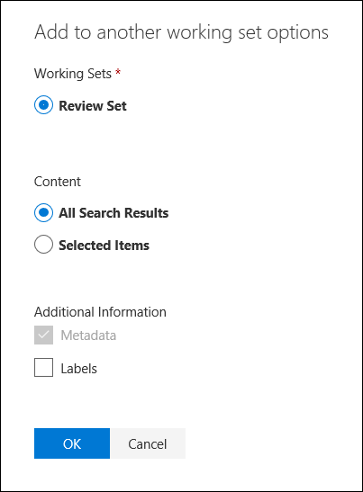

# Aggiungere dati a un set di revisione da un altro set di Revisione

In alcuni casi, potrebbe essere necessario ripartire una parte di documenti da un set di revisione e utilizzarli singolarmente in un altro set di revisione.  Questo è particolarmente utile se si è abbattuti contenuti in un set di revisione e si vuole eseguire l'analisi del sottoinsieme di dati.

Seguire il flusso di lavoro in questo articolo per aggiungere contenuto da un set di revisione a un altro.

## Informazioni preliminari

Prima di iniziare, è necessario creare un nuovo set di revisione a cui aggiungere i dati.  È possibile aggiungere un nuovo set di revisione nella scheda **revisione dei set** del caso. Per ulteriori informazioni, vedere [creare un set di revisione](managing-review-sets.md#create-a-review-set).

## Passaggio 1: identificare il contenuto da aggiungere a un altro set di Revisione

È possibile aggiungere contenuto da un set di revisione a un altro selezionando documenti specifici nel set di revisione del codice sorgente oppure b seleting tutti gli elementi restituiti dalla query set di revisione.  Se si aggiungono elementi selezionati, selezionare gli elementi, fare clic su **azione**, quindi fare clic su **Aggiungi a un altro set di revisione**.

## Passaggio 2: specificare le opzioni per l'aggiunta a un altro set di Revisione

Nella pagina **Aggiungi a un altro** riquadro a comparsa Opzioni del set di revisione scegliere il set di revisione a cui si desidera aggiungere gli elementi. Scegliere se aggiungere **tutti i risultati di ricerca** o **gli elementi selezionati**.  Altre informazioni forniscono opzioni per includere tutti i metadati dagli elementi e se includere i tag (selezionando la casella di controllo **etichette** ) dal set di revisione di origine quando i documenti vengono aggiunti al nuovo set di revisione.  

Dopo aver fatto clic su **OK**, viene creato un nuovo processo (denominato **aggiunta di dati a un altro set di revisione**) per aggiungere il contenuto a un altro set di revisione.  È possibile accedere alla scheda **processi** e monitorare lo stato di avanzamento del processo. Per ulteriori informazioni, vedere [gestire i processi](managing-jobs-ediscovery20.md).
