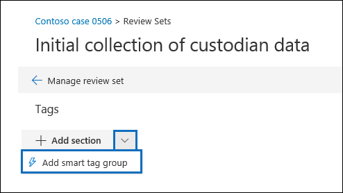

# Configurare il rilevamento dei privilegi avvocato-client in Advanced eDiscovery

Un aspetto importante e costoso della fase di revisione di un processo di eDiscovery consiste nell'esaminare i documenti per il contenuto con privilegi. Advanced eDiscovery fornisce il rilevamento basato sull'apprendimento automatico del contenuto con privilegi per rendere più efficiente questo processo. Questa funzionalità è denominata *rilevamento dei privilegi di avvocato-client*.

> [!NOTE]
> Prima di poterlo utilizzare, è necessario optare per il modello di rilevamento dei privilegi avvocato-client. Vedere il [passaggio 1](#step-1-opt-in-to-attorney-client-privilege-detection) per le istruzioni.

## Funzionamento.

Quando è abilitato il rilevamento dei privilegi di avvocato-client, tutti i documenti in un set di revisione verranno elaborati dal modello di rilevamento del privilegio avvocato-client quando si [analizzano i dati](analyzing-data-in-review-set.md) nel set di revisione. Il modello cerca due elementi:

- Contenuto con privilegi: il modello utilizza l'apprendimento automatico per determinare la probabilità che il documento contenga contenuti di natura legale.

- Partecipanti – nell'ambito della configurazione del rilevamento dei privilegi del procuratore-client, è necessario inviare un elenco di avvocati per la propria organizzazione. Il modello confronta quindi i partecipanti del documento con l'elenco degli avvocati per determinare se un documento ha almeno un partecipante al procuratore.

Il modello produce le tre proprietà seguenti per ogni documento:

- **AttorneyClientPrivilegeScore** – la probabilità che il documento sia di natura legale; i valori per il punteggio sono compresi tra **0** e **1**.

- **HasAttorney** : questa proprietà è impostata su **true** se uno dei partecipanti al documento è elencato nell'elenco di avvocati. in caso contrario, il valore è **false**. Il valore viene impostato su **false** anche se l'organizzazione non ha caricato un elenco di avvocati.

- **Privilegio** : questa proprietà è impostata su **true** se il valore di **AttorneyClientPrivilegeScore** è al di sopra della soglia *o* se il documento ha un partecipante al procuratore; in caso contrario, il valore è impostato su **false**.

Queste proprietà e i relativi valori corrispondenti vengono aggiunte ai metadati del file dei documenti in un set di revisione, come illustrato nella schermata seguente:

Queste tre proprietà sono anche ricercabili all'interno di un set di revisione. Per ulteriori informazioni, vedere [eseguire una query sui dati in un set di revisione](review-set-search.md).

## Configurare il modello di rilevamento dei privilegi avvocato-client

Per abilitare il modello di rilevamento dei privilegi avvocato-client, l'organizzazione deve accettare l'opt-in e quindi caricare un elenco di avvocati.

### Passaggio 1: opt-in al rilevamento dei privilegi di procuratore-client

Come indicato in precedenza, il modello di rilevamento dei privilegi del procuratore-client è in anteprima. Pertanto, una persona all'interno dell'organizzazione eDiscovery Administrator (un membro del sottogruppo amministratore di eDiscovery nel gruppo di ruoli di eDiscovery Manager) deve scegliere di rendere disponibile il modello nei casi di eDiscovery avanzati.

1. Nel centro sicurezza & conformità, accedere a **eDiscovery > Advanced eDiscovery**.

2. Nella Home page di **Advanced eDiscovery** , nel riquadro **delle impostazioni** , fare clic su **Configura caratteristiche sperimentali**.

   

3. Nella scheda **caratteristiche sperimentali** fare clic su **Gestisci impostazione privilegio avvocato-client**.

4. Nella pagina riquadro a comparsa **avvocato-client Privilege** fare clic sull'interruttore per attivare la funzionalità e quindi fare clic su **Salva**.

### Passaggio 2: caricare un elenco di avvocati (facoltativo)

Per sfruttare al meglio il modello di rilevamento dei privilegi di avvocato e client e utilizzare i risultati **** del procuratore o del rilevamento **potenzialmente privilegiato** descritto in precedenza, è consigliabile caricare un elenco di indirizzi di posta elettronica per l' avvocati e persone giuridiche che lavorano per la propria organizzazione. 

Per caricare un elenco di avvocati per l'utilizzo da parte del modello di rilevamento dei privilegi avvocato-client:

1. Creare un file. csv (senza una riga di intestazione) e aggiungere l'indirizzo di posta elettronica per ogni persona appropriata su una riga distinta. Salvare il file nel computer locale.

2. Nella Home page di **Advanced eDiscovery** , nel riquadro **delle impostazioni** , fare clic su **Configura caratteristiche sperimentali**, quindi fare clic su **Gestisci impostazione privilegi avvocato-client**.

   Viene visualizzata la pagina **Privilege avvocato-client** e l'interruttore di rilevamento dei privilegi del procuratore **-client** è attivato.

   

3. Fare clic su **Sfoglia** e quindi individuare e selezionare il file. csv creato nel passaggio 1.

4. Fare clic su **Salva** per caricare l'elenco degli avvocati.

## Utilizzare il modello di rilevamento dei privilegi avvocato-client

Seguire la procedura descritta in questa sezione per utilizzare il rilevamento dei privilegi di avvocato-client per i documenti in un set di revisione.

### Passaggio 1: creare un gruppo di smart tag con il modello di rilevamento dei privilegi avvocato-client

Uno dei modi principali per visualizzare i risultati del rilevamento dei privilegi del procuratore-client nel processo di revisione consiste nell'utilizzare un gruppo di smart tag. Un gruppo di smart tag indica i risultati del rilevamento dei privilegi avvocato-client e Visualizza i risultati in linea accanto ai tag in un gruppo di smart tag. In questo modo è possibile identificare rapidamente i documenti potenzialmente privilegiati durante la revisione del documento. Inoltre, è possibile utilizzare i tag del gruppo smart tag per contrassegnare i documenti come privilegiati o non privilegiati. Per ulteriori informazioni sugli smart tag, vedere [configurare gli smart tag in Advanced eDiscovery](smart-tags.md).

1. Nel set di revisione contenente i documenti analizzati nel passaggio 1 fare clic su Gestisci **Revisione set** e quindi su **Gestisci Tag**.
 
2. In **tag**fare clic sul pulsante a discesa accanto a **Aggiungi gruppo** e quindi fare clic su **Aggiungi gruppo smart tag**.

   

3. Nella pagina **scegliere un modello per la smart tag** fare clic su **Seleziona** accanto a **privilegio avvocato-client**.

   Viene visualizzato un gruppo di tag denominato procuratore **-Client Privilege** . Contiene due tag figlio denominati **positivi** e **negativi**, che corrispondono ai possibili risultati prodotti dal modello.

   

3. Rinominare il gruppo e i tag dei tag in base alle proprie esigenze per la revisione. Ad esempio, è possibile rinominare **positivamente** con **privilegi** e **negativi** a **non privilegiati**.

### Passaggio 2: analizzare un set di Revisione

Quando si analizzano i documenti in un set di revisione, verrà eseguito anche il modello di rilevamento dei privilegi di avvocato-client e le proprietà corrispondenti (descritte in[modalità di funzionamento?](#how-does-it-work) verranno aggiunte a tutti i documenti del set di revisione. Per ulteriori informazioni sull'analisi dei dati nel set di revisione, vedere [analyze data in a Review set in Advanced eDiscovery](analyzing-data-in-review-set.md).

### Passaggio 3: utilizzare il gruppo smart tag per la revisione dei contenuti con privilegi

Dopo aver analizzato il set di revisione e aver configurato gli smart tag, il passaggio successivo consiste nel rivedere i documenti. Se il modello ha determinato che il documento è potenzialmente privilegiato, lo smart tag corrispondente nel **Pannello di tagging** indicherà i risultati seguenti ottenuti dal rilevamento dei privilegi avvocato-client:

- Se il documento contiene contenuto che potrebbe essere di natura legale, il **contenuto legale** dell'etichetta viene visualizzato accanto allo smart tag corrispondente, che in questo caso è il tag **positivo** predefinito.

- Se il documento ha un partecipante che si trova nell'elenco di avvocati dell'organizzazione, viene visualizzato **** il procuratore di etichette accanto allo smart tag corrispondente (che in questo caso è anche il tag **positivo** predefinito).

- Se il documento contiene contenuto che potrebbe essere di natura legale *e* ha un partecipante trovato nell'elenco degli avvocati, vengono visualizzati sia il **contenuto legale** che le etichette del procuratore. **** 

Se il modello determina che un documento non contiene contenuto di natura legale o che non contiene un partecipante all'elenco degli avvocati, non viene visualizzata alcuna etichetta nel pannello di tagging.

Ad esempio, nelle schermate seguenti vengono visualizzati due documenti. il primo contiene contenuto di natura legale e ha un partecipante trovato nell'elenco degli avvocati; la seconda non contiene né e pertanto non Visualizza etichette.

Dopo aver esaminato un documento per verificare se contiene contenuto con privilegi, è possibile contrassegnare il documento con il tag appropriato.