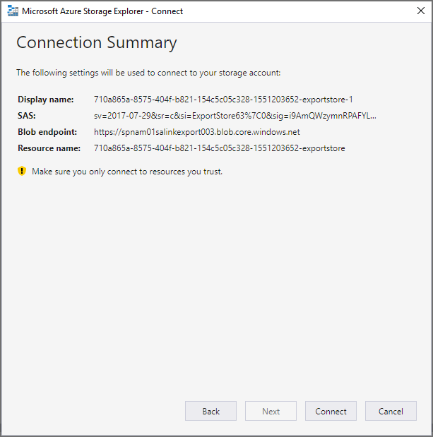

# Scaricare processi di esportazioneDownload export jobs

Tutti i dati esportati vengono aggiunti a un BLOB di Microsoft Azure.All exported data is added to a Microsoft Azure blob. In questo modo vengono fornite più opzioni per gestire i dati downstream.This provides multiple options to handle the data downstream. Sono disponibili diversi modi per accedere a un BLOB di Azure.There are several ways to access an Azure blob. Un metodo consiste nell'utilizzare Esplora archivi di Azure.One method is to use Azure Storage Explorer. Questo metodo supporta la connessione semplice, l'esplorazione e il download.This method supports simple connection, browsing and downloading. Per ulteriori informazioni, visitare<https://docs.microsoft.com/en-us/azure/storage/blobs/storage-quickstart-blobs-storage-explorer>For more information, visit <https://docs.microsoft.com/en-us/azure/storage/blobs/storage-quickstart-blobs-storage-explorer>

1.  Per scaricare il contenuto dopo il completamento di un processo di esportazione, passare alla scheda Esporta e selezionare un processo di esportazione.To download content after an export job is complete, go to the Exports tab and select an export job.

2.  Copiare il testo nella sezione "Locations" del riquadro a comparsa.Copy the text in the “Locations” section of the flyout.

3.  Aprire Esplora archivi di Azure e fare clic sul pulsante "Connetti"Open Azure Storage Explorer and click the “Connect” button

4.  Selezionare "usa un URI di firma di accesso condiviso" e fare clic su Avanti.Select “Use a shared access signature URI” and click next

5.  Incollare il testo percorso nella casella di testo URI e fare clic su Avanti.Paste the Location text in the URI text box and click next

6.  Fare clic su ConnettiClick Connect

In questo modo verrà aggiunta l'esportazione come oggetto nei contenitori di archiviazione/servizi associati SAS/BLOB.This will add the export as an object in Storage Accounts/SAS-Attached Services/Blob Containers. Sarà possibile esplorare l'esportazione e scaricare tutto o parti dell'esportazione.You will be able to explore the export and download all or portions of the export.

