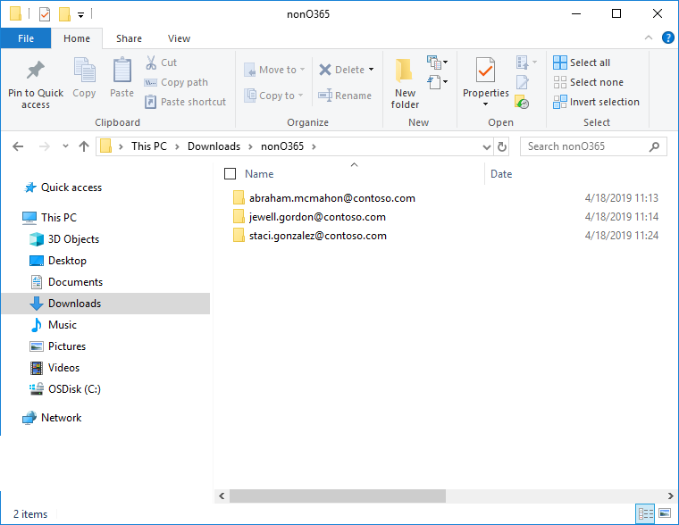

# Caricare dati non Office 365 in un insieme da rivedereLoad non-Office 365 data into a review set

Non tutti i documenti che potrebbe essere necessario analizzare con Office 365 Advanced eDiscovery vivranno in Office 365.Not all documents that you may need to analyze with Office 365 Advanced eDiscovery will live in Office 365. Con la caratteristica di importazione di contenuto non Office 365 in Advanced eDiscovery è possibile caricare documenti che non risiedono in Office 365 in un set di revisione in modo che vengano analizzati con Advanced eDiscovery.With the Non-Office 365 content import feature in Advanced eDiscovery you can upload documents that don't live in Office 365 into a review set so it is analyzed with Advanced eDiscovery. In questa procedura viene illustrato come portare i documenti non Office 365 in Advanced eDiscovery per l'analisi.This procedure shows you how to bring your non-Office 365 documents into Advanced eDiscovery for analysis.

>[!Note]
>Advanced eDiscovery richiede un Office 365 E3 con il componente aggiuntivo per la conformità avanzato o un abbonamento E5 per l'organizzazione.Advanced eDiscovery requires an Office 365 E3 with the Advanced Compliance add-on or an E5 subscription for your organization. Se non si dispone di tale piano e si desidera provare Advanced eDiscovery, è possibile iscriversi per una versione di valutazione di Office 365 Enterprise E5.If you don't have that plan and want to try Advanced eDiscovery, you can sign up for a trial of Office 365 Enterprise E5.

## Informazioni preliminariBefore you begin

Se si utilizza la funzionalità carica non Office 365, come descritto in questo articolo, è necessario disporre di quanto segue:Using the upload Non-Office 365 feature as described in this article requires that you have the following:

- Un abbonamento a Office 365 o Microsoft 365 E5 o un abbonamento E3 con l'abbonamento al componente aggiuntivo per la conformità avanzato.An Office 365 or Microsoft 365 E5 subscription or an E3 subscription with the Advanced Compliance add-on subscription.

- Tutti i depositari il cui contenuto non Office 365 verrà caricato devono disporre di una licenza E3 con una licenza per il componente aggiuntivo per la conformità avanzata o con una licenza E5.All custodians whose non-Office 365 content will be uploaded must have E3 license with an Advanced Compliance add-on license or have an E5 license.

- Un caso avanzato di eDiscovery esistente.An existing Advanced eDiscovery case.

- I depositari devono essere aggiunti al caso prima di caricare i dati non di Office 365 associati.Custodians must be added to the case before you upload the non-Office 365 data that's associated to them.

- Tutti i file che verranno caricati devono trovarsi in cartelle, in cui ogni cartella è associata a un determinato custode.All files that will be uploaded must be located in folders, where each folder is associated with a specific custodian. I nomi di queste cartelle devono utilizzare il formato di denominazione seguente: *alias @ NomeDominio*.The names for these folders must use the following naming format: *alias@domainname*. L' *alias @ NomeDominio* deve essere l'alias e il dominio dell'utente di Office 365.The *alias@domainname* must be the user's Office 365 alias and domain. È possibile raccogliere tutte le cartelle *alias @ DomainName* in una cartella radice.You can collect all the *alias@domainname* folders into a root folder. La cartella radice può contenere solo le cartelle *alias @ DomainName* ; non sono consentiti file sciolti nella cartella radice.The root folder can only contain the *alias@domainname* folders; loose files aren't allowed in the root folder.

   Ad esempio, la struttura di cartelle per i dati non di Office 365 che si desidera caricare sarebbe simile alla seguente:For example, the folder structure for the non-Office 365 data that you want to upload would be similar to the following:

   - c:\nonO365\abraham.mcmahon@contoso.comc:\nonO365\abraham.mcmahon@contoso.com
   - c:\nonO365\jewell.gordon@contoso.comc:\nonO365\jewell.gordon@contoso.com
   - c:\nonO365\staci.gonzalez@contoso.comc:\nonO365\staci.gonzalez@contoso.com

   Dove abraham.mcmahon@contoso.com, jewell.gordon@contoso.com e staci.gonzalez@contoso.com sono gli indirizzi SMTP dei depositari nel caso.Where abraham.mcmahon@contoso.com, jewell.gordon@contoso.com, and staci.gonzalez@contoso.com are the SMTP addresses of custodians in the case.

   

- Un account che sia un Manager di eDiscovery o un amministratore di eDiscoveryAn account that is either an eDiscovery Manager or eDiscovery Administrator

- Strumenti di archiviazione di Microsoft Azure installati in un computer che ha accesso alla struttura di cartelle di contenuto non di Office 365.Microsoft Azure Storage Tools installed on a computer that has access to the non-Office 365 content folder structure.

- Installare AzCopy, operazione che è possibile eseguire da qui:https://docs.microsoft.com/en-us/azure/storage/common/storage-use-azcopyInstall AzCopy, which you can do from here: https://docs.microsoft.com/en-us/azure/storage/common/storage-use-azcopy

## Caricare il contenuto non Office 365 in Advanced eDiscoveryUpload non-Office 365 content into Advanced eDiscovery

1. Come eDiscovery Manager o amministratore di eDiscovery, aprire Advanced eDiscovery, quindi il caso in cui i dati non di Office 365 verranno caricati.As an eDiscovery Manager or eDiscovery Administrator, open Advanced eDiscovery, then the case that the non-Office 365 data will be uploaded to.  Fare clic sulla scheda **revisione dei set** , quindi selezionare il set di revisione in cui si desidera caricare i dati non di Office 365.Click the **review sets** tab, then select the review set you wish to load the Non-Office 365 data to.  Se non è stato ancora creato un set di revisione, è possibile farlo adesso.If you have not already created a review set, you can do so now.  Infine, fare clic su **Gestisci Revisione set** e quindi su **Visualizza caricamenti** nel riquadro dei dati \* \* non Office 365.Finally, click **Manage review set** and then click **View uploads** in the \*\*Non-Office 365 data tile.

2. Fare clic sul pulsante **Carica file** per avviare l'importazione guidata dati non di Office 365.Click the **Upload files** button to start the Non-Office 365 data import wizard.

   

3. Il primo passaggio della procedura guidata consente di preparare semplicemente un BLOB di Azure sicuro per i file da caricare.The first step in the wizard simply prepares a secure Azure blob for the files to be uploaded.  Una volta completata la preparazione, fare clic sul pulsante **Avanti: carica file** .Once preparation is completed, click the **Next: Upload files** button.

   
 
4. Nel passaggio **file di caricamento** specificare il **percorso dei file**, in cui si trovano i dati non di Office 365 pianificati per l'importazione.In the **Upload files** step, specify the **Path to location of files**, this is where the Non-Office 365 data you plan on importing is located.  L'impostazione del percorso corretto garantisce che il comando AzCopy sia stato aggiornato correttamente.Setting the correct location ensures the AzCopy command is properly updated.

   > [!NOTE]
   > Se AzCopy non è ancora stato installato, è possibile eseguire questa operazione da qui:https://docs.microsoft.com/en-us/azure/storage/common/storage-use-azcopyIf you have not already installed AzCopy, you can do this from here: https://docs.microsoft.com/en-us/azure/storage/common/storage-use-azcopy

5. Copiare il comando predefinito facendo clic sul collegamento **copia in Appunti** .Copy the predefined command by clicking the **Copy to clipboard** link. Avviare un prompt dei comandi di Windows, incollare il comando e premere INVIO.Start a windows command prompt, paste the command and press enter.  I file verranno caricati nell'archiviazione BLOB di Azure sicura per il passaggio successivo.The files will be uploaded to the secure Azure blob storage for the next step.

   

   

   > [!NOTE]
   > Se il comando AzCopy fornito ha esito negativo, fare riferimento a [risoluzione dei problemi AzCopy in Advanced eDiscovery](troubleshooting-azcopy.md)If the supplied AzCopy command fails, refer to [Troubleshoot AzCopy in Advanced eDiscovery](troubleshooting-azcopy.md)

6. Infine, tornare alla conformità & sicurezza e fare clic sul pulsante **Avanti: elabora file** .Finally, return back to the Security & Compliance and click the **Next: Process files** button.  Verrà avviata l'elaborazione, l'estrazione del testo e l'indicizzazione dei file caricati.This will initiate processing, text extraction and indexing of the uploaded files.  È possibile tenere conto dello stato di avanzamento dell'elaborazione qui o nella scheda **processi** .  Una volta completato, i nuovi file saranno disponibili nel set di revisione.You can track the progress of processing here or in the **Jobs** tab.  Once completed, the new files will be available in the review set.  Dopo aver completato l'elaborazione, è possibile chiudere la procedura guidata.Once processing is complete, you can dismiss the wizard.

   

