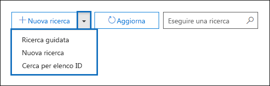
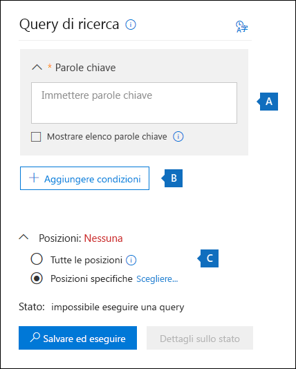
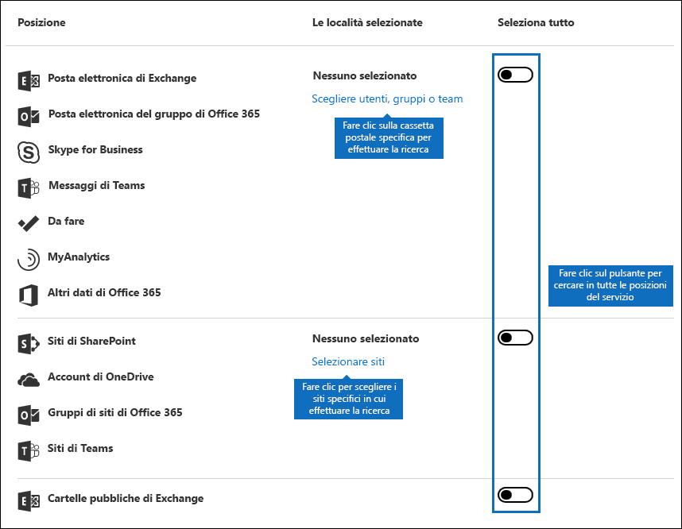
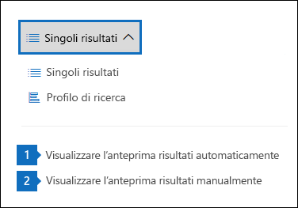
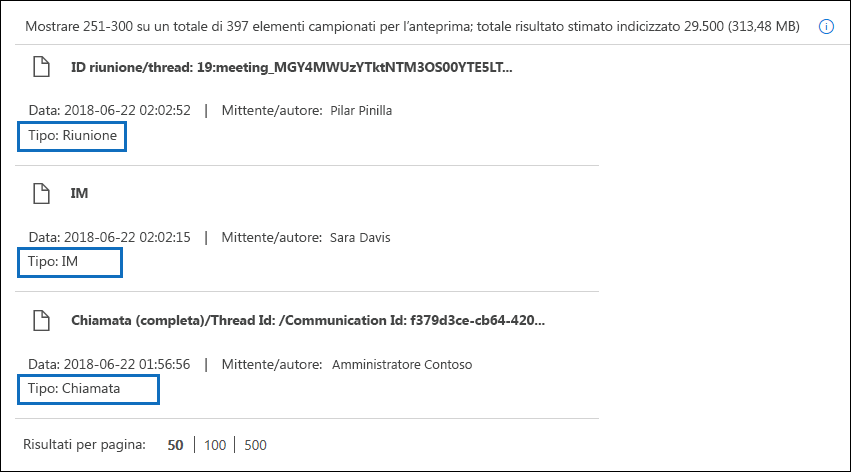
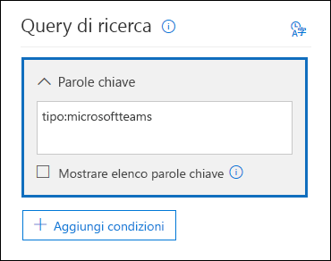
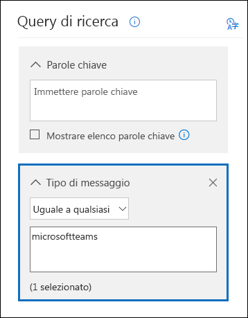

# <a name="content-search-in-office-365"></a>Ricerca contenuto in Office 365

È possibile utilizzare lo strumento eDiscovery ricerca contenuto nel centro sicurezza &amp; e conformità di Office 365 per cercare gli elementi sul posto, ad esempio messaggi di posta elettronica, documenti e conversazioni di messaggistica istantanea nell'organizzazione di Office 365. Utilizzare questo strumento per cercare gli elementi presenti nei servizi di Office 365:
  
- Cassette postali e cartelle pubbliche di Exchange Online
    
- Siti di SharePoint Online e account di OneDrive for business
    
- Conversazioni di Skype for business
    
- Microsoft Teams 
    
- Gruppi di Office 365
    
Dopo aver eseguito una ricerca di contenuto, il numero di posizioni di contenuto e il numero stimato di risultati della ricerca vengono visualizzati nel profilo di ricerca. È inoltre possibile visualizzare rapidamente le statistiche, ad esempio i percorsi di contenuto con la maggior parte degli elementi che corrispondono alla query di ricerca. Dopo aver eseguito una ricerca, è possibile visualizzare in anteprima i risultati o esportarli in un computer locale.


## <a name="create-a-new-search"></a>Creare una nuova ricerca

Per accedere alla pagina **Ricerca contenuto** per eseguire ricerche e visualizzare in anteprima ed esportare i risultati della ricerca, un amministratore, un responsabile della conformità o un Manager di eDiscovery deve essere membro del gruppo di ruoli Gestione &amp; eDiscovery nel centro sicurezza e conformità. Per ulteriori informazioni, vedere [assegnare le autorizzazioni di eDiscovery nel centro sicurezza &amp; e conformità di Office 365](assign-ediscovery-permissions.md).
  
1. Passare a [https://protection.office.com](https://protection.office.com).
    
2. Accedere utilizzando l'indirizzo di posta elettronica e la password di Office 365. 
    
3. Nel centro sicurezza &amp; e conformità, fare **clic &amp; ** su \> Cerca **contenuto**ricerca ricerche.
    
4. Nella pagina **ricerca** fare clic sulla freccia accanto a  **nuova ricerca**icona. 
    
    
  
    È possibile scegliere una delle seguenti opzioni:
    
  - **Ricerca guidata** : questa opzione consente di avviare una procedura guidata per la creazione della ricerca. L'interfaccia utente per selezionare i percorsi di contenuto e generare la query di ricerca è identica alla nuova opzione di **ricerca** . 
    
  - **Nuova ricerca** : questa opzione consente di visualizzare un'interfaccia utente aggiornata per creare una nuova ricerca. Questa è l'opzione predefinita se si fa clic su **nuova ricerca**.
    
  - **Cerca in base all'elenco di ID** : questa opzione consente di cercare messaggi di posta elettronica specifici e altri elementi della cassetta postale utilizzando un elenco di ID di Exchange. Per creare una ricerca nell'elenco di ID (denominato formalmente ricerca mirata), è necessario inviare un file CSV (comma separated value) che identifica gli elementi specifici della cassetta postale da cercare. Per istruzioni, vedere [preparare un file CSV per una ricerca di contenuto nell'elenco di ID in Office 365](csv-file-for-an-id-list-content-search.md).
    
    Il resto dei passaggi di questa procedura seguirà il nuovo flusso di lavoro di ricerca predefinito.
    
5. Fare clic su **nuova ricerca** nell'elenco a discesa. 
    
6. In **query di ricerca**specificare gli elementi seguenti.
    
    
  
- **Parole chiave per la ricerca per** Digitare una query di ricerca nella casella **parole chiave** . È possibile specificare parole chiave, proprietà del messaggio, come ad esempio, le date di invio e ricezione o le proprietà del documento, quali ad esempio, i nomi dei file o la data dell'ultima modifica apportata a un documento. È possibile utilizzare una query più complessa che utilizza un operatore booleano, ad esempio **e**, **o**, **non**e **vicino**. È inoltre possibile cercare informazioni riservate (ad esempio i numeri di previdenza sociale) nei documenti oppure cercare documenti che sono stati condivisi esternamente. Se si lascia vuota la casella parola chiave, tutto il contenuto che si trova nei percorsi di contenuto specificato verrà incluso nei risultati della ricerca.
    
    In alternativa, è possibile fare clic sulla casella di controllo **Mostra elenco parole chiave** e digitare una parola chiave in ogni riga. Se si esegue questa operazione, le parole chiave in ogni riga sono connesse da un operatore logico ( **c:s**) simile alla funzionalità all'operatore **or** nella query di ricerca creata. 
    
    Perché usare l'elenco delle parole chiave? È possibile ottenere statistiche che mostrano il numero di elementi che corrispondono a ogni parola chiave. In questo modo è possibile identificare rapidamente quali parole chiave sono le più (e meno) effettive. È inoltre possibile utilizzare una frase di parole chiave (racchiusa tra parentesi) in una riga. Per ulteriori informazioni sulle statistiche di ricerca, vedere [visualizzare le statistiche sulle parole chiave per i risultati della ricerca contenuto](view-keyword-statistics-for-content-search.md).

    > [!NOTE]
    > Per contribuire a ridurre i problemi causati da elenchi di parole chiave di grandi dimensioni, si è limitato a un massimo di 20 righe nell'elenco delle parole chiave.
    
- **Condizioni** : è possibile aggiungere condizioni di ricerca per restringere una ricerca e restituire un insieme di risultati più raffinato. Ogni condizione aggiunge una clausola alla query di ricerca che viene creata e eseguita all'avvio della ricerca. Una condizione è connessa logicamente alla query con parole chiave, specificata nella casella parola chiave, da un operatore logico ( **c:c**) simile alla funzionalità all'operatore **and** . Questo significa che gli elementi devono soddisfare sia la query di parole chiave che una o più condizioni da includere nei risultati. Ecco come le condizioni consentono di circoscrivere i risultati. Per un elenco e una descrizione delle condizioni che è possibile utilizzare in una query di ricerca, vedere la sezione "condizioni di ricerca" in [query di parole chiave e condizioni di ricerca per la ricerca di contenuto](keyword-queries-and-search-conditions.md#search-conditions).
    
- **Posizioni** : scegliere i percorsi di contenuto in cui eseguire la ricerca.
    
  - **Tutte le posizioni** : utilizzare questa opzione per eseguire una ricerca in tutti i percorsi di contenuto dell'organizzazione. Questo include la posta elettronica in tutte le cassette postali di Exchange (incluse tutte le cassette postali inattive, le cassette postali per tutti i gruppi di Office 365, le cassette postali per tutti i team Microsoft), tutte le conversazioni di Skype for business, tutti i siti di SharePoint e OneDrive per tutti i gruppi di Office 365 e Microsoft teams e gli elementi in tutte le cartelle pubbliche di Exchange.
    
  - **Posizioni specifiche** : utilizzare questa opzione per cercare percorsi di contenuto specifici. È possibile eseguire una ricerca in tutti i percorsi di contenuto per uno specifico servizio di Office 365, ad esempio per la ricerca in tutte le cassette postali di Exchange o per cercare tutti i siti di SharePoint, oppure è possibile effettuare ricerche in posizioni specifiche in tutti i servizi di Office 365 visualizzati. 
    
    
  
    Si noti che è inoltre possibile aggiungere gruppi di distribuzione all'elenco delle cassette postali di Exchange da cercare. Per i gruppi di distribuzione, vengono ricercate le cassette postali dei membri del gruppo. Si noti che i gruppi di distribuzione dinamici non sono supportati.
    
    **Importante:** Quando si esegue una ricerca in tutte le posizioni delle cassette postali o solo in determinate cassette postali, i dati di analisi e altre applicazioni di Office 365 salvati nelle cassette postali degli utenti vengono inclusi quando si esportano i risultati di una ricerca di contenuto. Questi dati non vengono inclusi nei risultati della ricerca stimati e non saranno disponibili per l'anteprima. Verrà incluso solo quando si esportano e si scaricano i risultati della ricerca; vedere [esportazione di dati da analisi e altre applicazioni di Office 365](#exporting-data-from-myanalytics-and-other-office-365-applications) nella sezione "ulteriori informazioni sulla ricerca di contenuto". 
    
7. Dopo aver configurato la query di ricerca, fare clic **su &amp; Salva esecuzione**.
    
8. Nella pagina **Salva ricerca** Digitare un nome per la ricerca e una descrizione facoltativa che consenta di identificare la ricerca. Si noti che il nome della ricerca deve essere univoco nell'organizzazione. 
    
9. Fare clic su **Salva** per avviare la ricerca. 
    
    Dopo aver salvato ed eseguito la ricerca, tutti i risultati restituiti dalla ricerca vengono visualizzati nel riquadro dei risultati. A seconda del modo in cui è stata configurata l'impostazione di anteprima, i risultati della ricerca vengono visualizzati oppure è necessario fare clic su **Anteprima risultati** per visualizzarli. Per informazioni dettagliate, vedere la sezione successiva. 
    
Per accedere nuovamente alla ricerca contenuto o accedere ad altre ricerche di contenuto elencate nella pagina **Ricerca contenuto** , selezionare la ricerca e quindi fare clic su **Apri**. 
  
Per cancellare i risultati o creare una nuova ricerca, fare  Aggiungi nuova icona di **ricerca**. 

  
## <a name="preview-search-results"></a>Anteprima dei risultati della ricerca

Sono disponibili due impostazioni di configurazione per la visualizzazione in anteprima dei risultati della ricerca. Dopo aver eseguito una nuova ricerca o aperto una ricerca esistente, fare clic su * * singoli risultati * * per visualizzare le impostazioni di anteprima seguenti: 
  

  
1. **Anteprima dei risultati automaticamente** -questa impostazione consente di visualizzare i risultati della ricerca dopo l'esecuzione di una ricerca.
    
2. **Anteprima dei risultati manualmente** -questa impostazione consente di visualizzare i segnaposto nel riquadro dei risultati della ricerca e visualizza il pulsante **Anteprima risultati** che è necessario fare clic per visualizzare i risultati della ricerca. Questa è l'impostazione predefinita. consente di migliorare le prestazioni di ricerca non visualizzando automaticamente i risultati della ricerca quando si apre una ricerca esistente. 
    
Sono presenti limiti relativi al numero di elementi che è possibile visualizzare in anteprima. Per ulteriori informazioni, vedere [limits for Search in the Office 365 &amp; Security Compliance Center](limits-for-content-search.md). 
  
Per un elenco dei tipi di file supportati che è possibile visualizzare in anteprima, vedere [anteprima dei risultati della ricerca](#previewing-search-results) nella sezione "ulteriori informazioni sulla ricerca di contenuto". Se un tipo di file non è supportato per l'anteprima o per scaricare una copia di un documento, è possibile fare clic su **Scarica file originale** per scaricarlo nel computer locale. Per le pagine Web con estensione aspx, l'URL della pagina è incluso se non si dispone delle autorizzazioni per accedere alla pagina. 
  
Si noti inoltre che gli elementi non indicizzati non sono disponibili per la visualizzazione in anteprima.
  
## <a name="view-information-and-statistics-about-a-search"></a>Visualizzare informazioni e statistiche su una ricerca

Dopo aver creato ed eseguito una ricerca di contenuto, è possibile visualizzare le statistiche sui risultati della ricerca stimati. Questo include un riepilogo dei risultati della ricerca, le statistiche di query, ad esempio il numero di posizioni di contenuto con elementi che corrispondono alla query di ricerca e il nome dei percorsi di contenuto con gli elementi più corrispondenti. È possibile visualizzare le statistiche per una o più ricerche di contenuto. In questo modo è possibile confrontare rapidamente i risultati per più ricerche e prendere decisioni sull'efficacia delle query di ricerca.
  
È inoltre possibile scaricare le statistiche di ricerca e le statistiche delle parole chiave in un file CSV. In questo modo è possibile utilizzare le funzionalità di filtro e ordinamento in Excel per confrontare i risultati e preparare i report per i risultati della ricerca.
  
Per visualizzare le statistiche di ricerca:
  
1. Nella pagina **Ricerca contenuto** nel centro sicurezza &amp; e conformità fare clic su **Apri** e quindi sulla ricerca per la quale si desidera visualizzare le statistiche. 
    
2. Nella pagina fly out fare clic su **Apri query**. 
    
3. Nell'elenco a discesa **singoli risultati** , fare clic su **profilo di ricerca**.
    
4. Nell'elenco a discesa **tipo** fare clic su una delle opzioni seguenti, a seconda delle statistiche di ricerca che si desidera visualizzare. 
    
  - **Riepilogo** : consente di visualizzare le statistiche per ogni tipo di percorsi di contenuto ricercati. Questo contenuto include il numero di posizioni di contenuto che contengono elementi che corrispondono alla query di ricerca e il numero totale e le dimensioni degli elementi dei risultati di ricerca. Questa impostazione è quella predefinita.
    
  - **Query** : consente di visualizzare le statistiche relative alla query di ricerca. Questo include il tipo di percorso di contenuto a cui sono applicabili le statistiche di query, parte della query di ricerca a cui si applicano le statistiche (si noti che **Primary** indica l'intera query di ricerca), il numero di posizioni di contenuto che contengono elementi che corrispondere alla query di ricerca e al numero totale e alle dimensioni e agli elementi trovati (nel percorso del contenuto specificato) che corrispondono alla query di ricerca. Si noti che vengono visualizzate anche le statistiche per gli elementi non indicizzati (denominati anche elementi parzialmente indicizzati). Tuttavia, solo gli elementi parzialmente indicizzati dalle cassette postali sono inclusi nelle statistiche. Gli elementi parzialmente indicizzati provenienti da SharePoint e OneDrive non sono inclusi nelle statistiche.
    
  - **Posizioni principali** : consente di visualizzare le statistiche relative al numero di elementi che corrispondono alla query di ricerca in ogni percorso di contenuto in cui è stata eseguita la ricerca. Vengono visualizzate le posizioni principali di 1.000.
    
Per informazioni più dettagliate sulle statistiche di ricerca, vedere [visualizzare le statistiche sulle parole chiave per i risultati della ricerca contenuto](view-keyword-statistics-for-content-search.md).
  
  
## <a name="export-search-results"></a>Esportare i risultati della ricerca

Una volta eseguita correttamente una ricerca, è possibile esportare i risultati della ricerca in un computer locale. Quando si esportano i risultati della posta elettronica, è possibile scaricarli nel computer come file PST o come singoli messaggi (file. msg). Quando si esporta contenuto da siti di SharePoint e OneDrive, vengono esportate copie dei documenti di Office nativi. Nei risultati di ricerca esportati, sono presenti anche altri documenti e report. È anche possibile esportare solo il report dei risultati di ricerca e non gli elementi effettivi.
  
Per esportare i risultati della ricerca:
  
1. Nella pagina **Ricerca contenuto** nel centro sicurezza &amp; e conformità fare clic sulla ricerca di cui si desidera esportare i risultati della ricerca. 
    
2. Nella pagina Fly  **altre**icone dei risultati di ricerca, quindi fare clic su **Esporta risultati**. Si noti che è anche possibile esportare un rapporto sui risultati di ricerca.
    
3. Completare le sezioni della pagina dei **risultati di esportazione** . Assicurarsi di utilizzare la barra di scorrimento per visualizzare tutte le opzioni di esportazione. 
    
Per istruzioni più dettagliate e suggerimenti per la risoluzione dei problemi, vedere:
  
- [Esportare i risultati di ricerca dal centro sicurezza &amp; e conformità di Office 365](export-search-results.md)
    
- [Esportare il rapporto della Ricerca contenuto](export-a-content-search-report.md)
    

  
## <a name="more-information-about-content-search"></a>Ulteriori informazioni sulla ricerca contenuto

Per ulteriori informazioni sulle ricerche di contenuto, vedere le sezioni seguenti.
  
[Limiti relativi alla ricerca contenuto](#content-search-limits)
  
[Creazione di una query di ricerca](#building-a-search-query)
  
[Ricerca di account OneDrive](#searching-onedrive-accounts)
  
[Ricerca di Microsoft teams e gruppi di Office 365](#searching-microsoft-teams-and-office-365-groups)
  
[Ricerca di cassette postali inattive](#searching-inactive-mailboxes)
  
[Visualizzazione in anteprima dei risultati della ricerca](#previewing-search-results)
  
[Elementi parzialmente indicizzati](#partially-indexed-items)
  
[Esportazione di dati da analisi e altre applicazioni di Office 365](#exporting-data-from-myanalytics-and-other-office-365-applications)
  
### <a name="content-search-limits"></a>Limiti relativi alla ricerca contenuto

- Per una descrizione dei limiti applicati alla funzionalità di ricerca contenuto, vedere [limits for Search in the Office 365 Security &amp; Compliance Center](limits-for-content-search.md).
    
- Microsoft raccoglie le informazioni sulle prestazioni per le ricerche di contenuto eseguite da tutte le organizzazioni di Office 365. Anche se la complessità della query di ricerca può influire sui tempi di ricerca, il fattore principale che influenza la durata delle ricerche è il numero di cassette postali in cui è stata eseguita la ricerca. Anche se Microsoft non fornisce un contratto di servizio per i tempi di ricerca, nella tabella seguente sono elencati i tempi di ricerca medi per una ricerca di contenuto in base al numero di cassette postali incluse nella ricerca.
    
|**Numero di cassette postali**|**Tempo medio di ricerca**|
|:-----|:-----|
|100  <br/> |30 secondi  <br/> |
|1,000  <br/> |45 secondi  <br/> |
|10,000  <br/> |4 minuti  <br/> |
|25.000  <br/> |10 minuti  <br/> |
|50.000  <br/> |20 minuti  <br/> |
|100,000  <br/> |25 minuti  <br/> |
  
### <a name="building-a-search-query"></a>Creazione di una query di ricerca

Per informazioni dettagliate sulla creazione di una query di ricerca, sull'utilizzo di operatori di ricerca booleani e sulle condizioni di ricerca e sulla ricerca di tipi di informazioni riservate e contenuti condivisi con utenti esterni all'organizzazione, vedere [keyword query and Search Conditions per la ricerca di contenuto ](keyword-queries-and-search-conditions.md).
  
Quando si utilizza l'elenco di parole chiave per creare una query di ricerca, è necessario tenere presente quanto segue.
  
- È necessario selezionare la casella di controllo **Mostra elenco parole chiave** e quindi digitare ogni parola chiave in una riga separata per creare una query di ricerca in cui le parole chiave (o frasi parola chiave) in ogni riga sono connesse dall'operatore **or** . Se è sufficiente incollare un elenco di parole chiave nella casella keyword o premere il tasto **invio** dopo aver digitato una parola chiave, non verranno connessi tramite l'operatore **or** . Di seguito è riportato un esempio errato e corretto di aggiunta di un elenco di parole chiave. 
    
    **Non corretto**
    
    
  
    **Corretto**
    
    
  
- È inoltre possibile predisporre un elenco di parole chiave o frasi di keyword in un file di Excel o in un file di testo normale, quindi copiare e incollare l'elenco nell'elenco parole chiave. A tale scopo, è necessario selezionare la casella di controllo **Mostra elenco parole chiave** . Fare quindi clic sulla prima riga dell'elenco delle parole chiave e incollare l'elenco. Ogni riga del file di testo o di Excel verrà incollata in una riga separata nell'elenco delle parole chiave. 
    
- Dopo aver creato una query utilizzando l'elenco di parole chiave, è consigliabile verificare la sintassi delle query di ricerca per rendere la query di ricerca come previsto. Nella query di ricerca visualizzata in **query** nel riquadro dei dettagli, le parole chiave sono separate dal testo **(c:s)**. Ciò indica che le parole chiave sono connesse da un operatore logico simile alla funzionalità all'operatore **or** . Analogamente, se la query di ricerca include condizioni, le parole chiave e le condizioni sono separate dal testo **(c:c)**. Ciò indica che le parole chiave sono connesse alle condizioni con un operatore logico simile in funzionalità all'operatore **and** . Di seguito è riportato un esempio della query di ricerca, visualizzata nel riquadro dei dettagli, che risulta quando si utilizza l'elenco delle parole chiave e una condizione. 
    
    
  
- Quando si esegue una ricerca di contenuto, Office 365 verifica automaticamente la query di ricerca per i caratteri non supportati e per gli operatori booleani che potrebbero non essere capitalizzati. I caratteri non supportati sono spesso nascosti e in genere causano un errore di ricerca o restituiscono risultati indesiderati. Per ulteriori informazioni sui caratteri non supportati, vedere [Check your content search query for Errors](check-your-content-search-query-for-errors.md).
    
- Se si dispone di una query di ricerca che contiene parole chiave per caratteri non inglesi (come caratteri cinesi), è possibile fare clic su **query lingua-paese/area geografica** area geografica in ricerca contenuto e selezionare un valore del codice delle impostazioni cultura dei paesi della lingua per la ricerca. Si noti che la lingua/area geografica predefinita è neutra. Come è possibile stabilire se è necessario modificare l'impostazione della lingua per una ricerca di contenuto? Se si verificano determinati percorsi di contenuto che contengono i caratteri non in lingua inglese che si sta cercando, ma la ricerca non restituisce alcun risultato, è possibile che l'impostazione della lingua sia la causa. 
  
### <a name="searching-onedrive-accounts"></a>Ricerca di account OneDrive

- Per raccogliere un elenco degli URL per i siti di OneDrive nell'organizzazione, vedere [creare un elenco di tutti i percorsi di OneDrive nell'organizzazione](https://support.office.com/article/8e200cb2-c768-49cb-88ec-53493e8ad80a). Questo script in questo articolo consente di creare un file di testo contenente un elenco di tutti i siti di OneDrive. Per eseguire questo script, è necessario installare e utilizzare SharePoint Online Management Shell. Assicurarsi di aggiungere l'URL del dominio del sito Web dell'organizzazione a ogni sito di OneDrive che si desidera ricercare. Questo è il dominio che contiene tutti i OneDrive; ad esempio, `https://contoso-my.sharepoint.com`. Di seguito è riportato un esempio di un URL per il sito di OneDrive `https://contoso-my.sharepoint.com/personal/sarad_contoso_onmicrosoft.com`di un utente:.
    
    Nel caso raro che il nome dell'entità utente (UPN, User Principal Name) di una persona venga modificato, l'URL per il percorso di OneDrive verrà modificato anche per incorporare il nuovo UPN. In questo caso, sarà necessario modificare una ricerca di contenuto aggiungendo il nuovo URL di OneDrive dell'utente e rimuovendo quello precedente.
  
### <a name="searching-microsoft-teams-and-office-365-groups"></a>Ricerca di Microsoft teams e gruppi di Office 365

È possibile eseguire una ricerca nella cassetta postale associata a un gruppo di Office 365 o a un team di Microsoft. Poiché Microsoft teams è basato sui gruppi di Office 365, la loro ricerca è molto simile. In entrambi i casi viene cercata solo la cassetta postale del gruppo o del team. le cassette postali dei membri del gruppo o del team non vengono cercate. Per eseguire la ricerca, è necessario aggiungerli in modo specifico alla ricerca.
  
Quando si esegue la ricerca di contenuto in Microsoft teams e nei gruppi di Office 365, tenere presente quanto segue.
  
- Per cercare il contenuto presente in Microsoft teams e nei gruppi di Office 365, è necessario specificare la cassetta postale e il sito di SharePoint associati a un team o a un gruppo.
    
- Eseguire il cmdlet **Get-UnifiedGroup** in Exchange Online per visualizzare le proprietà di un team Microsoft o di un gruppo di Office 365. Questo è un ottimo metodo per ottenere l'URL del sito associato a un team o a un gruppo. Ad esempio, il comando seguente consente di visualizzare le proprietà selezionate per un gruppo di Office 365 denominato Senior Leadership Team: 
    
  ```
  Get-UnifiedGroup "Senior Leadership Team" | FL DisplayName,Alias,PrimarySmtpAddress,SharePointSiteUrl
  DisplayName            : Senior Leadership Team
  Alias                  : seniorleadershipteam
  PrimarySmtpAddress     : seniorleadershipteam@contoso.onmicrosoft.com
  SharePointSiteUrl      : https://contoso.sharepoint.com/sites/seniorleadershipteam
  
  ```

    > [!NOTE]
    > Per eseguire il cmdlet **Get-UnifiedGroup** , è necessario assegnare il ruolo destinatari di sola visualizzazione in Exchange Online o essere membri di un gruppo di ruoli a cui è assegnato il ruolo destinatari di sola visualizzazione. 
  
- Quando viene eseguita la ricerca della cassetta postale di un utente, un gruppo di Microsoft Team o di Office 365 di cui l'utente è membro non verrà cercato. Analogamente, quando si esegue una ricerca in un team Microsoft o in un gruppo di Office 365, vengono cercate solo le cassette postali di gruppo e il sito del gruppo specificato. le cassette postali e gli account di OneDrive for business dei membri del gruppo non vengono ricercati, a meno che non vengano aggiunti in modo esplicito alla ricerca.
    
- Per ottenere un elenco dei membri di un team di Microsoft o di un gruppo di Office 365, è possibile visualizzare le proprietà nella pagina **Home \> gruppi** nell'interfaccia di amministrazione di Office 365. In alternativa, è possibile eseguire il comando seguente in PowerShell di Exchange Online: 
    
  ```
  Get-UnifiedGroupLinks <group or team name> -LinkType Members | FL DisplayName,PrimarySmtpAddress 
  ```

    > [!NOTE]
    > Per eseguire il cmdlet **Get-UnifiedGroupLinks** , è necessario assegnare il ruolo destinatari di sola visualizzazione in Exchange Online o essere membri di un gruppo di ruoli a cui è assegnato il ruolo destinatari di sola visualizzazione. 
  
- Le conversazioni che fanno parte di un canale Microsoft teams vengono memorizzate nella cassetta postale associata al team di Microsoft. Analogamente, i file che condividono i membri del team in un canale sono archiviati nel sito di SharePoint del team. Pertanto, è necessario aggiungere la cassetta postale e il sito di SharePoint del team Microsoft come percorso di contenuto per cercare le conversazioni e i file in un canale.
    
- In alternativa, le conversazioni che fanno parte dell'elenco chat in Microsoft teams vengono archiviate nella cassetta postale di Exchange Online degli utenti che partecipano alla chat. E i file che un utente condivide nelle conversazioni chat sono archiviati nell'account OneDrive for business dell'utente che condivide il file. Pertanto, è necessario aggiungere le singole cassette postali degli utenti e gli account di OneDrive for business come posizioni di contenuto per cercare le conversazioni e i file nell'elenco chat.
    
    > [!NOTE]
    > In una distribuzione ibrida di Exchange, gli utenti che dispongono di una cassetta postale locale possono partecipare alle conversazioni che fanno parte dell'elenco chat in Microsoft teams. In questo caso, il contenuto di queste conversazioni è anche ricercabile perché viene salvato in un'area di archiviazione basata su cloud (denominata *cassetta postale basata su cloud per gli utenti locali*) per gli utenti che dispongono di una cassetta postale locale. Per ulteriori informazioni, vedere [ricerca di cassette postali basate sul cloud per gli utenti locali in Office 365](search-cloud-based-mailboxes-for-on-premises-users.md).
  
- Ogni canale di Microsoft Team o team contiene un wiki per la partecipazione alle note e la collaborazione. Il contenuto wiki viene salvato automaticamente in un file con formato. mht. Questo file è archiviato nella raccolta documenti dei dati wiki del team nel sito di SharePoint del gruppo. È possibile utilizzare lo strumento di ricerca contenuto per eseguire una ricerca nel wiki specificando il sito di SharePoint del team come percorso di contenuto in cui eseguire la ricerca. 
    
    > [!NOTE]
    > La possibilità di eseguire ricerche nel wiki di un team o di un canale Microsoft (quando si esegue una ricerca nel sito di SharePoint del team) è stata rilasciata il 22 giugno 2017. Le pagine wiki che sono state salvate o aggiornate a quella data o dopo sono disponibili per la ricerca. Le pagine wiki sono state salvate o aggiornate prima che questa data non sia disponibile per la ricerca. 
 
- Le informazioni di riepilogo per le riunioni e le chiamate in un canale Microsoft teams vengono archiviate anche nelle cassette postali degli utenti che hanno effettuato l'accesso alla riunione o alla chiamata. Questo significa che è possibile utilizzare la ricerca contenuto per cercare questi record di riepilogo. Le informazioni di riepilogo includono: 
  - Data, ora di inizio, ora di fine e durata di una riunione o di una chiamata

  - La data e l'ora in cui ogni partecipante si è Unito o ha lasciato la riunione o la chiamata

  - Chiamate inviate alla segreteria telefonica

  - Chiamate perse o senza risposta

  - Trasferimenti di chiamata, rappresentati come due chiamate separate

  Tenere presente che possono essere necessarie fino a 8 ore per la ricerca dei record di riepilogo delle riunioni e delle chiamate.

  Nei risultati della ricerca, i riepiloghi delle riunioni vengono identificati come **riunione** nel **campo tipo**. i riepiloghi delle chiamate sono identificati come **chiamata**. Inoltre, le conversazioni che fanno parte di un canale teams e le chat di 1xN vengono identificate come **messaggistica istantanea** nel campo **tipo** .
  
  

- È possibile utilizzare la proprietà **Kind** email o la condizione di ricerca **tipo di messaggio** per eseguire ricerche in modo specifico per il contenuto in Microsoft teams. 
  - Per utilizzare la proprietà **Kind** come parte della query di ricerca di parole chiave, digitare `kind:microsoftteams`nella casella **parole chiave** di una query di ricerca.

    
  
  - Per utilizzare una condizione di ricerca, aggiungere la condizione **Kind del messaggio** e utilizzare `microsoftteams`il valore. 

    

Si noti che le condizioni sono connesse logicamente alla query di parole chiave dall'operatore **and** . Questo significa che un elemento deve corrispondere sia alla query con parole chiave che alla condizione di ricerca da restituire nei risultati della ricerca. Per ulteriori informazioni, vedere la sezione "linee guida per l'utilizzo delle condizioni" in [query di parole chiave e condizioni di ricerca per la ricerca di contenuto.](keyword-queries-and-search-conditions.md#guidelines-for-using-conditions)

  
### <a name="searching-inactive-mailboxes"></a>Ricerca di cassette postali inattive

È possibile cercare le cassette postali inattive in una ricerca di contenuto. Per ottenere un elenco delle cassette postali inattive nell'organizzazione, eseguire il comando `Get-Mailbox -InactiveMailboxOnly` in PowerShell di Exchange Online. In alternativa, è possibile accedere alla **conservazione** della &amp; governance](media/9723029d-e5cd-4740-b5b1-2806e4f28208.gif) \> \> **dei dati** nel centro sicurezza e conformità, quindi fare clic su **altre**![ **cassette postali inattive**della barra di spostamento.
  
Di seguito sono riportate alcune considerazioni da tenere presenti durante la ricerca di cassette postali inattive.
  
- Se una ricerca di contenuto include una cassetta postale utente e la cassetta postale viene resa inattiva, la ricerca di contenuto continuerà a eseguire una ricerca nella cassetta postale inattiva quando si rieseguirà la ricerca dopo che sarà inattiva.
    
- In alcuni casi, un utente può disporre di una cassetta postale attiva e di una cassetta postale inattiva con lo stesso indirizzo SMTP. In questo caso, verrà cercata solo la cassetta postale specifica selezionata come percorso per una ricerca di contenuto. In altre parole, se si aggiunge una cassetta postale di un utente a una ricerca, non è possibile presumere che vengano cercate entrambe le cassette postali attive e inattive. verrà cercata solo la cassetta postale che si aggiunge esplicitamente alla ricerca.
    
- È consigliabile evitare di disporre di una cassetta postale attiva e di una cassetta postale inattiva con lo stesso indirizzo SMTP. Se è necessario riutilizzare l'indirizzo SMTP attualmente assegnato a una cassetta postale inattiva, è consigliabile recuperare la cassetta postale inattiva o ripristinare il contenuto di una cassetta postale inattiva in una cassetta postale attiva (o l'archivio di una cassetta postale attiva), quindi eliminare il cassetta postale inattiva. Per ulteriori informazioni, vedere uno degli argomenti seguenti:
    
  - [Recuperare una cassetta postale inattiva in Office 365](recover-an-inactive-mailbox.md)
    
  - [Ripristinare una cassetta postale inattiva in Office 365](restore-an-inactive-mailbox.md)
    
  - [Eliminare una cassetta postale inattiva in Office 365](delete-an-inactive-mailbox.md)

  
### <a name="previewing-search-results"></a>Visualizzazione in anteprima dei risultati della ricerca

È possibile visualizzare in anteprima i tipi di file supportati nel riquadro di anteprima. Se un tipo di file non è supportato, sarà necessario scaricare una copia del file nel computer locale per visualizzarla. I tipi di file seguenti sono supportati e possono essere visualizzati in anteprima nel riquadro dei risultati della ricerca.
  
- . txt,. html,. MHTML
    
- . eml
    
- . doc,. docx,. docm
    
- . pptm,. pptx
    
- .pdf
    
Inoltre, sono supportati i seguenti tipi di contenitori di file. È possibile visualizzare l'elenco dei file nel contenitore nel riquadro di anteprima.
  
- . zip
    
- . gzip
    
### <a name="partially-indexed-items"></a>Elementi parzialmente indicizzati

- Come spiegato in precedenza, gli elementi parzialmente indicizzati nelle cassette postali vengono inclusi nei risultati della ricerca stimati; gli elementi parzialmente indicizzati provenienti da SharePoint e OneDrive non sono inclusi nei risultati della ricerca stimati. 
    
- Se un elemento in parte corrisponde alla query di ricerca (perché altre proprietà del messaggio o del documento soddisfano i criteri di ricerca), non verrà incluso nel numero stimato di elementi non indicizzati. Se un elemento parzialmente è escluso dai criteri di ricerca, non verrà incluso anche il numero stimato di elementi parzialmente indicizzati. Per ulteriori informazioni, vedere [gli elementi parzialmente indicizzati in ricerca contenuto in Office 365](partially-indexed-items-in-content-search.md).
    
### <a name="exporting-data-from-myanalytics-and-other-office-365-applications"></a>Esportazione di dati da analisi e altre applicazioni di Office 365

- I dati provenienti da analisi (ad esempio informazioni su come gli utenti passano il tempo in base ai dati della posta e del calendario nella cassetta postale) e i dati provenienti da altre applicazioni di Office 365 sono salvati in una posizione nascosta (in una sottostruttura non IPM) nella cassetta postale basata su cloud dell'utente. Dopo aver eseguito una ricerca contenuto, questi dati non vengono inclusi nei risultati della ricerca stimati, nelle statistiche di query e non sono disponibili per l'anteprima. Tuttavia, questi dati verranno esportati quando si esportano i risultati di una ricerca.
    
- I dati di analisi e i dati di altre applicazioni di Office 365 vengono esportati in una cartella denominata "other Office 365 data". Questa cartella include le sottocartelle di ogni utente.
  
