# <a name="create-a-custom-sensitive-information-type-in-office-365-security--compliance-center-powershell"></a>Creare un tipo di informazioni sensibili personalizzato in PowerShell per Centro sicurezza e conformità di Office 365

Prevenzione della perdita dei dati (DLP) in Office 365 include molti [tipi di informazioni sensibili](what-the-sensitive-information-types-look-for.md) integrati già pronti per l'uso nei criteri di protezione della perdita dei dati. Tali tipi integrati possono aiutare a identificare e proteggere i numeri di carte di credito, di conti bancari, di passaporto e molti altri. 
  
Tuttavia, se è necessario identificare e proteggere un tipo diverso di informazioni sensibili (ad esempio il numero ID di un dipendente che usa un formato specifico dell'organizzazione), è possibile creare un tipo di informazioni sensibili personalizzato. Un tipo di informazioni sensibili viene definito in un file XML denominato _pacchetto di regole_.
  
Questo argomento mostra come creare un file XML che definisca il proprio tipo specifico di informazioni riservate. È necessario sapere come creare un'espressione regolare. Ad esempio, questo argomento crea un tipo di informazioni riservate personalizzate che identifica un ID dipendente. È possibile utilizzare questo XML di esempio come punto di partenza per il proprio file XML.
  
Dopo aver creato un file XML ben formato, è possibile caricarlo in Office 365 con PowerShell di Office 365. A questo punto è possibile utilizzare il tipo di informazioni riservate personalizzato nei criteri DLP e verificare che stia rilevando le informazioni riservate come previsto.

> [!NOTE]
> È anche possibile creare tipi di informazioni riservate personalizzati meno complessi nell'interfaccia utente del Centro sicurezza e conformità. Per ulteriori informazioni, vedere [Creare un tipo di informazioni riservate personalizzato](create-a-custom-sensitive-information-type.md).

## <a name="important-disclaimer"></a>Dichiarazione di non responsabilità importante

A causa degli scostamenti negli ambienti dei clienti e dei requisiti di corrispondenza del contenuto, il supporto tecnico Microsoft non può dare assistenza nella fornitura di definizioni di corrispondenza del contenuto personalizzate, ad esempio definizione di classificazioni personalizzate o modelli di espressioni regolari (noti anche come RegEx). Per lo sviluppo personalizzato di corrispondenza del contenuto, test e debug, i clienti di Office 365 dovranno fare affidamento su risorse IT interne o utilizzare una risorsa di consulenza esterna come Microsoft Consulting Services (MCS). I tecnici del supporto possono fornire supporto limitato per la funzionalità, ma non possono garantire che qualsiasi sviluppo personalizzato di corrispondenza del contenuto soddisfi i requisiti o gli obblighi del cliente. Come esempio del tipo di supporto che può essere fornito, è possibile fornire esempi di modelli di espressioni regolari a scopo di test. In alternativa, il supporto può aiutare nella risoluzione dei problemi di un pattern RegEx esistente che non si attiva come previsto con un singolo esempio di contenuto specifico.

 Per ulteriori informazioni sul motore Boost.RegEx (in precedenza noto come RegEx++) utilizzato per l'elaborazione del testo, vedere [Boost.Regex 5.1.3](https://www.boost.org/doc/libs/1_68_0/libs/regex/doc/html/).
    
## <a name="sample-xml-of-a-rule-package"></a>Esempio di XML di un pacchetto di regole

Di seguito viene mostrato il codice XML del pacchetto di regole che verrà creato in questo argomento. Nelle sezioni seguenti vengono illustrati gli elementi e gli attributi.
  
```
<?xml version="1.0" encoding="UTF-16"?>
<RulePackage xmlns="http://schemas.microsoft.com/office/2011/mce">
<RulePack id="DAD86A92-AB18-43BB-AB35-96F7C594ADAA">
    <Version build="0" major="1" minor="0" revision="0"/>
    <Publisher id="619DD8C3-7B80-4998-A312-4DF0402BAC04"/>
    <Details defaultLangCode="en-us">
        <LocalizedDetails langcode="en-us">
            <PublisherName>Contoso</PublisherName>
            <Name>Employee ID Custom Rule Pack</Name>
            <Description>
            This rule package contains the custom Employee ID entity.
            </Description>
        </LocalizedDetails>
    </Details>
</RulePack>
<Rules>
<!-- Employee ID -->
    <Entity id="E1CC861E-3FE9-4A58-82DF-4BD259EAB378" patternsProximity="300" recommendedConfidence="70">
        <Pattern confidenceLevel="60">
            <IdMatch idRef="Regex_employee_id"/>
        </Pattern>
        <Pattern confidenceLevel="70">
            <IdMatch idRef="Regex_employee_id"/>
            <Match idRef="Func_us_date"/>
        </Pattern>
        <Pattern confidenceLevel="80">
            <IdMatch idRef="Regex_employee_id"/>
            <Match idRef="Func_us_date"/>
            <Any minMatches="1">
                <Match idRef="Keyword_badge" minCount="2"/>
                <Match idRef="Keyword_employee"/>
            </Any>
            <Any minMatches="0" maxMatches="0">
                <Match idRef="Keyword_false_positives_local"/>
                <Match idRef="Keyword_false_positives_intl"/>
            </Any>
        </Pattern>
    </Entity>
    <Regex id="Regex_employee_id">(\s)(\d{9})(\s)</Regex>
    <Keyword id="Keyword_employee">
        <Group matchStyle="word">
            <Term>Identification</Term>
            <Term>Contoso Employee</Term>
        </Group>
    </Keyword>
    <Keyword id="Keyword_badge">
        <Group matchStyle="string">
            <Term>card</Term>
            <Term>badge</Term>
            <Term caseSensitive="true">ID</Term>
        </Group>
    </Keyword>
    <Keyword id="Keyword_false_positives_local">
        <Group matchStyle="word">
            <Term>credit card</Term>
            <Term>national ID</Term>
        </Group>
    </Keyword>
    <Keyword id="Keyword_false_positives_intl">
        <Group matchStyle="word">
            <Term>identity card</Term>
            <Term>national ID</Term>
            <Term>EU debit card</Term>
        </Group>
    </Keyword>
    <LocalizedStrings>
        <Resource idRef="E1CC861E-3FE9-4A58-82DF-4BD259EAB378">
            <Name default="true" langcode="en-us">Employee ID</Name>
            <Description default="true" langcode="en-us">
            A custom classification for detecting Employee IDs.
            </Description>
            <Name default="true" langcode="de-de">Name for German locale</Name>
            <Description default="true" langcode="de-de">
            Description for German locale.
            </Description>
        </Resource>
    </LocalizedStrings>
</Rules>
</RulePackage>
```

## <a name="what-are-your-key-requirements-rule-entity-pattern-elements"></a>Quali sono i requisiti principali? [elementi regola, entità, motivo]

Prima di iniziare, è utile comprendere la struttura di base dello schema XML per una regola e come è possibile utilizzare questa struttura per definire il tipo di informazioni riservate personalizzato in modo che identifichi il contenuto corretto.
  
Una regola definisce una o più entità (tipi di informazioni riservate), mentre ogni entità definisce uno modelli. Un modello è l'elemento cercato da DLP quando valuta contenuti come messaggio di posta elettronica e documenti
  
(nota rapida sulla terminologia: se si ha familiarità con i criteri DLP, si è a conoscenza del fatto che un criterio contenga una o più regole composte da condizioni e azioni. Tuttavia, in questo argomento, la markup XML usa la regola per indicare i modelli che definiscono un'entità, altrimenti nota come tipo di informazioni riservate. Pertanto, in questo argomento, quando si incontra il termine regola è necessario pensare a entità o tipo di informazioni riservate, non a condizioni e azioni).
  
### <a name="simplest-scenario-entity-with-one-pattern"></a>Scenario più semplice: entità con un solo modello

Si tratta dello scenario più semplice. Si desidera utilizzare il criterio DLP per identificare il contenuto che include l'ID dipendente dell'organizzazione, formattato come un numero di nove cifre. Pertanto, il modello fa riferimento a un'espressione regolare contenuta nella regola che identifica i numeri di nove cifre. Qualsiasi contenuto includa un numero di nove cifre soddisfa il modello.
  
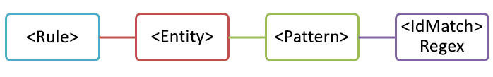
  
Tuttavia, sebbene semplici, questo modello può rilevare molti falsi positivi confrontando il contenuto che include un numero di nove cifre che non è necessariamente un ID dipendente.
  
### <a name="more-common-scenario-entity-with-multiple-patterns"></a>Scenario più comune: entità con più modelli

Per questo motivo, è più comune per definire un'entità con più modelli, laddove i modelli identificano prove a supporto (ad esempio, una parola chiave o una data) oltre all'entità (ad esempio un numero a nove cifre).
  
Ad esempio, per aumentare le probabilità di identificazione di contenuto che include un ID dipendente, è possibile definire anche la data di assunzione e definire un altro modello che identifica sia la data di assunzione che una parola chiave (ad esempio "ID dipendente"), oltre al numero di nove cifre.
  
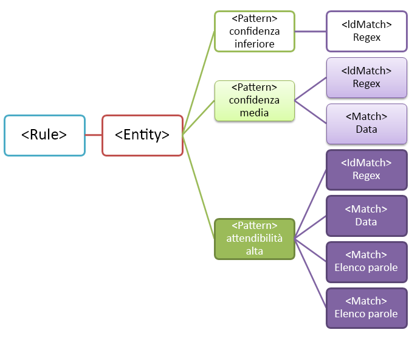
  
Tenere presente alcuni aspetti importanti di questa struttura:
  
- I modelli che richiedono altre prove hanno un livello di sicurezza superiore. Ciò risulta perché, quando più avanti si usa questo tipo di informazioni riservate in un criterio DLP, è possibile utilizzare le azioni più restrittive (ad esempio il blocco del contenuto) solo le corrispondenze di probabilità più alta ed è possibile utilizzare le azioni meno restrittive (ad esempio l'invio di una notifica) le corrispondenze con livello di fiducia inferiore.
    
- Gli elementi di supporto IdMatch e Match fanno riferimento a regex e a parole chiave che in realtà sono elementi figlio di Rule, non di Pattern. Tali elementi di supporto sono utilizzati come riferimento da Pattern, ma sono inclusi in Rule. Questo significa che una singola definizione di un elemento di supporto, come un'espressione regolare o un elenco di parole chiave può funzionare da riferimento per più entità e criteri.
    
## <a name="what-entity-do-you-need-to-identify-entity-element-id-attribute"></a>Quale entità è necessario identificare? [Elemento entità, attributo ID]

Un'entità è un tipo di informazione riservata, ad esempio un numero di carta di credito, con un criterio ben definito. Ogni entità ha un GUID che funziona da ID.
  
### <a name="name-the-entity-and-generate-its-guid"></a>Assegnare un nome all'entità e creare il relativo GUID

Aggiungere gli elementi Rules ed Entity. Quindi aggiungere un commento contenente il nome dell'entità personalizzata, in questo esempio, Employee ID. In un secondo momento, verrà aggiunto il nome dell'entità alla sezione delle stringhe localizzate e tale nome verrà visualizzato nell'interfaccia utente quando si crea un criterio DLP.
  
Quindi, generare un GUID per l'entità. Esistono diversi modi per generare i GUID, ma è possibile farlo facilmente in PowerShell digitando [guid]::NewGuid(). In un secondo momento, verrà inoltre aggiunto il GUID dell'entità alla sezione delle stringhe localizzate.
  
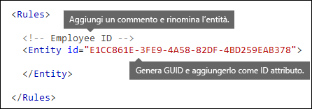
  
## <a name="what-pattern-do-you-want-to-match-pattern-element-idmatch-element-regex-element"></a>Quali criteri si desidera associare? [Elemento pattern, elemento IdMatch, elemento Regex]

Il criterio contiene l'elenco degli elementi cercati dal tipo di informazioni riservate. Può trattarsi di Regex, parole chiave e funzioni integrate (che eseguono attività quali l'esecuzione di Regex per trovare date o indirizzi). I tipi di informazioni riservate possono avere più criteri con probabilità univoche.
  
Tutti i criteri seguenti hanno in comune il fatto che fanno tutti riferimento alla stessa espressione regolare, che consente di cercare un numero di nove cifre (\d{9}) racchiuso da spazi bianchi (\s) … (\s). Questa espressione regolare è oggetto di riferimento da parte dell'IdMatch ed è il requisito comune per tutti i criteri che cercano l'entità ID dipendente. IdMatch è l'identificatore che il criterio sta tentando di associare, ad esempio l'ID dipendente, il numero di carta di credito o il tesserino della previdenza sociale. Un elemento Pattern deve avere esattamente un elemento IdMatch.
  
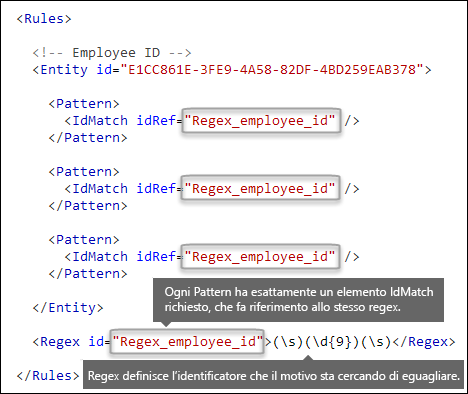
  
Quando viene soddisfatto, un criterio restituisce un numero e un livello di probabilità che è possibile utilizzare nelle condizioni nel criterio DLP. Quando si aggiunge una condizione per il rilevamento di un tipo di informazione riservata a un criterio DLP, è possibile modificare il numero e il livello di probabilità, come illustrato qui. Il livello di probabilità (altrimenti detto precisione di corrispondenza) è illustrato più avanti in questo argomento.
  
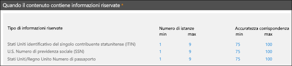
  
Quando si crea l'espressione regolare, tenere presente che esistono problemi da tenere presenti. Ad esempio, se si scrive e si carica un Regex che identifica una quantità eccessiva di contenuto, le prestazioni possono risentirne. Per ulteriori informazioni su questi problemi potenziali, vedere la sezione successiva [Possibili problemi di convalida da tenere presenti](#potential-validation-issues-to-be-aware-of).
  
## <a name="do-you-want-to-require-additional-evidence-match-element-mincount-attribute"></a>Si desidera richiedere altre prove? [elemento Match, attributo minCount]

Oltre a IdMatch, un criterio può utilizzare l'elemento Match per richiedere un'altra prova di supporto, ad esempio una parola chiave, un Regex, una data o un indirizzo.
  
Un criterio può contenere più elementi Match; tali elementi possono essere inclusi direttamente nell'elemento Pattern o combinati mediante l'elemento Any. Gli elementi Match sono uniti da un operatore AND implicito. Affinché il criterio sia corrispondente, tutti gli elementi Match devono essere soddisfatti. È possibile utilizzare l'elemento Any per introdurre gli operatori AND e OR (ulteriori informazioni vengono fornite in una sezione successiva).
  
È possibile usare l'attributo facoltativo minCount per specificare il numero di istanze di una corrispondenza che è necessario trovare per ognuno degli elementi Match. Ad esempio, è possibile specificare che un criterio è soddisfatto solo quando vengono trovate almeno due parole chiave di un elenco di parole chiave.
  
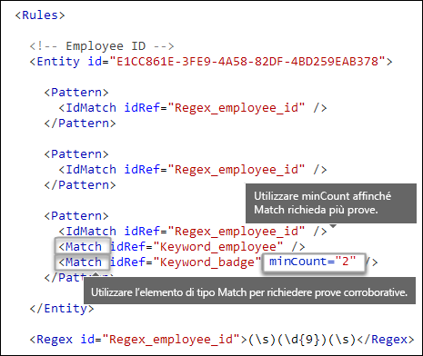
  
### <a name="keywords-keyword-group-and-term-elements-matchstyle-and-casesensitive-attributes"></a>Parole chiave [elementi Keyword, Group e Term, attributi matchStyle e caseSensitive]

Quando si identificano informazioni riservate, ad esempio un ID dipendente, spesso si desidera richiedere parole chiave come prove. Ad esempio, oltre ad associare un numero di nove cifre, è consigliabile cercare parole come "carta", "badge" o "ID". A tal fine, si utilizza l'elemento Keyword. L'elemento Keyword presenta un attributo id che può essere utilizzato come riferimento da più elementi Match in più criteri o entità.
  
Le parola chiave sono incluse come elenco di elementi Term in un elemento Group. L'elemento Group presenta un attributo matchStyle con due valori possibili:
  
- **matchStyle = "word"** La corrispondenza di parole identifica le parole intere racchiuse da spazi o altri delimitatori. È consigliabile usare sempre una parola, a meno che non sia necessario associare parti di parole o parole nelle lingue asiatiche. 
    
- **matchStyle = "string"** La corrispondenza di stringhe identifica le stringhe a prescindere da quello da cui sono circondate. Ad esempio, "id" corrisponde a "bidone" e "idea". Usare l'opzione string solo quando è necessario associare parole asiatiche o se la parola chiave può essere inclusa come parte di altre stringhe. 
    
Infine, è possibile utilizzare l'attributo caseSensitive di un elemento Term per specificare che il contenuto deve corrispondere esattamente alla parola chiave, incluse le lettere minuscole e maiuscole.
  
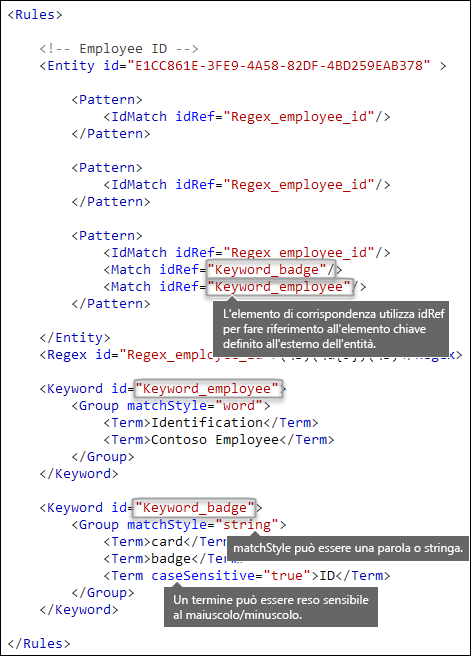
  
### <a name="regular-expressions-regex-element"></a>Espressioni regolari [elemento Regex]

In questo esempio l'entità ID dipendente Usa già l'elemento IdMatch per fare riferimento a un regex per il criterio, un numero di nove cifre racchiuso da spazi. Inoltre, un criterio può utilizzare un elemento Match per fare riferimento a un altro elemento Regex per identificare una prova, ad esempio un numero di cinque o nove cifre nel formato di codice postale ZIP degli Stati Uniti.
  
### <a name="additional-patterns-such-as-dates-or-addresses-built-in-functions"></a>Altri criteri, ad esempio date o indirizzi [funzioni predefinite]

Oltre ai tipi di informazioni riservate predefinite, DLP include anche funzioni predefinite che consentono di identificare una prova, ad esempio una data degli Stati Uniti, una data dell'Unione europea, una data di scadenza o un indirizzo degli Stati Uniti. DLP non supporta il caricamento di funzioni personalizzate, ma quando si crea un tipo di informazioni riservate personalizzate, l'entità può fare riferimento alle funzioni predefinite.
  
Ad esempio, un badge ID dipendente riporta la data di assunzione, in modo che l'entità personalizzata possa usare la funzione predefinita `Func_us_date` per identificare una data nel formato usato comunemente negli Stati Uniti. 
  
Per ulteriori informazioni, vedere [Elementi ricercati tramite le funzioni DLP](what-the-dlp-functions-look-for.md).
  
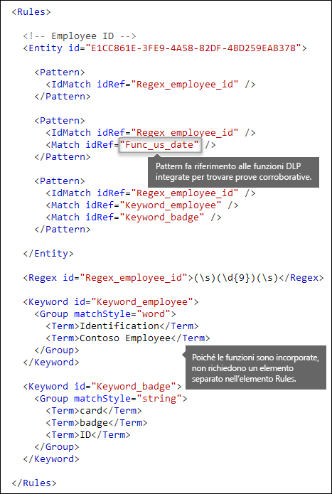
  
## <a name="different-combinations-of-evidence-any-element-minmatches-and-maxmatches-attributes"></a>Diverse combinazioni di prove [elemento Any, attributi minMatches e maxMatches]

In un elemento Pattern tutti gli elementi IdMatch e Match vengono uniti da un operatore implicito AND: affinché il criterio sia soddisfatto, tutte le corrispondenze devono essere soddisfatte. Tuttavia, è possibile creare una logica di corrispondenza più flessibile usando l'elemento Any per raggruppare gli elementi Match. Ad esempio, è possibile usare l'elemento Any per associare tutti, nessuno o uno specifico sottoinsieme di elementi Match figlio.
  
L'elemento Any dispone degli attributi facoltativi minMatches e maxMatches che è possibile utilizzare per definire il numero di elementi figlio Match che devono essere soddisfatti prima della corrispondenza del criterio. Tenere presente che questi attributi definiscono il numero di elementi Match che devono essere soddisfatti, non il numero di istanze di prova trovate per le corrispondenze. Per definire un numero minimo di istanze di una corrispondenza specifica, ad esempio due parole chiave da un elenco, usare l'attributo minCount per un elemento Match (vedere sopra).
  
### <a name="match-at-least-one-child-match-element"></a>Corrispondenza con almeno un elemento Match figlio

Se si desidera richiedere che venga associato solo un numero minimo di elementi Match, è possibile usare l'attributo minMatches. In effetti, questi elementi Match sono uniti da un operatore OR implicito. Questo elemento Any viene soddisfatto se in un elenco viene trovata una data con formato Stati Uniti o un parola chiave.
  
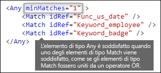
  
### <a name="match-an-exact-subset-of-any-children-match-elements"></a>Associa un sottoinsieme esatto di elementi Match figlio simili

Se si desidera richiedere che venga soddisfatto un numero esatto di elementi Match, è possibile impostare minMatches e maxMatches sullo stesso valore. Questo elemento Any viene soddisfatto solo se viene trovata esattamente una data o una parola chiave; se no vengono trovate più di una, il criterio non sarà soddisfatto.
  

  
### <a name="match-none-of-children-match-elements"></a>Corrispondenza con nessuno degli elementi figlio Match

Se si desidera richiedere l'assenza di prove specifiche affinché venga soddisfatto un criterio, è possibile impostare minMatches e maxMatches entrambi su 0. Ciò può essere utile se si dispone di un elenco di parole chiave o di un'altra prova che probabilmente indichi un falso positivo.
  
Ad esempio, l'entità ID dipendente cerca la parola chiave "carta" perché potrebbe fare riferimento a "carta di identità". Tuttavia, se la parola carta viene visualizzata solo in "carta di credito", è improbabile che significhi "carta di identità". Pertanto, è possibile aggiungere "carta di credito" come parola chiave a un elenco di termini che si desidera escludere da quelli che soddisfano il criterio.
  
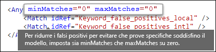
  
## <a name="how-close-to-the-entity-must-the-other-evidence-be-patternsproximity-attribute"></a>Quanto deve essere vicina all'entità l'altra prova? [attributo patternsProximity]

Il tipo di informazioni riservate cerca un criterio che rappresenta un ID dipendente e come parte di tale criterio cerca anche una prova come una parola chiave, ad esempio, ID". È ovvio che la probabilità che il criterio sia un ID dipendente effettivo è superiore se la prova è ravvicinata. È possibile determinare quale debba essere la vicinanza dell'altra prova all'entità nel criterio utilizzando l'attributo patternsProximity dell'elemento Entity.
  
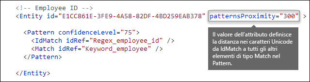
  
Per ciascun criterio nell'entità, il valore dell'attributo patternsProximity definisce la distanza (in caratteri Unicode) dalla posizione IdMatch per tutte le altre corrispondenze specificate per il criterio. La finestra di prossimità viene ancorata mediante la posizione IdMatch e si estende a sinistra e a destra di IdMatch.
  
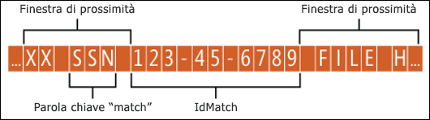
  
L'esempio seguente mostra l'effetto della finestra di prossimità sulla corrispondenza dei criteri dove l'elemento IdMatch per l'entità personalizzata dell'ID dipendente richiede almeno una corrispondenza corroborativa della parola chiave o della data. Solo ID1 corrisponde perché per ID2 e ID3 non viene trovata alcuna prova o solo una prova parziale all'interno della finestra di prossimità.
  
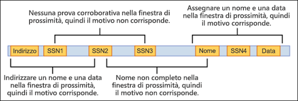
  
Si noti che per la posta elettronica, il corpo del messaggio e ciascun allegato vengono trattati come elementi separati. Questo significa che la finestra di prossimità non si estende oltre la fine di ciascuno di essi. Per ogni elemento (allegato o corpo), sia idMatch che la prova devono risiedere nell'elemento.
  
## <a name="what-are-the-right-confidence-levels-for-different-patterns-confidencelevel-attribute-recommendedconfidence-attribute"></a>Quali sono i livelli di probabilità giusti per i diversi criteri? [attributo confidenceLevel, attributo recommendedConfidence]

Maggiore è la prova richiesta da un criterio, maggiore è la probabilità che un'entità effettiva (ad esempio un ID dipendente) sia stata identificata quando si verifica la corrispondenza al criterio. Ad esempio, un criterio che richiede un numero ID di nove cifre, una data di assunzione e una parole chiave in posizioni molto vicine, rispetto ai criteri che richiedono solo un numero ID di nove cifre hanno una maggiore probabilità.
  
L'elemento Pattern dispone di un attributo confidenceLevel richiesto. È possibile pensare al valore di confidenceLevel (valore integer compreso tra 1 e 100) come a un ID univoco per cisascun criterio in un entità - i criteri di identità devono avere diversi livelli di probabilità che vengono assegnati. Il valore preciso dell'integer non importa: è sufficiente scegliere i numeri che hanno un significato per il team della conformità. Dopo aver caricato il proprio tipo di informazioni sensibili e aver creato un criterio DLP, è possibile fare riferimento a questi livelli di probabilità nelle condizioni delle regole create.
  
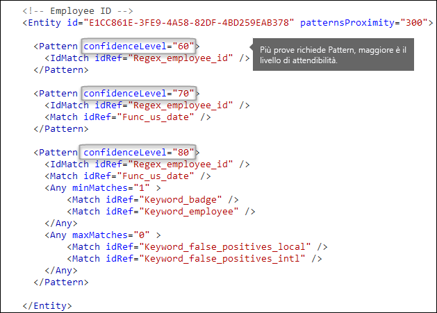
  
Oltre a confidenceLevel per ogni criterio, l'elemento Entity ha un attributo recommendedConfidence. L'attributo della probabilità consigliata può essere considerato come il livello di probabilità predefinito per la regola. Quando si crea una regola in un criterio DLP, se non si specifica un livello di probabilità per la regola da usare, tale regola verrà associata in base al livello di probabilità consigliato per l'entità.
  
## <a name="do-you-want-to-support-other-languages-in-the-ui-of-the-security-amp-compliance-center-localizedstrings-element"></a>Si desidera supportare altre lingue dell'interfaccia utente Centro sicurezza &amp; e conformità? [elemento LocalizedStrings]

Se il team di conformità usa Centro sicurezza e conformità di Office 365 per creare criteri in diverse impostazioni locali e in diverse lingue, è possibile fornire versioni localizzate del nome e descrizione del tipo di informazioni riservate personalizzato. Quando il team di conformità Usa Office 365 in una lingua supportata, nell'interfaccia utente verrà visualizzato il nome localizzato.
  

  
L'elemento Rules deve contenere un elemento LocalizedStrings, che contiene un elemento Resource che fa riferimento al GUID dell'entità personalizzata. A sua volta, ciascun elemento Resource contiene uno o più elementi Name e Description che usano l'attributo langcode per fornire una stringa localizzata per una lingua specifica.
  
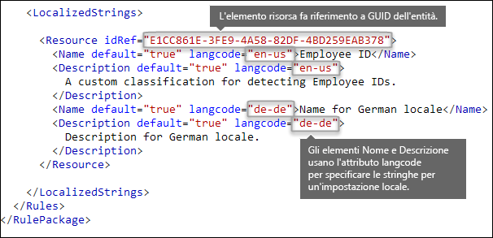
  
Le stringhe localizzate vengono utilizzate solo per il modo in cui le informazioni riservate personalizzate vengono visualizzate nell'interfaccia utente del Centro di conformità e sicurezza. Non è possibile utilizzare le stringhe localizzate per fornire versioni localizzate diverse di un elenco di parole chiave o di un'espressione regolare.
  
## <a name="other-rule-package-markup-rulepack-guid"></a>Altri markup del pacchetto di regole [GUID RulePack]

Infine, l'inizio di ogni RulePackage contiene alcune informazioni generali che è necessario compilare. È possibile usare il markup seguente come modello e sostituire i segnaposto "..." con le proprie informazioni.
  
Cosa ancora più importante, è necessario generare un GUID per RulePack. In precedenza, è stato generato un GUID per l'entità; si tratta di un secondo GUID per RulePack. Esistono diversi modi per generare i GUID, ma è possibile farlo facilmente in PowerShell digitando [guid]::NewGuid().
  
Anche l'elemento Version è importante. Quando si carica il pacchetto di regole per la prima volta, Office 365 annota il numero di versione. In un secondo momento, se si aggiorna il pacchetto di regole e si carica una nuova versione, assicurarsi di aggiornare il numero di versione, altrimenti Office 365 non riuscirà a distribuire il pacchetto di regole.
  
```
<?xml version="1.0" encoding="utf-16"?>
<RulePackage xmlns="http://schemas.microsoft.com/office/2011/mce">
  <RulePack id=". . .">
    <Version major="1" minor="0" build="0" revision="0" />
    <Publisher id=". . ." /> 
    <Details defaultLangCode=". . .">
      <LocalizedDetails langcode=" . . . ">
         <PublisherName>. . .</PublisherName>
         <Name>. . .</Name>
         <Description>. . .</Description>
      </LocalizedDetails>
    </Details>
  </RulePack>
  
 <Rules>
    . . .
 </Rules>
</RulePackage>

```

Una volta completato, l'elemento RulePack dovrebbe avere l'aspetto seguente.
  
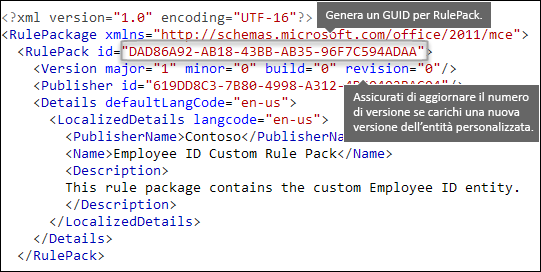
  
## <a name="changes-for-exchange-online"></a>Modifiche per Exchange Online

Nelle versioni precedenti era possibile usare PowerShell di Exchange Online per importare i tipi di informazioni riservate personalizzati per DLP. Ora i tipi di informazioni riservate personalizzati possono essere usati sia in nell'interfaccia di amministrazione di Exchange, nel Centro di sicurezza e conformità. Nell'ambito di questo miglioramento, è consigliabile usare il Centro di sicurezza e conformità PowerShell per importare i tipi di informazioni riservate personalizzati; non è più possibile importare tali informazioni da Exchange PowerShell. I tipi di informazioni riservate personalizzati continueranno a funzionare come prima; tuttavia, per visualizzare le modifiche apportate ai tipi di informazioni riservate personalizzati in Centro di sicurezza e conformità all'interno dell'interfaccia di amministrazione di Exchange è necessario attendere fino a un'ora.
  
In Centro di sicurezza e conformità, per caricare un pacchetto di regole si usa il cmdlet `DlpSensitiveInformationTypeRulePackage`. In precedenza, nell'interfaccia di amministrazione di Exchange si usava il cmdlet `ClassificationRuleCollection`. 
  
## <a name="upload-your-rule-package"></a>Caricare il pacchetto di regole

Per caricare il pacchetto di regole, eseguire i passaggi seguenti:
  
1. Salvarlo come file XML con codifica Unicode.
    
2. [Connettersi a PowerShell per Centro sicurezza e conformità di Office 365](http://go.microsoft.com/fwlink/p/?LinkID=799771)
    
3. Utilizzare la sintassi seguente:

    ```
    New-DlpSensitiveInformationTypeRulePackage -FileData (Get-Content -Path "PathToUnicodeXMLFile" -Encoding Byte)
    ```

    In questo esempio, viene caricato il file XML Unicode denominato MyNewRulePack.xml da C:\Documenti.

    ```
    New-DlpSensitiveInformationTypeRulePackage -FileData (Get-Content -Path "C:\My Documents\MyNewRulePack.xml" -Encoding Byte)
    ```

    Per informazioni dettagliate su sintassi e parametri, vedere [New-DlpSensitiveInformationTypeRulePackage](https://docs.microsoft.com/powershell/module/exchange/policy-and-compliance-dlp/new-dlpsensitiveinformationtyperulepackage).

5. Per verificare che sia stato creato correttamente un nuovo tipo di informazioni riservate, eseguire uno dei passaggi seguenti:

  - Eseguire il comando seguente e verificare che sia elencato il pacchetto di regole:

    ```
    Get-DlpSensitiveInformationTypeRulePackage
    ``` 

  - Eseguire il comando seguente e verificare che sia elencato il tipo di informazioni riservate:

    ```
    Get-DlpSensitiveInformationType
    ``` 

    Per i tipi di informazioni riservate personalizzati, il valore proprietà Publisher sarà diverso da Microsoft Corporation.

  - Sostituire \<Nome\> con il valore nome del tipo di informazioni riservate (ad esempio, il numero ID del dipendente) ed eseguire il comando seguente:

    ```
    Get-DlpSensitiveInformationType -Identity "<Name>"
    ```
    
## <a name="potential-validation-issues-to-be-aware-of"></a>Possibili problemi di convalida da tenere presenti

Quando si carica il file XML del pacchetto di regole, il sistema convalida l'XML e verifica la presenza di criteri noti non corretti noti e problemi di prestazioni evidenti. Di seguito vengono forniti alcuni problemi noti che il processo di convalida controlla in un'espressione regolare:
  
- Non può iniziare o terminare con l'alternatore "|", che associa qualsiasi elemento in quanto viene considerato come una corrispondenza vuota.
    
    Ad esempio, "|a" o "b |" non superano la convalida.
    
- Non può iniziare o terminare con un criterio ".{0, m}", che non ha alcuno scopo funzionale e influisce solo negativamente sulle prestazioni.
    
    Ad esempio, ".{0,50}ASDF" o "ASDF.{0,50}" non supereranno la convalida.
    
- Non può contenere ".{0,m}" o ".{1,m}" nei gruppi e non può contenere ".\*" o ".+" nei gruppi.
    
    Ad esempio, "(.{0,50000})" non supererà la convalida.
    
- Non può contenere alcun carattere con i ripetitori "{0, m}" o "{1, m}" nei gruppi.
    
    Ad esempio, "(a\*)" non supererà la convalida.
    
- Non può iniziare o terminare con ".{1,m}"; utilizzare solo "."
    
    Ad esempio, ".{1,m}asdf" non supererà la convalida; utilizzare solo ".asdf".
    
- Non può contenere un ripetitore non delimitato (ad esempio "\*" o "+") in un gruppo.
    
    Ad esempio, "(xx)\*" e "(xx)+" non supereranno la convalida.
    
Se un tipo di informazioni riservate personalizzato contiene un problema che può influire sulle prestazioni, non verrà caricato e potrebbe essere visualizzato uno di questi messaggi di errore:
  
- **Quantificatori generici che associano maggiore contenuto del previsto (ad esempio, '+', '\*')**
    
- **Asserzioni Lookaround**
    
- **Raggruppamento complesso in combinazione con i quantificatori generali**
    
## <a name="recrawl-your-content-to-identify-the-sensitive-information"></a>Effettuare una nuova ricerca per indicizzazione del contenuto per identificare le informazioni riservate

DLP usa il crawler di ricerca per identificare e classificare le informazioni riservate nel contenuto del sito. Il contenuto nei siti SharePoint Online e OneDrive for Business viene sottoposto nuovamente alla ricerca per indicizzazione ogni volta che viene aggiornata. Ma per identificare il nuovo tipo personalizzato di informazioni riservate in tutto il contenuto esistente, è necessario che venga effettuata una nuova ricerca per indicizzazione.
  
In Office 365 è possibile richiedere manualmente l'esecuzione di una nuova ricerca per indicizzazione di un intero tenant, ma tale operazione è possibile per una raccolta siti, un elenco o una raccolta. Vedere [Richiedere manualmente l'esecuzione di una nuova ricerca per indicizzazione e la reindicizzazione di un sito, una raccolta o un elenco](https://support.office.com/article/9afa977d-39de-4321-b4ca-8c7c7e6d264e).
  
## <a name="remove-a-custom-sensitive-information-type"></a>Rimuovere un tipo di informazioni riservate personalizzato

**Nota**: prima di eliminare un tipo di informazioni riservate personalizzato, verificare che nessun criterio DLP o regola del flusso di posta di Exchange (nota anche come regola di trasporto) faccia ancora riferimento a ancora riferimento al tipo di informazioni riservate.

In PowerShell per Centro sicurezza e conformità, esistono due metodi per eliminare i tipi di informazioni riservate personalizzati:

- **Rimuovere i singoli tipi di informazioni riservate personalizzati**: usare il metodo descritto in [Modificare un tipo di informazioni riservate personalizzato](#modify-a-custom-sensitive-information-type). Esportare il pacchetto di regole personalizzato contenente il tipo di informazioni riservate personalizzato, rimuovere il tipo di informazioni riservate dal file XML e importare nuovamente il file XML aggiornato nel pacchetto di regole personalizzato esistente.

- **Rimuovere un pacchetto di regole personalizzato e tutti i tipi di informazioni riservate personalizzati che questo contiene**: questo metodo è descritto in questa sezione.

1. [Connettersi a PowerShell per Centro sicurezza e conformità di Office 365](http://go.microsoft.com/fwlink/p/?LinkID=799771)

2. Per rimuovere un pacchetto di regole personalizzato, utilizzare la sintassi seguente:

    ```
    Remove-DlpSensitiveInformationTypeRulePackage -Identity "RulePackageIdentity"
    ```

    È possibile utilizzare il valore Nome (per qualsiasi lingua) o il valore `RulePack id` (GUID) per identificare il pacchetto di regole.

    In questo esempio viene rimosso il pacchetto di regole denominato "Pacchetto di regole personalizzate ID dipendente".

    ```
       Remove-DlpSensitiveInformationTypeRulePackage -Identity "Employee ID Custom Rule Pack"
    ```

    Per informazioni dettagliate su sintassi e parametri, vedere [Remove-DlpSensitiveInformationTypeRulePackage](https://docs.microsoft.com/powershell/module/exchange/policy-and-compliance-dlp/remove-dlpsensitiveinformationtyperulepackage).

3. Per verificare che sia stato rimosso correttamente un tipo di informazioni riservate personalizzato, eseguire uno dei passaggi seguenti:

  - Eseguire il comando seguente e verificare che il pacchetto di regole non sia più elencato:

    ```
    Get-DlpSensitiveInformationTypeRulePackage
    ``` 

  - Eseguire il comando seguente e verificare che i tipi di informazioni riservate nel pacchetto di regole rimosse non siano più elencati:

    ```
    Get-DlpSensitiveInformationType
    ``` 

    Per i tipi di informazioni riservate personalizzati, il valore proprietà Publisher sarà diverso da Microsoft Corporation.

  - Sostituire \<Nome\> con il valore nome del tipo di informazioni riservate (ad esempio, il numero ID del dipendente) ed eseguire il comando seguente per verificare che il tipo di informazioni riservate non sia più elencato:

    ```
    Get-DlpSensitiveInformationType -Identity "<Name>"
    ```

## <a name="modify-a-custom-sensitive-information-type"></a>Modificare un tipo di informazioni riservate personalizzato

In PowerShell per Centro sicurezza e conformità, la modifica di un tipo di informazioni riservate personalizzato richiede di:

1. Esportare il pacchetto di regole esistente contenente il tipo di informazioni riservate personalizzato in un file XML (oppure utilizzare il file XML esistente, se disponibile). 

2. Modificare il tipo di informazioni riservate personalizzato nel file XML esportato.

3. Importare nuovamente il file XML aggiornato nel pacchetto di regole esistente.

Per connettersi a PowerShell per Centro sicurezza e conformità, vedere [Connettersi a PowerShell per Centro sicurezza e conformità di Office 365](http://go.microsoft.com/fwlink/p/?LinkID=799771).

#### <a name="step-1-export-the-existing-rule-package-to-an-xml-file"></a>Passaggio 1: esportare il pacchetto di regole esistente in un file XML

**Nota**: se si possiede una copia del file XML (ad esempio, se lo si è appena creato e importato), è possibile andare al passaggio successivo per modificare il file XML.

1. Se non lo si conosce già, eseguire il comando seguente per trovare il nome del pacchetto di regole personalizzato:

    ```
    Get-DlpSensitiveInformationTypeRulePackage
    ```

    **Nota**: il pacchetto di regole predefinite che contiene i tipi di informazioni riservate predefinito è denominato Pacchetto di regole di Microsoft. Il pacchetto di regole che contiene i tipi di informazioni riservate personalizzato creato nell'interfaccia utente del Centro sicurezza e conformità è denominato Microsoft.SCCManaged.CustomRulePack.

2. Per archiviare il pacchetto di regole personalizzato in una variabile, utilizzare la sintassi seguente:

    ```
    $rulepak = Get-DlpSensitiveInformationTypeRulePackage -Identity "RulePackageName"
    ```

   Ad esempio, se il nome del pacchetto di regole è "Pacchetto di regole personalizzate ID dipendente", eseguire il comando seguente:

    ```
    $rulepak = Get-DlpSensitiveInformationTypeRulePackage -Identity "Employee ID Custom Rule Pack"
    ```

3. Per esportare il pacchetto di regole personalizzato in un file XML, utilizzare la sintassi seguente:

    ```
    Set-Content -Path "XMLFileAndPath" -Encoding Byte -Value $rulepak.SerializedClassificationRuleCollection
    ```

    In questo esempio, il pacchetto di regole viene esportato in un file denominato ExportedRulePackage.xml nella cartella C:\Documenti.

    ```
    Set-Content -Path "C:\My Documents\ExportedRulePackage.xml" -Encoding Byte -Value $rulepak.SerializedClassificationRuleCollection
    ```

#### <a name="step-2-modify-the-sensitive-information-type-in-the-exported-xml-file"></a>Passaggio 2: modificare il tipo di informazioni riservate nel file XML esportato

I tipi di informazioni riservate nel file XML e altri elementi nel file sono descritti precedenza in questo argomento.

#### <a name="step-3-import-the-updated-xml-file-back-into-the-existing-rule-package"></a>Passaggio 3: importare nuovamente il file XML aggiornato nel pacchetto di regole esistente

Per importare nuovamente il file XML aggiornato nel pacchetto di regole esistente, utilizzare la sintassi seguente:

```
Set-DlpSensitiveInformationTypeRulePackage -Identity "RulePackageIdentity" -FileData (Get-Content -Path "PathToUnicodeXMLFile" -Encoding Byte)
```

È possibile utilizzare il valore Nome o il valore `RulePack id` (GUID) per identificare il pacchetto di regole.

In questo esempio, il file XML Unicode aggiornato denominato MyUpdatedRulePack.xml viene caricato da C:\Documenti nel pacchetto di regole esistente denominato "Pacchetto di regole personalizzate ID dipendente".

```
Set-DlpSensitiveInformationTypeRulePackage -Identity "Employee ID Custom Rule Pack" -FileData (Get-Content -Path "C:\My Documents\MyUpdatedRulePack.xml" -Encoding Byte)
```

Per informazioni dettagliate su sintassi e parametri, vedere [Set-DlpSensitiveInformationTypeRulePackage](https://docs.microsoft.com/powershell/module/exchange/policy-and-compliance-dlp/set-dlpsensitiveinformationtyperulepackage).

## <a name="reference-rule-package-xml-schema-definition"></a>Riferimento: XML Schema Definition del pacchetto di regole

È possibile copiare questo markup, salvarlo come file XSD e usarlo per convalidare il file XML del pacchetto di regole.
  
```
<?xml version="1.0" encoding="utf-8"?>
<xs:schema xmlns:mce="http://schemas.microsoft.com/office/2011/mce"
           targetNamespace="http://schemas.microsoft.com/office/2011/mce" 
           xmlns:xs="http://www.w3.org/2001/XMLSchema"
           elementFormDefault="qualified"
           attributeFormDefault="unqualified"
           id="RulePackageSchema">
  <!-- Use include if this schema has the same target namespace as the schema being referenced, otherwise use import -->
  <xs:element name="RulePackage" type="mce:RulePackageType"/>
  <xs:simpleType name="LangType">
    <xs:union memberTypes="xs:language">
      <xs:simpleType>
        <xs:restriction base="xs:string">
          <xs:enumeration value=""/>
        </xs:restriction>
      </xs:simpleType>
    </xs:union>
  </xs:simpleType>
  <xs:simpleType name="GuidType" final="#all">
    <xs:restriction base="xs:token">
      <xs:pattern value="[0-9a-fA-F]{8}\-([0-9a-fA-F]{4}\-){3}[0-9a-fA-F]{12}"/>
    </xs:restriction>
  </xs:simpleType>
  <xs:complexType name="RulePackageType">
    <xs:sequence>
      <xs:element name="RulePack" type="mce:RulePackType"/>
      <xs:element name="Rules" type="mce:RulesType">
        <xs:key name="UniqueRuleId">
          <xs:selector xpath="mce:Entity|mce:Affinity|mce:Version/mce:Entity|mce:Version/mce:Affinity"/>
          <xs:field xpath="@id"/>
        </xs:key>
        <xs:key name="UniqueProcessorId">
          <xs:selector xpath="mce:Regex|mce:Keyword|mce:Fingerprint"></xs:selector>
          <xs:field xpath="@id"/>
        </xs:key>
        <xs:key name="UniqueResourceIdRef">
          <xs:selector xpath="mce:LocalizedStrings/mce:Resource"/>
          <xs:field xpath="@idRef"/>
        </xs:key>        
        <xs:keyref name="ReferencedRuleMustExist" refer="mce:UniqueRuleId">
          <xs:selector xpath="mce:LocalizedStrings/mce:Resource"/>
          <xs:field xpath="@idRef"/>
        </xs:keyref>
        <xs:keyref name="RuleMustHaveResource" refer="mce:UniqueResourceIdRef">
          <xs:selector xpath="mce:Entity|mce:Affinity|mce:Version/mce:Entity|mce:Version/mce:Affinity"/>
          <xs:field xpath="@id"/>
        </xs:keyref>
      </xs:element>
    </xs:sequence>
  </xs:complexType>
  <xs:complexType name="RulePackType">
    <xs:sequence>
      <xs:element name="Version" type="mce:VersionType"/>
      <xs:element name="Publisher" type="mce:PublisherType"/>
      <xs:element name="Details" type="mce:DetailsType">
        <xs:key name="UniqueLangCodeInLocalizedDetails">
          <xs:selector xpath="mce:LocalizedDetails"/>
          <xs:field xpath="@langcode"/>
        </xs:key>
        <xs:keyref name="DefaultLangCodeMustExist" refer="mce:UniqueLangCodeInLocalizedDetails">
          <xs:selector xpath="."/>
          <xs:field xpath="@defaultLangCode"/>
        </xs:keyref>
      </xs:element>
      <xs:element name="Encryption" type="mce:EncryptionType" minOccurs="0" maxOccurs="1"/>
    </xs:sequence>
    <xs:attribute name="id" type="mce:GuidType" use="required"/>
  </xs:complexType>
  <xs:complexType name="VersionType">
    <xs:attribute name="major" type="xs:unsignedShort" use="required"/>
    <xs:attribute name="minor" type="xs:unsignedShort" use="required"/>
    <xs:attribute name="build" type="xs:unsignedShort" use="required"/>
    <xs:attribute name="revision" type="xs:unsignedShort" use="required"/>
  </xs:complexType>
  <xs:complexType name="PublisherType">
    <xs:attribute name="id" type="mce:GuidType" use="required"/>
  </xs:complexType>
  <xs:complexType name="LocalizedDetailsType">
    <xs:sequence>
      <xs:element name="PublisherName" type="mce:NameType"/>
      <xs:element name="Name" type="mce:RulePackNameType"/>
      <xs:element name="Description" type="mce:OptionalNameType"/>
    </xs:sequence>
    <xs:attribute name="langcode" type="mce:LangType" use="required"/>
  </xs:complexType>
  <xs:complexType name="DetailsType">
    <xs:sequence>
      <xs:element name="LocalizedDetails" type="mce:LocalizedDetailsType" maxOccurs="unbounded"/>
    </xs:sequence>
    <xs:attribute name="defaultLangCode" type="mce:LangType" use="required"/>
  </xs:complexType>
  <xs:complexType name="EncryptionType">
    <xs:sequence>
      <xs:element name="Key" type="xs:normalizedString"/>
      <xs:element name="IV" type="xs:normalizedString"/>
    </xs:sequence>
  </xs:complexType>
  <xs:simpleType name="RulePackNameType">
    <xs:restriction base="xs:token">
      <xs:minLength value="1"/>
      <xs:maxLength value="64"/>
    </xs:restriction>
  </xs:simpleType>
  <xs:simpleType name="NameType">
    <xs:restriction base="xs:normalizedString">
      <xs:minLength value="1"/>
      <xs:maxLength value="256"/>
    </xs:restriction>
  </xs:simpleType>
  <xs:simpleType name="OptionalNameType">
    <xs:restriction base="xs:normalizedString">
      <xs:minLength value="0"/>
      <xs:maxLength value="256"/>
    </xs:restriction>
  </xs:simpleType>
  <xs:simpleType name="RestrictedTermType">
    <xs:restriction base="xs:string">
      <xs:minLength value="1"/>
      <xs:maxLength value="100"/>
    </xs:restriction>
  </xs:simpleType>
  <xs:complexType name="RulesType">
    <xs:sequence>
      <xs:choice maxOccurs="unbounded">
        <xs:element name="Entity" type="mce:EntityType"/>
        <xs:element name="Affinity" type="mce:AffinityType"/>
        <xs:element name="Version" type="mce:VersionedRuleType"/>
      </xs:choice>
      <xs:choice minOccurs="0" maxOccurs="unbounded">
        <xs:element name="Regex" type="mce:RegexType"/>
        <xs:element name="Keyword" type="mce:KeywordType"/>
        <xs:element name="Fingerprint" type="mce:FingerprintType"/>
        <xs:element name="ExtendedKeyword" type="mce:ExtendedKeywordType"/>
      </xs:choice>
      <xs:element name="LocalizedStrings" type="mce:LocalizedStringsType"/>
    </xs:sequence>
  </xs:complexType>
  <xs:complexType name="EntityType">
    <xs:sequence>
      <xs:element name="Pattern" type="mce:PatternType" maxOccurs="unbounded"/>
      <xs:element name="Version" type="mce:VersionedPatternType" minOccurs="0" maxOccurs="unbounded" />
    </xs:sequence>
    <xs:attribute name="id" type="mce:GuidType" use="required"/>
    <xs:attribute name="patternsProximity" type="mce:ProximityType" use="required"/>
    <xs:attribute name="recommendedConfidence" type="mce:ProbabilityType"/>
    <xs:attribute name="workload" type="mce:WorkloadType"/>
  </xs:complexType>
  <xs:complexType name="PatternType">
    <xs:sequence>
      <xs:element name="IdMatch" type="mce:IdMatchType"/>
      <xs:choice minOccurs="0" maxOccurs="unbounded">
        <xs:element name="Match" type="mce:MatchType"/>
        <xs:element name="Any" type="mce:AnyType"/>
      </xs:choice>
    </xs:sequence>
    <xs:attribute name="confidenceLevel" type="mce:ProbabilityType" use="required"/>
  </xs:complexType>
  <xs:complexType name="AffinityType">
    <xs:sequence>
      <xs:element name="Evidence" type="mce:EvidenceType" maxOccurs="unbounded"/>
      <xs:element name="Version" type="mce:VersionedEvidenceType" minOccurs="0" maxOccurs="unbounded" />
    </xs:sequence>
    <xs:attribute name="id" type="mce:GuidType" use="required"/>
    <xs:attribute name="evidencesProximity" type="mce:ProximityType" use="required"/>
    <xs:attribute name="thresholdConfidenceLevel" type="mce:ProbabilityType" use="required"/>
    <xs:attribute name="workload" type="mce:WorkloadType"/>
  </xs:complexType>
  <xs:complexType name="EvidenceType">
    <xs:sequence>
      <xs:choice maxOccurs="unbounded">
        <xs:element name="Match" type="mce:MatchType"/>
        <xs:element name="Any" type="mce:AnyType"/>
      </xs:choice>
    </xs:sequence>
    <xs:attribute name="confidenceLevel" type="mce:ProbabilityType" use="required"/>
  </xs:complexType>
  <xs:complexType name="IdMatchType">
    <xs:attribute name="idRef" type="xs:string" use="required"/>
  </xs:complexType>
  <xs:complexType name="MatchType">
    <xs:attribute name="idRef" type="xs:string" use="required"/>
    <xs:attribute name="minCount" type="xs:positiveInteger" use="optional"/>
    <xs:attribute name="uniqueResults" type="xs:boolean" use="optional"/>
  </xs:complexType>
  <xs:complexType name="AnyType">
    <xs:sequence>
      <xs:choice maxOccurs="unbounded">
        <xs:element name="Match" type="mce:MatchType"/>
        <xs:element name="Any" type="mce:AnyType"/>
      </xs:choice>
    </xs:sequence>
    <xs:attribute name="minMatches" type="xs:nonNegativeInteger" default="1"/>
    <xs:attribute name="maxMatches" type="xs:nonNegativeInteger" use="optional"/>
  </xs:complexType>
  <xs:simpleType name="ProximityType">
    <xs:union>
      <xs:simpleType>
        <xs:restriction base='xs:string'>
          <xs:enumeration value="unlimited"/>
        </xs:restriction>
      </xs:simpleType>
      <xs:simpleType>
        <xs:restriction base="xs:positiveInteger">
          <xs:minInclusive value="1"/>
        </xs:restriction>
      </xs:simpleType>
    </xs:union>
  </xs:simpleType>
  <xs:simpleType name="ProbabilityType">
    <xs:restriction base="xs:integer">
      <xs:minInclusive value="1"/>
      <xs:maxInclusive value="100"/>
    </xs:restriction>
  </xs:simpleType>
  <xs:simpleType name="WorkloadType">
    <xs:restriction base="xs:string">
      <xs:enumeration value="Exchange"/>
      <xs:enumeration value="Outlook"/>
    </xs:restriction>
  </xs:simpleType>
  <xs:simpleType name="EngineVersionType">
    <xs:restriction base="xs:token">
      <xs:pattern value="^\d{2}\.01?\.\d{3,4}\.\d{1,3}$"/>
    </xs:restriction>
  </xs:simpleType>
  <xs:complexType name="VersionedRuleType">
    <xs:choice maxOccurs="unbounded">
      <xs:element name="Entity" type="mce:EntityType"/>
      <xs:element name="Affinity" type="mce:AffinityType"/>
    </xs:choice>
    <xs:attribute name="minEngineVersion" type="mce:EngineVersionType" use="required" />
  </xs:complexType>
  <xs:complexType name="VersionedPatternType">
    <xs:sequence>
      <xs:element name="Pattern" type="mce:PatternType" maxOccurs="unbounded"/>
    </xs:sequence>
    <xs:attribute name="minEngineVersion" type="mce:EngineVersionType" use="required" />
  </xs:complexType>
  <xs:complexType name="VersionedEvidenceType">
    <xs:sequence>
      <xs:element name="Evidence" type="mce:EvidenceType" maxOccurs="unbounded"/>
    </xs:sequence>
    <xs:attribute name="minEngineVersion" type="mce:EngineVersionType" use="required" />
  </xs:complexType>
  <xs:simpleType name="FingerprintValueType">
    <xs:restriction base="xs:string">
      <xs:minLength value="2732"/>
      <xs:maxLength value="2732"/>
    </xs:restriction>
  </xs:simpleType>
  <xs:complexType name="FingerprintType">
    <xs:simpleContent>
      <xs:extension base="mce:FingerprintValueType">
        <xs:attribute name="id" type="xs:token" use="required"/>
        <xs:attribute name="threshold" type="mce:ProbabilityType" use="required"/>
        <xs:attribute name="shingleCount" type="xs:positiveInteger" use="required"/>
        <xs:attribute name="description" type="xs:string" use="optional"/>
      </xs:extension>
    </xs:simpleContent>
  </xs:complexType>
  <xs:complexType name="RegexType">
    <xs:simpleContent>
      <xs:extension base="xs:string">
        <xs:attribute name="id" type="xs:token" use="required"/>
      </xs:extension>
    </xs:simpleContent>
  </xs:complexType>
  <xs:complexType name="KeywordType">
    <xs:sequence>
      <xs:element name="Group" type="mce:GroupType" maxOccurs="unbounded"/>
    </xs:sequence>
    <xs:attribute name="id" type="xs:token" use="required"/>
  </xs:complexType>
  <xs:complexType name="GroupType">
    <xs:sequence>
      <xs:choice>
        <xs:element name="Term" type="mce:TermType" maxOccurs="unbounded"/>
      </xs:choice>
    </xs:sequence>
    <xs:attribute name="matchStyle" default="word">
      <xs:simpleType>
        <xs:restriction base="xs:NMTOKEN">
          <xs:enumeration value="word"/>
          <xs:enumeration value="string"/>
        </xs:restriction>
      </xs:simpleType>
    </xs:attribute>
  </xs:complexType>
  <xs:complexType name="TermType">
    <xs:simpleContent>
      <xs:extension base="mce:RestrictedTermType">
        <xs:attribute name="caseSensitive" type="xs:boolean" default="false"/>
      </xs:extension>
    </xs:simpleContent>
  </xs:complexType>
  <xs:complexType name="ExtendedKeywordType">
    <xs:simpleContent>
      <xs:extension base="xs:string">
        <xs:attribute name="id" type="xs:token" use="required"/>
      </xs:extension>
    </xs:simpleContent>
  </xs:complexType>
  <xs:complexType name="LocalizedStringsType">
    <xs:sequence>
      <xs:element name="Resource" type="mce:ResourceType" maxOccurs="unbounded">
      <xs:key name="UniqueLangCodeUsedInNamePerResource">
        <xs:selector xpath="mce:Name"/>
        <xs:field xpath="@langcode"/>
      </xs:key>
      <xs:key name="UniqueLangCodeUsedInDescriptionPerResource">
        <xs:selector xpath="mce:Description"/>
        <xs:field xpath="@langcode"/>
      </xs:key>
    </xs:element>
    </xs:sequence>
  </xs:complexType>
  <xs:complexType name="ResourceType">
    <xs:sequence>
      <xs:element name="Name" type="mce:ResourceNameType" maxOccurs="unbounded"/>
      <xs:element name="Description" type="mce:DescriptionType" minOccurs="0" maxOccurs="unbounded"/>
    </xs:sequence>
    <xs:attribute name="idRef" type="mce:GuidType" use="required"/>
  </xs:complexType>
  <xs:complexType name="ResourceNameType">
    <xs:simpleContent>
      <xs:extension base="xs:string">
        <xs:attribute name="default" type="xs:boolean" default="false"/>
        <xs:attribute name="langcode" type="mce:LangType" use="required"/>
      </xs:extension>
    </xs:simpleContent>
  </xs:complexType>
  <xs:complexType name="DescriptionType">
    <xs:simpleContent>
      <xs:extension base="xs:string">
        <xs:attribute name="default" type="xs:boolean" default="false"/>
        <xs:attribute name="langcode" type="mce:LangType" use="required"/>
      </xs:extension>
    </xs:simpleContent>
  </xs:complexType>
</xs:schema>

```

## <a name="more-information"></a>Ulteriori informazioni

- [Panoramica relativa ai criteri di prevenzione della perdita di dati](data-loss-prevention-policies.md)
    
- [Cosa individuano le tipologie di informazioni sensibili](what-the-sensitive-information-types-look-for.md)
    
- [Cosa individuano le funzioni di prevenzione della perdita dei dati](what-the-dlp-functions-look-for.md)
    

