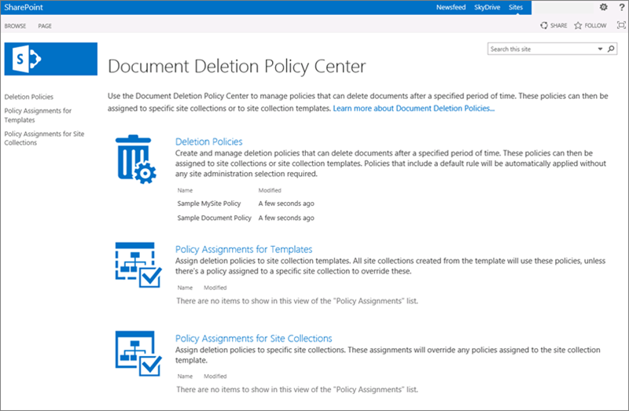

# Creare un criterio di eliminazione dei documentiCreate a document deletion policy

> [!IMPORTANT]
> Spostarsi avanti, è consigliabile utilizzare un criterio di conservazione o etichette create per la protezione &amp; centro conformità anziché un criterio di eliminazione del documento. Criteri di eliminazione dei documenti continuerà a funzionare Affianca i criteri di conservazione, ma se è necessario mantenere o eliminare contenuto via Internet in Office 365, è consigliabile utilizzare un criterio di conservazione. Per ulteriori informazioni, vedere [utilizzare un criterio di conservazione invece di queste funzionalità](retention-policies.md#use-a-retention-policy-instead-of-these-features).Moving forward, we recommend that you use a retention policy or labels created in the Security &amp; Compliance Center instead of a document deletion policy. Document deletion policies will continue to work side by side with retention policies, but if you need to retain or delete content anywhere in Office 365, we recommend that you use a retention policy. For more information, see [Use a retention policy instead of these features](retention-policies.md#use-a-retention-policy-instead-of-these-features). 
  
Alle organizzazioni viene spesso richiesto di conservare i documenti per un determinato periodo di tempo a causa di norme legate alla conformità, legali o di altro tipo. Tuttavia, conservare i documenti per un periodo superiore a quello richiesto può esporre l'organizzazione a un rischio legale.Organizations are often required to retain documents for a certain period of time due to compliance, legal, or other regulations. However, retaining documents for longer than required can expose the organization to legal risk.
  
Con un criterio di eliminazione dei documenti, è possibile ridurre in modo proattivo rischio eliminando i documenti in un sito dopo un periodo di tempo specifico, ad esempio, è possibile eliminare documenti OneDrive degli utenti per Business siti cinque anni dopo che sono stati creati i documenti.With a document deletion policy, you can proactively reduce risk by deleting documents in a site after a specific period of time—for example, you can delete documents in users' OneDrive for Business sites five years after the documents were created. 
  
Dopo aver creato un criterio di eliminazione dei documenti, puoi assegnarlo a un modello di raccolta siti, in modo che il criterio sia disponibile per tutte le raccolte di siti create da tale modello. Puoi anche assegnare il criterio a una raccolta di siti specifica, sostituendo tutti i criteri che potrebbero essere stati assegnati al modello di tale raccolta di siti.After you create a document deletion policy, you can assign it to a site collection template, so that the policy is available to all site collections created from that template. You can also assign a policy to a specific a site collection, which overrides any policies that may have been assigned to the template for that site collection.
  

  
## Modelli dei criteriPolicy templates

È possibile creare dei criteri per l'eliminazione dei documenti da zero o utilizzare uno dei criteri di esempio. Il centro criteri di conformità include dei criteri di esempio che è possibile utilizzare così come sono. In alternativa, è possibile usarli come punto di partenza per poi rinominarli o modificarli.You can create a document deletion policy from scratch, or you can use one of the sample policies. The Compliance Policy Center includes sample policies that you can use as is, or you can use them as a starting point and then rename or modify them.
  

  
## Esempi di come utilizzare i criteri di eliminazione dei documentiExamples of how to use document deletion policies

Una raccolta siti o un modello di raccolta siti può avere uno più criteri a esso assegnati e ognuno di questi criteri può avere una o più regole. Tuttavia, può esistere solo un criterio che è attivo per ogni sito e può esistere una sola regola di eliminazione è attiva in qualsiasi momento per le raccolte all'interno del sito.A site collection or a site collection template can have one more policies assigned to it, and each of those policies can have one or more rules. However, there can be only one policy that's active per site, and there can be only one deletion rule that's active at any time for the libraries within the site.
  

  
Inoltre, puoi selezionare un criterio come obbligatorio o predefinito e puoi selezionare una regola di eliminazione come regola predefinita:In addition, you can select a policy as mandatory or default, and you can select a deletion rule as a default rule: 
  
- **Criterio obbligatorio** Quando un criterio viene contrassegnato come obbligatorio, è possibile assegnare un solo criterio alla raccolta siti o del modello. Il criterio deve essere contrassegnato come predefinito e verrà applicato a tutti i siti. I proprietari del sito non possono disattivare completamente il criterio.**Mandatory policy**When a policy is marked as mandatory, only one policy can be assigned to the site collection or template. The policy must be marked as default and will be applied to all sites. Site owners cannot opt out of the policy.
    
- **Criterio predefinito** Quando un criterio viene contrassegnato come predefinito, il criterio è automaticamente attivo in tutti i siti che è assegnato con proprietario del sito debba eseguire alcuna operazione.**Default policy**When a policy is set as default, the policy is automatically active in all sites that it's assigned to with no action required by site owner.
    
- **Regola predefinita** Quando una regola di eliminazione viene configurata come predefinita, viene automaticamente applicata a tutte le librerie nei siti che usano il criterio.**Default rule**When a deletion rule is set as default, it is automatically applied to all libraries in the sites that use the policy.
    
Nei seguenti esempi viene spiegato quando occorre usare un criterio obbligatorio o criteri e regole predefinite.The following examples explain when you might want to use a mandatory policy or default policies and rules.
  
### Esempio 1: applicare un solo criterio con una sola regola a un modello di raccolta di sitiExample 1: Apply a single policy with a single rule to a site collection template

Potresti voler applicare un criterio di eliminazione dei documenti in un'ampia gamma di contenuto non strutturato, come i siti di OneDrive for Business o del team. Se vuoi essere sicuro che un solo criterio di eliminazione dei documenti sia attivo in tutti i siti creati da un modello di raccolta siti, puoi:You may want to enforce a document deletion policy across a broad range of unstructured content, such as all OneDrive for Business sites or all team sites. If you want to ensure that a single document deletion policy is active in all sites created from a site collection template, you can:
  
1. Creare un unico criterio con una sola regola di eliminazione predefinita.Create a single policy with a single default deletion rule.
    
2. Impostare il criterio come obbligatorio e predefinito.Set the policy as mandatory and default.
    
3. Assegnare il criterio a un modello di raccolta siti.Assign the policy to a site collection template.
    
In questo esempio, la regola di eliminazione predefinita verrà applicata a tutti le librerie in tutte le raccolte di siti create dal modello, e i proprietari del sito non potranno rifiutare esplicitamente il criterio. Questo è il modo più semplice per applicare su vasta scala e rigidamente un criterio di eliminazione dei documenti.In this example, the default deletion rule will be applied to all libraries in all site collections created from the template, and site owners cannot opt out of the policy. This is the simplest way to broadly and rigidly enforce a document deletion policy.
  

  
### Nell'esempio 2: Applicare un solo criterio con diverse regole a un modello di raccolta sitiExample 2: Apply a single policy with several rules to a site collection template

I proprietari del sito spesso conoscono bene il tipo di contenuto presente nel sito, quindi potresti scegliere di consentire ai proprietari del sito di selezionare la regola di eliminazione più adatta al loro sito. Potresti inoltre voler consentire ai proprietari del sito di rifiutare completamente un criterio.Site owners often know best what type of content their site contains, so you may choose to allow site owners to select the deletion rule that best applies to their site. You may also want to allow site owners to opt out of a policy entirely.
  
Allo stesso tempo, puoi comunque creare e gestire centralmente i criteri. Puoi anche selezionare un criterio e una regola come predefiniti, in modo che un criterio sia sempre valido finché il proprietario non ne sceglie uno diverso o lo rifiuti. Se vuoi offrire tale flessibilità ai proprietari del sito, puoi:At the same time, you can still centrally create and manage the policies. You can also select one policy and rule as the default, so that a policy is always in effect until the site owner chooses a different one or opts out. If you want to provide such flexibility to site owners, you can:
  
1. Creare un solo criterio con diverse regole di eliminazione e impostare una regola come predefinita.Create a single policy with several deletion rules, and set one rule as the default.
    
2. Impostare il criterio come criterio predefinito.Set the policy as the default policy.
    
3. Assegnare il criterio a un modello di raccolta siti.Assign the policy to a site collection template.
    
I proprietari del sito possono selezionare una delle regole di eliminazione alternative, rifiutare il criterio o non fare nulla ed essere soggetti al criterio e alla regola predefiniti.Site owners can select one of the alternate deletion rules, opt out of the policy, or do nothing and be subject to the default policy and rule.
  

  
### Esempio 3: applicare diversi criteri con una o più regole a una raccolta sitiExample 3: Apply several policies with one or more rules to a site collection

Questo esempio offre la massima flessibilità ai proprietari del sito perché possono scegliere tra diversi criteri e dopo aver selezionato un criterio, possono spesso scegliere tra diverse regole. Un criterio e una regola vengono impostati come predefiniti, in modo che un criterio sia sempre valido finché il proprietario del sito non ne sceglie uno diverso o lo rifiuti. Tieni presente che se non imposti un criterio e una regola come predefiniti, nessun criterio o nessuna regola saranno attivi per le librerie di documenti nel sito finché il proprietario del sito non li selezionerà e applicherà.This example provides the maximum flexibility to site owners because they can choose from several policies, and after selecting a policy they can often choose from several rules. One policy and rule are set as default, so that a policy is always in effect until the site owner chooses a different one or opts out. Note that if you do not set a policy and rule as the default, then no policies or rules will be active for the document libraries in the site until the site owner takes action to select and apply them.
  
Diversamente dai due esempi precedenti, questi criteri vengono assegnati a una raccolta di siti specifica, non al modello di raccolta di siti. Ciò significa che i criteri possono essere ancora più specificatamente personalizzati in base al contenuto in una raccolta di siti specifica.Unlike the previous two examples, these policies are assigned to a specific site collection — not the site collection template. This means the policies can be more specifically tailored for the content in a specific site collection.
  
I criteri e le regole sono ereditate. I proprietari del sito possono selezionare una regola e un criterio per il proprio sito e tutti i siti secondari erediteranno il criterio dal sito principale. Tuttavia, un proprietario di un sito secondario può interrompere l'ereditarietà selezionando un altro criterio e un'altra regola, che a loro volta verranno applicati a tutti i siti secondari finché l'ereditarietà non verrà di nuovo interrotta.Policies and rules are inherited. Site owners can select a policy and rule for their site, and all subsites inherit the policy from the parent. However, an owner of a subsite can break inheritance by selecting a different policy and rule, which in turn applies to all subsites until inheritance is broken again.
  
Per impostare questo scenario, puoi:To set up this scenario, you can:
  
1. Creare diversi criteri che contengono una o più regole.Create several policies that each contains one or more rules.
    
2. Impostare un criterio e una regola come predefiniti.Set a policy and rule as the default.
    
3. Assegnare i criteri a una raccolta siti specifica.Assign the policies to a specific site collection.
    
Inoltre, i criteri e le regole vengono creati in base a una raccolta di siti specifica, dove i proprietari del sito possono interrompere l'ereditarietà selezionando il criterio e la regola più adatti al proprio sito.In addition, the policies and rules are tailored to a specific site collection, where site owners can break inheritance by selecting the policy and rule that best applies to their site.
  

  
## Creare un criterio di eliminazione dei documentiCreate a document deletion policy

1. In 365Security Office &amp; centro conformità, passare a **gestione dei dati** \> **conservazione**. In **Elimina**, fare clic su **Gestisci criteri di eliminazione dei documenti di SharePoint Online e OneDrive for Business**. Il centro di criteri di eliminazione documento verrà aperto in una nuova scheda browser.In the Office 365Security &amp; Compliance Center, navigate to **Data management** \> **Retention**. Under **Delete**, click **Manage document deletion policies for SharePoint Online and OneDrive for Business**. The Document Deletion Policy Center opens in a new browser tab.
    
    La prima volta passare dal titolo &amp; centro conformità all'interfaccia di criteri di eliminazione di documenti, il centro dei criteri viene automaticamente creato. In alternativa, è possibile creare manualmente il centro di criterio [della raccolta siti di creazione](http://go.microsoft.com/fwlink/p/?LinkID=404342) e scegliendo **Centro conformità criteri** nella scheda **organizzazione** .The first time you navigate from the Security &amp; Compliance Center to the Document Deletion Policy Center, the policy center is automatically created for you. Alternatively, you can manually create the policy center by [creating the site collection](http://go.microsoft.com/fwlink/p/?LinkID=404342) and choosing **Compliance Policy Center** on the **Enterprise** tab. 
    
2. Scegliere **i criteri di eliminazione**.Choose **Deletion Policies**.
    
    
  
3. Scegli **nuovo elemento**.Choose **new item**.
    
4. Inserisci un nome e una descrizione per il criterio. I proprietari del sito possono selezionare un criterio per il proprio sito in base al nome o alla descrizione, quindi ti consigliamo di inserire abbastanza informazioni per permettergli di scegliere il criterio corretto.Enter a policy name and description. Site owners may be selecting a policy for their site based on this name and description, so include enough information for them to choose the correct policy.
    
5. Per creare una regola, scegli **Nuova**.To create a rule, choose **New**.
    
6. Inserisci un nome e scegli le seguenti opzioni:Enter a name and choose the following options:
    
  - Scegliere se la regola sarà eliminazione documenti o eliminarli nel Cestino. Cestino fornisce una rete sicura Cestino prima che un elemento viene eliminato definitivamente da un sito. Per ulteriori informazioni su Cestino, vedere [svuotare il Cestino o il ripristino dei file](http://go.microsoft.com/fwlink/p/?LinkID=404348).Choose whether the rule will permanently delete documents or delete them to the Recycle Bin. The Recycle Bin provides a second-stage safety net before an item is permanently deleted from a site. For more information about the Recycle Bin, see [Empty the Recycle Bin or restore your files](http://go.microsoft.com/fwlink/p/?LinkID=404348).
    
  - Scegli se la data di eliminazione deve essere creata dalla data di creazione del documento a da quella dell'ultima modifica.Choose whether the deletion date is calculated from the date when a document was created or last modified.
    
  - Inserisci un numero di giorni, mesi o anni come periodo di tempo dopo il quale un documento deve essere eliminato.Enter a number of days, months, or years as the time period after which a document will be deleted.
    
  - Scegli se la regola è una regola predefinita. La prima regola creata viene automaticamente impostata come la regola predefinita. Una regola predefinita viene automaticamente applicata a tutte le librerie nei siti che usano il criterio.Choose whether the rule is a default rule. The first rule that you create is automatically set as the default rule. A default rule is automatically applied to all libraries in the sites that use the policy.
    

  
7. Fare clic su **Salva**.Click **Save**.
    
8. Crea regole aggiuntive se vuoi che i proprietari del sito possano scegliere diverse regole da applicare al proprio sito. Verrà applicata la regola predefinita, se presente, se il proprietario del sito non esegue alcuna azione.Create additional rules if you want site owners to be able to choose different rules to apply to their site. The default rule, if any, will be applied if the site owner takes no action.
    
9. Per rimuovere una regola da un criterio, selezionare la regola, fare clic su **Elimina**e quindi fare clic su **OK**.To remove a rule from a policy, select the rule, click **Delete**, and then click **OK**.
    
    > [!NOTE]
    > Se si elimina una regola, il criterio non contiene una regola predefinita, quindi alcuna regola non verrà attivata per tale criterio, in altre parole, non i documenti verranno eliminati.If you delete a rule, and the policy does not contain a default rule, then no rule will be in effect for that policy—in other words, no documents will be deleted. 
  

  
## Assegnare il criterio di eliminazione dei documenti a un modello di raccolta di sitiAssign the document deletion policy to a site collection template

Assegnando un criterio a un modello di raccolta di siti, puoi rendere disponibile il criterio per tutte le raccolte di siti create dal tale modello, comprese le raccolte di siti esistenti e le raccolte di siti create nel futuro.By assigning a policy to a site collection template, you make the policy available to all site collections created from that template, including both existing site collections and site collections created in the future.
  
È importante tenere presente che il periodo di tempo specificato per un documento di un criterio di eliminazione indica il tempo in quanto il documento è stato creato o modificato, non l'ora in quanto è stato assegnato il criterio. Quando si assegna il criterio per la prima volta, tutti i documenti nel sito vengono valutati e, se soddisfano i criteri, verranno eliminati. Ciò vale per tutti i documenti, non appena nuovi documenti creati in quanto è stato assegnato il criterio.It's important to understand that the time period specified for a document deletion policy means the time since the document was created or modified, not the time since the policy was assigned. When you assign the policy for the first time, all documents in the site are evaluated and, if they meet the criteria, they will be deleted. This applies to all existing documents, not just new documents created since the policy was assigned.
  
1. In sicurezza &amp; centro conformità, passare a **gestione dei dati** \> **conservazione**. In **Elimina**, fare clic su **Gestisci criteri di eliminazione dei documenti di SharePoint Online e OneDrive for Business**. Il centro di criteri di eliminazione documento verrà aperto in una nuova scheda browser.In the Security &amp; Compliance Center, navigate to **Data management** \> **Retention**. Under **Delete**, click **Manage document deletion policies for SharePoint Online and OneDrive for Business**. The Document Deletion Policy Center opens in a new browser tab.
    
2. Scegli **Assegnazioni dei criteri per i modelli**.Choose **Policy Assignments for Templates**.
    
    
  
3. Scegli **nuovo elemento**.Choose **new item**.
    
4. Eseguire una delle operazioni seguenti:Do one of the following:
    
  - Per assegnare il criterio a un modello di raccolta di siti come il modello Siti del team, seleziona **Assegna a un modello di raccolta di siti**, quindi seleziona il modello di raccolta di siti.To assign the policy to a site collection template such as the Team Site template, select **Assign to site collection template**, and then select the site collection template.
    
  - Per assegnare il criterio a One Drive degli utenti per le aziende, scegliere **assegnare a OneDrive for Business modello**, evidenziato in basso.To assign the policy to users' One Drive for Business, choose **Assign to OneDrive for Business Template**, highlighted below.
    
    > [!NOTE]
    > Quando assegni un criterio a un modello di raccolta di siti, tale criterio sarà disponibile sia per le raccolte di siti esistenti create dal modello, sia per quelle che verranno create in futuro.When you assign a policy to a site collection template, that policy will be available both to existing site collections created from that template and to site collections created in the future. 
  

  
5. Fare clic su **Salva**.Click **Save**.
    
    > [!NOTE]
    > Ogni modello può avere un solo set di criteri a esso assegnato. Se viene visualizzato un errore indicante che questo modello include già i criteri assegnati a esso, scegliere **Annulla** \> **assegnare alla raccolta siti** nel riquadro di spostamento sinistro \> selezionare una raccolta siti per visualizzare e gestire set di criteri che sono già assegnato.Each template can have only one set of policies assigned to it. If you see an error saying that this template already has policies assigned to it, choose **Cancel** \> **Assign to Site Collection** in the left navigation \> select a site collection to view and manage the set of policies that are already assigned. 
  
6. Scegli **Gestisci criteri assegnati**, selezionare i criteri che si desidera assegnare e quindi scegliere se un criterio è il criterio predefinito. Quando si imposta un criterio predefinito, tutti i siti assegnati al criterio automaticamente hanno il criterio attivo con proprietario del sito debba eseguire alcuna operazione.Choose **Manage Assigned Policies**, select the policies that you want to assign, and then choose whether one policy is the default policy. When you set a default policy, all sites assigned to the policy automatically have the policy active with no action required by site owner.
    
    
  
7. Fare clic su **Salva**.Click **Save**.
    
8. Se vuoi applicare il criterio nei siti senza consentire ai proprietari del sito di rifiutarlo, scegli **Contrassegna il criterio come obbligatorio**. Quando rendi un criterio obbligatorio, solo il singolo criterio può essere assegnato al modello di raccolta di siti. Il criterio deve essere contrassegnato anche come predefinito.If you want to enforce the policy on all sites without allowing site owners to opt out, choose **Mark Policy as Mandatory**. When you make a policy mandatory, only that single policy can be assigned to the site collection template. The policy must also be marked as default.
    
    Se questa opzione è in grigio, scegli **Gestisci criteri assegnati** e controlla che almeno un criterio sia assegnato e impostato come predefinito.If this option is grayed out, choose **Manage Assigned Policies** and make sure that at least one policy is assigned and set as default. 
    
9. Fare clic su **Salva**.Click **Save**.
    
## Assegnare il criterio di eliminazione dei documenti a una raccolta di sitiAssign the document deletion policy to a site collection

Assegnando un criterio a una raccolta di siti specifica, rendi disponibile il criterio solo per tale raccolta di siti specifica. Ciò significa che puoi meglio adattare i criteri al contenuto della raccolta di siti. Inoltre, i criteri assegnati a una raccolta di siti specifica sostituiranno tutti i criteri assegnati al modello di tale raccolta di siti. Ad esempio, un criterio assegnato alla raccolta di siti Reparto vendite (creato dal modello Siti del team) sostituirà tutti i criteri assegnati al modello Siti del team.By assigning a policy to a specific site collection, you make the policy available only to that specific site collection. This means you can tailor policies more closely to the content in the site collection. Also, policies assigned to a specific site collection will override any policies that are assigned to the template for that site collection. For example, a policy assigned to the Sales Department site collection (created from the Team Site template) will override any policies assigned to the Team Site template.
  
È importante tenere presente che il periodo di tempo specificato per un documento di un criterio di eliminazione indica il tempo in quanto il documento è stato creato o modificato, non l'ora in quanto è stato assegnato il criterio. Quando si assegna il criterio per la prima volta, tutti i documenti nel sito vengono valutati e, se soddisfano i criteri, verranno eliminati. Ciò vale per tutti i documenti, non appena nuovi documenti creati in quanto è stato assegnato il criterio.It's important to understand that the time period specified for a document deletion policy means the time since the document was created or modified, not the time since the policy was assigned. When you assign the policy for the first time, all documents in the site are evaluated and, if they meet the criteria, they will be deleted. This applies to all existing documents, not just new documents created since the policy was assigned.
  
1. In sicurezza &amp; centro conformità, passare a **gestione dei dati** \> **conservazione**. In **Elimina**, selezionare **Gestisci criteri di eliminazione dei documenti di SharePoint Online e OneDrive for Business**. Il centro di criteri di eliminazione documento verrà aperto in una nuova scheda browser.In the Security &amp; Compliance Center, navigate to **Data management** \> **Retention**. Under **Delete**, choose **Manage document deletion policies for SharePoint Online and OneDrive for Business**. The Document Deletion Policy Center opens in a new browser tab.
    
2. Scegli **Assegnazioni dei criteri per le raccolte di siti**.Choose **Policy Assignments for Site Collections**.
    
    
  
3. Scegli **nuovo elemento**.Choose **new item**.
    
4. Scegli **Scegli una raccolta siti**. Ricerca per la raccolta siti per nome o URL, selezionare la raccolta siti e fare clic su **Salva**.Choose **Choose a site collection**. Search for the site collection by name or URL, select the site collection and click **Save**.
    
    > [!NOTE]
    > Ogni raccolta siti può includere solo un set di criteri a esso assegnato. Se viene visualizzato un errore indicante che sito contiene già i criteri assegnati a esso, scegliere **Annulla** \> **assegnare alla raccolta siti** e selezionare una raccolta siti per visualizzare e gestire set di criteri che sono già state assegnate.Each site collection can have only one set of policies assigned to it. If you see an error saying that this site collection already has policies assigned to it, choose **Cancel** \> **Assign to Site Collection** and select a site collection to view and manage the set of policies that are already assigned. 
  

  
5. Scegli **Gestisci criteri assegnati**, selezionare i criteri che si desidera assegnare e quindi scegliere se un criterio è il criterio predefinito. Quando si imposta un criterio predefinito, tutti i siti assegnati al criterio automaticamente hanno il criterio attivo con proprietario del sito debba eseguire alcuna operazione.Choose **Manage Assigned Policies**, select the policies that you want to assign, and then choose whether one policy is the default policy. When you set a default policy, all sites assigned to the policy automatically have the policy active with no action required by site owner.
    
    
  
6. Fare clic su **Salva**.Click **Save**.
    
7. Se vuoi applicare il criterio nei siti senza consentire ai proprietari del sito di rifiutarlo, scegli **Contrassegna il criterio come obbligatorio**. Quando rendi un criterio obbligatorio, solo il singolo criterio può essere assegnato alla raccolta di siti. Il criterio deve essere contrassegnato anche come predefinito.If you want to enforce the policy on all sites without allowing site owners to opt out, choose **Mark Policy as Mandatory**. When you make a policy mandatory, only that single policy can be assigned to the site collection. The policy must also be marked as default.
    
    Se questa opzione è in grigio, scegli **Gestisci criteri assegnati** e controlla che almeno un criterio sia assegnato e impostato come predefinito.If this option is grayed out, choose **Manage Assigned Policies** and make sure that at least one policy is assigned and set as default. 
    
8. Fare clic su **Salva**.Click **Save**.
    
## Eliminare l'assegnazione di un criterioDelete a policy assignment

Quando elimini un'assegnazione, i criteri assegnati non verranno più applicati ai siti nella raccolta di siti o nel modello di raccolta di siti.When you delete an assignment, the assigned policies will no longer apply to any sites in the site collection or site collection template.
  
1. In sicurezza &amp; centro conformità, passare a **gestione dei dati** \> **conservazione**. In **Elimina**, selezionare **Gestisci criteri di eliminazione dei documenti di SharePoint Online e OneDrive for Business**. Il centro di criteri di eliminazione documento verrà aperto in una nuova scheda browser.In the Security &amp; Compliance Center, navigate to **Data management** \> **Retention**. Under **Delete**, choose **Manage document deletion policies for SharePoint Online and OneDrive for Business**. The Document Deletion Policy Center opens in a new browser tab.
    
2. Scegliere una delle opzioni **Assegnazioni dei criteri per i modelli** o **Assegnazioni dei criteri per le raccolte di siti**.Choose either **Policy Assignments for Templates** or **Policy Assignments for Site Collections**.
    
3. Selezionare l'elemento di assegnazione e fare clic su **Elimina elemento**.Select the assignment item and click **Delete Item**.
    
    
  
## Eliminare un criterioDelete a policy

È possibile eliminare un criterio in uso. Prima che è possibile eliminare un criterio, è innanzitutto necessario eliminare tutte le assegnazioni per le raccolte siti e modelli di raccolte siti che includono il criterio, vedere la sezione precedente.You can't delete a policy that's in use. Before you can delete a policy, you first need to delete all assignments to site collections and site collection templates that include that policy—see the previous section.
  
1. In sicurezza &amp; centro conformità \> scegliere **gestione dati** \> **conservazione** nel riquadro di spostamento sinistro \> in **Elimina** \> **eliminazione documenti Gestisci criteri per SharePoint Online e OneDrive per le aziende**. Il centro di criteri di eliminazione documento verrà aperto in una nuova scheda browser.In the Security &amp; Compliance Center \> choose **Data management** \> **Retention** in the left navigation \> under **Delete** \> **Manage document deletion policies for SharePoint Online and OneDrive for Business**. The Document Deletion Policy Center opens in a new browser tab.
    
2. Scegliere * * i criteri di eliminazione * *.Choose ** Deletion Policies **.
    
    
  
3. Seleziona il criterio.Select the policy.
    
4. Sulla barra multifunzione \> scheda **elementi** \> **Rimuovi elemento**.On the Ribbon \> **Items** tab \> **Remove Policy**.
    
    
  
5. Se il criterio è in uso, verrà richiesto se si desidera rimuovere il criterio da tutte le raccolte siti in cui viene utilizzato. Se si è certi, fare clic su **OK**.If the policy is in use, you'll be asked if you want to remove the policy from all of the site collections where it's being used. If you're sure, choose **OK**.
    
    
  
## Vedere ancheSee also

[Panoramica dei criteri di eliminazione dei documentiOverview of document deletion policies](document-deletion-policies.md)

[Applicare o rimuovere un criterio di eliminazione del documento per un sitoApply or remove a document deletion policy for a site](apply-or-remove-a-document-deletion-policy-for-a-site.md)
 

