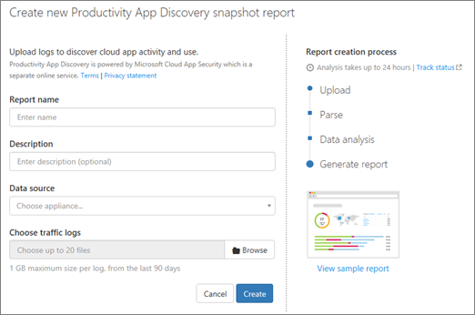

# Creare report sull'individuazione di app con Office 365 Cloud App Security

|Valutazione * *\>**|Planning * *\>**|Distribuzione * *\>**|Utilizzo * * * *|
|:-----|:-----|:-----|:-----|
|[Iniziare a valutare](office-365-cas-overview.md)   |[Avviare la pianificazione](get-ready-for-office-365-cas.md)   |[Avviare la distribuzione](turn-on-office-365-cas.md)   |Sei qui!    [Passaggi successivi](#next-steps)   |
   
Office 365 cloud app Security consente agli amministratori globali, agli amministratori della sicurezza e ai lettori di sicurezza di acquisire informazioni sui servizi cloud che sono in uso in un'organizzazione. Ad esempio, è possibile visualizzare la posizione in cui gli utenti archiviano e collaborano ai documenti e la quantità di dati caricati nelle app o nei servizi esterni a Office 365.
  
Per generare un report di individuazione delle app, è necessario caricare manualmente i file di registro del traffico Web dai firewall e dai proxy, quindi l'analisi dei file di Office 365 cloud app viene analizzata e analizzata per il report.
  
> [!NOTE]
> Per eseguire le attività descritte in questo articolo, è necessario essere un amministratore globale, un amministratore della sicurezza o un lettore di sicurezza. Per ulteriori informazioni, vedere [Permissions in the Office &amp; 365 Security Compliance Center](permissions-in-the-security-and-compliance-center.md). 
  
## Creare un report con l'individuazione delle app

Per creare un report di individuazione delle app, identificare l'origine dati del fornitore per i file di registro che si desidera analizzare, selezionare i file di registro e quindi richiedere il report.
  
> [!NOTE]
> Utilizzare i file di registro del traffico Web che includono i periodi di traffico di picco per ottenere la migliore rappresentazione di utilizzo nell'organizzazione. 
  
1. Raccogliere i [log del traffico Web e le origini dati per Office 365 cloud app Security](web-traffic-logs-and-data-sources-for-ocas.md).
    
2. Accedere al portale[https://portal.cloudappsecurity.com](https://portal.cloudappsecurity.com)di sicurezza delle app cloud e accedere. 
       
3. Scegliere **Scopri** \> **Crea nuovo report**.   
  
4. Specificare un nome e una descrizione per il report e quindi selezionare l'origine dati per i log del traffico Web nell'elenco **origine dati** .   Se un'origine dati che si desidera utilizzare non è presente nell'elenco, è possibile richiederne l'aggiunta. Selezionare **altro** per **origine dati**e quindi digitare il nome dell'origine dati che si sta tentando di caricare. È possibile esaminare il registro e sapere se viene aggiunto il supporto per l'origine dati che lo ha generato. 
  
5. Passare al percorso dei file di registro raccolti e selezionare i file. È necessario che i file di registro siano stati generati dall'origine dati scelta per il report.
    
6. Fare clic su **Crea** per avviare il processo di creazione del report. 
    
7. Per visualizzare lo stato del report, fare clic su **Gestisci rapporti snapshot**. Quando un report è pronto, verrà visualizzata l'opzione **Visualizza rapporto** . 
    
## Passaggi successivi

- [Esaminare e intervenire sugli avvisi](review-office-365-cas-alerts.md)
    
- [Esaminare i risultati dell’individuazione di app in Office 365 Cloud App Security](review-app-discovery-findings-in-ocas.md)
    
- Esaminare le [attività di utilizzo per Office 365 cloud app Security](utilization-activities-for-ocas.md)
    

