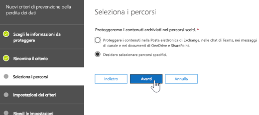
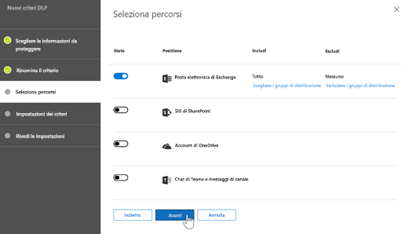
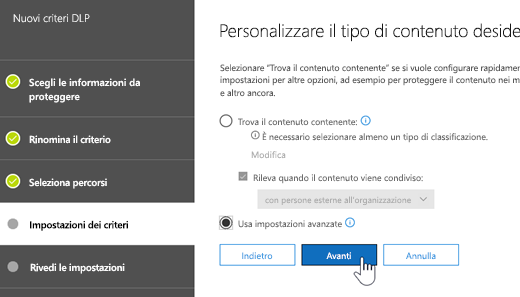
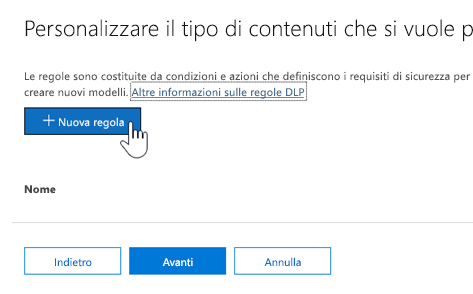
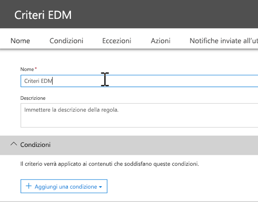
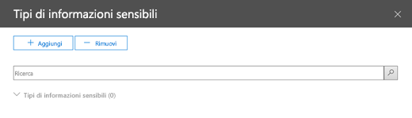

# <a name="create-custom-sensitive-information-types-with-exact-data-match-based-classification-preview"></a><span data-ttu-id="7b55e-103">Creare un tipo di informazioni sensibili personalizzato con la classificazione basata su Exact Data Match (Anteprima)</span><span class="sxs-lookup"><span data-stu-id="7b55e-103">See Create a custom sensitive information type with Exact Data Match based classification (Preview).</span></span>

## <a name="overview"></a><span data-ttu-id="7b55e-104">Panoramica</span><span class="sxs-lookup"><span data-stu-id="7b55e-104">Overview</span></span>

<span data-ttu-id="7b55e-105">[Tipi di informazioni sensibili personalizzati](custom-sensitive-info-types.md) vengono usati per impedire la condivisione accidentale o inappropriata di informazioni riservate.</span><span class="sxs-lookup"><span data-stu-id="7b55e-105">[Custom sensitive information types](custom-sensitive-info-types.md) are used to help prevent inadvertent or inappropriate sharing of sensitive information.</span></span> <span data-ttu-id="7b55e-106">Gli amministratori possono usare il centro sicurezza e conformità](create-a-custom-sensitive-information-type.md) o PowerShell per definire un tipo di informazioni sensibili personalizzato in base a modelli, evidenza (parole chiave come dipendente, badge, \*ID e così via), vicinanza tra caratteri (quant’è vicina l’evidenza ai caratteri in un determinato modello) e livelli di probabilità. </span><span class="sxs-lookup"><span data-stu-id="7b55e-106">As an administrator, you can use the [Security & Compliance Center](create-a-custom-sensitive-information-type.md) or [PowerShell](create-a-custom-sensitive-information-type-in-scc-powershell.md) to define a custom sensitive information type based on patterns, evidence (keywords such as *employee*, *badge*, *ID*, and so on), character proximity (how close evidence is to characters in a particular pattern), and confidence levels.</span></span> <span data-ttu-id="7b55e-107">Questi tipi di informazioni sensibili personalizzati soddisfano le esigenze aziendali di molte organizzazioni.</span><span class="sxs-lookup"><span data-stu-id="7b55e-107">Such custom sensitive information types meet business needs for many organizations.</span></span>

<span data-ttu-id="7b55e-108">Ma cosa succede se si vuole un tipo di informazioni sensibili personalizzato che usi valori di dati esatti, anziché modelli e vicinanza?</span><span class="sxs-lookup"><span data-stu-id="7b55e-108">But what if you wanted a custom sensitive information type that uses exact data values, instead of patterns and proximity?</span></span> <span data-ttu-id="7b55e-109">Con la classificazione basata su Exact Data Match (EDM) è possibile creare un tipo di informazioni sensibili personalizzato che si progettato per:</span><span class="sxs-lookup"><span data-stu-id="7b55e-109">With Exact Data Match (EDM)-based classification, you can create a custom sensitive information type that is designed to:</span></span>
- <span data-ttu-id="7b55e-110">essere dinamico e aggiornabile;</span><span class="sxs-lookup"><span data-stu-id="7b55e-110">be dynamic and refreshable;</span></span>
- <span data-ttu-id="7b55e-111">offrire maggiore scalabilità;</span><span class="sxs-lookup"><span data-stu-id="7b55e-111">be more scalable;</span></span>
- <span data-ttu-id="7b55e-112">produrre meno falsi positivi;</span><span class="sxs-lookup"><span data-stu-id="7b55e-112">result in fewer false-positives;</span></span>
- <span data-ttu-id="7b55e-113">usare dati sensibili strutturati;</span><span class="sxs-lookup"><span data-stu-id="7b55e-113">work with structured sensitive data;</span></span>
- <span data-ttu-id="7b55e-114">gestire le informazioni sensibili in modo più sicuro; e</span><span class="sxs-lookup"><span data-stu-id="7b55e-114">handle sensitive information more securely; and</span></span>
- <span data-ttu-id="7b55e-115">essere usato con più servizi cloud Microsoft.</span><span class="sxs-lookup"><span data-stu-id="7b55e-115">be used with several Microsoft cloud services.</span></span>


<span data-ttu-id="7b55e-117">La classificazione basata su EDM consente di creare tipi di informazioni sensibili personalizzati che fanno riferimento a valori esatti in un database di informazioni sensibili.</span><span class="sxs-lookup"><span data-stu-id="7b55e-117">EDM-based classification enables you to create custom sensitive information types that refer to exact values in a database of sensitive information.</span></span> <span data-ttu-id="7b55e-118">Il database può essere aggiornato giornalmente o settimanalmente e può contenere un massimo di 10 milioni di righe di dati.</span><span class="sxs-lookup"><span data-stu-id="7b55e-118">The database can be refreshed daily or weekly, and it can contain up to 10 million rows of data.</span></span> <span data-ttu-id="7b55e-119">I dipendenti, i pazienti o i clienti vanno e vengono e i record cambiano, i tipi di informazioni sensibili personalizzati rimangono aggiornati e disponibili.</span><span class="sxs-lookup"><span data-stu-id="7b55e-119">So as employees, patients, or clients come and go, and records change, your custom sensitive information types remain current and applicable.</span></span> <span data-ttu-id="7b55e-120">È anche possibile usare una classificazione basata su EDM con criteri, ad esempio i criteri di prevenzione della perdita dei dati](data-loss-prevention-policies.md) (DLP) o i [criteri dei file di Microsoft Cloud App Security](https://docs.microsoft.com/cloud-app-security/data-protection-policies).</span><span class="sxs-lookup"><span data-stu-id="7b55e-120">And, you can use EDM-based classification with policies, such as [data loss prevention policies](data-loss-prevention-policies.md) (DLP) or [Microsoft Cloud App Security file policies](https://docs.microsoft.com/cloud-app-security/data-protection-policies).</span></span>

## <a name="required-licenses-and-permissions"></a><span data-ttu-id="7b55e-121">Licenze e autorizzazioni obbligatorie</span><span class="sxs-lookup"><span data-stu-id="7b55e-121">Required licenses and permissions</span></span>

- <span data-ttu-id="7b55e-122">È necessario essere un amministratore globale, di conformità o di Exchange Online per eseguire le attività descritte in questo articolo.</span><span class="sxs-lookup"><span data-stu-id="7b55e-122">You must be a global admin, compliance administrator, or Exchange Online administrator to perform the tasks described in this article.</span></span> <span data-ttu-id="7b55e-123">Per ulteriori informazioni sulle autorizzazioni DLP, vedere [Autorizzazioni](data-loss-prevention-policies.md#permissions).</span><span class="sxs-lookup"><span data-stu-id="7b55e-123">To learn more about DLP permissions, see [Permissions](data-loss-prevention-policies.md#permissions).</span></span>

- <span data-ttu-id="7b55e-124">Quando disponibile a livello generale, la classificazione basata su EDM sarà inclusa nei seguenti abbonamenti:</span><span class="sxs-lookup"><span data-stu-id="7b55e-124">When generally available, EDM-based classification will be included in the following subscriptions:</span></span>
    - <span data-ttu-id="7b55e-125">Office 365 E5</span><span class="sxs-lookup"><span data-stu-id="7b55e-125">Office 365 Enterprise E5</span></span>
    - <span data-ttu-id="7b55e-126">Microsoft 365 E5</span><span class="sxs-lookup"><span data-stu-id="7b55e-126">Microsoft 365 E5</span></span>
    - <span data-ttu-id="7b55e-127">Conformità e protezione delle informazioni di Microsoft 365</span><span class="sxs-lookup"><span data-stu-id="7b55e-127">Microsoft 365 Information Protection and Compliance</span></span>
    - <span data-ttu-id="7b55e-128">Office 365 Advanced Compliance</span><span class="sxs-lookup"><span data-stu-id="7b55e-128">Office 365 Advanced Compliance</span></span>

> [!NOTE]
> <span data-ttu-id="7b55e-129">La classificazione basata su EDM è attualmente disponibile in anteprima  per [DLP in Office 365](data-loss-prevention-policies.md) (con Exchange Online e Microsoft teams) e [Cloud App Security](https://docs.microsoft.com/cloud-app-security).</span><span class="sxs-lookup"><span data-stu-id="7b55e-129">**EDM-based classification is currently in preview** for [DLP in Office 365](data-loss-prevention-policies.md) (with Exchange Online and Microsoft Teams) and [Cloud App Security](https://docs.microsoft.com/cloud-app-security).</span></span> <span data-ttu-id="7b55e-130">Se l'organizzazione dispone di [funzionalità DLP](https://docs.microsoft.com/office365/servicedescriptions/exchange-online-protection-service-description/messaging-policy-and-compliance-servicedesc#data-loss-prevention-dlp), è possibile provare la classificazione basata su EDM.</span><span class="sxs-lookup"><span data-stu-id="7b55e-130">If your organization has [DLP capabilities](https://docs.microsoft.com/office365/servicedescriptions/exchange-online-protection-service-description/messaging-policy-and-compliance-servicedesc#data-loss-prevention-dlp), you can try EDM-based classification.</span></span> <span data-ttu-id="7b55e-131">Se non si sta già partecipando all'anteprima, [contattare Microsoft](https://resources.office.com/us-landing-spe-contactus.html?LCID=EN-US) per iniziare.</span><span class="sxs-lookup"><span data-stu-id="7b55e-131">If you are not already participating in the preview, [contact Microsoft](https://resources.office.com/us-landing-spe-contactus.html?LCID=EN-US) to get started.</span></span> 

## <a name="the-work-flow-at-a-glance"></a><span data-ttu-id="7b55e-132">Un’occhiata al flusso di lavoro</span><span class="sxs-lookup"><span data-stu-id="7b55e-132">The work flow at a glance</span></span>

|<span data-ttu-id="7b55e-133">Fase</span><span class="sxs-lookup"><span data-stu-id="7b55e-133">Phase</span></span>  |<span data-ttu-id="7b55e-134">Cosa serve</span><span class="sxs-lookup"><span data-stu-id="7b55e-134">What's needed</span></span>  |
|---------|---------|
|[<span data-ttu-id="7b55e-135">Parte 1: impostazione della classificazione basata su EDM</span><span class="sxs-lookup"><span data-stu-id="7b55e-135">Part 1: Set up EDM-based classification</span></span>](#part-1-set-up-edm-based-classification)<br/><br/><span data-ttu-id="7b55e-136">(In base alle esigenze)</span><span class="sxs-lookup"><span data-stu-id="7b55e-136">(As needed)</span></span><br/><span data-ttu-id="7b55e-137">- [Modificare lo schema del database](#editing-the-schema-for-edm-based-classification)</span><span class="sxs-lookup"><span data-stu-id="7b55e-137">- [Edit the database schema](#editing-the-schema-for-edm-based-classification)</span></span> <br/><span data-ttu-id="7b55e-138">- [Rimuovere lo schema](#removing-the-schema-for-edm-based-classification)</span><span class="sxs-lookup"><span data-stu-id="7b55e-138">- [Remove the schema](#removing-the-schema-for-edm-based-classification)</span></span> |<span data-ttu-id="7b55e-139">- Accesso in lettura ai dati sensibili</span><span class="sxs-lookup"><span data-stu-id="7b55e-139">- Read access to the sensitive data</span></span><br/><span data-ttu-id="7b55e-140">- Schema del database nel formato .xml (esempio fornito)</span><span class="sxs-lookup"><span data-stu-id="7b55e-140">- Database schema in .xml format (example provided)</span></span><br/><span data-ttu-id="7b55e-141">- Pacchetto delle regole nel formato .xml (esempio fornito)</span><span class="sxs-lookup"><span data-stu-id="7b55e-141">- Rule package in .xml format (example provided)</span></span><br/><span data-ttu-id="7b55e-142">- Autorizzazioni di amministratore al Centro sicurezza e conformità (utilizzando PowerShell)</span><span class="sxs-lookup"><span data-stu-id="7b55e-142">- Admin permissions to the Security & Compliance Center (using PowerShell)</span></span> |
|[<span data-ttu-id="7b55e-143">Parte 2: indicizzare e caricare i dati sensibili</span><span class="sxs-lookup"><span data-stu-id="7b55e-143">Part 2: Index and upload the sensitive data</span></span>](#part-2-index-and-upload-the-sensitive-data)<br/><br/><span data-ttu-id="7b55e-144">(In base alle esigenze)</span><span class="sxs-lookup"><span data-stu-id="7b55e-144">(As needed)</span></span><br/>[<span data-ttu-id="7b55e-145">Aggiornare i dati</span><span class="sxs-lookup"><span data-stu-id="7b55e-145">Refresh the data</span></span>](#refreshing-your-sensitive-information-database) |<span data-ttu-id="7b55e-146">- Gruppo di sicurezza personalizzato e account utente</span><span class="sxs-lookup"><span data-stu-id="7b55e-146">- Custom security group and user account</span></span><br/><span data-ttu-id="7b55e-147">- Accesso come amministratore locale al computer con l’Agente di caricamento di EDM</span><span class="sxs-lookup"><span data-stu-id="7b55e-147">- Local admin access to machine with EDM Upload Agent</span></span><br/><span data-ttu-id="7b55e-148">- Accesso in lettura ai dati sensibili</span><span class="sxs-lookup"><span data-stu-id="7b55e-148">- Read access to the sensitive data</span></span><br/><span data-ttu-id="7b55e-149">- Procedura e programmazione per l'aggiornamento dei dati</span><span class="sxs-lookup"><span data-stu-id="7b55e-149">- Process and schedule for refreshing the data</span></span>|
|[<span data-ttu-id="7b55e-150">Parte 3: usare la classificazione basata su EDM con i servizi Microsoft Cloud</span><span class="sxs-lookup"><span data-stu-id="7b55e-150">Part 3: Use EDM-based classification with your Microsoft cloud services</span></span>](#part-3-use-edm-based-classification-with-your-microsoft-cloud-services) |<span data-ttu-id="7b55e-151">- Abbonamento a Office 365 con DLP</span><span class="sxs-lookup"><span data-stu-id="7b55e-151">- Office 365 subscription with DLP</span></span><br/><span data-ttu-id="7b55e-152">- Funzionalità della classificazione basata su EDM abilitata (in anteprima)</span><span class="sxs-lookup"><span data-stu-id="7b55e-152">- EDM-based classification feature enabled (in preview)</span></span> |

## <a name="part-1-set-up-edm-based-classification"></a><span data-ttu-id="7b55e-153">Parte 1: impostazione della classificazione basata su EDM</span><span class="sxs-lookup"><span data-stu-id="7b55e-153">Part 1: Set up EDM-based classification</span></span>

<span data-ttu-id="7b55e-154">L’impostazione e la configurazione della classificazione basata su EDM implicano il salvataggio di dati sensibili in formato .csv, la definizione di uno schema per il database delle informazioni sensibili, la creazione di un pacchetto di regole e il caricamento del dello schema e del pacchetto di regole.</span><span class="sxs-lookup"><span data-stu-id="7b55e-154">Setting up and configuring EDM-based classification involves saving sensitive data in .csv format, defining a schema for your database of sensitive information, creating a rule package, and then uploading the schema and rule package.</span></span>

### <a name="define-the-schema-for-your-database-of-sensitive-information"></a><span data-ttu-id="7b55e-155">Definire lo schema per il database delle informazioni sensibili</span><span class="sxs-lookup"><span data-stu-id="7b55e-155">Define the schema for your database of sensitive information</span></span>

1. <span data-ttu-id="7b55e-156">Identificare le informazioni sensibili da usare.</span><span class="sxs-lookup"><span data-stu-id="7b55e-156">Identify the KPIs that you want to use.</span></span> <span data-ttu-id="7b55e-157">Esportare i dati in un'app, come Microsoft Excel, e salvare il file in formato .csv.</span><span class="sxs-lookup"><span data-stu-id="7b55e-157">Export the data to an app, such as Microsoft Excel, and save the file in .csv format.</span></span> <span data-ttu-id="7b55e-158">Il file di dati può includere:</span><span class="sxs-lookup"><span data-stu-id="7b55e-158">The data file can include:</span></span>

    - <span data-ttu-id="7b55e-159">Fino a 10 milioni di righe di dati sensibili</span><span class="sxs-lookup"><span data-stu-id="7b55e-159">Up to 10 million rows of sensitive data</span></span>
    - <span data-ttu-id="7b55e-160">Fino a 32 colonne (campi) per origine dati</span><span class="sxs-lookup"><span data-stu-id="7b55e-160">Up to 32 columns (fields) per data source</span></span>

2. <span data-ttu-id="7b55e-161">Strutturare i dati sensibili nel file .csv in modo che la prima riga includa i nomi dei campi usati per la classificazione basata su EDM.</span><span class="sxs-lookup"><span data-stu-id="7b55e-161">Structure the sensitive data in the .csv file such that the first row includes the names of the fields used for EDM-based classification.</span></span> <span data-ttu-id="7b55e-162">Nel file .csv potrebbero essere presenti nomi di campo, come “cf”, "data di nascita", "nome", "cognome" e così via.</span><span class="sxs-lookup"><span data-stu-id="7b55e-162">In your .csv file, you might have field names, such as "ssn", "birthdate", "firstname", "lastname", and so on.</span></span> <span data-ttu-id="7b55e-163">Ad esempio, il file .csv è denominato \*RecordPazienti.csv e le relative colonne sono IDPaziente, MRN, Cognome, Nome, CF e così via.</span><span class="sxs-lookup"><span data-stu-id="7b55e-163">As an example, our .csv file is called *PatientRecords.csv*, and its columns include *PatientID*, *MRN*, *lastname*, *FirstName*, *SSN* and more.</span></span>

3. <span data-ttu-id="7b55e-164">Definire lo schema per il database delle informazioni sensibili nel formato .xml (come riportato nell'esempio seguente).</span><span class="sxs-lookup"><span data-stu-id="7b55e-164">Define the schema for the database of sensitive information in .xml format (similar to our example below).</span></span> <span data-ttu-id="7b55e-165">Assegnare un nome al file dello schema`edm.xml` e configurarlo in modo che per ogni colonna del database sia presente una linea che usi la sintassi `<Field name="" unique="" searchable=""/>`.</span><span class="sxs-lookup"><span data-stu-id="7b55e-165">Name this schema file `edm.xml`, and configure it such that for each column in the database, there is a line that uses the syntax `<Field name="" unique="" searchable=""/>`.</span></span> 

    - <span data-ttu-id="7b55e-166">Usare i nomi delle colonne per i valori dei *nomi dei campi*.</span><span class="sxs-lookup"><span data-stu-id="7b55e-166">Use column names for *Field name* values.</span></span>
    - <span data-ttu-id="7b55e-167">Usare unique="true" per i campi che contengono valori univoci (numeri di previdenza sociale, numeri di identificazione e così via); altrimenti usare *unique="false"*.</span><span class="sxs-lookup"><span data-stu-id="7b55e-167">Use *unique="true"* for the fields that contain unique values (Social Security numbers, identification numbers, etc.); otherwise, use *unique="false"*.</span></span>
    - <span data-ttu-id="7b55e-168">Usare *searchable="true"* per i campi che si desidera cercare.</span><span class="sxs-lookup"><span data-stu-id="7b55e-168">Use *searchable="true"* for the fields that you want to be searchable.</span></span> <span data-ttu-id="7b55e-169">Non specificare più di cinque campi da cercare per database.</span><span class="sxs-lookup"><span data-stu-id="7b55e-169">Do not specify more than five fields per database to be searchable.</span></span> <span data-ttu-id="7b55e-170">Tutti gli altri campi devono essere *searchable="false"*.</span><span class="sxs-lookup"><span data-stu-id="7b55e-170">All the rest should have *searchable="false"*.</span></span>  

    <span data-ttu-id="7b55e-171">Ad esempio, il seguente file .xml definisce lo schema per un database dei record dei pazienti, con cinque campi specificati come ricercabili: *IDPaziente*, *MRN*, *CF*, \* Telefono\* e *Data nasc.*.</span><span class="sxs-lookup"><span data-stu-id="7b55e-171">As an example, the following .xml file defines the schema for a patient records database, with five fields specified as searchable: *PatientID*, *MRN*, *SSN*, *Phone*, and *DOB*.</span></span> 
    
    <span data-ttu-id="7b55e-172">(È possibile copiare, modificare e usare l’esempio.)</span><span class="sxs-lookup"><span data-stu-id="7b55e-172">(You can copy, modify, and use our example.)</span></span>
    
    <span data-ttu-id="7b55e-173">\`\`\`<?xml version="1.0" encoding="utf-8"?> <EdmSchema xmlns="http://schemas.microsoft.com/office/2018/edm"></span><span class="sxs-lookup"><span data-stu-id="7b55e-173"></span></span>
        <span data-ttu-id="7b55e-174"><DataStore name="PatientRecords" description="Schema per i record dei pazienti</span><span class="sxs-lookup"><span data-stu-id="7b55e-174"><DataStore name="PatientRecords" description="Schema for patient records</span></span>" version="1">
            <span data-ttu-id="7b55e-175"><Field name="PatientID" unique="false" searchable="true" /> <Field name="MRN" unique="false" searchable="true" /></span><span class="sxs-lookup"><span data-stu-id="7b55e-175"></span></span>
            <Field name="FirstName" unique="false" searchable="false" />
            <Field name="LastName" unique="false" searchable="false" />
            <Field name="SSN" unique="false" searchable="true" />
            <Field name="Phone" unique="false" searchable="true" />
            <Field name="DOB" unique="false" searchable="true" />
            <Field name="Gender" unique="false" searchable="false" />
            <Field name="Address" unique="false" searchable="false" />
        </DataStore>
    </EdmSchema>
    ```

4. [Connect to Office 365 Security & Compliance Center PowerShell](https://docs.microsoft.com/powershell/exchange/office-365-scc/connect-to-scc-powershell/connect-to-scc-powershell?view=exchange-ps).

5. To upload the database schema, run the following cmdlets, one at a time:

    `$edmSchemaXml=Get-Content .\edm.xml -Encoding Byte -ReadCount 0`

    `New-DlpEdmSchema -FileData $edmSchemaXml -Confirm:$true`

    You will be prompted to confirm, as follows:

       Confirm
       Are you sure you want to perform this action?
       New EDM Schema for the data store 'patientrecords' will be imported.
       [Y] Yes  [A] Yes to All  [N] No  [L] No to All  [?] Help (default is "Y"):

    > [!TIP]
    > If you want your changes to occur without confirmation, in Step 5, use this cmdlet instead: `New-DlpEdmSchema -FileData $edmSchemaXml`
    
Now that the schema for your database of sensitive information is defined, the next step is to set up a rule package. Proceed to the section [Set up a rule package](#set-up-a-rule-package).

#### Editing the schema for EDM-based classification 

(As needed) If you want to make changes to your edm.xml file, such as changing which fields are used for EDM-based classification, follow these steps:

1. Edit your edm.mxl file (this is the file discussed in the [Define the schema](#define-the-schema-for-your-database-of-sensitive-information) section of this article).

2. [Connect to Office 365 Security & Compliance Center PowerShell](https://docs.microsoft.com/powershell/exchange/office-365-scc/connect-to-scc-powershell/connect-to-scc-powershell?view=exchange-ps).

3. To update your database schema, run the following cmdlets, one at a time:

    `$edmSchemaXml=Get-Content .\edm.xml -Encoding Byte -ReadCount 0`

    `Set-DlpEdmSchema -FileData $edmSchemaXml -Confirm:$true`

    You will be prompted to confirm, as follows:

       Confirm
       Are you sure you want to perform this action?
       EDM Schema for the data store 'patientrecords' will be updated.
       [Y] Yes  [A] Yes to All  [N] No  [L] No to All  [?] Help (default is "Y"):

    > [!TIP]
    > If you want your changes to occur without confirmation, in Step 3, use this cmdlet instead: `Set-DlpEdmSchema -FileData $edmSchemaXml`

#### Removing the schema for EDM-based classification

(As needed) If you want to remove the schema you're using for EDM-based classification, follow these steps:

1. [Connect to Office 365 Security & Compliance Center PowerShell](https://docs.microsoft.com/powershell/exchange/office-365-scc/connect-to-scc-powershell/connect-to-scc-powershell?view=exchange-ps).

2. Run the following PowerShell cmdlet, substituting the data store name of "patientrecords" with the one you want to remove:

    `Remove-DlpEdmSchema -Identity patientrecords`

     You will be prompted to confirm, as follows:
    
       Confirm
       Are you sure you want to perform this action?
       EDM Schema for the data store 'patientrecords' will be removed.
       [Y] Yes  [A] Yes to All  [N] No  [L] No to All  [?] Help (default is "Y"):
    
    > [!TIP]
    > If you want your changes to occur without confirmation, in Step 2, use this cmdlet instead: `Remove-DlpEdmSchema -Identity patientrecords -Confirm:$false`

### Set up a rule package

1. Create a rule package in .xml format (with Unicode encoding), similar to the following example. (You can copy, modify, and use our example.) 

   Recall from the previous procedure that our PatientRecords schema defines five fields as searchable: *PatientID*, *MRN*, *SSN*, *Phone*, and *DOB*. Our example rule package includes those fields and references the database schema file (edm.xml), with one *ExactMatch* items per searchable field. Consider the following ExactMatch item:

   ```
    <span data-ttu-id="7b55e-176"><ExactMatch id = "E1CC861E-3FE9-4A58-82DF-4BD259EAB371" patternsProximity = "300" dataStore ="PatientRecords" recommendedConfidence = "65" > <Pattern confidenceLevel="65"> <idMatch matches = "SSN" classification = "U.S. Social Security Number (SSN)" /> </Pattern> </ExactMatch></span><span class="sxs-lookup"><span data-stu-id="7b55e-176"></span></span>
   ```

    In this example, note the following:

    - The dataStore name references the .csv file we created earlier: **dataStore = "PatientRecords"**.
    - The idMatch value references a searchable field that is listed in the database schema file: **idMatch matches = "SSN"**.
    - The classification value references an existing or custom sensitive information type: **classification = "U.S. Social Security Number (SSN)"**. (In this case, we use the existing sensitive information type of U.S. Social Security Number.)

    When you set up your rule package, make sure to correctly reference your .csv file and edm.xml file. (You can copy, modify, and use our example.) 

    ```<?xml version="1.0" encoding="utf-8"?>
    <RulePackage xmlns="http://schemas.microsoft.com/office/2018/edm">
      <RulePack id="fd098e03-1796-41a5-8ab6-198c93c62b11">
        <Version build="0" major="2" minor="0" revision="0" />
        <Publisher id="eb553734-8306-44b4-9ad5-c388ad970528" />
        <Details defaultLangCode="en-us">
          <LocalizedDetails langcode="en-us">
            <PublisherName>IP DLP</PublisherName>
            <Name>Health Care EDM Rulepack</Name>
            <Description>This rule package contains the EDM sensitive type for health care sensitive types.</Description>
          </LocalizedDetails>
        </Details>
      </RulePack>
      <Rules>
        <ExactMatch id = "E1CC861E-3FE9-4A58-82DF-4BD259EAB371" patternsProximity = "300" dataStore ="PatientRecords" recommendedConfidence = "65" >
          <Pattern confidenceLevel="65">
            <idMatch matches = "SSN" classification = "U.S. Social Security Number (SSN)" />
          </Pattern>
          <Pattern confidenceLevel="75">
            <idMatch matches = "SSN" classification = "U.S. Social Security Number (SSN)" />
            <Any minMatches ="3" maxMatches ="100">
              <match matches="PatientID" />
              <match matches="MRN"/>
              <match matches="FirstName"/>
              <match matches="LastName"/>
              <match matches="Phone"/>
              <match matches="DOB"/>
            </Any>
          </Pattern>
        </ExactMatch>
        <LocalizedStrings>
          <Resource idRef="E1CC861E-3FE9-4A58-82DF-4BD259EAB371">
            <Name default="true" langcode="en-us">Patient SSN Exact Match.</Name>
            <Description default="true" langcode="en-us">EDM Sensitive type for detecting Patient SSN.</Description>
          </Resource>
        </LocalizedStrings>
      </Rules>
    </RulePackage>
    ```
    
2. <span data-ttu-id="7b55e-177">Per caricare il pacchetto di regole, eseguire i seguenti cmdlet di PowerShell, uno alla volta:</span><span class="sxs-lookup"><span data-stu-id="7b55e-177">Upload the rule package by running the following PowerShell cmdlets, one at a time:</span></span>

    `$rulepack=Get-Content .\rulepack.xml -Encoding Byte -ReadCount 0`

    `New-DlpSensitiveInformationTypeRulePackage -FileData $rulepack`

<span data-ttu-id="7b55e-178">A questo punto è stata configurata la classificazione basata su EDM.</span><span class="sxs-lookup"><span data-stu-id="7b55e-178">At this point, you have set up EDM-based classification.</span></span> <span data-ttu-id="7b55e-179">Il passaggio successivo consiste nell'indicizzare i dati sensibili e poi di caricarli.</span><span class="sxs-lookup"><span data-stu-id="7b55e-179">The next step is to index the sensitive data, and then upload the indexed data.</span></span> 

## <a name="part-2-index-and-upload-the-sensitive-data"></a><span data-ttu-id="7b55e-180">Parte 2: indicizzare e caricare i dati sensibili</span><span class="sxs-lookup"><span data-stu-id="7b55e-180">Part 2: Index and upload the sensitive data</span></span>

<span data-ttu-id="7b55e-181">In questa fase è possibile impostare un gruppo di sicurezza personalizzato e un account utente e configurare lo strumento Agente di caricamento di EDM.</span><span class="sxs-lookup"><span data-stu-id="7b55e-181">During this phase, you set up a custom security group and user account, and set up the EDM Upload Agent tool.</span></span> <span data-ttu-id="7b55e-182">Successivamente, è possibile usare lo strumento per indicizzare i dati sensibili e poi di caricarli.</span><span class="sxs-lookup"><span data-stu-id="7b55e-182">Then, you use the tool to index the sensitive data, and upload the indexed data.</span></span>

### <a name="set-up-the-security-group-and-user-account"></a><span data-ttu-id="7b55e-183">Impostare il gruppo di sicurezza e l’account utente</span><span class="sxs-lookup"><span data-stu-id="7b55e-183">Set up the security group and user account</span></span>

1. <span data-ttu-id="7b55e-184">Come amministratore globale, andare all’interfaccia di amministrazione ([) e creare un gruppo di sicurezza](https://docs.microsoft.com/office365/admin/email/create-edit-or-delete-a-security-group?view=o365-worldwide) denominato .</span><span class="sxs-lookup"><span data-stu-id="7b55e-184">As a global administrator, go to the admin center ([https://admin.microsoft.com](https://admin.microsoft.com)) and [create a security group](https://docs.microsoft.com/office365/admin/email/create-edit-or-delete-a-security-group?view=o365-worldwide) called `EDM_DataUploaders`.</span></span> 

2. <span data-ttu-id="7b55e-185">Aggiungere uno o più utenti al gruppo di sicurezza *EDM_DataUploaders*.</span><span class="sxs-lookup"><span data-stu-id="7b55e-185">Add one or more users to the *EDM_DataUploaders* security group.</span></span> <span data-ttu-id="7b55e-186">(Questi utenti gestiranno il database delle informazioni sensibili).</span><span class="sxs-lookup"><span data-stu-id="7b55e-186">(These users will manage the database of sensitive information.)</span></span>

3. <span data-ttu-id="7b55e-187">Assicurarsi che ogni utente che gestisce i dati sensibili sia un amministratore locale nel computer usato per l'Agente di caricamento di EDM.</span><span class="sxs-lookup"><span data-stu-id="7b55e-187">Make sure each user who is managing the sensitive data is a local admin on the machine used for the EDM Upload Agent.</span></span>

### <a name="set-up-the-edm-upload-agent"></a><span data-ttu-id="7b55e-188">Impostare l'agente di caricamento di EDM</span><span class="sxs-lookup"><span data-stu-id="7b55e-188">Set up the EDM Upload Agent</span></span>

> [!NOTE]
> <span data-ttu-id="7b55e-189">Prima di iniziare questa procedura, verificare di essere un membro del gruppo di sicurezza *EDM_DataUploaders* e un amministratore locale nel computer.</span><span class="sxs-lookup"><span data-stu-id="7b55e-189">Before you begin this procedure, make sure that you are a member of the *EDM_DataUploaders* security group and a local admin on your machine.</span></span>

1. <span data-ttu-id="7b55e-190">Scaricare e installare l'Agente di caricamento di EDM in [https://go.microsoft.com/fwlink/?linkid=2088639](https://go.microsoft.com/fwlink/?linkid=2088639).</span><span class="sxs-lookup"><span data-stu-id="7b55e-190">Download and install the EDM Upload Agent at [https://go.microsoft.com/fwlink/?linkid=2088639](https://go.microsoft.com/fwlink/?linkid=2088639).</span></span> <span data-ttu-id="7b55e-191">Per impostazione predefinita, il percorso di installazione deve essere `C:\Program Files\Microsoft\EdmUploadAgent`.</span><span class="sxs-lookup"><span data-stu-id="7b55e-191">By default, the installation location should be `C:\Program Files\Microsoft\EdmUploadAgent`.</span></span> 

2. <span data-ttu-id="7b55e-192">Per autorizzare l'Agente di caricamento di EDM, aprire il prompt dei comandi di Windows (come amministratore) e quindi eseguire il comando seguente:</span><span class="sxs-lookup"><span data-stu-id="7b55e-192">To authorize the EDM Upload Agent, open Windows Command Prompt (as an administrator), and then run the following command:</span></span>

    `EdmUploadAgent.exe /Authorize`

3. <span data-ttu-id="7b55e-193">Accedere con l'account aziendale o dell'istituto di istruzione di Office 365.</span><span class="sxs-lookup"><span data-stu-id="7b55e-193">Sign in with your Office 365 work or school account.</span></span>

<span data-ttu-id="7b55e-194">Il passaggio successivo consiste nell'usare l’Agente di caricamento di EDM per indicizzare i dati sensibili e poi di caricarli.</span><span class="sxs-lookup"><span data-stu-id="7b55e-194">The next step is to use the EDM Upload Agent to index the sensitive data, and then upload the indexed data.</span></span>

### <a name="index-and-upload-the-sensitive-data"></a><span data-ttu-id="7b55e-195">Indicizzare e caricare i dati sensibili</span><span class="sxs-lookup"><span data-stu-id="7b55e-195">Index and upload the sensitive data</span></span>

1. <span data-ttu-id="7b55e-196">Salvare il file di dati sensibili, ossia l’esempio *RecordPazienti.csv*, nell'unità locale del computer.</span><span class="sxs-lookup"><span data-stu-id="7b55e-196">Save the sensitive data file (recall our example is *PatientRecords.csv*) to the local drive on the machine.</span></span> <span data-ttu-id="7b55e-197">(Il file d’esempio *RecordPazienti.csv* è stato salvato in `C:\Edm\Data`.)</span><span class="sxs-lookup"><span data-stu-id="7b55e-197">(We saved our example *PatientRecords.csv* file to `C:\Edm\Data`.)</span></span>

2. <span data-ttu-id="7b55e-198">Per indicizzare i dati sensibili, eseguire il seguente comando nel prompt dei comandi di Windows:</span><span class="sxs-lookup"><span data-stu-id="7b55e-198">To index the sensitive data, run the following command in Windows Command Prompt:</span></span>

    `EdmUploadAgent.exe /CreateHash /DataStoreName <DataStoreName> /DataFile <DataFilePath> /HashLocation <HashedFileLocation>`

    <span data-ttu-id="7b55e-199">Esempio: EdmUploadAgent.exe /CreateHash /DataStoreName RecordPazienti /DataFile C:\Edm\Data\RecordPazienti.csv /HashLocation C:\Edm\Hash\*\*</span><span class="sxs-lookup"><span data-stu-id="7b55e-199">Example: **EdmUploadAgent.exe /CreateHash /DataStoreName PatientRecords /DataFile C:\Edm\Data\PatientRecords.csv /HashLocation C:\Edm\Hash**</span></span> 

3. <span data-ttu-id="7b55e-200">Per caricare i dati sensibili, eseguire il seguente comando nel prompt dei comandi di Windows:</span><span class="sxs-lookup"><span data-stu-id="7b55e-200">To upload the indexed data, run the following command in Windows Command Prompt:</span></span>

    `EdmUploadAgent.exe /UploadHash /DataStoreName <DataStoreName> /HashFile <HashedSourceFilePath>`

    <span data-ttu-id="7b55e-201">Esempio: EdmUploadAgent.exe /UploadHash /DataStoreName RecordPazienti /HashFile C:\Edm\Hash\RecordPazienti.EdmHash\*\*</span><span class="sxs-lookup"><span data-stu-id="7b55e-201">Example: **EdmUploadAgent.exe /UploadHash /DataStoreName PatientRecords /HashFile C:\Edm\Hash\PatientRecords.EdmHash**</span></span> 

4. <span data-ttu-id="7b55e-202">Per verificare che i dati sensibili siano stati caricati, eseguire il seguente comando nel prompt dei comandi di Windows:</span><span class="sxs-lookup"><span data-stu-id="7b55e-202">To verify your sensitive data has been uploaded, run the following command in Windows Command Prompt:</span></span>

    `EdmUploadAgent.exe /GetDataStore`

    <span data-ttu-id="7b55e-203">Viene visualizzato un elenco degli archivi dati e la data dell'ultimo aggiornamento, in modo simile al seguente:</span><span class="sxs-lookup"><span data-stu-id="7b55e-203">You'll see a list of data stores and when they were last updated, similar to the following:</span></span> <br/>

5. <span data-ttu-id="7b55e-205">Procedere alla configurazione della procedura e della programmazione per Aggiornamento del database delle informazioni sensibili](#refreshing-your-sensitive-information-database).</span><span class="sxs-lookup"><span data-stu-id="7b55e-205">Proceed to set up your process and schedule for [Refreshing your sensitive information database](#refreshing-your-sensitive-information-database).</span></span>

<span data-ttu-id="7b55e-206">A questo punto si è pronti a usare la classificazione basata su EDM con i servizi cloud Microsoft.</span><span class="sxs-lookup"><span data-stu-id="7b55e-206">At this point, you are ready to use EDM-based classification with your Microsoft cloud services.</span></span> <span data-ttu-id="7b55e-207">Ad esempio, è possibile impostare un criterio di DLP con la classificazione basata su EDM](#to-create-a-dlp-policy-with-edm).</span><span class="sxs-lookup"><span data-stu-id="7b55e-207">For example, you can [set up a DLP policy using EDM-based classification](#to-create-a-dlp-policy-with-edm).</span></span> 

### <a name="refreshing-your-sensitive-information-database"></a><span data-ttu-id="7b55e-208">Aggiornare il database delle informazioni sensibili</span><span class="sxs-lookup"><span data-stu-id="7b55e-208">Refreshing your sensitive information database</span></span>

<span data-ttu-id="7b55e-209">È possibile aggiornare il database delle informazioni sensibili giornalmente o settimanalmente e lo strumento di caricamento di EDM può reindicizzare i dati sensibili e quindi ricaricarli.</span><span class="sxs-lookup"><span data-stu-id="7b55e-209">You can refresh your sensitive information database daily or weekly, and the EDM Upload Tool can reindex the sensitive data and then reupload the indexed data.</span></span> 

1. <span data-ttu-id="7b55e-210">Determinare la procedura e la frequenza (giornaliera o settimanale) dell’aggiornamento del database delle informazioni sensibili.</span><span class="sxs-lookup"><span data-stu-id="7b55e-210">Determine your process and frequency (daily or weekly) for refreshing the database of sensitive information.</span></span>

2. <span data-ttu-id="7b55e-211">Esportare di nuovo i dati sensibili in un'app, come Microsoft Excel, e salvare il file in formato .csv.</span><span class="sxs-lookup"><span data-stu-id="7b55e-211">Re-export the sensitive data to an app, such as Microsoft Excel, and save the file in .csv format.</span></span> <span data-ttu-id="7b55e-212">Mantenere il nome e il percorso del file usati dopo aver seguito la procedura descritta in Indicizzare e caricare i dati sensibili](#index-and-upload-the-sensitive-data).</span><span class="sxs-lookup"><span data-stu-id="7b55e-212">Keep the same file name and location you used when you followed the steps described in [Index and upload the sensitive data](#index-and-upload-the-sensitive-data).</span></span>

    > [!NOTE]
    > <span data-ttu-id="7b55e-213">Se non sono state apportate modifiche alla struttura (nomi dei campi) del file .csv, non è necessario apportare modifiche al file dello schema del database quando si aggiornano i dati.</span><span class="sxs-lookup"><span data-stu-id="7b55e-213">If there are no changes to the structure (field names) of the .csv file, you won't need to make any changes to your database schema file when you refresh the data.</span></span> <span data-ttu-id="7b55e-214">Tuttavia, se è necessario apportare modifiche, accertarsi di modificare di conseguenza lo [schema del database](#editing-the-schema-for-edm-based-classification) e [il pacchetto delle regole](#set-up-a-rule-package).</span><span class="sxs-lookup"><span data-stu-id="7b55e-214">But if you must make changes, make sure to edit the [database schema](#editing-the-schema-for-edm-based-classification) and your [rule package](#set-up-a-rule-package) accordingly.</span></span>        

3. <span data-ttu-id="7b55e-215">Usare l'Utilità di pianificazione](https://docs.microsoft.com/windows/desktop/TaskSchd/task-scheduler-start-page) per automatizzare i passaggi 2 e 3 nella procedura [Indicizzare e caricare i dati sensibili](#index-and-upload-the-sensitive-data).</span><span class="sxs-lookup"><span data-stu-id="7b55e-215">Use [Task Scheduler](https://docs.microsoft.com/windows/desktop/TaskSchd/task-scheduler-start-page) to automate steps 2 and 3 in the [Index and upload the sensitive data](#index-and-upload-the-sensitive-data) procedure.</span></span> <span data-ttu-id="7b55e-216">È possibile pianificare le attività in diversi modi:</span><span class="sxs-lookup"><span data-stu-id="7b55e-216">You can schedule tasks using several methods:</span></span>
    
    |<span data-ttu-id="7b55e-217">Metodo</span><span class="sxs-lookup"><span data-stu-id="7b55e-217">Method</span></span>  |<span data-ttu-id="7b55e-218">Soluzione</span><span class="sxs-lookup"><span data-stu-id="7b55e-218">What to do</span></span>  |
    |---------|---------|
    |<span data-ttu-id="7b55e-219">Windows PowerShell</span><span class="sxs-lookup"><span data-stu-id="7b55e-219">Windows PowerShell</span></span>     |<span data-ttu-id="7b55e-220">Consultare la documentazione dell’[Utilità di pianificazione](https://docs.microsoft.com/powershell/module/scheduledtasks/?view=win10-ps) e [gli script di PowerShell di esempio](#example-powershell-script-for-task-scheduler) illustrati in questo articolo</span><span class="sxs-lookup"><span data-stu-id="7b55e-220">See the [ScheduledTasks](https://docs.microsoft.com/powershell/module/scheduledtasks/?view=win10-ps) documentation and the [example PowerShell script](#example-powershell-script-for-task-scheduler) in this article</span></span>|
    |<span data-ttu-id="7b55e-221">API dell’Utilità di pianificazione</span><span class="sxs-lookup"><span data-stu-id="7b55e-221">Task Scheduler API</span></span> |<span data-ttu-id="7b55e-222">Consultare la documentazione dell’[Utilità di pianificazione](https://docs.microsoft.com/windows/desktop/TaskSchd/using-the-task-scheduler)</span><span class="sxs-lookup"><span data-stu-id="7b55e-222">See the [Task Scheduler](https://docs.microsoft.com/windows/desktop/TaskSchd/using-the-task-scheduler) documentation</span></span> |
    |<span data-ttu-id="7b55e-223">Interfaccia utente Windows</span><span class="sxs-lookup"><span data-stu-id="7b55e-223">Windows user interface</span></span>     |<span data-ttu-id="7b55e-224">In Windows, fare clic su **Start** e digitare `Task Scheduler`.</span><span class="sxs-lookup"><span data-stu-id="7b55e-224">In Windows, click **Start**, and type `Task Scheduler`.</span></span> <span data-ttu-id="7b55e-225">Quindi, nell'elenco dei risultati, fare clic con il pulsante destro del mouse sull’**Utilità di pianificazione** e scegliere Esegui come amministratore.</span><span class="sxs-lookup"><span data-stu-id="7b55e-225">Then, in the list of results, right-click **Task Scheduler**, and choose **Run as administrator**.</span></span>          |

#### <a name="example-powershell-script-for-task-scheduler"></a><span data-ttu-id="7b55e-226">Esempio di script di PowerShell per Utilità di pianificazione</span><span class="sxs-lookup"><span data-stu-id="7b55e-226">Example PowerShell script for Task Scheduler</span></span>

<span data-ttu-id="7b55e-227">Questa sezione include uno script di PowerShell di esempio che è possibile usare per pianificare le attività di indicizzazione dei dati e il caricamento dei dati indicizzati:</span><span class="sxs-lookup"><span data-stu-id="7b55e-227">This section includes an example PowerShell script you can use to schedule your tasks for indexing data and uploading the indexed data:</span></span>

```powershell
param([string]$dataStoreName,[string]$fileLocation)
# Assuming current user is also the user context to run the task
$user = "$env:USERDOMAIN\$env:USERNAME"
$edminstallpath = 'C:\Program Files\Microsoft\EdmUploadAgent\'
$edmuploader = $edminstallpath + 'EdmUploadAgent.exe'
$csvext = '.csv'
$edmext = '.EdmHash'
# Assuming CSV file name is same as data store name
$dataFile = "$fileLocation\$dataStoreName$csvext"
$hashFile = "$fileLocation\$dataStoreName$edmext"
# Assuming location to store hash file is same as the location of csv file
$hashLocation = $fileLocation
$createHashArgs = '/CreateHash /DataStoreName ' + $dataStoreName + ' /DataFile ' + $dataFile + ' /HashLocation ' + $hashLocation
$uploadHashArgs = '/UploadHash /DataStoreName ' + $dataStoreName + ' /HashFile ' + $hashFile
# Set up actions associated with the task
$actions = @()
$actions += New-ScheduledTaskAction -Execute $edmuploader -Argument $createHashArgs -WorkingDirectory $edminstallpath
$actions += New-ScheduledTaskAction -Execute $edmuploader -Argument $uploadHashArgs -WorkingDirectory $edminstallpath
# Set up trigger for the task
$trigger = New-ScheduledTaskTrigger -Weekly -DaysOfWeek Sunday -At 2am
# Set up task settings
$principal = New-ScheduledTaskPrincipal -UserId $user -LogonType S4U -RunLevel Highest
$settings = New-ScheduledTaskSettingsSet -RunOnlyIfNetworkAvailable -StartWhenAvailable -WakeToRun
# Create the scheduled task
$scheduledTask = New-ScheduledTask -Action $actions -Principal $principal -Trigger $trigger -Settings $settings
# Get credentials to run the task
$creds = Get-Credential -UserName $user -Message "Enter credentials to run the task"
$password=[Runtime.InteropServices.Marshal]::PtrToStringAuto([Runtime.InteropServices.Marshal]::SecureStringToBSTR($creds.Password))
# Register the scheduled task
$taskName = 'EDMUpload_' + $dataStoreName
Register-ScheduledTask -TaskName $taskName -InputObject $scheduledTask -User $user -Password $password
```
## <a name="part-3-use-edm-based-classification-with-your-microsoft-cloud-services"></a><span data-ttu-id="7b55e-228">Parte 3: usare la classificazione basata su EDM con i servizi cloud Microsoft</span><span class="sxs-lookup"><span data-stu-id="7b55e-228">Part 3: Use EDM-based classification with your Microsoft cloud services</span></span>

<span data-ttu-id="7b55e-229">È anche possibile usare la classificazione basata su EDM con le funzionalità di protezione delle informazioni, come i [criteri di DLP di Office 365](data-loss-prevention-policies.md) e i [criteri dei file di Microsoft Cloud App Security](https://docs.microsoft.com/cloud-app-security/data-protection-policies).</span><span class="sxs-lookup"><span data-stu-id="7b55e-229">You can use EDM-based classification with information protection features, such as [Office 365 DLP policies](data-loss-prevention-policies.md) and [Microsoft Cloud App Security file policies](https://docs.microsoft.com/cloud-app-security/data-protection-policies).</span></span> <span data-ttu-id="7b55e-230">La seguente procedura descrive come usare EDM con un criterio di DLP creato nel centro sicurezza e conformità di Office 365.</span><span class="sxs-lookup"><span data-stu-id="7b55e-230">The following procedure describes how to use EDM with a DLP policy that is created in the Office 365 Security & Compliance Center.</span></span>

### <a name="to-create-a-dlp-policy-with-edm"></a><span data-ttu-id="7b55e-231">Creazione di un criterio di DLP con EDM</span><span class="sxs-lookup"><span data-stu-id="7b55e-231">To create a DLP policy with EDM</span></span>

1. <span data-ttu-id="7b55e-232">Andare al Centro sicurezza e conformità ([https://protection.office.com](https://protection.office.com)).</span><span class="sxs-lookup"><span data-stu-id="7b55e-232">Go to the Security & Compliance Center</span></span>

2. <span data-ttu-id="7b55e-233">Scegliere **Prevenzione della perdita dei dati** > **Criteri**.</span><span class="sxs-lookup"><span data-stu-id="7b55e-233">Click **Data loss prevention** > **Policy**.</span></span>

3. <span data-ttu-id="7b55e-234">Scegliere Crea un criterio**Personalizzato** > **Avanti**.</span><span class="sxs-lookup"><span data-stu-id="7b55e-234">Choose **Create a policy** > **Custom** > **Next**.</span></span>

4. <span data-ttu-id="7b55e-235">Nella scheda **Nome criterio**, specificare un nome e una descrizione, quindi scegliere **Avanti**.</span><span class="sxs-lookup"><span data-stu-id="7b55e-235">On the **Name your policy** tab, specify a name and description, and then choose **Next**.</span></span>

5. <span data-ttu-id="7b55e-236">Nella scheda **Scegli posizioni**, selezionare **Consenti di scegliere posizioni specifiche** e poi **Avanti**.</span><span class="sxs-lookup"><span data-stu-id="7b55e-236">On the **Choose locations** tab, select **Let me choose specific locations**, and then choose **Next**.</span></span><br/><span data-ttu-id="7b55e-237"></span><span class="sxs-lookup"><span data-stu-id="7b55e-237"></span></span><br/>

6. <span data-ttu-id="7b55e-238">Nella colonna Stato\*\*, selezionare solo **posta elettronica di Exchange** e poi **Avanti**.</span><span class="sxs-lookup"><span data-stu-id="7b55e-238">In the **Status** column, select **Exchange email** only, and then choose **Next**.</span></span> <br/><span data-ttu-id="7b55e-239"></span><span class="sxs-lookup"><span data-stu-id="7b55e-239"></span></span><br/>

7. <span data-ttu-id="7b55e-240">Nella scheda **Impostazioni criterio**, scegliere **Usa impostazioni avanzate** e poi **Avanti**.</span><span class="sxs-lookup"><span data-stu-id="7b55e-240">On the **Policy settings** tab, choose **Use advanced settings**, and then choose **Next**.</span></span><br/><span data-ttu-id="7b55e-241"></span><span class="sxs-lookup"><span data-stu-id="7b55e-241"></span></span><br/>

8. <span data-ttu-id="7b55e-242">Scegliere **+ Nuova regola**.</span><span class="sxs-lookup"><span data-stu-id="7b55e-242">Choose **+ New rule**.</span></span><br/><span data-ttu-id="7b55e-243"></span><span class="sxs-lookup"><span data-stu-id="7b55e-243"></span><span class="sxs-lookup"><span data-stu-id="7b55e-245"></span></span><br/>

10. <span data-ttu-id="7b55e-246">Nella sezione **Condizioni**, nell'elenco **+ Aggiungi una condizione**, scegliere **Il contenuto include il tipo di informazioni sensibili**.</span><span class="sxs-lookup"><span data-stu-id="7b55e-246">In the **Conditions** section, in the **+ Add a condition** list, choose **Content contains sensitive type**.</span></span><br/><span data-ttu-id="7b55e-247"></span><span class="sxs-lookup"><span data-stu-id="7b55e-247"></span></span><br/>

11. <span data-ttu-id="7b55e-248">Cercare il tipo di informazioni sensibili creato quando si configura il pacchetto delle regole e quindi scegliere **+ Aggiungi.**</span><span class="sxs-lookup"><span data-stu-id="7b55e-248">Search for the sensitive information type you created when you set up your rule package, and then choose **+ Add**.</span></span><br/><span data-ttu-id="7b55e-249"></span><span class="sxs-lookup"><span data-stu-id="7b55e-249"></span></span><br/><span data-ttu-id="7b55e-250">Poi scegliere **Fatto**.</span><span class="sxs-lookup"><span data-stu-id="7b55e-250">Then choose **Done**.</span></span>

12. <span data-ttu-id="7b55e-251">Infine selezionare le opzioni per la regola, come **Notifiche utente**, **Personalizzazioni utente**, **Report degli eventi** e così via, quindi scegliere **Salva**.</span><span class="sxs-lookup"><span data-stu-id="7b55e-251">Finish selecting options for your rule, such as **User notifications**, **User overrides**, **Incident reports**, and so on, and then choose **Save**.</span></span>

13. <span data-ttu-id="7b55e-252">Nella scheda **Impostazioni criterio**, esaminare le regole e quindi scegliere **Avanti**.</span><span class="sxs-lookup"><span data-stu-id="7b55e-252">On the **Policy settings** tab, review your rules, and then choose **Next**.</span></span>

14. <span data-ttu-id="7b55e-253">Specificare se attivare subito il criterio, testarlo o mantenerlo disattivato.</span><span class="sxs-lookup"><span data-stu-id="7b55e-253">Specify whether to turn on the policy right away, test it out, or keep it turned off.</span></span> <span data-ttu-id="7b55e-254">Quindi scegliere **Avanti**.</span><span class="sxs-lookup"><span data-stu-id="7b55e-254">Then choose **Next**.</span></span>

15. <span data-ttu-id="7b55e-255">Nella scheda Esamina le impostazioni\*\*, controlla il criterio.</span><span class="sxs-lookup"><span data-stu-id="7b55e-255">On the **Review your settings** tab, review your policy.</span></span> <span data-ttu-id="7b55e-256">Apportare le modifiche necessarie.</span><span class="sxs-lookup"><span data-stu-id="7b55e-256">Make any needed changes.</span></span> <span data-ttu-id="7b55e-257">Al termine, scegliere **Crea**.</span><span class="sxs-lookup"><span data-stu-id="7b55e-257">When you're ready, choose **Create**.</span></span>

    > [!NOTE]
    > <span data-ttu-id="7b55e-258">Il nuovo criterio di DLP sarà attivo nel centro dati dopo circa un’ora.</span><span class="sxs-lookup"><span data-stu-id="7b55e-258">Allow approximately one hour for your new DLP policy to work its way through your data center.</span></span>

## <a name="related-articles"></a><span data-ttu-id="7b55e-259">Articoli correlati</span><span class="sxs-lookup"><span data-stu-id="7b55e-259">Related articles</span></span>

[<span data-ttu-id="7b55e-260">Tipi di informazioni sensibili integrati e cosa individuano</span><span class="sxs-lookup"><span data-stu-id="7b55e-260">Built-in sensitive information types and what they look for</span></span>](what-the-sensitive-information-types-look-for.md)

[<span data-ttu-id="7b55e-261">Tipi di informazioni sensibili personalizzati</span><span class="sxs-lookup"><span data-stu-id="7b55e-261">Custom sensitive information types</span></span>](custom-sensitive-info-types.md)

[<span data-ttu-id="7b55e-262">Panoramica sui criteri di DLP</span><span class="sxs-lookup"><span data-stu-id="7b55e-262">Overview of DLP policies</span></span>](data-loss-prevention-policies.md)

[<span data-ttu-id="7b55e-263">Microsoft Cloud App Security</span><span class="sxs-lookup"><span data-stu-id="7b55e-263">Microsoft Cloud App Security</span></span>](https://docs.microsoft.com/cloud-app-security)
