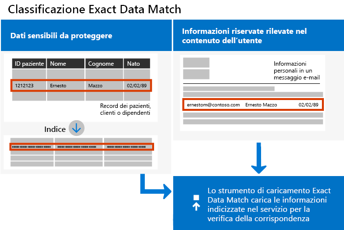
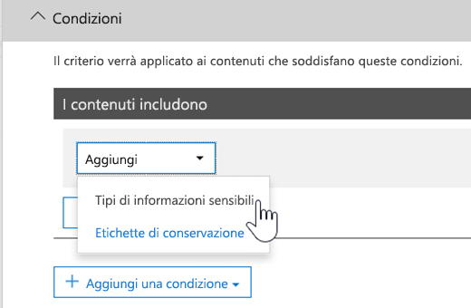

# <a name="create-custom-sensitive-information-types-with-exact-data-match-based-classification"></a>Creare tipi di informazioni sensibili personalizzati con classificazione esatta basata su Exact Data Match

## <a name="overview"></a>Panoramica

[Tipi di informazioni sensibili personalizzati](https://docs.microsoft.com/it-IT/office365/securitycompliance/custom-sensitive-info-types)  vengono usati per impedire la condivisione accidentale o inappropriata di informazioni sensibili. Gli amministratori possono usare il  [Centro sicurezza e conformità](https://docs.microsoft.com/it-IT/office365/securitycompliance/create-a-custom-sensitive-information-type) o [PowerShell](https://docs.microsoft.com/it-IT/office365/securitycompliance/create-a-custom-sensitive-information-type-in-scc-powershell)  per definire un tipo di informazioni sensibili personalizzato in base a modelli, evidenza (parole chiave come  *dipendente*,  *badge*,  *ID* e così via), vicinanza tra caratteri (quant'è vicina l'evidenza ai caratteri in un determinato modello) e livelli di probabilità. Questi tipi di informazioni sensibili personalizzati soddisfano le esigenze aziendali di molte organizzazioni.

Ma cosa succede se si vuole un tipo di informazioni sensibili personalizzato che usi valori di dati esatti, anziché modelli generici basati solo sulla corrispondenza? Con la classificazione basata su Exact Data Match (EDM) è possibile creare un tipo di informazioni sensibili personalizzato che sia progettato per:

- essere dinamico e aggiornabile;
- offrire maggiore scalabilità;
- produrre meno falsi positivi;
- usare dati sensibili strutturati;
- gestire le informazioni sensibili in modo più sicuro; e
- essere usato con più servizi cloud Microsoft.



La classificazione basata su EDM consente di creare tipi di informazioni sensibili personalizzati che fanno riferimento a valori esatti in un database di informazioni sensibili. Il database può essere aggiornato giornalmente o settimanalmente e può contenere un massimo di 10 milioni di righe di dati. I dipendenti, i pazienti o i clienti vanno e vengono e i record cambiano, i tipi di informazioni sensibili personalizzati rimangono aggiornati e disponibili. È anche possibile usare una classificazione basata su EDM con criteri, ad esempio i  [criteri di prevenzione della perdita dei dati ](https://docs.microsoft.com/it-IT/office365/securitycompliance/data-loss-prevention-policies) (DLP) o i  [criteri dei file di Microsoft Cloud App Security](https://docs.microsoft.com/cloud-app-security/data-protection-policies).

## <a name="required-licenses-and-permissions"></a>Licenze e autorizzazioni obbligatorie

È necessario essere un amministratore globale, di conformità o di Exchange Online per eseguire le attività descritte in questo articolo. Per ulteriori informazioni sulle autorizzazioni DLP, vedere  [Autorizzazioni](https://docs.microsoft.com/it-IT/office365/securitycompliance/data-loss-prevention-policies#permissions).

Quando disponibile a livello generale, la classificazione basata su EDM sarà inclusa negli abbonamenti

- Office 365 E5
- Microsoft 365 E5
- Conformità e protezione delle informazioni di Microsoft 365
- Office 365 Advanced Compliance

## <a name="the-work-flow-at-a-glance"></a>Flusso di lavoro in breve

|Fase  |Cosa serve  |
|---------|---------|
|[Parte 1: impostazione della classificazione basata su EDM](#part-1-set-up-edm-based-classification)<br/><br/>(In base alle esigenze)<br/>- [Modificare lo schema del database](#editing-the-schema-for-edm-based-classification) <br/>- [Rimuovere lo schema](#removing-the-schema-for-edm-based-classification) |- Accesso in lettura ai dati sensibili<br/>- Schema del database nel formato .xml (esempio fornito)<br/>- Pacchetto delle regole nel formato .xml (esempio fornito)<br/>- Autorizzazioni di amministratore al Centro sicurezza e conformità (utilizzando PowerShell) |
|[Parte 2: indicizzare e caricare i dati sensibili](#part-2-index-and-upload-the-sensitive-data)<br/><br/>(In base alle esigenze)<br/>[Aggiornare i dati](#refreshing-your-sensitive-information-database) |- Gruppo di sicurezza personalizzato e account utente<br/>- Accesso come amministratore locale al computer con l’Agente di caricamento di EDM<br/>- Accesso in lettura ai dati sensibili<br/>- Procedura e programmazione per l'aggiornamento dei dati|
|[Parte 3: usare la classificazione basata su EDM con i servizi Microsoft Cloud](#part-3-use-edm-based-classification-with-your-microsoft-cloud-services) |- Abbonamento a Office 365 con DLP<br/>- Funzionalità della classificazione basata su EDM abilitata |

### <a name="part-1-set-up-edm-based-classification"></a>Parte 1: impostazione della classificazione basata su EDM

L’impostazione e la configurazione della classificazione basata su EDM implicano il salvataggio di dati sensibili in formato .csv, la definizione di uno schema per il database delle informazioni sensibili, la creazione di un pacchetto di regole e il caricamento del dello schema e del pacchetto di regole.

#### <a name="define-the-schema-for-your-database-of-sensitive-information"></a>Definire lo schema per il database delle informazioni sensibili

1. Identificare le informazioni sensibili da usare. Esportare i dati in un'app, come Microsoft Excel e salvare il file in formato .csv. Il file di dati può includere al massimo:
      - Fino a 10 milioni di righe di dati sensibili
      - Fino a 32 colonne (campi) per origine dati
      - Fino a 5 colonne (campi) contrassegnate come ricercabile

2. Strutturare i dati sensibili nel file .csv in modo che la prima riga includa i nomi dei campi usati per la classificazione basata su EDM. Nel file .csv potrebbero essere presenti nomi di campo, come "ssn", "birthdate", "firstname", "lastname" e così via. Ad esempio, il file .csv è denominato  *PatientRecords.csv* e le relative colonne sono  *PatientID*,  *MRN*,  *LastName*,  *FirstName*,  *SSN*  e così via.

3. Definire lo schema per il database delle informazioni sensibili nel formato .xml (come riportato nell'esempio seguente). Assegnare un nome al file dello schema edm.xml e configurarlo in modo che per ogni colonna del database sia presente una linea che usi la sintassi \<Field name="" searchable=""/\>.

      - Usare i nomi delle colonne per i valori  *Field name* .
      - Usare  *searchable="true"*  per un massimo di 5 campi che si desidera cercare. È necessario specificare almeno un campo come ricercabile.

Ad esempio, il seguente file .xml definisce lo schema per un database dei record dei pazienti, con cinque campi specificati come ricercabili:  *PatientID*,  *MRN*,  *SSN*,  *Phone* e *DOB*.

(È possibile copiare, modificare e usare l'esempio.)

 ```xml
<EdmSchema xmlns="http://schemas.microsoft.com/office/2018/edm">
      <DataStore name="PatientRecords" description="Schema for patient records" version="1">
            <Field name="PatientID" searchable="true" />
            <Field name="MRN" searchable="true" />
            <Field name="FirstName" />
            <Field name="LastName" />
            <Field name="SSN" searchable="true" />
            <Field name="Phone" searchable="true" />
            <Field name="DOB" searchable="true" />
            <Field name="Gender" />
            <Field name="Address" />
      </DataStore>
</EdmSchema>
```

4. [Connettersi a PowerShell per Centro sicurezza e conformità di Office 365](https://docs.microsoft.com/powershell/exchange/office-365-scc/connect-to-scc-powershell/connect-to-scc-powershell?view=exchange-ps).

5. Per caricare lo schema di database, eseguire i cmdlet seguenti, uno alla volta:

```powershell
$edmSchemaXml=Get-Content .\\edm.xml -Encoding Byte -ReadCount 0
New-DlpEdmSchema -FileData $edmSchemaXml -Confirm:$true
```

Verrà richiesto di confermare, come illustrato di seguito:

> Conferma
>
> Eseguire questa azione?
>
> Viene importato il nuovo schema EDM per l'archivio dati 'patientrecords'.
>
> \[Y\] Sì \[A\] Sì, tutti \[N\] No \[L\] No, tutti \[?\] Guida (l'impostazione predefinita è "Y"):

> [!TIP]
> Se si vuole che le modifiche vengano eseguite senza conferma, al passaggio 5, usare questo cmdlet: New-DlpEdmSchema -FileData $edmSchemaXml

> [!NOTE]
> L'aggiornamento dello schema EDM impiega tra i 10 e i 60 minuti con aggiunte. Completare l'aggiornamento prima di eseguire i passaggi che usano le aggiunte.

Ora che lo schema del database delle informazioni riservate è definito, il passaggio successivo consiste nel configurare un pacchetto di regole. Passare alla sezione  [Configurare un pacchetto di regole](#set-up-a-rule-package).

#### <a name="editing-the-schema-for-edm-based-classification"></a>Modificare lo schema per la classificazione basata su EDM

Se si vogliono apportare modifiche al file edm.xml, ad esempio modificare i campi usati per la classificazione basata su EDM, procedere come segue:

1. Modificare il file edm.xml (il file descritto nella sezione  [Definisci lo schema](#define-the-schema-for-your-database-of-sensitive-information)  di questo articolo).

2. [Connettersi a PowerShell per Centro sicurezza e conformità di Office 365](https://docs.microsoft.com/powershell/exchange/office-365-scc/connect-to-scc-powershell/connect-to-scc-powershell?view=exchange-ps).

3. Per aggiornare lo schema di database, eseguire i cmdlet seguenti, uno alla volta:

```powershell
$edmSchemaXml=Get-Content .\\edm.xml -Encoding Byte -ReadCount 0
Set-DlpEdmSchema -FileData $edmSchemaXml -Confirm:$true
```

Verrà richiesto di confermare, come illustrato di seguito:

> Conferma
>
> Eseguire questa azione?
>
> Viene aggiornato lo schema EDM per l'archivio dati 'patientrecords'.
>
> \[Y\] Sì \[A\] Sì, tutti \[N\] No \[L\] No, tutti \[?\] Guida (l'impostazione predefinita è "Y"):

> [!TIP]
> Se si vuole che le modifiche vengano eseguite senza conferma, al passaggio 3, usare questo cmdlet: Set-DlpEdmSchema -FileData $edmSchemaXml

> [!NOTE]
> L'aggiornamento dello schema EDM impiega tra i 10 e i 60 minuti con aggiunte. Completare l'aggiornamento prima di eseguire i passaggi che usano le aggiunte.

## <a name="removing-the-schema-for-edm-based-classification"></a>Rimuovere lo schema per la classificazione basata su EDM

(Se necessario) Se si vuole rimuovere lo schema usato per la classificazione basata su EDM, procedere come segue:

1. [Connettersi a PowerShell per Centro sicurezza e conformità di Office 365](https://docs.microsoft.com/powershell/exchange/office-365-scc/connect-to-scc-powershell/connect-to-scc-powershell?view=exchange-ps).

2. Eseguire i cmdlet di PowerShell seguenti, sostituendo il nome dell'archivio dati di "patientrecords" con quello che si vuole rimuovere:

```powershell
Remove-DlpEdmSchema -Identity patientrecords
```

Verrà richiesto di confermare, come illustrato di seguito:

> Conferma
>
> Eseguire questa azione?
>
> Viene rimosso lo schema EDM per l'archivio dati 'patientrecords'.
>
> \[Y\] Sì \[A\] Sì, tutti \[N\] No \[L\] No, tutti \[?\] Guida (l'impostazione predefinita è "Y"):

> [!TIP]
>  Se si vuole che le modifiche vengano eseguite senza conferma, al passaggio 2, usare questo cmdlet: Remove-DlpEdmSchema -Identity patientrecords -Confirm:$false

### <a name="set-up-a-rule-package"></a>Configurare un pacchetto di regole

1. Creare un pacchetto di regole nel formato .xml (con codifica Unicode), come illustrato nell'esempio seguente. (È possibile copiare, modificare e usare l'esempio.)

Quando si configura il pacchetto di regole, assicurarsi di fare riferimento correttamente al file .csv e al file edm.xml. È possibile copiare, modificare e usare l'esempio. In questo XML di esempio è necessario personalizzare i campi seguenti per creare un tipo di informazioni sensibili di EDM:

- **RulePack id & ExactMatch id**: usare  [New-GUID](https://docs.microsoft.com/it-IT/powershell/module/microsoft.powershell.utility/new-guid?view=powershell-6)  per generare un GUID.

- **Datastore**: questo campo specifica l'archivio dati di ricerca EDM da usare. È possibile specificare il nome di un'origine dati di uno schema EDM configurato.

- **idMatch**: questo campo punta all'elemento primario per EDM.
  - Matches: specifica il campo da usare nella ricerca esatta. È possibile specificare il nome campo ricercabile nello schema EDM per DataStore.
  - Classificazione: questo campo specifica la corrispondenza del tipo di informazioni sensibili che attiva la ricerca EDM. È possibile specificare il nome o il GUID di una classificazione predefinita o personalizzata esistente.

- **Match:** questo campo indica altre evidenze disponibili in prossimità di idMatch.
  - Matches: è possibile specificare qualsiasi nome campo nello schema EDM per DataStore.
- **Resource:** questa sezione specifica il nome e la descrizione per il tipo di informazioni sensibili in più impostazioni locali.
  - idRef: è possibile specificare il GUID per l'ID ExactMatch.
  - Name & des Editing the schema criptions: personalizzare come necessario.

```xml
<RulePackage xmlns="http://schemas.microsoft.com/office/2018/edm">
  <RulePack id="fd098e03-1796-41a5-8ab6-198c93c62b11">
    <Version build="0" major="2" minor="0" revision="0" />
    <Publisher id="eb553734-8306-44b4-9ad5-c388ad970528" />
    <Details defaultLangCode="en-us">
      <LocalizedDetails langcode="en-us">
        <PublisherName>IP DLP</PublisherName>
        <Name>Health Care EDM Rulepack</Name>
        <Description>This rule package contains the EDM sensitive type for health care sensitive types.</Description>
      </LocalizedDetails>
    </Details>
  </RulePack>
  <Rules>
    <ExactMatch id = "E1CC861E-3FE9-4A58-82DF-4BD259EAB371" patternsProximity = "300" dataStore ="PatientRecords" recommendedConfidence = "65" >
      <Pattern confidenceLevel="65">
        <idMatch matches = "SSN" classification = "U.S. Social Security Number (SSN)" />
      </Pattern>
      <Pattern confidenceLevel="75">
        <idMatch matches = "SSN" classification = "U.S. Social Security Number (SSN)" />
        <Any minMatches ="3" maxMatches ="100">
          <match matches="PatientID" />
          <match matches="MRN"/>
          <match matches="FirstName"/>
          <match matches="LastName"/>
          <match matches="Phone"/>
          <match matches="DOB"/>
        </Any>
      </Pattern>
    </ExactMatch>
    <LocalizedStrings>
      <Resource idRef="E1CC861E-3FE9-4A58-82DF-4BD259EAB371">
        <Name default="true" langcode="en-us">Patient SSN Exact Match.</Name>
        <Description default="true" langcode="en-us">EDM Sensitive type for detecting Patient SSN.</Description>
      </Resource>
    </LocalizedStrings>
  </Rules>
</RulePackage>
```

1. Per caricare il pacchetto di regole, eseguire i seguenti cmdlet di PowerShell, uno alla volta:

```powershell
$rulepack=Get-Content .\\rulepack.xml -Encoding Byte -ReadCount 0
New-DlpSensitiveInformationTypeRulePackage -FileData $rulepack
```

A questo punto è stata configurata la classificazione basata su EDM. Il passaggio successivo consiste nell'indicizzare i dati sensibili e poi di caricarli.

Usare la procedura precedente in cui lo schema di PatientRecords definisce cinque campi come ricercabili:  *PatientID*,  *MRN*,  *SSN*,  *Phone* e  *DOB*. Il pacchetto di regole di esempio include questi campi e fa riferimento al file schema di database (edm.xml), con un unico elemento  *ExactMatch*  per ogni campo ricercabile. Considerare l'elemento ExactMatch seguente:

```xml
<ExactMatch id = "E1CC861E-3FE9-4A58-82DF-4BD259EAB371" patternsProximity = "300" dataStore ="PatientRecords" recommendedConfidence = "65" >
      <Pattern confidenceLevel="65">
        <idMatch matches = "SSN" classification = "U.S. Social Security Number (SSN)" />
      </Pattern>
      <Pattern confidenceLevel="75">
        <idMatch matches = "SSN" classification = "U.S. Social Security Number (SSN)" />
        <Any minMatches ="3" maxMatches ="100">
          <match matches="PatientID" />
          <match matches="MRN"/>
          <match matches="FirstName"/>
          <match matches="LastName"/>
          <match matches="Phone"/>
          <match matches="DOB"/>
        </Any>
      </Pattern>
    </ExactMatch>
```

Utilizzando l'esempio proposto, osservare quanto segue:

- Il nome dataStore fa riferimento al file .csv creato in precedenza:  **dataStore = "PatientRecords"**.

- Il valore idMatch fa riferimento a un campo ricercabile elencato nel file dello schema del database:  **idMatch matches = "SSN"**.

- Il valore di classificazione fa riferimento a un tipo di informazioni sensibili esistente o personalizzato:  **classification = "U.S. Social Security Number (SSN)"**. In questo caso, viene usato il tipo di informazioni sensibili esistente del Numero di previdenza sociale degli Stati Uniti.

> [!NOTE]
> L'aggiornamento dello schema EDM impiega tra i 10 e i 60 minuti con aggiunte. Completare l'aggiornamento prima di eseguire i passaggi che usano le aggiunte.

### <a name="part-2-index-and-upload-the-sensitive-data"></a>Parte 2: indicizzare e caricare i dati sensibili

In questa fase è possibile impostare un gruppo di sicurezza personalizzato e un account utente e configurare lo strumento Agente di caricamento di EDM. Successivamente, è possibile usare lo strumento per indicizzare i dati sensibili e poi di caricarli.

#### <a name="set-up-the-security-group-and-user-account"></a>Impostare il gruppo di sicurezza e l'account utente

1. Come amministratore globale, passare all'interfaccia di amministrazione ([https://admin.microsoft.com](https://admin.microsoft.com/)) e  [creare un gruppo di sicurezza](https://docs.microsoft.com/office365/admin/email/create-edit-or-delete-a-security-group?view=o365-worldwide)  denominato EDM\_DataUploaders.

2. Aggiungere uno o più utenti al gruppo di sicurezza  *EDM\_DataUploaders* . (Questi utenti gestiranno il database delle informazioni sensibili.)

3. Assicurarsi che ogni utente che gestisce i dati sensibili sia un amministratore locale nel computer usato per l'Agente di caricamento di EDM.

#### <a name="set-up-the-edm-upload-agent"></a>Impostare l'Agente di caricamento di EDM

>[!NOTE]
> Prima di iniziare questa procedura, verificare di essere un membro del gruppo di sicurezza  *EDM\_DataUploaders*  e un amministratore locale nel computer.

1. Scaricare e installare l'[Agente di caricamento di EDM](https://go.microsoft.com/fwlink/?linkid=2088639). Per impostazione predefinita, il percorso di installazione deve essere C:\\Programmi\\Microsoft\\EdmUploadAgent.

2. Per autorizzare l'Agente di caricamento di EDM, aprire il prompt dei comandi di Windows (come amministratore) e quindi eseguire il comando seguente:

    `EdmUploadAgent.exe /Authorize`

3. Accedere con l'account aziendale o dell'istituto di istruzione di Office 365.

Il passaggio successivo consiste nell'usare l’Agente di caricamento di EDM per indicizzare i dati sensibili e poi di caricarli.

#### <a name="index-and-upload-the-sensitive-data"></a>Indicizzare e caricare i dati sensibili

Salvare il file di dati sensibili (richiamare l'esempio  *PatientRecords.csv*) nell'unità locale del computer. (Il file di esempio  *PatientRecords.csv*  è stato salvato in  C:\\Edm\\Data.)

Per indicizzare e caricare i dati sensibili, eseguire il seguente comando nel prompt dei comandi di Windows:

`EdmUploadAgent.exe /UploadData /DataStoreName \<DataStoreName\> /DataFile \<DataFilePath\> /HashLocation \<HashedFileLocation\>`

Esempio: **EdmUploadAgent.exe /UploadData /DataStoreName PatientRecords /DataFile C:\\Edm\\Hash\\PatientRecords.csv /HashLocation C:\\Edm\\Hash**

Per separare e indicizzare i dati sensibili in un ambiente isolato, eseguire le operazioni di indicizzazione e caricamento separatamente.

Per indicizzare i dati sensibili, eseguire il seguente comando nel prompt dei comandi di Windows:

`EdmUploadAgent.exe /CreateHash /DataFile \<DataFilePath\> /HashLocation \<HashedFileLocation\>`

Esempio: **EdmUploadAgent.exe /CreateHash /DataFile C:\\Edm\\Data\\PatientRecords.csv /HashLocation C:\\Edm\\Hash**

Per caricare i dati sensibili, eseguire il seguente comando nel prompt dei comandi di Windows:

`EdmUploadAgent.exe /UploadHash /DataStoreName \<DataStoreName\> /HashFile \<HashedSourceFilePath\>`

Esempio: **EdmUploadAgent.exe /UploadHash /DataStoreName PatientRecords /HashFile C:\\Edm\\Hash\\PatientRecords.EdmHash**

Per verificare che i dati sensibili siano stati caricati, eseguire il seguente comando nel prompt dei comandi di Windows:

`EdmUploadAgent.exe /GetDataStore`

Viene visualizzato un elenco degli archivi dati e la data dell'ultimo aggiornamento.

Procedere alla configurazione della procedura e della programmazione per  [Aggiornare il database delle informazioni sensibili](#refreshing-your-sensitive-information-database).

A questo punto si è pronti a usare la classificazione basata su EDM con i servizi cloud Microsoft. Ad esempio, è possibile  [impostare un criterio DLP con la classificazione basata su EDM](#to-create-a-dlp-policy-with-edm).

#### <a name="refreshing-your-sensitive-information-database"></a>Aggiornare il database delle informazioni sensibili

È possibile aggiornare il database delle informazioni sensibili giornalmente o settimanalmente e lo strumento di caricamento di EDM può reindicizzare i dati sensibili e quindi ricaricarli.

1. Determinare la procedura e la frequenza (giornaliera o settimanale) dell’aggiornamento del database delle informazioni sensibili.

2. Esportare di nuovo i dati sensibili in un'app, come Microsoft Excel e salvare il file in formato CSV. Mantenere il nome e il percorso del file usati dopo aver seguito la procedura descritta in  [Indicizzare e caricare i dati sensibili](#index-and-upload-the-sensitive-data).

> [!NOTE]
> Se non sono state apportate modifiche alla struttura (nomi dei campi) del file CSV, non è necessario apportare modifiche al file dello schema del database quando si aggiornano i dati. Tuttavia, se è necessario apportare modifiche, accertarsi di modificare di conseguenza lo schema del database e il pacchetto delle regole.

3. Usare l' [Utilità di pianificazione](https://docs.microsoft.com/windows/desktop/TaskSchd/task-scheduler-start-page)  per automatizzare i passaggi 2 e 3 nella procedura  [Indicizzare e caricare i dati sensibili](#index-and-upload-the-sensitive-data) . È possibile pianificare le attività in diversi modi:

| **Metodo**             | **Procedura**                                                                                                                                                                                                                                                                                                                                                                                                                     |
| ---------------------- | ---------------------------------------------------------------------------------------------------------------------------------------------------------------------------------------------------------------------------------------------------------------------------------------------------------------------------------------------------------------------------------------------------------------------------------- |
| Windows PowerShell     | Consultare la documentazione dell' [Utilità di pianificazione](https://docs.microsoft.com/powershell/module/scheduledtasks/?view=win10-ps)  e lo  [script di PowerShell di esempio](#example-powershell-script-for-task-scheduler)  illustrato in questo articolo |
| API dell'Utilità di pianificazione     | Vedere la documentazione dell' [Utilità di pianificazione](https://docs.microsoft.com/windows/desktop/TaskSchd/using-the-task-scheduler)                                                                                                                                                                                                                                                                                 |
| Interfaccia utente Windows | In Windows, fare clic su  **Start** e digitare Utilità di pianificazione. Quindi, nell'elenco dei risultati, fare clic con il pulsante destro del mouse sull' **Utilità di pianificazione** e scegliere  **Esegui come amministratore**.                                                                                                                                                                                                                                                                           |

#### <a name="example-powershell-script-for-task-scheduler"></a>Esempio di script di PowerShell per Utilità di pianificazione

Questa sezione include uno script di PowerShell di esempio che è possibile usare per pianificare le attività di indicizzazione dei dati e il caricamento dei dati indicizzati:

##### <a name="to-schedule-index-and-upload-in-a-combined-step"></a>Per pianificare l'indicizzazione e il caricamento in un passaggio combinato

```powershell
param(\[string\]$dataStoreName,\[string\]$fileLocation)
\# Assuming current user is also the user context to run the task
$user = "$env:USERDOMAIN\\$env:USERNAME"
$edminstallpath = 'C:\\Program Files\\Microsoft\\EdmUploadAgent\\'
$edmuploader = $edminstallpath + 'EdmUploadAgent.exe'
$csvext = '.csv'
\# Assuming CSV file name is same as data store name
$dataFile = "$fileLocation\\$dataStoreName$csvext"
\# Assuming location to store hash file is same as the location of csv file
$hashLocation = $fileLocation
$uploadDataArgs = '/UploadData /DataStoreName ' + $dataStoreName + ' /DataFile ' + $dataFile + ‘ /HashLocation’ + $hashLocation
\# Set up actions associated with the task
$actions = @()
$actions += New-ScheduledTaskAction -Execute $edmuploader -Argument $uploadDataArgs -WorkingDirectory $edminstallpath
\# Set up trigger for the task
$trigger = New-ScheduledTaskTrigger -Weekly -DaysOfWeek Sunday -At 2am
\# Set up task settings
$principal = New-ScheduledTaskPrincipal -UserId $user -LogonType S4U -RunLevel Highest
$settings = New-ScheduledTaskSettingsSet -RunOnlyIfNetworkAvailable -StartWhenAvailable -WakeToRun
\# Create the scheduled task
$scheduledTask = New-ScheduledTask -Action $actions -Principal $principal -Trigger $trigger -Settings $settings
\# Get credentials to run the task
$creds = Get-Credential -UserName $user -Message "Enter credentials to run the task"
$password=\[Runtime.InteropServices.Marshal\]::PtrToStringAuto(\[Runtime.InteropServices.Marshal\]::SecureStringToBSTR($creds.Password))
\# Register the scheduled task
$taskName = 'EDMUpload\_' + $dataStoreName
Register-ScheduledTask -TaskName $taskName -InputObject $scheduledTask -User $user -Password $password
```

#### <a name="to-schedule-index-and-upload-as-separate-steps"></a>Per pianificare l'indicizzazione e il caricamento in passaggi separati

```powershell
param(\[string\]$dataStoreName,\[string\]$fileLocation)
\# Assuming current user is also the user context to run the task
$user = "$env:USERDOMAIN\\$env:USERNAME"
$edminstallpath = 'C:\\Program Files\\Microsoft\\EdmUploadAgent\\'
$edmuploader = $edminstallpath + 'EdmUploadAgent.exe'
$csvext = '.csv'
$edmext = '.EdmHash'
\# Assuming CSV file name is same as data store name
$dataFile = "$fileLocation\\$dataStoreName$csvext"
$hashFile = "$fileLocation\\$dataStoreName$edmext"
\# Assuming location to store hash file is same as the location of csv file
$hashLocation = $fileLocation
$createHashArgs = '/CreateHash' + ' /DataFile ' + $dataFile + ' /HashLocation ' + $hashLocation
$uploadHashArgs = '/UploadHash /DataStoreName ' + $dataStoreName + ' /HashFile ' + $hashFile
\# Set up actions associated with the task
$actions = @()
$actions += New-ScheduledTaskAction -Execute $edmuploader -Argument $createHashArgs -WorkingDirectory $edminstallpath
$actions += New-ScheduledTaskAction -Execute $edmuploader -Argument $uploadHashArgs -WorkingDirectory $edminstallpath
\# Set up trigger for the task
$trigger = New-ScheduledTaskTrigger -Weekly -DaysOfWeek Sunday -At 2am
\# Set up task settings
$principal = New-ScheduledTaskPrincipal -UserId $user -LogonType S4U -RunLevel Highest
$settings = New-ScheduledTaskSettingsSet -RunOnlyIfNetworkAvailable -StartWhenAvailable -WakeToRun
\# Create the scheduled task
$scheduledTask = New-ScheduledTask -Action $actions -Principal $principal -Trigger $trigger -Settings $settings
\# Get credentials to run the task
$creds = Get-Credential -UserName $user -Message "Enter credentials to run the task"
$password=\[Runtime.InteropServices.Marshal\]::PtrToStringAuto(\[Runtime.InteropServices.Marshal\]::SecureStringToBSTR($creds.Password))
\# Register the scheduled task
$taskName = 'EDMUpload\_' + $dataStoreName
Register-ScheduledTask -TaskName $taskName -InputObject $scheduledTask -User $user -Password $password
```

### <a name="part-3-use-edm-based-classification-with-your-microsoft-cloud-services"></a>Parte 3: usare la classificazione basata su EDM con i servizi cloud Microsoft

Office 365 DLP per Exchange Online (posta elettronica), OneDrive for Business (file), Microsoft Teams (conversazioni) e i criteri DLP di Microsoft Cloud App Security supportano i tipi di informazioni sensibili EDM.

I tipi di informazioni sensibili EDM per gli scenari seguenti sono in fase di sviluppo e non sono ancora disponibili:

- Office 365 DLP per SharePoint (file)
- Classificazione automatica di etichette di riservatezza ed etichette di conservazione

#### <a name="to-create-a-dlp-policy-with-edm"></a>Creazione di un criterio DLP con EDM

1. Passare al Centro sicurezza e conformità ([https://protection.office.com](https://protection.office.com/)).

2. Scegliere  **Prevenzione della perdita dei dati** \> **Criteri**.

3. Scegliere  **Crea un criterio** \> **Personalizzato** \> **Avanti**.

4. Nella scheda  **Nome criterio** , specificare un nome e una descrizione, quindi scegliere  **Avanti**.

5. Nella scheda  **Scegli posizioni** , selezionare  **Consenti di scegliere posizioni specifiche**, quindi scegliere  **Avanti**.

6. Nella colonna  **Stato** , selezionare  **Posta elettronica di Exchange, Account di OneDrive, Chat di Teams e Messaggio del canale** , quindi scegliere  **Avanti**. Nota: EDM al momento non è supportato nei siti di SharePoint e i criteri DLP non vengono rilevati in SharePoint per EDM

7. Nella scheda  **Impostazioni criterio** , scegliere  **Usa impostazioni avanzate**, quindi scegliere  **Avanti**.

8. Scegliere  **+ Nuova regola**.

9. Nella sezione  **Nome** , specificare un nome e una descrizione per la regola.

10. Nella sezione  **Condizioni** , nell'elenco  **+ Aggiungi una condizione** , scegliere  **Il contenuto include il tipo di informazioni sensibili**.<br/><br/>

11. Cercare il tipo di informazioni sensibili creato quando si configura il pacchetto delle regole, quindi scegliere  **+ Aggiungi.**  
    Quindi scegliere **Fatto**.

12. Infine selezionare le opzioni per la regola, come  **Notifiche utente**,  **Personalizzazioni utente**,  **Report degli eventi** e così via, quindi scegliere  **Salva**.

13. Nella scheda  **Impostazioni criterio** , esaminare le regole, quindi scegliere  **Avanti**.

14. Specificare se attivare subito il criterio, testarlo o mantenerlo disattivato. Quindi scegliere  **Avanti**.

15. Nella scheda  **Esamina le impostazioni** , esaminare il criterio. Apportare le modifiche necessarie. Al termine, scegliere  **Crea**.

> [!NOTE]
> Il nuovo criterio DLP sarà attivo nel centro dati dopo circa un'ora.

## <a name="related-articles"></a>Articoli correlati

[Tipi di informazioni sensibili integrati e cosa individuano](https://docs.microsoft.com/it-IT/office365/securitycompliance/what-the-sensitive-information-types-look-for)

[Tipi di informazioni sensibili personalizzati](https://docs.microsoft.com/it-IT/office365/securitycompliance/custom-sensitive-info-types)

[Panoramica sui criteri di DLP](https://docs.microsoft.com/it-IT/office365/securitycompliance/data-loss-prevention-policies)

[Microsoft Cloud App Security](https://docs.microsoft.com/cloud-app-security)

[New-DlpEdmSchema](https://docs.microsoft.com/it-IT/powershell/module/exchange/policy-and-compliance-dlp/new-dlpedmschema?view=exchange-ps)

## <a name="feedback"></a>Feedback
I feedback su GitHub sono abilitati, ma è possibile aggiungere domande solo nel sito pubblico.
