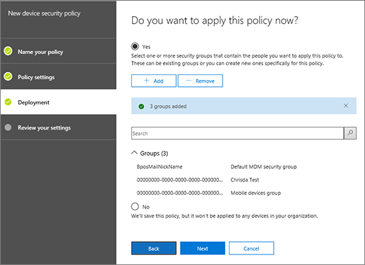

# Creazione e distribuzione dei criteri di sicurezza del dispositivoCreate and deploy device security policies

È possibile utilizzare la gestione dei dispositivi mobili per Office 365 per creare criteri di sicurezza che consentono di proteggere le informazioni dell'organizzazione in Office 365 dall'accesso non autorizzato. È possibile applicare criteri a qualsiasi dispositivo mobile all'interno dell'organizzazione in cui l'utente del dispositivo con una licenza di Office 365 applicabile e ha registrato il dispositivo in MDM per Office 365.You can use Mobile Device Management for Office 365 to create security policies that help protect your organization's information on Office 365 from unauthorized access. You can apply policies to any mobile device in your organization where the user of the device has an applicable Office 365 license and has enrolled the device in MDM for Office 365.
  
## Informazioni preliminariBefore you begin

- Informazioni sui dispositivi, dispositivo mobile App e le impostazioni di sicurezza che supporta MDM per Office 365. Vedere [funzionalità di gestione dei dispositivi mobili per Office 365](capabilities-of-mobile-device-management.md).Learn about the devices, mobile device apps, and security settings that MDM for Office 365 supports. See [Capabilities of Mobile Device Management for Office 365](capabilities-of-mobile-device-management.md).
    
- Creare gruppi di sicurezza che includono utenti di Office 365 che si desidera distribuire i criteri per e per gli utenti che si desidera escludere dalla viene bloccato l'accesso a Office 365. È consigliabile prima di distribuire un nuovo criterio per l'organizzazione, testare i criteri per la distribuzione di un numero limitato di utenti. È possibile creare e utilizzare un gruppo di protezione che include solo se stessi o a un piccolo numero Office 365 gli utenti che è possono testare i criteri per la. Per ulteriori informazioni sui gruppi di protezione, vedere [creare, modificare o eliminare un gruppo di sicurezza](https://go.microsoft.com/fwlink/p/?LinkId=518555).Create security groups that include Office 365 users that you want to deploy policies to and for users that you might want to exclude from being blocked access to Office 365. We recommend that before you deploy a new policy to your organization, you test the policy by deploying it to a small number of users. You can create and use a security group that includes just yourself or a small number Office 365 users that can test the policy for you. To learn more about security groups, see [Create, edit, or delete a security group](https://go.microsoft.com/fwlink/p/?LinkId=518555).
    
- **Importante:** Prima di creare un criterio dispositivi mobili, è necessario attivare e configurare MDM per Office 365. Vedere [Panoramica di gestione dei dispositivi mobili per Office 365](overview-of-mdm.md).**Important:** Before you can create a mobile device policy, you must activate and set up MDM for Office 365. See [Overview of Mobile Device Management for Office 365](overview-of-mdm.md).
    
- Per creare e distribuire criteri di gestione di dispositivi mobili in Office 365, è necessario essere un amministratore. globali di Office 365 Vedere [le autorizzazioni di sicurezza di Office 365 &amp; centro conformità](https://support.office.com/article/d10608af-7934-490a-818e-e68f17d0e9c1).To create and deploy mobile device management policies in Office 365, you need to be an Office 365 global admin. See [Permissions in the Office 365 Security &amp; Compliance Center](https://support.office.com/article/d10608af-7934-490a-818e-e68f17d0e9c1).
    
- Prima di distribuire i criteri, l'organizzazione informati automaticamente il potenziale impatto della registrazione di un dispositivo di MDM per Office 365. A seconda di come impostare i criteri, possono essere bloccati non Compatible dispositivi di accedere a Office 365 e dati, incluse le applicazioni installate, le foto e informazioni personali su un dispositivo iscritti, possono essere eliminati.Before you deploy policies, let your organization know the potential impacts of enrolling a device in MDM for Office 365. Depending on how you set up the policies, noncompliant devices can be blocked from accessing Office 365 and data, including installed applications, photos, and personal information on an enrolled device, can be deleted.
    
> [!NOTE]
> Criteri e regole di accesso create nella MDM per Office 365 ignorerà criteri cassetta postale di dispositivo mobile Exchange ActiveSync e le regole di accesso al dispositivo create nell'interfaccia di amministrazione di Exchange. Dopo che un dispositivo è iscritto MDM per Office 365, qualsiasi criterio cassetta postale di dispositivo mobile Exchange ActiveSync o regola di accesso applicata al dispositivo verrà ignorata. Per ulteriori informazioni su Exchange ActiveSync, vedere [Exchange ActiveSync in Exchange Online](https://go.microsoft.com/fwlink/p/?LinkId=524380).Policies and access rules created in MDM for Office 365 will override Exchange ActiveSync mobile device mailbox policies and device access rules created in the Exchange admin center. After a device is enrolled in MDM for Office 365, any Exchange ActiveSync mobile device mailbox policy or device access rule applied to the device will be ignored. To learn more about Exchange ActiveSync, see [Exchange ActiveSync in Exchange Online](https://go.microsoft.com/fwlink/p/?LinkId=524380). 
  
## Passaggio 1: Creare un criterio di protezione e distribuire a un gruppo di testStep 1: Create a security policy and deploy to a test group

Prima di iniziare, assicurarsi di avere attivato e impostare i MDM per Office 365. Per istruzioni, vedere [Panoramica della gestione dei dispositivi mobili per Office 365](overview-of-mdm.md) .Before you can start, make sure you have activated and set up MDM for Office 365. See [Overview of Mobile Device Management for Office 365](overview-of-mdm.md) for instructions. 
  
1. In Office 365, in sicurezza &amp; centro conformità, passare a **prevenzione della perdita di dati** \> **criteri di protezione dispositivo**.In Office 365, in the Security &amp; Compliance Center, go to **Data loss prevention** \> **Device security policies**.
    
    > [!NOTE]
    > I **criteri di protezione dispositivo** verrà visualizzato nel menu solo dopo aver attivato la gestione dei dispositivi mobili.The **Device security policies** will appear in the menu only after you have activated Mobile device management. 
  
2. Scegliere **Crea un criterio +**.Choose **+ Create a policy**.
    
    
  
3. Specificare un **nome** e una **Descrizione** per il nuovo criterio e quindi fare clic su **Avanti**.Specify a **Name** and **Description** for the new policy, and then choose **Next**.
    
    
  
4. Nella **i requisiti si desidera avere nei dispositivi?** di pagina, specificare i requisiti che si desidera applicare ai dispositivi mobili all'interno dell'organizzazione e quindi fare clic su **Avanti**.On the **What requirements do you want to have on devices?** page, specify the requirements you want applied to mobile devices in your organization, and then choose **Next**.
    
    
  
5. Nella **quali si desidera configurare?** di pagina, specificare eventuali requisiti aggiuntivi che si desidera applicare ai dispositivi mobili all'interno dell'organizzazione e quindi fare clic su **Avanti**.On the **What do you want to configure?** page, specify any additional requirements you want applied to mobile devices in your organization, and then choose **Next**.
    
6. Nella **si desidera applicare questi criteri ora?** di pagina, scegliere **Sì**e quindi fare clic su **Aggiungi +**.On the **Do you want to apply this policy now?** page, choose **Yes**, and then choose **+ Add**. 
    
    
  
7. Selezionare i gruppi che verranno testare i criteri prima di distribuirlo nell'organizzazione e quindi fare clic su **Aggiungi**.Select the group(s) who will test the policy before you deploy it to your organization, and then choose **Add**.
    
8. Scegliere **Avanti**.Choose **Next**.
    
9. Esaminare e verificare i dettagli del nuovo criterio dispositivi e quindi fare clic su **Crea questo criterio**.Review and confirm the details of the new device policy, and then choose **Create this policy**.
    
    
  
10. Fare clic su **Chiudi**.Click **Close**.
    
Ogni utente che si applica il criterio avranno criterio spostato al proprio dispositivo al successivo che accesso a Office 365 dal proprio dispositivo mobile. Se gli utenti sono state ancora applicato al dispositivo mobile prima di un criterio, quindi dopo la distribuzione di criteri, si riceve una notifica sul dispositivo che include i [passaggi per registrare e attivare MDM per Office 365](https://go.microsoft.com/fwlink/?LinkId=615272). Finché non vengono completati la registrazione, accesso alla posta elettronica, OneDrive e altri servizi saranno limitate. Dopo il completamento di registrazione utilizzando l'app Intune portale della società, sarà in grado di utilizzare i servizi e il criterio verrà applicato al proprio dispositivo.Each user that the policy applies to will have the policy pushed to their device the next time they sign in to Office 365 using their mobile device. If users haven't had a policy applied to their mobile device before, then after you deploy the policy, they'll get a notification on their device that includes the [steps to enroll and activate MDM for Office 365](https://go.microsoft.com/fwlink/?LinkId=615272). Until they complete enrollment, access to email, OneDrive, and other services will be restricted. After they complete enrollment using the Intune Company Portal app, they'll be able to use the services and the policy will be applied to their device.
  
## Passaggio 2: Verificare il funzionamento di criteriStep 2: Verify your policy works

Dopo aver creato un criterio di protezione, è necessario verificare che il criterio funzioni nel modo previsto prima di distribuirlo nell'organizzazione.After you've created a security policy, you should check that the policy works as you expect before you deploy it to your organization.
  
1. In Office 365, passare a **protezione &amp; centro conformità** \> **prevenzione della perdita di dati** \> **la gestione dei dispositivi**.In Office 365, go to **Security &amp; Compliance Center** \> **Data loss prevention** \> **Device management**.
    
2. Nella pagina **Gestione dei dispositivi mobili per Office 365** , controllare lo stato dei dispositivi di utenti che hanno il criterio applicato. È possibile filtrare oppure ordinare da **tutti** per visualizzare tutti i dispositivi o **bloccato** per visualizzare i dispositivi bloccati.On the **Mobile Device Management for Office 365** page, Check the status of user devices that have the policy applied. You can filter or sort by **All** to view all devices, or **Blocked** to view blocked devices. 
    
    
  
3. È possibile eseguire una cancellazione completa o selettiva nel dispositivo. Per ulteriori informazioni, vedere [a comparsa da un dispositivo mobile in Office 365](wipe-a-mobile-device.md).You can also do a full or selective wipe on the device. For instructions, see [Wipe a mobile device in Office 365](wipe-a-mobile-device.md).
    
## Passaggio 3: Distribuire un criterio per l'organizzazioneStep 3: Deploy a policy to your organization

Dopo aver creato un criterio dispositivi mobili e verificare che funzioni correttamente, distribuirlo nell'organizzazione.After you've created a mobile device policy and verified that it works as expected, deploy it to your organization.
  
1. In Office 365, passare a **protezione &amp; centro conformità** \> **prevenzione della perdita di dati** \> **criteri di protezione dispositivo**.In Office 365, go to **Security &amp; Compliance Center** \> **Data loss prevention**\> **Device security policies**.
    
2. Selezionare il criterio che si desidera distribuire e scegliere **Modifica criteri** nel \< _Nome criterio_ \> pannello.  Select the policy you want to deploy, and choose **Edit policy** in the \<  _policy name_\> panel.
    
3. Seleziona la scheda **Distribuzione**.Select the **Deployment** tab. 
    
4. Nella scheda **distribuzione** scegliere **Sì** sopra **Selezionare uno o più gruppi di sicurezza che contengono le persone che si desidera applicare questo criterio** e quindi su **Aggiungi**.In the **Deployment** tab, choose **Yes** above **Select one or more security groups that contain the people you want to apply this policy to** and then **Add**.
    
  - Nel riquadro **Seleziona gruppo** , è possibile ricercare un gruppo da aggiungere, è possibile applicare un filtro tramite alias o in base al nome visualizzato. È inoltre possibile aggiungere un gruppo esistente nell'elenco **gruppi** .On the **Select Group** panel, you can search for a group to add, you can filter either by alias or by display name. You can also add an existing group from the **Groups** list. 
    
    È possibile aggiungere più gruppi per applicare il criterio.You can add multiple groups to apply the policy to.
    
    Scegliere **Aggiungi** nella parte inferiore del riquadro.Choose **Add** on the bottom of the panel. 
    
5. Nella scheda **distribuzione** , scegliere **Salva** .Choose **Save** on the **Deployment** tab. 
    
    
  
Ogni utente che si applica il criterio avranno criterio spostato al proprio dispositivo al successivo che accesso a Office 365 da un dispositivo mobile. Se gli utenti sono state ancora un criterio applicato al dispositivo mobile, si verrà [visualizzata una notifica nel dispositivo](https://go.microsoft.com/fwlink/?LinkId=615272) con i passaggi per eseguire la registrazione e attivarlo per MDM per Office 365. Dopo che una volta completata la registrazione, il criterio verrà applicato il dispositivo.Each user that the policy applies to will have the policy pushed to their device the next time they sign in to Office 365 from their mobile device. If users haven't had a policy applied to their mobile device, they'll [get a notification on their device](https://go.microsoft.com/fwlink/?LinkId=615272) with steps to enroll and activate it for MDM for Office 365. After they've completed the enrollment, the policy will be applied to their device. 
  
## Passaggio 4: Bloccare posta l'accesso per i dispositivi non supportatiStep 4: Block email access for unsupported devices

Per garantire protezione le informazioni dell'organizzazione, è necessario bloccare l'accesso app di posta elettronica di Office 365 per i dispositivi mobili che non sono supportate da MDM per Office 365. Per un elenco dei dispositivi supportati, vedere [funzionalità di gestione incorporati di dispositivo Mobile per Office 365](capabilities-of-mobile-device-management.md) . A tale scopo:To help secure your organization's information, you should block app access to Office 365 email for mobile devices that are not supported by MDM for Office 365. See [Capabilities of built-in Mobile Device Management for Office 365](capabilities-of-mobile-device-management.md) for a list of devices that are supported. To do this: 
  
1. Andare a protezione &amp; centro conformità\> **prevenzione della perdita di dati** \> **criteri di protezione dispositivo**.Go to Security &amp; Compliance Center\> **Data loss prevention**\> **Device security policies**.
    
2. Selezionare **Gestisci impostazioni di accesso dispositivo a livello di organizzazione**.Select **Manage organization-wide device access settings**.
    
    
  
3. Per bloccare i dispositivi non supportati, scegliere **Blocca** in **Se un dispositivo non è supportato dal MDM per Office 365, si desidera consentire o bloccare direttamente dal utilizzando un account di Exchange per accedere alla posta elettronica dell'organizzazione** \> **salvare**.To block unsupported devices, choose **Block** under **If a device isn't supported by MDM for Office 365, do you want to allow or block it from using an Exchange account to access your organization's email** \> **Save**.
  
## Passaggio 5: Scegliere i gruppi di sicurezza da escludere dai controlli dell'accesso condizionaleStep 5: Choose security groups to be excluded from conditional access checks

Se si desidera escludere alcuni utenti dai controlli dell'accesso condizionale sui relativi dispositivi mobili e sono stati creati uno o più gruppi di sicurezza per tali utenti, è possibile aggiungere qui i gruppi di sicurezza. Non saranno applicati criteri ai dispositivi mobili supportati delle persone di questi gruppi.If you want to exclude some people from conditional access checks on their mobile devices and you've created one or more security groups for those people, add the security groups here. The people in these groups will not have any policies enforced for their supported mobile devices.
  
1. Andare a protezione &amp; centro conformità\> **prevenzione della perdita di dati** \> **criteri di protezione dispositivo**.Go to Security &amp; Compliance Center\> **Data loss prevention**\> **Device security policies**.
    
2. Selezionare **Gestisci impostazioni di accesso dispositivo a livello di organizzazione**.Select **Manage organization-wide device access settings**.
    
    
  
3. Selezionare **Aggiungi** per aggiungere il gruppo di sicurezza con gli utenti che si desidera escludere dalla viene bloccato l'accesso a Office 365. Quando un utente è stato aggiunto all'elenco, sarà in grado di accedere alla posta elettronica di Office 365 quando si utilizza un dispositivo non supportato.Select **Add** to add the security group that has users that you'd like to exclude from being blocked access to Office 365. When a user has been added to this list, they'll be able to access Office 365 email when using an unsupported device. 
    
4. Selezionare il gruppo di sicurezza da utilizzare nel riquadro **Selezionare gruppo** .Select the security group you want to use in the **Select group** panel. 
    
5. Selezionare il nome e **Aggiungi** \> **salvare**.Select the name, and then **Add** \> **Save**.
    
6. Nel riquadro delle **impostazioni di accesso dispositivo a livello di organizzazione** , scegliere **Salva**.On the **Organization-wide device access settings** panel, choose **Save**.
  
## Qual è l'impatto dei criteri di sicurezza sui diversi tipi di dispositivo?What is the impact of security policies on different device types?

Quando si applica un criterio ai dispositivi dell'utente, l'impatto su ogni dispositivo varia leggermente tra diversi tipi di dispositivo. Vedere la tabella seguente per visualizzare esempi dell'impatto dei criteri su diversi dispositivi.When you apply a policy to user devices, the impact on each device varies somewhat between different device types. See the following table for examples of the impact of policies on different devices.
  

|**Criterio di sicurezza****Security Policy**|**Windows Phone 8.1 +****Windows Phone 8.1+**|**Android 4+****Android 4+**|**Samsung Knox****Samsung Knox**|**IOS 6 +****IOS 6+**|**Note****Notes**|
|:-----|:-----|:-----|:-----|:-----|:-----|
|Richiede un backup crittografatoRequire encrypted backup    |✖✖    |✖✖    |✔✔    |✔✔    |Richiede un backup crittografato di IOS.IOS encrypted backup required.    |
|Blocca backup sul cloudBlock cloud backup    |✖✖    |✔✔    |✔✔    |✔✔    |Blocca backup Google su Android (in grigio), backup cloud su IOS.Block Google backup on Android (grayed out), cloud backup on iOS.    |
|Blocca sincronizzazione documentiBlock document synchronization    |✖✖    |✖✖    |✖✖    |✔✔    |iOS: blocca i documenti nel cloud.iOS: Block documents in the cloud.    |
|Blocca sincronizzazione fotoBlock photo synchronization    |✖✖    |✖✖    |✖✖    |✔✔    |iOS (nativo): blocco lo streaming foto.iOS (native): Block Photo Stream.    |
|Blocca acquisizione schermataBlock screen capture    |✔✔    |XX    |✔✔    |✔✔    |Tentativo bloccato.Blocked when attempted.    |
|Blocca videoconferenzaBlock video conference    |✖✖    |✖✖    |✖✖    |✔✔    |FaceTime bloccato in iOS, non Skype o altri.FaceTime blocked on iOS, not Skype or others.    |
|Blocca invio dati di diagnosticaBlock sending diagnostic data    |✖✖    |XX    |✔✔    |✔✔    |Blocco invio segnalazione di arresto anomalo di Google su Android.Block sending Google crash report on Android.    |
|Blocca l'accesso all'app storeBlock access to app store    |✔✔    |XX    |✔✔    |✔✔    |Icona app store mancante nella home page di Android, disattivata in Windows, mancante in IOS.App store icon missing on Android home page, disabled on Windows, missing on iOS.    |
|Richiede una password per l'app storeRequire password for app store    |✖✖    |✖✖    |✖✖    |✔✔    |iOS: password necessaria per gli acquisti su iTunes.iOS: Password required for iTunes purchases.    |
|Blocca connessione con archivi rimovibiliBlock connection to removable storage    |✔✔    |XX    |✔✔    |NDNA    |Android: la scheda SD verrà disattivata nelle impostazioni, Windows invia una notifica all'utente per informarlo che le app installate non sono disponibiliAndroid: SD card will be grayed out in settings, Windows notifies user, apps installed there are not available    |
|Blocca connessione BluetoothBlock Bluetooth connection    |✔✔    |\*\*\*    |\*\*\*    |✖✖    |\*\*\*È Impossibile disabilitare BlueTooth come impostazione su Android. In realtà, si disattiva tutte le transazioni che richiedono BlueTooth: distribuzione Audio avanzate, controllo remoto Audio/Video, dispositivi vivavoce, auricolare, accesso Rubrica e porta seriale. Quando si verifica una di queste vengono utilizzata, verrà visualizzato un messaggio popup piccole nella parte inferiore della pagina.\*\*\*We can't disable BlueTooth as a setting on Android. Instead, we disable all the transactions that require BlueTooth: Advanced Audio Distribution, Audio/Video Remote Control, hands-free devices, headset, Phone Book Access, and Serial Port. A small toast message appears at the bottom of the page when any of these are used.    |
   
## Cosa accade quando si elimina un criterio o si rimuove un utente dal criterio?What happens when you delete a policy or remove a user from the policy?

Quando si elimina un criterio o rimuove un utente da un gruppo a cui è stato distribuito il criterio a, le impostazioni dei criteri, il profilo di posta elettronica di Office 365 e messaggi di posta elettronica memorizzati nella cache può rimuovere dal dispositivo dell'utente. Vedere la tabella seguente per determinare quali è stata rimossa per i tipi di dispositivi diversi:When you delete a policy or remove a user from a group to which the policy was deployed to, the policy settings, Office 365 email profile and cached emails may be removed from the user's device. See the following table to see what is removed for the different device types:
  
|**Contenuto rimosso****What's removed**|**Windows Phone 8.1 +****Windows Phone 8.1+**|**iOS 6 +****iOS 6+**|**Android 4 + (inclusi Samsung Knox)****Android 4+ (including Samsung Knox)**|
|:-----|:-----|:-----|:-----|
|Profili gestiti tramite posta elettronica\*Managed email profiles\*    |✖✖    |✔✔    |✖✖    |
|Impostazioni dei criteriPolicy settings    |✔✔              Ad eccezione di **Blocca invio dati di diagnostica dal dispositivo.**Except for **Block sending diagnostic data from device.**   |✔✔    |✖✖    |
   
> [!NOTE]
> \*Se il criterio è stato distribuito con l'opzione **viene gestito il profilo di posta elettronica** selezionato, quindi il profilo di posta elettronica gestita e memorizzati nella cache di messaggi di posta elettronica in quanto profilo verrà eliminato dal dispositivo dell'utente.\*If the policy was deployed with the option **Email profile is managed** selected, then the managed email profile and cached emails in that profile will be deleted from the user's device. 
  
Ogni utente a cui è applicato il criterio rimosso avrà il criterio rimosso dal proprio dispositivo al successivo controllato dal proprio dispositivo mobile con MDM per Office 365. Se si distribuisce un nuovo criterio che si applica ai dispositivi di tali utenti, verrà richiesto di registrare nuovamente MDM per Office 365.Each user that the removed policy applied to will have the policy removed from their device the next time their mobile device checks in with MDM for Office 365 . If you deploy a new policy that applies to these users' devices, they'll be prompted to re-enroll in MDM for Office 365.
  
È inoltre possibile [cancellazione di un dispositivo](wipe-a-mobile-device.md), uno completamente o in modo selettivo a comparsa da informazioni sull'organizzazione dal dispositivo.You can also [wipe a device](wipe-a-mobile-device.md), either completely, or selectively wipe organizational information from the device.
  
## Argomenti correlatiRelated Topics

[Panoramica di gestione dei dispositivi mobili per Office 365Overview of Mobile Device Management for Office 365](overview-of-mdm.md)
  
[Funzionalità di gestione dei dispositivi mobili per Office 365Capabilities of Mobile Device Management for Office 365](capabilities-of-mobile-device-management.md)
  

