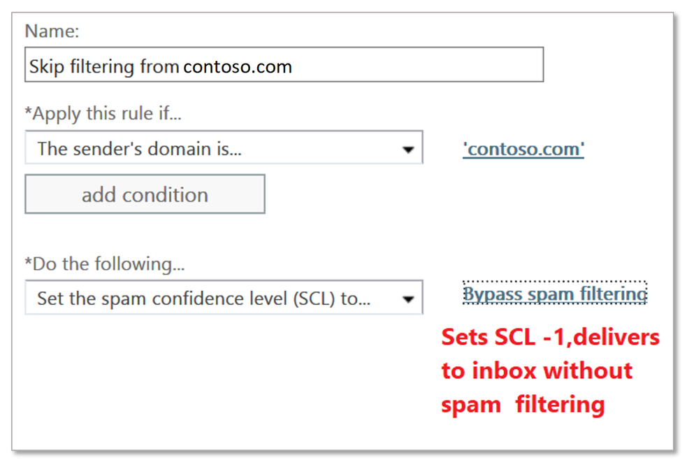

# Creare elenchi di mittenti attendibili in Office 365Create safe sender lists in Office 365

Se si desidera garantire che gli utenti ricevano messaggi di posta elettronica da un mittente o mittenti particolari, poiché si considerano attendibili i messaggi, sono disponibili più metodi tra cui è possibile scegliere.If you want to ensure that users receive emails from a particular sender or senders because you trust them and their messages, there are multiple methods available that you can choose from. Queste opzioni includono le regole di trasporto di Exchange (ETRs), i mittenti attendibili di Outlook, gli elenchi di indirizzi IP consentiti, i mittenti/domini di posta indesiderata.These options include Exchange Transport Rules (ETRs), Outlook Safe Senders, IP Allow Lists, Anti-spam Sender/Domain Allow Lists.

> [!IMPORTANT]
> Anche se è possibile utilizzare gli elenchi per l'organizzazione per risolvere i falsi positivi, è consigliabile considerare una soluzione temporanea e, se possibile, evitarla.While organization allow lists can be used to address false positives, this should be considered a temporary solution and avoided if possible. La gestione dei falsi positivi mediante l'utilizzo degli elenchi Consenti non è consigliata perché può inavvertitamente aprire l'organizzazione fino allo spoofing, alla rappresentazione e ad altri attacchi.Managing false positives by using allow lists is not recommended as it can inadvertently open your organization up to spoofing, impersonation, and other attacks. Se si intende utilizzare un elenco Consenti per questo scopo, è necessario essere vigili e mantenere l'articolo per l' [invio di posta indesiderata, non posta indesiderata e messaggi di phishing a Microsoft per l'analisi](https://docs.microsoft.com/en-us/office365/SecurityCompliance/submit-spam-non-spam-and-phishing-scam-messages-to-microsoft-for-analysis), al pronto.If you will use an allow list for this purpose, you will need to be vigilant and keep the article for [submitting spam, non-spam, and phishing mails to Microsoft for analysis](https://docs.microsoft.com/en-us/office365/SecurityCompliance/submit-spam-non-spam-and-phishing-scam-messages-to-microsoft-for-analysis), at the ready.

Il metodo consigliato per configurare un elenco di mittenti attendibili consiste nell'utilizzare le regole di trasporto di Exchange (ETRs), in quanto rappresenta la maggiore flessibilità per garantire che vengano consentiti solo i messaggi giusti.The recommended method to configure a safe sender list is to use an Exchange Transport Rules (ETRs) as this presents the most flexibility to ensure that only the right messages get allowed. Gli *elenchi* di *indirizzi di posta elettronica* e di criteri di protezione da posta indesiderata non sono sicuri come gli *elenchi basati su indirizzi IP* perché i domini possono essere falsificati facilmente.*Anti-Spam policy email address* and *Domain based allow lists* are not as secure as *IP address-based lists* because domains can easily be spoofed. Tuttavia, i criteri di protezione da posta indesiderata basati su IP consentono anche di presentare rischi in quanto consentiranno ai domini inviati tramite tale IP di ignorare il filtro antispam.But anti-spam policy IP based allow lists also present risks as they will allow any domains sent through that IP to bypass spam filtering. Fare attenzione e monitorare *tutte le* eccezioni fatte con attenzione.Please be careful and monitor *any* exceptions made, carefully.

> [!IMPORTANT]
> Di [seguito](create-block-sender-lists-in-office-365.md)vengono fornite informazioni su come creare un **elenco di mittenti bloccati** .Information on how to create a **Blocked Sender List** is [here](create-block-sender-lists-in-office-365.md).

## Opzioni dalla maggior parte dei casi meno consigliatiOptions from most to least recommended

È sempre necessario limitare gli elenchi consentiti perché ignorano molte misure di sicurezza.You should always restrict your Allow lists because they bypass many security measures. È necessario ricontrollare tutti gli elenchi consentiti come parte della manutenzione standard, in modo da essere a conoscenza di chi è autorizzato a ignorare.You must recheck all Allow lists as a part of your standard maintenance, so that you are aware of who is permitted to bypass. La raccomandazione è di utilizzare ETRs restrittive laddove possibile.The recomendation is to use restrictive ETRs where possible.

- Regole di trasporto di Exchange (ETRs chiamato anche regole del flusso di posta)Exchange Transport Rules (ETRs also called mail-flow rules)
- Mittenti attendibili di OutlookOutlook Safe Senders
- Criteri di protezione da posta indesiderata: elenchi di indirizzi IPAnti-spam policy: IP Allow Lists
- Criteri di protezione dalla posta indesiderata: elenchi di mittenti/domini consentitiAnti-spam policy: Sender/Domain Allow Lists

## Utilizzo delle regole di trasporto di Exchange (ETRs) per consentire mittenti specifici (scelta consigliata)Using Exchange Transport Rules (ETRs) to allow specific senders (Recommended)

Per assicurarsi che nell'organizzazione siano consentiti solo i messaggi legittimi, la condizione deve essere una delle seguenti:To ensure that only legitimate messages are allowed into your organization the condition should be one of the following:

- Utilizzare lo stato di autenticazione del mittente del dominio di invio.Use the sender authentication status of the sending domain. Per ottenere questo risultato, è necessario controllare l'intestazione Authentication-Results per assicurarsi che contenga "DMARC = Pass" o "DMARC = bestguesspass".This is done by checking the Authentication-Results header to ensure that it contains “dmarc=pass” or “dmarc=bestguesspass”. Questo garantisce che il dominio di invio sia stato autenticato e che non sia contraffatto.This ensures that the sending domain has been authenticated and is not being spoofed. Fare clic per ulteriori informazioni su [SPF](https://docs.microsoft.com/en-us/office365/SecurityCompliance/set-up-spf-in-office-365-to-help-prevent-spoofing), [DKIM](https://docs.microsoft.com/en-us/office365/SecurityCompliance/use-dkim-to-validate-outbound-email)e l'autenticazione della posta elettronica di [DMARC](https://docs.microsoft.com/en-us/office365/SecurityCompliance/use-dmarc-to-validate-email) .Click for more on [SPF](https://docs.microsoft.com/en-us/office365/SecurityCompliance/set-up-spf-in-office-365-to-help-prevent-spoofing), [DKIM](https://docs.microsoft.com/en-us/office365/SecurityCompliance/use-dkim-to-validate-outbound-email), and [DMARC](https://docs.microsoft.com/en-us/office365/SecurityCompliance/use-dmarc-to-validate-email) email authentication.

- In alternativa, se il dominio di invio non dispone dell'autenticazione, utilizzare il dominio di invio *e* un IP di invio (o un intervallo di indirizzi IP).Or, if the sending domain does not have authentication, use the sending domain *plus* a sending IP (or IP range). Assicurarsi di essere il più *restrittivo possibile*, l'obiettivo è quello di eseguire questa operazione nel modo più sicuro possibile.Ensure that you are *as restrictive as possible*, the goal being that you do this as securely as possible. *Non* è consigliabile utilizzare un intervallo IP maggiore di/24.An IP range larger than /24 is *not* recommended. Evitare di aggiungere intervalli di indirizzi IP che appartengono a servizi consumer o a infrastrutture condivise.Avoid adding IP address ranges that belong to consumer services or shared infrastructures.

> [!IMPORTANT]
> Se si consente a un indirizzo IP che è NATted, è necessario conoscere i computer coinvolti in quel pool di NAT per conoscere l'ambito del proprio allow.If you allow an IP address that is NATted, you should know the machines that are involved in that NAT pool in order to know the scope of your Allow. Tenere presente che è possibile che gli indirizzi IP vengano modificati e che i partecipanti NAT possano anche.Be aware that IP addresses may change, and NAT participants may too. È necessario ricontrollare tutti gli elenchi consentiti, incluso l'indirizzo IP consentito nell'ambito della manutenzione standard.You must recheck all Allow lists, including IP Allows as part of your standard maintenance.

- *Facoltativamente*, aggiungere una condizione che il messaggio ha origine all'esterno dell'organizzazione (implicito, ma è bene aggiungerla come condizione per rendere conto dei server locali che potrebbero non essere configurati correttamente).*Optionally*, add a condition that the message originates from outside the organization (this is implicit, but it's fine to add it as a condition to account for on-premise servers that may not be correctly configured).

- *Facoltativamente*, se è possibile identificare qualsiasi parola chiave o frase univoca nell'oggetto o nel corpo del messaggio di posta elettronica, utilizzare queste informazioni come condizione aggiuntiva per limitare ulteriormente i messaggi di posta elettronica consentiti dalla regola del flusso di posta.*Optionally*, if you can identify any unique keywords or phrases in the email Subject or Body use this information as an additional condition to further restrict the email messages allowed by the mail flow rule.

L'azione sulla regola deve seguire questo modello:The action on the rule must follow this pattern:

1. Impostare il livello di probabilità di posta indesiderata (SCL) su-1 (ignorare il filtro posta indesiderata).Set the spam confidence level (SCL) to -1 (bypass spam filtering).

2. Aggiungere un X-header per indicare la regola.Add an X-Header to say what the rule does. Nell'esempio riportato di seguito, è possibile aggiungere un'intestazione semplice "X-ETR: bypassare il filtro della posta `contoso.com`indesiderata per il mittente autenticato".In the example below, you can add a simple header "X-ETR: Bypass spam filtering for authenticated sender `contoso.com`". Se nella regola sono presenti più domini, è possibile modificare il testo dell'intestazione in base alle proprie esigenze. **Quando un messaggio salta il filtro a causa di un ETR, timbri SFV: SKN nell'intestazione X-Forefront-antispam-report** **se si tratta di un elenco di indirizzi IP consentiti, viene anche timbrato IPV: Cal**.If you have more than one domain in this rule, you can change the header text as appropriate.**When a message skips filtering due to an ETR, it stamps SFV:SKN in the X-Forefront-Antispam-Report header** (**if it's on an IP Allow list, it also stamps IPV:CAL**). In questo modo verrà consentita la risoluzione dei problemi.This will assist with troubleshooting.

> [!CAUTION]
> Non configurare le regole del flusso di posta con solo *il dominio del mittente* come condizione per ignorare il filtro posta indesiderata.Do not configure mail flow rules with only *the sender domain* as a condition to skip spam filtering. Questo metodo aumenta significativamente il rischio che gli spammer possano falsificare il dominio di invio (o rappresentare l'indirizzo di posta elettronica completo) ignorare tutti i filtri per la posta indesiderata, i controlli di autenticazione del mittente e il messaggio arriverà nella posta in arrivo di una persona.This method significantly increases the risk spammers can spoof the sending domain (or impersonate the full email address) skip all spam filtering, sender authentication checks, and the message will arrive in a person's inbox.

Non aggiungere domini che possiedi o domini più diffusi (ad esempio `microsoft.com`,) per la regola del flusso di posta come condizione.Do not add domains you own, or popular domains (e.g. `microsoft.com`) to the mail flow rule as a condition. Questo è considerato un rischio elevato, in quanto consente agli attori cattivi di inviare messaggi di posta elettronica che altrimenti verrebbero filtrati.This is considered high risk since it creates opportunities for bad actors to send you mail that would otherwise be filtered out.

[Fare clic sulla procedura per creare un ETR, noto anche come regole del flusso di posta](https://docs.microsoft.com/en-us/office365/SecurityCompliance/use-mail-flow-rules-to-set-the-spam-confidence-level-scl-in-messages).[Please click for the steps to create an ETR, also known as mail-flow rules](https://docs.microsoft.com/en-us/office365/SecurityCompliance/use-mail-flow-rules-to-set-the-spam-confidence-level-scl-in-messages).

## Utilizzare i mittenti attendibili di Outlook (gestiti dall'utente finale)Use Outlook Safe Senders (end-user managed)

Invece di autorizzare un indirizzo, un dominio o un indirizzo IP a livello globale, gli utenti finali possono anche consentire l'invio di indirizzi tramite mittenti attendibili di Outlook.Instead of authorizing an address, a domain, or an IP address globally, end users can also allow sending addresses through Outlook Safe Senders. La procedura per impostare questa impostazione è diversa tra [Outlook Web App](https://support.office.com/en-us/article/block-or-allow-junk-email-settings-48c9f6f7-2309-4f95-9a4d-de987e880e46) e il [client Outlook](https://support.office.com/en-us/article/overview-of-the-junk-email-filter-5ae3ea8e-cf41-4fa0-b02a-3b96e21de089).The steps to set this up differ between [Outlook Web App](https://support.office.com/en-us/article/block-or-allow-junk-email-settings-48c9f6f7-2309-4f95-9a4d-de987e880e46) and the [Outlook client](https://support.office.com/en-us/article/overview-of-the-junk-email-filter-5ae3ea8e-cf41-4fa0-b02a-3b96e21de089). **Quando i messaggi vengono autorizzati correttamente a causa di mittenti attendibili, si vedrà SFV: SFE in X-Forefront-antispam-report** che indica che il filtro di posta indesiderata/spoofing/phishing verrà ignorato.**When messages are successfully authorized due to Safe Senders you will see SFV:SFE in the X-Forefront-Antispam-Report** which indicates that Spam/Spoof/Phish filtering will be bypassed.

## Utilizzare gli elenchi di criteri di protezione da posta indesiderata IPUse Anti-Spam Policy IP Allow lists

Quando non è possibile utilizzare ETRs per consentire a livello globale un mittente specifico durante la convalida dell'autenticazione del mittente, oppure legare un dominio e un IP insieme, l'opzione migliore è quella di aggiungere il mittente all' *elenco indirizzi IP*consentiti per i criteri di protezione da posta indesiderata.When it’s not possible to use ETRs to globally allow a specific sender while validating Sender Authentication, or by tying a domain and IP together, the next best option is to add the sender to the *Anti-Spam Policy IP Allow list*. [La procedura dettagliata è disponibile in configurare il documento dei criteri di filtro delle connessioni](https://docs.microsoft.com/en-us/office365/securitycompliance/configure-the-connection-filter-policy).[The detailed steps can be found in Configure the connection filter policy document](https://docs.microsoft.com/en-us/office365/securitycompliance/configure-the-connection-filter-policy). È importante mantenere almeno l'elenco di indirizzi IP consentiti ed evitare di usare gli intervalli di indirizzi IP.It is important to keep the list of allowed IP address on minimum and avoid using IP address ranges. Evitare di aggiungere intervalli di indirizzi IP che appartengono a servizi consumer o a infrastrutture condivise e *verificare* che l'elenco degli indirizzi IP consentiti venga esaminato periodicamente e rimuovere quelli che non sono più necessari.Avoid adding IP address ranges that belong to consumer services or shared infrastructures, and also *ensure* that you review the list of allowed IP addresses regularly and remove the ones that are no longer needed.

> [!CAUTION]
> La configurazione dei criteri di protezione da posta indesiderata in base al solo indirizzo IP del mittente provocherà l'omissione del filtro della posta indesiderata per tutti i messaggi provenienti da tale indirizzo IP nella regola Allow.Configuring Anti-Spam polices to Allow based on only sender IP address will result in skipping spam filtering for all messages from that IP address in the allow rule. Questo crea un rischio elevato di attori cattivi che inviano messaggi di posta elettronica che altrimenti verrebbero filtrati. Questo metodo ignora anche tutti i filtri di posta indesiderata, i controlli di autenticazione del mittente e il messaggio atterra nella posta in arrivo di un utente, aumentando il rischio.This creates a high risk of bad actors sending you mail that would otherwise be filtered out. This method also skips all spam filtering, sender authentication checks and the message lands in a user's inbox, increasing risk.

## Utilizzo degli elenchi di criteri di protezione da posta indesiderata/dominio consentitoUse Anti-Spam Policy Sender/Domain Allow lists

L'opzione meno desiderabile consiste nell'autorizzare il mittente/dominio.The least desirable option is to authorize by sender/domain. Questa opzione dovrebbe essere evitata *se possibile* , poiché ignora completamente la protezione da posta indesiderata/spoofing/phishing e non valuta l'autenticazione del mittente.This option should be avoided *if at all possible* as it bypasses Spam/Spoof/Phish protection completely and does not evaluate sender authentication. Questo metodo aumenta il rischio di ricezione di messaggi di posta elettronica da parte di attori non validi ed è consigliato solo temporaneamente e solo quando si esegue il test.This method increases your risk of receiving mail from bad actors and is best recommended temporarily and only when testing. La procedura dettagliata è disponibile in [configurare il](https://docs.microsoft.com/en-us/office365/securitycompliance/configure-your-spam-filter-policies) documento dei criteri di filtro della posta indesiderata.The detailed steps can be found in [Configure your spam filter policies](https://docs.microsoft.com/en-us/office365/securitycompliance/configure-your-spam-filter-policies) document.

> [!CAUTION]
> La configurazione di criteri di protezione da posta indesiderata per *consentire il dominio mittente/Consenti* genera messaggi che ignorano il filtro posta indesiderata per un messaggio proveniente da mittenti nell'elenco Consenti oppure b) eventuali mittenti provenienti da un dominio consentito.Configuring Anti-Spam polices to *allow sender/allow domain* will result in messages skipping spam filtering for a) messages from senders in the allow list, or b) any senders from an allowed domain. Questo metodo aumenta significativamente il rischio che gli spammer possano falsificare il dominio di invio (o rappresentare l'indirizzo di posta elettronica completo), che ignora tutti i filtri per la posta indesiderata, i controlli di autenticazione del mittente e invierà il messaggio direttamente nella posta in arrivo di una persona.This method significantly increases the risk spammers can spoof the sending domain (or impersonate the full email address) which skips all spam filtering, sender authentication checks, and will send the message directly into a person's inbox.
> 
> Non aggiungere domini proprietari o popolari (ad esempio, `microsoft.com`) alla regola del flusso di posta come condizione.Do not add domains you own or popular domains (e.g. `microsoft.com`) to the mail flow rule as a condition. Questo metodo è considerato a rischio elevato, poiché consente agli attori cattivi di inviare messaggi di posta elettronica altrimenti filtrati, aumentando i rischi.This method is considered high risk since it creates opportunities for bad actors to send you mail that would otherwise be filtered out, increasing risk.

> [!IMPORTANT]
> Di [seguito](create-block-sender-lists-in-office-365.md)vengono fornite informazioni su come creare un **elenco di mittenti bloccati** .Information on how to create a **Blocked Sender List** is [here](create-block-sender-lists-in-office-365.md).