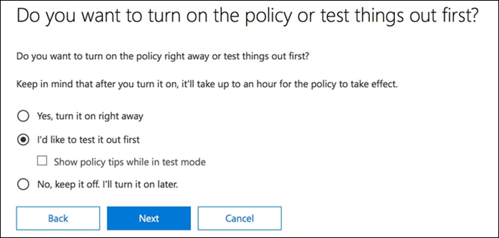
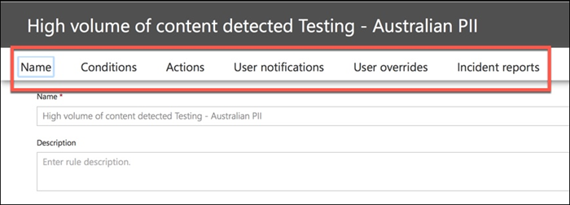
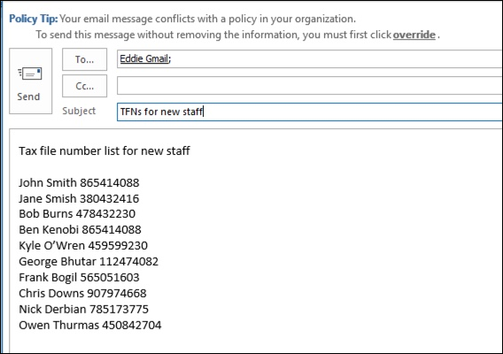

# Creare, testare e ottimizzare un criterio di prevenzione della perdita dei dati

**Autore principale**  
Paul Cunningham, Microsoft MVP  
[Pratico 365](https://practical365.com/)  
[@Practical365](https://twitter.com/practical365) 
__________________________________________________

La prevenzione della perdita di dati è una funzionalità di conformità di Office 365 progettata per aiutare l'organizzazione a impedire l'esposizione intenzionale o accidentale di informazioni riservate a parti indesiderate. DLP ha le sue radici in Exchange Server ed Exchange Online ed è applicabile anche in SharePoint Online e OneDrive for business.

DLP utilizza un motore di analisi del contenuto per esaminare il contenuto dei messaggi di posta elettronica e i file, in cerca di informazioni riservate, come i numeri di carta di credito e le informazioni di identificazione personale (PII). Le informazioni riservate in genere non devono essere inviate tramite posta elettronica o incluse nei documenti, senza eseguire passaggi aggiuntivi quali la crittografia del messaggio di posta elettronica o dei file. Usando DLP è possibile rilevare informazioni riservate e intraprendere azioni quali:

- Registrare l'evento ai fini del controllo
- Visualizza un messaggio di avviso per l'utente finale che invia il messaggio di posta elettronica o la condivisione del file
- Blocca attivamente il messaggio di posta elettronica o la condivisione di file in corso

A volte i clienti respingono DLP perché non si considerano di avere il tipo di dati che devono essere protetti. Si presuppone che i dati sensibili, ad esempio i record medici o le informazioni finanziarie, esistano solo per le industrie come l'assistenza sanitaria o per le aziende che eseguono negozi online. Tuttavia, qualsiasi azienda può gestire periodicamente le informazioni riservate, anche se non lo sanno. Un foglio di calcolo per i nomi dei dipendenti e le date di nascita è altrettanto sensibile come un foglio di calcolo dei nomi di clienti e i dettagli delle carte di credito. E questo tipo di informazioni tende a fluttuare più di quanto si potrebbe immaginare, in quanto i dipendenti passano tranquillamente le loro attività quotidiane, non pensando di esportare un file CSV da un sistema e di inviarlo tramite posta elettronica a un utente. Si potrebbe anche essere sorpresi di quanto spesso i dipendenti inviano messaggi di posta elettronica contenenti informazioni sulla carta di credito o bancarie senza considerare le conseguenze.

## Come vengono rilevate informazioni riservate da DLP

Le informazioni riservate vengono identificate mediante un criterio di espressione regolare (RegEx), in combinazione con altri indicatori, ad esempio la prossimità di determinate parole chiave agli schemi corrispondenti. Un esempio è costituito da numeri di carta di credito. Un numero di carta di credito VISA ha 16 cifre. Tuttavia, tali cifre possono essere scritte in modi diversi, ad esempio 1111-1111-1111-1111, 1111 1111 1111 1111 o 1111111111111111.

Qualsiasi stringa di 16 cifre non è necessariamente un numero di carta di credito, può essere un numero di biglietto da un sistema di supporto tecnico o un numero di serie di un componente hardware. Per indicare la differenza tra un numero di carta di credito e una stringa di 16 cifre innocua, viene eseguito un calcolo (checksum) per confermare che i numeri corrispondono a un modello noto dei vari marchi di carte di credito.

Inoltre, la prossimità di parole chiave quali "VISA" o "AMEX", insieme alla vicinanza ai valori di data che potrebbero essere la data di scadenza della carta di credito, è anche considerata come una decisione sul fatto che i dati siano o meno un numero di carta di credito.

In altre parole, DLP è in genere abbastanza intelligente da riconoscere la differenza tra questi due testi in un messaggio di posta elettronica:

- "Puoi ordinarmi un nuovo laptop. Utilizzare il numero di VISA 1111-1111-1111-1111, la scadenza 11/22 e inviare la data di consegna stimata quando si ha. "
- "Il numero di serie del laptop è 2222-2222-2222-2222 ed è stato acquistato il 11/2010. A proposito, il mio visto di viaggio è già approvato? "

Un buon riferimento per mantenere i segnalibri è questo [argomento sui tipi di informazioni riservate](what-the-sensitive-information-types-look-for.md) che spiega la modalità di rilevamento di ogni tipo di informazioni.

## Da dove iniziare con la prevenzione della perdita di dati

Quando i rischi di perdita di dati non sono del tutto evidenti, è difficile capire esattamente dove iniziare con l'implementazione di DLP. Fortunatamente, i criteri DLP possono essere eseguiti in "modalità test", consentendo di valutare l'efficacia e l'accuratezza prima di attivarli.

I criteri DLP per Exchange Online possono essere gestiti tramite l'interfaccia di amministrazione di Exchange. Tuttavia, è possibile configurare i criteri DLP per tutti i carichi di lavoro tramite il Centro sicurezza & Compliance, quindi questo è ciò che verrà utilizzato per le dimostrazioni in questo articolo. Nel centro sicurezza & compliance sono disponibili i criteri DLP in**criteri**di **prevenzione** > della perdita di dati. Fare clic su **Crea un criterio** per iniziare.

Office 365 fornisce una serie di [modelli di criteri DLP](what-the-dlp-policy-templates-include.md) che è possibile utilizzare per creare i criteri DLP. Si supponga che si tratta di un'azienda australiana. È possibile filtrare i modelli di criteri per visualizzare solo quelli rilevanti per l'Australia, che rientrano nelle categorie generali finanziarie, mediche e sanitarie e di privacy.

Per questa dimostrazione sceglierò i dati di identificazione personale australiano (PII), che include i tipi di informazioni del numero di file fiscale australiano (TFN) e il numero della patente di guida.

Assegnare un nome al nuovo criterio DLP. Il nome predefinito corrisponderà al modello di criteri DLP, ma è consigliabile scegliere un nome più descrittivo, in quanto è possibile creare più criteri dallo stesso modello.

Scegliere i percorsi a cui si applica il criterio. I criteri DLP possono essere applicati a Exchange Online, SharePoint Online e OneDrive for business. Lascerò che questo criterio sia configurato per essere applicato a tutte le posizioni.

Al primo passaggio **delle impostazioni dei criteri** è sufficiente accettare i valori predefiniti per il momento. È possibile eseguire una notevole quantità di personalizzazioni nei criteri DLP, ma le impostazioni predefinite sono un ottimo punto di partenza.

Dopo aver fatto clic su **Avanti** , verrà visualizzata una pagina di **impostazioni di criteri** aggiuntive con altre opzioni di personalizzazione. Per un criterio che si sta solo testando, ecco dove è possibile iniziare a effettuare alcune modifiche.

- Sono stati disattivati i suggerimenti per il criterio, che è un passaggio ragionevole da eseguire se si verificano solo le operazioni e non si desidera visualizzare ancora nulla per gli utenti. Suggerimenti per i criteri consente di visualizzare gli avvisi per gli utenti che stanno per violare un criterio DLP. Un utente di Outlook, ad esempio, visualizzerà un messaggio di avviso che indica che il file allegato contiene numeri di carta di credito e che il loro messaggio di posta elettronica verrà rifiutato. L'obiettivo dei suggerimenti per i criteri consiste nell'arrestare il comportamento non conforme prima che accada.
- Ho anche diminuito il numero di istanze da 10 a 1, in modo che questo criterio rilevi qualsiasi condivisione dei dati di informazioni personali australiani, non solo la condivisione in blocco dei dati.
- Inoltre, è stato aggiunto un altro destinatario alla posta elettronica del rapporto sugli incidenti.

Infine, è stato configurato questo criterio per l'esecuzione iniziale in modalità test. Si noti che esiste anche un'opzione per disabilitare i suggerimenti per i criteri in modalità test. In questo modo è possibile disporre di suggerimenti per i criteri abilitati nel criterio, ma quindi decidere se visualizzarli o eliminarli durante il testing.

Nella schermata Revisione finale fare clic su **Crea** per completare la creazione del criterio.

## Testare un criterio DLP

Il nuovo criterio DLP inizierà a essere applicato entro circa 1 ora. È possibile sedersi e attendere che venga attivata dalla normale attività utente oppure provare a attivarla personalmente. In precedenza ho collegato a questo [argomento sui tipi di informazioni riservate](what-the-sensitive-information-types-look-for.md), in cui vengono fornite informazioni su come attivare le corrispondenze DLP.

Ad esempio, il criterio DLP creato per questo articolo rileverà i numeri di file fiscali australiani (TFN). In base alla documentazione, la corrispondenza si basa sui criteri seguenti.

 
Per dimostrare il rilevamento di TFN in maniera piuttosto smussata, un messaggio di posta elettronica con le parole "numero di file fiscale" e una stringa di 9 cifre nelle immediate vicinanze trascorrerà senza problemi. Il motivo per cui non viene attivato il criterio DLP è che la stringa di 9 cifre deve superare il checksum che indica che si tratta di un TFN valido e non solo di una stringa di numeri innocua.

In confronto, un messaggio di posta elettronica con le parole "Tax File Number" e un TFN valido che passa il checksum attiverà il criterio. Per il record qui, il TFN che si sta utilizzando è stato ricavato da un sito Web che genera un TFNs valido, ma non genuino. Esistono siti simili che generano [numeri di carta di credito validi ma fasulli](http://www.fakecreditcardgenerator.net/). Tali siti sono molto utili perché uno degli errori più comuni durante il testing di un criterio DLP consiste nell'utilizzare un numero fittizio non valido e non passerà il checksum (e pertanto non attiverà il criterio).

La posta elettronica del rapporto eventi imprevisti include il tipo di informazioni riservate rilevate, il numero di istanze rilevate e il livello di probabilità del rilevamento.

Se si lascia il criterio DLP in modalità di testing e si analizzano i messaggi di posta indesiderata, è possibile iniziare a ottenere un'idea dell'accuratezza del criterio DLP e dell'efficacia dell'applicazione. Oltre ai rapporti sugli eventi non consentiti, è possibile [utilizzare i report DLP](view-the-dlp-reports.md) per visualizzare una visualizzazione aggregata delle corrispondenze di criteri all'interno del tenant.

## Ottimizzare un criterio DLP

Quando si analizzano gli hit dei criteri, è possibile apportare alcune modifiche alla modalità con cui si comportano i criteri. Come semplice esempio, è possibile determinare che un TFN nella posta elettronica non è un problema (penso che lo sia ancora, ma andiamo con esso per il bene della dimostrazione), ma due o più istanze è un problema. Più istanze potrebbero essere uno scenario rischioso, ad esempio un dipendente che invia un messaggio di esportazione CSV dal database HR a una parte esterna, come un servizio Accounting esterno. Sicuramente qualcosa che si preferisce rilevare e bloccare.

Nel centro sicurezza & Compliance è possibile modificare un criterio esistente per regolare il comportamento.

 
È possibile modificare le impostazioni delle posizioni in modo che il criterio venga applicato solo a carichi di lavoro specifici o a siti e account specifici.

È inoltre possibile modificare le impostazioni dei criteri e modificarle in base alle proprie esigenze.

Quando si modifica una regola all'interno di un criterio DLP, è possibile modificare le operazioni seguenti:

- Le condizioni, tra cui il tipo e il numero di istanze di dati riservati che attiveranno la regola.
- Le azioni eseguite, ad esempio la limitazione dell'accesso al contenuto.
- Notifiche degli utenti, ovvero suggerimenti per i criteri che vengono visualizzati all'utente nel client di posta elettronica o nel Web browser.
- Sostituzioni dell'utente, che determina se gli utenti possono scegliere di procedere con la posta elettronica o la condivisione di file in ogni caso.
- Rapporti sugli incidenti, per informare gli amministratori.

Per questa dimostrazione sono state aggiunte notifiche degli utenti ai criteri (fare attenzione a farlo senza un adeguato addestramento per la sensibilizzazione degli utenti) e gli utenti hanno consentito di ignorare il criterio con una giustificazione aziendale o di contrassegnarlo come falso positivo. Tenere presente che è inoltre possibile personalizzare il testo del suggerimento per la posta elettronica e i criteri se si desidera includere ulteriori informazioni sui criteri dell'organizzazione oppure richiedere agli utenti di contattare il supporto tecnico in caso di domande.

Il criterio contiene due regole per la gestione del volume elevato e del volume basso, quindi accertarsi di modificare entrambe le azioni desiderate. Si tratta di un'occasione per trattare i casi in modo diverso a seconda delle caratteristiche. Ad esempio, è possibile consentire sostituzioni per violazioni a basso volume, ma non consentire sostituzioni per violazioni a volume elevato.

Inoltre, se si desidera bloccare o limitare l'accesso ai contenuti che violano i criteri, è necessario configurare un'azione per la regola in modo che venga eseguita.

Dopo aver salvato le modifiche apportate alle impostazioni dei criteri, è necessario tornare alla pagina delle impostazioni principali per il criterio e abilitare l'opzione per visualizzare i suggerimenti per i criteri per gli utenti mentre il criterio è in modalità di test. Si tratta di un modo efficace per introdurre i criteri DLP per gli utenti finali e per la formazione per la sensibilizzazione degli utenti, senza rischiare troppi falsi positivi che influiscono sulla produttività.

Sul fronte del server (o sul cloud, se si preferisce), la modifica potrebbe non essere applicata immediatamente, a causa di vari intervalli di elaborazione. Se si sta effettuando una modifica del criterio DLP che visualizzerà nuovi suggerimenti per i criteri per un utente, l'utente potrebbe non visualizzare le modifiche immediatamente effettive nel client di Outlook, che verifica le modifiche dei criteri ogni 24 ore. Se si desidera velocizzare le operazioni per il testing, è possibile utilizzare questa correzione del registro di sistema per [cancellare l'ultimo timestamp del download dalla chiave PolicyNudges](https://support.microsoft.com/en-au/help/2823261/changes-to-a-data-loss-prevention-policy-don-t-take-effect-in-outlook?__hstc=18650278.46377037dc0a82baa8a30f0ef07a7b2f.1538687978676.1538693509953.1540315763430.3&__hssc=18650278.1.1540315763430&__hsfp=3446956451). Outlook scaricherà le informazioni sui criteri più recenti al successivo riavvio e inizierà a comporre un messaggio di posta elettronica.

Se si dispone di suggerimenti per i criteri abilitati, l'utente inizierà a visualizzare i suggerimenti in Outlook e potrà segnalare falsi positivi quando si verificano.

## Esaminare i falsi positivi

I modelli di criteri DLP non sono perfetti direttamente fuori dalla casella. È probabile che si verifichino dei falsi positivi nel proprio ambiente, ed è per questo che è importante semplificare la propria strada in una distribuzione DLP, richiedendo il tempo necessario per testare e ottimizzare i criteri in modo adeguato.

Di seguito è riportato un esempio di falso positivo. Questo messaggio di posta elettronica è piuttosto innocuo. L'utente sta fornendo il proprio numero di telefono cellulare a qualcuno e includendo la firma di posta elettronica.

 
Tuttavia, l'utente visualizza un suggerimento per i criteri che indica che il messaggio di posta elettronica contiene informazioni riservate, in particolare il numero di patente di guida australiano.

L'utente può segnalare il falso positivo e l'amministratore può esaminare perché si è verificato. Nel messaggio di posta elettronica del rapporto sugli incidenti, il messaggio di posta elettronica viene contrassegnato come falso positivo.

Questo caso di patente di guida è un buon esempio di approfondimento. Il motivo per cui si è verificato questo falso positivo è che il tipo di "licenza di guida australiana" verrà attivato da qualsiasi stringa di 9 cifre (anche quella che fa parte di una stringa di 10 cifre), entro 300 caratteri di prossimità delle parole chiave "Sydney NSW" (senza distinzione tra maiuscole e minuscole). In questo modo viene attivato dal numero di telefono e dalla firma di posta elettronica, solo perché l'utente si trova a Sydney.

È interessante notare che se "Sydney, NSW" ha una virgola, il criterio DLP non viene attivato. Non ho alcuna idea del perché una virgola fa qualsiasi differenza qui, né perché altre città e stati in Australia non sono inclusi nelle parole chiave per il tipo di informazioni sulla licenza del conducente australiano, ma ci si va. Quindi, cosa possiamo fare? Sono disponibili due opzioni.

Un'opzione consiste nel rimuovere il tipo di informazioni sulla licenza del conducente australiano dal criterio. È presente perché è parte del modello di criteri DLP, ma non è necessario utilizzarlo. Se si è interessati solo ai numeri di file fiscali e non alle licenze del conducente, è possibile rimuoverlo solo. Ad esempio, è possibile rimuoverlo dalla regola del volume basso nel criterio, ma lasciarlo nella regola volume alto, in modo che vengano ancora rilevati gli elenchi delle licenze per più driver.

 
Un'altra opzione consiste nel semplicemente aumentare il numero di istanze, in modo che il volume basso delle licenze del driver venga rilevato solo quando sono presenti più istanze.

Oltre a modificare il numero di istanze, è anche possibile regolare l'accuratezza della corrispondenza (o il livello di confidenza). Se il tipo di informazioni riservate dispone di più modelli, è possibile regolare l'accuratezza della corrispondenza nella regola, in modo che la regola corrisponda solo a modelli specifici. Ad esempio, per ridurre i falsi positivi, è possibile impostare l'accuratezza della corrispondenza della regola in modo che corrisponda solo al modello con il livello di probabilità più alto. Capire come viene calcolato il livello di sicurezza è un po' complicato (oltre all'ambito di questo post), ma ecco una buona spiegazione su [come usare il livello di sicurezza per ottimizzare le regole](https://docs.microsoft.com/en-us/office365/securitycompliance/data-loss-prevention-policies#match-accuracy).

Infine, se si vuole ottenere anche un po' più avanzato, è possibile personalizzare qualsiasi tipo di informazioni riservate-ad esempio, è possibile rimuovere "Sydney NSW" dall'elenco di parole chiave per la patente di [Guida australiana](https://docs.microsoft.com/en-us/office365/securitycompliance/what-the-sensitive-information-types-look-for#australia-drivers-license-number), per eliminare il falso positivo attivato sopra. Per informazioni su come eseguire questa operazione tramite XML e PowerShell, vedere questo argomento relativo alla [personalizzazione di un tipo di informazione riservata incorporato](customize-a-built-in-sensitive-information-type.md).

## Disattivare un criterio DLP

Quando si è soddisfatti del fatto che i criteri DLP siano in grado di rilevare accuratamente ed efficacemente i tipi di informazioni riservate e che gli utenti finali siano pronti per gestire i criteri, è possibile abilitare il criterio.

 
Se si è in attesa di vedere quando il criterio avrà effetto, [connettersi a Office 365 Security _AMP_ Compliance Center PowerShell](https://docs.microsoft.com/en-us/powershell/exchange/office-365-scc/connect-to-scc-powershell/connect-to-scc-powershell?view=exchange-ps) ed eseguire il [cmdlet Get-DlpCompliancePolicy](https://docs.microsoft.com/en-us/powershell/module/exchange/policy-and-compliance-dlp/get-dlpcompliancepolicy?view=exchange-ps) per visualizzare la proprietà distributionstatus.

Dopo aver attivato il criterio DLP, è necessario eseguire alcuni test finali per assicurarsi che si verifichino le azioni dei criteri previste. Se si sta tentando di testare elementi come i dati della carta di credito, esistono siti web online con informazioni su come generare carta di credito campione o altre informazioni personali che superano i checksum e attivano i criteri.

I criteri che consentono le sostituzioni degli utenti presenteranno tale opzione all'utente come parte del suggerimento per i criteri.

I criteri che limitano il contenuto presenteranno l'avviso all'utente come parte del suggerimento per i criteri e impediscono loro di inviare il messaggio di posta elettronica.

## Riepilogo

I criteri di prevenzione della perdita di dati sono utili per organizzazioni di tutti i tipi. Test di alcuni criteri DLP è un esercizio a basso rischio a causa del controllo che si ha su cose quali suggerimenti per i criteri, sostituzioni degli utenti finali e report sugli incidenti. È possibile testare tranquillamente alcuni criteri DLP per vedere quali tipi di violazioni sono già presenti nell'organizzazione e quindi creare criteri di creazione con basso tasso di falsi positivi, educare gli utenti a ciò che è consentito e non consentito e quindi distribuire i criteri DLP alla organizzazione.
