# Panoramica relativa ai criteri di prevenzione della perdita di datiOverview of data loss prevention policies

Per rispettare normative del settore e standard aziendale, le organizzazioni hanno bisogno proteggere le informazioni riservate e il relativo divulgazione accidentale. Dati finanziari o informazioni personali (PII), ad esempio numeri di carta di credito, previdenza sociale o record integrità sono esempi di informazioni riservate che è possibile evitare che vengano perdute all'esterno dell'organizzazione. Con un criterio di criterio DLP perdita di dati in Office 365 Security &amp; centro conformità, è possibile identificare, monitorare e proteggere automaticamente le informazioni contenute in Office 365.To comply with business standards and industry regulations, organizations need to protect sensitive information and prevent its inadvertent disclosure. Examples of sensitive information that you might want to prevent from leaking outside your organization include financial data or personally identifiable information (PII) such as credit card numbers, social security numbers, or health records. With a data loss prevention (DLP) policy in the Office 365 Security &amp; Compliance Center, you can identify, monitor, and automatically protect sensitive information across Office 365.
  
Utilizzando un criterio DLP, è possibile:With a DLP policy, you can:
  
- **Identificare le informazioni riservate tra diversi luoghi, quali Exchange Online, SharePoint Online e OneDrive for Business.****Identify sensitive information across many locations, such as Exchange Online, SharePoint Online, and OneDrive for Business.**
    
    Ad esempio, è possibile identificare un documento contenente un numero di carta di credito che viene archiviato in qualsiasi OneDrive per sito aziendale oppure è possibile monitorare solo i siti di OneDrive di utenti specifici.For example, you can identify any document containing a credit card number that's stored in any OneDrive for Business site, or you can monitor just the OneDrive sites of specific people.
    
- **Impedire la condivisione accidentale di informazioni riservate**.**Prevent the accidental sharing of sensitive information**. 
    
    Ad esempio, è possibile identificare qualsiasi documento o un messaggio di posta elettronica contenente un record di integrità è condivise con utenti esterni all'organizzazione, e quindi bloccare automaticamente l'accesso a tale documento o bloccare il messaggio di posta elettronica non verrà inviato.For example, you can identify any document or email containing a health record that's shared with people outside your organization, and then automatically block access to that document or block the email from being sent.
    
- **Monitorare e proteggere le informazioni riservate nelle versioni desktop di Excel 2016, PowerPoint 2016 e Word 2016.****Monitor and protect sensitive information in the desktop versions of Excel 2016, PowerPoint 2016, and Word 2016.**
    
    Proprio come in Exchange Online, SharePoint Online e OneDrive for Business, le applicazioni desktop di Office 2016 includono le stesse funzionalità per identificare le informazioni riservate e applicare i criteri DLP. DLP consente il monitoraggio continuo quando persone condividono contenuti in questi programmi Office 2016.Just like in Exchange Online, SharePoint Online, and OneDrive for Business, these Office 2016 desktop programs include the same capabilities to identify sensitive information and apply DLP policies. DLP provides continuous monitoring when people share content in these Office 2016 programs.
    
- **Fornire agli utenti informazioni su come garantire la conformità senza interrompere il flusso di lavoro.****Help users learn how to stay compliant without interrupting their workflow.**
    
    È possibile formare gli utenti sui criteri DLP e migliorare la rimanere Compatible senza il loro lavoro. Ad esempio, se un utente tenta di condividere un documento che contiene informazioni riservate, un criterio DLP può inviare loro una notifica tramite posta elettronica e mostrare loro un suggerimento criterio nel contesto della raccolta documenti che consente di ignorare il criterio, se dispongono di un'azienda giustificazione. I suggerimenti criteri vengono visualizzati anche in Outlook sul web, Outlook 2013 e versioni successive, 2016 Excel, PowerPoint 2016 e 2016 Word.You can educate your users about DLP policies and help them remain compliant without blocking their work. For example, if a user tries to share a document containing sensitive information, a DLP policy can both send them an email notification and show them a policy tip in the context of the document library that allows them to override the policy if they have a business justification. The same policy tips also appear in Outlook on the web, Outlook 2013 and later, Excel 2016, PowerPoint 2016, and Word 2016.
    
- **DLP consente di visualizzare report che illustra il contenuto che genera una corrispondenza per i criteri DLP dell'organizzazione.****View DLP reports showing content that matches your organization's DLP policies.**
    
    Per valutare la modalità di conformità di organizzazione con un criterio DLP, è possibile visualizzare il numero corrisponde a ogni criterio e regola ha nel tempo. Se un criterio DLP consente agli utenti di eseguire l'override di un suggerimento sul criterio e un falso positivo, è inoltre possibile visualizzare quali utenti hanno segnalato.To assess how your organization is complying with a DLP policy, you can see how many matches each policy and rule has over time. If a DLP policy allows users to override a policy tip and report a false positive, you can also view what users have reported.
    
Creare e gestire i criteri DLP per la pagina di prevenzione della perdita di dati in Office 365 Security &amp; centro conformità.You create and manage DLP policies on the Data loss prevention page in the Office 365 Security &amp; Compliance Center.
  
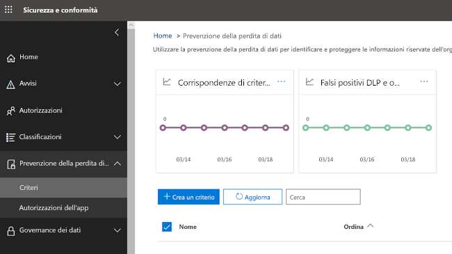
  
## Contenuto di un criterio DLPWhat a DLP policy contains

In un criterio DLP sono disponibili alcuni elementi di base:A DLP policy contains a few basic things:
  
- Posizione in cui proteggere il contenuto - **percorsi** quali Exchange Online, SharePoint Online e OneDrive per i siti.Where to protect the content - **locations** such as Exchange Online, SharePoint Online, and OneDrive for Business sites. 
    
- Quando e in che modo proteggere il contenuto, applicando **regole** composte da:When and how to protect the content by enforcing **rules** comprised of: 
    
  - **Condizioni** contenuto deve corrispondere perché viene applicata la regola, ad esempio, essere solo per il contenuto che contiene numeri di previdenza sociale condiviso con utenti esterni all'organizzazione.**Conditions** the content must match before the rule is enforced -- for example, look only for content containing Social Security numbers that's been shared with people outside your organization. 
    
  - **Azioni** che la regola deve effettuare automaticamente quando vengono rilevati contenuti corrispondenti alle condizioni: ad esempio, è possibile bloccare l'accesso al documento e inviare una notifica tramite posta elettronica sia all'utente che al responsabile della conformità.**Actions** that you want the rule to take automatically when content matching the conditions is found -- for example, block access to the document and send both the user and compliance officer an email notification. 
    
È possibile utilizzare una regola per soddisfare requisiti specifici di protezione specifici e quindi utilizzare un criterio DLP per raggruppare i requisiti di protezione comuni, ad esempio tutte le regole necessarie per rispettare una regolazione specifica.You can use a rule to meet a specific protection requirement, and then use a DLP policy to group together common protection requirements, such as all of the rules needed to comply with a specific regulation.
  
Ad esempio, potrebbe essere un criterio DLP che consente di rilevare la presenza di informazioni sono soggette all'Health Insurance Portability and Accountability Act (HIPAA). Questo criterio DLP può migliorare la protezione dei dati HIPAA (what) in tutti i siti di SharePoint Online e OneDrive tutti i siti di Business (where) mediante la ricerca di un documento contenente queste informazioni riservate che sono condiviso con persone esterne all'organizzazione (il condizioni) e quindi bloccare l'accesso al documento e inviare alcuna notifica (azioni). Questi requisiti vengono memorizzati come singole regole e raggruppati come un criterio DLP per semplificare la gestione e creazione di report.For example, you might have a DLP policy that helps you detect the presence of information subject to the Health Insurance Portability and Accountability Act (HIPAA). This DLP policy could help protect HIPAA data (the what) across all SharePoint Online sites and all OneDrive for Business sites (the where) by finding any document containing this sensitive information that's shared with people outside your organization (the conditions) and then blocking access to the document and sending a notification (the actions). These requirements are stored as individual rules and grouped together as a DLP policy to simplify management and reporting.
  
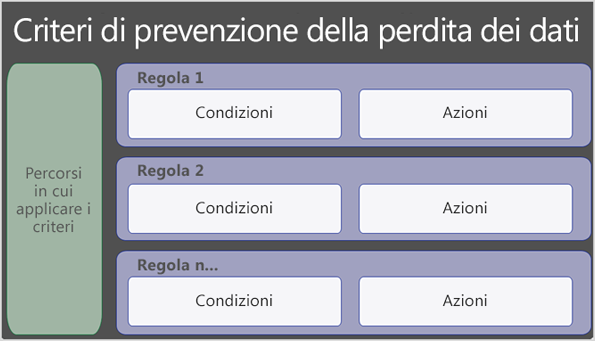
  
### PercorsiLocations

Un criterio DLP consente di trovare e proteggere le informazioni contenute in Office 365, se quest'ultimo si trova in Exchange Online, SharePoint Online o OneDrive for Business. È possibile scegliere di proteggere tutti i siti di SharePoint o gli account utilizzati per OneDrive appena specifici siti o gli account o tutte le cassette postali. Si noti che non è ancora possibile selezionare le cassette postali di utenti specifici.A DLP policy can find and protect sensitive information across Office 365, whether that information is located in Exchange Online, SharePoint Online, or OneDrive for Business. You can easily choose to protect all SharePoint sites or OneDrive accounts, just specific sites or accounts, or all mailboxes. Note that it's not yet possible to select just the mailboxes of specific users.
  
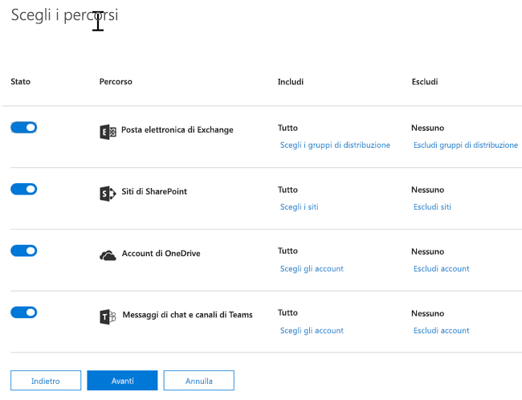
  
Si noti che se si sceglie di includere o escludere specifici siti di SharePoint o gli account OneDrive, un criterio DLP può contenere non più di 100 tali inclusioni ed esclusioni. Sebbene questo limite è presente, informazioni che è possibile superare questo limite applicando un criterio a livello di organizzazione o un criterio che si applica ai percorsi intero.Note that if you choose to include or exclude specific SharePoint sites or OneDrive accounts, a DLP policy can contain no more than 100 such inclusions and exclusions. Although this limit exists, understand that you can exceed this limit by applying either an org-wide policy or a policy that applies to entire locations.
  
### RegoleRules

Le regole sono quali applicare i requisiti aziendali contenuti dell'organizzazione. Un criterio contiene una o più regole e ogni regola è costituita da condizioni e azioni. Per ogni regola, quando si verificano le condizioni, le operazioni vengono eseguite automaticamente. Le regole vengono eseguite in modo sequenziale, inizia con la regola di priorità più alta in ogni criterio.Rules are what enforce your business requirements on your organization's content. A policy contains one or more rules, and each rule consists of conditions and actions. For each rule, when the conditions are met, the actions are taken automatically. Rules are executed sequentially, starting with the highest-priority rule in each policy.
  
Una regola sono inoltre disponibili opzioni per notificare agli utenti (con suggerimenti sui criteri e notifiche tramite posta elettronica) e gli amministratori (con i rapporti operazioni non consentite di posta elettronica) che contenuto con corrispondenza della regola.A rule also provides options to notify users (with policy tips and email notifications) and admins (with email incident reports) that content has matched the rule.
  
Ecco i componenti di una regola, ognuno illustrati di seguito.Here are the components of a rule, each explained below.
  
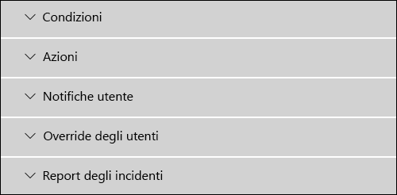
  
#### CondizioniConditions

Condizioni sono importanti perché determinano quali tipi di informazioni da cercare e quando si desidera creare un'azione. Ad esempio, si può scegliere di ignorare contenuto contenenti numeri di passaporto solo se il contenuto contiene più di 10 questi numeri e condivise con utenti esterni all'organizzazione.Conditions are important because they determine what types of information you're looking for, and when to take an action. For example, you might choose to ignore content containing passport numbers unless the content contains more than ten such numbers and is shared with people outside your organization.
  
Condizioni concentrano sui **contenuti**, ad esempio i tipi di informazioni riservate si sta cercando, nonché al **contesto**, ad esempio il documento che è condiviso con. È possibile utilizzare le condizioni per assegnare azioni diverse a diversi livelli di rischio -, ad esempio contenuti sensibili condivisi internamente potrebbero essere basso rischio e richiedono meno azioni rispetto contenuti sensibili condivisi con utenti esterni all'organizzazione.Conditions focus on the **content**, such as what types of sensitive information you're looking for, and also on the **context**, such as who the document is shared with. You can use conditions to assign different actions to different risk levels -- for example, sensitive content shared internally might be lower risk and require fewer actions than sensitive content shared with people outside the organization. 
  
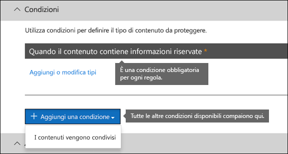
  
Le condizioni disponibili a questo punto consentono di determinare se:The conditions now available can determine if:
  
- Contenuto contiene un tipo di informazioni riservate.Content contains a type of sensitive information.
    
- Contenuto include un'etichetta. Per ulteriori informazioni, vedere la sezione di seguito [utilizzando un'etichetta come condizione in un criterio DLP](data-loss-prevention-policies.md#label).Content contains a label. For more information, see the below section [Using a label as a condition in a DLP policy](data-loss-prevention-policies.md#label).
    
- Il contenuto viene condiviso con utenti esterni o interni alla propria organizzazione.Content is shared with people outside or inside your organization.
    
#### Tipi di informazioni riservateTypes of sensitive information

Un criterio DLP consentono di proteggere le informazioni riservate, che viene definite come **tipo di informazioni sensibili**. Office 365 include le definizioni per molti tipi di informazioni riservate comuni in numerose aree geografiche diverse che si desidera utilizzare, ad esempio un numero di carta di credito, numeri conto bancario, numeri ID nazionali e numeri di passaporto.A DLP policy can help protect sensitive information, which is defined as a **sensitive information type**. Office 365 includes definitions for many common sensitive information types across many different regions that are ready for you to use, such as a credit card number, bank account numbers, national ID numbers, and passport numbers. 
  
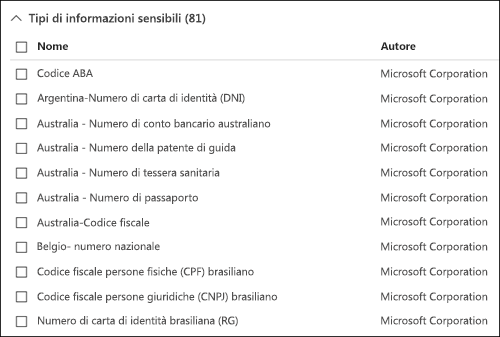
  
Quando un criterio DLP Cerca un tipo di informazioni riservate, ad esempio un numero di carta di credito, non semplicemente aspetto di un numero di 16 cifre. Ogni tipo di informazioni riservate viene definito e rilevato utilizzando una combinazione di:When a DLP policy looks for a sensitive information type such as a credit card number, it doesn't simply look for a 16-digit number. Each sensitive information type is defined and detected by using a combination of:
  
- Parole chiaveKeywords
    
- Funzioni interne relative a checksum di convalida o alla composizioneInternal functions to validate checksums or composition
    
- Valutazione delle espressioni ricorrenti al fine di individuare corrispondenze del motivoEvaluation of regular expressions to find pattern matches
    
- Valutazione di altri contenutiOther content examination
    
In questo modo il rilevamento DLP raggiungere un elevato grado di precisione riducendo il numero di falsi positivi che potrebbero interrompere l'ufficio di persone.This helps DLP detection achieve a high degree of accuracy while reducing the number of false positives that can interrupt peoples' work.
  
#### AzioniActions

Quando il contenuto soddisfa una condizione in una regola, è possibile applicare azioni per proteggere automaticamente il contenuto.When content matches a condition in a rule, you can apply actions to automatically protect the content.
  

  
Con le azioni disponibili a questo punto, è possibile:With the actions now available, you can:
  
- **Limitare l'accesso al contenuto** Per il contenuto del sito, ciò significa che le autorizzazioni per il documento sono riservate per tutti gli utenti ad eccezione di amministratore della raccolta siti principale, proprietario del documento e persona che ha modificato il documento. Queste persone consente di rimuovere le informazioni riservate dal documento o di eseguire altre azioni correttive. Quando il documento è in conformità, verranno ripristinate automaticamente le autorizzazioni originale. Quando viene bloccato l'accesso a un documento, con un'icona di suggerimento criteri speciali nella raccolta nel sito del documento.**Restrict access to the content** For site content, this means that permissions for the document are restricted for everyone except the primary site collection administrator, document owner, and person who last modified the document. These people can remove the sensitive information from the document or take other remedial action. When the document is in compliance, the original permissions will be automatically restored. When access to a document is blocked, the document appears with a special policy tip icon in the library on the site. 
    
    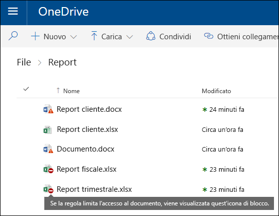
  
    Per il contenuto di posta elettronica, l'azione blocca il messaggio non verrà inviato. A seconda della configurazione di regole DLP, al mittente viene visualizzato un rapporto di mancato recapito o (se la regola utilizza una notifica) una notifica criteri suggerimento e/o di posta elettronica.For email content, this action blocks the message from being sent. Depending on how the DLP rule is configured, the sender will see an NDR or (if the rule uses a notification) a policy tip and/or email notification.
    
    
  
#### Notifiche utente e l'override dell'utenteUser notifications and user overrides

È possibile utilizzare le notifiche e ha la priorità per formare gli utenti sui criteri DLP e migliorare la rimanere Compatible senza il loro lavoro. Ad esempio, se un utente tenta di condividere un documento che contiene informazioni riservate, un criterio DLP può inviare loro una notifica tramite posta elettronica e mostrare loro un suggerimento criterio nel contesto della raccolta documenti che consente di ignorare il criterio, se dispongono di un'azienda giustificazione.You can use notifications and overrides to educate your users about DLP policies and help them remain compliant without blocking their work. For example, if a user tries to share a document containing sensitive information, a DLP policy can both send them an email notification and show them a policy tip in the context of the document library that allows them to override the policy if they have a business justification.
  
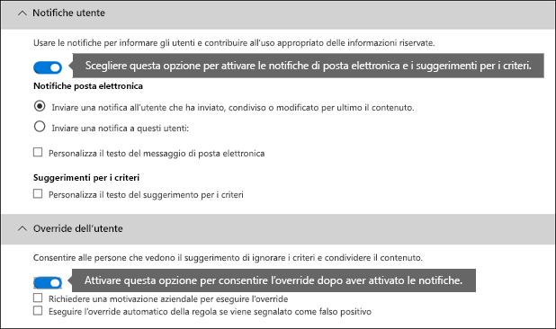
  
Messaggio di posta elettronica per notificare la persona che ha inviato, condivisi o dell'ultima modifica il contenuto e, per il contenuto del sito, l'amministratore della raccolta siti principale e dal proprietario del documento. Inoltre, è possibile aggiungere o rimuovere chiunque scegliere tra la notifica di posta elettronica.The email can notify the person who sent, shared, or last modified the content and, for site content, the primary site collection administrator and document owner. In addition, you can add or remove whomever you choose from the email notification.
  
Oltre a inviare una notifica tramite posta elettronica, una notifica all'utente verrà visualizzato un suggerimento criterio:In addition to sending an email notification, a user notification displays a policy tip:
  
- In Outlook 2013 e versioni successive e Microsoft Outlook sul web.In Outlook 2013 and later and Outlook on the web.
    
- Per il documento in SharePoint Online o un nuovo OneDrive per sito aziendale.For the document on a SharePoint Online or OneDrive for Business site.
    
- In Excel 2016, 2016 PowerPoint e Word 2016, quando il documento viene archiviato in un sito inclusi in un criterio DLP.In Excel 2016, PowerPoint 2016, and Word 2016, when the document is stored on a site included in a DLP policy.
    
La notifica tramite posta elettronica e un suggerimento per il criterio viene illustrato il motivo per cui è contenuto in conflitto con un criterio DLP. Se si sceglie il suggerimento messaggio di posta elettronica di notifica e criteri di possibile consentire agli utenti di modificare una regola di reporting un falso positivo o fornendo motivazione aziendale. Ciò consente di informare gli utenti sui criteri DLP e applicarle senza impedire agli utenti di svolgere il lavoro. Informazioni sulle sostituzioni e falsi positivi anche registrate per i report (vedere di seguito relative ai rapporti DLP) e incluso l'evento imprevisto segnala (sezione successiva), in modo che il responsabile della conformità regolarmente possono esaminare queste informazioni.The email notification and policy tip explain why content conflicts with a DLP policy. If you choose, the email notification and policy tip can allow users to override a rule by reporting a false positive or providing a business justification. This can help you educate users about your DLP policies and enforce them without preventing people from doing their work. Information about overrides and false positives is also logged for reporting (see below about the DLP reports) and included in the incident reports (next section), so that the compliance officer can regularly review this information.
  
Ecco un suggerimento criterio aspetto in un OneDrive per conto di Business.Here's what a policy tip looks like in a OneDrive for Business account.
  
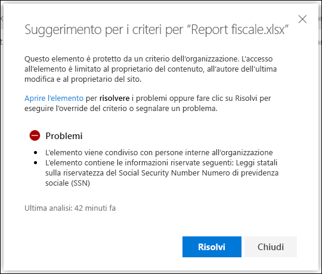
  
#### Rapporti operazioni non consentiteIncident reports

Quando viene soddisfatta una regola, è possibile inviare un rapporto operazioni non consentite per il responsabile della conformità (o le persone che si sceglie) con i dettagli dell'evento. In questo report include informazioni sull'elemento corrispondente, il contenuto effettivo che la regola e il nome della persona che ha modificato il contenuto corrispondente. Per i messaggi di posta elettronica, il report include anche come allegato il messaggio originale che corrisponde a un criterio DLP.When a rule is matched, you can send an incident report to your compliance officer (or any people you choose) with details of the event. This report includes information about the item that was matched, the actual content that matched the rule, and the name of the person who last modified the content. For email messages, the report also includes as an attachment the original message that matches a DLP policy.
  
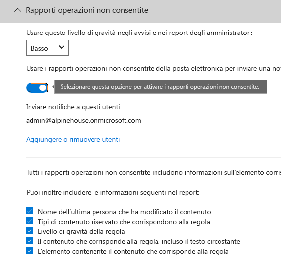
  
## Operatori logici e raggruppamentoGrouping and logical operators

Frequenza con cui il criterio DLP è un requisito semplice, ad esempio per identificare tutti i contenuti che includono un numero di previdenza sociale negli Stati Uniti. In altri scenari, tuttavia, il criterio DLP potrebbe essere necessario identificare dati definiti in modo più flessibile.Often your DLP policy has a straightforward requirement, such as to identify all content that contains a U.S. Social Security Number. However, in other scenarios, your DLP policy might need to identify more loosely defined data.
  
Ad esempio, per identificare contenuto soggetti a US Health Insurance Act (HIPAA), è necessario cercare:For example, to identify content subject to the U.S. Health Insurance Act (HIPAA), you need to look for:
  
- Contenuto con specifici tipi di informazioni riservate, ad esempio un numero di previdenza sociale negli Stati Uniti o un numero Drug imposizione Agency (DEA).Content that contains specific types of sensitive information, such as a U.S. Social Security Number or Drug Enforcement Agency (DEA) Number.
    
    EAND
    
- Il contenuto che è più difficile identificare, ad esempio communications su un paziente terapie o le descrizioni dei servizi medici resi disponibili. Che identifica questo contenuto, è necessario corrispondenti alle parole chiave da elenchi di grandi dimensioni parola chiave, ad esempio International classificazione di malattie (ICD-9-CM o ICD 10 CM).Content that's more difficult to identify, such as communications about a patient's care or descriptions of medical services provided. Identifying this content requires matching keywords from very large keyword lists, such as the International Classification of Diseases (ICD-9-CM or ICD-10-CM).
    
È possibile identificare con facilità tali dati definizione debole tramite operatori logici e raggruppamento (AND, OR). Quando si crea un criterio DLP, è possibile:You can easily identify such loosely defined data by using grouping and logical operators (AND, OR). When you create a DLP policy, you can:
  
- Raggruppare i tipi di informazioni riservate.Group sensitive information types.
    
- Selezionare l'operatore logico tra i tipi di informazioni sensibili all'interno di un gruppo e i gruppi di se stessi.Choose the logical operator between the sensitive information types within a group and between the groups themselves.
    
### La scelta dell'operatore all'interno di un gruppoChoosing the operator within a group

All'interno di un gruppo, è possibile scegliere se alcune o tutte le condizioni di tale gruppo devono essere soddisfatti per il contenuto per la corrispondenza della regola.Within a group, you can choose whether any or all of the conditions in that group must be satisfied for the content to match the rule.
  
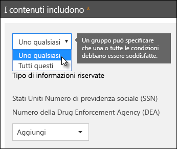
  
### Aggiunta di un gruppoAdding a group

È possibile aggiungere rapidamente un gruppo, che può includere le condizioni e operatore all'interno di tale gruppo.You can quickly add a group, which can have its own conditions and operator within that group.
  
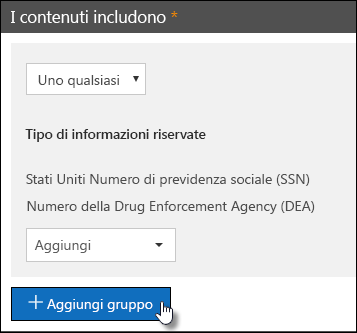
  
### La scelta dell'operatore tra i gruppiChoosing the operator between groups

Tra i gruppi, è possibile scegliere se devono essere soddisfatte le condizioni in un solo gruppo o tutti i gruppi per il contenuto per la corrispondenza della regola.Between groups, you can choose whether the conditions in just one group or all of the groups must be satisfied for the content to match the rule.
  
Ad esempio, criterio **Usa HIPAA** incorporato ha una regola che utilizza un operatore **AND** tra i gruppi in modo che identifichi contenuti che includono:For example, the built-in **U.S. HIPAA** policy has a rule that uses an **AND** operator between the groups so that it identifies content that contains: 
  
- dal gruppo di **Identificatori PII** (numero SSN almeno un numero **o** DEA)from the group **PII Identifiers** (at least one SSN number **OR** DEA number) 
    
    **E****AND**
    
- dal gruppo di **Termini medici** (almeno un ICD-9-CM **o** ICD-10 CM parola chiave)from the group **Medical Terms** (at least one ICD-9-CM keyword **OR** ICD-10-CM keyword) 
    
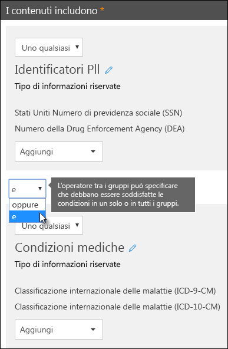
  
## La priorità da cui vengono elaborate le regoleThe priority by which rules are processed

Quando si creano regole in un criterio, ogni regola viene assegnata una priorità nell'ordine in cui viene creata, vale a dire, la regola creata prima ha la priorità più alta, la regola creata in secondo luogo ha priorità seconda e così via. Dopo aver creato una regola, non è possibile modificare la priorità ad eccezione di eliminazione e crearne uno nuovo.When you create rules in a policy, each rule is assigned a priority in the order in which it's created - meaning, the rule created first has first priority, the rule created second has second priority, and so on. After you create a rule, its priority can't be changed, except by deleting and re-creating it.
  
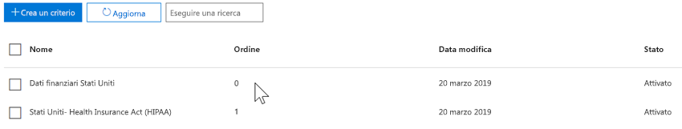
  
Quando il contenuto viene valutato rispetto alle regole, le regole vengono elaborate in ordine di priorità. Se il contenuto corrisponde a più regole, le regole vengono elaborate in ordine di priorità e viene applicata l'azione più restrittivo. Ad esempio, se corrisponde a quello contenuto di tutte le regole seguenti, regola 3 viene applicato in quanto è la priorità massima, più restrittivo regola:When content is evaluated against rules, the rules are processed in priority order. If content matches multiple rules, the rules are processed in priority order and the most restrictive action is enforced. For example, if content matches all of the following rules, Rule 3 is enforced because it's the highest priority, most restrictive rule:
  
- Regola 1: invia una notifica agli utentiRule 1: only notifies users
    
- Regola 2: invia una notifica agli utenti, limita l'accesso e consente l'override dell'utenteRule 2: notifies users, restricts access, and allows user overrides
    
- Regola 3: invia una notifica agli utenti, limita l'accesso e non consente l'override dell'utenteRule 3: notifies users, restricts access, and does not allow user overrides
    
- Regola 4: invia una notifica agli utentiRule 4: only notifies users
    
- Regola 5: consente di limitare l'accessoRule 5: restricts access
    
- Regola 6: invia una notifica agli utenti, limita l'accesso e non consente l'override dell'utenteRule 6: notifies users, restricts access, and does not allow user overrides
    
In questo esempio si noti che corrispondenze per tutte le regole vengono registrate nei registri di controllo e mostrate nei rapporti DLP, anche se viene applicata solo la regola più restrittiva.In this example, note that matches for all of the rules are recorded in the audit logs and shown in the DLP reports, even though only the most restrictive rule is enforced.
  
Per quanto riguarda suggerimenti sui criteri, tenere presente che:With respect to policy tips, note that:
  
- Solo il suggerimento criteri dalla priorità più alta, verrà visualizzato regola più restrittiva. Ad esempio, un suggerimento per il criterio da una regola che blocca l'accesso al contenuto verrà visualizzato su un suggerimento sul criterio da una regola che si limita a inviare una notifica. In questo modo si impedisce persone da visualizzare in una serie di suggerimenti sui criteri.Only the policy tip from the highest priority, most restrictive rule will be shown. For example, a policy tip from a rule that blocks access to content will be shown over a policy tip from a rule that simply sends a notification. This prevents people from seeing a cascade of policy tips.
    
- Se i suggerimenti per i criteri nella regola più restrittiva consentono all'utente di ignorare la regola, in questo modo vengono ignorate anche le altre regole per le quali è stata rilevata una corrispondenza del contenuto.If the policy tips in the most restrictive rule allow people to override the rule, then overriding this rule also overrides any other rules that the content matched.
    
## Ottimizzazione di regole per renderli più difficili da soddisfare o più sempliceTuning rules to make them easier or harder to match

Dopo persone creato e attivare i criteri DLP, sono a volte vengono eseguiti in questi problemi:After people create and turn on their DLP policies, they sometimes run into these issues:
  
- Quantità eccessiva di informazioni riservate **non** corrispondano alle regole - in altre parole, un numero eccessivo di falsi positivi il contenuto.Too much content that **is not** sensitive information matches the rules - in other words, too many false positives. 
    
- Troppo piccola contenuto che **è** informazioni riservate corrispondano alle regole, in altre parole, le operazioni di protezione non vengono applicate nel informazioni riservate.Too little content that **is** sensitive information matches the rules - in other words, the protective actions aren't being enforced on the sensitive information. 
    
Per risolvere questi problemi, è possibile ottimizzare le regole di modificando il conteggio delle istanze e accuratezza per rendere più difficile o più semplice per il contenuto da soddisfare le regole di corrispondenza. Ogni tipo di informazioni riservate utilizzato in una regola è un'istanza contare e corrispondere la precisione.To address these issues, you can tune your rules by adjusting the instance count and match accuracy to make it harder or easier for content to match the rules. Each sensitive information type used in a rule has both an instance count and match accuracy.
  
### Conteggio delle istanzeInstance count

Conteggio delle istanze significa semplicemente il numero di occorrenze di un tipo specifico di informazioni riservate devono essere presente per il contenuto per la corrispondenza della regola. Ad esempio, il contenuto verrà corrisponde la regola illustrata di seguito se tra 1 e 9 univoci negli Stati Uniti o Regno Unito vengono identificati i numeri di passaporto.Instance count means simply how many occurrences of a specific type of sensitive information must be present for content to match the rule. For example, content will match the rule shown below if between 1 and 9 unique U.S. or U.K. passport numbers are identified.
  
Si noti che il conteggio delle istanze include solo **univoco** corrispondenze per le parole chiave e tipi di informazioni riservate. Ad esempio, se un messaggio di posta elettronica contiene 10 occorrenze dello stesso numero di carta di credito, le 10 occorrenze contano come una singola istanza di un numero di carta di credito.Note that the instance count includes only **unique** matches for sensitive information types and keywords. For example, if an email contains 10 occurrences of the same credit card number, those 10 occurrences count as a single instance of a credit card number. 
  
Per utilizzare conteggio delle istanze per ottimizzare le regole, le indicazioni sono semplice:To use instance count to tune rules, the guidance is straightforward:
  
- Per facilitare la regola da soddisfare, diminuire il conteggio **min** e/o aumentare il numero **massimo** . È possibile anche impostare **max** a **qualsiasi** eliminando il valore numerico.To make the rule easier to match, decrease the **min** count and/or increase the **max** count. You can also set **max** to **any** by deleting the numerical value. 
    
- Per rendere più difficili da soddisfare la regola, aumentare il numero di **minuti** .To make the rule harder to match, increase the **min** count. 
    
In genere, si utilizzano azioni meno restrittive, ad esempio l'invio di notifiche per utente, in una regola con un numero inferiore di istanza (ad esempio, 1-9). È possibile utilizzare azioni più restrittive, ad esempio la limitazione dell'accesso al contenuto non sono consentite override dell'utente, in una regola con un conteggio delle istanze superiore (ad esempio, qualsiasi 10).Typically, you use less restrictive actions, such as sending user notifications, in a rule with a lower instance count (for example, 1-9). And you use more restrictive actions, such as restricting access to content without allowing user overrides, in a rule with a higher instance count (for example, 10-any).
  
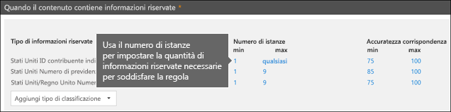
  
### Precisione di corrispondenzaMatch accuracy

Come descritto in precedenza, un tipo di informazioni riservate viene definito e rilevato mediante una combinazione di tipi diversi di prova. In genere, un tipo di informazioni riservate dipende dal più combinazioni simili, detti criteri. Un motivo che richiede meno prova con una precisione corrispondenza inferiore (o livello di probabilità), mentre un criterio che richiede che ulteriori prove con maggiore precisione di corrispondenza (o un livello di probabilità). Per ulteriori informazioni sui modelli effettivi e livelli di probabilità utilizzati da ogni tipo di informazioni riservate, vedere [cercare il quali i tipi di informazioni riservate](what-the-sensitive-information-types-look-for.md).As described above, a sensitive information type is defined and detected by using a combination of different types of evidence. Commonly, a sensitive information type is defined by multiple such combinations, called patterns. A pattern that requires less evidence has a lower match accuracy (or confidence level), while a pattern that requires more evidence has a higher match accuracy (or confidence level). To learn more about the actual patterns and confidence levels used by every sensitive information type, see [What the sensitive information types look for](what-the-sensitive-information-types-look-for.md).
  
Ad esempio, il tipo di informazioni riservate denominato numero di carta di credito viene definito da due motivi:For example, the sensitive information type named Credit Card Number is defined by two patterns:
  
- Un criterio con confidenza 65% che è necessario:A pattern with 65% confidence that requires:
    
  - Un numero in formato di un numero di carta di credito.A number in the format of a credit card number.
    
  - Numero che passa il valore di checksum.A number that passes the checksum.
    
- Un criterio con confidenza 85% che è necessario:A pattern with 85% confidence that requires:
    
  - Un numero in formato di un numero di carta di credito.A number in the format of a credit card number.
    
  - Numero che passa il valore di checksum.A number that passes the checksum.
    
  - Una parola chiave o una data di scadenza nel formato corretto.A keyword or an expiration date in the right format.
    
È possibile utilizzare tali probabilità livelli (o la precisione di corrispondenza) nelle regole. In genere, si utilizzano azioni meno restrittive, ad esempio l'invio di notifiche per utente, in una regola con una precisione di corrispondenza inferiore. È possibile utilizzare azioni più restrittive, ad esempio la limitazione dell'accesso al contenuto non sono consentite override dell'utente, in una regola con maggiore precisione di corrispondenza.You can use these confidence levels (or match accuracy) in your rules. Typically, you use less restrictive actions, such as sending user notifications, in a rule with lower match accuracy. And you use more restrictive actions, such as restricting access to content without allowing user overrides, in a rule with higher match accuracy.
  
È importante tenere presente che, quando un tipo specifico di informazioni riservate, ad esempio un numero di carta di credito, viene identificato nel contenuto, viene restituito solo un livello di probabilità singolo:It's important to understand that when a specific type of sensitive information, such as a credit card number, is identified in content, only a single confidence level is returned:
  
- Se tutte le corrispondenze per un singolo modello, viene restituito il livello di confidenza per questo motivo.If all of the matches are for a single pattern, the confidence level for that pattern is returned.
    
- Se non esistono corrispondenze per uno o più motivo (ad esempio, esistono corrispondenze con due livelli diversi confidenza), viene restituito un livello di probabilità superiore a tutti i modelli singolo soli. Questo è difficile. Ad esempio, per la carta di credito, se il 65% e 85% pattern sono soddisfatte, il livello di probabilità restituito per che tipo di informazioni riservate è superiore al 90% perché ulteriori prove significa più probabilità.If there are matches for more than one pattern (i.e., there are matches with two different confidence levels), a confidence level higher than any of the single patterns alone is returned. This is the tricky part. For example, for a credit card, if both the 65% and 85% patterns are matched, the confidence level returned for that sensitive information type is greater than 90% because more evidence means more confidence.
    
Pertanto se si desidera creare due regole si escludono a vicenda per la carta di credito, uno per la precisione di corrispondenza 65% e uno per la precisione di corrispondenza 85%, gli intervalli di corrispondenza accuratezza avrà il formato. La prima regola riprende solo i risultati del motivo il 65%. La seconda regola preleva genera una corrispondenza con **almeno una** corrispondenza 85% e **può includere di** altri inferiore confidenza.So if you want to create two mutually exclusive rules for credit cards, one for the 65% match accuracy and one for the 85% match accuracy, the ranges for match accuracy would look like this. The first rule picks up only matches of the 65% pattern. The second rule picks up matches with **at least one** 85% match and **can potentially have** other lower-confidence matches. 
  
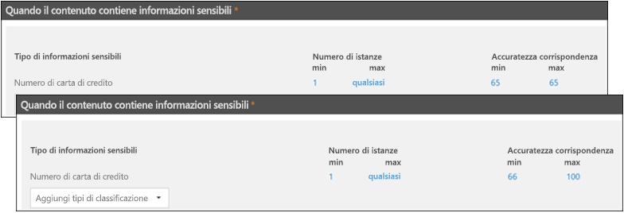
  
Per questi motivi, le indicazioni per la creazione di regole con corrispondenza diverso accuratezza sono la seguente:For these reasons, the guidance for creating rules with different match accuracies is:
  
- Il livello di probabilità di minimo in genere utilizza lo stesso valore per **le funzioni min** e **max** (non un intervallo).The lowest confidence level typically uses the same value for **min** and **max** (not a range). 
    
- In genere il più alto livello di probabilità è un intervallo da sopra il livello di probabilità di inferiore a 100.The highest confidence level is typically a range from just above the lower confidence level to 100.
    
- Tutti i livelli di probabilità intermedi in genere compreso tra sopra il livello di probabilità inferiore subito sotto il livello di probabilità di superiore.Any in-between confidence levels typically range from just above the lower confidence level to just below the higher confidence level.
    
## Uso di un'etichetta come condizione nei criteri di prevenzione della perdita dei datiUsing a label as a condition in a DLP policy

È possibile creare un'etichetta e quindi:You can create a label and then:
  
- **Pubblica** , in modo che gli utenti finali possono vedersi e applicare manualmente l'etichetta per il contenuto.**Publish** it, so that end users can see and manually apply the label to content. 
    
- **Applicare automaticamente** il contenuto che soddisfa le condizioni che si sceglie.**Auto-apply** it to content that matches the conditions that you choose. 
    
Per ulteriori informazioni sulle etichette, vedere [Panoramica delle etichette](labels.md).For more information about labels, see [Overview of labels](labels.md).
  
Dopo aver creato un'etichetta, quindi utilizzare tale etichetta come condizione nei criteri DLP. È possibile ad esempio, in quanto:After you create a label, you can then use that label as a condition in your DLP policies. For example, you might want to do this because:
  
- È stato pubblicato un'etichetta nome **riservato**in modo che gli utenti dell'organizzazione applicare manualmente l'etichetta a documenti e posta elettronica riservato. Utilizzando l'etichetta come condizione nel criterio DLP, è possibile limitare contenuto etichettato **riservato** da condiviso con persone esterne all'organizzazione.You published a label named **Confidential**, so that people in your organization can manually apply the label to confidential email and documents. By using this label as a condition in your DLP policy, you can restrict content labeled **Confidential** from being shared with people outside your organization. 
    
- Creato un'etichetta di **Neve accesso a terze parti** per un progetto il cui nome e quindi applicato automaticamente tale etichetta per il contenuto che contiene le parole chiave "Neve persone". Utilizzando l'etichetta come condizione nel criterio DLP, è possibile visualizzare un suggerimento criterio agli utenti finali quando si utilizzano per condividere il contenuto con una persona esterna all'organizzazione.You created a label named **Alpine House** for a project of that name, and then applied that label automatically to content containing the keywords "Alpine House". By using this label as a condition in your DLP policy, you can show a policy tip to end users when they're about to share this content with someone outside your organization. 
    
- È stato pubblicato un'etichetta denominata **record imposte**, in modo che il programma di gestione record applicare manualmente l'etichetta per il contenuto che deve essere classificato come record. Utilizzando l'etichetta come condizione nel criterio DLP, è possibile cercare del contenuto con etichetta in combinazione con altri tipi di informazioni riservate, ad esempio si o SSNs; applicare le azioni di protezione al contenuto etichettato **record imposte**. e ottenere rapporti dettagliati attività sul criterio DLP da rapporti DLP e i dati del Registro di controllo.You published a label named **Tax record**, so that your records manager can manually apply the label to content that needs to be classified as a record. By using this label as a condition in your DLP policy, you can look for content with this label in conjunction with other types of sensitive information such as ITINs or SSNs; apply protection actions to content labeled **Tax record**; and get detailed activity reports about the DLP policy from the DLP reports and audit log data. 
    
- È stato pubblicato un'etichetta chiamata **Team leader Executive - riservati** per l'account di OneDrive di un gruppo di dirigenti e cassette postali di Exchange. Utilizzando l'etichetta come condizione nel criterio DLP, è possibile applicare azioni eseguite sia conservazione e protezione per lo stesso sottoinsieme del contenuto e gli utenti.You published a label named **Executive Leadership Team - Sensitive** to the Exchange mailboxes and OneDrive accounts of a group of executives. By using this label as a condition in your DLP policy, you can enforce both retention and protection actions on the same subset of content and users. 
    
In base alle etichette come condizione nelle regole DLP, può è in modo selettivo applicare azioni di protezione su un set specifico di contenuto, le posizioni o gli utenti.By using labels as a condition in your DLP rules, can you selectively enforce protection actions on a specific set of content, locations, or users.
  

  
### La relazione tra questa funzionalità e altre caratteristicheHow this feature relates to other features

Diverse funzionalità può essere applicata al contenuto che contiene informazioni riservate:Several features can be applied to content containing sensitive information:
  
- Un' [etichetta di conservazione](labels.md#applying-a-retention-label-automatically-based-on-conditions)[applica un'etichetta automaticamente in base alle condizioni] e un [criterio di conservazione](retention-policies.md) può applicare entrambi azioni di **conservazione** del contenuto.A [retention label](labels.md#applying-a-retention-label-automatically-based-on-conditions)[Applying a label automatically based on conditions] and a [retention policy](retention-policies.md) can both enforce **retention** actions on this content. 
    
- Un criterio DLP può applicare azioni di **protezione** del contenuto. E prima applicate queste operazioni, un criterio DLP può richiedere altre condizioni per soddisfare oltre il contenuto che include un'etichetta.A DLP policy can enforce **protection** actions on this content. And before enforcing these actions, a DLP policy can require other conditions to be met in addition to the content containing a label. 
    
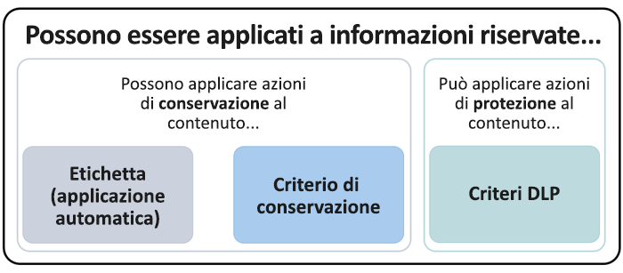
  
Si noti che un criterio DLP è una funzionalità di rilevamento più completa di un criterio di etichetta o conservazione applicato alle informazioni riservate. Un criterio DLP può applicare un'azione correttiva al contenuto che contiene informazioni riservate e se le informazioni riservate viene rimosso dal contenuto, le azioni di protezione vengono annullate il successivo periodo di che analizzare il contenuto. Ma se un criterio di conservazione o un'etichetta è stata applicata al contenuto che contiene informazioni riservate, che corrisponde a un'azione occasionale che non verrà annullata anche se rimuovere le informazioni riservate.Note that a DLP policy has a richer detection capability than a label or retention policy applied to sensitive information. A DLP policy can enforce protective actions on content containing sensitive information, and if the sensitive information is removed from the content, those protective actions are undone the next time the content's scanned. But if a retention policy or label is applied to content containing sensitive information, that's a one-time action that won't be undone even if the sensitive information's removed.
  
Utilizzando un'etichetta come condizione in un criterio DLP, è possibile applicare azioni di conservazione sia protezione nel contenuto con tale etichetta. È possibile paragonare contenuto che include un'etichetta del contenuto che contiene informazioni riservate - sia un'etichetta di un tipo di informazioni riservate sono proprietà utilizzati per classificare il contenuto, in modo che sia possibile applicare azioni eseguite su tale contenuto.By using a label as a condition in a DLP policy, you can enforce both retention and protection actions on content with that label. You can think of content containing a label exactly like content containing sensitive information - both a label and a sensitive information type are properties used to classify content, so that you can enforce actions on that content.
  
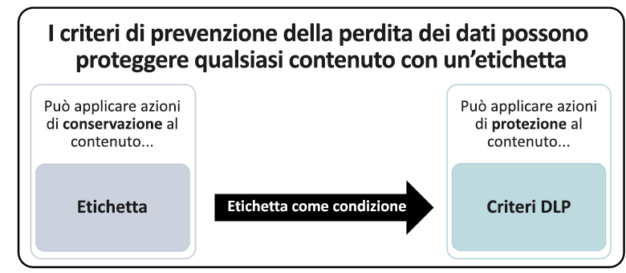
  
## Impostazioni Simple e le impostazioni avanzateSimple settings vs. advanced settings

Quando si crea un criterio DLP, l'utente dovrà scegliere tra le impostazioni simple o avanzate:When you create a DLP policy, you'll choose between simple or advanced settings:
  
- **Impostazioni Simple** rendono più semplice creare il tipo di criterio DLP più comune senza utilizzare l'editor delle regole per creare o modificare le regole.**Simple settings** make it easy to create the most common type of DLP policy without using the rule editor to create or modify rules. 
    
- **Impostazioni avanzate di** utilizzare l'editor regola per fornire il controllo completo su tutte le impostazioni per il criterio DLP.**Advanced settings** use the rule editor to give you complete control over every setting for your DLP policy. 
    
Non bisogna preoccuparsi, in modo non evidente, le impostazioni simple e le impostazioni avanzate funzionano esattamente, dall'applicazione di regole comprese le condizioni e azioni - solo con le impostazioni simple, non viene visualizzata l'editor regola. È un modo rapido per creare un criterio DLP.Don't worry, under the covers, simple settings and advanced settings work exactly the same, by enforcing rules comprised of conditions and actions -- only with simple settings, you don't see the rule editor. It's a quick way to create a DLP policy.
  
### Impostazioni SimpleSimple settings

Finora, lo scenario DLP più comune sta creando un criterio per proteggere il contenuto contenente le informazioni riservate dal condiviso con le persone all'esterno dell'organizzazione e intraprendere un'azione correttiva automatica, ad esempio se si restringe possono accedere al contenuto invio di notifiche amministratore o dell'utente finale e il controllo dell'evento per il controllo versioni successiva. Utenti utilizzare DLP per evitare involontaria divulgazione di informazioni riservate.By far, the most common DLP scenario is creating a policy to help protect content containing sensitive information from being shared with people outside your organization, and taking an automatic remedial action such as restricting who can access the content, sending end-user or admin notifications, and auditing the event for later investigation. People use DLP to help prevent the inadvertent disclosure of sensitive information.
  
Per semplificare il raggiungimento di questo obiettivo, quando si crea un criterio DLP, è possibile scegliere **le impostazioni di semplice utilizzo**. Queste impostazioni consentono di tutte le informazioni che necessarie per implementare il criterio DLP più comune, senza dover ricorrere nell'editor di regole.To simplify achieving this goal, when you create a DLP policy, you can choose **Use simple settings**. These settings provide everything you need to implement the most common DLP policy, without having to go into the rule editor.
  
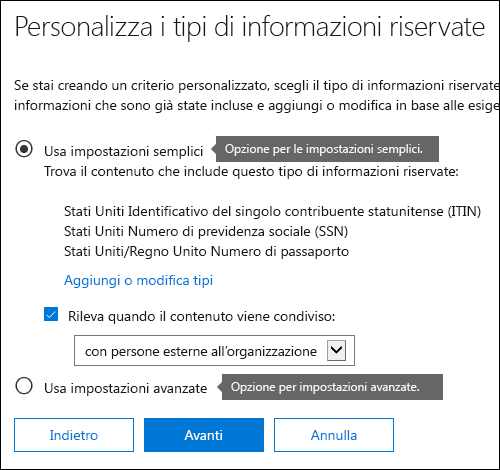
  
### Impostazioni avanzateAdvanced settings

Se è necessario creare più criteri DLP personalizzati, è possibile **utilizzare le impostazioni avanzate**.If you need to create more customized DLP policies, you can choose **Use advanced settings**.
  
Le impostazioni avanzate contiene l'editor regola, in cui si è controllo completo su tutte le possibili opzioni, tra cui il conteggio delle istanze e corrisponda accuratezza (livello di probabilità) per ogni regola.The advanced settings present you with the rule editor, where you have full control over every possible option, including the instance count and match accuracy (confidence level) for each rule.
  
Per passare rapidamente a una sezione, fare clic su un elemento nel riquadro di spostamento superiore dell'editor di regole per passare alla sezione riportata di seguito.To jump to a section quickly, click an item in the top navigation of the rule editor to go to that section below.
  

  
## Modelli di criteri DLPDLP policy templates

Il primo passaggio nella creazione di un criterio DLP è la scelta di informazioni per la protezione. Iniziando con un modello DLP si salva il lavoro di creazione di un nuovo set di regole da zero e capire quali tipi di informazioni devono essere inclusi per impostazione predefinita. È quindi possibile aggiungere o modificare questi requisiti per ottimizzare la regola per soddisfare esigenze specifiche dell'organizzazione.The first step in creating a DLP policy is choosing what information to protect. By starting with a DLP template, you save the work of building a new set of rules from scratch, and figuring out which types of information should be included by default. You can then add to or modify these requirements to fine tune the rule to meet your organization's specific requirements.
  
Un modello di criterio DLP preconfigurato consente di rilevare specifiche tipologie di informazioni riservate, ad esempio dati HIPAA, dati PCI-DSS, dati Gramm-Leach-Bliley Act o informazioni personali anche specifiche delle impostazioni locali (P.I.). Per rendere più semplice per trovare e la protezione dei tipi comuni di informazioni riservate, i modelli di criteri inclusi in Office 365 già contengono i tipi di informazioni riservate più comuni necessari per iniziare a.A preconfigured DLP policy template can help you detect specific types of sensitive information, such as HIPAA data, PCI-DSS data, Gramm-Leach-Bliley Act data, or even locale-specific personally identifiable information (P.I.). To make it easy for you to find and protect common types of sensitive information, the policy templates included in Office 365 already contain the most common sensitive information types necessary for you to get started.
  
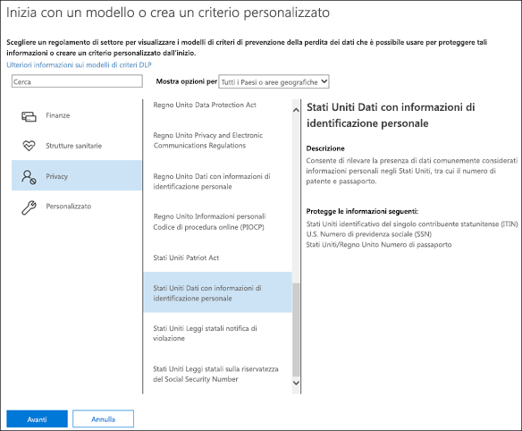
  
L'organizzazione può inoltre avere i proprio requisiti specifici, nel qual caso è possibile creare un criterio DLP da zero scegliendo l'opzione **criteri personalizzato** . Un criterio personalizzato è vuoto e non contiene predefinite regole.Your organization may also have its own specific requirements, in which case you can create a DLP policy from scratch by choosing the **Custom policy** option. A custom policy is empty and contains no premade rules. 
  
## Distribuzione graduale dei criteri DLP attraverso la modalità testRoll out DLP policies gradually with test mode

Quando si creano i criteri DLP, è consigliabile distribuire gradualmente per valutare l'impatto e testare l'efficacia prima di metterle. Ad esempio, non si desidera un nuovo criterio DLP inavvertitamente bloccare l'accesso a migliaia di documenti che gli utenti devono accedere per ottenere il loro lavoro.When you create your DLP policies, you should consider rolling them out gradually to assess their impact and test their effectiveness before fully enforcing them. For example, you don't want a new DLP policy to unintentionally block access to thousands of documents that people require access to in order to get their work done.
  
Se si sta creando criteri DLP con un impatto potenziale di grandi dimensioni, è consigliabile sequenza indicata di seguito:If you're creating DLP policies with a large potential impact, we recommend following this sequence:
  
1. Rapporti di **avvio in modalità test senza suggerimenti sui criteri** e quindi utilizzare il DLP e qualsiasi incidente indicato per valutare l'impatto. È possibile utilizzare rapporti DLP per visualizzare il percorso, tipo di gravità del corrispondenze di criteri e il numero. In base ai risultati, è possibile ottimizzare le regole in base alle esigenze. In modalità di test, i criteri DLP non influirà la produttività delle persone che lavorano nell'organizzazione.**Start in test mode without Policy Tips** and then use the DLP reports and any incident reports to assess the impact. You can use DLP reports to view the number, location, type, and severity of policy matches. Based on the results, you can fine tune the rules as needed. In test mode, DLP policies will not impact the productivity of people working in your organization. 
    
2. **Passare alla modalità di Test con le notifiche e suggerimenti sui criteri** in modo da iniziare a fornire agli utenti di criteri di conformità e prepararli per le regole che verranno applicate. In questa fase, è inoltre possibile chiedere agli utenti di segnalare falsi positivi in modo che è possibile perfezionare le regole.**Move to Test mode with notifications and Policy Tips** so that you can begin to teach users about your compliance policies and prepare them for the rules that are going to be applied. At this stage, you can also ask users to report false positives so that you can further refine the rules. 
    
3. **Avviare l'applicazione completa i criteri** in modo che le azioni nelle regole vengono applicate e il contenuto del protetto. Continuare a monitorare i report DLP e qualsiasi rapporti operazioni non consentite o le notifiche per assicurarsi che i risultati sono si prevede.**Start full enforcement on the policies** so that the actions in the rules are applied and the content's protected. Continue to monitor the DLP reports and any incident reports or notifications to make sure that the results are what you intend. 
    
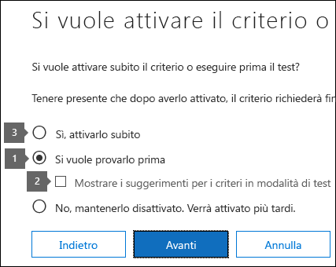
  
È possibile disattivare un criterio DLP in qualsiasi momento, che influisce su tutte le regole del criterio. Tuttavia, ogni regola può anche essere disattivata singolarmente da attivare e disattivare il relativo stato nell'editor di regole.You can turn off a DLP policy at any time, which affects all rules in the policy. However, each rule can also be turned off individually by toggling its status in the rule editor.
  
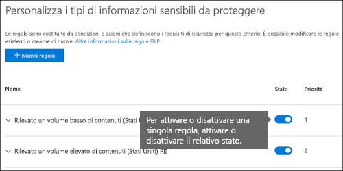
  
## Rapporti DLPDLP reports

Dopo aver creato e attivare i criteri DLP, è consigliabile verificare che si sta funzionino come previsto è e consentono di garantire la conformità. Rapporti DLP, è possibile visualizzare rapidamente il numero di criteri DLP e regola corrispondente nel tempo e il numero di falsi positivi e ha la precedenza. Per ogni report, è possibile filtrare le corrispondenze per ogni sede, l'intervallo di tempo e anche limitare la ricerca verso il basso per un criterio specifico, regola o azione.After you create and turn on your DLP policies, you'll want to verify that they're working as you intended and helping you stay compliant. With DLP reports, you can quickly view the number of DLP policy and rule matches over time, and the number of false positives and overrides. For each report, you can filter those matches by location, time frame, and even narrow it down to a specific policy, rule, or action.
  
Grazie ai report DLP, è possibile ottenere approfondimenti aziendali e:With the DLP reports, you can get business insights and:
  
- Concentrare l'attenzione su intervalli di tempo specifici e comprendere i motivi di eventuali impennate e tendenze.Focus on specific time periods and understand the reasons for spikes and trends.
    
- Individuare i processi aziendali che violano i criteri di conformità dell'organizzazione.Discover business processes that violate your organization's compliance policies.
    
- Comprendere l'eventuale impatto aziendale dei criteri DLP.Understand any business impact of the DLP policies.
    
Inoltre, è possibile utilizzare i report DLP per ottimizzare i criteri DLP, quando vengono eseguiti.In addition, you can use the DLP reports to fine tune your DLP policies as you run them.
  
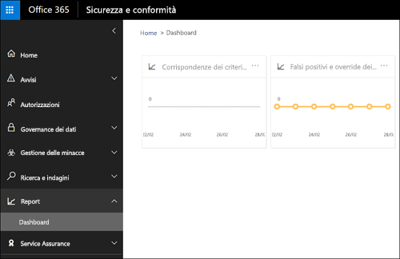
  
## Funzionamento dei criteri DLPHow DLP policies work

DLP permette di rilevare le informazioni riservate tramite un'analisi approfondita dei contenuti (non solo una semplice analisi del testo). Questa analisi approfondita utilizza corrispondenze delle parole chiave, del dizionario, la valutazione di espressioni regolari, funzioni interne e di altri metodi al fine di rilevare i contenuti corrispondenti ai criteri DLP. Viene considerata riservata potenzialmente solo una piccola percentuale dei dati. Un criterio DLP consente di identificare, monitorare e proteggere automaticamente solo tali dati, senza influire in alcun modo sul lavoro degli utenti con il resto del contenuto.DLP detects sensitive information by using deep content analysis (not just a simple text scan). This deep content analysis uses keyword matches, dictionary matches, the evaluation of regular expressions, internal functions, and other methods to detect content that matches your DLP policies. Potentially only a small percentage of your data is considered sensitive. A DLP policy can identify, monitor, and automatically protect just that data, without impeding or affecting people who work with the rest of your content.
  
### I criteri sono sincronizzatiPolicies are synced

Dopo aver creato un criterio DLP per la protezione &amp; centro conformità, abbia archiviati in un archivio centrale dei criteri e quindi sincronizzati con le origini di contenuto diversi, tra cui:After you create a DLP policy in the Security &amp; Compliance Center, it's stored in a central policy store, and then synced to the various content sources, including:
  
- Exchange Online e da caso Outlook sul web e Outlook 2013 e versioni successiveExchange Online, and from there to Outlook on the web and Outlook 2013 and later
    
- Siti OneDrive for BusinessOneDrive for Business sites
    
- Siti SharePoint OnlineSharePoint Online sites
    
- Programmi desktop di Office 2016 (Excel 2016, PowerPoint 2016 e Word 2016)Office 2016 desktop programs (Excel 2016, PowerPoint 2016, and Word 2016)
    
Dopo che il criterio del sincronizzati alle posizioni corrette, viene avviata la valutazione di contenuto e applicare azioni.After the policy's synced to the right locations, it starts to evaluate content and enforce actions.
  
### Valutazione dei criteri nei siti OneDrive for Business e SharePoint OnlinePolicy evaluation in OneDrive for Business and SharePoint Online sites

In tutti i siti di SharePoint Online e OneDrive per i siti, documenti cambiano continuamente, ovvero vengono continuamente vengono creati, modificati, condivise e così via. Ciò significa documenti sono in conflitto o essere conformi ai criteri DLP in qualsiasi momento. Ad esempio, un utente può caricare un documento che non contiene informazioni riservate a loro sito del team, ma in seguito, un'altra persona può modificare lo stesso documento e aggiungervi informazioni riservate.Across all of your SharePoint Online sites and OneDrive for Business sites, documents are constantly changing — they're continually being created, edited, shared, and so on. This means documents can conflict or become compliant with a DLP policy at any time. For example, a person can upload a document that contains no sensitive information to their team site, but later, a different person can edit the same document and add sensitive information to it.
  
Per questo motivo, i criteri DLP consentono di verificare la corrispondenza dei documenti ai criteri in background frequentemente. Tale operazione può essere considerata come una valutazione asincrona del criterio.For this reason, DLP policies check documents for policy matches frequently in the background. You can think of this as asynchronous policy evaluation.
  
Ecco come funziona. Come utenti aggiungere o modificare documenti nei siti, il motore di ricerca analizza il contenuto, in modo che è possibile cercare lo più avanti. In questo corso, il contenuto analizzate anche per le informazioni riservate e per controllare se è condivisa. Informazioni riservate che si trova viene archiviate in modo sicuro nell'indice di ricerca, in modo che può accedere solo al team di conformità, ma gli utenti non tipici. Ogni criterio DLP che è attivato l'esecuzione in background (modalità asincrona), verifica frequentemente per qualsiasi contenuto corrispondente a un criterio di ricerca e l'applicazione di azioni per proteggerlo dal perdite involontarie.Here's how it works. As people add or change documents in their sites, the search engine scans the content, so that you can search for it later. While this is happening, the content's also scanned for sensitive information and to check if it's shared. Any sensitive information that's found is stored securely in the search index, so that only the compliance team can access it, but not typical users. Each DLP policy that you've turned on runs in the background (asynchronously), checking search frequently for any content that matches a policy, and applying actions to protect it from inadvertent leaks.
  
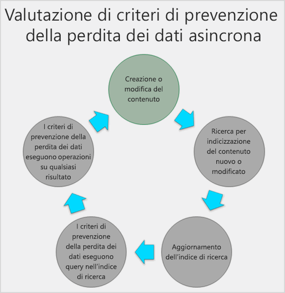
  
Infine, i documenti possono essere in conflitto con un criterio DLP ma possono anche diventare conformi a tale criterio. Ad esempio, se una persona aggiunge numeri di carta di credito a un documento, è possibile che un criterio DLP blocchi l'accesso a tale documento automaticamente. Tuttavia, se in un secondo momento l'utente elimina le informazioni riservate, l'azione (in questo caso, di blocco) viene automaticamente annullata durante la successiva valutazione del documento rispetto al criterio.Finally, documents can conflict with a DLP policy, but they can also become compliant with a DLP policy. For example, if a person adds credit card numbers to a document, it might cause a DLP policy to block access to the document automatically. But if the person later removes the sensitive information, the action (in this case, blocking) is automatically undone the next time the document is evaluated against the policy.
  
DLP restituisce qualsiasi contenuto che può essere indicizzato. Per ulteriori informazioni su quali tipi di file la ricerca per indicizzazione per impostazione predefinita, vedere [estensioni di file a ricerca per indicizzazione e tipi di file in SharePoint Server 2013 analizzati predefiniti](https://go.microsoft.com/fwlink/p/?LinkID=627430).DLP evaluates any content that can be indexed. For more information on what file types are crawled by default, see [Default crawled file name extensions and parsed file types in SharePoint Server 2013](https://go.microsoft.com/fwlink/p/?LinkID=627430).
  
### Valutazione dei criteri in Exchange Online, Outlook 2013 e versioni successive e Microsoft Outlook sul webPolicy evaluation in Exchange Online, Outlook 2013 and later, and Outlook on the web

Quando si crea un criterio DLP che include Exchange Online come un percorso, il criterio del sincronizzato da Office 365 Security &amp; centro conformità Exchange Online e quindi da Exchange Online per Outlook sul web e Outlook 2013 e versioni successive.When you create a DLP policy that includes Exchange Online as a location, the policy's synced from the Office 365 Security &amp; Compliance Center to Exchange Online, and then from Exchange Online to Outlook on the web and Outlook 2013 and later.
  
Quando viene viene composto un messaggio di Outlook, l'utente può vedere Suggerimenti sui criteri come il contenuto che si sta creando viene valutato criteri DLP. E dopo l'invio di un messaggio viene valutata criteri DLP come una normale parte del flusso di posta, insieme ai criteri DLP creati nell'interfaccia di amministrazione di Exchange e le regole di trasporto di Exchange (vedere la sezione successiva per ulteriori informazioni sulla). Analisi dei criteri DLP messaggio e degli allegati.When a message is being composed in Outlook, the user can see policy tips as the content being created is evaluated against DLP policies. And after a message is sent, it's evaluated against DLP policies as a normal part of mail flow, along with Exchange transport rules and DLP policies created in the Exchange Admin Center (see the next section for more info). DLP policies scan both the message and any attachments.
  
### Valutazione dei criteri nei programmi desktop di Office 2016Policy evaluation in the Office 2016 desktop programs

Excel 2016, 2016 PowerPoint e Word 2016 includono le stesse funzionalità per identificare le informazioni riservate e applicare i criteri DLP come SharePoint Online e OneDrive for Business. Questi programmi Office 2016 sincronizzare i criteri DLP direttamente dall'archivio centrale dei criteri e quindi valutano continuamente il contenuto in base a criteri DLP quando gli utenti utilizzano i documenti aperti da un sito in cui è incluso in un criterio DLP.Excel 2016, PowerPoint 2016, and Word 2016 include the same capability to identify sensitive information and apply DLP policies as SharePoint Online and OneDrive for Business. These Office 2016 programs sync their DLP policies directly from the central policy store, and then continuously evaluate the content against the DLP policies when people work with documents opened from a site that's included in a DLP policy.
  
La valutazione dei criteri DLP nel 2016 Office non è progettata per influire sulle prestazioni dei programmi o la produttività delle persone che lavorano sul contenuto. Se si sta lavorando su documenti di grandi dimensioni o nel computer dell'utente è occupato, potrebbe richiedere qualche secondo per un suggerimento criterio venga visualizzata.DLP policy evaluation in Office 2016 is designed not to affect the performance of the programs or the productivity of people working on content. If they're working on a large document, or the user's computer is busy, it might take a few seconds for a policy tip to appear.
  
## AutorizzazioniPermissions

Membri del team di conformità che verranno creati criteri DLP devono delle autorizzazioni per la protezione &amp; centro conformità. Per impostazione predefinita, l'amministratore tenant potranno accedere a questa posizione e possono assegnare responsabili della conformità e altri utenti l'accesso alla protezione &amp; centro conformità, senza fornire tutte le autorizzazioni di un amministratore tenant. A tale scopo, è consigliabile è:Members of your compliance team who will create DLP policies need permissions to the Security &amp; Compliance Center. By default, your tenant admin will have access to this location and can give compliance officers and other people access to the Security &amp; Compliance Center, without giving them all of the permissions of a tenant admin. To do this, we recommend that you:
  
1. Creare un gruppo in Office 365 e aggiungervi i responsabili della conformità.Create a group in Office 365 and add compliance officers to it.
    
2. Creare un gruppo di ruoli nella pagina **autorizzazioni** di sicurezza &amp; centro conformità.Create a role group on the **Permissions** page of the Security &amp; Compliance Center. 
    
3. Aggiungere il gruppo di Office 365 al gruppo di ruoli creato.Add the Office 365 group to the role group.
    
Per ulteriori informazioni, vedere [Give users access to the Office 365 Compliance Center](grant-access-to-the-security-and-compliance-center.md).For more information, see [Give users access to the Office 365 Compliance Center](grant-access-to-the-security-and-compliance-center.md).
  
Queste autorizzazioni sono necessarie solo per la creazione e l'applicazione di un criterio DLP. L'applicazione di un criterio non richiede l'accesso ai contenuti.These permissions are required only to create and apply a DLP policy. Policy enforcement does not require access to the content.
  
## Trovare i cmdlet DLPFind the DLP cmdlets

Utilizzare la maggior parte dei cmdlet per la sicurezza &amp; centro conformità, è necessario:To use most of the cmdlets for the Security &amp; Compliance Center, you need to:
  
1. [Connettersi al Centro sicurezza e conformità Office 365 utilizzando sessione remota di PowerShell](http://go.microsoft.com/fwlink/?LinkID=799771&amp;clcid=0x409).[Connect to the Office 365 Security &amp; Compliance Center using remote PowerShell](http://go.microsoft.com/fwlink/?LinkID=799771&amp;clcid=0x409)
    
2. Utilizzare una qualsiasi delle domande [protezione di Office 365 &amp; cmdlet centro conformità](http://go.microsoft.com/fwlink/?LinkID=799772&amp;clcid=0x409)Use any of these [Office 365 Security &amp; Compliance Center cmdlets](http://go.microsoft.com/fwlink/?LinkID=799772&amp;clcid=0x409)
    
Tuttavia, rapporti DLP necessario estrarre dati da tra Office 365, inclusi Exchange Online. Per questo motivo, i cmdlet per i rapporti DLP sono disponibili in Exchange Online Powershell, non in sicurezza &amp; Powershell centro conformità. Pertanto, per utilizzare i cmdlet per i rapporti DLP, è necessario:However, DLP reports need pull data from across Office 365, including Exchange Online. For this reason, the cmdlets for the DLP reports are available in Exchange Online Powershell -- not in Security &amp; Compliance Center Powershell. Therefore, to use the cmdlets for the DLP reports, you need to:
  
1. [Connettersi a Exchange Online usando una sessione remota di PowerShellConnect to Exchange Online using remote PowerShell](http://go.microsoft.com/fwlink/?LinkID=799773&amp;clcid=0x409)
    
2. Utilizzare uno di questi cmdlet per i rapporti DLP:Use any of these cmdlets for the DLP reports:
    
  - [Get-DlpDetectionsReportGet-DlpDetectionsReport](http://go.microsoft.com/fwlink/?LinkID=799774&amp;clcid=0x409)
    
  - [Get-DlpDetailReportGet-DlpDetailReport](http://go.microsoft.com/fwlink/?LinkID=799775&amp;clcid=0x409)
    
## Altre informazioniMore information

- [Creare un criterio di prevenzione della perdita dei dati da un modelloCreate a DLP policy from a template](create-a-dlp-policy-from-a-template.md)
    
- [Inviare notifiche e visualizzare i suggerimenti per i criteri DLPSend notifications and show policy tips for DLP policies](use-notifications-and-policy-tips.md)
    
- [Creare un criterio di prevenzione della perdita dei dati per proteggere i documenti con FCI o altre proprietàCreate a DLP policy to protect documents with FCI or other properties](protect-documents-that-have-fci-or-other-properties.md)
    
- [Elementi inclusi nei modelli di criteri di prevenzione della perdita dei datiWhat the DLP policy templates include](what-the-dlp-policy-templates-include.md)
    
- [Cosa individuano le tipologie di informazioni sensibiliWhat the sensitive information types look for](what-the-sensitive-information-types-look-for.md)
    
- [Cosa individuano le funzioni di prevenzione della perdita dei datiWhat the DLP functions look for](what-the-dlp-functions-look-for.md)
    
- [Creare una tipologia personalizzata di informazioni sensibiliCreate a custom sensitive information type](create-a-custom-sensitive-information-type.md)
    

