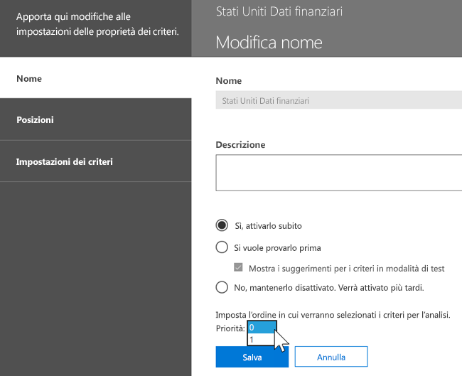
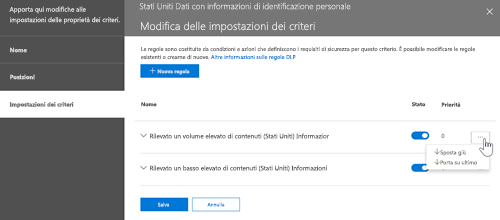

# Panoramica sulla prevenzione della perdita dei dati
<!-- this topic needs to be split into smaller, more coherent ones. It is confusing as it is. -->
> [!NOTE]
> Le funzionalità di prevenzione della perdita dei dati sono state aggiunte di recente ai messaggi di chat e canali di Microsoft Teams per gli utenti con licenza di Office 365 Advanced Compliance, che è disponibile come opzione indipendente e incluso in Office 365 E5 e Microsoft 365 E5 Compliance. Per altre informazioni sui requisiti di licenza, vedere [Linee guida per le licenze dei servizi a livello di tenant di Microsoft 365](https://docs.microsoft.com/office365/servicedescriptions/microsoft-365-service-descriptions/microsoft-365-tenantlevel-services-licensing-guidance).

Per ottenere la conformità agli standard aziendali e alle normative di settore, le organizzazioni devono proteggere le informazioni riservate e impedirne la divulgazione accidentale. Le informazioni riservate possono essere dati finanziari o informazioni di identificazione personale (PII) come numeri di carta di credito, codici fiscali o cartelle cliniche. I criteri di prevenzione della perdita dei dati del Centro sicurezza e conformità di Office 365 permettono di identificare, monitorare e proteggere automaticamente le informazioni riservate in tutto Office 365.
  
Con i criteri di prevenzione della perdita dei dati è possibile:
  
- **Identificare le informazioni riservate in numerose posizioni, ad esempio Exchange Online, SharePoint Online e OneDrive for Business e Microsoft Teams.**
    
    Ad esempio, è possibile identificare tutti i documenti che includono un numero di carta di credito archiviato in un sito OneDrive for Business; in alternativa, è possibile monitorare solo i siti OneDrive di utenti specifici.
    
- **Prevenire la condivisione accidentale di informazioni riservate**. 
    
    È ad esempio possibile identificare i documenti o i messaggi di posta elettronica contenenti dati sanitari condivisi con persone esterne all'organizzazione e quindi bloccarne l'accesso oppure bloccare l'invio del messaggio.
    
- **Monitorare e proteggere le informazioni riservate nelle versioni desktop di Excel, PowerPoint e Word.**
    
    Analogamente a Exchange Online, SharePoint Online e OneDrive for Business, questi programmi desktop di Office dispongono delle stesse caratteristiche per identificare le informazioni riservate e applicare i criteri di prevenzione della perdita dei dati. La prevenzione della perdita dei dati fornisce un monitoraggio continuo quando gli utenti condividono contenuti in questi programmi di Office.
    
- **Informare gli utenti su come garantire la conformità senza interrompere il flusso di lavoro.**
    
    È possibile informare gli utenti sui criteri di prevenzione della perdita dei dati e aiutarli a rimanere conformi senza comprometterne la produttività. Se ad esempio un utente prova a condividere un documento contenente informazioni riservate, è possibile inviargli una notifica tramite posta elettronica e mostrargli un suggerimento per i criteri nel contesto della raccolta documenti, che gli consente di ignorare i criteri se giustificato da motivi aziendali. Gli stessi suggerimenti per i criteri vengono visualizzati anche in Outlook sul web, Outlook, Excel, PowerPoint e Word.
    
- **Visualizzare report che indicano i contenuti corrispondenti ai criteri di prevenzione della perdita dei dati dell'organizzazione.**
    
    Per valutare se l'organizzazione è conforme ai criteri di prevenzione della perdita dei dati, è possibile contare il numero di corrispondenze con criteri e regole nel corso del tempo. Se esistono criteri di prevenzione della perdita dei dati che consentono agli utenti di eseguire l'override di un suggerimento per i criteri e segnalare un falso positivo, si può anche visualizzare il contenuto della segnalazione.
    
È possibile creare e gestire i criteri di prevenzione della perdita dei dati nella pagina Prevenzione della perdita di dati nel Centro conformità e sicurezza di Office 365.
  

  
## Contenuto di un criterio DLP

In un criterio DLP sono disponibili alcuni elementi di base:
  
- Dove proteggere il contenuto: **Posizioni** come ad esempio siti di Exchange Online, SharePoint Online e OneDrive for Business, ma anche messaggi di chat e canali di Microsoft Teams. 
    
- Quando e come proteggere il contenuto applicando **regole** costituite da: 
    
  - **Condizioni** che il contenuto deve soddifsfare prima che venga applicata la regola. Ad esempio, una regola potrebbe essere configurata in modo da cercare solo contenuti che includono numeri di codice fiscale condivisi con persone esterne all'organizzazione. 
    
  - **Azioni** che devono essere eseguite automaticamente dalla regola quando viene trovato il contenuto che soddisfa le condizioni. Ad esempio, una regola potrebbe essere configurata in modo da bloccare l'accesso a un documento e inviare una notifica tramite posta elettronica sia all'utente che al responsabile della conformità. 
    
È possibile usare una regola per rispettare uno specifico requisito di protezione e quindi usare i criteri di prevenzione della perdita dei dati per raggruppare i requisiti comuni, ad esempio tutte le regole necessarie per la conformità a una specifica normativa.
  
È possibile che si disponga di un criterio DLP che consente di rilevare la presenza di informazioni soggette ai moduli di conformità Health Insurance Portability and Accountability Act (HIPAA). Questo criterio di prevenzione della perdita dei dati consente di proteggere i dati HIPAA (il cosa) in tutti i siti di SharePoint Online e in tutti quelli di OneDrive for Business (il dove) rilevando i documenti che contengono informazioni riservate condivise con utenti esterni all'organizzazione (le condizioni), bloccando quindi l'accesso a tali documenti e inviando una notifica (le azioni). Questi requisiti vengono archiviati come singole regole e raggruppati come criteri di prevenzione della perdita dei dati per semplificare la gestione e la creazione di report.
  

  
### Posizioni

I criteri di prevenzione della perdita dei dati consentono di trovare e proteggere le informazioni riservate in tutto Office 365, indipendentemente dal fatto che si trovino in un sito di Exchange Online, SharePoint Online, OneDrive for Business o Microsoft Teams. È possibile scegliere di proteggere il contenuto in un messaggio di posta elettronica di Exchange, nei messaggi delle chat e dei canali di Microsoft Teams e in tutte le raccolte di SharePoint o OneDrive o di selezionare percorsi specifici per i criteri.
  

  
Se si sceglie di includere o escludere specifici siti di SharePoint o account di OneDrive, i criteri di prevenzione della perdita dei dati possono contenere non più di 100 inclusioni ed esclusioni di questo tipo. Anche se questi limiti esistono, è importante sapere che possono essere superati applicando criteri a livello di organizzazione o validi per intere posizioni.
  
### Regole

Le regole costituiscono gli elementi che consentono di applicare i requisiti aziendali al contenuto dell'organizzazione. Un criterio include una o più regole e ciascuna di queste è composta da condizioni e azioni. Per ogni regola, le azioni vengono eseguite automaticamente, non appena vengono soddisfatte le condizioni. Le regole vengono eseguite in modo sequenziale, iniziando con quella più prioritaria in ogni criterio.
  
Una regola contiene anche opzioni per informare gli utenti (con suggerimenti per i criteri e notifiche tramite posta elettronica) e gli amministratori (con report sugli eventi tramite posta elettronica) che per il contenuto è stata individuata una corrispondenza alla regola.
  
Ecco i componenti di una regola, spiegati di seguito.
  

  
#### Condizioni

Le condizioni sono importanti perché determinano i tipi di informazioni desiderati e il momento in cui eseguire un'azione. Ad esempio, si può scegliere di ignorare i contenuti che includono numeri di passaporto, nel caso in cui il contenuto contenga oltre 10 di questi numeri e sia condiviso con utenti esterni all'organizzazione.
  
Le condizioni si focalizzano sul **contenuto**, come i tipi di informazioni riservate desiderati, e sul **contesto**, come l'utente con cui viene condiviso il documento. È possibile usare le condizioni per assegnare azioni diverse a livelli di rischio diversi. Ad esempio, i contenuti riservati condivisi all'interno dell'organizzazione potrebbero essere caratterizzati da un livello di rischio inferiore rispetto ai contenuti riservati condivisi con utenti esterni all'organizzazione. 
  

  
Le condizioni disponibili a questo punto consentono di determinare se:
  
- Il contenuto include un tipo di informazioni riservate.
    
- Il contenuto include un'etichetta. Per altre informazioni, vedere la sezione seguente [Uso di un'etichetta come condizione nei criteri di prevenzione della perdita dei dati](#using-a-label-as-a-condition-in-a-dlp-policy).
    
- Il contenuto viene condiviso con utenti esterni o interni all’organizzazione.
    
#### Tipi di informazioni riservate

I criteri di prevenzione della perdita dei dati aiutano a proteggere le informazioni riservate definite come **tipo di informazioni riservate**. Office 365 include le definizioni pronte per l'uso di molti tipi comuni di informazioni riservate in diverse aree geografiche, ad esempio numeri di carta di credito, di conto corrente bancario, di carta di identità e di passaporto. 
  

  
Quando un criterio di prevenzione della perdita dei dati cerca un tipo di informazione riservata (ad esempio un numero di carta di credito), non effettua soltanto la ricerca di un codice a 16 cifre. Ogni tipo di informazioni riservate viene definito e rilevato utilizzando una combinazione dei seguenti elementi:
  
- Parole chiave
    
- 	Funzioni interne per convalidare i chesksum o la composizione
    
- Valutazione di espressioni regolari per trovare corrispondenze di schemi
    
- Valutazione di altri contenuti
    
In questo modo, il rilevamento di prevenzione della perdita dei dati raggiunge un livello superiore di accuratezza riducendo il numero di falsi positivi che possono interrompere il lavoro degli utenti.
  
#### Azioni

Quando un contenuto corrisponde a una condizione di una regola, è possibile applicare le azioni per proteggere automaticamente il contenuto.
  

  
Con le azioni ora disponibili è possibile:
  
- **Limitare l'accesso al contenuto** Per i contenuti dei siti, ciò significa che le autorizzazioni per il documento sono limitate per tutti tranne che per l'amministratore della raccolta siti principale, il proprietario del documento e la persona che lo ha modificato per ultima. Queste persone possono rimuovere le informazioni riservate dal documento o eseguire altri azioni correttive. Quando il documento è conforme, vengono automaticamente ripristinate le autorizzazioni originali. Se l'accesso è bloccato, il documento viene visualizzato con una speciale icona di suggerimento per i criteri nella raccolta del sito. 
    
    
  
    Per il contenuto dei messaggi di posta elettronica, questa azione blocca l'invio del messaggio. In base alla configurazione della regola di prevenzione della perdita dei dati, il mittente vedrà un rapporto di mancato recapito oppure, se la regola usa una notifica, un suggerimento per i criteri e/o una notifica tramite posta elettronica.
    
    
  
#### Notifiche utente e criteri ignorati dall’utente

Grazie alle notifiche e ai criteri ignorati è possibile informare gli utenti sui criteri di prevenzione della perdita dei dati e aiutarli a rimanere conformi senza compromettere la loro produttività. Se ad esempio un utente prova a condividere un documento contenente informazioni riservate, è possibile inviargli una notifica tramite posta elettronica e mostrargli un suggerimento per i criteri nel contesto della raccolta documenti, che gli consente di ignorare i criteri se giustificato da motivi aziendali.
  

  
Il messaggio di posta elettronica può informare l'utente che ha inviato, condiviso o modificato per ultimo il contenuto e, per il contenuto dei siti, l'amministratore della raccolta siti principale e il proprietario del documento. Inoltre, è possibile aggiungere o rimuovere a piacimento persone a cui inviare la notifica tramite posta elettronica.
  
Oltre a inviare una notifica tramite posta elettronica, una notifica utente mostra un suggerimento per i criteri:
  
- In Outlook e Outlook sul web.
    
- Per documenti in un sito di SharePoint Online o OneDrive for Business.
    
- In Excel, PowerPoint e Word, se il documento è archiviato in un sito incluso nei criteri di prevenzione della perdita dei dati.
    
Nella notifica di posta elettronica e nel suggerimento per i criteri viene spiegata la causa del conflitto tra il contenuto e un criterio di prevenzione della perdita dei dati. Si può anche scegliere di fare in modo che la notifica tramite posta elettronica e il suggerimento per i criteri consentano di ignorare la regola segnalando un falso positivo o fornendo una giustificazione aziendale. In questo modo è possibile informare gli utenti sui criteri di prevenzione della perdita dei dati e applicarli senza comprometterne la produttività. Anche le informazioni sui criteri ignorati e sui falsi positivi vengono registrate per la creazione di report (vedere di seguito per informazioni sui report) e vengono incluse nei report degli eventi (sezione successiva) in modo che il responsabile della conformità possa esaminarle regolarmente.
  
Ecco l'aspetto di un suggerimento per i criteri in un account di OneDrive for Business.
  

  
#### Rapporti operazioni non consentite

Quando viene trovata una corrispondenza con una regola, è possibile inviare il report dell'evento al responsabile della conformità (o a chiunque si voglia) con i relativi dettagli. Il report include informazioni sull'elemento con cui è stata trovata una corrispondenza, sull'effettivo contenuto che ha soddisfatto la regola, oltre al nome dell'ultima persona che ha modificato il contenuto. Per i messaggi di posta elettronica, il report include anche il messaggio originale che corrisponde ai criteri di prevenzione della perdita dei dati, sotto forma di allegato.
  

  
## Raggruppamento e operatori logici

Spesso i criteri di prevenzione della perdita dei dati includono un requisito semplice, ad esempio identificare tutti i contenuti che contengono un numero di codice fiscale. In altri casi, tuttavia, i criteri di prevenzione della perdita dei dati potrebbero dover identificare dati definiti in modo meno preciso.
  
Ad esempio, per identificare il contenuto soggetto all'Health Insurance Act (HIPAA), è necessario cercare:
  
- Contenuto che include tipi specifici di informazioni riservate, ad esempio un numero di previdenza sociale statunitense o un numero DEA (Drug Enforcement Agency).
    
    E
    
- Contenuto più difficile da identificare, ad esempio comunicazioni sul trattamento di un paziente o descrizioni dei servizi medicali forniti. L'identificazione di questo contenuto richiede la corrispondenza delle parole chiave rispetto a elenchi di parole chiave di dimensioni molto grandi, ad esempio l'elenco International Classification of Diseases (ICD-9-CM o ICD-10-CM).
    
È possibile identificare facilmente questi dati definiti in modo meno preciso usando il raggruppamento e gli operatori logici (E, O). Quando si creano criteri di prevenzione della perdita dei dati, è possibile:
  
- Raggruppare tipi di informazioni riservate.
    
- Scegliere l'operatore logico tra i tipi di informazioni riservate all'interno di un gruppo e tra i gruppi.
    
### Scelta dell'operatore all'interno di un gruppo

All'interno di un gruppo è possibile scegliere se è necessario che sia soddisfatta una o tutte le condizioni del gruppo perché il contenuto corrisponda alla regola.
  

  
### Aggiunta di un gruppo

È possibile aggiungere rapidamente un gruppo con proprie condizioni e un operatore all'interno.
  

  
### Scelta dell'operatore tra i gruppi

Tra i gruppi è possibile scegliere se è necessario che siano soddisfatte le condizioni di un solo gruppo o di tutti perché il contenuto corrisponda alla regola.
  
Ad esempio, il criterio predefinito **Stati Uniti - HIPAA** ha una regola che usa un operatore **E** tra i gruppi per identificare il contenuto che include: 
  
- dal gruppo **Identificatori di informazioni personali** (almeno un numero di previdenza sociale **O** un numero DEA) 
    
    **E**
    
- dal gruppo **Terminologia medica** (almeno una parola chiave ICD-9-CM **O** ICD-10-CM) 
    

  
## Priorità in base alla quale vengono elaborate le regole

Quando si creano regole in un criterio, a ogni regola viene assegnata una priorità nell'ordine di creazione, ovvero la regola creata per prima avrà la priorità più alta, la regola creata per seconda avrà la seconda priorità e così via. 
  

  
Dopo aver configurato più criteri di prevenzione della perdita dei dati, è possibile cambiare la priorità di uno o più criteri. Per farlo, selezionare un criterio, scegliere **Modifica criterio**e usare l'elenco **priorità** per specificare la priorità.

Quando il contenuto viene valutato a fronte delle regole, queste vengono elaborate in ordine di priorità. Se il contenuto corrisponde a più regole, le regole vengono elaborate in ordine di priorità e viene applicata l'azione più restrittiva. Ad esempio, se il contenuto corrisponde a tutte le regole seguenti, viene applicata la regola 3 perché è quella più restrittiva con la priorità più alta:
  
- Regola 1: solo notifica agli utenti
    
- Regola 2: notifica agli utenti, limita l'accesso e consente che gli utenti ignorino i criteri
    
- Regola 3: notifica agli utenti, limita l'accesso e non consente che gli utenti ignorino i criteri
    
- Regola 4: solo notifica agli utenti
    
- Regola 5: limita l'accesso
    
- Regola 6: notifica agli utenti, limita l'accesso e non consente che gli utenti ignorino i criteri
    
In questo esempio, le corrispondenze per tutte le regole vengono registrate nei log di controllo e visualizzate nei report di prevenzione della perdita dei dati, anche se viene applicata solo la regola più restrittiva.
  
Per informazioni sui suggerimenti per i criteri, tenere presente che:
  
- Viene visualizzato solo il suggerimento per i criteri della regola più restrittiva con la priorità più alta. Ad esempio, verrà visualizzato un suggerimento per i criteri di una regola che blocca l'accesso al contenuto rispetto a un suggerimento per i criteri di una regola che invia semplicemente una notifica. In questo modo, gli utenti evitano di dover leggere troppi suggerimenti per i criteri.
    
- 	Se i suggerimenti per i criteri nella regola più restrittiva permettono agli utenti di eseguire l'override della regola, l'override di questa regola comporta anche l'override di qualsiasi altra regola corrispondente al contenuto. 
    
## Ottimizzazione delle regole affinché siano più facili o difficili da soddisfare

Dopo la creazione e l'attivazione di specifici criteri di prevenzione della perdita dei dati, a volte si verificano questi problemi:
  
- Il contenuto che **non è** costituito da informazioni riservate e che soddisfa la regola è eccessivo. In altri termini, si verificano troppi falsi positivi. 
    
- Troppo poco contenuto che **è** costituito da informazioni riservate corrisponde alle regole. In altre parole, le azioni di protezione non vengono applicate alle informazioni riservate. 
    
Per risolvere questi problemi, è possibile ottimizzare le regole modificando il numero di istanze e l'accuratezza della corrispondenza per fare in modo che le regole siano più difficili o più facili da soddisfare. Ogni tipo di informazioni riservate usato in una regola include un numero di istanze e un'accuratezza di corrispondenza.
  
### Numero di istanze

Il numero di istanze indica semplicemente quante occorrenze di un determinato tipo di informazioni riservate devono essere presenti perché il contenuto soddisfi la regola. Ad esempio, il contenuto corrisponde alla regola riportata sotto se vengono identificati tra 1 e 9 numeri di passaporto univoci del Regno Unito o degli Stati Uniti.
  
Si noti che il conteggio delle istanze include solo le corrispondenze **univoche** per i tipi di informazioni riservate e parole chiave. Ad esempio, se un messaggio di posta elettronica contiene 10 occorrenze dello stesso numero di carta di credito, le 10 occorrenze vengono conteggiate come una singola istanza di un numero di carta di credito. 
  
Per usare il numero di istanze per ottimizzare le regole, le indicazioni sono semplici:
  
- Per fare in modo che la regola sia più facile da soddisfare, ridurre il valore **min** e/o aumentare il valore **max**. È anche possibile impostare **max** su **qualsiasi** eliminando il valore numerico. 
    
- Per fare in modo che la regola sia più difficile da soddisfare, aumentare il valore **min**. 
    
In genere le azioni meno restrittive, come l'invio di notifiche all'utente, vengono usate in una regola con un numero di istanze inferiore, ad esempio 1-9. Le azioni più restrittive, come la limitazione dell'accesso al contenuto, senza consentire agli utenti di ignorare i criteri, vengono invece usate in una regola con un numero di istanze maggiore, ad esempio 10-qualsiasi.
  

  
### Accuratezza della corrispondenza

Come illustrato in precedenza, ogni tipo di informazione riservata viene definito e rilevato usando una combinazione di tipi di prove. In genere, un tipo di informazioni riservate è definito da più combinazioni, dette criteri. Uno schema che richiede meno prove ha un'accuratezza della corrispondenza (o livello di probabilità) inferiore, che è invece maggiore per uno schema che richiede più prove. Per altre informazioni sugli schemi e sui livelli di probabilità usati da ogni tipo di informazioni riservate, vedere [Elementi cercati dai tipi di informazioni riservate](what-the-sensitive-information-types-look-for.md).
  
Ad esempio, il tipo di informazioni riservate denominato Numero carta di credito è definito da due schemi:
  
- Uno schema con il 65% di probabilità che richiede:
    
  - Un numero nel formato di un numero di carta di credito.
    
  - Un numero che supera il checksum.
    
- Uno schema con l'85% di probabilità che richiede:
    
  - Un numero nel formato di un numero di carta di credito.
    
  - Un numero che supera il checksum.
    
  - Una parola chiave o una data di scadenza nel formato appropriato.
    
Questi livelli di probabilità (o accuratezza della corrispondenza) possono essere usati nelle regole. In genere le azioni meno restrittive, come l'invio di notifiche all'utente, vengono usate in una regola con un'accuratezza della corrispondenza inferiore. Le azioni più restrittive, come la limitazione dell'accesso al contenuto, senza consentire agli utenti di ignorare i criteri, vengono invece usate in una regola con un'accuratezza della corrispondenza maggiore.
  
È importante tenere presente che, quando nel contenuto viene rilevato un tipo specifico di informazioni riservate, come un numero di carta di credito, viene restituito solo un livello di probabilità:
  
- Se tutte le corrispondenze sono riferite a un singolo schema, viene restituito il relativo livello di probabilità.
    
- Se sono presenti corrispondenze per più schemi (ad esempio se esistono corrispondenze con due livelli di probabilità diversi), viene restituito un livello di probabilità superiore rispetto ai singoli schemi. Questa è la parte più complessa. Ad esempio, nel caso di una carta di credito, se sono soddisfatti gli schemi del 65% e dell'85%, il livello di probabilità restituito per quel tipo di informazioni riservate è superiore al 90% perché la presenza di più prove comporta una maggiore probabilità.
    
Quindi, se per le carte di credito si vogliono creare due regole che si escludono a vicenda, una per l'accuratezza della corrispondenza del 65% e una per l'accuratezza della corrispondenza dell'85%, gli intervalli di accuratezza della corrispondenza risultano come segue. La prima regola rileva solo le corrispondenze dello schema del 65%. La seconda regola rileva le corrispondenze con **almeno una** corrispondenza dell'85% e **potrebbe avere** altre corrispondenze con livello di probabilità inferiore. 
  

  
Per questi motivi, le indicazioni per la creazione di regole con diverse accuratezze di corrispondenza sono:
  
- Il livello di probabilità inferiore usa generalmente lo stesso valore per **min** e **max**, anziché un intervallo. 
    
- Il livello di probabilità superiore è costituito in genere da un intervallo che inizia appena al di sopra del livello di probabilità inferiore e arriva a 100.
    
- Tutti i livelli di probabilità intermedi iniziano generalmente appena al di sopra del livello di probabilità inferiore e arrivano appena sotto il livello di probabilità superiore.
    
## Uso di un'etichetta come condizione nei criteri di prevenzione della perdita dei dati

È possibile creare un'etichetta e quindi:
<!-- what kind of label? -->
  
- **Pubblicarla** in modo che gli utenti finali possano vedere e applicare manualmente l'etichetta al contenuto. 
    
- **Applicarla automaticamente** al contenuto che soddisfa le condizioni specificate. 
    
Per ulteriori informazioni sulle etichette, vedere [Panoramica delle etichette di conservazione](labels.md).
  
Dopo aver creato un'etichetta, è possibile usarla come condizione nei criteri di prevenzione della perdita dei dati. Ad esempio, questa operazione può essere utile perché:
  
- È stata pubblicata un'etichetta denominata **Riservato** che consente alle persone nell'organizzazione di applicare manualmente l'etichetta ai messaggi di posta elettronica e ai documenti riservati. Usando questa etichetta come condizione nei criteri di prevenzione della perdita dei dati è possibile impedire che il contenuto etichettato come **Riservato** venga condiviso con utenti esterni all'organizzazione. 
    
- È stata creata un'etichetta denominata **Alpine House** per un progetto con questo nome, applicata poi automaticamente al contenuto che contiene le parole chiave "Alpine House". Usando questa etichetta come condizione nei criteri di prevenzione della perdita dei dati è possibile mostrare agli utenti un suggerimento per i criteri quando stanno per condividere questo contenuto con utenti esterni all'organizzazione. 
    
- È stata pubblicata un'etichetta denominata **Registri fiscali** che consente al responsabile dei record di applicare manualmente l'etichetta al contenuto che deve essere classificato come record. Usando questa etichetta come condizione nei criteri di prevenzione della perdita dei dati è possibile cercare i contenuti con questa etichetta in combinazione con altri tipi di informazioni riservate, ad esempio codici identificativi del contribuente individuale o numeri di codice fiscale, applicare azioni di protezione al contenuto etichettato come **Registri fiscali** e ottenere report attività dettagliati sui criteri di prevenzione della perdita dei dati dai report relativi a questi criteri e dai dati del log di controllo. 
    
- È stata pubblicata un'etichetta denominata **Team dirigenti - Riservato** nelle cassette postali di Exchange e negli account di OneDrive di un gruppo di dirigenti. Usando questa etichetta come condizione nei criteri di prevenzione della perdita dei dati è possibile applicare azioni di conservazione e di protezione allo stesso sottoinsieme di contenuti e utenti. 
    
Usando le etichette come condizioni nei criteri di prevenzione della perdita dei dati è possibile applicare in modo selettivo le azioni di protezione a uno specifico set di contenuti, posizioni o utenti.
  

### Il supporto per le etichette di riservatezza sarà disponibile a breve

Attualmente è possibile usare solo un'etichetta di conservazione come condizione e non un’[etichetta di riservatezza](sensitivity-labels.md). Stiamo lavorando al supporto per l'uso di un'etichetta di riservatezza in questa condizione.
  
### Correlazione tra questa funzionalità e le altre

Al contenuto che include informazioni riservate possono essere applicate diverse funzionalità:
  
- Sia un'[etichetta di conservazione](labels.md#applying-a-retention-label-automatically-based-on-conditions) che un [criterio di conservazione](retention-policies.md) possono applicare azioni di **conservazione** a questo contenuto. 
    
- I criteri di prevenzione della perdita dei dati possono applicare azioni di **protezione** al contenuto. Inoltre, prima di applicare queste azioni, i criteri di prevenzione della perdita dei dati possono richiedere che siano soddisfatte altre condizioni oltre alla presenza di una specifica etichetta nel contenuto. 
    

  
I criteri di prevenzione della perdita dei dati hanno capacità di rilevamento più complete rispetto a un'etichetta o ai criteri di conservazione applicati alle informazioni riservate. I criteri di prevenzione della perdita dei dati possono applicare azioni di protezione al contenuto con informazioni riservate. Se le informazioni riservate vengono rimosse, queste azioni di protezione vengono annullate alla successiva analisi del contenuto. Se invece viene applicato un criterio di conservazione o un'etichetta a un contenuto con informazioni riservate, si tratta di un'azione unica che non può essere annullata, anche se le informazioni riservate vengono rimosse.
  
Usando questa etichetta come condizione nei criteri di prevenzione della perdita dei dati è possibile applicare azioni di conservazione e di protezione al contenuto con l'etichetta specificata. Un contenuto con un'etichetta viene gestito esattamente come un contenuto con informazioni riservate: un'etichetta e un tipo di informazioni riservate rappresentano proprietà usate per classificare il contenuto, quindi è possibile applicare azioni al contenuto specificato.
  

  
## Impostazioni semplici e avanzate

Quando si creano criteri di prevenzione della perdita dei dati, si può scegliere tra impostazioni semplici o avanzate:
  
- Le **Impostazioni semplici** consentono di creare facilmente il tipo più comune di criteri di prevenzione della perdita dei dati senza bisogno di usare l'editor per creare o modificare regole. 
    
- Le **Impostazioni avanzate** usano l'editor di regole per offrire il controllo completo su tutte le impostazioni dei criteri di prevenzione della perdita dei dati. 
    
In realtà le impostazioni semplici e avanzate funzionano esattamente allo stesso modo, ovvero applicando regole costituite da condizioni e azioni, solo che con le impostazioni semplici l'editor di regole non viene visualizzato. Si tratta di un modo rapido per creare criteri di prevenzione della perdita dei dati.
  
### Impostazioni semplici

Lo scenario di gran lunga più comune consiste nel creare criteri di prevenzione della perdita dei dati che consentano di proteggere il contenuto che include informazioni riservate dalla condivisione con utenti esterni all'organizzazione e intraprendere azioni correttive automatiche, ad esempio limitare l'accesso al contenuto, inviare notifiche agli utenti finali o agli amministratori e controllare l'evento per un'indagine successiva. I criteri di prevenzione della perdita dei dati vengono usati per evitare la divulgazione accidentale di informazioni riservate.
  
Per raggiungere facilmente questo scopo, quando si creano criteri di prevenzione della perdita dei dati è possibile scegliere **Usa le impostazioni semplici**. Queste impostazioni offrono tutto il necessario per implementare i criteri di prevenzione della perdita dei dati più comuni senza dover accedere all'editor di regole.
  

  
### Impostazioni avanzate

Se è necessario creare criteri di prevenzione della perdita dei dati più personalizzati, scegliere **Usa le impostazioni avanzate**.
  
Le impostazioni avanzate presentano l'editor di regole, che offre il controllo completo su tutte le possibili opzioni, tra cui numero delle istanze e accuratezza della corrispondenza (livello di probabilità) per ogni regola.
  
Per passare rapidamente a una sezione, fare clic su un elemento nella barra di spostamento superiore dell'editor di regole per passare alla sezione seguente.
  

  
## Modelli dei criteri di prevenzione della perdita dei dati

Il primo passaggio per la creazione dei criteri di prevenzione della perdita dei dati consiste nello scegliere le informazioni da proteggere. Iniziando con un modello di prevenzione della perdita dei dati, si evita lo sforzo di costruire un nuovo gruppo di regole da zero e di capire quali tipi di informazioni dovrebbero essere incluse per impostazione predefinita. È possibile aggiungere o modificare questi requisiti per ottimizzare la regola e rispondere ai requisiti specifici dell'organizzazione.
  
Un modello di criterio di prevenzione della perdita dei dati preconfigurato consente di rilevare tipi specifici di informazioni riservate, ad esempio i dati HIPAA, PCI-DSS, quelli della norma Gramm-Leach-Biley Act o specifiche informazioni personali locali. Per semplificare la ricerca e la protezione dei tipi comuni di informazioni riservate, i modelli di criteri inclusi in Office 365 includono già i tipi più comuni necessari per iniziare.
  

  
L'organizzazione può anche avere requisiti specifici personalizzati, nel qual caso è possibile creare criteri di prevenzione della perdita dei dati da zero scegliendo l'opzione **Criteri personalizzati**. I criteri personalizzati sono vuoti e non contengono regole predefinite. 
  
## Distribuzione graduale dei criteri DLP attraverso la modalità test

Quando si creano i criteri di prevenzione della perdita dei dati, considerare l'opportunità di implementarli gradualmente per valutarne l'impatto e testarne l'efficacia prima di applicarli. Ad esempio, quando non si desidera che un nuovo criterio di prevenzione della perdita dei dati blocchi accidentalmente l'accesso a centinaia di documenti necessari alle attività lavorative degli utenti.
  
Se si creano criteri DLP con un forte impatto potenziale, si consiglia di attenersi alla sequenza riportata di seguito:
  
1. **Iniziare in modalità test senza suggerimenti per i criteri**, quindi utilizzare i report di prevenzione della perdita dei dati e i rapporti operazioni non consentite per valutare l'impatto. È possibile usare i report di prevenzione della perdita dei dati per visualizzare il numero, la posizione, il tipo e la gravità delle corrispondenze ai criteri. In base ai risultati, è possibile ottimizzare le regole come necessario. In modalità test, i criteri DLP non avranno effetto sulla produttività degli utenti dell'organizzazione. 
    
2. **Passare alla modalità test con notifiche e suggerimenti per i criteri** in modo da istruire gli utenti in merito ai criteri di conformità e prepararli all'applicazione delle regole. In questa fase, è inoltre possibile chiedere agli utenti di segnalare i falsi positivi per definire ulteriormente le regole. 
    
3. **Avviare l'applicazione dei criteri** in modo che le azioni nelle regole siano applicate e i contenuti protetti. Continuare a eseguire il monitoraggio dei report di prevenzione della perdita dei dati e dei rapporti operazioni non consentite oppure delle notifiche per essere certi di ottenere i risultati desiderati. 
    

  
È possibile disattivare un criterio di prevenzione della perdita dei dati in qualsiasi momento, disabilitando anche tutte le regole al suo interno. Tuttavia, ogni regola può essere disattivata anche singolarmente, regolandone lo stato nell'editor di regole.
  

È anche possibile modificare la priorità di più regole in un criterio. Per farlo, aprire un criterio per modificarlo. In una riga per una regola, scegliere i puntini di sospensione (**...**), quindi scegliere un'opzione, ad esempio **Sposta giù** o **Porta su ultimo**.

  
## Report di prevenzione della perdita dei dati

Dopo aver creato e attivato i criteri di prevenzione della perdita dei dati, è consigliabile verificare che funzionino come previsto e consentano di mantenere la conformità. Con i report dei criteri di prevenzione della perdita dei dati, è possibile visualizzare il numero di corrispondenze con i criteri e con le regole nel corso del tempo, oltre al numero dei falsi positivi e delle regole ignorate. Per ogni report è possibile filtrare le corrispondenze per posizione, intervallo di tempo e anche restringere la ricerca a uno specifico criterio, regola o azione.
  
Con i report dei criteri di prevenzione della perdita dei dati, si ottengono informazioni aziendali ed è possibile:
  
- Concentrare l'attenzione su intervalli di tempo specifici e comprendere i motivi di eventuali impennate e tendenze.
    
- Individuare le procedure aziendali che violano i criteri di conformità dell'organizzazione.
    
- Comprendere l'eventuale impatto aziendale dei criteri DLP.
    
Inoltre, è possibile utilizzare i report DLP per ottimizzare i criteri DLP, quando vengono eseguiti.
  

  
## Funzionamento dei criteri DLP

DLP permette di rilevare le informazioni riservate tramite un'analisi approfondita dei contenuti (non solo una semplice analisi del testo). Questa analisi approfondita utilizza corrispondenze delle parole chiave, del dizionario, la valutazione di espressioni regolari, funzioni interne e di altri metodi al fine di rilevare i contenuti corrispondenti ai criteri DLP. Viene considerata riservata potenzialmente solo una piccola percentuale dei dati. Un criterio DLP consente di identificare, monitorare e proteggere automaticamente solo tali dati, senza influire in alcun modo sul lavoro degli utenti con il resto del contenuto.
  
### I criteri sono sincronizzati

Dopo aver creato un criterio di prevenzione della perdita dei dati nel Centro sicurezza e conformità, tale criterio viene salvato in un apposito archivio centrale e successivamente viene sincronizzato con le diverse origini di contenuti, tra cui:
  
- Exchange Online e da qui con Outlook sul web e Outlook
    
- Siti di OneDrive for Business
    
- Siti SharePoint Online
    
- Applicazioni desktop di Office (Excel, PowerPoint e Word)

- Messaggi di chat e canali di Microsoft Teams
    
In seguito alla sincronizzazione del criterio con il percorso corretto, viene avviata la valutazione del contenuto e l'applicazione delle azioni.
<!-- what is the time delay for first deployment of a policy and what is the sync schedule? -->
  
### Valutazione dei criteri nei siti OneDrive for Business e SharePoint Online

In tutti i siti SharePoint Online e in tutti quelli di OneDrive for Business, i documenti vengono modificati costantemente: vengono creati, modificati, condivisi e così via. Questo implica che in qualsiasi momento possono entrare in conflitto o diventare conformi a un criterio di prevenzione della perdita dei dati. Ad esempio, una persona può caricare un documento che non contiene informazioni riservate nel proprio sito del team, ma in seguito un'altra persona può modificarlo e aggiungervi informazioni riservate.
  
Per questo motivo, i criteri di prevenzione della perdita dei dati controllano frequentemente in background la presenza di corrispondenze con i criteri, in una sorta di valutazione asincrona.
<!-- what is the frequency? looks like it is tied to the search crawl schedule -->
  
#### Funzionamento
 
Mentre vengono aggiunti o modificati documenti nei siti, il motore di ricerca esamina il contenuto in modo che possa essere cercato in seguito. Nel frattempo, il contenuto viene anche analizzato per rilevare informazioni riservate e verificare se vengono condivise. Tutte le informazioni riservate trovate vengono archiviate in sicurezza nell'indice di ricerca, a cui può accedere solo il team di conformità, e non utenti ordinari. Ogni criterio di prevenzione della perdita dei dati attivato viene eseguito in background (in modo asincrono), controllando frequentemente la ricerca di eventuali contenuti che corrispondono a un criterio e applicando le azioni per proteggerli da divulgazioni involontarie.
  

  
<!-- conflict with a DLP policy is bad wording --> Infine, i documenti possono essere in conflitto con un criterio DLP ma possono anche diventare conformi a tale criterio. Ad esempio, se una persona aggiunge numeri di carta di credito a un documento, è possibile che un criterio DLP blocchi l'accesso a tale documento automaticamente. Tuttavia, se in un secondo momento l'utente elimina le informazioni riservate, l'azione (in questo caso, di blocco) viene automaticamente annullata durante la successiva valutazione del documento rispetto al criterio.
  
I criteri di prevenzione della perdita dei dati valutano tutti i contenuti che possono essere indicizzati. Per altre informazioni sui tipi di file sottoposti per impostazione predefinita a ricerca per indicizzazione, vedere [Estensioni dei nomi di file sottoposti a ricerca per indicizzazione e tipi di file analizzati predefiniti in SharePoint Server](https://docs.microsoft.com/SharePoint/technical-reference/default-crawled-file-name-extensions-and-parsed-file-types).
  
### Valutazione dei criteri in Exchange Online, Outlook e Outlook sul web

Quando si creano criteri di prevenzione della perdita dei dati che includono Exchange Online come posizione, i criteri vengono sincronizzati dal Centro sicurezza e conformità di Office 365 con Exchange Online e quindi da Exchange Online con Outlook sul web e Outlook.
  
Quando un messaggio viene composto in Outlook, l'utente può visualizzare suggerimenti per i criteri man mano che il contenuto creato viene valutato rispetto ai criteri di prevenzione della perdita dei dati. Dopo l'invio, il messaggio viene valutato rispetto ai criteri di prevenzione della perdita dei dati nell'ambito delle normali operazioni del flusso di posta, oltre che rispetto alle regole del flusso di posta di Exchange (dette anche regole di trasporto) e ai criteri di prevenzione della perdita dei dati creati nell'interfaccia di amministrazione di Exchange. I criteri di prevenzione della perdita dei dati analizzano sia il messaggio che gli allegati.
  
### Valutazione dei criteri nei programmi desktop di Office

<!-- same capability to identify sensitive information line conflates sensitive information types and such -->
Excel, PowerPoint e Word dispongono della stessa funzionalità di SharePoint Online e OneDrive for Business che consente di identificare le informazioni riservate e applicare i criteri di prevenzione della perdita dei dati. Questi programmi di Office sincronizzano i propri criteri di prevenzione della perdita dei dati direttamente dall'archivio dei criteri centrale e quindi valutano continuamente i contenuti rispetto ai criteri di prevenzione della perdita dei dati quando gli utenti lavorano con documenti aperti da un sito incluso in un criterio.
  
La valutazione dei criteri di prevenzione della perdita dei dati in Office è progettata per non influire sulle prestazioni dei programmi o sulla produttività degli utenti. Se questi ultimi sono impegnati su un documento di grandi dimensioni oppure il computer di un utente è occupato, potrebbe essere necessario attendere qualche secondo prima che venga visualizzato un suggerimento per i criteri.

### Valutazione dei criteri in Microsoft Teams
 <!--what do you mean that it's synched to user accounts?  I thought DLP policies were applied to locations not users like sensitivity labels are  -->

Quando si creano criteri di prevenzione della perdita dei dati che includono Microsoft teams come posizione, i criteri vengono sincronizzati dal Centro sicurezza e conformità di Office 365 con gli account utente e i messaggi di chat e canali di Microsoft Teams. A seconda di come vengono configurati i criteri di prevenzione della perdita dei dati, quando qualcuno tenta di condividere informazioni riservate in un messaggio di chat o canale di Microsoft Teams, è possibile bloccare o revocare il messaggio. Inoltre, i documenti che contengono informazioni riservate condivisi con utenti guest (utenti esterni), non potranno essere aperti da tali utenti. Per ulteriori informazioni, vedere [Prevenzione della perdita dei dati e Microsoft Teams](dlp-microsoft-teams.md).
 
## Autorizzazioni

I membri del team conformità addetti alla creazione dei criteri di prevenzione della perdita dei dati necessitano delle autorizzazioni per accedere al Centro sicurezza e conformità. Per impostazione predefinita, l'amministratore del tenant avrà accesso a questa posizione e potrà fornire ai responsabili della conformità e ad altre persone l'accesso al Centro sicurezza e conformità, senza concedere tutte le autorizzazioni di un amministratore del tenant. Per farlo, è consigliabile:
  
1. Creare un gruppo in Office 365 e aggiungervi i responsabili della conformità.
    
2. Creare un gruppo di ruoli nella pagina **Autorizzazioni** del Centro sicurezza e conformità. 
    
3. Aggiungere il gruppo di Office 365 al gruppo di ruoli.
    
Per altre informazioni, vedere [Concedere agli utenti l'accesso al Centro conformità di Office 365](grant-access-to-the-security-and-compliance-center.md).
  
Queste autorizzazioni sono necessarie solo per creare e applicare criteri di prevenzione della perdita dei dati. L'applicazione dei criteri non richiede l'accesso al contenuto.
  
## Trovare i cmdlet di prevenzione della perdita dei dati

Per usare la maggior parte dei cmdlet per il Centro sicurezza e conformità, è necessario:
  
1. [Connettersi al Centro sicurezza e conformità di Office 365 utilizzando la sessione remota di PowerShell](https://docs.microsoft.com/powershell/exchange/office-365-scc/connect-to-scc-powershell/connect-to-scc-powershell?view=exchange-ps).
    
2. Usare uno di questi [cmdlet policy-and-compliance-dlp](https://docs.microsoft.com/powershell/module/exchange/policy-and-compliance-dlp/export-dlppolicycollection?view=exchange-ps)
    
I report dei criteri di prevenzione della perdita dei dati devono tuttavia estrarre i dati da Office 365, incluso Exchange Online. Per questo motivo, **i cmdlet per questi report sono disponibili in PowerShell per Exchange Online e non in PowerShell per Centro sicurezza e conformità**. Per usare i cmdlet per i report dei criteri di prevenzione della perdita dei dati, è quindi necessario:
  
1. [Connettersi a Exchange Online tramite la sessione remota di PowerShell](https://docs.microsoft.com/powershell/exchange/exchange-online/connect-to-exchange-online-powershell/connect-to-exchange-online-powershell?view=exchange-ps)
    
2. Usare uno di questi cmdlet per i report dei criteri di prevenzione della perdita dei dati:
    
  - [Get-DlpDetectionsReport](https://docs.microsoft.com/powershell/module/exchange/policy-and-compliance-dlp/Get-DlpDetectionsReport?view=exchange-ps)
    
  - [Get-DlpDetailReport](https://docs.microsoft.com/powershell/module/exchange/policy-and-compliance-dlp/Get-DlpDetailReport?view=exchange-ps)
    
## Ulteriori informazioni

- [Creare un criterio di prevenzione della perdita dei dati da un modello](create-a-dlp-policy-from-a-template.md)
    
- [Inviare notifiche e visualizzare i suggerimenti per i criteri di prevenzione della perdita dei dati](use-notifications-and-policy-tips.md)
    
- [Creare criteri di prevenzione della perdita dei dati per proteggere i documenti con FCI o altre proprietà](protect-documents-that-have-fci-or-other-properties.md)
    
- [Elementi inclusi nei modelli dei criteri di prevenzione della perdita dei dati](what-the-dlp-policy-templates-include.md)
    
- [Elementi cercati dai tipi di informazioni riservate](what-the-sensitive-information-types-look-for.md)
    
- [Cosa individuano le funzioni di prevenzione della perdita dei dati](what-the-dlp-functions-look-for.md)
    
- [Creare una tipologia personalizzata di informazioni riservate](create-a-custom-sensitive-information-type.md)
    

