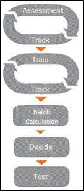

# Utilizzare il modulo pertinenza per analizzare i dati in evidenza

In indagini sui dati (Preview), il modulo pertinenza include la formazione sulla pertinenza e la revisione dei file relativi a un'indagine. Il flusso di lavoro di pertinenza è illustrato e descritto nel modo seguente:
  

  
- **Cicli di valutazione e tracciabilità**:
    
  - **Valutazione**: consente la valutazione precoce basata su un campione casuale di file e utilizza questa valutazione per applicare le decisioni per determinare le prestazioni del processo di codifica predittiva. 
    
  - **Track**: calcolare e visualizzare i risultati intermedi della valutazione monitorando la validità statistica del processo. 
    
- **Cicli di training e Tracking**
    
  - **Tag**: indagini sui dati (Preview) vengono fornite informazioni sui criteri di pertinenza specifici per ogni problema in base alla revisione iterativa dell'esperto e al tagging di singoli file.
    
  - **Track**: calcola e Visualizza i risultati intermedi della formazione relativa alla pertinenza monitorando la validità statistica del processo. 
    
- **Calcolo batch**: i criteri di pertinenza accumulati e appresi vengono applicati all'intera raccolta file e viene generato un punteggio di pertinenza per ogni file.
    
- **Decidere**: i risultati dell'analisi applicata all'intero caso vengono visualizzati dopo il calcolo del batch e vengono visualizzati i dati utilizzati per definire le decisioni relative alla revisione dei documenti.
    
- **Test**: i risultati possono essere testati per verificare la validità e l'efficacia dell'elaborazione delle indagini sui dati (Preview).

- **Ricerca**: dopo aver completato il flusso di lavoro della pertinenza, è possibile utilizzare l'output, ad esempio il percentile di un documento, per il problema, quando si esegue una query all'interno del working set.
    
## Linee guida per la formazione e la revisione della pertinenza

Di seguito è riportata una panoramica delle linee guida per la formazione e la revisione della pertinenza:
  
- **Errori e incoerenze**: se durante l'allenamento vengono eseguiti gli errori di tagging, tornare agli esempi di file precedenti per correggerli. Se si verifica un numero eccessivo di errori da correggere oppure è presente una nuova prospettiva del caso o del problema, i criteri di pertinenza devono essere ridefiniti dall'amministratore e riavviato il Training relativo alla pertinenza.
    
- **Tagging e formazione**: 
    
  - I file devono essere contrassegnati in base solo al contenuto. Non considerare i metadati, ad esempio il custode, la data o il percorso del file. 
    
  - Non prendere in considerazione le indicazioni dell'intervallo di date nel testo durante il tagging dei file.
    
  - Non considerare le immagini grafiche incorporate durante il tagging dei file.
     
  - Ignorare il testo applicato alla pertinenza verrà rimosso nel contenuto del file visualizzato nella visualizzazione di testo in pertinenza. Se i valori per il testo Ignora sono stati definiti dopo la formazione di pertinenza già avviata, il nuovo testo ignorato verrà applicato ai file di esempio creati dal punto in cui è stata definita. La funzionalità Ignora testo deve essere utilizzata con cautela, in quanto il relativo utilizzo può ridurre le prestazioni dell'analisi dei file
    
  - Utilizzare l'opzione **Ignora Tag** solo se necessario. Le indagini sui dati (Preview) non si basano sui file ignorati. In valutazione, se è difficile stabilire se un file è pertinente, è consigliabile contrassegnarlo come pertinente (R) o non pertinente (NR) quando possibile anziché selezionando **Ignora**. Quando le indagini sui dati (Preview) valutano la formazione, è possibile vedere in che modo sono stati elaborati questi tipi di file.
    
  - Anche i file con una quantità minima di testo estratto devono essere contrassegnati in formazione come R/NR, anziché come "Skip", quando possibile. 
    
  - Il tagging può influire sul classificatore fino a quando il file è leggibile e può essere contrassegnato come R/NR.
    
  - Il numero di sequenza dei file nell'elenco di file di esempio visualizzato nella scheda **tag** consente all'utente di tornare all'ordine di file originale visualizzato. 
    
  - È possibile tornare a qualsiasi campione e modificare il tagging dei file di set di valutazione e formazione. Le modifiche verranno applicate quando si crea l'esempio successivo.
    
  - I file di Excel analizzati in formato PDF devono essere considerati come file di Excel nativo durante il tagging dei file.
    
  - In caso di dubbi sul tagging della pertinenza di un file, consultare un esperto. L'utilizzo di tag non corretti durante la formazione di pertinenza può comportare una perdita di tempo nel corso del processo e potrebbe anche avere un impatto negativo sulla qualità dei risultati complessivi.
    
  - Le parole chiave definite negli elenchi di parole chiave verranno visualizzate nei colori per consentire all'utente di identificare i file rilevanti durante il tagging.
    
- **Calcolo batch**: i file contrassegnati come R/Nr dall'esperto riceveranno un punteggio pari a 0 o 100. Questo si applica al tagging eseguito prima del calcolo del batch. Se l'esperto ha passato il problema a inattività dopo il calcolo del batch e ha continuato a contrassegnare questo problema, i punteggi appena contrassegnati non saranno 100/0 ma piuttosto la partitura originale.
    
- **Problemi e modalità**di campionamento: i problemi vengono in genere disattivati durante il completamento del lavoro (la formazione di pertinenza è stabilizzata e il calcolo in batch è stato eseguito), quando i problemi vengono annullati o quando un altro utente sta lavorando sui problemi.
    
## Passaggi per la formazione sulla pertinenza

Nella scheda ** \> Tracking pertinenza** , le indagini sui dati forniscono suggerimenti su come procedere nell'elaborazione, con i passaggi successivi seguenti. Le implicazioni sono descritte di seguito quando si consiglia di eseguire ciascuna delle operazioni seguenti nel processo di formazione per pertinenza. 
  
- Tagging/continua tagging: revisione dei file e tagging della pertinenza eseguito da un esperto per ogni file e problema all'interno di un esempio.
    
  - Implicazione: è necessario contrassegnare un esempio esistente.
    
- Assessment/continue assessment: consente la convalida precoce della pertinenza del problema del caso e una visualizzazione preliminare della pertinenza del popolamento dei file importato per il caso corrente.
    
  - Implicazioni: è richiesta o consigliata una maggiore valutazione.
    
- Training/continue Training: processo durante il quale le indagini sui dati vengono apprese dall'esperto che è in grado di contrassegnare gli esempi di file e acquisisce la possibilità di identificare i criteri di pertinenza pertinenti a ogni problema nel contesto di ogni caso.
    
  - Implicazione: il problema richiede una formazione maggiore; è necessario creare e contrassegnare l'esempio successivo. 
    
- Calcolo batch: processo di pertinenza in cui le indagini sui dati prendono le conoscenze acquisite durante la fase di formazione e lo applicano all'intera popolazione dei file. Tutti i file del gruppo di file pertinente sono valutati per pertinenza e assegnato un punteggio di pertinenza.
    
  - Implicazione: il problema si è stabilizzato e il calcolo in batch può essere eseguito.
    
- Catch-up: pertinenza indica quando un esperto esamina e contrassegna un campione di file selezionati da un ulteriore caricamento di file durante uno scenario di carichi di rotolamento.
    
  - Implicazione: è stato aggiunto un nuovo carico e il recupero è necessario per continuare a funzionare.
    
- Inconsistenze Tag: Process identifica, tramite un algoritmo di analisi dei dati, incoerenze nel processo di tagging del file che potrebbe influire negativamente sull'analisi.
    
  - Implicazioni: nell'esempio seguente vengono inclusi i file contrassegnati in esempi precedenti e il loro tagging deve essere rifatto.
    
- Aggiorna classificatore: consente all'utente di applicare le modifiche di tagging o seeding.
    
  - Implicazioni: è possibile applicare le modifiche di tagging e seeding senza dover eseguire manualmente un altro esempio di pertinenza.
    
- In attesa: il processo di formazione sulla pertinenza è stato completato.
    
  - Implicazione: non è necessaria alcuna formazione di pertinenza a questo punto.
    
Anche se le indagini sui dati guidano il processo, con i passaggi successivi consigliati nelle diverse fasi, consente anche di spostarsi tra le schede e le pagine e di fare scelte per risolvere le situazioni che potrebbero essere rilevanti per il singolo caso, il problema o processo di revisione del documento. 
  
È possibile accettare o sostituire le indagini sui dati nelle scelte successive all'elaborazione dei passaggi. Se si desidera eseguire una procedura diversa da quella consigliata, fare clic sul **passaggio successivo** elencato nella visualizzazione del problema espanso nella finestra di dialogo, fare clic sul pulsante **modifica** accanto al passaggio successivo e selezionare un'altra opzione per il passaggio successivo. 
  
> [!NOTE]
> Alcune opzioni potrebbero rimanere disabilitate dopo lo sblocco, in quanto non sono supportate per l'utilizzo in quel momento del processo. 
  
## Altre informazioni

[Informazioni sulla valutazione in riLevanza](../assessment-in-relevance-in-advanced-ediscovery.md)
  
[Tagging e valutazione](../tagging-and-assessment-in-advanced-ediscovery.md)
  
[Formazione di tagging e pertinenza](../tagging-and-relevance-training-in-advanced-ediscovery.md)
  
[Verifica dell'analisi della pertinenza](../track-relevance-analysis-in-advanced-ediscovery.md)
  
[Decidere in base ai risultati](../decision-based-on-the-results-in-advanced-ediscovery.md)
  
[Verifica dell'analisi della pertinenza](../test-relevance-analysis-in-advanced-ediscovery.md)

[Eseguire una query sui dati in evidenza](evidence-query.md)
