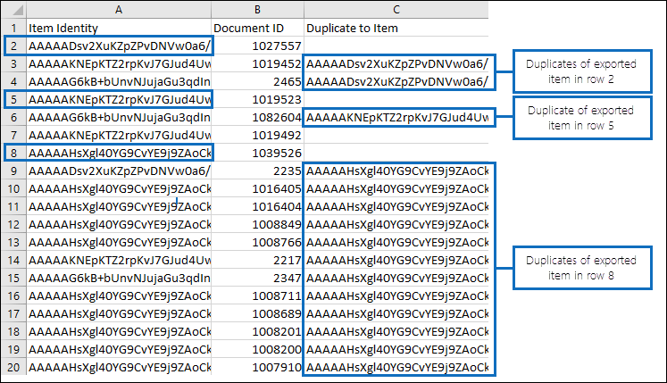

# Deduplicazione nei risultati della ricerca di eDiscovery

In questo articolo viene illustrato il funzionamento della deduplicazione dei risultati della ricerca di eDiscovery e vengono illustrate le limitazioni dell'algoritmo di deduplicazione.
  
Quando si utilizzano gli strumenti di Office 365 eDiscovery per esportare i risultati di una ricerca di eDiscovery, è possibile scegliere di deduplicare i risultati esportati. Cosa significa? Quando si attiva la deduplicazione (per impostazione predefinita, la deduplicazione non è abilitata), viene esportata una sola copia di un messaggio di posta elettronica anche se sono state trovate più istanze dello stesso messaggio nelle cassette postali in cui è stata eseguita la ricerca. La deduplicazione consente di risparmiare tempo riducendo il numero di elementi che è necessario esaminare e analizzare dopo l'esportazione dei risultati della ricerca. Tuttavia, è importante comprendere il funzionamento della deduplicazione e tenere presente che sono presenti limitazioni all'algoritmo che potrebbero provocare la marcatura di un elemento univoco come duplicato durante il processo di esportazione.
  
## Come vengono identificati i messaggi duplicati

Gli strumenti di eDiscovery di Office 365 utilizzano una combinazione delle proprietà di posta elettronica seguenti per determinare se un messaggio è un duplicato:
  
- **InternetMessageId** -questa proprietà consente di specificare l'identificatore del messaggio Internet di un messaggio di posta elettronica, che è un identificatore univoco globale che fa riferimento a una versione specifica di un messaggio specifico. Questo ID è generato dal programma client di posta elettronica del mittente o dal sistema di posta elettronica host che invia il messaggio. Se un utente invia un messaggio a più di un destinatario, l'ID del messaggio Internet sarà lo stesso per ogni istanza del messaggio. Le revisioni successive al messaggio originale riceveranno un identificatore di messaggio diverso. 
    
- **ConversationTopic** -la sua proprietà specifica l'oggetto del thread di conversazione di un messaggio. Il valore della proprietà **ConversationTopic** è la stringa che descrive l'argomento generale della conversazione. Una conservazione è costituita da un messaggio iniziale e da tutti i messaggi inviati in risposta al messaggio iniziale. I messaggi all'interno della stessa conversazione hanno lo stesso valore per la proprietà **ConversationTopic** . Il valore di questa proprietà è in genere la riga dell'oggetto del messaggio iniziale che ha generato la conversazione. 
    
- **BodyTagInfo** -questa è una proprietà di archivio di Exchange interna. Il valore di questa proprietà viene calcolato controllando vari attributi nel corpo del messaggio. Questa proprietà viene utilizzata per identificare le differenze nel corpo dei messaggi. 
    
Durante il processo di esportazione di eDiscovery, queste tre proprietà vengono confrontate per ogni messaggio che corrisponde ai criteri di ricerca. Se queste proprietà sono identiche per due (o più) messaggi, i messaggi vengono considerati duplicati e il risultato è che verrà esportata solo una copia del messaggio se la deduplicazione è abilitata. Il messaggio esportato è noto come "elemento di origine". Le informazioni sui messaggi duplicati sono incluse nei report **results. csv** e **manifest. XML** inclusi nei risultati della ricerca esportati. Nel file **results. csv** viene identificato un messaggio duplicato che presenta un valore nella colonna **Duplica per elemento** . Il valore di questa colonna corrisponde al valore nella colonna **identità elemento** per il messaggio esportato. 
  
Nella grafica seguente viene illustrato il modo in cui i messaggi duplicati vengono visualizzati nei report **results. csv** e **manifest. XML** esportati con i risultati della ricerca. Questi rapporti non includono le proprietà di posta elettronica descritte in precedenza, che vengono utilizzate nell'algoritmo di deduplicazione. Al contrario, i report includono la proprietà dell' **identità dell'elemento** assegnata agli elementi dall'archivio di Exchange. 
  
 ### Report results. csv (visualizzato in Excel)
  

  
 ### Report manifest. XML (visualizzato in Excel)
  

  
Inoltre, le altre proprietà dei messaggi duplicati sono incluse nei report di esportazione. Questo include la cassetta postale in cui si trova il messaggio duplicato, se il messaggio è stato inviato a un gruppo di distribuzione e se il messaggio è stato CC ' d o Ccn ' s a un altro utente.
  
## Limitazioni dell'algoritmo di deduplicazione

Esistono alcune limitazioni note dell'algoritmo di deduplicazione che possono causare la marcatura degli elementi univoci come duplicati. È importante comprendere queste limitazioni in modo da poter decidere se utilizzare o meno la funzionalità di deduplicazione facoltativa.
  
Esiste una situazione in cui la funzionalità di deduplicazione potrebbe identificare un messaggio come duplicato e non esportarlo (ma citarlo come duplicato nei report di esportazione). Si tratta di messaggi che un utente modifica ma non invia. Si supponga, ad esempio, che un utente seleziona un messaggio in Outlook, copia il contenuto del messaggio e lo incolla in un nuovo messaggio. L'utente modifica quindi una delle copie rimuovendo o aggiungendo un allegato o modificando la riga dell'oggetto o il corpo stesso. Se questi due messaggi corrispondono alla query di una ricerca di eDiscovery, solo uno dei messaggi verrà esportato se la deduplicazione viene abilitata quando vengono esportati i risultati della ricerca. Pertanto, anche se il messaggio originale o il messaggio copiato è stato modificato, nessuno dei messaggi modificati è stato inviato e pertanto i valori delle proprietà **InternetMessageId**, **ConversationTopic** e **BodyTagInfo** non sono stati aggiornati. Tuttavia, come spiegato in precedenza, entrambi i messaggi saranno elencati nei report di esportazione 
  
Si noti che i messaggi univoci possono essere contrassegnati anche come duplicati quando la funzionalità di protezione delle pagine copy-on-Write è abilitata, come nel caso di una cassetta postale che si trova sul blocco per controversia legale o sul posto. La funzionalità copy-on-Write copia il messaggio originale (e lo salva nella cartella Versions della cartella elementi ripristinabili dell'utente) prima che venga salvata la revisione all'elemento originale. In questo caso, la copia riveduta e il messaggio originale (nella cartella elementi ripristinabili) potrebbero essere considerati come messaggi duplicati e quindi solo uno di essi verrebbe esportato.
  
> [!IMPORTANT]
> Se le limitazioni dell'algoritmo di deduplicazione possono influire sulla qualità dei risultati della ricerca, non è necessario abilitare la deduplicazione quando si esportano gli elementi. Se non è probabile che le situazioni descritte in questa sezione siano un fattore nei risultati di ricerca e si desidera ridurre il numero di elementi più probabili per essere duplicati, è consigliabile abilitare la deduplicazione. 
  
## Ulteriori informazioni

- Le informazioni contenute in questo articolo sono applicabili quando si esportano i risultati della ricerca utilizzando uno dei seguenti strumenti di eDiscovery:
    
  - Ricerca contenuto nel centro sicurezza &amp; e conformità di Office 365
    
  - eDiscovery sul posto in Exchange Online
    
  - Centro eDiscovery in SharePoint Online
    
- Per ulteriori informazioni sull'esportazione dei risultati della ricerca, vedere:
    
  - [Esportare i risultati di ricerca dal centro sicurezza &amp; e conformità di Office 365](export-search-results.md)
    
  - [Esportare un report di ricerca contenuto dal centro sicurezza &amp; e conformità di Office 365](export-a-content-search-report.md)
    
  - [Esportare i risultati della ricerca eDiscovery sul posto in un file PST](https://go.microsoft.com/fwlink/p/?linkid=832671)
    
  - [Esportare il contenuto e creare report nel centro eDiscovery](https://support.office.com/article/7b2ea190-5f9b-4876-86e5-4440354c381a)
