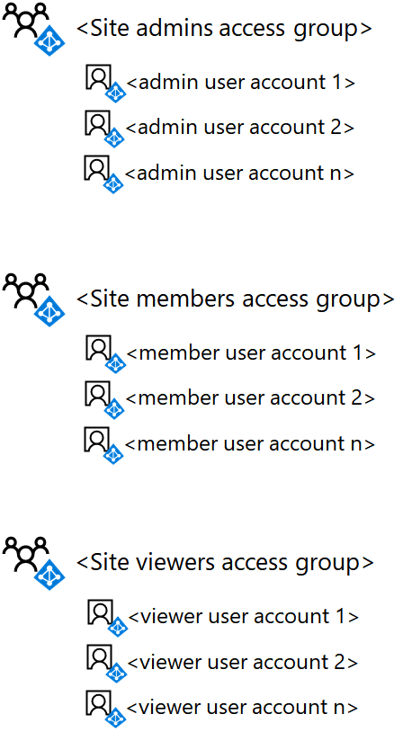

# <a name="deploy-an-isolated-sharepoint-online-team-site"></a>Distribuire un sito del team di SharePoint Online isolato

 **Sintesi:** istruzioni dettagliate per distribuire un nuovo sito del team di SharePoint Online isolato.
  
In questo articolo viene fornita una guida dettagliata alla distribuzione per creare e configurare un sito del team di SharePoint Online isolato in Microsoft Office 365. Questa procedura presuppone l'utilizzo di tre gruppi di SharePoint predefiniti e dei livelli di autorizzazione corrispondenti, con un singolo gruppo di Azure Active Directory (AD) per ogni livello di accesso.
  
## <a name="phase-1-create-and-populate-the-team-site-access-groups"></a>Fase 1: creare e popolare i gruppi di accesso al sito del team

In questa fase, vengono creati tre gruppi di accesso basati su Azure AD per i tre gruppi di SharePoint predefiniti e vengono popolati con gli account utente appropriati.
  
> [!NOTE]
> La procedura seguente presuppone che tutti gli account utente necessari già esistano e siano dotati delle licenze appropriate. In caso contrario, aggiungerli e assegnare le licenze prima di procedere con il passaggio 1. 
  
### <a name="step-1-list-the-sharepoint-online-admins-for-the-site"></a>Passaggio 1: elencare gli amministratori di SharePoint Online per il sito

Determinare il set di account utente corrispondenti agli amministratori di SharePoint Online per il sito del team isolato.
  
Se si gestiscono account utente e gruppi con Office 365 e si desidera utilizzare Windows PowerShell, fare un elenco dei loro nomi dell'entità utente (UPN), ad esempio, UPN: belindan@contoso.com.
  
### <a name="step-2-list-the-members-for-the-site"></a>Passaggio 2: elencare i membri del sito

Determinare il set di account utente corrispondenti ai membri del sito del team isolato, quelli che collaboreranno sulle risorse archiviate nel sito.
  
Se si gestiscono account utente e gruppi con Office 365 e si desidera utilizzare PowerShell, fare un elenco dei loro UPN. Se sono presenti molti membri del sito, è possibile archiviare l'elenco di UPN in un file di testo e aggiungerli con un singolo comando di PowerShell.
  
### <a name="step-3-list-the-viewers-for-the-site"></a>Passaggio 3: elencare i visualizzatori del sito

Determinare il set di account utente corrispondenti ai visualizzatori del sito del tam isolato, quelli che possono visualizzare le risorse archiviate nel sito ma non modificarle o collaborare direttamente sui contenuti.
  
Se si gestiscono account utente e gruppi con Office 365 e si desidera utilizzare PowerShell, fare un elenco dei loro UPN. Se sono presenti molti membri del sito, è possibile archiviare l'elenco di UPN in un file di testo e aggiungerli con un singolo comando di PowerShell.
  
I visualizzatori del sito potrebbero includere la direzione esecutiva, i consulenti legali o gli stakeholder interdipartimentali.
  
### <a name="step-4-create-the-three-access-groups-for-the-site-in-azure-ad"></a>Passaggio 4: creare i tre gruppi di accesso per il sito di Azure AD

È necessario creare i gruppi di accesso seguenti in Azure AD:
  
- Amministratori del sito (che contiene l'elenco creato al passaggio 1)
    
- Membri del sito (che contiene l'elenco creato al passaggio 2)
    
- Visualizzatori del sito (che contiene l'elenco creato al passaggio 3)
    
1. Nel browser, accedere al portale di Azure [https://portal.azure.com](https://portal.azure.com) e accedere con le credenziali di un account assegnato con l'amministratore di gestione utenti o con il ruolo Administrator dell'azienda.
    
2. Nel portale di Azure fare clic su **Azure Active Directory > Gruppi**.
    
3. Nel pannello **Gruppi - Tutti i gruppi** fare clic su **+ Nuovo gruppo**.
    
4. Nel pannello **Gruppo**:
    
  - Selezionare **Office 365** in **Tipo di gruppo**.
    
  - Digitare il nome del gruppo in **nome**.
    
  - Digitare una descrizione del gruppo nella **Descrizione del gruppo**.
    
  - Selezionare **Assegnato** in **Tipo di appartenenza**.
    
5. Fare clic su **Crea** e quindi chiudere il pannello **Gruppo**.
    
6. Ripetere i passaggi 3-5 per i gruppi aggiuntivi.
    
> [!NOTE]
> È necessario utilizzare il portale di Azure per creare i gruppi in modo che dispongano delle funzionalità di Office abilitate. Se un sito di SharePoint Online isolato viene configurato in un secondo momento come sito estremamente riservato con un'etichetta di Azure Information Protection (AIP) per crittografare i file e assegnare l'autorizzazione a gruppi specifici, è necessario che i gruppi consentiti siano stati creati con le funzionalità di Office abilitato. Non è possibile modificare l'impostazione delle caratteristiche di Office di un gruppo di Azure AD dopo che è stata creata. 
  
Ecco la configurazione risultante con i tre gruppi di accesso al sito.
  

  
### <a name="step-5-add-the-user-accounts-to-the-access-groups"></a>Passaggio 5. Aggiungere gli account utente ai gruppi di accesso

In questo passaggio, eseguire la procedura riportata di seguito:
  
1. Aggiungere l'elenco di utenti creato nel passaggio 1 al gruppo di accesso degli amministratori del sito
    
2. Aggiungere l'elenco di utenti creato nel passaggio 2 al gruppo di accesso dei membri del sito
    
3. Aggiungere l'elenco di utenti creato nel passaggio 3 al gruppo di accesso dei visualizzatori del sito
    
Se si gestiscono account utente e gruppi con Windows Server AD, aggiungere gli utenti ai gruppi di accesso appropriati utilizzando le normali procedure di gestione di gruppi e utenti di Windows Server AD e attendere la sincronizzazione con l'abbonamento a Office 365.
  
Se si gestiscono account utente e gruppi con Office 365, è possibile utilizzare l'interfaccia di amministrazione di Office o PowerShell. Se si dispone di nomi di gruppo duplicati per uno dei gruppi di accesso, è necessario utilizzare l'interfaccia di amministrazione di Office.
  
Per l'interfaccia di amministrazione di Office, accedere con un account utente a cui è stato assegnato l'amministratore dell'account utente o il ruolo di amministratore dell'azienda e utilizzare i gruppi per aggiungere gli account utente e i gruppi corretti ai gruppi di accesso appropriato.
  
Per PowerShell, consultare [Connettersi con il modulo Azure Active Directory V2 PowerShell](https://go.microsoft.com/fwlink/?linkid=842218).
  
Successivamente, utilizzare il seguente blocco di comandi per aggiungere un singolo account utente a un gruppo di accesso:
  
```
$userUPN="<UPN of the user account>"
$grpName="<display name of the access group>"
Add-AzureADGroupMember -RefObjectId (Get-AzureADUser | Where { $_.UserPrincipalName -eq $userUPN }).ObjectID -ObjectId (Get-AzureADGroup | Where { $_.DisplayName -eq $grpName }).ObjectID
```

> [!TIP]
> Per un file di testo che contiene tutti i comandi di PowerShell e un foglio di lavoro di configurazione di Excel che genera comandi di PowerShell in base ai nomi degli account utente e di gruppo, scaricare [Kit di distribuzione del sito di SharePoint Online Team isolato](https://gallery.technet.microsoft.com/Isolated-SharePoint-Online-0b364907). 
  
Se gli UPN degli account utente per uno dei gruppi di accesso è archiviato in un file di testo, è possibile utilizzare il seguente blocco di comandi PowerShell per aggiungerli tutti contemporaneamente:
  
```
$grpName="<display name of the access group>"
$fileName="<path and name of the file containing the list of account UPNs>"
$grpID=(Get-AzureADGroup | Where { $_.DisplayName -eq $grpName }).ObjectID
Get-Content $fileName | ForEach { $userUPN=$_; Add-AzureADGroupMember -RefObjectId (Get-AzureADUser | Where { $_.UserPrincipalName -eq $userUPN }).ObjectID -ObjectID $grpID }
```

Per PowerShell, utilizzare il seguente blocco di comandi per aggiungere un singolo gruppo a un gruppo di accesso:
  
```
$nestedGrpName="<display name of the group to add to the access group>"
$grpName="<display name of the access group>"
Add-AzureADGroupMember -RefObjectId (Get-AzureADGroup | Where { $_.DisplayName -eq $nestedGrpName }).ObjectID -ObjectID (Get-AzureADGroup | Where { $_.DisplayName -eq $grpName }).ObjectID

```

Dovrebbero essere visualizzati i seguenti risultati:
  
- Il gruppo di Azure AD degli amministratori del sito contiene gli account utente o i gruppi di amministratori del sito.
    
- Il gruppo di Azure AD dei membri del sito contiene gli account utente o i gruppi di membri del sito.
    
- Il gruppo di Azure AD dei visualizzatori del sito contiene gli account utente o i gruppi che possono visualizzare solo il contenuto del sito.
    
Convalidare l'elenco dei membri di ogni gruppo di accesso con l'interfaccia di amministrazione di Office o con il seguente blocco di comandi PowerShell:
  
```
$grpName="<display name of the access group>"
Get-AzureADGroupMember -ObjectId (Get-AzureADGroup | Where { $_.DisplayName -eq $grpName }).ObjectID | Sort UserPrincipalName | Select UserPrincipalName,DisplayName,UserType
```

Di seguito è configurata la configurazione risultante con i tre gruppi di accesso al sito popolati con account utente o gruppi.
  

  
## <a name="phase-2-create-and-configure-the-isolated-team-site"></a>Fase 2: creare e configurare il sito del team isolato

In questa fase, viene creato il sito di SharePoint Online isolato e vengono configurate le autorizzazioni per i livelli di autorizzazione di SharePoint Online predefiniti affinché vengano utilizzati i nuovi gruppi di accesso basati su Azure AD.
  
Creare innanzitutto il sito del team di SharePoint Online seguendo questa procedura.
  
1. Accedere al portale di Office 365 con un account che verrà usato anche per gestire il sito del team di SharePoint Online (un amministratore di SharePoint Online). Per informazioni, vedere [Dove accedere a Office 365](https://support.office.com/Article/Where-to-sign-in-to-Office-365-e9eb7d51-5430-4929-91ab-6157c5a050b4).
    
2. Nell'elenco dei riquadri fare clic su **SharePoint**.
    
3. Nella nuova **scheda SharePoint** del browser fare clic su **+ Crea sito**.
    
4. Nella pagina **Crea sito** fare clic su **Sito del team**.
    
5. In **nome sito**Digitare un nome per il sito del team. 
    
6. Nella **Descrizione del sito del team** Digitare una descrizione facoltativa dello scopo del sito.
    
7. In **Impostazioni privacy** selezionare **Private - only members can access this site** (Privato: solo i membri possono accedere a questo sito) e quindi fare clic su **Avanti**.
    
8. Nel riquadro **Who do you want to add?** (Chi si desidera aggiungere?) fare clic su **Fine**.
    
Successivamente, dal nuovo sito del team di SharePoint Online configurare le autorizzazioni.
  
1. Nella barra degli strumenti fare clic sull'icona delle impostazioni, quindi su **Autorizzazioni sito**.
    
2. Nel riquadro **Autorizzazioni sito** fare clic su **Advanced permissions settings** (Impostazioni autorizzazioni avanzate).
    
3. Nella nuova scheda **Autorizzazioni** del browser fare clic su **Impostazioni richieste di accesso**.
    
4. Nella finestra di dialogo **impostazioni richieste di accesso** deselezionare **Consenti ai membri di condividere il sito e singoli file e cartelle** e **consentire le richieste di accesso** (in modo che tutte e tre le caselle di controllo siano deselezionate), quindi fare clic su **OK**.
    
5. Nella scheda **autorizzazioni** del browser fare clic ** \<su membri name> sito** nell'elenco.
    
6. In **Utenti e gruppi** fare clic su **Nuovo**.
    
7. Nella finestra di dialogo **Condividi**, digitare il nome del gruppo di Azure AD dei membri del sito di accesso, selezionarlo e fare clic su **Condividi**.
    
8. Fare clic sul pulsante Indietro del browser.
    
9. Fare clic su ** \<proprietari di name> sito** nell'elenco.
    
10. In **Utenti e gruppi** fare clic su **Nuovo**.
    
11. Nella finestra di dialogo **Condividi**, digitare il nome del gruppo di accesso degli amministratori del sito, selezionarlo e fare clic su **Condividi**.
    
12. Fare clic sul pulsante Indietro del browser.
    
13. Fare clic su ** \<visitatori del sito name>** nell'elenco.
    
14. In **Utenti e gruppi** fare clic su **Nuovo**.
    
15. Nella finestra di dialogo **Condividi**, digitare il nome del gruppo di Azure AD dei visualizzatori del sito di accesso, selezionarlo e fare clic su **Condividi**.
    
16. Chiudere la scheda **Autorizzazioni** del browser.
    
I risultati di queste impostazioni delle autorizzazioni sono i seguenti:
  
- Il ** \<** gruppo di SharePoint proprietari del sito name> contiene il gruppo di accesso degli amministratori del sito, in cui tutti i membri hanno il livello di autorizzazione **controllo completo** .
    
- Il gruppo di SharePoint ** \<membri del sito name>** contiene il gruppo di accesso dei membri del sito, in cui tutti i membri hanno il livello di autorizzazione **modifica** .
    
- Il gruppo di SharePoint ** \<visitatori del sito name>** contiene il gruppo di accesso dei visualizzatori del sito, in cui tutti i membri hanno il livello di autorizzazione **lettura** .
    
- I membri non hanno la possibilità di invitare altri membri o di richiedere l'accesso per utenti non membri.

    
Ecco la configurazione risultante con i tre gruppi di SharePoint per il sito configurati per l'utilizzo dei tre gruppi di accesso, che sono popolati con gli account utente o i gruppi di Azure AD.
  

  
I membri del sito, tramite l'appartenenza a uno dei gruppi di accesso, possono ora collaborare utilizzando le risorse del sito.
  
## <a name="next-step"></a>Passaggio successivo

Se è necessario modificare l'appartenenza al gruppo di accesso del sito o creare una cartella di documenti con autorizzazioni personalizzate, vedere [Manage an isolated SharePoint Online team site](manage-an-isolated-sharepoint-online-team-site.md).
  
## <a name="see-also"></a>Vedere anche

[Siti del team di SharePoint Online isolati](isolated-sharepoint-online-team-sites.md)
  
[Progettare un sito del team di SharePoint Online isolato](design-an-isolated-sharepoint-online-team-site.md)
  
[Gestire un sito del team di SharePoint Online isolato](manage-an-isolated-sharepoint-online-team-site.md)
  


