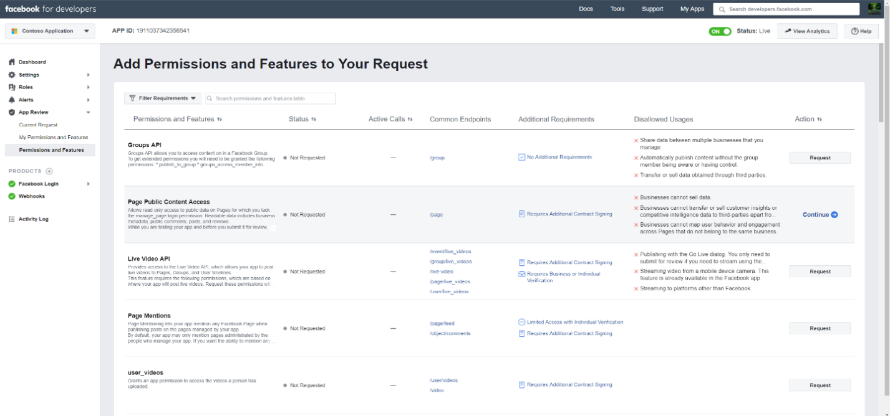

# Distribuire un connettore per archiviare i dati di Facebook in Office 365Deploy a connector to archive Facebook data in Office 365

Questo articolo contiene il processo dettagliato per la distribuzione di un connettore che utilizza il servizio di importazione di Office 365 per importare i dati da pagine business di Facebook a Office 365.This article contains the step-by-step process to deploy a connector that uses the Office 365 Import service to import data from Facebook Business pages to Office 365. Per una panoramica generale di questo processo e un elenco dei prerequisiti necessari per distribuire un connettore Facebook, vedere [utilizzare i connettori di esempio per archiviare i dati di terze parti in Office 365](archive-third-party-data-with-sample-connector.md).For a high-level overview of this process and a list of prerequisites required to deploy a Facebook connector, see [Use sample connectors to archive third-party data in Office 365](archive-third-party-data-with-sample-connector.md). 

## Passaggio 1: scaricare il pacchettoStep 1: Download the package

Scaricare il pacchetto precompilato dalla sezione release del repository all' <https://github.com/Microsoft/m365-sample-connector-csharp-aspnet/releases>indirizzo.Download the prebuilt package from repository’s Release section at <https://github.com/Microsoft/m365-sample-connector-csharp-aspnet/releases>. Nella versione più recente, scaricare il file zip denominato **SampleConnector. zip**.Under the latest release, download the zip file named **SampleConnector.zip**. Il file zip verrà caricato in Azure nel passaggio 4.You will upload this zip file to Azure in Step 4.

## Passaggio 2: creare un'app in Azure Active DirectoryStep 2: Create an app in Azure Active Directory

1. Accedere a <https://portal.azure.com> e accedere con le credenziali di un account di amministratore globale di Office 365.Go to <https://portal.azure.com> and sign in using the credentials of an Office 365 global admin account.

    

2. Nel riquadro di spostamento a sinistra, fare clic su **Azure Active Directory**.In the left navigation pane, click **Azure Active Directory**.

    

3. Nel riquadro di spostamento a sinistra, fare clic su **registrazioni app (anteprima)** e quindi fare clic su **nuova registrazione**.In the left navigation pane, click **App registrations (Preview)** and then click **New registration**.

    

4. Registrare l'applicazione.Register the application. In URI di reindirizzamento, selezionare Web nell'elenco a discesa tipo di applicazione e <https://portal.azure.com> quindi digitare nella casella per l'URI.Under Redirect URI, select Web in the application type dropdown list and then type <https://portal.azure.com> in the box for the URI.

   

5. Copiare l'ID dell' **applicazione (client)** e la **Directory (tenant)** e salvarli in un file di testo o in un'altra posizione sicura.Copy the **Application (client) ID** and **Directory (tenant) ID** and save them to a text file or other safe location. Questi ID verranno utilizzati nei passaggi successivi.You’ll use these IDs in later steps.

   

6. Vai a **certificati & segreti per la nuova app.**Go to **Certificates & secrets for the new app.**

   

7. Fare clic su **nuovo client segreto**Click **New client secret**

   

8. Creare un nuovo segreto.Create a new secret. Nella casella Descrizione digitare il segreto e quindi scegliere un periodo di scadenza.In the description box, type the secret and then choose an expiration period. 

    

9. Copiare il valore del segreto e salvarlo in un file di testo o in un altro percorso di archiviazione.Copy the value of the secret and save it to a text file or other storage location. Si tratta del segreto dell'applicazione AAD che verrà utilizzato nei passaggi successivi.This is the AAD application secret that you will use in later steps.

   

10. Andare a **manifest** e copiare il identifierUris (denominato anche URI dell'applicazione AAD) come evidenziato nella schermata seguente.Go to **Manifest** and copy the identifierUris (which is also called the AAD application Uri) as highlighted in the following screenshot. Copiare l'URI dell'applicazione AAD in un file di testo o in un altro percorso di archiviazione.Copy the AAD application Uri to a text file or other storage location. Verrà utilizzato nel passaggio 6.You’ll use it in Step 6.

   

## Passaggio 3: creare un account di archiviazione di AzureStep 3: Create an Azure storage account

1. Passare alla Home page di Azure per l'organizzazione.Go to the Azure home page for your organization.

    

2. Fare clic su **Crea una risorsa** e digitare **account di archiviazione** nella casella di ricerca.Click **Create a resource** and they type **storage account** in the search box.

    

3. Fare clic su **spazio di archiviazione**e quindi su **account di archiviazione**.Click **Storage**, and then click **Storage account**.

    

4. Nella pagina **Crea account di archiviazione** , nella casella sottoscrizione, selezionare **pay-as-you-go** o **versione di valutazione gratuita** a seconda del tipo di sottoscrizione di Azure di cui si dispone.On the **Create storage account** page, in the Subscription box, select **Pay-As-You-Go** or **Free Trial** depending on which type of Azure subscription you have. Selezionare o creare un gruppo di risorse.Then select or create a resource group.

    

5. Digitare un nome per l'account di archiviazione.Type a name for the storage account.

    

6. Esaminare e quindi fare clic su **Crea** per creare l'account di archiviazione.Review and then click **Create** to create the storage account.

    

7. Dopo alcuni istanti, fare clic su **Aggiorna** e quindi su **Vai a risorsa** per passare all'account di archiviazione.After a few moments, click **Refresh** and then click **Go to resource** to navigate to the storage account.

    

8. Fare clic su **tasti di accesso** nel riquadro di spostamento a sinistra.Click **Access keys** in the left navigation pane.

    

9. Copiare una **stringa di connessione** e salvarla in un file di testo o in un altro percorso di archiviazione.Copy a **Connection string** and save it to a text file or other storage location. Questa operazione viene utilizzata durante la creazione di una risorsa Web App.You’ll use this when creating a web app resource.

    

## Passaggio 4: creare una nuova risorsa Web App in AzureStep 4: Create a new web app resource in Azure

1. Nella **Home** page del portale di Azure, fare clic su **Crea una \> risorsa \> tutto Web App**.On the **Home** page in the Azure portal, click **Create a resource \> Everything \> Web app**. Nella pagina **Web App** fare clic su **Crea**.On the **Web app** page, click **Create**. 

   

2. Inserire i dettagli (come illustrato di seguito) e quindi creare l'applicazione Web.Fill in the details (as shown below) and then create the Web app. Si noti che il nome immesso nella casella **nome app** verrà utilizzato per creare l'URL del servizio app di Azure; ad esempio fbconnector.azurewebsites.NET.Note that the name that you enter in the **App name** box will be used to create the Azure app service URL; for example fbconnector.azurewebsites.net.

   

3. Passare alla nuova risorsa Web App creata, fare clic su **Impostazioni applicazione** nel riquadro di spostamento sinistro.Go to the newly created web app resource, click **Application Settings** in the left navigation pane. In Impostazioni applicazione fare clic su Aggiungi nuova impostazione e quindi aggiungere le tre impostazioni seguenti.Under Application settings, click Add new setting and add the following three settings. Utilizzare i valori (copiati nel file di testo dai passaggi precedenti):Use the values (that you copied to the text file from the previous steps): 

    - **APISecretKey** – è possibile digitare qualsiasi valore come segreto.**APISecretKey** – You can type any value as the secret. Questa operazione verrà utilizzata per accedere all'applicazione Web del connettore nel passaggio 7.This will be used to access the connector web app in Step 7.

    - **StorageAccountConnectionString** : l'URI della stringa di connessione copiato dopo la creazione dell'account di archiviazione di Azure nel passaggio 3.**StorageAccountConnectionString** – The connection string Uri that you copied after creating the Azure storage account in Step 3.

    - **tenantId** -l'ID tenant dell'organizzazione di Office 365 copiato dopo aver creato l'app Facebook Connector in Azure Active Directory nel passaggio 2.**tenantId** – The tenant ID of your Office 365 organization that you copied after creating the Facebook connector app in Azure Active Directory in Step 2.

    

4. In **Impostazioni generali**, fare clic **su** avanti accanto a **sempre attiva**.Under **General settings**, click **On** next to the **Always On**. Fare clic su **Salva** nella parte superiore della pagina per salvare le impostazioni di Applicaton.Click **Save** at the top of the page to save applicaton settings.

   

5. Il passaggio finale consiste nel caricare il codice sorgente dell'app del connettore in Azure scaricato nel passaggio 1.The final step is to upload the connector app source code to Azure that you downloaded in Step 1. In un Web browser, passare a https://<AzureAppResourceName>. SCM.azurewebsites.NET/ZipDeployUi.In a web browser, go to https://<AzureAppResourceName>.scm.azurewebsites.net/ZipDeployUi. Ad esempio, se il nome della risorsa dell'app di Azure (denominato nel passaggio 2 di questa sezione) è **fbconnector**, si passa a https://fbconnector.scm.azurewebsites.net/ZipDeployUi.For example, if the name of your Azure app resource (which you named in step 2 in this section) is **fbconnector**, then you would go to https://fbconnector.scm.azurewebsites.net/ZipDeployUi. 

6. Trascinare e rilasciare il SampleConnector. zip (scaricato nel passaggio 1) in questa pagina.Drag and drop the SampleConnector.zip (that you downloaded in Step 1) to this page. Dopo che i file sono stati caricati e la distribuzione ha esito positivo, la pagina avrà un aspetto simile alla schermata seguente.After the files are uploaded and the deployment is successful, the page will look similar to the following screenshot.

   

## Passaggio 5: registrare l'app FacebookStep 5: Register the Facebook app

1. Accedere a <https://developers.facebook.com> , eseguire l'accesso usando le credenziali per l'account per le pagine business di Facebook dell'organizzazione e quindi fare clic su **Aggiungi nuova app**.Go to <https://developers.facebook.com> , log in using the credentials for the account for your organization’s Facebook Business pages, and then click **Add New App**.

   

2. Creare un nuovo ID app.Create a new app ID.

   

3. Nel riquadro di spostamento a sinistra, fare clic su **Aggiungi prodotti** e quindi fare clic su **Configura** nella sezione **login Facebook** .In the left navigation pane, click **Add Products** and then click **Set Up** in the **Facebook Login** tile.

   

4. Nella pagina integrazione account di accesso di Facebook fare clic su **Web**.On the Integrate Facebook Login page, click **Web**.

   

5. Aggiungere l'URL del servizio app di Azure; ad esempio https://fbconnector.azurewebsites.net.Add the Azure app service URL; for example https://fbconnector.azurewebsites.net.

   

6. Completare la sezione Guida introduttiva della configurazione dell'account di accesso di Facebook.Complete the QuickStart section of the Facebook Login setup.

   

7. Nel riquadro di spostamento a sinistra in **login Facebook**, fare clic su **Impostazioni**e aggiungere l'URI di reindirizzamento OAuth nella casella valido degli URI di **Reindirizzamento di OAuth** . utilizzare il formato \*\* \<connectorserviceuri>/views/FacebookOAuth\*\*, in cui il valore di connectorserviceuri è l'URL del servizio app di Azure per l'organizzazione. ad esempio https://fbconnector.azurewebsites.net.In the left navigation pane under **Facebook Login**, click **Settings**, and add the OAuth redirect URI in the **Valid OAuth Redirect URIs** box; use the format **\<connectorserviceuri>/Views/FacebookOAuth**, where the value for connectorserviceuri is the Azure app service URL for your organization; for example https://fbconnector.azurewebsites.net.

   

8. Nel riquadro di spostamento a sinistra, fare clic su **Aggiungi prodotti** e quindi fare clic su webhook **.**In the left navigation pane, click **Add Products** and then click **Webhooks.** Nel menu a discesa della **pagina** , fare clic su **pagina**.In the **Page** pull-down menu, click **Page**. 

   

9. Aggiungere l'URL di callback di Webhook e aggiungere un token di verifica.Add Webhooks Callback URL and add a verify token. Il formato dell'URL di callback, utilizzare il formato \*\* <connectorserviceuri>/API/FbPageWebhook\*\*, in cui il valore di connectorserviceuri è l'URL del servizio app di Azure per l'organizzazione. ad esempio https://fbconnector.azurewebsites.net.The format of the callback URL, use the format **<connectorserviceuri>/api/FbPageWebhook**, where the value for connectorserviceuri is the Azure app service URL for your organization; for example https://fbconnector.azurewebsites.net. 

    Il token di verifica dovrebbe essere simile a una password complessa.The verify token should similar to a strong password. Copiare il token di verifica in un file di testo o in un altro percorso di archiviazione.Copy the verify token to a text file or other storage location.

     

10. Testare e sottoscrivere l'endpoint per il feed.Test and subscribe to the endpoint for feed.

    

11. Aggiungere un URL di privacy, un'icona dell'app e un utilizzo aziendale.Add a privacy URL, app icon, and business use. Inoltre, copiare l'ID app e l'applicazione segreta in un file di testo o in un altro percorso di archiviazione.Also, copy the app ID and app secret to a text file or other storage location.

    

12. Rendere pubblico l'applicazione.Make the app public.

    

13. Aggiungere un utente al ruolo di amministratore o tester.Add user to the admin or tester role.

    

14. Aggiungere l'autorizzazione di **accesso al contenuto pubblico della pagina** .Add the **Page Public Content Access** permission.

    

15. Aggiungere l'autorizzazione Manage Pages.Add Manage Pages permission.

    

16. Ottenere l'applicazione recensita da Facebook.Get the application reviewed by Facebook.

    

## Passaggio 6: configurare l'applicazione Web del connettoreStep 6: Configure the connector web app

1. Passare a https://\<AzureAppResourceName>. azurewebsites. NET (dove AzureAppResourceName è il nome della risorsa di Azure App denominata nel passaggio 4), ad esempio, se il nome è **fbconnector**, andare a https://fbconnector.azurewebsites.net.Go to https://\<AzureAppResourceName>.azurewebsites.net (where AzureAppResourceName is the name of your Azure app resource that you named in Step 4) For example, if the name is **fbconnector**, go to https://fbconnector.azurewebsites.net. La Home page dell'app avrà lo stesso aspetto della schermata seguente.The home page of the app will look like the following screenshot.

  

2. Fare clic su **Configura** per visualizzare una pagina di accesso.Click **Configure** to display a sign in page.
 
   

3. Nella casella ID tenant digitare o incollare l'ID tenant (ottenuto nel passaggio 2).In the Tenant Id box, type or paste your tenant Id (that you obtained in Step 2). Nella casella password digitare o incollare il APISecretKey (ottenuto nel passaggio 2), quindi fare clic su **imposta impostazioni di configurazione** per visualizzare la pagina **Dettagli di configurazione** .In the password box, type or paste the APISecretKey (that you obtained in Step 2), and then click **Set Configuration Settings** to display the **Configuration Details** page.

    

4. In **Dettagli di configurazione**, immettere le impostazioni di configurazione seguentiUnder **Configuration Details**, enter the following configuration settings 

   - **ID applicazione Facebook** -ID app per l'applicazione Facebook ottenuta al passaggio 5.**Facebook application ID** - The app ID for the Facebook application that you obtained in Step 5.
   - **Segreto dell'applicazione Facebook** : il segreto dell'app per l'applicazione Facebook ottenuta al passaggio 5.**Facebook application secret** - The app secret for the Facebook application that you obtained in Step 5.
   - I webhook di **Facebook verificano** il token, ovvero il token di verifica creato nel passaggio 5.**Facebook webhooks verify token** - The verify token that you created in Step 5.
   - **ID applicazione AAD** -ID applicazione per l'app Azure Active Directory creata al passaggio 2**AAD application ID** - The application ID for the Azure Active Directory app that you created in Step 2
   - **Segreto dell'applicazione AAD** : il valore del segreto di APISecretKey creato nel passaggio 4.**AAD application secret** - The value for the APISecretKey secret that you created in Step 4.
   - **URI dell'applicazione AAD** -URI dell'applicazione AAD ottenuto nel passaggio 2; ad esempio, https://microsoft.onmicrosoft.com/2688yu6n-12q3-23we-e3ee-121111123213.**AAD application Uri** - The AAD application Uri obtained in Step 2; for example, https://microsoft.onmicrosoft.com/2688yu6n-12q3-23we-e3ee-121111123213.
   - **Chiave di strumentazione Insights app** -lasciare vuota questa casella.**App insights instrumentation key** - Leave this box blank.

5. Fare clic su **Salva** per salvare le impostazioni del connettore.Click **Save** to save the connector settings.

## Passaggio 7: configurare un connettore personalizzato nel centro sicurezza & ComplianceStep 7: Set up a custom connector in the Security & Compliance Center

1. Andare a <https://protection.office.com> e quindi fare clic su data **governance \> Import \> Archive data di terze parti**.Go to <https://protection.office.com> and then click **Data governance \> Import \> Archive third-party data**.

   

2.  Fare clic su **Aggiungi connettore** e quindi su **personalizzato**.Click **Add a connector** and then click **Custom**.

    

3.  Nella pagina **Aggiungi applicazione del connettore** , immettere le informazioni seguenti e quindi fare clic su **Avanti**.On the **Add Connector App** page, enter the following information and then click **Next**.

    - Nella prima casella digitare un nome per il connettore, ad esempio **Facebook**.In the first box, type a name for the connector, such as **Facebook**.
    - Nella seconda casella digitare o incollare il valore dell'APISecretKey aggiunto nel passaggio 4.In the second box, type or paste the value of the APISecretKey that you added in Step 4.
    - Nella terza casella, digitare l'URL del servizio app di Azure; ad esempio **https://fbconnector.azurewebsites.net**.In the third box, type of paste the Azure app service URL; for example **https://fbconnector.azurewebsites.net**.
    
    

4.  Fare clic su **login con app connettore**.Click **Login with Connector App**.

    

5. Digitare o incollare di nuovo il APISecretKey e quindi fare clic su **accedi al servizio connettore**.Type or paste the APISecretKey again and then click  **Login to Connector Service**.

   

6. Fare clic su **login con Facebook.**Click **Login with Facebook.**

   

7. Nella pagina **Accedi alla pagina Facebook** accedere usando le credenziali per l'account per le pagine business di Facebook dell'organizzazione.On the **Log in to Facebook** page, log in using the credentials for the account for your organization’s Facebook Business pages. Assicurarsi che l'account Facebook a cui è stato effettuato l'accesso sia assegnato il ruolo di amministratore per le pagine business di Facebook dell'organizzazioneMake sure the Facebook account you logged in to is assigned the admin role for your organization’s Facebook Business pages

   

8. Fare clic su **Seleziona pagine** per scegliere le pagine business dell'organizzazione che si desidera archiviare in Office 365.Click **Select Pages** to choose your organization’s business pages that you want to archive in Office 365.

   

9. Viene visualizzato un elenco delle pagine business gestite dall'account di Facebook in cui è stato effettuato l'accesso.A list of the Business pages managed by the Facebook account that you logged in to is displayed. Selezionare la pagina da archiviare e quindi fare clic su **Salva**.Select the page to archive and then click **Save**.

    

10. Fare clic su **fine** per uscire dal programma di installazione dell'app del servizio connettore.Click **Finish** to exit the setup of the connector service app.

    

11. Nella pagina **Imposta filtri** è possibile applicare un filtro per importare e archiviare gli elementi di una determinata età.On the **Set Filters** page, you can apply a filter to import (and archive) items that are a certain age. Fare clic su **Avanti**.Click **Next**.

    

12. Nella pagina **Imposta account di archiviazione** selezionare la cassetta postale di Office 365 in cui verranno importate le pagine di business di Facebook selezionate in precedenza.On the **Set Storage Account** page, select the Office 365 mailbox that the items from the Facebook Business pages that you previously selected will be imported to.

    

13. Esaminare le impostazioni e quindi fare clic su **fine** per completare la configurazione del connettore nel centro sicurezza & Compliance.Review your settings and then click **Finish** to complete the connector setup in the Security & Compliance Center.

    

14. Passare alla pagina di **archiviazione dei dati di terze parti** per visualizzare lo stato di avanzamento del processo di importazione.Go to the **Archive third-party data** page to see the progress of the import process.

    
