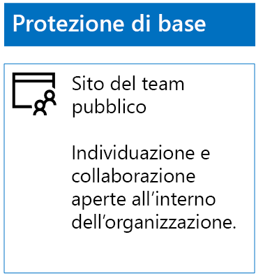
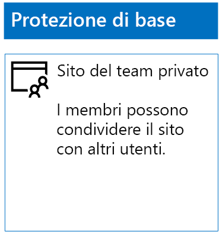
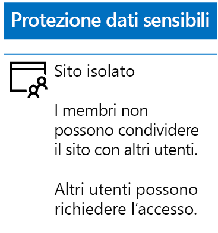
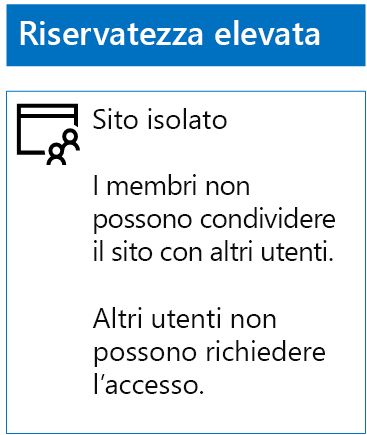

# Distribuire siti di SharePoint Online per tre livelli di protezioneDeploy SharePoint Online sites for three tiers of protection

 **Sintesi**: creare e configurare siti del team di SharePoint Online per diversi livelli di protezione delle informazioni.**Summary:** Create and configure SharePoint Online team sites for various levels of information protection.
  
Usare i passaggi descritti in questo articolo per progettare e distribuire siti del team di SharePoint Online di base, sensibili e con riservatezza elevata. Per altre informazioni su questi tre livelli di protezione, vedere [Proteggere siti e file di SharePoint Online](secure-sharepoint-online-sites-and-files.md).Use the steps in this article to design and deploy baseline, sensitive, and highly confidential SharePoint Online team sites. For more information about these three tiers of protection, see [Secure SharePoint Online sites and files](secure-sharepoint-online-sites-and-files.md).
  
## Siti del team di SharePoint Online di baseBaseline SharePoint Online team sites

La protezione di siti di base include siti del team pubblici e privati. I siti del team pubblici possono essere individuati e usati da qualsiasi persona dell'organizzazione. I siti privati possono essere individuati e usati solo dai membri del gruppo di Office 365 associato al sito del team. Entrambi questi tipi di siti del team consentono ai membri di condividere il sito con altri utenti.Baseline protection includes both public and private team sites. Public team sites can be discovered and accessed by anybody in the organization. Private sites can only be discovered and accessed by members of the Office 365 group associated with the team site. Both of these types of team sites allow members to share the site with others.
  
### PubblicoPublic

Per creare un sito del team di SharePoint Online di base con accesso pubblico e autorizzazioni, seguire questa procedura:To create a baseline SharePoint Online team site with public access and permissions, do the following:
  
1. Accedere all'interfaccia di amministrazione con un account che verrà usato anche per amministrare il sito del team di SharePoint Online (un amministratore di SharePoint Online).Sign in to the Office 365 portal with an account that will also be used to administer the SharePoint Online team site (a SharePoint Online administrator). Per informazioni, vedere [Dove accedere a Office 365](https://support.office.com/Article/Where-to-sign-in-to-Office-365-e9eb7d51-5430-4929-91ab-6157c5a050b4).For help, see [Where to sign in to Office 365](https://support.office.com/Article/Where-to-sign-in-to-Office-365-e9eb7d51-5430-4929-91ab-6157c5a050b4).
    
2. Nell'elenco dei riquadri fare clic su **SharePoint**.In the list of tiles, click **SharePoint**.
    
3. Nella nuova scheda **SharePoint** del browser fare clic su + **Crea sito**.On the new **SharePoint** tab in your browser, click **+ Create site**.
    
4. Nella pagina **Crea sito** fare clic su **Sito del team**.On the **Create a site** page, click **Team site**.
    
5. In **Nome sito** digitare il nome del sito del team pubblico.In **Site name**, type a name for the public team site. 
    
6. In **Team site description** (Descrizione sito del team) digitare una descrizione dello scopo del sito.In **Team site description**, type a description of the purpose of the site.
    
7. In **Impostazioni privacy** selezionare **Public – anyone in the organization can access this site** (Pubblico: qualsiasi persona dell'organizzazione può accedere a questo sito) e quindi fare clic su **Avanti**.In **Privacy settings**, select **Public - anyone in the organization can access this site**, and then click **Next**.
    
8. Nel riquadro **Who do you want to add?** (Chi si desidera aggiungere?) fare clic su **Fine**.On the **Who do you want to add?** pane, click **Finish**.
    
Di seguito è riportata la configurazione risultante.Here is your resulting configuration.
  

  
### PrivatePrivate

Per creare un sito del team di SharePoint Online di base con accesso privato e autorizzazioni, seguire questa procedura:To create a baseline SharePoint Online team site with private access and permissions, do the following:
  
1. Accedere all'interfaccia di amministrazione con un account che verrà usato anche per amministrare il sito del team di SharePoint Online (un amministratore di SharePoint Online).Sign in to the Office 365 portal with an account that will also be used to administer the SharePoint Online team site (a SharePoint Online administrator). Per informazioni, vedere [Dove accedere a Office 365](https://support.office.com/Article/Where-to-sign-in-to-Office-365-e9eb7d51-5430-4929-91ab-6157c5a050b4).For help, see [Where to sign in to Office 365](https://support.office.com/Article/Where-to-sign-in-to-Office-365-e9eb7d51-5430-4929-91ab-6157c5a050b4).
    
2. Nell'elenco dei riquadri fare clic su **SharePoint**.In the list of tiles, click **SharePoint**.
    
3. Nella nuova scheda **SharePoint** del browser fare clic su + **Crea sito**.On the new **SharePoint** tab in your browser, click **+ Create site**.
    
4. Nella pagina **Crea sito** fare clic su **Sito del team**.On the **Create a site** page, click **Team site**.
    
5. In **Nome sito** digitare il nome del sito del team privato.In **Site name**, type a name for the private team site. 
    
6. In **Team site description** (Descrizione sito del team) digitare una descrizione dello scopo del sito.In **Team site description,** type a description of the purpose of the site.
    
7. In **Impostazioni privacy** selezionare **Private - only members can access this site** (Privato: solo i membri possono accedere a questo sito) e quindi fare clic su **Avanti**.In **Privacy settings**, select **Private - only members can access this site**, and then click **Next**.
    
8. Nel riquadro **Who do you want to add?** (Chi si desidera aggiungere?) in **Aggiungi membri** digitare i nomi degli account utente che hanno accesso a questo sito del team privato.On the **Who do you want to add?** pane, in **Add members**, type the names of user accounts that have access to this private team site.
    
9. Quando il set iniziale di membri è stato aggiunto al sito, fare clic su **Fine**.When you are done adding the initial set of members to the site, click **Finish**
    
Di seguito è riportata la configurazione risultante.Here is your resulting configuration.
  

  
## Siti del team di SharePoint Online sensibiliSensitive SharePoint Online team sites

Un sito del team di SharePoint Online riservato è un sito del team isolato. Ciò significa che le autorizzazioni vengono controllate tramite l'appartenenza ai gruppi di SharePoint anziché tramite l’appartenenza al gruppo di Office 365 associato al sito del team.A sensitive SharePoint Online team site is an isolated team site, which means that permissions are controlled through membership in SharePoint groups instead of membership in the Office 365 group associated with the team site.
  
Per creare un sito del team isolato, sono disponibili due passaggi principali.To create an isolated team site, there are two main steps.
  
### Passaggio 1: Progettare un sito isolatoStep 1: Design your isolated site

Per progettare un sito del team isolato è necessario stabilire:To design your isolated team site, you need to determine:
  
- I gruppi di SharePoint e i livelli di autorizzazione.Your SharePoint groups and permission levels.
    
- Il set di gruppi di accesso che saranno membri dei gruppi di SharePoint.The set of access groups that will be members of your SharePoint groups.
    
     Il set di gruppi di accesso consigliato è uno per i membri del sito, uno per i visualizzatori del sito e uno per gli amministratori del sito.The recommended set of access groups is one for site members, one for site viewers, and one for site administrators.
    
- Se verranno usati gruppi nidificati all'interno dei gruppi di accesso.Whether you will use nested groups within your access groups.
    
Ad esempio, la struttura dei gruppi e i livelli di autorizzazione consigliati sono simili ai seguenti:For example, the recommended group structure and permission levels look like this:
  
|**Gruppo di SharePoint****SharePoint group**|**Livello di autorizzazione****Permission level**|**Gruppo di accesso (esempi)****Access group (examples)**|
|:-----|:-----|:-----|
|Membri di [nome sito][site name] Members    |ModificaEdit    |Membri di [nome sito][site name] Members    |
|Visitatori di [nome sito][site name] Visitors    |LetturaRead    |Visualizzatori di [nome sito][site name] Viewers    |
|Proprietari di [nome sito][site name] Owners    |Controllo completoFull control    |Amministratori di [nome sito][site name] Admins    |
   
Per un sito del team, i gruppi e i livelli di autorizzazione di SharePoint vengono creati per impostazione predefinita. È necessario stabilire i nomi dei gruppi di accesso.The SharePoint groups and permission levels are created by default for a team site. You need to determine the names of your access groups.
  
Per i dettagli del processo di progettazione, vedere [Progettare un sito del team SharePoint Online isolato](design-an-isolated-sharepoint-online-team-site.md).For the details of the design process, see [Design an isolated SharePoint Online team site](design-an-isolated-sharepoint-online-team-site.md).
  
### Passaggio 2: Distribuire un sito isolatoStep 2: Deploy your isolated site

Per distribuire un sito isolato è innanzitutto necessario:To deploy your isolated site, you first need to:
  
- Stabilire gli account utente e i gruppi da aggiungere a ogni gruppo di accesso.Determine the user accounts and groups to add to each of your access groups.
    
- Creare i gruppi di accesso e aggiungere i membri di tipo utente e gruppo.Create the access groups and add the user and group members.
    
Per istruzioni dettagliate, vedere la **Fase 1** di [Distribuire un sito del team di SharePoint Online isolato](deploy-an-isolated-sharepoint-online-team-site.md).For the detailed steps, see **Phase 1** of [Deploy an isolated SharePoint Online team site](deploy-an-isolated-sharepoint-online-team-site.md).
  
Successivamente, creare il sito del team di SharePoint Online seguendo questi passaggi.Next, you create the SharePoint Online team site with these steps.
  
1. Accedere all'interfaccia di amministrazione con un account che verrà usato anche per amministrare il sito del team di SharePoint Online (un amministratore di SharePoint Online).Sign in to the Office 365 portal with an account that will also be used to administer the SharePoint Online team site (a SharePoint Online administrator). Per informazioni, vedere [Dove accedere a Office 365](https://support.office.com/Article/Where-to-sign-in-to-Office-365-e9eb7d51-5430-4929-91ab-6157c5a050b4).For help, see [Where to sign in to Office 365](https://support.office.com/Article/Where-to-sign-in-to-Office-365-e9eb7d51-5430-4929-91ab-6157c5a050b4).
    
2. Nell'elenco dei riquadri fare clic su **SharePoint**.In the list of tiles, click **SharePoint**.
    
3. Nella nuova **scheda SharePoint** del browser fare clic su **+ Crea sito**.In the new **SharePoint** tab of your browser, click **+ Create site**.
    
4. Nella pagina **Crea sito** fare clic su **Sito del team**.On the **Create a site** page, click **Team site**.
    
5. In **Nome sito** digitare il nome del sito del team privato.In **Site name**, type a name for the private team site.
    
6. Nella descrizione **Sito del team** digitare una descrizione facoltativa.In **Team site description**, type an optional description.
    
7. In **Impostazioni privacy** selezionare **Private - only members can access this site** (Privato: solo i membri possono accedere a questo sito) e quindi fare clic su **Avanti**.In **Privacy settings**, select **Private - only members can access this site**, and then click **Next**.
    
8. Nel riquadro **Who do you want to add?** (Chi si desidera aggiungere?) fare clic su **Fine**.On the **Who do you want to add?** pane, click **Finish**.
    
Successivamente, dal nuovo sito del team di SharePoint Online configurare le autorizzazioni seguendo questi passaggi.Next, from the new SharePoint Online team site, configure permissions with these steps.
  
1. Determinare il Nome dell'entità utente (UPN) di cui l'amministratore IT o altra persona sarà responsabile per rispondere a e indirizzare le richieste di accesso al sito (un esempio di UPN è belindan@contoso.com).Determine the User Principal Name (UPN) of the IT administrator or other person who will be responsible for responding to and addressing requests for access to the site (belindan@contoso.com is an example of a UPN). 
    
2. Nella barra degli strumenti fare clic sull'icona delle impostazioni, quindi su **Autorizzazioni sito**.In the tool bar, click the settings icon, and then click **Site permissions**.
    
3. Nel riquadro **Autorizzazioni sito** fare clic su **Advanced permissions settings** (Impostazioni autorizzazioni avanzate).In the **Site permissions** pane, click **Advanced permissions settings**.
    
4. Nella nuova scheda **Autorizzazioni** del browser fare clic su **Impostazioni richieste di accesso**.On the new **Permissions** tab of your browser, click **Access Request Settings**.
    
5. Nella finestra di dialogo **Impostazioni richieste di accesso**:In the **Access Requests Settings** dialog box:
    
  - Deselezionare le caselle di controllo **Consenti ai membri di condividere il sito e singoli file e cartelle** e **Consenti ai membri di invitare altre persone nel gruppo di membri del sito**.Clear the **Allow members to share the site and individual files and folders** and **Allow members to invite others to the site members group** check boxes.
    
  - Digitare il nome dell'entità utente dell'amministratore IT al passaggio 1 in **Invia tutte le richieste di accesso**.Type the UPN of your IT administrator from step 1 in **Send all requests for access**.
    
  - Fare clic su **OK**.Click **OK**.
    
6. Nella scheda **Autorizzazioni** del browser fare clic su **Membri di [nome sito]** nell'elenco.On the **Permissions** tab of your browser, click **[site name] Members** in the list.
    
7. In **Utenti e gruppi** fare clic su **Nuovo**.In **People and Groups**, click **New**.
    
8. Nella finestra di dialogo **Condividi** digitare il nome del gruppo di accesso dei membri del sito per questo sito, selezionarlo e quindi fare clic su **Condividi**.In the **Share** dialog box, type the name of your site members access group for this site, select it, and then click **Share**.
    
9. Fare clic sul pulsante Indietro del browser.Click the back button on your browser.
    
10. Fare clic su **Proprietari di <nome del sito>** nell'elenco.Click **[site name] Owners** in the list.
    
11. In **Utenti e gruppi** fare clic su **Nuovo**.In **People and Groups**, click **New**.
    
12. Nella finestra di dialogo **Condividi** digitare il nome del gruppo di accesso degli amministratori del sito per questo sito, selezionarlo e quindi fare clic su **Condividi**.In the **Share** dialog box, type the name of the site administrators access group for this site, select it, and then click **Share**.
    
13. Fare clic sul pulsante Indietro del browser.Click the back button on your browser.
    
14. Fare clic su **Visitatori di <nome del sito>** nell'elenco.Click **[site name] Visitors** in the list.
    
15. In **Utenti e gruppi** fare clic su **Nuovo**.In **People and Groups**, click **New**.
    
16. Nella finestra di dialogo **Condividi** digitare il nome del gruppo di accesso dei visualizzatori del sito per questo sito, selezionarlo e quindi fare clic su **Condividi**.In the **Share** dialog box, type the name of the site viewers access group for this site, select it, and then click **Share**.
    
17. Chiudere la scheda **Autorizzazioni** del browser.Close the **Permissions** tab of your browser.
    
I risultati di queste impostazioni delle autorizzazioni sono i seguenti:The results of these permission settings are:
  
- Il gruppo di SharePoint **Proprietari di [nome sito]** contiene il gruppo di accesso degli amministratori del sito in cui tutti i membri hanno il livello di autorizzazione **Controllo completo**.The **[site name] Owners** SharePoint group contains the site administrators access group, in which all the members have the **Full control** permission level.
    
- Il gruppo di SharePoint **Membri di [nome sito]** contiene il gruppo di accesso dei membri del sito in cui tutti i membri hanno il livello di autorizzazione **Modifica**.The **[site name] Members** SharePoint group contains the site members access group, in which all the members have the **Edit** permission level.
    
- Il gruppo di SharePoint **Visitatori di [nome sito]** contiene il gruppo di accesso dei visualizzatori del sito in cui tutti i membri hanno il livello di autorizzazione **Lettura**.The **[site name] Visitors** SharePoint group contains the site viewers access group, in which all the members have the **Read** permission level.
    
- La possibilità per i membri di invitare altri membri è disabilitata.The ability for members to invite other members is disabled.
    
- La possibilità per gli utenti non membri di richiedere l'accesso è abilitata.The ability for non-members to request access is enabled.
    
Di seguito è riportata la configurazione risultante.Here is your resulting configuration.
  

  
I membri del sito, attraverso l'appartenenza a uno dei gruppi di accesso, possono ora collaborare in modo sicuro alle risorse del sito.The members of the site, through group membership in one of the access groups, can now securely collaborate on the resources of the site.
  
## Siti del team di SharePoint Online con riservatezza elevataHighly confidential SharePoint Online team sites

Un sito del team di SharePoint Online con riservatezza elevata è un sito del team isolato in cui le autorizzazioni sono controllate tramite l'appartenenza ai gruppi di SharePoint anziché l'appartenenza al gruppo di Office 365 associato al sito del team.A highly confidential SharePoint Online team site is an isolated team site, which means that permissions are controlled through membership in SharePoint groups instead of membership in the Office 365 group associated with the team site.
  
La creazione di un sito del team isolato per le informazioni e la collaborazione con riservatezza elevata richiede due passaggi principali.To create an isolated team site for highly confidential information and collaboration, there are two main steps.
  
### Passaggio 1: Progettare un sito isolatoStep 1: Design your isolated site

Per progettare un sito del team isolato è necessario stabilire:To design your isolated team site, you need to determine:
  
- I gruppi di SharePoint e i livelli di autorizzazione.Your SharePoint groups and permission levels.
    
- Il set di gruppi di accesso che saranno membri dei gruppi di SharePoint.The set of access groups that will be members of your SharePoint groups.
    
     Il set di gruppi di accesso consigliato è uno per i membri del sito, uno per i visualizzatori del sito e uno per gli amministratori del sito.The recommended set of access groups is one for site members, one for site viewers, and one for site administrators.
    
- Se verranno usati gruppi nidificati all'interno dei gruppi di accesso.Whether you will use nested groups within your access groups.
    
Ad esempio, la struttura dei gruppi e i livelli di autorizzazione consigliati sono simili ai seguenti:For example, the recommended group structure and permission levels look like this:
  
|**Gruppo di SharePoint****SharePoint group**|**Livello di autorizzazione****Permission level**|**Gruppo di accesso (esempi)****Access group (examples)**|
|:-----|:-----|:-----|
|Membri di [nome sito][site name] Members    |ModificaEdit    |Membri di [nome sito][site name] Members    |
|Visitatori di [nome sito][site name] Visitors    |LetturaRead    |Visualizzatori di [nome sito][site name] Viewers    |
|Proprietari di [nome sito][site name] Owners    |Controllo completoFull control    |Amministratori di [nome sito][site name] Admins    |
   
Per un sito del team, i gruppi e i livelli di autorizzazione di SharePoint vengono creati per impostazione predefinita. È necessario stabilire i nomi dei gruppi di accesso.The SharePoint groups and permission levels are created by default for a team site. You need to determine the names of your access groups.
  
Per i dettagli del processo di progettazione, vedere [Progettare un sito del team SharePoint Online isolato](design-an-isolated-sharepoint-online-team-site.md).For the details of the design process, see [Design an isolated SharePoint Online team site](design-an-isolated-sharepoint-online-team-site.md).
  
### Passaggio 2: Distribuire un sito isolatoStep 2: Deploy your isolated site

Per distribuire un sito isolato è innanzitutto necessario:To deploy your isolated site, you first need to:
  
- Determinare l’utente e i membri del gruppo di ciascun gruppo di accessoDetermine the user and group members of each of your access groups
    
- Creare gruppi di accesso e aggiungere l’utente e i membri dei gruppiCreate the access groups and add the user and group members
    
- Creare un sito del team isolato che utilizzi i gruppi di accessoCreate an isolated team site that uses your access groups
    
Per istruzioni dettagliate, vedere [Distribuire un sito del team di SharePoint Online isolato](deploy-an-isolated-sharepoint-online-team-site.md).For the detailed steps, see [Deploy an isolated SharePoint Online team site](deploy-an-isolated-sharepoint-online-team-site.md).
  
I risultati di queste impostazioni delle autorizzazioni sono:The results of the permission settings are:
  
- Il gruppo di SharePoint **Proprietari di [nome sito]** contiene il gruppo di accesso degli amministratori del sito in cui tutti i membri hanno il livello di autorizzazione **Controllo completo**.The **[site name] Owners** SharePoint group contains the site administrators access group, in which all the members have the **Full control** permission level.
    
- Il gruppo di SharePoint **Membri di [nome sito]** contiene il gruppo di accesso dei membri del sito in cui tutti i membri hanno il livello di autorizzazione **Modifica**.The **[site name] Members** SharePoint group contains the site members access group, in which all the members have the **Edit** permission level.
    
- Il gruppo di SharePoint **Visitatori di [nome sito]** contiene il gruppo di accesso dei visualizzatori del sito in cui tutti i membri hanno il livello di autorizzazione **Lettura**.The **[site name] Visitors** SharePoint group contains the site viewers access group, in which all the members have the **Read** permission level.
    
- La possibilità per i membri di invitare altri membri è disabilitata.The ability for members to invite other members is disabled.
    
- La possibilità per gli utenti non membri di richiedere l'accesso è disabilitata.The ability for non-members to request access is disabled.
    
Di seguito è riportata la configurazione risultante.Here is your resulting configuration.
  

  
I membri del sito, attraverso l'appartenenza a uno dei gruppi di accesso, possono ora collaborare in modo sicuro alle risorse del sito.The members of the site, through group membership in one of the access groups, can now securely collaborate on the resources of the site.
  
## Passaggio successivoNext step

[Proteggere i file di SharePoint Online con le etichette di Office 365 e la prevenzione della perdita dei datiProtect SharePoint Online files with Office 365 labels and DLP](protect-sharepoint-online-files-with-office-365-labels-and-dlp.md)

## Vedere ancheSee also

[Protezione di file e siti di SharePoint OnlineSecure SharePoint Online sites and files](secure-sharepoint-online-sites-and-files.md)
  
[Guida sulla sicurezza Microsoft per organizzazioni che si occupano della campagna politica, no profit e altre organizzazioni AgileMicrosoft Security Guidance for Political Campaigns, Nonprofits, and Other Agile Organizations](microsoft-security-guidance-for-political-campaigns-nonprofits-and-other-agile-o.md)
  
[Adozione del cloud e soluzioni ibrideCloud adoption and hybrid solutions](https://docs.microsoft.com/office365/enterprise/cloud-adoption-and-hybrid-solutions)
