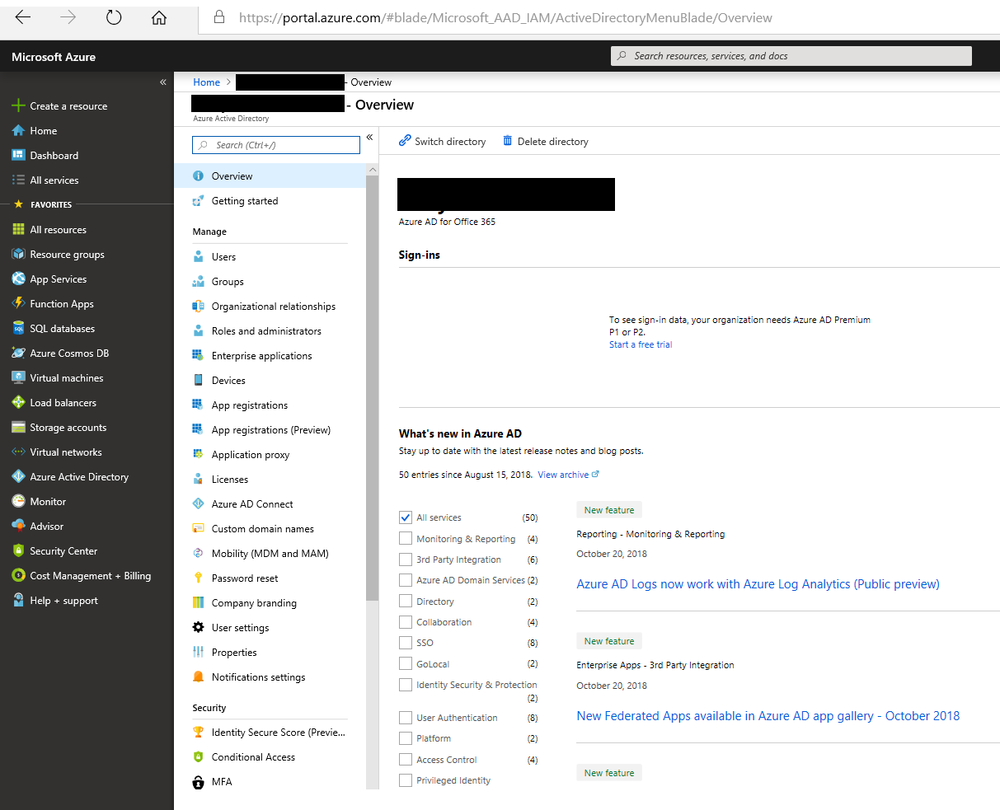

# Distribuire un connettore per archiviare i dati di Twitter in Office 365

Questo articolo contiene il processo dettagliato per la distribuzione di un connettore che utilizza il servizio di importazione di Office 365 per importare i dati dall'account Twitter dell'organizzazione a Office 365. Per una panoramica generale di questo processo e un elenco dei prerequisiti necessari per distribuire un connettore Twitter, vedere [use a sample Connector to Archive Twitter data in Office 365 (Preview)](archive-twitter-data-with-sample-connector.md). 

## Passaggio 1: scaricare il pacchetto

Scaricare il pacchetto precompilato dalla sezione Release nell'archivio GitHub all'indirizzo [https://github.com/microsoft/m365-sample-twitter-connector-csharp-aspnet/releases](https://github.com/microsoft/m365-sample-twitter-connector-csharp-aspnet/releases). Nella versione più recente, scaricare il file zip denominato **SampleConnector. zip**. Il file zip verrà caricato in Azure nel passaggio 4.

## Passaggio 2: creare un'app in Azure Active Directory

1. Accedere a <https://portal.azure.com> e accedere con le credenziali di un account di amministratore globale di Office 365.

   

2. Nel riquadro di spostamento a sinistra, fare clic su **Azure Active Directory**.

   

3. Nel riquadro di spostamento a sinistra, fare clic su **registrazioni app (anteprima)** e quindi fare clic su **nuova registrazione**.

   

4. Registrare l'applicazione. In **URI di reindirizzamento (facoltativo)** selezionare Web nell'elenco a discesa tipo di applicazione e quindi <https://portal.azure.com> digitare nella casella relativa all'URI.

   

5. Copiare l'ID dell' **applicazione (client)** e la **Directory (tenant)** e salvarli in un file di testo o in un'altra posizione sicura. Questi ID verranno utilizzati nei passaggi successivi.

    

6. Vai a **certificati & segreti per la nuova app** e in **segreti client** fare clic su **nuovo segreto client**.

   

7. Creare un nuovo segreto. Nella casella Descrizione digitare il segreto e quindi scegliere un periodo di scadenza. 

   

8. Copiare il valore del segreto e salvarlo in un file di testo o in un altro percorso di archiviazione. Si tratta del segreto dell'applicazione AAD che verrà utilizzato nei passaggi successivi.

   

9. Andare a **manifest** e copiare il identifierUris (denominato anche URI dell'applicazione AAD) come evidenziato nella schermata seguente. Copiare l'URI dell'applicazione AAD in un file di testo o in un altro percorso di archiviazione. Verrà utilizzato nel passaggio 6.

    

## Passaggio 3: creare un account di archiviazione di Azure

1.  Passare alla Home page di Azure per l'organizzazione.

    

2. Fare clic su **Crea una risorsa** e digitare **account di archiviazione** nella casella di ricerca.

   

3. Fare clic su **spazio di archiviazione**e quindi su **account di archiviazione**.

   

4. Nella pagina **Crea account di archiviazione** , nella casella sottoscrizione, selezionare **pay-as-you-go** o **versione di valutazione gratuita** a seconda del tipo di sottoscrizione di Azure di cui si dispone. 

   

5. Selezionare o creare un gruppo di risorse.

   

6. Digitare un nome per l'account di archiviazione.

   

7. Esaminare e quindi fare clic su **Crea** per creare l'account di archiviazione.

   

8. Dopo alcuni istanti, fare clic su **Aggiorna** e quindi su **Vai a risorsa** per passare all'account di archiviazione.

   

9. Fare clic su **tasti di accesso** nel riquadro di spostamento a sinistra.

   

10. Copiare una **stringa di connessione** e salvarla in un file di testo o in un altro percorso di archiviazione. Questa operazione viene utilizzata quando si crea una risorsa Web App nel passaggio 4.

    

## Passaggio 4: creare una nuova risorsa Web App in Azure

1. Nella **Home** page del portale di Azure, fare clic su **Crea una \> risorsa \> tutto Web App**. Nella pagina **Web App** fare clic su **Crea**.

   

2. Inserire i dettagli (come illustrato di seguito) e quindi creare l'applicazione Web. Si noti che il nome immesso nella casella **nome app** verrà utilizzato per creare l'URL del servizio app di Azure; ad esempio twitterconnector.azurewebsites.net.

   

3. Passare alla nuova risorsa Web App creata, fare clic su **Impostazioni applicazione** nel riquadro di spostamento sinistro. In **Impostazioni applicazione**fare clic su **Aggiungi nuova impostazione** e quindi aggiungere le tre impostazioni seguenti. Utilizzare i valori (copiati nel file di testo dai passaggi precedenti): 

    - **APISecretKey** – è possibile digitare qualsiasi valore come segreto. Questa operazione verrà utilizzata per accedere all'applicazione Web del connettore nel passaggio 7.

    - **StorageAccountConnectionString** : l'URI della stringa di connessione copiato dopo la creazione dell'account di archiviazione di Azure nel passaggio 3.

    - **tenantId** -l'ID tenant dell'organizzazione di Office 365 copiato dopo aver creato l'app Twitter Connector in Azure Active Directory nel passaggio 2.

    

4. In **Impostazioni generali**, fare clic **su** avanti accanto a **sempre attiva**. Fare clic su **Salva** nella parte superiore della pagina per salvare le impostazioni dell'applicazione.

   

5. Il passaggio finale consiste nel caricare il codice sorgente dell'app del connettore in Azure scaricato nel passaggio 1. In un Web browser, passare a https://<AzureAppResourceName>. SCM.azurewebsites.NET/ZipDeployUi. Ad esempio, se il nome della risorsa dell'app di Azure (denominato nel passaggio 2 di questa sezione) è **twitterconnector**, si passa a https://twitterconnector.scm.azurewebsites.net/ZipDeployUi.

6. Trascinare e rilasciare il SampleConnector. zip (scaricato nel passaggio 1) in questa pagina. Dopo che i file sono stati caricati e la distribuzione ha esito positivo, la pagina avrà un aspetto simile alla schermata seguente.

   

## Passaggio 5: creare l'app Twitter

1. Accedere a https://developer.twitter.com, eseguire l'accesso usando le credenziali per l'account di sviluppo per l'organizzazione, quindi fare clic su **app**.

   
2. Fare clic su **Crea un'app**.
   
   

3. In **Dettagli app**aggiungere informazioni sull'applicazione.

   

4. Nel dashboard per sviluppatori di Twitter, selezionare l'app appena creata e copiare l'ID app visualizzato e salvarlo in un file di testo o in un altro percorso di archiviazione. Quindi fare clic su **Dettagli**.
   
   

5. Nella scheda **tasti e token** , in **tasti API consumer** copiare la chiave segreta API e salvarla in un file di testo o in un altro percorso di archiviazione. Fare quindi clic su **Crea** per generare un token di accesso e un segreto del token di accesso e copiarli in un file di testo o in un altro percorso di archiviazione.
   
   

   Fare quindi clic su **Crea** per generare un token di accesso e un segreto del token di accesso e copiarli in un file di testo o in un altro percorso di archiviazione.

6. Fare clic sulla scheda **autorizzazioni** e configurare le autorizzazioni come illustrato nella schermata seguente:

   

7. Dopo aver salvato le impostazioni di autorizzazione, fare clic sulla scheda **Dettagli applicazione** e quindi fare clic su **modifica > modifica dettagli**.

   

8. Eseguire le attività seguenti:

   - Seleziona la casella di controllo per consentire all'app del connettore di accedere a Twitter.
   
   - Aggiungere l'URI di reindirizzamento OAuth utilizzando il formato seguente: ** \<connectorserviceuri>/views/TwitterOAuth**, in cui il valore di *connectorserviceuri* è l'URL del servizio app di Azure per l'organizzazione. ad esempio https://twitterconnector.azurewebsites.net/Views/TwitterOAuth.

   

L'app per sviluppatori di Twitter è ora pronta per essere utilizzata.

## Passaggio 6: configurare l'applicazione Web del connettore 

1. Passare a https://\<AzureAppResourceName>. azurewebsites. NET (dove **AzureAppResourceName** è il nome della risorsa di Azure App denominata nel passaggio 4), ad esempio, se il nome è **twitterconnector**, andare a https://twitterconnector.azurewebsites.net. La Home page dell'app avrà lo stesso aspetto della schermata seguente.

   

2. Fare clic su **Configura** per visualizzare una pagina di accesso.

   

3. Nella casella ID tenant digitare o incollare l'ID tenant (ottenuto nel passaggio 2). Nella casella password digitare o incollare il APISecretKey (ottenuto nel passaggio 2), quindi fare clic su **imposta impostazioni di configurazione** per visualizzare la pagina **Dettagli di configurazione** .

   

4. In **Dettagli di configurazione**, immettere le impostazioni di configurazione seguenti 

   - **ID applicazione Twitter** -ID app per l'applicazione Twitter creata al passaggio 5.
   - **Segreto dell'applicazione Twitter** -la chiave segreta API per l'applicazione Twitter creata al passaggio 5.
   - **Token client Twitter** -il token di accesso creato nel passaggio 5.
   - **Segreto del token client Twitter** -il token di accesso segreto creato nel passaggio 5.
   - **ID applicazione AAD** -ID applicazione per l'app Azure Active Directory creata al passaggio 2
   - **Segreto dell'applicazione AAD** : il valore del segreto di APISecretKey creato nel passaggio 4.
   - **URI dell'applicazione AAD** -URI dell'applicazione AAD ottenuto nel passaggio 2; ad esempio, https://microsoft.onmicrosoft.com/2688yu6n-12q3-23we-e3ee-121111123213.
   - **Chiave di strumentazione Insights app** -lasciare vuota questa casella.

5. Fare clic su **Salva** per salvare le impostazioni del connettore.

## Passaggio 7: configurare un connettore personalizzato nel centro sicurezza e conformità

1.  Andare a <https://protection.office.com> e quindi fare clic su data **governance \> Import \> Archive data di terze parti**.

    

2. Fare clic su **Aggiungi connettore** e quindi su **Twitter**.

   

3. Nella pagina **Aggiungi applicazione del connettore** , immettere le informazioni seguenti e quindi fare clic su **convalida connettore**.

    - Nella prima casella digitare un nome per il connettore, ad esempio **Twitter**.
    - Nella seconda casella digitare o incollare il valore dell'APISecretKey aggiunto nel passaggio 4.
    - Nella terza casella digitare o incollare l'URL del servizio app di Azure; ad esempio **https://twitterconnector.azurewebsites.net**.

   Dopo che il connettore è stato convalidato, fare clic su **Avanti**.

   

4. Fare clic su **login con app connettore**.

   

5. Digitare o incollare di nuovo il APISecretKey e quindi fare clic su **accedi al servizio connettore**.

   

6. Fare clic su **continua con Twitter**.

7. Nella pagina di accesso di Twitter, accedere usando le credenziali per l'account per l'account Twitter dell'organizzazione.

   

   Dopo aver eseguito l'accesso, nella pagina Twitter verrà visualizzato il messaggio seguente: "il processo del connettore di Twitter è stato configurato correttamente".

8. Fare clic su **fine** per completare la configurazione del connettore Twitter.

9. Nella pagina **Imposta filtri** è possibile applicare un filtro per importare e archiviare gli elementi di una determinata età. Fare clic su **Avanti**.

   

10. Nella pagina **Imposta account di archiviazione** selezionare la cassetta postale di Office 365 in cui verranno importati gli elementi di Twitter.

    

11. Esaminare le impostazioni e quindi fare clic su **fine** per completare la configurazione del connettore nel centro sicurezza & Compliance.

    

    

12. Passare alla pagina di **archiviazione dei dati di terze parti** per visualizzare lo stato di avanzamento del processo di importazione.

    
