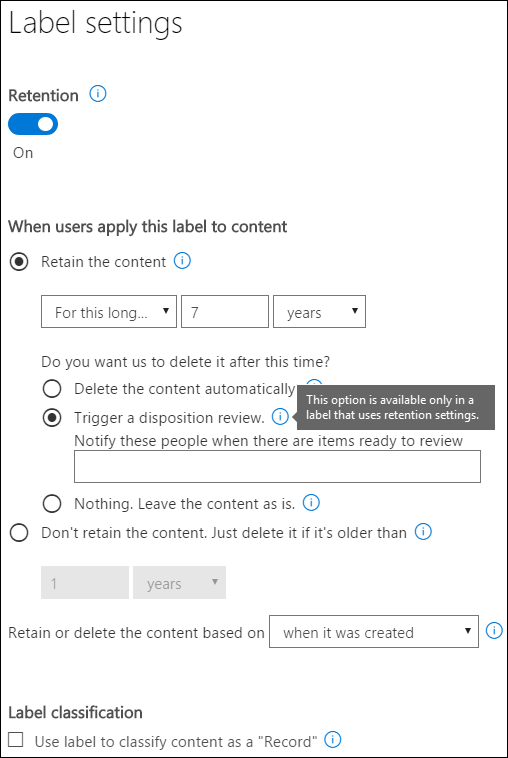

# Panoramica delle recensioni sulla disposizione

Quando il contenuto raggiunge la fine del periodo di conservazione, è possibile che si desideri rivedere il contenuto per decidere se può essere eliminato in modo sicuro ("Disposed"). Ad esempio, potrebbe essere necessario:
  
- Sospendere l'eliminazione ("Disposition") del contenuto pertinente in caso di controversia legale o di controllo.
    
- Rimuovere il contenuto dall'elenco di disposizione per archiviarlo in un archivio, se il contenuto ha una ricerca o un valore cronologico.
    
- Assegnare un periodo di conservazione diverso al contenuto, se il criterio originale era una soluzione temporanea o provvisoria.
    
- Restituire il contenuto ai client o trasferirlo in un'altra organizzazione.
    
Quando si crea un'etichetta di conservazione in Microsoft 365 Compliance Center, Microsoft 365 Security Center o Office 365 Security & Compliance Center, è possibile scegliere di attivare una revisione della disposizione alla fine del periodo di conservazione. In una recensione di disposizione:
  
- Gli utenti che scelgono ricevono una notifica tramite posta elettronica che dispongono di contenuto da esaminare. Questi revisori possono essere singoli utenti, gruppi di distribuzione o di sicurezza o gruppi di Office 365. Si noti che le notifiche vengono inviate su base settimanale.
    
- I revisori passano alla pagina **disposizione** nel centro sicurezza &amp; e conformità per esaminare il contenuto. I revisori possono vedere quanti elementi per ogni etichetta di conservazione sono in attesa di disposizione, quindi selezionare un'etichetta di conservazione per visualizzare tutto il contenuto con quell'etichetta.
    
- Per ogni documento o messaggio di posta elettronica, il revisore può:
    
  - Applicare un'etichetta di conservazione diversa.
    
  - Estendere il periodo di conservazione.
    
  - Eliminarlo definitivamente.
    
- I revisori possono visualizzare le disposizioni in sospeso o completate ed esportare tale elenco come file. csv.

> [!NOTE]
> Le recensioni sulla disposizione richiedono un abbonamento a Office 365 Enterprise E5.
  
Una recensione di disposizione può includere il contenuto nelle cassette postali di Exchange, siti di SharePoint, account di OneDrive e gruppi di Office 365. Il contenuto in attesa di una revisione della disposizione in tali posizioni viene eliminato solo dopo che un revisore sceglie di eliminare definitivamente il contenuto.
  

## Impostazione della revisione della disposizione mediante la creazione di un'etichetta di conservazione

Si tratta del flusso di lavoro di base per l'impostazione di una revisione di disposizione. Si noti che questo flusso Visualizza un'etichetta di conservazione che viene pubblicata e quindi applicata manualmente da un utente. in alternativa, un'etichetta di conservazione che attiva una revisione della disposizione può essere applicata automaticamente al contenuto.
  

  
Una recensione di disposizione è un'opzione quando si crea un'etichetta di conservazione in Office 365. Si noti che questa opzione non è disponibile in un criterio di conservazione, ma solo in un'etichetta di conservazione configurata per mantenere il contenuto.
  
Per ulteriori informazioni sulle etichette di conservazione, vedere [Overview of](labels.md)retention labels.
  

  
## Eliminazione del contenuto

Quando un revisore riceve una notifica tramite posta elettronica che il contenuto è pronto per la revisione, può **** accedere alla pagina di disposizione &amp; nel centro sicurezza e conformità. I revisori possono vedere quanti elementi per ogni etichetta di conservazione sono in attesa di disposizione, quindi selezionare un'etichetta di conservazione per visualizzare tutto il contenuto con quell'etichetta.

Dopo aver selezionato un'etichetta di conservazione, la pagina successiva Visualizza tutte le disposizioni in sospeso per tale etichetta.

Il revisore può quindi: 
  
- Applicare un'etichetta di conservazione diversa.
    
- Estendere il periodo di conservazione.
    
- Elimina definitivamente l'elemento.

Si noti che un revisore può selezionare più elementi e disporne contemporaneamente.
    
Un revisore può anche utilizzare il collegamento per visualizzare il documento nel relativo percorso originale, se il revisore dispone delle autorizzazioni per tale percorso. Durante una revisione della disposizione, il contenuto non si sposta mai dal percorso originale e non viene mai eliminato fino a quando il revisore non lo sceglie.
  
Si noti che le notifiche di posta elettronica vengono inviate automaticamente ai revisori su base settimanale. Pertanto, quando il contenuto raggiunge la fine del periodo di conservazione, potrebbero essere necessari fino a sette giorni affinché i revisori ricevano la notifica di posta elettronica che il contenuto è in attesa di disposizione.
  
Si noti inoltre che tutte le azioni di disposizione vengono controllate. Per garantire questo, è necessario abilitare il controllo almeno un giorno prima della prima azione di disposizione-per ulteriori informazioni, vedere [Search the audit log in the Office 365 &amp; Security Compliance Center](search-the-audit-log-in-security-and-compliance.md). 
  
## Autorizzazioni per la disposizione

Per accedere alla pagina **disposizione** , i revisori devono essere membri del ruolo **gestione disposizione** e del ruolo di **controllo di sola visualizzazione** . È consigliabile creare un nuovo gruppo di ruoli denominato reviewers Disposition, aggiungendo questi due ruoli a quel gruppo di ruoli e quindi aggiungendo membri al gruppo di ruoli. 
  
Per ulteriori informazioni, vedere [fornire agli utenti l'accesso al centro sicurezza &amp; e conformità di Office 365](grant-access-to-the-security-and-compliance-center.md)
  
## Durata dell'eliminazione definitiva del contenuto eliminato

Il contenuto in attesa di una revisione della disposizione viene eliminato solo dopo che un revisore sceglie di eliminare definitivamente il contenuto. Quando il revisore sceglie questa opzione, il contenuto del sito di SharePoint o dell'account OneDrive diventa idoneo per il processo di pulizia standard descritto in questa sezione: [modalità di funzionamento dei criteri di conservazione con il contenuto sul posto](retention-policies.md#how-a-retention-policy-works-with-content-in-place).
  
Questo significa che:
  
- Il contenuto di una raccolta documenti verrà spostato nel cestino del primo passaggio **entro 7 giorni** dalla disposizione e quindi definitivamente eliminato **93 giorni** . Il cestino non è indicizzato dalla ricerca e pertanto il relativo contenuto non è disponibile per un blocco di eDiscovery.

- Il contenuto della raccolta di conservazione rimarrà definitivamente eliminato **entro 7 giorni** dalla disposizione.

- Gli elementi in una cassetta postale di Exchange verranno eliminati definitivamente **entro 14 giorni** dalla disposizione. (Si noti che 14 giorni è l'impostazione predefinita, ma può essere configurata fino a 30 giorni).
    
## Visualizzare le disposizioni e gli elementi eliminati in sospeso

Nella pagina **disposizione in sospeso** , è possibile visualizzare le disposizioni in sospeso e completate per un'etichetta di conservazione specifica: 
  
- La **disposizione in sospeso** Visualizza gli elementi che hanno raggiunto la fine del periodo di conservazione e richiedono una revisione della disposizione. Dopo aver esaminato ogni elemento, decidere se si desidera applicare un'etichetta di conservazione diversa, estenderne il periodo di conservazione o eliminarla definitivamente. È possibile selezionare più elementi.
    
- La scheda **elementi eliminati** indica che le disposizioni sono state approvate per l'eliminazione durante una revisione della disposizione e sono ora in fase di eliminazione definitiva. Gli elementi in cui è stata applicata un'etichetta di conservazione diversa o il periodo di conservazione esteso nell'ambito di una revisione non verranno visualizzati in questa posizione.

    
### Filtrare le visualizzazioni di disposizione

È possibile filtrare queste visualizzazioni in base all'etichetta di conservazione o all'intervallo di tempo. Per le disposizioni in sospeso, l'intervallo di tempo si basa sulla data di scadenza. Per gli elementi eliminati, l'intervallo di tempo è basato sulla data di eliminazione.
  

### Esportare gli elementi di disposizione

È inoltre possibile esportare gli elementi in una visualizzazione come un file. csv che è possibile aprire in Excel.
  

  

