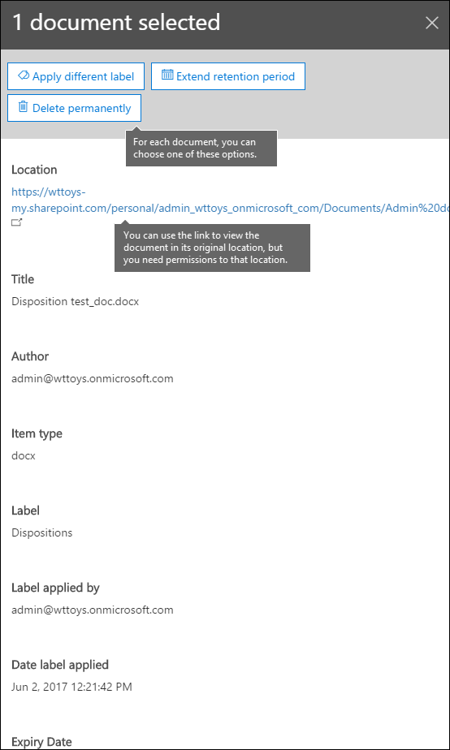

# Panoramica delle recensioni sulla disposizioneOverview of disposition reviews

Quando il contenuto raggiunge la fine del periodo di conservazione, è possibile che si desideri rivedere il contenuto per decidere se può essere eliminato in modo sicuro ("Disposed").When content reaches the end of its retention period, there are several reasons why you might want to review that content to decide whether it can be safely deleted ("disposed"). Ad esempio, potrebbe essere necessario:For example, you might need to:
  
- Sospendere l'eliminazione ("Disposition") del contenuto pertinente in caso di controversia legale o di controllo.Suspend the deletion ("disposition") of relevant content in the event of litigation or an audit.
    
- Rimuovere il contenuto dall'elenco di disposizione per archiviarlo in un archivio, se il contenuto ha una ricerca o un valore cronologico.Remove content from the disposition list to store in an archive, if that content has research or historical value.
    
- Assegnare un periodo di conservazione diverso al contenuto, se il criterio originale era una soluzione temporanea o provvisoria.Assign a different retention period to the content, if the original policy was a temporary or provisional solution.
    
- Restituire il contenuto ai client o trasferirlo in un'altra organizzazione.Return the content to clients or transfer it to another organization.
    
Quando si crea un'etichetta che conserva il contenuto di Office 365, è possibile scegliere di attivare una revisione della disposizione alla fine del periodo di conservazione.When you create a label that retains content in Office 365, you can choose to trigger a disposition review at the end of the retention period. In una recensione di disposizione:In a disposition review:
  
- Gli utenti che scelgono ricevono una notifica tramite posta elettronica che dispongono di contenuto da esaminare.The people you choose receive an email notification that they have content to review. Questi revisori possono essere singoli utenti, gruppi di distribuzione o di sicurezza o gruppi di Office 365.These reviewers can be individual users, distribution or security groups, or Office 365 groups. Si noti che le notifiche vengono inviate su base settimanale.Note that notifications are sent on a weekly basis.
    
- I revisori passano alla pagina **disposizione** nel centro sicurezza &amp; e conformità per esaminare il contenuto.The reviewers go to the **Disposition** page in the Security &amp; Compliance Center to review the content. 
    
- Per ogni documento, il revisore può:For each document, the reviewer can:
    
  - Applicare un'etichetta diversa.Apply a different label.
    
  - Estendere il periodo di conservazione.Extend its retention period.
    
  - Eliminarlo definitivamente.Permanently delete it.
    
- I revisori possono visualizzare le disposizioni in sospeso o cronologiche ed esportare tale elenco come file. csv.Reviewers can view either pending or historical dispositions, and export that list as a .csv file.
    
Si noti che le recensioni sulla disposizione richiedono un abbonamento a Office 365 Enterprise E5.Note that disposition reviews require an Office 365 Enterprise E5 subscription.
  
Una recensione di disposizione può includere il contenuto nelle cassette postali di Exchange, siti di SharePoint, account di OneDrive e gruppi di Office 365.A disposition review can include content in Exchange mailboxes, SharePoint sites, OneDrive accounts, and Office 365 groups. Il contenuto in attesa di una revisione della disposizione in tali posizioni viene eliminato solo dopo che un revisore sceglie di eliminare definitivamente il contenuto.Content awaiting a disposition review in those locations is deleted only after a reviewer chooses to permanently delete the content.
  

  
## Configurazione della revisione della disposizione mediante la creazione di un'etichettaSetting up the disposition review by creating a label

Si tratta del flusso di lavoro di base per l'impostazione di una revisione di disposizione.This is the basic workflow for setting up a disposition review. Si noti che questo flusso Visualizza un'etichetta da pubblicare e quindi applicata manualmente da un utente. in alternativa, un'etichetta che attiva una revisione della disposizione può essere applicata automaticamente al contenuto.Note that this flow shows a label being published and then manually applied by a user; alternatively, a label that triggers a disposition review can be auto-applied to content.
  

  
Una recensione di disposizione è un'opzione quando si crea un'etichetta in Office 365.A disposition review is an option when you create a label in Office 365. Si noti che questa opzione non è disponibile in un criterio di conservazione ma solo in un'etichetta con le impostazioni di conservazione.Note that this option is not available in a retention policy but only in a label with retention settings.
  
Per ulteriori informazioni sulle etichette, vedere [Panoramica delle etichette](labels.md).For more information about labels, see [Overview of labels](labels.md).
  

  
## Eliminazione del contenutoDisposing content

Quando un revisore riceve una notifica tramite posta elettronica che il contenuto è pronto per la revisione, può accedere alla pagina **disposizione** nel &amp; centro conformità sicurezza e selezionare uno o più elementi.When a reviewer is notified by email that content is ready to review, they can go to the **Disposition** page in the Security &amp; Compliance Center and select one or more items. Il revisore può quindi:The reviewer can then: 
  
- Applicare un'etichetta diversa.Apply a different label.
    
- Estendere il periodo di conservazione.Extend the retention period.
    
- Elimina definitivamente l'elemento.Permanently delete the item.
    
Un revisore può utilizzare il collegamento per visualizzare il documento nel percorso originale, se il revisore dispone delle autorizzazioni per tale percorso.A reviewer can use the link to view the document in its original location, if the reviewer has permissions for that location. Durante una revisione della disposizione, il contenuto non si sposta mai dal percorso originale e non viene mai eliminato fino a quando il revisore non lo sceglie.During a disposition review, the content never moves from its original location, and it's never deleted until the reviewer chooses to do so.
  
Si noti che le notifiche di posta elettronica vengono inviate automaticamente ai revisori su base settimanale.Note that the email notifications are sent automatically to reviewers on a weekly basis. Pertanto, quando il contenuto raggiunge la fine del periodo di conservazione, potrebbero essere necessari fino a sette giorni affinché i revisori ricevano la notifica di posta elettronica che il contenuto è in attesa di disposizione.Therefore, when content reaches the end of its retention period, it may take up to seven days for reviewers to receive the email notification that content is awaiting disposition.
  
Si noti inoltre che tutte le azioni di disposizione vengono controllate.Also note that all disposition actions are audited. Per garantire questo, è necessario abilitare il controllo almeno un giorno prima della prima azione di disposizione-per ulteriori informazioni, vedere [Search the audit log in the Office 365 &amp; Security Compliance Center](search-the-audit-log-in-security-and-compliance.md).To ensure this, you must turn on auditing at least one day prior to the first disposition action - for more information, see [Search the audit log in the Office 365 Security &amp; Compliance Center](search-the-audit-log-in-security-and-compliance.md). 
  

  
## Autorizzazioni per la disposizionePermissions for disposition

Per accedere alla pagina **disposizione** , i revisori devono essere membri del ruolo **gestione disposizione** e del ruolo di **controllo di sola visualizzazione** .To get access to the **Disposition** page, reviewers must be members of the **Disposition Management** role and the **View-Only Audit Logs** role. È consigliabile creare un nuovo gruppo di ruoli denominato reviewers Disposition, aggiungendo questi due ruoli a quel gruppo di ruoli e quindi aggiungendo membri al gruppo di ruoli.We recommend creating a new role group called Disposition Reviewers, adding these two roles to that role group, and then adding members to the role group. 
  
Per ulteriori informazioni, vedere [fornire agli utenti l'accesso al centro sicurezza &amp; e conformità di Office 365](grant-access-to-the-security-and-compliance-center.md)For more information, see [Give users access to the Office 365 Security &amp; Compliance Center](grant-access-to-the-security-and-compliance-center.md)
  
## Durata dell'eliminazione definitiva del contenuto eliminatoHow long until disposed content is permanently deleted

Il contenuto in attesa di una revisione della disposizione viene eliminato solo dopo che un revisore sceglie di eliminare definitivamente il contenuto.Content awaiting a disposition review is deleted only after a reviewer chooses to permanently delete the content. Quando il revisore sceglie questa opzione, il contenuto del sito di SharePoint o dell'account OneDrive diventa idoneo per il processo di pulizia standard descritto in questa sezione: [modalità di funzionamento dei criteri di conservazione con il contenuto sul posto](retention-policies.md#how-a-retention-policy-works-with-content-in-place).When the reviewer chooses this option, the content in the SharePoint site or OneDrive account becomes eligible for the standard cleanup process described in this section: [How a retention policy works with content in place](retention-policies.md#how-a-retention-policy-works-with-content-in-place).
  
Questo significa che:This means that:
  
- Il contenuto di una raccolta documenti verrà spostato nel cestino del primo passaggio **entro 7 giorni** dalla disposizione e quindi definitivamente eliminato **93 giorni** .Content in a document library will be moved to the first-stage Recycle Bin **within 7 days** of disposition, and then permanently deleted **93 days** after that. Il cestino non è indicizzato dalla ricerca e pertanto il relativo contenuto non è disponibile per un blocco di eDiscovery.The Recycle Bin is not indexed by search and therefore its contents are not available to an eDiscovery hold. 
    
- Il contenuto della raccolta di conservazione rimarrà definitivamente eliminato **entro 7 giorni** dalla disposizione.Content in the Preservation Hold library will be permanently deleted **within 7 days** of disposition. 
    
## Visualizza disposizioni in sospeso e completateView pending and completed dispositions

Nella pagina **disposizione** del Centro sicurezza &amp; e conformità, è possibile visualizzare le disposizioni in sospeso e completate:On the **Disposition** page of the Security &amp; Compliance Center, you can view both pending and completed dispositions: 
  
- Le disposizioni **in sospeso** hanno raggiunto la fine del periodo di conservazione e richiedono una revisione della disposizione.**Pending** dispositions have reached the end of their retention period and require a disposition review. Dopo aver esaminato ogni elemento, decidere se si desidera applicare un'etichetta diversa, estenderne il periodo di conservazione o eliminarla definitivamente.After reviewing each item, decide if you want to apply a different label to it, extend its retention period, or permanently delete it. 
    
- Le disposizioni **complete** sono state approvate per l'eliminazione durante una revisione della disposizione e sono ora in fase di eliminazione definitiva.**Completed** dispositions were approved for deletion during a disposition review and are now in the process of being permanently deleted. Gli elementi a cui è stata applicata un'etichetta diversa o il periodo di conservazione esteso nell'ambito di una revisione non verranno visualizzati in questa posizione.Items that had a different label applied or their retention period extended as part of a review won't appear here. 
    
### Filtrare le visualizzazioni di disposizioneFilter the disposition views

È possibile filtrare queste visualizzazioni in base all'etichetta o all'intervallo di tempo.You can filter these views by label or time range. Per le disposizioni in sospeso, l'intervallo di tempo si basa sulla data di scadenza.For pending dispositions, the time range is based on the expiry date. Per le disposizioni storiche, l'intervallo di tempo è basato sulla data di eliminazione.For historical dispositions, the time range is based on the deletion date.
  

  
### Esportare gli elementi di disposizioneExport the disposition items

È inoltre possibile esportare gli elementi in una visualizzazione come un file. csv che è possibile aprire in Excel.In addition, you can export the items in either view as a .csv file that you can open in Excel.
  

  

