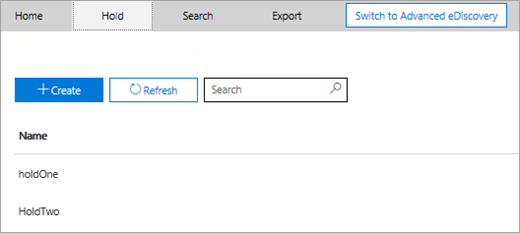
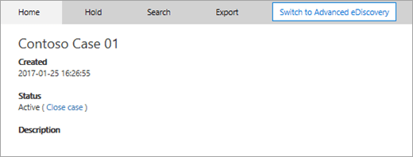

# <a name="ediscovery-cases-in-the-office-365-security-amp-compliance-center"></a>casi di eDiscovery in Office 365 Security &amp; centro conformità

È possibile utilizzare casi di eDiscovery in Office 365 Security &amp; centro conformità per controllare chi può creare, accedere e gestire casi di eDiscovery nell'organizzazione. Se l'organizzazione dispone di una sottoscrizione a Office 365 E5, è possibile utilizzare anche casi di eDiscovery per analizzare i risultati di ricerca tramite Office 365 avanzate eDiscovery.
  
Un caso eDiscovery consente di aggiungere membri a un caso, controllare i tipi di azioni che membri maiuscole specifici possono eseguire, impostare un blocco sui percorsi di contenuti rilevanti per una controversia legale e associare più ricerche di contenuto a un singolo case. È anche possibile esportare i risultati di qualsiasi ricerca del contenuto associato a un caso o preparare i risultati della ricerca per l'analisi di eDiscovery avanzate. casi di eDiscovery sono un modo efficace per limitare chi ha accesso a ricerche di contenuto e i risultati di ricerca per una causa legale dell'organizzazione.
  
Utilizzare il flusso di lavoro seguente per configurare e utilizzare casi di eDiscovery in sicurezza &amp; eDiscovery centro conformità e avanzate.

[Passaggio 1: Assegnare autorizzazioni di eDiscovery a potenziali membri del caso](#step-1-assign-ediscovery-permissions-to-potential-case-members)

[Passaggio 2: Creare un nuovo caso](#step-2-create-a-new-case)

[Passaggio 3: Aggiungere membri a un caso](#step-3-add-members-to-a-case)

[Passaggio 4: Posto i percorsi di contenuti in attesa](#step-4-place-content-locations-on-hold)

[Passaggio 5: Creare ed eseguire una ricerca del contenuto associato a un caso](#step-5-create-and-run-a-content-search-associated-with-a-case)

[Passaggio 6: Esportare i risultati di ricerca del contenuto associato a un caso](#step-6-export-the-results-of-a-content-search-associated-with-a-case)

[Passaggio 7: Preparazione risultati di ricerca per eDiscovery avanzate](#step-7-prepare-search-results-for-advanced-ediscovery)

[Passaggio 8: Viene eseguito il caso di eDiscovery avanzate](#step-8-go-to-the-case-in-advanced-ediscovery)

[(Facoltativo) Passaggio 9: Chiudere un caso](#optional-step-9-close-a-case)

[(Facoltativo) Passaggio 10: Aprire nuovamente un caso chiuso](#optional-step-10-re-open-a-closed-case)

[Ulteriori informazioni](#more-information)
  
## <a name="step-1-assign-ediscovery-permissions-to-potential-case-members"></a>Passaggio 1: Assegnare autorizzazioni di eDiscovery a potenziali membri del caso

Il primo passaggio consiste nell'assegnare le autorizzazioni appropriate eDiscovery relative agli utenti in modo che è possibile aggiungerli a un caso eDiscovery nel passaggio 2. È necessario essere membri del gruppo di ruoli Gestione organizzazione (o essere assegnato il ruolo di gestione dei ruoli) in Office 365 Security &amp; centro conformità per assegnare le autorizzazioni di eDiscovery. Nell'elenco seguente vengono descritti i gruppi di ruoli correlati eDiscovery in sicurezza &amp; centro conformità.
  
- **Revisore** - questo gruppo di ruoli disponga delle autorizzazioni più restrittive eDiscovery correlati. Membri di questo gruppo possono vedersi e aprire l'elenco dei casi nella pagina di **eDiscovery** in sicurezza solo &amp; centro conformità che sono membri di. Non possono creare casi, aggiungere membri a un caso, creazione di esenzioni, creare ricerche, esportare i risultati della ricerca o preparare i risultati di eDiscovery avanzate. Tuttavia, i membri possono accedere casi di eDiscovery avanzate per eseguire attività di analisi. 
    
- **eDiscovery Manager** - membri di questo gruppo possono creare e gestire casi di eDiscovery. Vengono aggiungere e rimuovere membri, posizionare il contenuto percorsi conservazione, creare e modificare ricerche del contenuto associato a un caso, esportare i risultati di una ricerca di contenuto e preparare i risultati della ricerca per l'analisi di eDiscovery avanzate. Esistono due sottogruppi di questo gruppo di ruoli. La differenza tra questi sottogruppi si basa sull'ambito.
    
  - visualizzare e gestire casi di eDiscovery creano o membri di **eDiscovery Manager** . Se un altro eDiscovery Manager crea un caso ma non aggiungere un secondo eDiscovery Manager come membro di tale caso, eDiscovery secondo Manager non sarà in grado di visualizzare o aprire il caso nella pagina di **eDiscovery** in sicurezza &amp; centro conformità. eDiscovery Manager possono accedere anche i casi di eDiscovery avanzate per eseguire attività di analisi. 
    
  - **eDiscovery amministratore** - è possibile eseguire tutte le attività di gestione dei casi che può eseguire una ricerca eDiscovery Manager. Inoltre, un'amministratore di eDiscovery può:
    
    - Visualizzare tutti i casi elencati nella pagina **eDiscovery**. 
    
    - Gestire un caso di eDiscovery nell'organizzazione dopo aggiungersi come membro del case.
    
    - Eseguire attività amministrative di eDiscovery avanzate, ad esempio elaborazione dei dati maiuscole per l'analisi, caso le impostazioni di configurazione ed esportazione di dati da eDiscovery avanzate. Perché la persona che un'amministratore per la protezione di eDiscovery &amp; centro conformità viene aggiunto automaticamente come un amministratore di eDiscovery avanzate.
    
    Vedere la sezione [More information](ediscovery-cases.md#moreinfo_1) per conoscere i motivi per cui si potrebbe voler diventare un amministratore di eDiscovery nell'organizzazione. 
    
> [!IMPORTANT]
> Se una persona non è un membro di uno di questi gruppi di ruoli correlati eDiscovery o non è un membro del gruppo di ruoli che è assegnato il ruolo revisore, è possibile aggiungere come membro di un caso eDiscovery. 
  
 **Per assegnare autorizzazioni di eDiscovery:**
  
1. Passare a [https://protection.office.com](https://protection.office.com).
    
2. Accedere a Office 365 utilizzando l'account di lavoro o della scuola.
    
3. In sicurezza &amp; centro conformità, fare clic su **autorizzazioni**e quindi eseguire una delle opzioni seguenti in base alle autorizzazioni eDiscovery che si desidera assegnare.
    
    - Per assegnare autorizzazioni revisore, selezionare il gruppo di ruoli **revisore** e accanto a **membri**, fare clic su **Modifica**. Fare clic su **Seleziona membri**, fare clic su **Modifica**, fare clic su  **Aggiungi**, selezionare l'utente che si desidera aggiungere al gruppo di ruoli revisore e quindi fare clic su **Aggiungi**.
    
    - Per assegnare le autorizzazioni di gestione di eDiscovery, selezionare il gruppo di ruoli di **gestione di eDiscovery** e quindi accanto a **eDiscovery Manager**, fare clic su **Modifica**. Fare clic su **Scegli eDiscovery Manager**, fare clic su **Modifica**, fare clic su  * * Add * *, selezionare l'utente che si desidera aggiungere come una ricerca eDiscovery Manager e quindi fare clic su **Aggiungi**.
    
    - Per assegnare le autorizzazioni di amministratore di eDiscovery, selezionare il gruppo di ruoli di **gestione di eDiscovery** e quindi accanto a **eDiscovery amministratore**, fare clic su **Modifica**. Fare clic su **Scegli eDiscovery amministratore**, fare clic su **Modifica**, fare clic su  **Aggiungi**, selezionare l'utente che si desidera aggiungere come un'amministratore di eDiscovery e quindi fare clic su **Aggiungi**.
    
4. Dopo aver aggiunto tutti gli utenti, fare clic su **Chiudi**, fare clic su **Salva** per salvare le modifiche al gruppo di ruoli e quindi fare clic su **Chiudi**.

## <a name="step-2-create-a-new-case"></a>Passaggio 2: Creare un nuovo caso

Il passaggio successivo consiste nel creare un nuovo caso. È necessario essere membri del gruppo di ruoli eDiscovery responsabili di creare casi di eDiscovery. Come precedentemente illustrato, dopo aver creato un nuovo caso nella protezione &amp; centro conformità, si (e gli altri membri maiuscole) saranno in grado di accesso che stesso caso di eDiscovery avanzate se si è organizzazione dispone di una sottoscrizione di Office 365 E5.
  
1. Passare a [https://protection.office.com](https://protection.office.com).
    
2. Accedere a Office 365 utilizzando l'account di lavoro o della scuola.
    
3. In sicurezza &amp; centro conformità, fare clic su **ricerca &amp; indagini** \> **eDiscovery**e quindi fare clic su  **Crea un caso**.
    
4. Nella pagina **Nuovo caso** , assegnare il caso un nome, digitare una descrizione facoltativa e quindi fare clic su **Salva**. Si noti che il nome del caso deve essere univoco all'interno dell'organizzazione.
    
    
  
    Il nuovo caso viene visualizzato nell'elenco dei casi nella pagina di **eDiscovery** . Si noti che è possibile posizionare il cursore sul nome di un caso per visualizzare le informazioni relative al caso, tra cui lo stato del caso **attivo** o **chiuso**, la descrizione del caso (che è stato creato nel passaggio precedente), e se è stato modificato ultimo caso e degli autori delle modifiche.
    
    > [!TIP]
    > Dopo aver creato un nuovo caso, è possibile rinominare in qualsiasi momento. Fare clic sul nome del caso nella pagina di **eDiscovery** . Nella pagina **Gestisci in questo caso** comparsa, cambiare il nome visualizzato nella casella in **nome**e quindi salvare le modifiche. 
  
## <a name="step-3-add-members-to-a-case"></a>Passaggio 3: Aggiungere membri a un caso

Dopo aver creato un nuovo caso, il passaggio successivo è per aggiungere membri al caso. Spiegato come precedente, solo gli utenti sono membri del revisore o gruppi di ruoli di gestione di eDiscovery possono essere aggiunti come membri del caso. Si noti che il Manager che ha creato il caso di eDiscovery viene aggiunto automaticamente come un membro.
  
1. Nel Centro sicurezza e conformità, fare clic su **Ricerca e analisi** \> **eDiscovery** per visualizzare l'elenco di casi nell'organizzazione. 
    
2. Fare clic sul nome del case che si desidera aggiungere i membri.
    
    Viene visualizzata la pagina **Gestisci in questo caso** i comparsa. 
    
    
  
3. In **Gestisci membri**, fare clic su  **Add** per aggiungere membri al caso. 
    
    È anche possibile scegliere di aggiungere un gruppo di ruoli al caso. In **Gestisci gruppi di ruoli**, fare clic su  **Add**.
    
    > [!NOTE]
    > Controllo di gruppi di ruoli che è possibile assegnare i membri a un caso eDiscovery. Ciò significa che è possibile assegnare solo i gruppi di ruoli che si sono un membro di un caso.
    
4. Nell'elenco dei gruppi di utenti o il ruolo che possono essere aggiunti come membri del caso, selezionare la casella di controllo accanto ai nomi dei gruppi di utenti o il ruolo che si desidera aggiungere.
    
    > [!TIP]
    > Se si dispone di un ampio elenco di persone che possono aggiunti come membri, utilizzare la casella **Cerca** per cercare una persona specifica nell'elenco. 
  
5. Dopo aver selezionato i gruppi di utenti o un ruolo da aggiungere come membri del gruppo, fare clic su **Aggiungi**.
    
    In **Gestisci in questo caso**, fare clic su **Salva** per salvare il nuovo elenco di membri maiuscole. 
    
6. Fare clic su **Salva** per salvare il nuovo elenco di membri maiuscole. 
  
## <a name="step-4-place-content-locations-on-hold"></a>Passaggio 4: Posto i percorsi di contenuti in attesa

È possibile utilizzare un caso eDiscovery alla creazione di esenzioni per conservare il contenuto che potrebbe essere rilevante al caso. È possibile inserire un'esenzione cassette postali e OneDrive per i siti di persone che sono depositari nel caso. Si può inoltre effettuare un'esenzione cassetta postale di gruppo, siti di SharePoint e OneDrive per sito Business per un gruppo di Office 365. Analogamente, è possibile inserire un'esenzione nella cassetta postale e sito in cui sono associati a Microsoft Teams. Quando si effettua i percorsi di contenuti in attesa, il contenuto viene mantenuto finché non si rimuove l'esenzione dal percorso di contenuto o finché non viene eliminato l'attesa.
  
Quando si crea un'esenzione, sono disponibili le opzioni seguenti per definire l'ambito del contenuto viene mantenuto nei percorsi di contenuto specificati:
  
- Creare un'attesa infinita in tutto il contenuto viene messa in attesa. In alternativa, è possibile creare un'esenzione basata su query dove solo il contenuto che corrisponde a una query di ricerca viene messa in attesa.
    
- È possibile specificare un intervallo di date per includere solo il contenuto che è stato inviato, ricevuto o creato all'interno di tale intervallo di date. In alternativa, è possibile tenere tutto il contenuto indipendentemente dal fatto se è stato inviato, ricevuto o creato.
    
> [!NOTE]
> È possibile avere un massimo di 10.000 i criteri di conservazione in tutti i casi di eDiscovery nell'organizzazione. 
  
Per creare un'esenzione per un caso eDiscovery:
  
1. Nel Centro sicurezza e conformità, fare clic su **Ricerca e analisi** \> **eDiscovery** per visualizzare l'elenco di casi nell'organizzazione. 
    
2. Fare clic su **Apri** accanto al caso in cui si desidera creare l'archiviazione in. 
    
3. Nella Home **page per il case,** fare clic sulla scheda **archiviazione** . 
    
    
  
4. Nella pagina **conservazione** , fare clic su  **Create**.
    
5. Nella pagina **nome l'esenzione** , assegnare un nome dell'esenzione. Il nome dell'esenzione deve essere univoco all'interno dell'organizzazione. 
    
    
  
6. (Facoltativo) Nella casella **Descrizione** aggiungere una descrizione dell'esenzione. 
    
7. Fare clic su **Avanti**.
    
8. Scegliere i percorsi di contenuti che si desidera mettere in attesa. È possibile effettuare le cassette postali, i siti e le cartelle pubbliche in attesa.
    
    
  
   r. **posta elettronica di Exchange** , fare clic su **Scegli utenti, gruppi o team** e fare clic su **Scegli utenti, gruppi o team** nuovamente. Per specificare le cassette postali per mettere in attesa. Utilizzare la casella di ricerca per trovare cassette postali degli utenti e gruppi di distribuzione (per effettuare un'esenzione per le cassette postali dei membri del gruppo) per mettere in attesa. Può inoltre effettuare un'esenzione nella cassetta postale associata per un Team di Microsoft o un gruppo di Office 365. Selezionare la casella di controllo team utente, gruppo, fare clic su **Scegli**e quindi fare clic su **Fine**.
    
    > [!NOTE]
    > Quando si fa clic su **Scegli utenti, gruppi o team** per specificare le cassette postali per mettere in attesa, la selezione delle cassette postali che viene visualizzata sia vuota. Questo è per impostazione predefinita per migliorare le prestazioni. Per aggiungere persone all'elenco, digitare un nome (almeno 3 caratteri) nella casella di ricerca. 
  
   **Siti di SharePoint** - b. fare clic su **Scegli siti** e quindi **Scegliere siti** nuovamente per specificare SharePoint e OneDrive per i siti per mettere in attesa. Digitare l'URL per ogni sito che si desidera mettere in attesa. È inoltre possibile aggiungere l'URL del sito di SharePoint per un Team di Microsoft o un gruppo di Office 365. Fare clic su **Scegli**e quindi fare clic su **Fine**.
    
    Vedere la sezione [informazioni](ediscovery-cases.md#moreinfo_1) di suggerimenti per inserire i gruppi di Office 365 e Microsoft Teams in attesa. 
    
    > [!NOTE]
    > Nel caso di nome principale una persona (UPN) viene modificato l'URL per il proprio account OneDrive verrà modificata anche per incorporare l'UPN di nuovo. In questo caso, sarà necessario modificare la conservazione nuovo OneDrive URL dell'utente di aggiungendo e rimuovendo il vecchio. 
  
   **cartelle pubbliche di Exchange** - c. spostare l'interruttore Attiva/disattiva  nella posizione **tutti** per mettere tutte le cartelle pubbliche nell'organizzazione Exchange Online in attesa. Si noti che non è possibile scegliere specifiche cartelle pubbliche per mettere in attesa. Lasciare l'opzione Mostra/Nascondi impostata su **Nessuno** se non si desidera creare un'esenzione per le cartelle pubbliche.
    
9. Al termine i percorsi di contenuti aggiunta all'esenzione, fare clic su **Avanti**.
    
10. Per creare un'esenzione basata su query con condizioni, eseguire le operazioni seguenti. In caso contrario, fare clic su **Avanti**
    
    
  
    
       r. nella casella **parole chiave**, tipo di una query di ricerca nella casella in modo che solo il contenuto che soddisfa i criteri di ricerca viene messa in attesa. È possibile specificare le parole chiave, le proprietà del messaggio o proprietà del documento, ad esempio i nomi di file. È inoltre possibile utilizzare più complesse query che utilizzano un operatore booleano, ad esempio **AND**, **OR**o **NOT**. Se si lascia la casella di parola chiave vuota, tutto il contenuto disponibile nei percorsi specificati contenuti verrà messa in attesa.
    
    Fare clic su  **condizioni Add** per aggiungere una o più condizioni per limitare la query di ricerca per l'attesa. Ogni condizione aggiunge una clausola di query di ricerca KQL che viene creata ed eseguita quando si crea l'attesa. Ad esempio è possibile specificare un intervallo di date in modo che i documenti di posta elettronica o di un sito che sono stati creati all'interno della data intervallo vengono inseriti in attesa. Una condizione è connesso logicamente per le query con parole chiave (specificata nella casella parole chiave) dall'operatore di telefonia **e** . Ciò significa che gli elementi devono soddisfare entrambe le query con parole chiave e la condizione di essere posizionate in attesa.

    Per ulteriori informazioni sulla creazione di una query di ricerca e utilizzo delle condizioni, vedere [query con parole chiave e le condizioni di ricerca per la ricerca del contenuto](keyword-queries-and-search-conditions.md).
    
11. Dopo aver configurato un basata su query attesa, fare clic su **Avanti**.
    
12. Controllare le impostazioni e quindi fare clic su **Crea esenzione**.
    
### <a name="hold-statistics"></a>Conservazione delle statistiche

Dopo un po' di tempo, informazioni sulla nuova esenzione viene visualizzate nel riquadro dei dettagli della pagina **contiene** per l'attesa selezionato. Queste informazioni includono il numero di cassette postali e siti in attesa e le statistiche relative al contenuto che è stato messo in attesa, ad esempio il numero totale e le dimensioni degli elementi messa in attesa e l'ultima ora in attesa sono state calcolate le statistiche. Queste attesa consentono di statistiche identificare la quantità di contenuto correlato al caso di eDiscovery è correntemente. 
  

  
Tenere presenti sulle statistiche di attesa i seguenti aspetti:
  
- Il numero totale di elementi in attesa indica il numero di elementi da tutte le origini di contenuto che restano in attesa. Se sono state create una basata su query attesa, questo indica il numero di elementi che corrispondono alla query.
    
- Il numero di elementi in attesa include anche gli elementi non indicizzati presenti nei percorsi contenuti. Si noti che se si crea una conservazione basata su query, tutti gli elementi non indicizzati nelle posizioni del contenuto sono messi in attesa. Sono inclusi gli elementi non indicizzati che non soddisfano i criteri di ricerca di un'esenzione basata su query e non indicizzate che potrebbe essere si trovano all'esterno di una condizione di intervallo di date. Questa è diversa da cosa succede quando si esegue una ricerca di contenuto, in cui gli elementi non indicizzati che non corrispondono alla query di ricerca o esclusi da una condizione di intervallo di date non vengono inclusi nei risultati della ricerca. Per ulteriori informazioni sugli elementi non indicizzate, vedere [parzialmente indicizzato gli elementi della funzionalità di ricerca del contenuto in Office 365](partially-indexed-items-in-content-search.md).
    
- È possibile ottenere le ultime novità attesa statistiche facendo clic su **Aggiorna le statistiche** per rieseguire una ricerca estimate che calcola il numero corrente di elementi in attesa. Se necessario, fare clic su **Aggiorna** nella barra degli strumenti per aggiornare le statistiche di conservazione nel riquadro dei dettagli. 
    
- La normale per il numero di elementi in attesa per aumentare il tempo perché agli utenti la cui cassetta postale o del sito sono in attesa sono in genere l'invio o ricezione nuovo messaggio di posta elettronica e la creazione di nuovi SharePoint e OneDrive per i documenti aziendali.
    
> [!NOTE]
> Se un sito di SharePoint o un account OneDrive viene spostato in una regione diversa in un ambiente multi-geo, le statistiche per il sito non inclusi nelle statistiche di attesa. Tuttavia, il contenuto del sito saranno ancora in attesa. Inoltre, se un sito viene spostato in una regione diversa l'URL che viene visualizzato nell'esenzione non verrà aggiornato. È necessario modificare la conservazione e aggiornare l'URL. 
  
## <a name="step-5-create-and-run-a-content-search-associated-with-a-case"></a>Passaggio 5: Creare ed eseguire una ricerca del contenuto associato a un caso

Dopo la creazione di un caso eDiscovery e qualsiasi depositari correlate al caso sono messi in attesa, è possibile creare ed eseguire una o più ricerche di contenuto associati a caso. Contenuto ricerche associate a un caso non siano elencate nella pagina di **ricerca** nella protezione &amp; centro conformità. Ciò significa che le ricerche del contenuto associate a un caso è accessibile solo da maiuscole membri che fanno parte del gruppo di ruoli di gestione di eDiscovery. 
  
1. Nel Centro sicurezza e conformità, fare clic su **Ricerca e analisi** \> **eDiscovery** per visualizzare l'elenco di casi nell'organizzazione. 
    
2. Fare clic su **Apri** accanto al caso in cui si desidera creare una ricerca nel contenuto. 
    
3. Nella Home **page per il case,** fare clic sulla scheda **ricerca** . 
    
    
  
4. Nella pagina **ricerca** fare clic su  **nuova ricerca**. 
    
5. Nella pagina **Nuova ricerca**, è possibile aggiungere parole chiave e condizioni per creare la query di ricerca. 
    
    
  
1. È possibile specificare le parole chiave, messaggio, proprietà, ad esempio inviati e ricevuti, date o proprietà del documento, ad esempio i nomi di file o la data dell'ultima modifica di un documento. È possibile utilizzare più complesse query che utilizzano un operatore booleano, ad esempio **AND**, **o**, **non**, **NEAR**o **ONEAR**. È inoltre possibile cercare informazioni sensibili (ad esempio numeri di previdenza sociale) nei documenti o ricerca per i documenti condivisi esternamente. Se si lascia vuota la casella parole chiave, tutto il contenuto disponibile nei percorsi di contenuto specificati sarà incluse nei risultati della ricerca. 
    
2. È possibile selezionare la casella di controllo **Mostra elenco di parole chiave** e il tipo di una parola chiave in ogni riga. In questo caso, le parole chiave in ogni riga sono connessi tramite l'operatore **OR** nella query di ricerca che viene creata. 
    
    
  
    Perché utilizzare l'elenco delle parole chiave? È possibile ottenere le statistiche che mostra il numero di elementi corrispondenti a ogni parola chiave. Ciò consente di identificare rapidamente i quali le parole chiave sono il massimo (e almeno) efficaci. È inoltre possibile utilizzare una frase parola chiave (racchiusa tra parentesi) in una riga. Per ulteriori informazioni sulle statistiche di ricerca, vedere [visualizzare le statistiche delle parole chiave per i risultati di ricerca del contenuto](view-keyword-statistics-for-content-search.md).
    
    Per ulteriori informazioni sull'utilizzo dell'elenco di parole chiave, vedere [creazione di una query di ricerca](content-search.md#building-a-search-query).
    
3. In **condizioni**, aggiungere le condizioni per una query di ricerca per restringere la ricerca e restituire un set di risultati più dettagliato. Ogni condizione aggiunge una clausola di query di ricerca KQL che viene creata ed eseguita quando si avvia la ricerca. Una condizione è connesso logicamente per le query con parole chiave (specificata nella casella parole chiave) dall'operatore di telefonia **e** . Ciò significa che gli elementi devono soddisfare entrambe le query con parole chiave e la condizione da includere nei risultati della. Si tratta come condizioni consentono di limitare i risultati. 
    
    Per ulteriori informazioni sulla creazione di una query di ricerca e sull'utilizzo di condizioni, vedere [Keyword queries for Content Search](keyword-queries-and-search-conditions.md).
    
6. In **percorsi: percorsi in attesa**, scegliere i percorsi di contenuti che si desidera eseguire la ricerca. È possibile cercare cassette postali, i siti e le cartelle pubbliche nella ricerca stessa.
    
    
  
  - **Tutti i percorsi** : selezionare questa opzione per cercare tutti i percorsi di contenuti nell'organizzazione. Quando si seleziona questa opzione, è possibile scegliere di ricerca tutte le cassette postali di Exchange (cassette postali che include tutti i gruppi di Office 365 e Microsoft Teams), tutte le SharePoint e OneDrive per i siti (che include i siti per tutti i gruppi di Office 365 e Microsoft Team) e tutte le cartelle pubbliche.
    
  - **Che tutti i percorsi in attesa** - selezionare questa opzione per cercare tutti i percorsi contenuti messe in attesa nel caso. Se il caso contiene più contiene, il contenuto verranno eseguita la ricerca percorsi da tutte le esenzioni quando si seleziona questa opzione. Inoltre, se è stato inserito un percorso di contenuto di un'esenzione basata su query, solo gli elementi che sono in attesa verranno eseguita la ricerca quando si esegue la ricerca del contenuto che si sta creando in questo passaggio. Ad esempio, se un utente è stato messo in attesa di maiuscole basata su query che consente di mantenere gli elementi che sono stati inviati o creati prima di una data specifica, solo gli elementi sarebbero viene eseguita la ricerca utilizzando i criteri di ricerca di ricerca del contenuto. Questa operazione viene eseguita tramite la connessione di query maiuscole attesa e la query di ricerca del contenuto da un operatore **AND** . Vedere la sezione [informazioni](ediscovery-cases.md#moreinfo_1) alla fine di questo articolo per informazioni dettagliate sulla ricerca di contenuto sociale. 
    
  - **Percorsi specifici** : selezionare questa opzione per selezionare le cassette postali e i siti che si desidera eseguire la ricerca. Quando si seleziona questa opzione e fare clic su **Modifica**, viene visualizzato un elenco di posizioni. È possibile scegliere di alcuni o tutti gli utenti, gruppi, team o posizioni di siti di ricerca.
    
    
  
    È anche possibile scegliere di ricerca tutte le cartelle pubbliche nell'organizzazione, ma se si seleziona questa opzione e ricerca qualsiasi percorso contenuto in attesa, le query da un'esenzione maiuscole basata su query non verranno applicate alla query di ricerca. In altre parole, viene eseguita la ricerca tutto il contenuto in una posizione, non solo il contenuto viene mantenuto da un'esenzione maiuscole basata su query.
    
    È possibile rimuovere i percorsi contenuti sociale prepopolati o aggiungerne altri. Se si sceglie questa opzione, è inoltre possibile flessibilità per cercare tutti i percorsi di contenuti per un servizio specifico (ad esempio ricerca tutte le cassette postali di Exchange) oppure è possibile cercare i percorsi di contenuti specifici per un servizio. È anche possibile scegliere se utilizzare o meno le cartelle pubbliche di ricerca nell'organizzazione.
    
    Tenere presente quando si aggiungono percorsi di contenuti per la ricerca:
    
  - Quando si fa clic su **Scegli utenti, gruppi o team** per specificare le cassette postali per la ricerca, la selezione delle cassette postali che viene visualizzata sia vuota. Questo è per impostazione predefinita per migliorare le prestazioni. Per aggiungere i destinatari a questo elenco, fare clic su **Scegli utenti, gruppi o team**, digitare un nome (almeno 3 caratteri) nella casella di ricerca, selezionare la casella di controllo accanto al nome e quindi fare clic su **Scegli**. 
    
  - È possibile aggiungere all'elenco delle cassette postali per la ricerca delle cassette postali inattive, gruppi di Office 365, Microsoft Teams e i gruppi di distribuzione. Non sono supportati i gruppi di distribuzione dinamico. Se si aggiungono gruppi di Office 365 o Microsoft Teams, viene eseguita la ricerca cassetta postale di gruppo o un team; non vengono effettuate le cassette postali dei membri del gruppo.
    
  - Per aggiungere siti fare clic su **Scegli siti**, scegliere nuovamente **clic su siti** e quindi digitare l'URL per ogni sito che si desidera eseguire la ricerca. È inoltre possibile aggiungere l'URL del sito di SharePoint per gruppi di Office 365 e Microsoft Teams. 
    
7. Dopo aver selezionato i percorsi contenuti di ricerca, fare clic su **Chiudi** e quindi fare clic su **Salva**.
    
8. Nella pagina **nuova ricerca** , fare clic su **Salva** e quindi digitare un nome per la ricerca. Nomi siano univoci all'interno dell'organizzazione Office 365 devono essere associate a un caso di ricerche di contenuto. 
    
9. Fare clic su **salvare &amp; eseguire** per salvare le impostazioni di ricerca. 
    
10. Immettere un nome univoco per la ricerca e fare clic su **Salva** per avviare la ricerca. 
    
    La ricerca viene avviata. Dopo un po' di tempo, una stima dei risultati della ricerca viene visualizzata nel riquadro dei dettagli. La stima include le dimensioni totali e il numero di elementi corrispondenti ai criteri di ricerca. La stima ricerca include anche il numero di elementi indicizzati nei percorsi di contenuto in cui sono stati una ricerca. Il numero di elementi indicizzati che non soddisfano i criteri di ricerca includerà le statistiche ricerca visualizzate nel riquadro dei dettagli. Se corrisponde a un elemento non indicizzate eseguire una query di ricerca (perché altre proprietà di un documento o messaggio soddisfa i criteri di ricerca), non sarà incluso il numero stimato di elementi indicizzati. Se un elemento non indicizzato viene escluso per i criteri di ricerca, anche non essere incluse nella stima di elementi indicizzati.
    
    Al termine della ricerca, è possibile visualizzare in anteprima i risultati della ricerca. Se necessario, fare clic su **Aggiorna** per aggiornare le informazioni nel riquadro dei dettagli. 
    
## <a name="step-6-export-the-results-of-a-content-search-associated-with-a-case"></a>Passaggio 6: Esportare i risultati di ricerca del contenuto associato a un caso

Dopo l'esecuzione di una ricerca, è possibile esportare i risultati della ricerca. Quando si Esporta risultati della ricerca, gli elementi della cassetta postale vengono scaricati in file PST o come singoli messaggi. Quando si esporta il contenuto di SharePoint e OneDrive per i siti di Business, vengono esportate le copie dei documenti di Office nativi e altri documenti. Inoltre viene esportato un file manifesto (in formato XML) che contiene informazioni su ogni risultato di ricerca.
  
È possibile esportare i risultati di [esportare i risultati di una singola ricerca associato a un caso](ediscovery-cases.md#singlesearch_1) un oppure è possibile esportare i risultati di [esportare i risultati delle ricerche più associate a un caso](ediscovery-cases.md#multiplesearches_1).
  
### <a name="export-the-results-of-a-single-search-associated-with-a-case"></a>Esportare i risultati di una singola ricerca associato a un caso

1. Nel Centro sicurezza e conformità, fare clic su **Ricerca e analisi** \> **eDiscovery** per visualizzare l'elenco di casi nell'organizzazione. 
    
2. Fare clic su **Apri** accanto al caso in cui si desidera esportare ricerca dal. 
    
3. Nella Home **page per il case,** fare clic su **Cerca**.
    
4. Nell'elenco delle ricerche per il case, fare clic su ricerca che si desidera esportare i risultati di ricerca, fare clic su  **ulteriori**e quindi seleziona **esportare i risultati** dall'elenco a discesa. 
    
    Verrà visualizzata la pagina di **esportare i risultati** . 
    
    
  
    Il flusso di lavoro per esportare i risultati di ricerca di contenuto associati a un caso corrisponde a esportare i risultati di ricerca per una ricerca nella pagina di **ricerca del contenuto** . Per istruzioni dettagliate, vedere [esportare contenuto di una ricerca di Office 365 protezione &amp; centro conformità](export-search-results.md).
    
    > [!NOTE]
    > Quando si Esporta risultati della ricerca, è possibile abilitare deduplicazione in modo che solo una copia di un messaggio di posta elettronica verrà esportata anche se potrebbe essere più istanze dello stesso messaggio sono state trovate nelle cassette postali in cui sono stati una ricerca. Per ulteriori informazioni sulla deduplicazione e gli elementi come duplicati vengono identificati, vedere [deduplicazione nei risultati della ricerca eDiscovery](de-duplication-in-ediscovery-search-results.md). 
  
5. Fare clic sulla scheda **Esporta** per visualizzare l'elenco di processi di esportazione esistenti per tale caso. 
    
    
  
    Potrebbe essere necessario fare clic su **Aggiorna** per aggiornare l'elenco di processi di esportazione in modo che includa il processo di esportazione appena creata. Si noti che i processi di esportazione avere lo stesso nome contenuto corrispondente esegue una ricerca con **Export** aggiunto alla fine del nome di ricerca. 
    
6. Fare clic sul processo di esportazione appena creata per visualizzare le informazioni sullo stato nel riquadro dei dettagli. Queste informazioni includono la percentuale di elementi che sono stati trasferiti a un'area di archiviazione Azure nel cloud Microsoft.
    
    Dopo che tutti gli elementi sono stati trasferiti, fare clic su **Scarica i risultati** per scaricare i risultati della ricerca sul computer locale. Per ulteriori informazioni, vedere Step 2 in [esportare contenuto di una ricerca di Office 365 protezione &amp; centro conformità](export-search-results.md)
    
### <a name="export-the-results-of-multiple-searches-associated-with-a-case"></a>Esportare i risultati delle ricerche più associate a un caso

Come alternativa per esportare i risultati di una singola ricerca del contenuto associato a un caso, è possibile esportare i risultati delle ricerche più dallo stesso caso di una singola esportazione. Esportare i risultati delle ricerche più è più esportare i risultati di uno ricerca alla volta rapido e semplice.
  
> [!NOTE]
> Non è possibile esportare i risultati delle ricerche più se uno di tali ricerche sia stato configurato per tutto il contenuto sociale di ricerca. esportare solo i risultati delle ricerche più per le ricerche associati a un caso eDiscovery. Non è possibile esportare i risultati delle ricerche più elencate nella pagina di **ricerca del contenuto** per la protezione &amp; centro conformità. 
  
1. Nel Centro sicurezza e conformità, fare clic su **Ricerca e analisi** \> **eDiscovery** per visualizzare l'elenco di casi nell'organizzazione. 
    
2. Accanto al caso in cui si desidera esportare i risultati di ricerca fare clic su **Apri** . 
    
3. Nella Home **page per il case,** fare clic su **Cerca**.
    
4. Nell'elenco delle ricerche per il case, selezionare due o più ricerche che si desidera esportare i risultati di ricerca.
    
    > [!NOTE]
    > Per selezionare più ricerche, tenere premuto Ctrl mentre si fa clic su ogni ricerca. Oppure è possibile selezionare più ricerche adiacenti facendo clic su prima ricerca, tenere premuto il tasto MAIUSC e quindi fare clic su ultima ricerca. 
  
5. Dopo aver selezionato le ricerche, viene visualizzata la pagina **operazioni globali** . 
    
    
  
    
6. Fare clic su  **esportare i risultati**.

7. Nella pagina **esportazione dei risultati** , assegnare un nome univoco dell'esportazione, selezionare le opzioni di output e scegliere la modalità di esportazione del contenuto. Fare clic su **Esporta**.
    
    Il flusso di lavoro per esportare i risultati delle ricerche di contenuto più associate a un caso è lo stesso come esportare i risultati di ricerca per una singola ricerca. Per istruzioni dettagliate, vedere [esportare contenuto di una ricerca di Office 365 protezione &amp; centro conformità](export-search-results.md).
    
    > [!NOTE]
    > Quando si esportano i risultati della ricerca da più ricerche associate a un caso, è inoltre l'opzione Abilita deduplicazione in modo che solo una copia di un messaggio di posta elettronica verrà esportata anche se più istanze dello stesso messaggio potrebbero essere state trovate nel cassette postali in cui sono state ricercate in uno o più delle ricerche. Per ulteriori informazioni sulla deduplicazione e gli elementi come duplicati vengono identificati, vedere [deduplicazione nei risultati della ricerca eDiscovery](de-duplication-in-ediscovery-search-results.md). 
  
8. Dopo aver avviato l'esportazione, fare clic sulla scheda **Esporta** per visualizzare l'elenco di processi di esportazione per tale caso. 
    
    
  
    Potrebbe essere necessario fare clic su **Aggiorna**  per aggiornare l'elenco di processi di esportazione per visualizzare il processo di esportazione appena creata. Si noti che le ricerche che sono stati inclusi nel processo di esportazione sono elencate nella colonna **ricerche** . 
    
8. Fare clic sul processo di esportazione appena creata per visualizzare le informazioni sullo stato nel riquadro dei dettagli. Queste informazioni includono la percentuale di elementi che sono stati trasferiti a un'area di archiviazione Azure nel cloud Microsoft.
    
9. Dopo che tutti gli elementi sono stati trasferiti, fare clic su **Scarica i risultati** per scaricare i risultati della ricerca sul computer locale. Per ulteriori informazioni, vedere Step 2 in [risultati di ricerca di esportazione di Office 365 Security &amp; centro conformità](export-search-results.md)
    
#### <a name="more-information-about-exporting-the-results-of-multiple-searches"></a>Ulteriori informazioni sull'esportazione dei risultati delle ricerche più

- Quando si esportano i risultati delle ricerche più, le query di ricerca da tutte le ricerche vengono combinate utilizzando **o** gli operatori e quindi viene avviata la ricerca combinata. I risultati della ricerca combinato stimati vengono visualizzati nel riquadro dei dettagli del processo di esportazione selezionato. I risultati della ricerca vengono trasferiti quindi nell'area di archiviazione Azure nel cloud Microsoft. Lo stato del trasferimento viene visualizzato anche nel riquadro dei dettagli. Come descritto in precedenza, dopo che sono stati trasferiti tutti i risultati della ricerca, è possibile scaricare tali computer locale. 
    
- Il numero massimo di parole chiave di query di ricerca per tutte le ricerche che si desidera esportare è 500. (si tratta dello stesso limite per una singola ricerca contenuto). Ciò avviene perché il processo di esportazione combina tutte le query di ricerca utilizzando l'operatore **OR** . Se si supera questo limite, verrà restituito un errore. In questo caso, sarà necessario esportare i risultati delle ricerche meno o semplificare le query di ricerca delle ricerche che si desidera esportare. 
    
- I risultati della ricerca che vengono esportati sono organizzati per l'origine di contenuto che è stato trovato nell'elemento. Ciò significa che un'origine di contenuto nei risultati di esportazione potrebbe avere gli elementi restituiti dalla ricerca diversa. Ad esempio, se si è scelto di esportare i messaggi di posta elettronica in un file PST per ciascuna cassetta postale, il file PST potrebbe essere i risultati delle ricerche più.
    
- Se il stesso elemento di posta elettronica o il documento dalla stessa posizione contenuta viene restituito da più di una ricerca da esportare, verrà esportata solo una copia dell'elemento.
    
- È possibile modificare un'esportazione per ricerche più dopo averlo creato. È ad esempio, non possono aggiungere o rimuovere ricerche dall'esportazione. È necessario creare un nuovo processo di esportazione per modificare i risultati della ricerca vengono esportati. Dopo la creazione di un processo di esportazione, è solo possibile scaricare i risultati in un computer, riavviare l'esportazione o eliminare il processo di esportazione.
    
- Se si riavvia l'esportazione, le modifiche apportate alle query di ricerca che compongono il processo di esportazione non influisce sui risultati della ricerca da recuperare. Quando si riavvia un'esportazione, verrà eseguito nuovamente il processo di query ricerca combinato stessa che era in esecuzione quando è stato creato il processo di esportazione.
    
- Se si riavvia un'esportazione dalla pagina **Esporta** in un caso di eDiscovery, i risultati della ricerca che vengono trasferiti all'area di archiviazione Azure sovrascriverà i risultati del precedenti. i risultati precedenti non vi sono stati trasferiti non sarà disponibile per essere scaricato. 
    
- Preparazione dei risultati delle ricerche più per l'analisi di eDiscovery avanzate non è disponibile. È possibile preparare solo i risultati di una singola ricerca per l'analisi di eDiscovery avanzate.

## <a name="step-7-prepare-search-results-for-advanced-ediscovery"></a>Passaggio 7: Preparazione risultati di ricerca per eDiscovery avanzate

Se l'organizzazione dispone di una sottoscrizione a Office 365 E5, è possibile preparare i risultati delle ricerche del contenuto associato a un caso per l'analisi di eDiscovery avanzate. Dopo aver preparato risultati della ricerca, è possibile accedere ai eDiscovery avanzate (vedere [passaggio 8: viene eseguito il caso di eDiscovery avanzate](ediscovery-cases.md#gotoAeD_1)) ed elaborare i dati dei risultati di ricerca per un'ulteriore analisi di eDiscovery avanzate.
  
Quando si prepara i risultati della ricerca eDiscovery avanzata, la funzionalità di riconoscimento ottico dei caratteri (OCR) estrae automaticamente il testo da immagini. OCR è supportato per file separati, gli allegati di posta elettronica e immagini incorporate. In questo modo è possibile applicare le funzionalità analitiche testo di eDiscovery avanzate (quasi duplicati, posta elettronica threading, temi e la scrittura di codice predittiva) al testo contenuto nel file di immagine.
  
> [!NOTE]
> Per analizzare i dati dell'utente tramite eDiscovery avanzate, l'utente (depositaria dei dati) deve essere assegnato una licenza di Office 365 E5. In alternativa, gli utenti con una licenza di Office 365 E1 o E3 è possibile assegnare una licenza autonoma eDiscovery avanzate. Gli amministratori e responsabili della conformità assegnati ai casi e utilizzare eDiscovery avanzate per analizzare i dati non è necessario una licenza E5. 
  
1. Nel Centro sicurezza e conformità, fare clic su **Ricerca e analisi** \> **eDiscovery** per visualizzare l'elenco di casi nell'organizzazione. 
    
2. Accanto al caso in cui si desidera preparare i risultati della ricerca per l'analisi di eDiscovery avanzate fare clic su **Apri** . 
    
3. Nella Home **page per il case,** fare clic su **Cerca**e quindi selezionare la ricerca.
    
4. Nel riquadro dei dettagli fare clic su  **ulteriori**e quindi fare clic su **Prepara eDiscovery avanzate**.
    
    
  
5. Nella pagina **Prepara eDiscovery avanzate** selezionare preparare una delle operazioni seguenti: 
    
    - Tutti gli elementi, ad eccezione di quelli con formato non riconosciuto, vengono crittografati o non indicizzati per altri motivi.
    
    - Tutti gli elementi, inclusi quelli che presentano sconosciute formato, vengono crittografati o non indicizzati per altri motivi.
    
    - Solo gli elementi con un formato non riconoscibile vengono crittografate o non indicizzate per altri motivi.
    
6. (Facoltativo) Selezionare la casella di controllo **Includi versioni per file di SharePoint** . 
    
7. Fare clic su **Prepara**.
    
    I risultati della ricerca vengono preparati per l'analisi con eDiscovery avanzate.
    
8. Fare clic su **Chiudi** per chiudere il riquadro dei dettagli. 
    
## <a name="step-8-go-to-the-case-in-advanced-ediscovery"></a>Passaggio 8: Viene eseguito il caso di eDiscovery avanzate

Dopo aver creato un caso nella protezione &amp; centro conformità, è possibile accedere allo stesso caso di eDiscovery avanzate.
  
Per accedere a un caso in Advanced eDiscovery:
  
1. Nel Centro sicurezza e conformità, fare clic su **Ricerca e analisi** \> **eDiscovery** per visualizzare l'elenco di casi nell'organizzazione. 
    
2. Accanto al caso in cui si desidera passare a eDiscovery avanzate fare clic su **Apri** . 
    
3. Nella Home **page per il case,** fare clic su **passa a eDiscovery avanzate**.
    
    
  
    Viene visualizzato l'indicatore di stato di **connessione avanzate eDiscovery** . Quando si è connessi a eDiscovery avanzate, nella pagina viene visualizzato un elenco dei contenitori. 
    
    
  
    Questi contenitori rappresentano i risultati della ricerca preparati per l'analisi di eDiscovery avanzata nel passaggio 7. Si noti che il nome del contenitore ha lo stesso nome di ricerca del contenuto nel caso della protezione &amp; centro conformità. I contenitori nell'elenco sono quelli preparato. Se un utente diverso preparato risultati della ricerca eDiscovery avanzate, i contenitori corrispondenti non vengono inclusi nell'elenco.
    
4. Per caricare i dati dei risultati di ricerca da un contenitore per il caso di eDiscovery avanzate, selezionare un contenitore e fare clic su **processo**.
    
    Per informazioni su come contenitori processo, vedere [eseguita la funzionalità di processo e caricamento dei dati in Office 365 avanzate eDiscovery](run-the-process-module-and-load-data-in-advanced-ediscovery.md).
    
> [!TIP]
> Fare clic su **passa a eDiscovery** per tornare allo stesso caso nella protezione &amp; centro conformità. 
  
## <a name="optional-step-9-close-a-case"></a>(Facoltativo) Passaggio 9: Chiudere un caso

Una volta completata la persona o l'indagine supportate da un caso di eDiscovery, è possibile chiudere il caso. Ecco cosa succede quando si chiude un caso:
  
- Se il caso contiene tutti i percorsi di contenuti in attesa, le esenzioni verranno disattivate. Ciò potrebbe determinare contenuto viene eliminato definitivamente o eliminati dall'utente o da un processo automatizzato, ad esempio un criterio di eliminazione.
    
- Solo un caso di chiusura viene disattivata l'archiviazione associati a tale caso. Se altri tipi di conservazioni vengono effettuate su un percorso di contenuto (ad esempio una controversia esenzione. criteri di conservazione o per un conservazione da un caso eDiscovery diversi) verranno mantenute ancora tali esenzioni.
    
- Nel caso ancora è elencato nella pagina di eDiscovery in sicurezza &amp; centro conformità. Vengono mantenuti le informazioni dettagliate, esenzioni, ricerche e i membri di un caso chiuso.
    
- È possibile modificare un caso dopo la chiusura. Ad esempio, è possibile aggiungere o rimuovere membri, creare ricerche, esportare i risultati della ricerca e preparare risultato di ricerca per l'analisi di eDiscovery avanzate. La differenza principale tra attivi e di chiusi dei casi è esenzioni la disattivazione di chiusura di un caso.
    
Per chiudere un caso:
  
1. Nel Centro sicurezza e conformità, fare clic su **Ricerca e analisi** \> **eDiscovery** per visualizzare l'elenco di casi nell'organizzazione. 
    
2. Fare clic sul nome del case che si desidera chiudere.
    
    Viene visualizzata la pagina **Gestisci in questo caso** i comparsa. 
    
3. In **stato del caso Gestisci**, fare clic su  **chiudere un caso**.
    
    Viene visualizzato un avviso indicante che le conservazioni associate al caso verranno disattivate.
    
4. Fare clic su **Sì** per chiudere il caso. 
    
    Lo stato nella pagina **Gestisci in questo caso** comparsa viene modificato da **attivo** per **la chiusura**.
    
5. Chiudere la pagina **Gestisci in questo caso** . 
    
6. Nella pagina **eDiscovery** fare clic su  **Aggiorna** per aggiornare lo stato del caso chiuso. Potrebbero richiedere fino a 60 minuti per il processo di chiusura per il completamento. 
    
    Una volta completato il processo, lo stato del caso viene modificato in **chiuso** nella pagina di **eDiscovery** . Fare clic sul nome del caso nuovamente per visualizzare la pagina di comparsa **Gestisci in questo caso** , che contiene informazioni su quando il caso è stata chiusa e che ha chiuso. 
     
## <a name="optional-step-10-re-open-a-closed-case"></a>(Facoltativo) Passaggio 10: Aprire nuovamente un caso chiuso

Quando viene riaperto un caso, qualsiasi esenzioni che erano presenti al momento è stata chiusa il caso non vengono ripristinati automaticamente. Dopo il caso viene riaperto, sarà necessario passare alla pagina **conservazione** e attivare l'archiviazione precedente. Per attivare un'esenzione, selezionarlo e fare clic su **attivarlo** nel riquadro dei dettagli. 
  
1. Nel Centro sicurezza e conformità, fare clic su **Ricerca e analisi** \> **eDiscovery** per visualizzare l'elenco di casi nell'organizzazione. 
    
2. Fare clic sul nome del case che si desidera riaprire.
    
    Viene visualizzata la pagina **Gestisci in questo caso** i comparsa. 
    
3. In **Gestione stato del caso**, fare clic su **riaprire case**.
    
    Viene visualizzato un avviso indicante che le conservazioni che era associate al caso quando è stata chiusa non essere attivate automaticamente.
    
4. Fare clic su **Sì** per riaprire il caso. 
    
    Lo stato nella pagina **Gestisci in questo caso** comparsa viene modificato da **chiuso** ad **attivo**.
    
5. Chiudere la pagina **Gestisci in questo caso** . 
    
6. Nella pagina **eDiscovery** fare clic su  **Aggiorna** per aggiornare lo stato del caso riaperti. Potrebbero richiedere fino a 60 minuti completare il processo riapertura. 
    
    Una volta completato il processo, lo stato del caso viene modificato in **attivo** nella pagina di **eDiscovery** . 
  
## <a name="more-information"></a>Ulteriori informazioni

- **Sono presenti i limiti per casi di eDiscovery o esenzioni associate a un caso eDiscovery?** Nella tabella seguente sono elencati i limiti per casi di eDiscovery e conservazioni maiuscole.
    
  |**Descrizione del limite**|**Tipo di limite**|
  |:-----|:-----|
  |Numero massimo di case per un'organizzazione  <br/> |Nessun limite  <br/> |
  |Numero massimo di case contiene di un'organizzazione  <br/> |10,000  <br/> |
  |Numero massimo di cassette postali in un unico involucro di conservazione  <br/> |1,000  <br/> |
  |Numero massimo di SharePoint e OneDrive per i siti in un'esenzione maiuscole singolo  <br/> |100  <br/> |
   
- **Cosa sui casi in cui sono stati creati nella pagina Gestione dei casi di eDiscovery avanzata?** È possibile accedere a un elenco di meno recenti casi di eDiscovery avanzate facendo clic sul collegamento nella parte inferiore della pagina di **eDiscovery** per la protezione &amp; centro conformità. Tuttavia, che eseguono le operazioni in un caso precedente, è necessario contattare il supporto di Office 365 e richiede che venga spostato nel caso di un nuovo caso nella protezione &amp; centro conformità. 
    
- **Informazioni sulla creazione di un'amministratore di eDiscovery?** Come precedentemente illustrato, una ricerca eDiscovery amministratore è membro del gruppo di ruoli gestione eDiscovery in grado di visualizzare e accedere a tutti i casi di eDiscovery nell'organizzazione. Questa possibilità di accedere a tutti i casi di eDiscovery ha due importanti scopi:
    
  - Se una persona è l'unico membro di un caso eDiscovery lascia l'organizzazione, inclusi i membri del gruppo di ruoli Gestione organizzazione o un altro membro del gruppo di ruoli di gestione di eDiscovery, per accedere tale caso di eDiscovery poiché non sono membri di un caso. In questo caso, non potrebbe essere possibile in alcun modo per accedere ai dati nel caso. Ma dal momento che un'amministratore di eDiscovery può accedere a tutti i casi di eDiscovery nell'organizzazione, possano visualizzare il caso nella protezione &amp; centro conformità e aggiungere se stessi o un altro eDiscovery manager come membro del case.
    
  - Dal momento che un'amministratore di eDiscovery può visualizzare e accedere a tutti i casi di eDiscovery, si può controllare e controllare tutti i casi e le ricerche di contenuto associati. Ciò consente di impedire qualsiasi utilizzo non corretto di ricerche di contenuto o casi di eDiscovery. E poiché eDiscovery gli amministratori possono accedere a informazioni riservate nei risultati della ricerca di contenuto, è consigliabile limitare il numero di persone che sono amministratori eDiscovery.
    
    Infine, precedente come spiegato, gli amministratori di eDiscovery in sicurezza &amp; centro conformità vengono aggiunte automaticamente come amministratori di eDiscovery avanzate. Ciò significa che la persona che un'amministratore di eDiscovery può eseguire attività amministrative di eDiscovery avanzate, ad esempio configurazione degli utenti, creare casi e aggiunta di dati ai casi.
    
- **Che cosa sono i requisiti di licenza per i percorsi di contenuti di mettere in attesa?** In generale, le organizzazioni richiedono una sottoscrizione a Office 365 E3 o superiore per posizionare i percorsi di contenuti in attesa. Per archiviare cassette postali, è necessaria una licenza di Exchange Online piano 2.
    
- **Altro conoscenze indispensabili per sulla ricerca in tutto il contenuto sociale nel passaggio 5?** Come indicato in precedenza, è possibile cercare i percorsi di contenuti messe in attesa nel caso. A tale scopo, solo il contenuto che soddisfa i criteri di conservazione è ricerca. Se non esiste alcun criterio di conservazione, tutto il contenuto viene eseguita la ricerca. Se è basati su query contenuto attesa, solo il contenuto che corrisponde a entrambi contenuti criteri (dall'esenzione incluso nel passaggio 4) e i criteri di ricerca (dalla ricerca nel passaggio 5) viene restituito con i risultati della ricerca.
    
    Ecco alcuni altri aspetti da tenere presenti durante la ricerca di tutto il contenuto sociale:
    
  - Se un percorso di contenuto fa parte di più conservazioni all'interno del case stesso, le query di conservazione vengono combinate da un operatore **o** quando si esegue la ricerca percorso contenuto utilizzando l'opzione contenuto sociale tutti. Analogamente, se un percorso di contenuto fa parte di due diversi contiene, dove 1 è basata su query e l'altra è un'attesa infinita (in tutto il contenuto viene messa in attesa), tutto il contenuto sarà ricerca a causa di attesa infinita. 
    
  - Se è una ricerca di contenuto per un caso ed è configurato per tutto il contenuto sociale di ricerca e quindi si modifica un'esenzione (mediante l'aggiunta o rimozione di un percorso di contenuto o modificare la query di attesa), la configurazione della ricerca viene aggiornata con le modifiche. Tuttavia, è necessario eseguire di nuovo la ricerca dopo la modifica di esenzione per aggiornare i risultati della ricerca.
    
  - Se più conservazioni maiuscole vengono inseriti in un percorso di contenuto in un caso eDiscovery e si seleziona ricerca tutto il contenuto sociale, il numero massimo di parole chiave per la query di ricerca è 500. Ciò avviene perché la ricerca del contenuto combina tutte le esenzioni basata su query utilizzando l'operatore **OR** . Se sono presenti che più di 500 parole chiave nell'oggetto combinati attesa query e la query di ricerca del contenuto, quindi viene eseguita la ricerca tutto il contenuto della cassetta postale, non solo che il contenuto che corrisponde a una delle case basata su query contiene. 
    
  - Se un'esenzione maiuscole lo stato di **attivazione**, è comunque possibile cercare i percorsi di contenuti maiuscole mentre è attivato l'esenzione.
    
  - Come affermato in precedenza, se una ricerca è configurata per tutto il contenuto sociale di ricerca non è possibile includere tale ricerca se si desidera esportare i risultati delle ricerche più. Se una ricerca è configurata per tutto il contenuto sociale di ricerca, è necessario esportare i risultati della ricerca singolo.
    
- **Se una cassetta postale, un sito di SharePoint o un account OneDrive in attesa viene spostato in una regione diversa in un ambiente multi-geo, esenzione ancora applicherà?** In tutti i casi, il contenuto in una cassetta postale, sito o account OneDrive ancora essere conservato. Tuttavia, le statistiche di attesa non è più includerà gli elementi da un percorso di contenuto che è stata spostata in un'area diversa. Per includere le statistiche di attesa per un percorso di contenuto che è stato spostato, è necessario modificare la conservazione e aggiornare l'URL (o l'indirizzo SMTP di una cassetta postale) in modo che il percorso del contenuto è ancora una volta incluso nelle statistiche di attesa. 
    
- **Informazioni sul posizionamento un'esenzione in gruppi di Office 365 e Microsoft Teams?** Microsoft Teams si basano sui gruppi di Office 365. Pertanto, in cui vengono posizionati in attesa di un caso eDiscovery è molto simile. Tenere presenti i seguenti aspetti quando posizionamento gruppi di Office 365 e Microsoft Teams in attesa. 
    
  - Per mettere il contenuto disponibile in Office 365 gruppi e Microsoft Teams in attesa, è necessario specificare la cassetta postale e del sito che associate a un gruppo o un team di SharePoint.
    
  - Eseguire il cmdlet **Get-UnifiedGroup** in Exchange Online per visualizzare le proprietà per un Team di Microsoft o un gruppo di Office 365. Si tratta di un modo efficace per ottenere l'URL per il sito di cui è associato un Team di Microsoft o un gruppo di Office 365. Ad esempio, il comando seguente consente di visualizzare le proprietà selezionate per un gruppo di Office 365 denominato Team leader Senior: 
    
     ```
    Get-UnifiedGroup "Senior Leadership Team" | FL DisplayName,Alias,PrimarySmtpAddress,SharePointSiteUrl

     DisplayName            : Senior Leadership Team
     Alias                  : seniorleadershipteam
     PrimarySmtpAddress     : seniorleadershipteam@contoso.onmicrosoft.com
     SharePointSiteUrl      : https://contoso.sharepoint.com/sites/seniorleadershipteam
    ```

    > [!NOTE]
    > Per eseguire il cmdlet **Get-UnifiedGroup** , è necessario essere assegnato il ruolo di amministratore destinatari di Exchange Online o essere un membro del gruppo di ruoli che è assegnato il ruolo destinatari di sola visualizzazione. 
  
  - Quando viene eseguita la ricerca cassetta postale dell'utente, qualsiasi gruppo di Office 365 o Team Microsoft che l'utente è membro di non eseguire la ricerca. Analogamente, quando si effettua un gruppo di Office 365 o al Team di Microsoft di attesa, solo la cassetta postale di gruppo e i siti gruppo vengono inseriti nel attesa; le cassette postali e OneDrive per i siti dei membri del gruppo non sono messa in attesa, a meno che non è in modo esplicito aggiungerli all'esenzione. Di conseguenza, se è la necessità di inserire un gruppo di Office 365 o un Team di Microsoft in attesa per motivi legali, si consiglia di aggiungere le cassette postali e OneDrive per i siti per i membri di gruppi e team sullo stesso attesa.
    
  - Per ottenere un elenco dei membri di un gruppo di Office 365 o un Team di Microsoft, è possibile visualizzare le proprietà nel **Home \> gruppi** pagina nell'interfaccia di amministrazione di Office 365. In alternativa, è possibile eseguire il seguente comando in Exchange Online PowerShell: 
    
      ```
      Get-UnifiedGroupLinks <group or team name> -LinkType Members | FL DisplayName,PrimarySmtpAddress 
      ```

    > [!NOTE]
    > Per eseguire il cmdlet **Get-UnifiedGroupLinks** , è necessario essere assegnato il ruolo di amministratore destinatari di Exchange Online o essere un membro del gruppo di ruoli che è assegnato il ruolo destinatari di sola visualizzazione. 
  
  - Le conversazioni che fanno parte di un canale Teams Microsoft sono archiviate nella cassetta postale di cui è associato il Team di Microsoft. Analogamente, i file che i membri del team di condividere un canale vengono archiviati nel sito di SharePoint del team. Di conseguenza, è necessario inserire la cassetta postale del Team di Microsoft e siti di SharePoint in attesa per mantenere le conversazioni e i file in un canale.
    
    In alternativa, le conversazioni che fanno parte dell'elenco di Chat di Microsoft Teams sono archiviate nella cassetta postale dell'utente che partecipano alla chat. E i file che un utente condivide conversazioni Chat vengono archiviati in OneDrive per sito aziendale dell'utente che condivide il file. Di conseguenza, è necessario inserire le cassette postali degli utenti singoli e OneDrive per i siti di Business in attesa per mantenere le conversazioni e i file nell'elenco Chat. Per questa ragione è buona norma per effettuare un'esenzione per le cassette postali dei membri di un Team di Microsoft oltre a effettuare la cassetta postale del team (e il sito) in attesa.
    
    > [!IMPORTANT]
    > Utenti di partecipare a conversazioni che fanno parte dell'elenco di Chat di Microsoft Teams devono disporre di una cassetta postale Exchange Online (basata su cloud) per mantenere le conversazioni chat quando la cassetta postale si trova in un'esenzione di eDiscovery. Ciò avviene perché le conversazioni che fanno parte dell'elenco di Chat vengono archiviate nelle cassette postali basate su cloud partecipanti alla chat. Se un partecipante di chat non è una cassetta postale di Exchange Online, non sarà in grado di mantenere le conversazioni chat. Ad esempio, in una distribuzione ibrida di Exchange, gli utenti con una cassetta postale locale potrebbero essere in grado di partecipare a conversazioni che fanno parte dell'elenco di Chat di Microsoft Teams. Tuttavia in questo caso, il contenuto da queste conversazione non è mantenuto dal momento che gli utenti non dispongono di cassette postali basate sul cloud. 
  
  - Ogni canale Team di Microsoft o un team contiene un Wiki per la collaborazione e gestione delle note. Il contenuto Wiki viene automaticamente salvato in un file in formato con estensione mht. In questo file è archiviato nella raccolta documenti di team Wiki dati nel sito di SharePoint del team. È possibile inserire il contenuto nel Wiki in attesa inserendo il sito di SharePoint del team in attesa.
    
    > [!NOTE]
    > La possibilità di conservare contenuto Wiki per un Team di Microsoft o un team di canale (quando si effettua il sito di SharePoint del team in sospeso) è stata rilasciata il 22 giugno 2017. Se un sito del team è in attesa, Wiki contenuto verrà mantenuto partire da tale data. Tuttavia, se un sito del team è in attesa e il contenuto Wiki è stato eliminato prima del 22 giugno 2017, il contenuto Wiki non è stato mantenuto. 
  
- **Come è possibile trovare l'URL di OneDrive per i siti?** Per la raccolta di un elenco degli URL per il OneDrive per i siti all'interno dell'organizzazione in modo che è possibile aggiungerli a un'esenzione o di ricerca associata a un caso di eDiscovery, vedere [creare un elenco di tutti i percorsi di OneDrive nell'organizzazione](https://support.office.com/article/8e200cb2-c768-49cb-88ec-53493e8ad80a). Questo script in questo articolo consente di creare un file di testo contenente un elenco di tutti i siti di OneDrive. Per eseguire questo script, è necessario installare e utilizzare SharePoint Online Management Shell. Assicurarsi di aggiungere l'URL per il dominio dell'organizzazione sito personale per ogni sito OneDrive che si desidera eseguire la ricerca. Si tratta del dominio che contiene tutti i OneDrive; ad esempio `https://contoso-my.sharepoint.com`. Di seguito è riportato un esempio di un URL per il sito di OneDrive dell'utente: `https://contoso-my.sharepoint.com/personal/sarad_contoso_onmicrosoft.com`.
