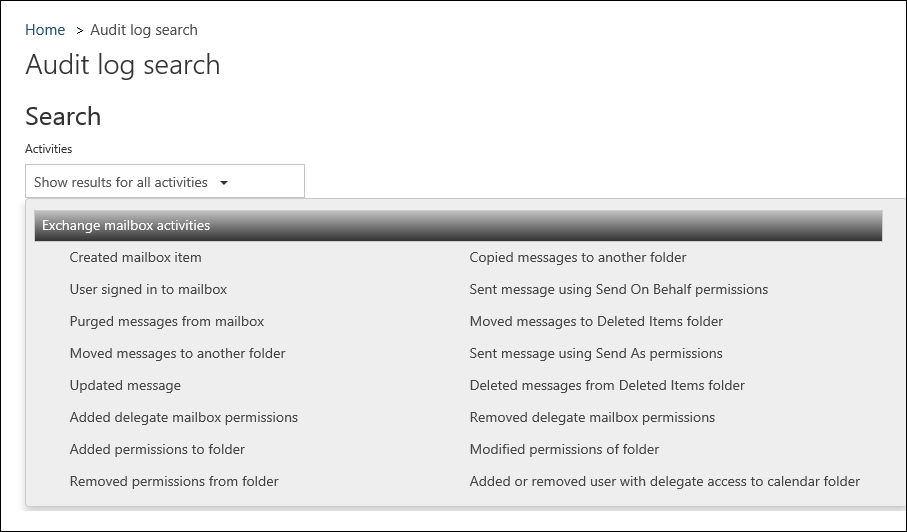

# <a name="enable-mailbox-auditing-in-office-365"></a>Abilitare il controllo delle cassette postali in Office 365
  
In Office 365 è possibile abilitare la registrazione di controllo delle cassette postali per registrare l'accesso alle cassette postali da proprietari, delegati e amministratori delle cassette postali. Per impostazione predefinita, il controllo delle cassette postali in Office 365 non è attivato. Questo significa che gli eventi di controllo della cassetta postale non verranno visualizzati nei risultati quando si esegue una ricerca nel registro di controllo di Office 365 per l'attività della cassetta postale Dopo aver attivato la registrazione di controllo delle cassette postali per una cassetta postale utente, è possibile eseguire una ricerca nel registro di controllo per l'attività della cassetta postale. Inoltre, quando la registrazione di controllo delle cassette postali è attivata, alcune azioni eseguite da amministratori, delegati e proprietari vengono registrate per impostazione predefinita. Per eseguire l'accesso (e quindi cercare) altre azioni, vedere passaggio 3.

## <a name="before-you-begin"></a>Informazioni preliminari
  
- Per abilitare la registrazione di controllo delle cassette postali, è necessario utilizzare Exchange Online PowerShell. Non è possibile utilizzare il Centro sicurezza &amp; e conformità di Office 365 o l'interfaccia di amministrazione di Exchange.
    
- Non è possibile abilitare la registrazione di controllo della cassetta postale associata a un gruppo di Office 365 o a un team di Microsoft teams.
    
- Un amministratore al quale sono state assegnate autorizzazioni accesso completo per la cassetta postale di un utente viene considerato un utente delegato.
  
## <a name="step-1-connect-to-exchange-online-powershell"></a>Passaggio 1: connettersi a PowerShell di Exchange Online

1. Nel computer locale, aprire Windows PowerShell ed eseguire il comando riportato di seguito.
   
    ```
    $UserCredential = Get-Credential
    ```

2. Nella finestra di dialogo **Richiesta credenziali di Windows PowerShell**, digitare il nome utente e la password per l'account dell'amministratore globale Office 365 e fare clic su **OK**.
    
3. Eseguire il comando riportato di seguito:
    
    ```
    $Session = New-PSSession -ConfigurationName Microsoft.Exchange -ConnectionUri https://outlook.office365.com/powershell-liveid/ -Credential $UserCredential -Authentication Basic -AllowRedirection
    ```

3. Eseguire il comando riportato di seguito.

    ```
    Import-PSSession $Session
    ```
   
4. Per verificare di essere connessi alla propria organizzazione Exchange Online, eseguire il seguente comando per visualizzare un elenco di tutte le cassette postali dell'organizzazione:
    
    ```
    Get-Mailbox
    ```
  
Per ulteriori informazioni o se si riscontrano problemi di connessione per l'organizzazione Exchange Online, vedere [Connessione a Exchange Online tramite remote PowerShell](https://go.microsoft.com/fwlink/p/?LinkId=517283).
  
## <a name="step-2-enable-mailbox-audit-logging"></a>Passaggio 2: Abilitare la registrazione di controllo della cassetta postale

Dopo aver effettuato la connessione all'organizzazione di Exchange Online, utilizzare PowerShell per abilitare la registrazione di controllo della cassetta postale per una cassetta postale. In alternativa, è possibile abilitare il controllo della cassetta postale per tutte le cassette postali dell'organizzazione.
  
In questo esempio viene abilitata la registrazione di controllo della cassetta postale di Pilar Pinilla.
  
```
Set-Mailbox -Identity "Pilar Pinilla" -AuditEnabled $true
```

In questo esempio viene illustrato come abilitare la registrazione di controllo della cassetta postale per tutte le cassette postali nell'organizzazione.
  
```
Get-Mailbox -ResultSize Unlimited -Filter {RecipientTypeDetails -eq "UserMailbox"} | Set-Mailbox -AuditEnabled $true
```
  
## <a name="step-3-specify-owner-actions-to-audit"></a>Passaggio 3: Specificare le azioni da sottoporre a controllo

Quando si Abilita il controllo per una cassetta postale, alcune azioni eseguite dal proprietario della cassetta postale vengono controllate per impostazione predefinita. È necessario specificare altre azioni del proprietario da controllare. Vedere la tabella nella sezione [azioni di controllo delle cassette postali](#mailbox-auditing-actions) per un elenco e una descrizione delle azioni del proprietario registrate per impostazione predefinita e le altre azioni che è possibile controllare. 
  
In questo esempio vengono aggiunte le azioni del proprietario **MailboxLogin** e **HardDelete** al controllo delle cassette postali per la cassetta postale di Pilar Pinilla. In questo esempio si presuppone che il controllo delle cassette postali sia già stato abilitato per la cassetta postale. 

```
Set-Mailbox "Pilar Pinilla" -AuditOwner @{Add="MailboxLogin","HardDelete"}
```

In questo esempio viene abilitata la registrazione di controllo delle cassette postali per la cassetta postale di Don Hall e viene specificato che verrà registrata solo l'azione **MailboxLogin** eseguita dal proprietario della cassetta postale. Si noti che in questo esempio viene sovrascritta l'azione UpdateFolderPermissions predefinita. 
  
```
Set-Mailbox "Don Hall" -AuditEnabled $true -AuditOwner MailboxLogin
```
   
In questo esempio vengono aggiunte le azioni del proprietario **MailboxLogin**, **HardDelete**e **SoftDelete** a tutte le cassette postali dell'organizzazione. In questo esempio si presuppone che il controllo delle cassette postali sia già stato abilitato per tutte le cassette postali. 
  
```
Get-Mailbox -ResultSize Unlimited -Filter {RecipientTypeDetails -eq "UserMailbox"} | Set-Mailbox -AuditOwner @{Add="MailboxLogin","HardDelete","SoftDelete"}
```
  
## <a name="how-do-you-know-this-worked"></a>Come verificare se l'operazione ha avuto esito positivo

Per verificare che la registrazione di controllo di una cassetta postale sia attiva, utilizzare il cmdlet **Get-Mailbox** per recuperare le impostazioni di controllo per la cassetta postale. 
  
In questo esempio viene illustrato come recuperate le impostazioni di controllo per Pilar Pinilla.

```
Get-Mailbox "Pilar Pinilla"| FL Audit*
```
   
In questo esempio viene illustrato come recuperate le impostazioni di controllo per tutte le cassette postali utente nell'organizzazione.

```
Get-Mailbox -ResultSize Unlimited -Filter {RecipientTypeDetails -eq "UserMailbox"} | FL Name,Audit*
```
   
Il valore **true** per la proprietà **AuditEnabled consente** verifica che la registrazione di controllo delle cassette postali sia abilitata. 
    
## <a name="mailbox-auditing-actions"></a>Azioni di controllo delle cassette postali
  
Nella tabella seguente sono riportate le azioni che possono essere registrate tramite la registrazione di controllo delle cassette postali. La tabella include l'azione che può essere registrata per i diversi tipi di accesso utente. Nella tabella, un **No** indica che non è possibile registrare un'azione per il tipo di accesso. Un asterisco ( **\*** ) indica che l'azione viene registrata per impostazione predefinita quando la registrazione di controllo delle cassette postali è abilitata per la cassetta postale. 
  
|**Azione**|**Descrizione**|**Amministratore**|**Delegato\*\*\***|**Owner**|
|:-----|:-----|:-----|:-----|:-----|
|**Copia** <br/> |Messaggio copiato in un'altra cartella.  <br/> |Sì  <br/> |No  <br/> |No  <br/> |
|**Create** <br/> |Un elemento viene creato nella cartella calendario, contatti, note o attività nella cassetta postale. ad esempio, viene creata una nuova convocazione di riunione. Si noti che la creazione, l'invio o la ricezione di un messaggio non viene controllato. Inoltre, la creazione di una cartella delle cassette postali non viene controllata.  <br/> |Sì\*  <br/> |Sì\*  <br/> |Sì  <br/> |
|**FolderBind** <br/> |Accesso effettuato a una cartella della cassetta postale. Tale azione viene registrata anche quando l'amministratore o un delegato apre la cassetta postale.  <br/> |Sì  <br/> |Sì\*\*  <br/> |No  <br/> |
|**HardDelete** <br/> |Messaggio eliminato dalla cartella Elementi ripristinabili.  <br/> |Sì\*  <br/> |Sì\*  <br/> |Sì  <br/> |
|**MailboxLogin** <br/> |Accesso effettuato dall'utente alla propria cassetta postale.  <br/> |No  <br/> |No  <br/> |Sì  <br/> |
|**MessageBind** <br/> |Messaggio visualizzato nel riquadro di anteprima o aperto.  <br/> |Sì  <br/> |No  <br/> |No  <br/> |
|**Move** <br/> |Messaggio spostato in un'altra cartella.  <br/> |Sì  <br/> |Sì   <br/> |Sì   <br/> |
|**MoveToDeletedItems** <br/> |Messaggio eliminato e spostato nella cartella Posta eliminata.  <br/> |Sì\*  <br/> |Sì\*  <br/> |Sì  <br/> |
|**SendAs** <br/> |Messaggio inviato utilizzando l'autorizzazione SendAs. Ciò significa che un altro utente ha inviato il messaggio come se provenisse dal proprietario della cassetta postale.  <br/> |Sì\*  <br/> |Sì\*  <br/> |No  <br/> |
|**SendOnBehalf** <br/> |Messaggio inviato utilizzando l'autorizzazione SendOnBehalf. Ciò significa che un altro utente ha inviato il messaggio per conto del proprietario della cassetta postale. Il messaggio indica al destinatario la persona per conto della quale è stato inviato il messaggio e l’utente che ha effettivamente inviato il messaggio.  <br/> |Sì\*  <br/> |Sì\*  <br/> |No  <br/> |
|**SoftDelete** <br/> |Messaggio eliminato in modo definitivo dalla cartella Posta eliminata. Gli elementi eliminati temporaneamente vengono spostati nella cartella Elementi ripristinabili.  <br/> |Sì\*  <br/> |Sì\*  <br/> |Sì  <br/> |
|**Aggiorna** <br/> |Modifiche apportate a un messaggio o alle relative proprietà.  <br/> |Sì\*  <br/> |Sì\*  <br/> |Sì  <br/> |
|**UpdateCalendarDelegation** <br/> |Una delega del calendario è stata assegnata a una cassetta postale. La delega del calendario fornisce a un altro utente nella stessa organizzazione le autorizzazioni per la gestione del calendario del proprietario della cassetta postale.  <br/> |Sì\*  <br/> |No  <br/> |Sì\*  <br/> |
|**UpdateFolderPermissions** <br/> |È stata modificata un'autorizzazione per la cartella. Autorizzazioni per le cartelle controllare quali utenti dell'organizzazione possono accedere alle cartelle in una cassetta postale e i messaggi che si trovano in tali cartelle.  <br/> |Sì\*  <br/> |Sì\*  <br/> |Sì\*  <br/> |
|**UpdateInboxRules** <br/> |È stata aggiunta, rimossa o modificata una regola di posta in arrivo. Le regole di posta in arrivo vengono utilizzate per elaborare i messaggi nella posta in arrivo dell'utente in base alle condizioni specificate e intraprendere azioni quando vengono soddisfatte le condizioni di una regola, ad esempio lo spostamento di un messaggio in una cartella specificata o l'eliminazione di un messaggio.  <br/> |Sì\*  <br/> |Sì\*  <br/> |Sì\*  <br/> |
   
> [!NOTE]
> <sup>\*</sup>Verificata per impostazione predefinita se il controllo è abilitato per una cassetta postale.<br/><br/>  <sup>\*\*</sup>Le voci per le azioni di associazione di cartelle eseguite dai delegati vengono consolidate Viene generata una voce di registro per l'accesso a una singola cartella entro un intervallo di tempo di 24 ore.<br/><br/><sup>\*\*\*</sup>Un amministratore a cui è stata assegnata l'autorizzazione di accesso completo per la cassetta postale di un utente viene considerato un utente delegato. 
  
Se non è più necessario che vengano controllati alcuni tipi di azioni delle cassette postali, è necessario modificare la configurazione della registrazione di controllo della cassetta postale per disabilitare tali azioni. Le voci di registro esistenti non vengono eliminate finché non viene raggiunto il limite di validità della conservazione per le voci del registro di controllo Per ulteriori informazioni sull'età di conservazione per le voci del registro di controllo, vedere la sezione "prima di iniziare" in [Search the audit log in the Office 365 Security _AMP_ Compliance Center](search-the-audit-log-in-security-and-compliance.md#before-you-begin).
  
## <a name="more-infotab"></a>[Altre info](#tab/)
  
- Utilizzare il registro di controllo di Office 365 per cercare l'attività della cassetta postale che è stata registrata. È possibile cercare attività per una cassetta postale utente specifica. Nella schermata seguente viene mostrato un elenco delle attività delle cassette postali che è possibile cercare nel registro di controllo di Office 365. Si noti che queste attività sono le stesse che vengono descritte nella sezione "azioni di controllo delle cassette postali" in questo argomento.
    
    
  
    Nella tabella seguente vengono descritte le attività delle cassette postali di cui è possibile eseguire la ricerca e viene visualizzata la corrispondente azione di controllo delle cassette postali.
    
    |**Attività nel log di controllo**|**Azione di controllo delle cassette postali**|
    |:-----|:-----|
    |Elemento della cassetta postale creato  <br/> |Creazione  <br/> |
    |Copia dei messaggi in un'altra cartella  <br/> |Copia  <br/> |
    |Utente che ha eseguito l'accesso alla cassetta postale  <br/> |MailboxLogin  <br/> |
    |Messaggio inviato utilizzando le autorizzazioni Invia per conto di  <br/> |SendOnBehalf  <br/> |
    |Messaggi eliminati dalla cassetta postale  <br/> |HardDelete  <br/> |
    |Spostamento dei messaggi nella cartella Posta eliminata  <br/> |MoveToDeletedItems  <br/> |
    |Spostamento dei messaggi in un'altra cartella  <br/> |Move  <br/> |
    |Messaggio inviato utilizzando le autorizzazioni Invia come  <br/> |SendAs  <br/> |
    |Messaggio aggiornato  <br/> |Aggiorna  <br/> |
    |Messaggi eliminati dalla cartella Posta eliminata  <br/> |SoftDelete  <br/> |
    |Aggiunta delle autorizzazioni alla cartella  <br/> |UpdateFolderPermissions  <br/> |
    |Autorizzazioni modificate della cartella  <br/> |UpdateFolderPermissions  <br/> |
    |Autorizzazioni riMosse dalla cartella  <br/> |UpdateFolderPermissions  <br/> |
    |Aggiunta o rimozione di un utente con accesso delegato alla cartella del calendario  <br/> |UpdateCalendarDelegation  <br/> |
   
    Si noti che le **autorizzazioni** per le cassette postali dei delegati e le autorizzazioni per le **cassette postAli delegate rimosse** mostrate nella schermata precedente non sono correlate alle azioni di controllo Indicano se un amministratore ha assegnato o rimosso l'autorizzazione per le cassette postali di FullAccess. 
    
    Per informazioni sul Registro di controllo di Office 365, vedere [Search the audit log in the office 365 &amp; Security Compliance Center](search-the-audit-log-in-security-and-compliance.md).
    
- Si presume che alla cassetta postale acceda un amministratore esclusivamente nei seguenti scenari:
    
  - EDiscovery sul posto in Exchange Online o ricerca contenuto in Office 365 viene utilizzato per eseguire la ricerca in una cassetta postale.
    
  - L'[editor MAPI di Microsoft Exchange Server](https://go.microsoft.com/fwlink/p/?linkId=204086) viene utilizzato per accedere alla cassetta postale. 
    
- Quando si abilita la registrazione di controllo delle cassette postali, è possibile specificare anche quali azioni (ad esempio, accesso oppure spostamento o eliminazione di un messaggio) verranno registrate per ciascun tipo di utente (amministratore, delegato o proprietario). 
    
- Per disattivare la registrazione di controllo delle cassette postali, eseguire il seguente comando:

  ```
  Set-Mailbox -Identity <identity of mailbox> -AuditEnabled $false
   ```

- Le azioni sottoposte a controllo per ogni tipo di utente non vengono visualizzate quando si esegue il cmdlet **Get-Mailbox** . Tuttavia, è possibile utilizzare i seguenti comandi per visualizzare tutte le azioni controllate per uno specifico tipo di accesso utente. 

    ```
    Get-Mailbox <identity of mailbox> | Select-Object -ExpandProperty AuditAdmin
    ```

    ```
    Get-Mailbox <identity of mailbox> | Select-Object -ExpandProperty AuditDelegate
    ```

    ```
    Get-Mailbox <identity of mailbox> | Select-Object -ExpandProperty AuditOwner
    ```

- È inoltre possibile esportare un registro di controllo della cassetta postale e specificare le voci da includere per uno o più utenti. Ogni voce del report e del log di controllo include informazioni su chi ha eseguito l'azione e quando, l'azione eseguita, e se l'azione è stata completata correttamente. Per ulteriori informazioni, vedere [esportare registri di controllo delle cassette postali](https://go.microsoft.com/fwlink/p/?LinkID=404104).
