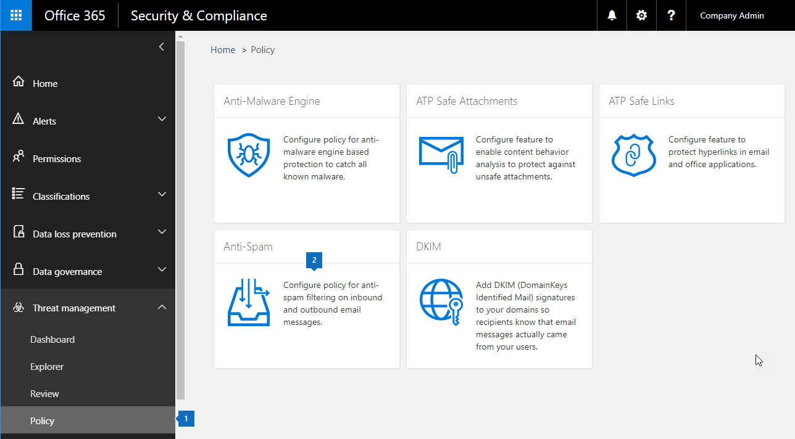

# <a name="enable-or-disable-safety-tips-in-office-365"></a>Abilitare o disabilitare i suggerimenti per la sicurezza in Office 365

Exchange Online Protection (EOP) aggiunge o timbri, una sicurezza suggerimento per i messaggi di posta elettronica viene recapitato. Questi suggerimenti sulla sicurezza specificare i destinatari con un modo rapido e visual per determinare se un messaggio da una cassaforte verifica mittente, se il messaggio è stato contrassegnato come posta indesiderata da Office 365, se il messaggio contiene un elemento potenzialmente dannoso, ad esempio il phishing o se sono immagini esterne stati bloccati. Office 365 ed EOP autonomo gli amministratori possono modificare un'impostazione dei criteri di posta indesiderata per attivare o disattivare i suggerimenti di sicurezza non vengono visualizzate nella posta elettronica in Outlook e altri client di posta elettronica desktop. 
  
Office 365 consente suggerimenti sulla sicurezza per impostazione predefinita per l'organizzazione ed è consigliabile lasciare loro abilitato per contro gli attacchi di posta indesiderata e phishing. È possibile disabilitare i suggerimenti sulla sicurezza per Outlook sul web.
  
Per visualizzare esempi e per conoscere le informazioni visualizzate in suggerimenti sulla sicurezza, vedere [suggerimenti per la sicurezza nei messaggi di posta elettronica in Office 365.](safety-tips-in-office-365.md)
  
Contenuto dell'argomento:
  
- [Per attivare o disattivare i suggerimenti di sicurezza utilizzando la protezione di Office 365 &amp; centro conformità](enable-or-disable-safety-tips.md#SandCCsafetytip)
    
- [Per attivare o disattivare i suggerimenti di sicurezza tramite PowerShell](enable-or-disable-safety-tips.md#pshellsafetytip)
    
## <a name="to-enable-or-disable-safety-tips-by-using-the-office-365-security-amp-compliance-center"></a>Per attivare o disattivare i suggerimenti di sicurezza utilizzando la protezione di Office 365 &amp; centro conformità
<a name="SandCCsafetytip"> </a>

1. Accedere a [https://protection.office.com](https://protection.office.com).
    
2. Accedere a Office 365 con l'account di lavoro o della scuola.
    
3. Scegliere **Threat Management** \> **criteri**. 
    
4. Nella pagina **criteri** , selezionare **protezione da posta indesiderata**.
    
    
  
5. Nella pagina **impostazioni di protezione da posta indesiderata** fare clic sulla scheda **personalizzato** . 
    
    
  
6. Se necessario, scegliere l'opzione **impostazioni personalizzate** per attivare le impostazioni personalizzate. Se l'opzione impostazioni personalizzate è impostato su **Off**, non sarà in grado di modificare i criteri di filtro posta indesiderata.
    
    
  
7. Espandere il criterio della posta indesiderata che si desidera modificare e quindi fare clic su **Modifica criterio**. Ad esempio, fare clic sulla freccia in giù accanto a **posta indesiderata predefiniti filtrare i criteri**. In alternativa, se si desidera, è possibile creare un nuovo criterio facendo clic su **Aggiungi un criterio**.
    
8. Espandere azioni per **la posta indesiderata e blocco** . 
    
9. Per abilitare suggerimenti sulla sicurezza, in **Suggerimenti sulla sicurezza**, selezionare la casella di controllo **su** . Per disattivare suggerimenti sulla sicurezza, deselezionare la casella di controllo **su** . 
    
10. Fare clic su **Salva**.
    
## <a name="to-enable-or-disable-safety-tips-by-using-powershell"></a>Per attivare o disattivare i suggerimenti di sicurezza tramite PowerShell
<a name="pshellsafetytip"> </a>

Gli amministratori possono utilizzare Exchange Online PowerShell per abilitare o disabilitare i suggerimenti sulla sicurezza. Utilizzare il cmdlet Set-HostedContentFilterPolicy per attivare o disattivare i suggerimenti di sicurezza in un criterio di filtro posta indesiderata.
  
1. Connessione a Exchange Online PowerShell. Per informazioni, vedere [Connect to Exchange Online PowerShell](http://go.microsoft.com/fwlink/p/?LinkId=396554).
    
2. Eseguire il cmdlet Set-HostedContentFilterPolicy per attivare o disattivare i suggerimenti di sicurezza:
    
  ```
  Set-HostedContentFilterPolicy -Identity "policy name " -InlineSafetyTipsEnabled <$true|$false>
  ```

    Dove:
    
  -  *nome del criterio* è il nome del criterio che si desidera modificare, ad esempio **predefinita**.
    
  -  `$true`Abilita suggerimenti sulla sicurezza per il criterio di filtro posta indesiderata. 
    
  -  `$false`Consente di disabilitare i suggerimenti sulla sicurezza per il criterio di filtro posta indesiderata. 
    
    Ad esempio, per disattivare suggerimenti sulla sicurezza per il criterio di filtro posta indesiderata predefinito, eseguire il comando seguente:
    
  ```
  PS C:\> Set-HostedContentFilterPolicy -Identity "default" -InlineSafetyTipsEnabled $false
  ```

    Per ulteriori informazioni su questo cmdlet, vedere [Set-HostedContentFilterPolicy](https://technet.microsoft.com/library/jj200781.aspx).
    
## <a name="still-need-help"></a>Ulteriore assistenza?
<a name="pshellsafetytip"> </a>

Se si disabilitato suggerimenti sulla sicurezza, ma vengono visualizzati comunque nei messaggi di posta elettronica, verificare queste operazioni:
  
- È possibile disabilitare i suggerimenti sulla sicurezza per Outlook sul web. Provare a visualizzazione alla stessa posta elettronica in un altro client, ad esempio Outlook.
    
- Suggerimenti sulla sicurezza presenti per impostazione predefinita per ogni uno che utilizza EOP, include tutti gli utenti con Office 365. Per disattivare i suggerimenti di sicurezza siano visualizzati nel messaggio di posta elettronica, è necessario disattivarli utilizzando un criterio di filtro posta indesiderata, come descritto in questo argomento. Dopo aver configurato il criterio, verificare che sia abilitato. Per informazioni sull'attivazione di criteri di filtro da posta indesiderata, vedere [configurazione dei criteri di filtro posta indesiderata](https://technet.microsoft.com/library/jj200684.aspx).
    
Per ulteriori informazioni su come protezione dalla posta indesiderata e phishing come, vedere [Office 365 posta Anti-Spam Protection](anti-spam-protection.md).
  

