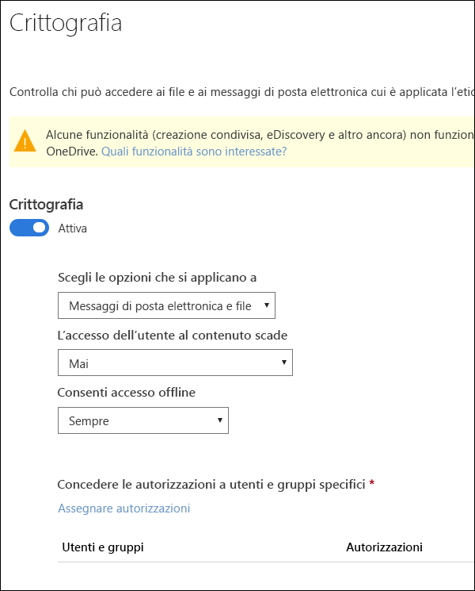
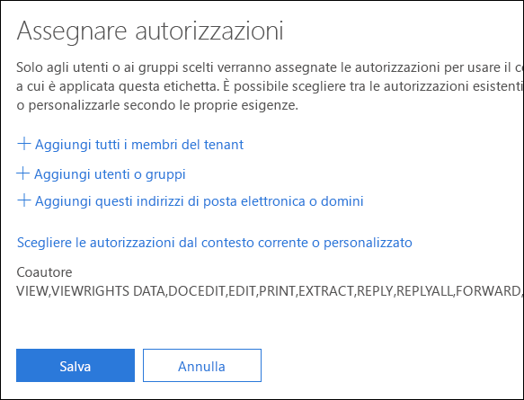
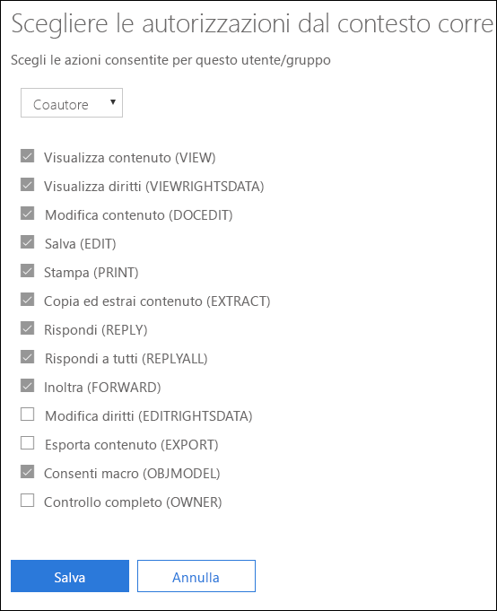
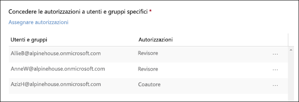

# Limitare l'accesso al contenuto utilizzando la crittografia nelle etichette di riservatezza

Quando si crea un'etichetta di riservatezza, è possibile limitare l'accesso al contenuto a cui verrà applicata l'etichetta. Ad esempio, con le impostazioni di crittografia di un'etichetta di riservatezza, è possibile proteggere i contenuti per determinare le condizioni seguenti:

- Solo gli utenti all'interno dell'organizzazione possono aprire un documento riservato o un messaggio di posta elettronica.
- Solo gli utenti del reparto marketing possono modificare e stampare il documento di annuncio promozione o i messaggi di posta elettronica; tutti gli altri utenti dell'organizzazione possono solo leggerli.
- Gli utenti non possono inoltrare un messaggio di posta elettronica o copiare informazioni da esso contenenti notizie riguardo una riorganizzazione interna.
- Il listino prezzi corrente inviato ai partner commerciali non può essere aperto in seguito a una data specificata.

Quando un documento o un messaggio di posta elettronica è crittografato, l'accesso al contenuto è limitato per fare in modo che si verifichino le condizioni seguenti:

- Il contenuto può essere decrittografato solo dagli utenti autorizzati dalle impostazioni di crittografia dell'etichetta.
- Il contenuto rimane crittografato indipendentemente da dove risiede il file, all'interno o all'esterno dell'organizzazione, anche nel caso in cui il file venisse rinominato.
- Il contenuto resta crittografato sia se il file è archiviato (ad esempio, in un account OneDrive) sia se è in transito (ad esempio, un messaggio di posta elettronica inviato).

Le impostazioni di crittografia sono disponibili nel Centro sicurezza e conformità di Office 365 > pagina **Etichette** > scheda **Riservatezza** > **Crea un'etichetta**.

## Modalità di funzionamento della crittografia

La crittografia utilizza Azure Rights Management (Azure RMS). Azure RMS usa i criteri di crittografia, identità e autorizzazione. Per ulteriori informazioni, vedere [Informazioni su Microsoft Azure Rights Management](https://docs.microsoft.com/it-IT/azure/information-protection/what-is-azure-rms)

## Come attivare la crittografia per un'etichetta di riservatezza

Per iniziare, è sufficiente impostare **Crittografia** su **Attiva**, quindi utilizzare le opzioni seguenti per controllare chi può accedere ai documenti e ai messaggi di posta elettronica a cui verrà applicata tale etichetta. È possibile:

1. **Applicare la crittografia sia ai messaggi di posta elettronica che ai documenti oppure solo alla posta elettronica.** Se si sceglie solo la posta elettronica, i messaggi con l'etichetta saranno crittografati in Outlook, ma i documenti con l'etichetta non saranno crittografati nelle altre app, come Word o PowerPoint. 
2. **Consentire l'accesso al contenuto etichettato solo entro una determinata scadenza**, che può essere una data specifica o un determinato numero di giorni dopo che è stata applicata l'etichetta. Al termine di questo periodo, gli utenti non potranno aprire l'elemento etichettato. Se si specifica una data, sarà rispettato il proprio fuso orario corrente. 
3. **Consentire l'accesso offline** sempre, mai o per un determinato numero di giorni in seguito all'applicazione dell'etichetta. Se si limita l'accesso offline su mai o per un determinato numero di giorni, al termine di tale intervallo di tempo, ogni utente dovrà ripetere l'autenticazione e registrare il proprio accesso. Per ulteriori informazioni, vedere la sezione successiva riguardo la licenza d'uso di Rights Management.

### Licenza d'uso di Rights Management per l'accesso offline

Quando un utente apre un documento o un messaggio di posta elettronica protetto da un'etichetta di riservatezza, gli viene concessa una licenza d'uso di Azure Rights Management per quel contenuto. Questa licenza d'uso è un certificato che contiene i diritti di utilizzo dell'utente per il documento o il messaggio di posta elettronica e la chiave di crittografia usata per crittografare il contenuto. La licenza d'uso contiene anche una data di scadenza (se è stata impostata) e il periodo di validità della licenza d'uso.

Se non è stata impostata alcuna data di scadenza, il periodo di validità predefinito del contratto di licenza con l'utente finale per un tenant è di 30 giorni. Per la durata della licenza d'uso, all'utente non viene richiesto di ripetere l'autenticazione o specificare una nuova autorizzazione per il contenuto. Ciò consente all'utente di continuare ad aprire il documento o il messaggio di posta elettronica protetto senza una connessione Internet. Quando scade il periodo di validità della licenza d'uso, al successivo accesso al documento o al messaggio di posta elettronica protetto, l'utente deve ripetere l'autenticazione o specificare una nuova autorizzazione.

Oltre al nuovo processo di autenticazione, vengono valutati nuovamente il gruppo a cui appartiene l'utente e i relativi criteri. Questo significa che, se dopo l'ultimo accesso, sono cambiati i criteri o il gruppo di appartenenza dell'utente, anche le autorizzazioni per accedere allo stesso documento o messaggio di posta elettronica potrebbero essere cambiate.

Per ulteriori informazioni su come modificare l'impostazione predefinita di 30 giorni, vedere [Licenza d'uso di Rights Management](https://docs.microsoft.com/it-IT/azure/information-protection/configure-usage-rights#rights-management-use-license).

## Assegnare autorizzazioni a utenti o gruppi specifici

È possibile concedere autorizzazioni a utenti specifici in modo che solo essi possano interagire con il contenuto etichettato.

È possibile farlo in due semplici passaggi:

1. Prima di tutto, aggiungere gli utenti o i gruppi a cui verranno assegnate le autorizzazioni per il contenuto etichettato.
2. Quindi scegliere quali autorizzazioni assegnare agli utenti per il contenuto etichettato.

### Aggiungere utenti o gruppi

Quando si assegnano le autorizzazioni, è possibile scegliere:

- Tutti gli utenti dell'organizzazione (tutti i membri del tenant). Questa impostazione include gli account Guest.
- Qualsiasi utente, gruppo di sicurezza abilitato alla posta elettronica, gruppo di distribuzione, gruppo di Office 365 o gruppo di distribuzione dinamico specifico. 
- Qualsiasi indirizzo di posta elettronica o dominio all'esterno dell'organizzazione, ad esempio gmail.com, outlook.com o hotmail.com.

Quando si scelgono tutti i membri del tenant o si sfoglia la directory, gli utenti o i gruppi devono avere un indirizzo di posta elettronica.

È consigliabile utilizzare i gruppi anziché gli utenti, così da mantenere la configurazione più semplice.

### Scegliere le autorizzazioni

Quando si sceglie quali autorizzazioni assegnare agli utenti o ai gruppi, è possibile selezionare:

- Un [livello di autorizzazione predefinito](https://docs.microsoft.com/it-IT/azure/information-protection/configure-usage-rights#rights-included-in-permissions-levels) con un gruppo di diritti preimpostato, ad esempio Coautore o Revisore.
- Un gruppo di diritti personalizzato, dove è possibile selezionare qualunque autorizzazioni si desideri.

Per ulteriori informazioni sulle singole specifiche autorizzazioni, vedere [Diritti di utilizzo e relative descrizioni](https://docs.microsoft.com/it-IT/azure/information-protection/configure-usage-rights#usage-rights-and-descriptions).  

Si noti che la stessa etichetta può concedere autorizzazioni diverse a vari utenti. Ad esempio, una singola etichetta può assegnare alcuni utenti come Revisore e un altro utente come Coautore, come mostrato di seguito.

Per eseguire questa operazione, aggiungere utenti o gruppi, assegnargli le autorizzazioni e salvare le impostazioni. Quindi ripetere questi passaggi, aggiungendo utenti e assegnando loro le autorizzazioni, salvando le impostazioni ogni volta. È possibile farlo con la frequenza desiderata, in modo da poter definire autorizzazioni diverse per utenti diversi.

### L'emittente di Rights Management (l'utente che applica l'etichetta di riservatezza) dispone sempre dell'autorizzazione Controllo completo

La crittografia per un'etichetta di riservatezza usa Azure RMS. Quando un utente applica un'etichetta di riservatezza per proteggere un documento o un messaggio di posta elettronica utilizzando Azure RMS, l'utente diventa l'emittente di Rights Management per quel contenuto.

All'emittente di Rights Management sono sempre concesse le autorizzazioni di controllo completo per il documento o messaggio di posta elettronica. Inoltre:

- Se le impostazioni di protezione includono una data di scadenza, l'emittente di Rights Management può comunque aprire e modificare il documento o il messaggio di posta elettronica in seguito a tale data.
- L'emittente di Rights Management può sempre accedere offline al documento o al messaggio di posta elettronica.
- L'emittente di Rights Management può aprire un documento anche se è stato revocato.

Per ulteriori informazioni, vedere [Emittente di Rights Management e proprietario di Rights Management](https://docs.microsoft.com/it-IT/azure/information-protection/configure-usage-rights#rights-management-issuer-and-rights-management-owner).

## Archiviare contenuti crittografati in OneDrive e SharePoint

Tenere presente che quando la crittografia viene applicata a file archiviati in OneDrive o SharePoint, il servizio non può elaborare il contenuto di tali file. Ciò significa che funzionalità come la creazione condivisa, eDiscovery, ricerca, Delve e altre funzionalità di collaborazione non funzionano. Inoltre, i criteri di prevenzione della perdita dei dati (DLP) possono funzionare solo con i metadati (comprese le etichette di Office 365), ma non con i contenuti di file crittografati (ad esempio i numeri di carta di credito all'interno dei file).

Ciò si applica solo ai contenuti archiviati in OneDrive e SharePoint. In Exchange Online le regole di flusso di posta (note anche come regole di trasporto) usano l'[account utente con privilegi avanzati](https://docs.microsoft.com/it-IT/azure/information-protection/configure-super-users), in modo da poter analizzare il contenuto crittografato e applicare i criteri di prevenzione della perdita dei dati.

## Prerequisiti importanti

Prima di utilizzare la crittografia, potrebbe essere necessario eseguire queste attività.

### Attivazione di Azure Rights Management

Per utilizzare la crittografia nelle etichette di riservatezza, è necessario attivare il servizio di Azure Rights Management nel tenant. Nei tenant più recenti, il servizio è attivo per impostazione predefinita, ma potrebbe essere necessario attivarlo manualmente. Per ulteriori informazioni, vedere [Attivazione di Azure Rights Management](https://docs.microsoft.com/it-IT/azure/information-protection/activate-service).

### Configurare Exchange per Azure Information Protection

Exchange non deve essere configurato per Azure Information Protection prima che gli utenti possano applicare etichette in Outlook per proteggere i propri messaggi di posta elettronica. Tuttavia, se Exchange non è configurato per Azure Information Protection, non si hanno a disposizione le funzionalità complete utilizzando la protezione di Azure Rights Management con Exchange.
 
Ad esempio, gli utenti non possono visualizzare i messaggi di posta elettronica protetti sui telefoni cellulari o con Outlook sul Web, i messaggi di posta elettronica protetti non possono essere indicizzati per la ricerca e non è possibile configurare la DLP di Exchange Online per la protezione di Rights Management. 

Per assicurarsi che Exchange possa supportare questi ulteriori scenari, consultare gli articoli seguenti:

- Per Exchange Online, vedere le istruzioni per [Exchange Online: configurazione di IRM](https://docs.microsoft.com/it-IT/azure/information-protection/configure-office365#exchange-online-irm-configuration).
- Per Exchange locale, è necessario distribuire il [connettore RMS e configurare i server Exchange](https://docs.microsoft.com/it-IT/azure/information-protection/deploy-rms-connector). 
