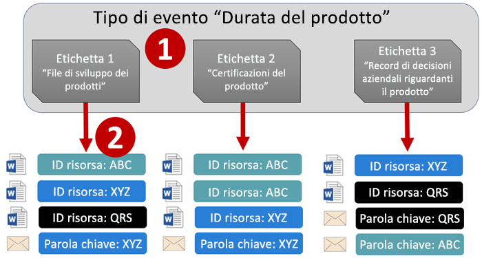
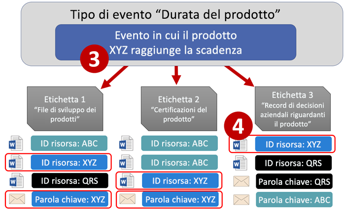
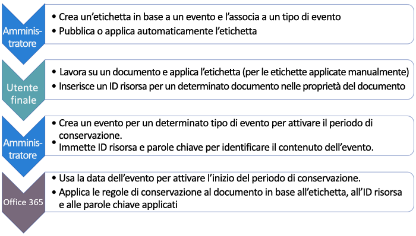
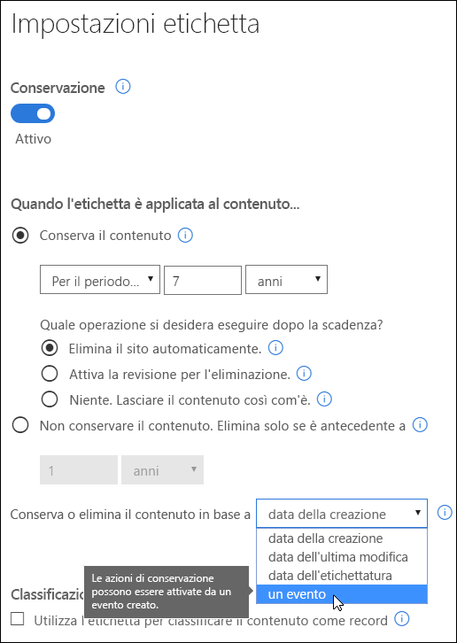
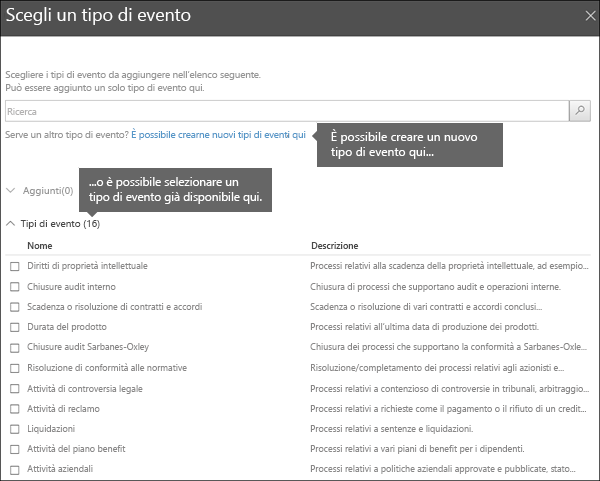
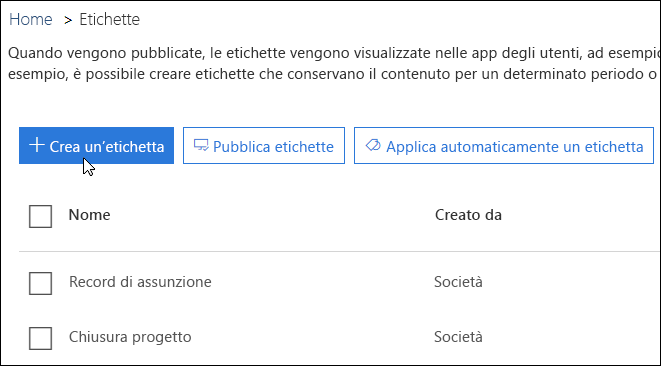
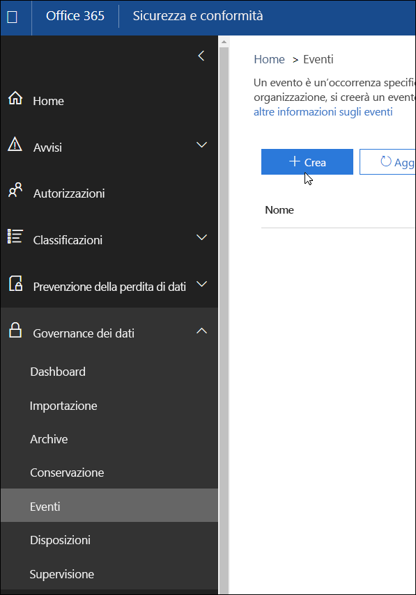
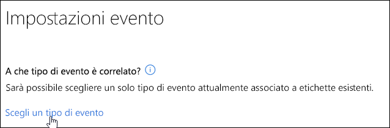
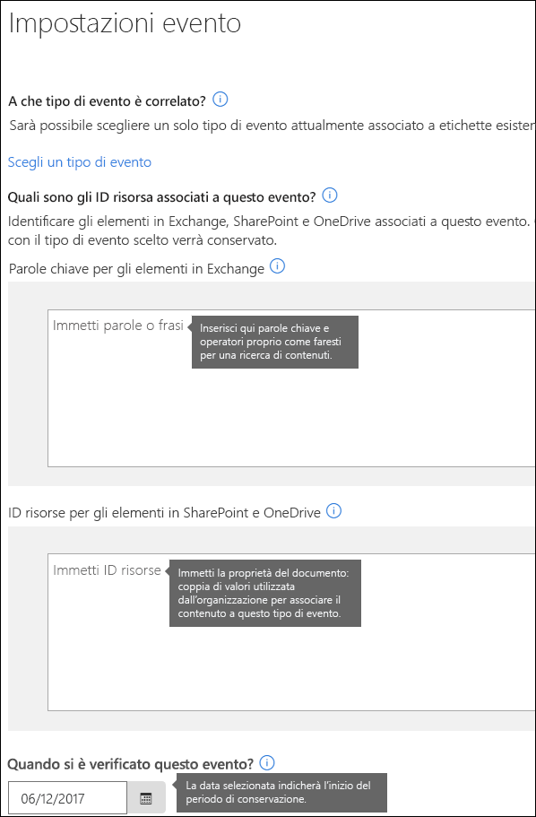

# Panoramica della conservazione basata su eventiOverview of event-driven retention

Quando si conserva il contenuto, il periodo di conservazione si basa spesso sull'età del contenuto: ad esempio, è possibile conservare i documenti per sette anni dopo la loro creazione e quindi eliminarli. Tuttavia, con le etichette di conservazione in Office 365, è possibile basare un periodo di conservazione su quando si verifica un determinato tipo di evento. L'evento attiva l'inizio del periodo di conservazione e tutto il contenuto con un'etichetta di conservazione applicata per quel tipo di evento riceve le azioni di conservazione dell'etichetta applicate su di esso.When you retain content, the retention period is often based on the age of the content - for example, you might retain documents for seven years after they're created and then delete them. But with retention labels in Office 365, you can also base a retention period on when a specific type of event occurs. The event triggers the start of the retention period, and all content with a retention label applied for that type of event get the label's retention actions enforced on them.
  
Ad esempio, è possibile usare etichette con conservazione basata su eventi per:For example, you can use labels with event-driven retention for:
  
- **Dipendenti che lasciano l'organizzazione.** Si supponga che i documenti dei dipendenti debbano essere conservati per 10 anni dal momento in cui un dipendente lascia l'organizzazione. Trascorsi 10 anni, tutti i documenti relativi all'assunzione, alle prestazioni e alla cessazione di tale dipendente devono essere smaltiti. L'evento che attiva il periodo di conservazione di 10 anni è il dipendente che lascia l'organizzazione.**Employees leaving the organization** Suppose that employee records must be retained for 10 years from the time an employee leaves the organization. After 10 years elapse, all documents related to the hiring, performance, and termination of that employee need to be disposed. The event that triggers the 10-year retention period is the employee leaving the organization. 
    
- **Scadenza contratto** Si supponga che tutti i record relativi ai contratti debbano essere conservati per cinque anni dal momento in cui scade il contratto. L'evento che fa scattare il periodo di conservazione di cinque anni è la scadenza del contratto.**Contract expiration** Suppose that all records related to contracts need to be retained for five years from the time the contract expires. The event that triggers the five-year retention period is the expiration of the contract. 
    
- **Durata del prodotto** L'organizzazione potrebbe avere requisiti di conservazione relativi all'ultima data di produzione dei prodotti per i contenuti, come le specifiche tecniche. In questo caso, l'ultima data di produzione è l'evento che attiva il periodo di conservazione.**Product lifetime** Your organization might have retention requirements related to the last manufacturing date of products for content such as technical specifications. In this case, the last manufacturing date is the event that triggers the retention period. 
    
La conservazione basata su eventi viene generalmente utilizzata come parte di un processo di gestione dei record. Ciò significa che:Event-driven retention is typically used as part of a records-management process. This means that:
  
- Anche le etichette basate sugli eventi solitamente classificano il contenuto come un record. Per ulteriori informazioni, vedere [Utilizzo di Ricerca contenuto per trovare tutto il contenuto con un'etichetta di conservazione specifica applicata](labels.md#using-content-search-to-find-all-content-with-a-specific-retention-label-applied-to-it).Labels based on events also usually classify content as a record. For more information, see [Using Content Search to find all content with a specific retention label applied to it](labels.md#using-content-search-to-find-all-content-with-a-specific-retention-label-applied-to-it).
    
- Un documento che è stato dichiarato come record ma il cui trigger di evento non è ancora stato eseguito viene conservato a tempo indeterminato (i record non possono essere eliminati in modo permanente) finché un evento non attiva il periodo di conservazione di quel documento.A document that's been declared as a record but whose event trigger has not yet happened is retained indefinitely (records can't be permanently deleted), until an event triggers that document's retention period.
    
- Le etichette basate su eventi di solito attivano una revisione per l'eliminazione alla fine del periodo di conservazione, in modo che un Record Manager possa esaminare e eliminare manualmente il contenuto. Per ulteriori informazioni, vedere [Panoramica delle revisioni per l'eliminazione](disposition-reviews.md).Labels based on events usually trigger a disposition review at the end of the retention period, so that a records manager can manually review and dispose the content. For more information, see [Overview of disposition reviews](disposition-reviews.md).
    
Un'etichetta basata su un evento ha le stesse funzionalità di qualsiasi etichetta in Office 365. Per ulteriori informazioni, vedere [Panoramica delle etichette](labels.md).A label based on an event has the same capabilities as any label in Office 365. To learn more, see [Overview of labels](labels.md).
    
## Informazioni sulla relazione tra tipi di eventi, etichette, eventi e ID delle risorseUnderstanding the relationship between event types, labels, events, and asset IDs

Per utilizzare correttamente la conservazione basata su eventi, è importante comprendere la relazione tra tipi di eventi, etichette, eventi e ID delle risorse come illustrato qui. Una spiegazione segue il diagramma.To successfully use event-driven retention, it's important to understand the relationship between event types, labels, events, and asset IDs as illustrated here. An explanation follows the diagram.
  

  

  
1. Creare etichette per diversi tipi di contenuti e quindi associarle a un tipo di evento. Ad esempio, le etichette per tipi diversi di file e record di prodotti sono associate a un tipo di evento denominato Durata del prodotto, in quanto tali record devono essere conservati per 10 anni dal momento in cui il prodotto raggiunge la fine del ciclo di vita.You create labels for different types of content and then associate them with a type of event. For example, labels for different types of product files and records are associated with an event type named Product Lifetime because those records must be retained for 10 years from the time the product reaches its end of life.
    
2. Gli utenti (in genere i Record Manager) applicano tali etichette al contenuto e immettono un ID risorsa per ciascun elemento (per i documenti di SharePoint e OneDrive). In questo esempio, l'ID risorsa è un nome del prodotto o un codice utilizzato dall'organizzazione. Pertanto, ai record di ogni prodotto viene assegnata un'etichetta e ogni record ha una proprietà contenente un ID risorsa. Il diagramma rappresenta **tutto il contenuto** per tutti i record di prodotto in un'organizzazione e ogni articolo porta l'ID risorsa del prodotto di cui è il record.Users (typically records managers) apply those labels to content and (for SharePoint and OneDrive documents) enter an asset ID for each item. In this example, the asset ID is a product name or code used by the organization. Thus, each product's records are assigned a label, and each record has a property that contains an asset ID. The diagram represents **all of the content** for all product records in an organization, and each item bears the asset ID of the product whose record it is. 
    
3. La durata del prodotto è il tipo di evento; un prodotto specifico che raggiunge la fine del ciclo di vita è un evento. Quando si verifica un evento di quel tipo (in questo caso, quando un prodotto raggiunge la fine del suo ciclo di vita), si crea un evento che specifica:Product Lifetime is the event type; a specific product reaching end of life is an event. When an event of that event type occurs - in this case, when a product reaches its end of life - you create an event that specifies:
    
  - Un ID risorsa (per i documenti di SharePoint e OneDrive)An asset ID (for SharePoint and OneDrive documents)
    
  - Parole chiave (per gli articoli di Exchange). In questo esempio, l'organizzazione utilizza un codice prodotto nei messaggi contenenti i record del prodotto, pertanto la parola chiave per gli elementi di Exchange è uguale all'ID risorsa per i documenti di SharePoint e OneDrive.Keywords (for Exchange items). In this example, the organization uses a product code in messages containing product records, so the keyword for Exchange items is the same as the asset ID for SharePoint and OneDrive documents.
    
  - La data in cui si è verificato l'evento. Questa data viene utilizzata come inizio del periodo di conservazione. Questa data può essere solo la data attuale o futura, non una passata.The date when the event occurred. This date is used as the start of the retention period. This date can only be the current or a future date, not a past date.
    
4. Dopo aver creato un evento, tale data dell'evento viene sincronizzata con tutto il contenuto che ha un'etichetta di quel tipo di evento e che contiene l'ID risorsa o la parola chiave specificati. Come qualsiasi etichetta, questa sincronizzazione può richiedere fino a 7 giorni. Nel diagramma sopra riportato, il periodo di conservazione di tutti gli elementi cerchiati in rosso è attivato da questo evento. In altre parole, quando questo prodotto raggiunge la fine del suo ciclo di vita, quell'evento attiva il periodo di conservazione per i record di quel prodotto.After you create an event, that event date is synced to all of the content that has a label of that event type and that contains the specified asset ID or keyword. Like any label, this syncing can take up to 7 days. In the diagram above, all of the items circled in red have their retention period triggered by this event - in other words, when this product reaches its end of life, that event triggers the retention period for that product's records.
    
Se non si specifica un ID risorsa o una parole chiave per un evento, **tutto il contenuto** con un'etichetta di quel tipo di evento avrà il suo periodo di conservazione innescato dall'evento. Ciò significa che nel diagramma di cui sopra, tutto il contenuto inizierà a essere conservato, anche se questa operazione non era prevista.It's important to understand that if you don't specify an asset ID or keywords for an event, **all of the content** with a label of that event type will have its retention period triggered by the event. This means that in the diagram above, all of the content would start being retained. This may not be what you intend. 
  
Infine, tenere presente che ogni etichetta ha le proprie impostazioni di conservazione. In questo esempio, tutti gli elementi specificano 10 anni, ma è possibile che un evento attivi etichette con periodi di conservazione diversi.Finally, remember that each label has its own retention settings. In this example, they all specify 10 years, but it's possible for an event to trigger labels where each label has a different retention period.
  
## Come configurare la conservazione basata su eventiHow to set up event-driven retention

Di seguito viene illustrato il flusso di lavoro principale per la conservazione basata su eventi. I passaggi più dettagliati sono riportati in basso.Here's the high-level workflow for event-driven retention. More detailed steps follow below.
  

  
### Passaggio 1: creare un'etichetta il cui periodo di conservazione sia basato su un eventoStep 1: Create a label whose retention period is based on an event

Nel riquadro di spostamento sinistro del Centro conformità Microsoft 365, del Centro sicurezza Microsoft 365 o del Centro sicurezza e conformità di Office 365 scegliere **Classificazioni** > **Etichette** >  scheda **Etichette di conservazione** > **Crea un'etichetta**.In the Microsoft 365 compliance center, Microsoft 365 security center, or Office 365 Security &amp; Compliance Center, in the left navigation, choose **Classifications** > **Labels** > **Retention labels** tab > **Create a label**.
  
Quando si crea l'etichetta, attivare la conservazione, quindi scegliere l'opzione mostrata di seguito per conservare o eliminare il contenuto in base a un evento. Ciò significa che le impostazioni di conservazione non avranno effetto fino al Passaggio 5, quando verrà creato un evento nella pagina **Eventi**.When you create the label, turn on retention, and then choose the option shown below to retain or delete the content based on an event. This means that the retention settings won't go into effect until Step 5, when you create an event on the **Events** page. 
  
La conservazione basata su eventi viene in genere utilizzata per contenuti classificati come record. Per questo motivo, quando si creano etichette basate su un evento, si sceglie solitamente l'opzione **Usa etichetta per classificare il contenuto come "Record"**.Note that event-driven retention is typically used for content that's classified as a record. For this reason, when you create labels based on an event, you typically choose the option to **Use label to classify content as a "Record"**.
  
Inoltre, la conservazione basata su eventi richiede impostazioni di conservazione che:Also note that event-driven retention requires retention settings that:
  
- Conservino il contenuto.Retain the content.
    
- Eliminino il contenuto automaticamente o attivino una revisione per l'eliminazione alla fine del periodo di conservazione.Delete the content automatically or trigger a disposition review at the end of the retention period.
    

  
### Passaggio 2: scegliere un tipo di evento per l'etichettaStep 2: Choose an event type for that label

Nelle impostazioni dell'etichetta, dopo aver scelto l'opzione per basare l'etichetta su **un evento**, verrà visualizzata l'opzione **Scegli un tipo di evento**. Un tipo di evento è semplicemente una descrizione generale di un evento a cui si desidera associare un'etichetta.In the label settings, after you choose the option to base the label on **an event**, you'll see the option to **Choose an event type**. An event type is simply a general description of an event that you want to associate a label with.
  
Ad esempio, se si crea un tipo di evento denominato Durata del prodotto, verranno create le etichette basate sugli eventi con i nomi che descrivono i tipi di contenuti a cui si desidera applicare le etichette, ad esempio "File di sviluppo prodotto" o "Record decisione prodotto aziendale".For example, if you create an event type named Product Lifetime, you'll create event-based labels with names that describe what types of content you want the labels to be applied to, such as "Product development files" or "Product business decision records".
  
Una volta scelto un tipo di evento e creata l'etichetta, il tipo di evento non può essere modificato.Note that once you choose an event type and create the label, the event type cannot be changed.
  

  
### Passaggio 3: pubblicare o applicare automaticamente l'etichettaStep 3: Publish or auto-apply the label

Come per qualsiasi etichetta, è necessario pubblicare o applicare automaticamente un'etichetta basata su eventi perché venga applicata manualmente o automaticamente al contenuto. È possibile effettuare questa operazione nella pagina **Etichette** o **Criteri delle etichette**.Just like any label, you need to publish or auto-apply an event-based label, so that it's manually or automatically applied to content. You can do this on the **Labels** or **Label policies** page. Note that labels that classify content as a record can only be published and manually applied to content. 
  

  
### Passaggio 4: immettere un ID risorsaStep 4: Enter an asset ID

Dopo aver applicato al contenuto un'etichetta basata sugli eventi, è possibile immettere un ID risorsa per ogni elemento. Ad esempio, la propria organizzazione potrebbe utilizzare:After an event-driven label is applied to content, you can enter an asset ID for each item. For example, your organization might use:
  
- Codici prodotto da utilizzare per conservare i contenuti solo per un prodotto specifico.Product codes that you can use to retain content for only a specific product.
    
- Codici prodotto da utilizzare per conservare i contenuti solo per un progetto specifico.Project codes that you can use to retain content for only a specific project.
    
- ID dipendente da utilizzare per conservare i contenuti solo per una persona specifica.Employee IDs that you can use to retain content for only a specific person.
    
ID risorsa è semplicemente un'altra proprietà dei documenti in SharePoint e OneDrive for Business. La propria organizzazione potrebbe già utilizzare altri ID e proprietà dei documenti per classificare il contenuto. In tal caso, è possibile anche utilizzare tali proprietà e valori quando si crea un evento. Vedere il Passaggio 6 di seguito. L'organizzazione deve utilizzare una combinazione di proprietà e valore nelle proprietà del documento per associare quell'elemento a un tipo di evento.Understand that Asset ID is simply another document property in SharePoint and OneDrive for Business. Your organization may already use other document properties and IDs to classify content. If so, you can also use those properties and values when you create an event - see Step 6 below. The important point is that your organization must use some property:value combination in the document properties to associate that item with an event type.
  

  
### Passaggio 5: creare un eventoStep 5: Create an event

Quando si verifica un'istanza particolare di quel tipo di evento, ad esempio quando un prodotto raggiunge la fine del ciclo di vita, accedere alla pagina Eventi nel Centro sicurezza e conformità e creare un evento. È necessario attivare manualmente un evento creandolo.When a particular instance of that event type occurs - for example, a product reaches its end of life - go to the Events page in the Security &amp; Compliance Center and create an event. You need to manually trigger an event by creating it.
  

  
### Passaggio 6: scegliere lo stesso tipo di evento utilizzato per l'etichetta nel Passaggio 2Step 6: Choose the same event type used by the label in step 2

Quando si crea l'evento, scegliere lo stesso tipo di evento utilizzato dall'etichetta nel Passaggio 2, ad esempio Durata del prodotto. Solo il contenuto con le etichette applicate a quel tipo di evento avrà il periodo di conservazione attivato.When you create the event, choose the same event type used by the label in step 2 - for example, Product Lifetime. Only content with labels applied to it of that event type will have its retention period triggered.
  

  
### Passaggio 7: immettere parole chiave o un ID risorsaStep 7: Enter keywords or an asset ID

Restringere quindi l'ambito del contenuto specificando gli ID delle risorse per i contenuti di SharePoint e OneDrive o le parole chiave per il contenuto di Exchange. Per gli ID delle risorse, la conservazione verrà applicata solo al contenuto con la coppia di proprietà e valore specificata. Se non viene inserito un ID risorsa, a **tutto il contenuto** con le etichette di quel tipo di evento viene applicata la stessa data di conservazione.Now you narrow the scope of the content by specifying asset IDs for SharePoint and OneDrive content or keywords for Exchange content. For asset IDs, retention will be enforced only on content with the specified property:value pair. If an asset ID is not entered, **all of the content** with labels of that event type get the same retention date applied to them. 
  
L'ID risorsa è semplicemente un'altra proprietà del documento in SharePoint e OneDrive for Business. Se si utilizza la proprietà ID risorsa, è necessario inserire ComplianceAssetID:\<value\> nella casella per gli ID delle risorse mostrati di seguito.Understand that Asset ID is simply another document property in SharePoint and OneDrive for Business. If you're using the Asset ID property, you would enter ComplianceAssetID:\<value\> in the box for asset IDs shown below.
  
L'organizzazione potrebbe aver applicato altre proprietà e ID ai documenti relativi a questo tipo di evento. Ad esempio, se è necessario rilevare i record di un prodotto specifico, l'ID potrebbe essere una combinazione della proprietà personalizzata ProductID e del valore "XYZ". In questo caso, inserire ProductID:XYZ nella casella per gli ID delle risorse mostrati di seguito.Your organization might have applied other properties and IDs to the documents related to this event type. For example, if you need to detect a specific product's records, the ID might be a combination of your custom property ProductID and the value "XYZ". In this case, you'd enter ProductID:XYZ in the box for asset IDs shown below.
  
Per gli elementi di Exchange, è possibile includere parole chiave. È possibile perfezionare la query utilizzando operatori di ricerca come AND, OR e NOT. Per ulteriori informazioni sugli operatori, vedere [Query con parole chiave e condizioni di ricerca per Ricerca contenuto](keyword-queries-and-search-conditions.md).For Exchange items, you can include keywords. You can refine your query by using search operators like AND, OR, and NOT. For more information on operators, see [Keyword queries and search conditions for Content Search](keyword-queries-and-search-conditions.md).
  
Infine, scegliere la data in cui si è verificato l'evento. Questa data viene utilizzata come inizio del periodo di conservazione. Dopo aver creato un evento, quella data dell'evento viene sincronizzata con tutti i contenuti con un'etichetta di quel tipo di evento, ID risorsa e parole chiave. Come qualsiasi etichetta, questa sincronizzazione può richiedere fino a 7 giorni.Finally, choose the date when the event occurred; this date is used as the start of the retention period. After you create an event, that event date is synced to all of the content with a label of that event type, asset ID, and keywords. Like any label, this syncing can take up to 7 days.
  

  
## Utilizzare Ricerca contenuto per trovare tutti i contenuti con un'etichetta o un ID risorsa specificiUse Content Search to find all content with a specific label or asset ID

Dopo che le etichette sono state assegnate al contenuto, è possibile usare la funzionalità di ricerca di contenuto per trovare tutti i contenuti classificati con un'etichetta specifica o che contengono un ID risorsa specifico.After labels are assigned to content, you can use content search to find all content that's classified with a specific label or that contains a specific asset ID.
  
Quando si crea una ricerca di contenuto:When you create a content search:
  
- Per trovare tutto il contenuto con un'etichetta specifica, selezionare la condizione **Tag di conformità**, quindi immettere il nome completo dell'etichetta o parte di esso e utilizzare un carattere jolly.To find all content with a specific label, choose the **Compliance Tag** condition, and then enter the complete label name or part of the label name and use a wildcard. 
    
- Per trovare tutto il contenuto con un ID risorsa specifico, inserire la proprietà **ComplianceAssetID** e un valore, come ComplianceAssetID:\<value\>.To find all content with a specific asset ID, enter the **ComplianceAssetID** property and a value, like ComplianceAssetID:\<value\>. 
    
Per ulteriori informazioni, vedere [Query delle parole chiave e condizioni di ricerca per ricerca contenuto](keyword-queries-and-search-conditions.md).For more information, see [Keyword queries and search conditions for Content Search](keyword-queries-and-search-conditions.md).
  
## AutorizzazioniPermissions

Per accedere alla pagina **Eventi**, i revisori devono essere membri di un gruppo di ruoli con il ruolo **Gestione eliminazione** e **Solo visualizzazione log di controllo**. Si consiglia di creare un nuovo gruppo di ruoli denominato Revisori eliminazione, aggiungendo questi due ruoli, e quindi membri, a quel gruppo di ruoli.To get access to the **Events** page, reviewers must be members of a role group with the **Disposition Management** role and the **View-Only Audit Logs** role. We recommend creating a new role group called Disposition Reviewers, adding these two roles to that role group, and then adding members to the role group. 
  
Per ulteriori informazioni, vedere [Concedere agli utenti l'accesso al Centro sicurezza e conformità di Office 365](grant-access-to-the-security-and-compliance-center.md).For more information, see [Give users access to the Office 365 Security &amp; Compliance Center](grant-access-to-the-security-and-compliance-center.md).
  
## Automatizzare gli eventi con PowerShellAutomate events by using PowerShell

Nell'interfaccia di amministrazione è possibile creare eventi solo manualmente e non è possibile attivare automaticamente un evento quando si verifica. Tuttavia, è possibile usare un'API REST per attivare eventi automaticamente. Per altre informazioni, vedere [Automatizzare la conservazione basata su eventi](automate-event-driven-retention.md).In the admin center, you can only create events manually; it's not possible to automatically trigger an event when it occurs. However, you can use a Rest API to trigger events automatically; for more information, see [Automate event-based retention](automate-event-driven-retention.md).

È anche possibile usare uno script di PowerShell per automatizzare la conservazione basata su eventi dalle applicazioni aziendali.You can also use a PowerShell script to automate event-based retention from your business applications. Ecco i cmdlet di PowerShell disponibili per la conservazione basata su eventi:Here are the PowerShell cmdlets available for event-driven retention:
  
- [Get-ComplianceRetentionEventTypeGet-ComplianceRetentionEventType](https://go.microsoft.com/fwlink/?linkid=873002)
    
- [New-ComplianceRetentionEventTypeNew-ComplianceRetentionEventType](https://go.microsoft.com/fwlink/?linkid=873004)
    
- [Remove-ComplianceRetentionEventTypeRemove-ComplianceRetentionEventType](https://go.microsoft.com/fwlink/?linkid=873005)
    
- [Set-ComplianceRetentionEventTypeSet-ComplianceRetentionEventType](https://go.microsoft.com/fwlink/?linkid=873006)
    
- [Get-ComplianceRetentionEventGet-ComplianceRetentionEvent](https://go.microsoft.com/fwlink/?linkid=873001)
    
- [New-ComplianceRetentionEventNew-ComplianceRetentionEvent](https://go.microsoft.com/fwlink/?linkid=873003)
    

