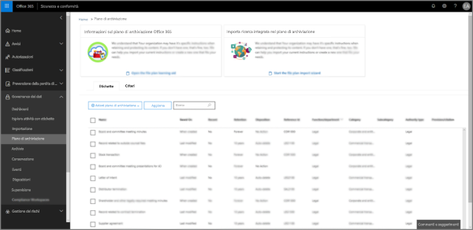
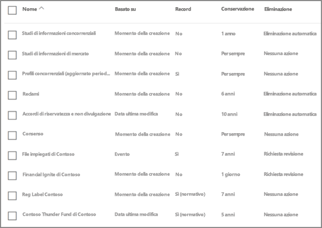
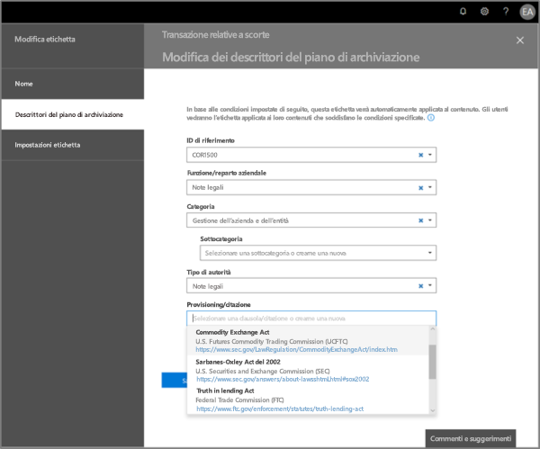
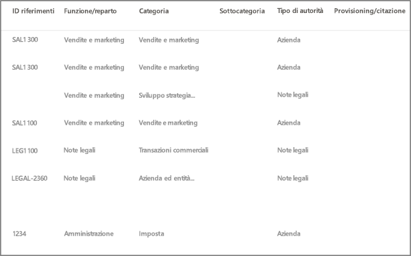
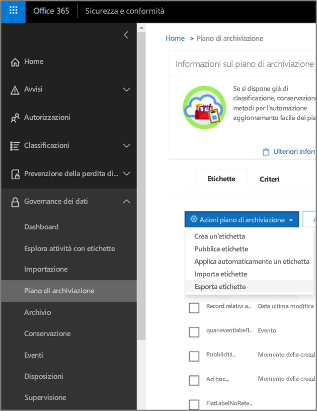
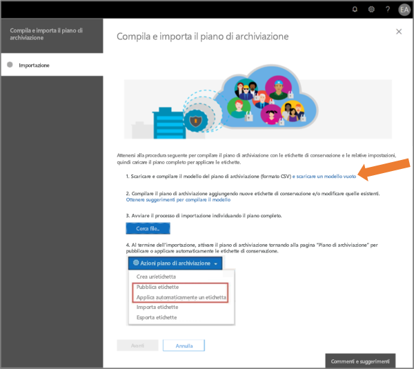
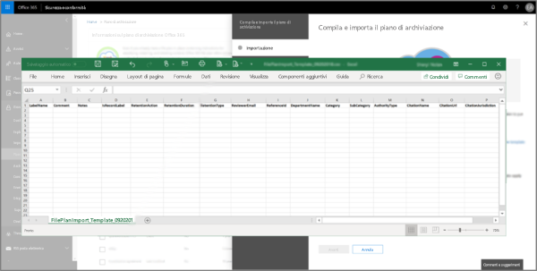
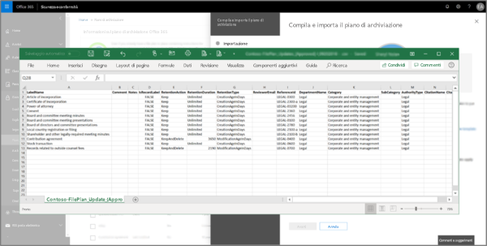
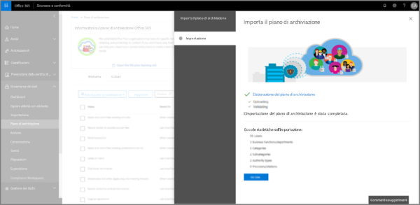
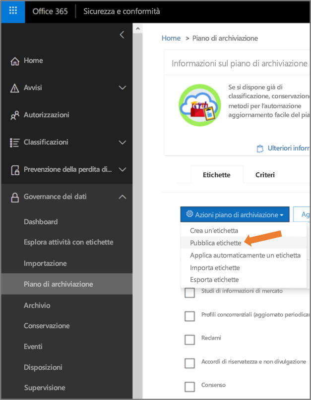

# Panoramica della gestione del piano fileOverview of file plan manager

La gestione del piano file fornisce funzionalità avanzate per la gestione di criteri ed etichette di conservazione e consente di attraversare in modo integrato le attività con etichette ed etichetta-a-contenuto per l’intero ciclo di vita del contenuto, dalla creazione alla collaborazione, passando per la dichiarazione del record e la conservazione, all’eliminazione finale.File plan manager provides advanced management capabilities for retention labels and policies, and provides an integrated way to traverse label and label-to-content activity for your entire content lifecycle – from creation, through collaboration, record declaration, retention, and finally disposition.

## Accesso alla gestione del piano fileAccessing file plan manager

I requisiti per accedere al piano file sono due:There are two requirements to access file plan manager, they are:
- Un abbonamento a Office 365 Enterprise E5.An Office 365 Enterprise E5 subscription.
- L’utente dispone di uno dei ruoli seguenti nel Centro sicurezza e conformità:The user has been in assigned one of the following roles of the Security &amp; Compliance Center:
    - Responsabile della conservazioneRetention Manager
    - Responsabile della conservazione solo visualizzazioneView-only Retention Manager

## Etichette di conservazione e criteri di etichetta predefinitiDefault retention labels and label policy

Se non sono presenti etichette conservazione nel Centro Sicurezza e Conformità, la prima volta in cui scegli **Piano file** nel riquadro di spostamento a sinistra, verrà creato un criterio di etichetta denominato **Criterio di pubblicazione di governance dei dati predefinito**.If there are no retention labels in the Security & Compliance Center, the first time you choose **File plan** in the left nav, this creates a label policy called **Default Data Governance Publishing Policy**. 

Questo criterio di etichetta contiene tre etichette di conservazione:This label policy contains three retention labels:

- **Procedura operativa****Operational procedure**
- **Business general****Business general**
- **Accordo contrattuale****Contract agreement**

Queste etichette di conservazione vengono configurate solo per conservare il contenuto, non per eliminare il contenuto.These retention labels are configured only to retain content, not delete content. Questo criterio di etichetta verrà pubblicato per l'intera organizzazione e può essere disattivato o rimosso.This label policy will be published to the entire organization and can be disabled or removed. 

È possibile stabilire chi ha aperto la gestione del piano file e avviato la first-run experience esaminando il log di controllo per le attività **Criteri di conservazione creati** e **Configurazione di conservazione creata per un criterio di conservazione**.You can determine who opened file plan manager and kicked off the first-run experience by reviewing the audit log for the activities **Created retention policy** and **Created retention configuration for a retention policy**.

> [!NOTE]
> A causa di feedback di alcuni clienti, è stata rimossa la funzionalità che consente di creare le etichette di conservazione predefinite e i criteri di etichetta indicati in precedenza.Due to customer feedback, we have removed this feature that creates the default retention labels and label policy mentioned above. Si vedranno solo questi criteri ed etichette se si utilizza la gestione piano file prima dell'11 aprile 2019.You will only see this policy and labels if you used file plan manager before April 11, 2019.

## Esplorare il piano fileNavigating your file plan

La gestione del piano file semplifica la visualizzazione unica delle impostazioni di tutti i criteri e le etichette di conservazione.File plan manager makes it easier see into and across the settings of all your retention labels and policies from one view.

Si noti che le etichette di conservazione create all'esterno del piano file saranno disponibili nel piano file e viceversa.Note that retention labels created outside of the file plan will be available in the file plan and vice versa.

Nella tabella **etichette piano file** sono disponibili le seguenti informazioni e funzionalità aggiuntive:On the **file plan labels** tab, the following additional information and capabilities are available:

### Colonne impostazioni etichettaLabel settings columns

- **In base a** identifica il tipo di trigger che avvierà il periodo di conservazione. I valori validi sono:**Based on** identifies the type of trigger that will start the retention period. Valid values are:
    - EventoEvent
    - Momento della creazioneWhen created
    - Data ultima modificaWhen last modified
    - Data etichettaturaWhen labeled
- **Record** indica se l'elemento diventa un record dichiarato dopo l'applicazione dell'etichetta. I valori validi sono:**Record** identifies if the item will become a declared record when the label is applied. Valid values are:
    - NoNo
    - SìYes
    - Sì (normativo)Yes(Regulatory)
- **Conservazione** identifica il tipo di conservazione. I valori validi sono:**Retention** identifies the retention type. Valid values are:
    - ConservareKeep
    - Conservare ed eliminareKeep and delete
    - EliminareDelete
- **Disposizione** identifica cosa succederà al contenuto alla fine del periodo di conservazione. I valori validi sono:**Disposition** identifies what will happen to the content at the end of the retention period. Valid values are:
    - nullnull
    - Nessuna azioneNo action
    - Eliminazione automaticaAuto-delete
    - Revisione obbligatoria (ovvero revisione della disposizione)Review required (aka Disposition review)

### Etichettare le colonne dei descrittori del piano fileLabel file plan descriptors columns

È ora possibile includere altre informazioni nella configurazione delle etichette di conservazione. L’inserimento di descrittori del piano file nelle etichette migliora la gestibilità e l'organizzazione del piano file.You can now include more information in the configuration of your retention labels. Inserting file plan descriptors into labels will improve the manageability and organization of your file plan.

Per iniziare, la gestione del piano file fornisce alcuni valori predefiniti per: funzione/reparto, categoria, tipo di autorità e disposizione/citazione. È possibile aggiungere nuovi valori al descrittore del piano file quando si crea o si modifica un'etichetta di conservazione.To get you started, file plan manager provides some out-of-box values for: Function/department, Category, Authority type and Provision/citation. You can add new file plan descriptor values when creating or editing a retention label.

Ecco una visualizzazione del passaggio dei descrittori del piano file quando si crea o modifica un'etichetta di conservazione.Here's a view of the file plan descriptors step when creating or editing a retention label.

Ecco una visualizzazione delle colonne dei descrittori del piano file nella scheda etichette della gestione del piano file.Here's a view of the file plan descriptors columns on the labels tab of file plan manager.

## Esportare le etichette dal piano fileExport labels out of your file plan

Dalla gestione del piano file, è possibile esportare i dettagli di tutte le etichette di conservazione in un file CSV per agevolare le analisi di conformità periodiche con le parti interessate responsabili della governance dei dati all'interno dell'organizzazione.From file plan manager, you can export the details of all retention labels into a .csv file to assist you in facilitating periodic compliance reviews with data governance stakeholders in your organization.

Per esportare tutte le etichette di conservazione, passare a **gestione del piano file** \> **azioni del piano file** \> **esporta etichette**.To export all retention labels, go to **file plan manager** \> **file plan actions** \> **export labels**.

Verrà aperto un file CSV che contiene tutte le etichette di conservazione esistenti.A \*.csv file containing all existing retention labels will open.

## Importare le etichette nel piano fileImport labels into your file plan

Dalla gestione del piano file, è possibile importare in blocco nuove etichette nonché modificare le etichette di conservazione esistenti.From file plan manager, you can bulk import new labels as well as modify existing retention labels.

Per importare nuove etichette di conservazione e aggiornare le etichette esistenti, passare a **gestione del piano file** \> **azioni del piano file** \> **importa etichette**.To import new retention labels and make updates existing retention labels, go to **file plan manager** \> **file plan actions** \> **import labels**.

Scaricare un modello vuoto (o creare a partire da un'esportazione del piano file corrente).Download a blank template (or start from an export of your current file plan).

Compilare il modello (presto disponibili le informazioni di riferimento sui valori validi per le voci).Fill-out the template (coming soon is reference information about valid values for entries).

Caricare il modello compilato e la gestione del piano file convaliderà le voci e visualizzerà le statistiche di importazione.Upload the filled-out template, and file plan manager will validate the entries and display import statistics.

Al termine dell'importazione, tornare alla gestione del piano file per assegnare nuove etichette ai criteri nuovi o esistenti.When the import is complete, return to file plan manager to assign new labels to new or existing policies.

