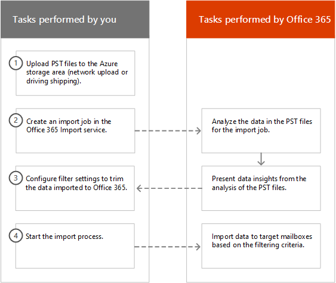

# Filtrare i dati per l'importazione di file PST a Office 365Filter data when importing PST files to Office 365

Utilizzare la nuova funzionalità di importazione intelligente nel servizio di Office 365 importazione per filtrare gli elementi in file PST in realtà, l'importazione alle cassette postali di destinazione. Ecco come funziona:Use the new Intelligent Import feature in the Office 365 Import service to filter the items in PST files that actually get imported to the target mailboxes. Here's how it works:
  
- Dopo aver creato e inviare un processo di importazione file PST, i file PST vengono caricati in un'area di archiviazione Azure nel cloud Microsoft.After you create and submit a PST import job, PST files are uploaded to an Azure storage area in the Microsoft cloud.
    
- Office 365 consente di analizzare i dati in file PST, in modo sicuro e protetto identificando della scadenza di elementi delle cassette postali e i diversi tipi di messaggi inclusi nei file PST.Office 365 analyzes the data in the PST files, in a safe and secure manner, by identifying the age of the mailbox items and the different message types included in the PST files.
    
- Al termine dell'analisi ed sono possibile importare i dati, è possibile importare tutti i dati nei file PST o tagliare i dati importati impostando i filtri che consentono di controllare quali dati vengono importati. Ad esempio, è possibile scegliere di:When the analysis is complete and the data is ready to import, you have the option to import all data in the PST files as is or trim the data that's imported by setting filters that control what data gets imported. For example, you can choose to:
    
  - Importare solo gli elementi di una certa data.Import only items of a certain age.
    
  - Importare i tipi di messaggio selezionato.Import selected message types.
    
  - Escludere i messaggi inviati o ricevuti da determinate persone.Exclude messages sent or received by specific people.
    
- Dopo aver configurato le impostazioni del filtro, Office 365 consente di importare solo i dati che soddisfano i criteri di filtro alle cassette postali di destinazione specificate nel processo di importazione.After you configure the filter settings, Office 365 imports only the data that meets the filtering criteria to the target mailboxes specified in the import job.
    
Nella figura seguente viene illustrato il processo di importazione intelligente e vengono evidenziate le attività eseguite e le attività eseguite da Office 365.The following graphic shows the Intelligent Import process, and highlights the tasks you perform and the tasks performed by Office 365.
  

  
## Informazioni preliminariBefore you begin

- I passaggi descritti in questo argomento si presuppongono che sia stato creato un processo di importazione file PST nel servizio di Office 365 importazione utilizzando il caricamento di rete o della spedizione di unità. Per istruzioni dettagliate, vedere uno degli argomenti seguenti:The steps in this topic assume that you've created a PST import job in the Office 365 Import service by using network upload or drive shipping. For step-by-step instructions, see one of the following topics:
    
  - [Utilizzare il caricamento di rete per importare i file PST su Office 365Use network upload to import PST files to Office 365](use-network-upload-to-import-pst-files.md)
    
  - [Utilizzare la spedizione dell'unità per importare file PST in Office 365Use drive shipping to import PST files to Office 365](use-drive-shipping-to-import-pst-files-to-office-365.md)
    
- Dopo aver creato un processo di importazione utilizzando il caricamento di rete, lo stato del processo di importazione per l'importazione di pagina in Office 365 Security &amp; centro conformità è impostata su **analisi in corso**, il che significa che Office 365 è analisi dei dati in file PST che si caricato. Fare clic su **Aggiorna** per aggiornare lo stato del processo di importazione.After you create an import job by using network upload, the status for the import job on the Import page in Office 365 Security &amp; Compliance Center is set to **Analysis in progress**, which means that Office 365 is analyzing the data in the PST files that you uploaded. Click **Refresh** to update the status for the import job. 
    
- Per l'unità di distribuzione dei processi di importazione, i dati verranno analizzati da Office 365 dopo personale del centro dati Microsoft visualizzato nel disco rigido e caricare i file PST all'area di archiviazione Azure per la propria organizzazione.For drive shipping import jobs, the data will be analyzed by Office 365 after Microsoft data center personnel receive your hard drive and upload the PST files to the Azure storage area for your organization.
  
## Filtrare i dati importati per le cassette postaliFilter data that gets imported to mailboxes

Dopo aver creato un file PST processo di importazione, eseguire la procedura seguente per filtrare i dati prima di importare a Office 365.After you've created a PST import job, follow these steps to filter the data before you import it to Office 365.
  
1. Accedere a [https://protection.office.com/](https://protection.office.com/) e accedere utilizzando le credenziali di un account di amministratore dell'organizzazione Office 365.Go to [https://protection.office.com/](https://protection.office.com/) and sign in using the credentials for an administrator account in your Office 365 organization. 
    
2. Nel riquadro sinistro di Office 365 Security &amp; centro conformità, fare clic su **governance dati** \> **importazione**.In the left pane of the Office 365 Security &amp; Compliance Center, click **Data governance** \> **Import**.
    
    Nella pagina **importazione** sono elencati i processi di importazione per la propria organizzazione. Si noti che il valore **Analisi completata** nella colonna **stato** indica i processi di importazione che sono stati analizzati da Office 365 e si desidera importare.The import jobs for your organization are listed on the **Import** page. Note that the **Analysis completed** value in the **Status** column indicates the import jobs that have been analyzed by Office 365 and are ready for you to import. 
    
    
  
3. Fare clic su **Pronto essere importato a Office 365** per il processo di importazione che si desidera eseguire.Click **Ready to import to Office 365** for the import job that you want to complete. 
    
    Volo pagina viene visualizzato con informazioni sui file PST e altre informazioni sul processo di importazione.A fly out page is displayed with information about the PST files and other information about the import job.
    
4. Fare clic su **Importa a Office 365**.Click **Import to Office 365**.
    
    Verrà visualizzata la pagina di **filtrare i dati** . Contiene informazioni dati sui dati in file PST per il processo di importazione, incluse le informazioni sulla validità dei dati.The **Filter your data** page is displayed. It contains data insights about the data in the PST files for the import job, including information about the age of the data. 
    
    
  
5. Se si desidera tagliare i dati importati per Office 365, in base **si desidera filtrare i dati?**, effettuare una delle operazioni seguenti:Based on whether or not you want to trim the data that's imported to Office 365, under **Do you want to filter your data?**, do one of the following:
    
    r. fare clic su **Sì, desidero filtrarla prima dell'importazione** per tagliare i dati da importare e quindi fare clic su **Avanti**.a. Click **Yes, I want to filter it before importing** to trim the data that you import, and then click **Next**.
    
    Verrà visualizzata la pagina **Importa dati alla pagina di Office 365** con sui concetti di dati dettagliati dall'analisi eseguita Office 365.The **Import data to Office 365 page** page is displayed with detailed data insights from the analysis that Office 365 performed. 
    
    
  
    Il grafico in questa pagina Mostra la quantità di dati che verranno importati. Nel grafico vengono visualizzate informazioni su ogni tipo di messaggio disponibile in file PST. È possibile posizionare il cursore su ogni barra per visualizzare informazioni specifiche su tale tipo di messaggio. È inoltre disponibile un elenco a discesa con valori di durata diversi in base all'analisi dei file PST. Quando si seleziona un periodo nell'elenco a discesa, il grafico viene aggiornato per visualizzare la quantità di dati verranno importati per l'età selezionato.The graph on this page shows the amount of data that will be imported. Information about each message type found in the PST files is displayed in the graph. You can hover the cursor over each bar to display specific information about that message type. There is also a drop-down list with different age values based on the analysis of the PST files. When you select an age in the drop-down list, the graph is updated to show how much data will be imported for the selected age. 
    
    b. per configurare i filtri di aggiunta per ridurre la quantità di dati importati, fare clic su **ulteriori opzioni di filtro**.b. To configure addition filters to reduce the amount of data that's imported, click **More filtering options**.
    
    
  
    È possibile configurare questi filtri:You can configure these filters:
    
      - **Validità** - selezionare un'età in modo che solo gli elementi che sono più recente di validità specificata verrà importata. Vedere la sezione [informazioni](filter-data-when-importing-pst-files.md#moreinfo) per una descrizione su come Office 365 determina i bucket di validità per il filtro di **validità** .**Age** - Select an age so only items that are newer than the specified age will be imported. See the [More information](filter-data-when-importing-pst-files.md#moreinfo) section for a description about how Office 365 determines the age buckets for the **Age** filter. 
    
      - **Tipo** : in questa sezione vengono illustrati tutti i tipi di messaggio che sono stati rilevati nei file PST per il processo di importazione. È possibile deselezionare una casella accanto a un tipo di messaggio che si desidera escludere. Si noti che non è possibile escludere il tipo di messaggio. Vedere la sezione [informazioni](filter-data-when-importing-pst-files.md#moreinfo) per un elenco di elementi delle cassette postali inclusi nella categoria.**Type** - This section shows all the message types that were found in the PST files for the import job. You can uncheck a box next to a message type that you want to exclude. Note that you can't exclude the Other message type. See the [More information](filter-data-when-importing-pst-files.md#moreinfo) section for a list of mailbox items that are included in the Other category. 
    
      - **Gli utenti** , è possibile escludere messaggi inviati o ricevuti da determinate persone. Escludere gli utenti che vengono visualizzati nella From: campo a: campo o Cc: campo dei messaggi, fare clic su **Escludi utenti** accanto a tale tipo di destinatario. Digitare l'indirizzo di posta elettronica (indirizzo SMTP) della persona, fare clic su **Aggiungi** per aggiungerli all'elenco di utenti esclusi per quel tipo di destinatario e quindi fare clic su **Salva** per salvare l'elenco di utenti esclusi.**Users** - You can exclude messages that are sent or received by specific people. To exclude people who appear in the From: field, To: field, or the Cc: field of messages, click **Exclude users** next to that recipient type. Type the email address (SMTP address) of the person, click **Add** to add them to the list of excluded users for that recipient type, and then click **Save** to save the list of excluded users. 
    
        > [!NOTE]
        > Office 365 non viene visualizzata sui concetti di dati restituiti dall'impostazione del filtro di **persone** . Tuttavia, se si imposta questo filtro per escludere i messaggi inviati o ricevuti da determinate persone, i messaggi vengono esclusi durante il processo di importazione effettivo.Office 365 doesn't show data insights that result from setting the **People** filter. However, if you set this filter to exclude messages sent or received by specific people, those messages will be excluded during the actual import process. 
  
    c. fare clic su **Applica** in tempo reale **le opzioni di filtro più** pagina per salvare le impostazioni di filtro.c. Click **Apply** in the **More filtering options** fly out page to save your filter settings. 
    
    I dati sui concetti nella pagina **Importa dati a Office 365** vengono aggiornati in base alle impostazioni di filtro, tra cui la quantità totale di dati che verranno importati in base alle impostazioni del filtro. Si noti che anche è riportato un riepilogo delle impostazioni del filtro. È possibile fare clic su **Edit** accanto a un filtro per modificare l'impostazione se necessario.The data insights on the **Import data to Office 365** page are updated based on your filter settings, including the total amount of data that will be imported based on the filter settings. Note that a summary of the filter settings is also shown. You can click **Edit** next to a filter to change the setting if necessary. 
    
    
  
    d. scegliere **Avanti**.d. Click **Next**.
    
    Viene visualizzata una pagina di stato che mostra le impostazioni di filtro. Nuovamente, è possibile modificare le impostazioni di filtro.A status page is displayed showing your filter settings. Again, you can edit any of the filter settings.
    
    Fare clic su **Importa dati** per avviare l'importazione. Si noti che viene visualizzata la quantità totale di dati che verranno importati.e. Click **Import data** to start the import . Note that the total amount of data that will be imported is displayed. 
    
    OppureOr
    
    r. fare clic su **No, desidera importare tutti gli elementi** per importare tutti i dati in file PST di Office 365 e quindi fare clic su **Avanti**.a. Click **No, I want to import everything** to import all data in the PST files to Office 365, and then click **Next**.
    
    b. nella pagina **Importa dati a Office 365** , fare clic su **Importa dati** per avviare l'importazione. Si noti che viene visualizzata la quantità totale di dati che verranno importati.b. On the **Import data to Office 365** page, click **Import data** to start the import. Note that the total amount of data that will be imported is displayed. 
    
6. Nella pagina **importazione** fare clic su **Aggiorna** . Nella colonna **stato** viene visualizzato lo stato del processo di importazione.On the **Import** page, click **Refresh** . The status for the import job is displayed in the **Status** column. 
    
7. Fare clic su Importa il processo per visualizzare informazioni più dettagliate, ad esempio lo stato di ogni file PST e le impostazioni del filtro che è stato configurato.Click the import the job to display more detailed information, such as the status for each PST file and the filter settings that you configured.

  
## Ulteriori informazioniMore information

- In che modo Office 365 determinare gli incrementi di filtro per la validità? Quando Office 365 consente di analizzare un file PST, esamina il timestamp inviato o ricevuto di ogni elemento (se un elemento contiene un timestamp inviato e ricevuto, la data meno recente è selezionata). Office 365 quindi cerca il valore dell'anno per tale data/ora e viene confrontata con la data corrente per determinare la validità dell'elemento. Questi età vengono quindi utilizzate come valori nell'elenco a discesa per il filtro di **validità** . Ad esempio, se un file PST con i messaggi provenienti da 2016, 2015 e 2014, quindi i valori di filtro **intervallo** sarà **anno 1**, **2 anni**e **3 anni**.How does Office 365 determine the increments for the age filter? When Office 365 analyzes a PST file, it looks at the sent or received time stamp of each item (if an item has both a sent and received timestamp, the oldest date is selected). Then Office 365 looks at the year value for that timestamp and compares it to the current date to determine the age of the item. These ages are then used as the values in the drop-down list for the **Age** filter. For example, if a PST file has messages from 2016, 2015, and 2014, then values in the **Age** filter would be **1 year**, **2 years**, and **3 years**.
    
- Nella tabella seguente sono elencati i tipi di messaggi inclusi nella **categoria il filtro di **tipo** in tempo reale **altre opzioni** pagina** (vedere 5b passaggio nella procedura precedente). Attualmente, non è possibile escludere gli elementi nella categoria "" quando si importano i file pst a Office 365.The following table lists the message types that are included in the **Other** category in the **Type** filter on the **More options** fly out page (see Step 5b in the previous procedure). Currently, you can't exclude items in the "Other" category when you import PSTs to Office 365. 
    
    |**ID classe messaggio****Message class ID**|**Elementi delle cassette postali che utilizzano questa classe messaggio****Mailbox items that use this message class**|
    |:-----|:-----|
    |IPM. AttivitàIPM.Activity    |Voci del diarioJournal entries    |
    |IPM. DocumentoIPM.Document    |Documenti e i file (non è associati a un messaggio di posta elettronica)Documents and files (not attached to an email message)    |
    |IPM. FileIPM.File    |(stesso IPM. Documento)(same as IPM.Document)    |
    |IPM. Note.IMC.NotificationIPM.Note.IMC.Notification    |Report tramite Internet Mail Connect è il gateway Internet del Server di ExchangeReports sent by Internet Mail Connect, which is the Exchange Server gateway to the Internet    |
    |IPM. Note.Microsoft.FaxIPM.Note.Microsoft.Fax    |Messaggi faxFax messages    |
    |IPM. Note.Rules.Oof.Template.MicrosoftIPM.Note.Rules.Oof.Template.Microsoft    |Messaggi di risposta automatica fuori sedeOut-of-office auto-reply messages    |
    |IPM. Note.Rules.ReplyTemplate.MicrosoftIPM.Note.Rules.ReplyTemplate.Microsoft    |Risposte inviate da una regola di posta in arrivoReplies sent by an inbox rule    |
    |IPM. OLE. ClasseIPM.OLE.Class    |Eccezioni per una serie ricorrenteExceptions for a recurring series    |
    |IPM. Recall.ReportIPM.Recall.Report    |Rapporti richiamo messaggioMessage recall reports    |
    |IPM. RemotoIPM.Remote    |Messaggi di posta remotaRemote mail messages    |
    |IPM. ReportIPM.Report    |Relazioni sullo stato elementoItem status reports    |
