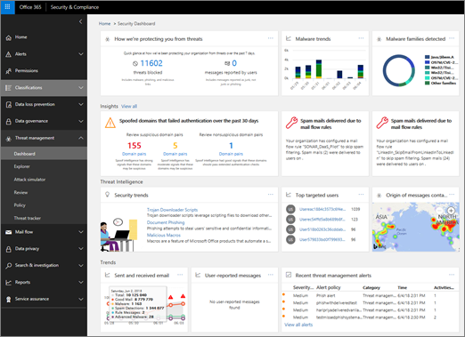
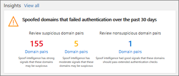

# Procedura: da una dashboard alle informazioni dettagliate

Se si è nuovi per [i report e le informazioni dettagliate nel centro sicurezza &amp; e conformità di Office 365](reports-and-insights-in-security-and-compliance.md), potrebbe essere utile vedere come è possibile spostarsi facilmente da un dashboard a un'intuizione e alle azioni consigliate. 
  
Questa è una delle numerose procedure dettagliate per il centro &amp; sicurezza e conformità. Per visualizzare ulteriori procedure dettagliate, vedere la sezione [argomenti correlati](#related-topics) . 
  
## Procedura dettagliata: da un dashboard a un'intuizione

Let ' s walk through the flow from a Dashboard to a report to a Insight and Action. (Si tratta di un breve esempio di [Intelligence contraffatta](learn-about-spoof-intelligence.md) ). 
  
1. Si inizia con il dashboard di sicurezza nel [centro &amp; sicurezza e conformità](https://protection.office.com). (Andare al \> **Dashboard**di **gestione delle minacce** ).  
  
2. Nella riga **** Insights, si noterà che è necessario esaminare alcuni domini che potrebbero essere sospetti. Nella riga **Insights** fare clic su coppie di **domini**.  
  
3. Viene visualizzato un elenco di attività correlate all'intelligence di spoofing. Questi sono i casi in cui sono stati inviati messaggi di posta elettronica che sembrano provenire dalla nostra organizzazione, ma sono stati, infatti, inviati da un'altra organizzazione. L'obiettivo è determinare se i messaggi falsificati sono autorizzati o meno.  In questo elenco, è possibile ordinare le informazioni in base al numero di messaggi, alla data in cui è stato rilevato l'ultimo spoofing e altro ancora. Fare clic su intestazioni di colonna, ad esempio il **numero di messaggi** o **l'ultima volta** , per vedere come funziona l'ordinamento. 
    
4. Se si seleziona un elemento nell'elenco, verrà aperto un riquadro dei dettagli in cui è possibile visualizzare ulteriori informazioni, inclusi i messaggi di posta elettronica simili rilevati. Fare clic su un elemento nell'elenco ed esaminare le informazioni e i suggerimenti.  
  
5. Si noti che nella parte superiore del riquadro, è disponibile l'opzione per aggiungere il mittente all'elenco dei mittenti consentiti dell'organizzazione. (Non selezionare **Aggiungi all'elenco di mittenti consentiti di AllowedtoSpoof** fino a quando non si è certi di voler eseguire questa operazione. [Per ulteriori informazioni, vedere spoofing Intelligence](learn-about-spoof-intelligence.md). 
  
In questo modo, è possibile passare da un dashboard a intuizioni e azioni consigliate.
  
## Argomenti correlati

[Procedura dettagliata: da un'intuizione a un report dettagliato](from-an-insight-to-a-detailed-report.md)
  
[Procedura dettagliata: da un report dettagliato a un'intuizione](from-a-detailed-report-to-an-insight.md)
  

