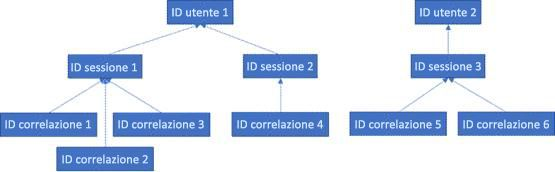

# RGDP per Server Office Web Apps e Office Online Server

I dati di telemetria di Office Online Server e Server Office Web Apps sono archiviati come log ULS. È possibile utilizzare il [Visualizzatore Servizio di registrazione unificato](https://www.microsoft.com/en-us/download/details.aspx?id=44020) per visualizzare i log di Servizio di registrazione unificato dal tenant locale.

Ogni riga di log contiene un CorrelationID. Righe di log correlate condividono lo stesso CorrelationID. Ogni CorrelationID è vincolato a un solo SessionID e un SessionID può riguardare più CorrelationID. Ogni SessionID può riguardare un solo UserID, anche se alcune sessioni possono essere anonime e pertanto possono non essere associate ad alcun UserID. Per determinare quali dati sono associati a un determinato utente, è quindi possibile eseguire il mapping da un unico UserID ai SessionID associati all'utente, da questi SessionID ai CorrelationID associati e dai CorrelationID a tutti i log in queste correlazioni. Vedere il seguente diagramma per la relazione tra i diversi ID.

## Raccolta dei log

Per raccogliere tutti i log associati a UserID 1, ad esempio, il primo passaggio consiste nel raccogliere tutte le sessioni associate a UserID 1 (ad esempio, SessionID 1 e SessionID2). Il passaggio successivo consiste nel raccogliere tutte le correlazioni associate a SessionID 1 (ad esempio, CorrelationIDs 1, 2 e 3) e a SessionID 2 (ad esempio, CorrelationID 4). Infine, raccogliere tutti i log associati a ognuna delle correlazioni dell'elenco.

1.  Avvio di UlsViewer

2.  Aprire il log di Servizio di registrazione unificato corrispondente all'intervallo di tempo desiderato; i log di Servizio di registrazione unificato vengono archiviati in %PROGRAMDATA%\\Microsoft\\OfficeWebApps\\Data\\Logs\\ULS

3.  Modifica | Modifica filtro

4.  Applicare il filtro:

    -   EventID è uguale a apr3y o

    -   EventID è uguale a bp2d6

5.  UserId con hash saranno presenti nel Messaggio di uno o due eventi

6.  Per apr3y, il Messaggio conterrà un valore UserID e un valore PUID

7.  Per bp2d6, il Messaggio conterrà gran parte delle informazioni. Il campo valore LoggableUserId è l'ID utente con hash.

8.  Dopo aver ottenuto UserId con hash da uno di questi due tag, il valore WacSessionId della riga corrispondente in ULSViewer conterrà il valore WacSessionId associato a quell'utente

9.  Raccogliere tutti i valori WacSessionId associati all'utente in questione

10. Filtrare per tutti gli EventId uguali a "xmnv", messaggio uguale a "UserSessionId=\<WacSessionId\>" per il primo WacSessionId nell'elenco (sostituendo la parte \<WacSessionId\> del filtro con WacSessionId)

11. Raccogliere tutti i valori di Correlation corrispondenti a tale WacSessionId

12. Ripetere i passaggi 10 e 11 per tutti i valori di WacSessionId nell'elenco per l'utente in questione

13. Filtrare per tutti i valori di Correlation uguali alla prima Correlation nell'elenco

14. Raccogliere tutti i log corrispondenti a tale Correlation

15. Ripetere i passaggi 13 e 14 per tutti i valori di Correlation nell'elenco per l'utente in questione

## Tipi di dati

I log di Office Online contengono un'ampia varietà di tipi di dati. Di seguito sono riportati alcuni esempi di dati che potrebbero essere contenuti dai log di Servizio di registrazione unificato:

-   Codici di errore per problemi riscontrati durante l'utilizzano del prodotto

-   Pulsanti e altre parti dei dati sull'utilizzo delle app

-   Dati sulle prestazioni dell'applicazione e/o funzionalità particolari all'interno dell'applicazione

-   Informazioni generali sulla posizione del computer dell'utente (ad esempio paese/area geografica, provincia e città, derivate dall'indirizzo IP), ma non la precisa posizione geografica

-   I metadati di base sul browser, ad esempio la versione e il nome del browser e del computer, ad esempio il tipo di sistema operativo e la versione

-   Messaggi di errore dall'host del documento (ad esempio OneDrive, SharePoint, Exchange)

-   Informazioni sui processi interni all'applicazione, non correlate a operazioni che effettuate dall'utente
