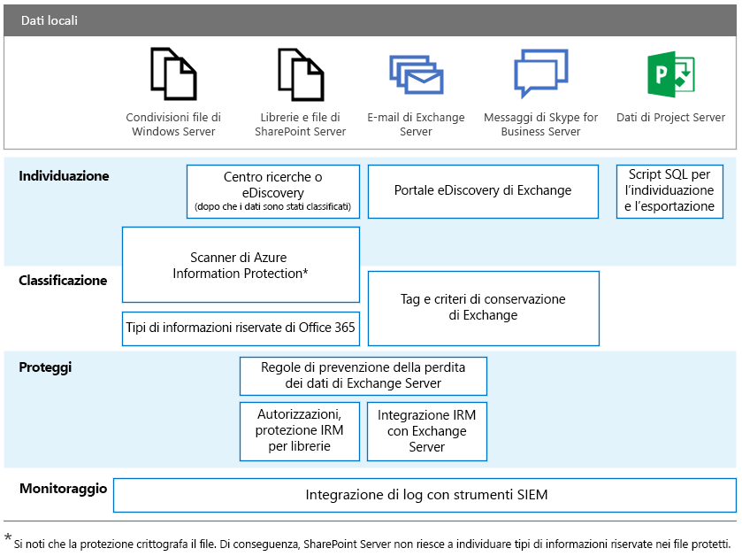

# RGDP per server locali di OfficeGDPR for Office on-premises Servers

L'RGDP presenta i requisiti delle organizzazioni per proteggere i dati personali e rispondere in modo appropriato alle richieste del soggetto dei dati. Questa serie di articoli fornisce i metodi consigliati per i carichi di lavoro locali:The General Data Protection Regulation (GDPR) introduces requirements for organizations to protect personal data and respond appropriately to data subject requests. This series of articles provides recommended approaches for on-premises workloads:

-   [SharePoint ServerSharePoint Server](gdpr-for-sharepoint-server.md)

-   [Exchange ServerExchange Server](gdpr-for-exchange-server.md)

-   [Skype for Business ServerSkype for Business Server](gdpr-for-skype-for-business-server.md)

-   [Project ServerProject Server](gdpr-for-project-server.md)

-   [Server Office Web Apps e Office Online ServerOffice Web Apps Server and Office Online Server](gdpr-for-office-online-server.md)

-   [Condivisioni file localiOn-premises file shares](gdpr-for-on-premises-file-shares.md)

Per ulteriori informazioni sull'RGDP e su come Microsoft può essere di aiuto, vedere [Centro protezione Microsoft](https://www.microsoft.com/it-IT/TrustCenter/Privacy/gdpr/default.aspx).For more information about the GDPR and how Microsoft can help you, see the [Microsoft Trust Center](https://www.microsoft.com/it-IT/TrustCenter/Privacy/gdpr/default.aspx).

Prima di iniziare una qualsiasi operazione con i dati locali, consultare il team di conformità e il team legale per cercare informazioni sugli schemi di classificazione esistenti e sugli approcci all'utilizzo dei dati personali. Microsoft fornisce suggerimenti per lo sviluppo e per l'estensione degli schemi di classificazione nel Microsoft GDPR Data Discovery Toolkit in [http://aka.ms/gdprpartners](<http://aka.ms/gdprpartners>). Il toolkit descrive anche metodi per trasferire dati locali nel cloud, dove è possibile utilizzare funzionalità di gestione dati più complesse, se necessario. Gli articoli di questa sezione contengono suggerimenti per i dati che devono rimanere in locale.Before doing any work with on-premises data, consult with your legal and compliance teams to seek guidance and to learn about existing classification schemas and approaches to working with personal data. Microsoft provides recommendations for developing and extending classifications schemas in the Microsoft GDPR Data Discovery Toolkit at [http://aka.ms/gdprpartners](<http://aka.ms/gdprpartners>). This toolkit also describes approaches for moving on-premises data to the cloud where you can use more sophisticated data governance capabilities, if this is desired. The articles in this section provide recommendations for data that is intended to remain on premises.

Di seguito sono elencate funzionalità consigliate per ognuno di questi carichi di lavoro per individuare, classificare, proteggere e monitorare i dati personali. Vedere gli articoli in questa sezione per ulteriori informazioni.The following illustration lists recommended capabilities to use across each of these workloads to discover, classify, protect, and monitor personal data. See the articles in this section for more information.

## Descrizione dell'illustrazioneIllustration description

Ai fini dell'accessibilità, la seguente tabella fornisce le stesse informazioni dell'illustrazione.For accessibility, the following table provides the same examples in the illustration.

|             |Condivisioni file di Windows ServerWindows Server file shares|SharePoint ServerSharePoint Server|Exchange ServerExchange Server|Skype for BusinessSkype for Business|Project ServerProject Server|
|:------------|:-------------------------|:----------------|:--------------|:-----------------|:-------------|
|IndividuareDiscover|Scanner di Azure Information ProtectionAzure Information Protection scanner\*|Centro ricerche o eDiscovery (dopo la classificazione dei dati); scanner di Azure Information Protection\*Search Center or eDiscovery (after data is classified); Azure Information Protection scanner\*|Portale eDiscovery di ExchangeExchange eDiscovery Portal|Portale eDiscovery di ExchangeExchange eDiscovery portal|Script SQL per l'individuazione e l'esportazioneSQL scripts for discovery and exporting|
|ClassificareClassify|Scanner di Azure Information Protection\*; tipi di informazioni riservate di Office 365Azure Information Protection scanner\*; Office 365 sensitive information types|Scanner di Azure Information Protection\*; tipi di informazioni riservate di Office 365Azure Information Protection scanner\*; Office 365 sensitive information types|Tag e criteri di conservazione di ExchangeExchange retention tags and retention policies|Tag e criteri di conservazione di ExchangeExchange retention tags and retention policies||
|ProteggereProtect||Regole di prevenzione della perdita dei dati di Exchange Server; autorizzazioni, protezione IRM per le raccolteExchange Server data loss prevention rules; Permissions, IRM-protection for libraries|Regole di prevenzione della perdita dei dati di Exchange Server; integrazione IRM con Exchange ServerExchange Server data loss prevention rules; IRM integration with Exchange Server|||
|MonitorareMonitor|Integrazione di log con strumenti SIEMIntegrate logs with SIEM tools|Integrazione di log con strumenti SIEMIntegrate logs with SIEM tools|Integrazione di log con strumenti SIEMIntegrate logs with SIEM tools|Integrazione di log con strumenti SIEMIntegrate logs with SIEM tools|Integrazione di log con strumenti SIEMIntegrate logs with SIEM tools|

\*Si noti che la protezione crittografa il file, di conseguenza, SharePoint Server non riesce a individuare tipi di informazioni riservate nei file protetti.\*Note that protection encrypts the file. Consequently, SharePoint Server can’t find the sensitive information types in protected files.
