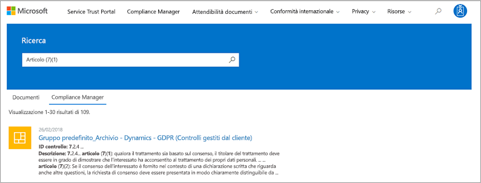
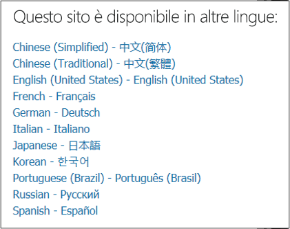

# Introduzione a Microsoft Service Trust PortalGet started with the Microsoft Service Trust Portal

Microsoft Service Trust Portal offre una vasta gamma di contenuti, strumenti e altre risorse relative alle procedure di sicurezza, privacy e conformità di Microsoft.The Microsoft Service Trust Portal provides a variety of content, tools, and other resources about Microsoft security, privacy and compliance practices.
  
## Accesso al Service Trust PortalAccessing the Service Trust Portal

Il Service Trust Portal contiene informazioni dettagliate sull'implementazione di controlli e processi di Microsoft che proteggono i servizi cloud e i dati dei clienti in esso contenuti.The Service Trust Portal contains details about Microsoft's implementation of controls and processes that protect our cloud services and the customer data therein. Per accedere ad alcune delle risorse nel Service Trust Portal, è necessario eseguire l'accesso come utente autenticato con l'account di Microsoft Cloud Services (un account dell'organizzazione di Azure Active Directory o un account Microsoft) ed esaminare e accettare Microsoft Contratto di non divulgazione per i materiali di conformità.To access some of the resources on the Service Trust Portal, you must log in as an authenticated user with your Microsoft cloud services account (either an Azure Active Directory organization account or a Microsoft Account) and review and accept the Microsoft Non-Disclosure Agreement for Compliance Materials.
  
I **clienti esistenti possono accedere al Service Trust Portal** [https://aka.ms/STP](https://aka.ms/STP) con una delle sottoscrizioni online seguenti (Trial or paid):**Existing customers can access the Service Trust Portal** at [https://aka.ms/STP](https://aka.ms/STP) with one of the following online subscriptions (trial or paid): 
  
- Office 365Office 365

- Dynamics 365Dynamics 365

- AzureAzure
    
 > [!NOTE]
 > Gli account di Azure Active Directory associati alle organizzazioni dispongono dell'accesso all'intera gamma di documenti e funzionalità, come Compliance Manager.Azure Active Directory accounts associated with organizations have access to the full range of documents and features like Compliance Manager. Gli account Microsoft creati per uso personale hanno accesso limitato al contenuto del portale del servizio di attendibilità dei servizi.Microsoft accounts created for personal use have limited access to Service Trust Portal content. 
  
**Nuovi clienti e clienti che valutano i Microsoft Online Services****New customers and customers evaluating Microsoft online services**
  
Per creare un nuovo account o creare un account di valutazione, utilizzare uno dei seguenti moduli di iscrizione (utilizzati anche per gli account di valutazione) per accedere all'STP.To create a new account or to create a trial account, use one of the following sign-up forms (also used for trial accounts) to get access to the STP.
  
- Iscriversi a un nuovo [account di valutazione aziendale di office 365](https://go.microsoft.com/fwlink/p/?LinkID=507653) o a un nuovo [account di valutazione di Office 365 Enterprise](https://go.microsoft.com/fwlink/p/?LinkID=698279)Sign up for a new [Office 365 Business trial account](https://go.microsoft.com/fwlink/p/?LinkID=507653) or a new [Office 365 Enterprise trial account](https://go.microsoft.com/fwlink/p/?LinkID=698279)

- Iscriversi a un nuovo [account di valutazione di Dynamics 365](https://go.microsoft.com/fwlink/?LinkId=252780)Sign up for a new [Dynamics 365 trial account](https://go.microsoft.com/fwlink/?LinkId=252780)

- Iscriversi a un nuovo [account di valutazione di Azure](https://go.microsoft.com/fwlink/?LinkId=722737).Sign up for a new [Azure trial account](https://go.microsoft.com/fwlink/?LinkId=722737). 
    
Quando si esegue l'iscrizione a una versione di valutazione gratuita o a un abbonamento, è necessario abilitare Azure Active Directory per supportare l'accesso all'STP.When you sign up for either a free trial, or a subscription, you must enable Azure Active Directory to support your access to the STP.
  
## Utilizzo del Service Trust PortalUsing the Service Trust Portal

Le funzionalità e il contenuto del portale di attendibilità del servizio sono accessibili dal menu principale.The Service Trust Portal features and content are accessible from the main menu.
  

Nelle sezioni seguenti viene descritto ogni elemento del menu principale.The following sections describe each item in the main menu.
  
### Service Trust PortalService Trust Portal

Il collegamento **Service Trust Portal** Visualizza la Home page.The **Service Trust Portal** link displays the home page. Fornisce un modo rapido per tornare alla Home page.It provides a quick way to get back to the home page.

### ConformitàCompliance

Fornisce gli strumenti e le risorse correlati alla conformità seguenti:Provides the following compliance-related tools and resources:

- **Rapporti di controllo** : viene visualizzato un elenco dei rapporti di verifica e valutazione indipendenti sui servizi cloud di Microsoft.**Audit reports** - A list of independent audit and assessment reports on Microsoft's Cloud services is displayed. Questi rapporti forniscono informazioni sui servizi cloud Microsoft rispetto agli standard di protezione dei dati e ai requisiti normativi, ad esempio:These reports provide information about Microsoft Cloud services compliance with data protection standards and regulatory requirements, such as:
  
    - Organizzazione internazionale per la standardizzazione (ISO)International Organization for Standardization (ISO)
    - Controlli organizzazione del servizio (SOC)Service Organization Controls (SOC)
    - Istituto nazionale di Standards and Technology (NIST)National Institute of Standards and Technology (NIST)
    - Programma per la gestione delle autorizzazioni e dei rischi federali (FedRAMP)Federal Risk and Authorization Management Program (FedRAMP)
    - Regolamento generale sulla protezione dei dati (GDPR)General Data Protection Regulation (GDPR)

  Le informazioni sui rapporti di controllo e un collegamento alla pagina dei **rapporti di controllo** vengono visualizzate anche nella Home page del portale del servizio di attendibilItà dei servizi.Information about audit reports and a link to the **Audit reports** page is also displayed on the Service Trust Portal home page. 
  
- **Compliance** Manager-Compliance Manager è uno strumento di valutazione dei rischi basato sul flusso di lavoro che consente di monitorare, assegnare e verificare le attività di conformità alle normative dell'organizzazione relative ai servizi cloud Microsoft, ad esempio Office 365, Dynamics 365 e Azure.**Compliance Manager** - Compliance Manager is a workflow-based risk assessment tool that helps you track, assign, and verify your organization's regulatory compliance activities related to Microsoft Cloud services, such as Office 365, Dynamics 365, and Azure. Utilizzare Compliance Manager per gestire la conformità normativa all'interno del modello di responsabilità condivisa del cloud.Use Compliance Manager to manage regulatory compliance within the shared responsibility model of the cloud. Per ulteriori informazioni, vedere [utilizzare Compliance Manager per soddisfare i requisiti normativi e di protezione dei dati quando si utilizzano i servizi cloud Microsoft](meet-data-protection-and-regulatory-reqs-using-microsoft-cloud.md).For more information, see [Use Compliance Manager to help meet data protection and regulatory requirements when using Microsoft cloud services](meet-data-protection-and-regulatory-reqs-using-microsoft-cloud.md).

### Aree di & IndustriesIndustries & Regions

Fornisce informazioni di conformità specifiche per l'industria e le aree geografiche sui servizi cloud Microsoft.Provides industry- and region-specific compliance information about Microsoft Cloud services.

- **Industries** -fornisce pagine di destinazione specifiche del settore per informazioni e su come i servizi cloud di Microsoft aiutano l'organizzazione a essere conformi agli standard e alle normative per queste industrie:**Industries** - Provides industry-specific landing pages for information and about how Microsoft Cloud services help your organization's be compliant with standards and regulations for these industries:

    - IstruzioneEducation
    - Servizi finanziariFinancial Services
    - GovernoGovernment
    - IntegritàHealth
    - ProduzioneManufacturing
    - DettaglioRetail

- **Regions** -fornisce pareri legali su Microsoft Cloud Services conformità con varie leggi di vari paesi.**Regions** - Provides legal opinions on Microsoft Cloud services compliance with various the laws of various countries. Alcuni paesi sono Australia, Repubblica Ceca, Germania, Polonia, Romania, Spagna e Regno Unito.Specific countries include Australia, Czech Republic, Germany, Poland, Romania, Spain, and the United Kingdom.
  
### Documenti risorse di &Documents & Resources

Offre una vasta gamma di informazioni sulla progettazione e l'implementazione della sicurezza con l'obiettivo di rendere più facile soddisfare gli obiettivi di conformità normativa mediante la comprensione del modo in cui i servizi cloud di Microsoft consentono di proteggere i dati.Provides a wealth of security implementation and design information with the goal of making it easier for you to meet regulatory compliance objectives by understanding how Microsoft Cloud services keep your data secure. Per esaminare il contenuto, selezionare una delle opzioni nella pagina **documenti risorse &** .To review content, select one of the options on the **Documents & Resources** page.

- White paper, domande frequenti e How-to-articlesWhite papers, FAQs, and How-to-articles
- Guide per la conformitàCompliance guides
- Test di penna e valutazioni di sicurezzaPen Tests and Security Assessments
- Secure ScoreSecure Score
- Cianografie di sicurezza e conformità di AzureAzure Security and Compliance Blueprints
- Controlli controllatiAudited Controls
  
### Centro protezioneTrust Center

Collegamenti al [Centro protezione Microsoft](https://www.microsoft.com/trustcenter), in cui sono disponibili ulteriori informazioni sulla sicurezza, la conformità e la privacy nel cloud Microsoft.Links to the [Microsoft Trust Center](https://www.microsoft.com/trustcenter), which provides more information about security, compliance, and privacy in the Microsoft Cloud. Sono incluse informazioni sulle funzionalità dei servizi cloud di Microsoft che è possibile utilizzare per soddisfare i requisiti specifici di GDPR, la documentazione utile per la propria responsabilità GDPR e la comprensione delle misure tecniche e organizzative. Microsoft ha acquisito il supporto di GDPR.This includes information about the capabilities in Microsoft Cloud services that you can use to address specific requirements of the GDPR, documentation helpful to your GDPR accountability and to your understanding of the technical and organizational measures Microsoft has taken to support the GDPR.
  
### Raccolta personaleMy Library

Questa nuova funzionalità consente di salvare (o *aggiungere*) i documenti in modo che sia possibile accedervi rapidamente nella pagina raccolta personale.This new feature lets you save (or *pin*) documents so that you can quickly access them on your My Library page. È inoltre possibile configurare le notifiche in modo che Microsoft invii un messaggio di posta elettronica quando i documenti nella raccolta personale vengono aggiornati.You can also set up notifications so that Microsoft sends you an email message when documents in your My Library are updated. Per ulteriori informazioni, vedere la sezione [My Library](#my-library-1) in questo articolo.For more information, see the [My Library](#my-library-1) section in this article.

### AmministratoreAdmin

Funzioni amministrative disponibili solo per l'account di amministratore globale.Administrative functions that are only available to the global administrator account. Questa opzione è visibile solo quando l'utente ha eseguito l'accesso come amministratore globale.This option is visible only when you are signed in as a global administrator.
  
 La pagina **Impostazioni** consente di assegnare l'accesso basato sui ruoli a Compliance Manager.The **Settings** page lets you to assign role-based access to Compliance Manager. Per ulteriori informazioni, vedere la sezione "autorizzazioni e controllo di accesso basato sui ruoli" in [use Compliance Manager per soddisfare i requisiti normativi e di protezione dei dati quando si utilizzano i servizi cloud Microsoft](meet-data-protection-and-regulatory-reqs-using-microsoft-cloud.md#permissions-and-role-based-access-control).For more information, see the "Permissions and role-based access control" section in [Use Compliance Manager to help meet data protection and regulatory requirements when using Microsoft cloud services](meet-data-protection-and-regulatory-reqs-using-microsoft-cloud.md#permissions-and-role-based-access-control).
  
### RicercaSearch

Fare clic sulla lente di ingrandimento nell'angolo in alto a destra della pagina Service Trust Portal per espandere la casella, immettere i termini di ricerca e premere **invio**.Click the magnifying glass in the upper right-hand corner of the Service Trust Portal page to expand the box, enter your search terms, and press **Enter**.

  
 Viene \*\*\*\* visualizzata la pagina di ricerca, con il termine di ricerca visualizzato nella casella di ricerca e i risultati di ricerca riportati di seguito.The **Search** page is displayed, with the search term displayed in the search box and the search results listed below.
  

Per impostazione predefinita, la ricerca restituisce i risultati dei documenti.By default, Search returns document results. È possibile utilizzare gli elenchi a discesa per affinare l'elenco dei documenti visualizzati.You can the results by using dropdown lists to refine the list of documents displayed. È possibile utilizzare più filtri per limitare l'elenco dei documenti.You can use multiple filters to narrow the list of documents. I filtri includono i servizi cloud specifici, le categorie di conformità o le procedure di sicurezza, le aree geografiche e le industrie.Filters include the specific cloud services, categories of compliance or security practices, regions, and industries. Fare clic sul collegamento nome documento per scaricare il documento.Click the document name link to download the document.
  
Per elencare i controlli dalle valutazioni in Compliance Manager correlate ai termini di ricerca, fare clic su **Compliance Manager**.To list controls from Assessments in Compliance Manager related your search terms, click **Compliance Manager**. I risultati della ricerca mostrano la data in cui è stata creata la valutazione, il nome del gruppo di valutazione, il servizio cloud Microsoft applicabile e se il controllo è Microsoft o gestito dal cliente.The search results show the date the assessment was created, the name of the assessment grouping, the applicable Microsoft Cloud service, and whether the control is Microsoft or Customer Managed. Fare clic sul nome del controllo per visualizzare il controllo nella valutazione in Compliance Manager.Click the name of the control to view the control in the Assessment in Compliance Manager.
  

  
> [!NOTE]
> I report e i documenti del portale di attendibilità del servizio sono disponibili per il download da almeno 12 mesi dopo la pubblicazione o fino a quando non diventa disponibile una nuova versione del documento.Service Trust Portal reports and documents are available to download for at least 12 months after publishing or until a new version of document becomes available.
  
## Raccolta personaleMy Library

Utilizzare la funzionalità raccolta personale per aggiungere documenti e risorse nel Service Trust Portal alla pagina raccolta personale.Use the My Library feature to add documents and resources on the Service Trust Portal to your My Library page. In questo modo è possibile accedere ai documenti rilevanti in un'unica posizione.This lets you access documents that are relevant to you in a single place.  Per aggiungere un documento alla raccolta personale, fare clic sul menu **...** a destra di un documento e quindi selezionare **Salva in raccolta**.To add a document to your My Library, click the **...** menu to the right of a document and then select **Save to library**. È possibile aggiungere più documenti alla raccolta personale facendo clic sulla casella di controllo accanto a uno o più documenti e quindi facendo clic su **Salva in raccolta** nella parte superiore della pagina.You can add multiple documents to your My Library by clicking the checkbox next to one or more documents, and then clicking **Save to library** at the top of the page.

Inoltre, la caratteristica notifiche consente di configurare la raccolta personale in modo che un messaggio di posta elettronica venga inviato all'utente ogni volta che Microsoft aggiorna un documento che è stato aggiunto alla raccolta personale.Additionally, the notifications feature lets you configure your My Library so that an email message is sent to you whenever Microsoft updates a document that you've added to your My Library. Per configurare le notifiche, passare alla raccolta personale e fare clic su **impostazioni di notifica**.To set up notifications, go to your My Library and click **Notification Settings**. È possibile scegliere la frequenza delle notifiche e specificare un indirizzo di posta elettronica all'interno dell'organizzazione a cui inviare le notifiche.You can choose the frequency of notifications and specify an email address in your organization to send notifications to. Le notifiche tramite posta elettronica includono collegamenti ai documenti che sono stati aggiornati e una breve descrizione dell'aggiornamento.Email notifications include links to the documents that have been updated and a brief description of the update.

Si noti inoltre che sono stati identificati tutti i documenti nella raccolta personale che sono stati aggiornati negli ultimi 30 giorni, indipendentemente dal fatto che si attivano o meno le notifiche.Also note that we identify any documents in your My Library that have been updated within the last 30 days, regardless of whether or not you turn on notifications. Una breve descrizione dell'aggiornamento viene visualizzata anche in un suggerimento per gli strumenti.A brief description of the update is also displayed in a tool tip. 

## Starter PackStarter packs

Gli Starter Pack sono un insieme di documentazione a cura di Microsoft sui servizi cloud Microsoft per industrie specifiche.Starter packs are a Microsoft-curated set of documentation about Microsoft Cloud services for specific industries. Attualmente, il Service Trust Portal offre i tre Starter Pack seguenti per le organizzazioni di servizi finanziari.Currently, the Service Trust Portal offers the following three starter packs for financial services organizations. Questi Starter Pack aiutano le organizzazioni a valutare e valutare la sicurezza, la conformità e la privacy nel cloud Microsoft e a fornire indicazioni utili per implementare i servizi cloud Microsoft nel settore dei servizi finanziari altamente regolamentato.These starter packs help organizations evaluate and assess security, compliance, and privacy in the Microsoft Cloud and provide guidance to help implement Microsoft Cloud services in the highly regulated financial services industry.

- **Evaluation Starter Pack** -utilizzare per la valutazione precoce delle organizzazioni di Microsoft Cloud per i servizi finanziari.**Evaluation Starter Pack** - Use for early evaluation of the Microsoft cloud for financial services organizations.

- **Assessment Starter Pack** -dopo la valutazione, utilizzare gli elenchi di controllo e altre linee guida di questo Starter Pack per aiutare l'organizzazione a valutare i rischi legati alla sicurezza, alla conformità e alla privacy.**Assessment Starter Pack** - After evaluation, use the checklists and other guidance in this starter pack to help your organization assess risks related to security, compliance, and privacy.

- **Audit Starter Pack** -User this Starter Pack per informazioni sull'utilizzo dei controlli di controllo e di altro strumento che consentono di guidare l'implementazione di Microsoft Cloud Services in modo da ridurre l'esposizione ai rischi dell'organizzazione.**Audit Starter Pack** - User this starter pack for guidance on using auditing controls and other tool to help guide your implementation of Microsoft Cloud services in a way that helps reduce your organization's exposure to risk.

Per accedere a questi Starter Pack, accedere a **Service Trust Portal _GT_ Industries _AMP_ Regions _GT_ Industry Solutions _GT_ Financial Services**.To access these starter packs, go to **Service Trust Portal > Industries & Regions > Industry Solutions > Financial Services**. È possibile aprire o scaricare documenti da un pacchetto di avvio o salvarli nella raccolta personale.You can open or a download documents from a starter pack or save them to your My Library.

## Supporto alla localizzazioneLocalization support

Il Service Trust Portal consente di visualizzare il contenuto della pagina in diverse lingue.The Service Trust Portal enables you to view the page content in different languages. Per modificare la lingua della pagina, è sufficiente fare clic sull'icona Globe nell'angolo in basso a sinistra della pagina e selezionare la lingua desiderata.To change the page language, simply click on the globe icon in the lower left corner of the page and select the language of your choice. 
  

  
## Commenti e suggerimentiFeedback

È possibile ottenere ulteriori informazioni sul Service Trust Portal oppure sugli errori che si verificano quando si utilizza il portale.We can help with questions about the Service Trust Portal, or errors you experience when you use the portal. È inoltre possibile contattarci con domande e commenti e suggerimenti relativi ai report di conformità e alle risorse di attendibilità dei servizi attendibili utilizzando il collegamento commenti e suggerimenti nella parte inferiore delle pagine STP.You can also contact us with questions and feedback about Service Trust Portal compliance reports and trust resources by using the Feedback link on the bottom of the STP pages.
  
Il feedback è molto importante per noi.Your feedback is very important to us. Fare clic sul pulsante feedback nella parte inferiore della pagina per inviarci commenti su cosa hai fatto o non ti piace, oppure suggerimenti per migliorare i prodotti o le caratteristiche del prodotto.Click on the Feedback button at the bottom of the page to send us comments about what you did or did not like, or suggestions you may have for improving our products or product features.
  

