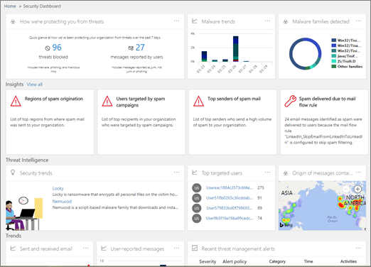

# Introduzione a Office 365 Threat Intelligence

Se si fa parte del team di protezione dell'organizzazione, è possibile utilizzare Business Intelligence di Office 365 minaccia per impedire agli utenti di attacchi di tipo. Consente agli analisti di protezione di Office 365 rischio Intelligence e gli amministratori di proteggere gli utenti da propagazione backup sui concetti e identificazione delle azioni in base a quanto avviene nel proprio ambiente Office 365. Queste informazioni sono basati su un archivio di dati business intelligence rischio e sistemi per campione criteri che corrispondono ad attacchi potenzialmente dannoso attività e comportamenti completo.
  

  
In questo articolo per ulteriori informazioni su cosa includere in Office 365 rischio Intelligence e su come iniziare a.
  
## Che cos'è Office 365 rischio Intelligence?

Business Intelligence di Office 365 rischio è un insieme di sui concetti e le informazioni disponibili in Office 365 Security &amp; centro conformità. Queste informazioni possono proteggere il team di protezione dell'organizzazione agli utenti di Office 365 da attacchi di tipo. Business Intelligence di Office 365 rischio controlla i segnali e raccoglie dati da origini diverse, ad esempio l'attività degli utenti, l'autenticazione, posta elettronica, compromesso PC e problemi di protezione. Decisione aziendale ai responsabili e amministratori globali di Office 365, security administrators e agli analisti di sicurezza tutti utilizzabile le informazioni sulla Business Intelligence di rischio di Office 365 sono disponibili per comprendere e rispondere alle minacce intellettuale e gli utenti di Office 365 proprietà.
  
## Acquisire familiarità con il rischio dashboard Explorer e risolte

Business Intelligence di Office 365 rischio di aree della sicurezza &amp; centro conformità, da un insieme di strumenti e i report, inclusi il [dashboard di rischio](get-started-with-ti.md#dashboard), [Rischio Explorer](get-started-with-ti.md#explorer)e [risolte](get-started-with-ti.md#incidents).
  
### Dashboard di rischio

Utilizzare il dashboard di rischio (ciò è anche denominato [dashboard Security](security-dashboard.md)) per determinare rapidamente le minacce sono stati risolti e come la possibilità di report per decisori aziendali come servizi di Office 365 desidera proteggere l'organizzazione.
  

  
Per visualizzare e utilizzare il dashboard per la protezione &amp; centro conformità, passare a **gestione delle minacce** \> **Dashboard**.
  
### Soluzioni di rischio

Utilizzare l'elenco delle cartelle minaccia per analizzare le minacce, vedere il volume degli attacchi nel tempo e analizzare i dati per le famiglie di rischio, infrastruttura autore dell'attacco e altro ancora. Elenco delle cartelle di rischio è il punto di partenza per flusso di lavoro indagini del analyst qualsiasi protezione.
  

  
Per visualizzare e utilizzare questo report per la protezione &amp; centro conformità, passare a **gestione delle minacce** \> **Explorer**.
  
 ### Risolte

Utilizzare l'elenco risolte per visualizzare un elenco di in problemi di protezione volo. Interventi vengono utilizzati per tenere traccia dei rischi, ad esempio messaggi di posta elettronica sospetti ed eseguire ulteriori analisi e risoluzione dei problemi.
  

  
Per visualizzare l'elenco dei problemi di corrente per l'organizzazione, in sicurezza &amp; centro conformità, passare a **gestione delle minacce** \> **revisione** \> **risolte**.
  

  
## Ulteriori informazioni su Malware &amp; minacce

Durante l'offerta di Business Intelligence di Office 365 rischio, analisti di sicurezza possono esaminare i dettagli su una minaccia noto. Questo è utile per determinare se sono presenti ulteriori misure/operazioni preventive a proteggere gli utenti possono essere eseguite.
  
 
  
## Come si ottengono Intelligence rischio di Office 365?

Business Intelligence di Office 365 rischio è incluso in Office 365 Enterprise E5. Se l'organizzazione utilizza un'altra sottoscrizione di Office 365 Enterprise, ad esempio Office 365 Enterprise E3 Business Intelligence di Office 365 rischio può essere acquistato come componente aggiuntivo. (Come amministratore globale, nell'interfaccia di amministrazione di Office 365 scegliere **fatturazione** \> **Aggiungi sottoscrizioni**.) Per ulteriori informazioni sulle opzioni di pianificazione, vedere [Office 365 Platform Service Description: protezione di Office 365 &amp; centro conformità](https://technet.microsoft.com/en-us/library/dn933793.aspx) e [acquistare o modificare un componente aggiuntivo per Office 365 per aziende](https://support.office.com/article/4e7b57d6-b93b-457d-aecd-0ea58bff07a6).
  
1. Amministratore globale di Office 365, passare a [https://portal.office.com](https://portal.office.com) e accedere utilizzando l'account di lavoro o della scuola per Office 365. 
    
2. Scegliere **amministratore** \> **fatturazione** per verificare cosa include in abbonamento corrente. 
    
3. Se viene visualizzata **E5 Enterprise di Office 365**, l'organizzazione dispone di Business Intelligence di Office 365 rischio.
    
    Se viene visualizzata una sottoscrizione diversa, ad esempio **Office 365 Enterprise E3** o **Office 365 Enterprise E1**, è possibile aggiungere Business Intelligence di Office 365 rischio. A tale scopo, scegliere **Aggiungi sottoscrizione +**.
    
4. Nell'Interfaccia di amministrazione di Office 365 scegliere **Utenti** \> **Utenti attivi**.
    
5. Assegnare licenze di Office 365 rischio Intelligence agli utenti. Per ulteriori informazioni sull'assegnazione delle licenze, vedere [assegnare licenze agli utenti di Office 365 per aziende](https://support.office.com/article/997596b5-4173-4627-b915-36abac6786dc).
    
6. Assegnare ruoli agli utenti dell'organizzazione che verranno utilizzata la Business Intelligence rischio di Office 365. Vedere [fornire agli utenti di accedere a Office 365 Security &amp; centro conformità](grant-access-to-the-security-and-compliance-center.md)e fare riferimento alla tabella riportata di seguito:
    
|||
|:-----|:-----|
|**Per eseguire questa attività...**   |**È necessario disporre di questi ruoli**   |
|Utilizzare il dashboard di rischio (o il nuovo [dashboard sicurezza](security-dashboard.md))    Visualizza informazioni sulle minacce recente o corrente    |Amministratore globale di Office 365    Amministratore della sicurezza (assegnati per la protezione &amp; centro conformità)    Lettore di sicurezza (assegnati per la protezione &amp; centro conformità)    |
|Utilizzare l'elenco delle cartelle rischio (anche noto come Explorer)    Analisi delle minacce    |Amministratore globale di Office 365    Amministratore della sicurezza (assegnati per la protezione &amp; centro conformità)    Lettore di sicurezza (assegnati per la protezione &amp; centro conformità)    |
|Problemi di visualizzazione    Aggiungere messaggi di posta elettronica a un evento imprevisto    |Amministratore globale di Office 365    Amministratore della sicurezza (assegnati per la protezione &amp; centro conformità)    Lettore di sicurezza (assegnati per la protezione &amp; centro conformità)    |
|Attivare la posta elettronica azioni in un evento imprevisto    Cercare ed eliminare messaggi di posta elettronica sospetti    |Amministratore globale di Office 365 o sicurezza    Cercare ed eliminare (assegnati per la protezione &amp; centro conformità)    |
|Integrare Office 365 Threat Intelligence con Windows Defender Advanced Threat Protection    Integrazione di Business Intelligence di rischio di Office 365 con un server SIEM    |Amministratore globale di Office 365    Amministratore della sicurezza (assegnati per la protezione &amp; centro conformità)    Ruolo appropriato assegnata in altre applicazioni (ad esempio, la protezione di Windows Defender avanzate rischio portale o un server SIEM)    |
   
Per informazioni sui ruoli, gruppi di ruoli e autorizzazioni, vedere [autorizzazioni in Office 365 Security &amp; centro conformità](permissions-in-the-security-and-compliance-center.md).
    
## Passaggi successivi

- [Informazioni sulle minacce Tracker - nuovi e degne di nota](threat-trackers.md)
    
- [Trovare e analizzare dannoso posta elettronica che è stato recapitato (Business Intelligence rischio di Office 365)](investigate-malicious-email-that-was-delivered.md)
    
- [Integrare Office 365 Threat Intelligence con Windows Defender Advanced Threat Protection](integrate-office-365-ti-with-wdatp.md)
    
- [Informazioni sui simulatore di attacco](attack-simulator.md)
  

