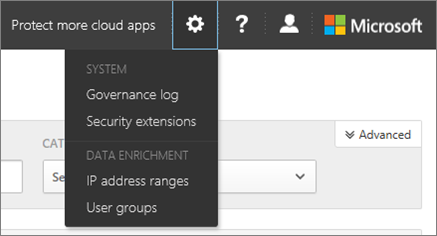

# Raggruppare gli indirizzi IP per semplificare la gestione in Office 365 Cloud App Security
  
|Valutazione * *\>**|Planning * *\>**|Distribuzione * *\>**|Utilizzo * * * *|
|:-----|:-----|:-----|:-----|
|[Iniziare a valutare](office-365-cas-overview.md)   |[Avviare la pianificazione](get-ready-for-office-365-cas.md)   |Sei qui!    [Passaggi successivi](#next-steps)   |[Iniziare a utilizzare](utilization-activities-for-ocas.md)   |
   
Per identificare facilmente i set di indirizzi IP che verranno utilizzati in Office 365 cloud app Security, ad esempio gli indirizzi IP di Office fisici, è possibile configurare gruppi di intervalli di indirizzi IP. La definizione di questi intervalli consente di contrassegnarli e categorizzarli, quindi è possibile utilizzare tag e categorie per personalizzare la modalità di visualizzazione e l'analisi dei registri di attività e degli avvisi.
  
Ogni gruppo di intervalli IP può essere etichettato con i nomi dei tag scelti e quindi i tag possono essere categorizzati in base a un elenco predefinito di categorie IP, ad esempio aziendale, amministrativo, rischioso e VPN. Sono supportati sia gli indirizzi IPv4 che IPv6.
  
> [!NOTE]
> Per eseguire le procedure descritte in questo articolo è necessario essere un amministratore globale o un amministratore della sicurezza. Per ulteriori informazioni, vedere [Permissions in the Office &amp; 365 Security Compliance Center](permissions-in-the-security-and-compliance-center.md). 
  
## Per impostare un intervallo di indirizzi IP in Office 365 cloud app Security

1. In qualità di amministratore globale o amministratore della sicurezza, passare al cloud app Security Portal[https://portal.cloudappsecurity.com](https://portal.cloudappsecurity.com)() ed eseguire l'accesso.
    
2. Nella parte superiore destra della pagina fare clic su **Impostazioni** \> **intervalli di indirizzi IP**.  
  
3. Fare clic sul pulsante nuovo, che assomiglia a un segno di addizione ( **+**).
    
4. Nella finestra **nuovo intervallo di indirizzi IP** specificare i valori seguenti: 
    
|**Campo o elenco**|**cosa fare**|
|:-----|:-----|
|**Nome**   |Utilizzare questo campo per gestire le impostazioni e l'intervallo di indirizzi IP. (Questo valore non verrà visualizzato nei registri delle attività).    |
|**Intervalli di indirizzi IP**   |Specificare un intervallo, utilizzando la notazione del prefisso di rete (nota anche come notazione CIDR). Ad esempio, 192.168.1.0/27 include l'intervallo di valori 192.168.1.0 tramite 192.168.1.31 (inclusive).    |
|**Posizione** e **ISP registrato**   |Specificare il percorso e il provider di servizi Internet (ISP) per l'intervallo di indirizzi IP. Questo sostituisce i campi pubblici definiti per gli indirizzi, che sono utili per i casi, ad esempio un indirizzo IP è considerato pubblicamente in Irlanda, ma è effettivamente negli Stati Uniti.    |
|**Tag**   |Utilizzare i tag per assegnare un nome ai gruppi di indirizzi IP. A differenza del campo nome, verranno visualizzati i tag nei registri delle attività. Digitare una parola o una frase che si desidera utilizzare per un tag. È possibile aggiungere tutti i tag desiderati per ogni intervallo di indirizzi IP. Se è già stato configurato un tag e si desidera aggiungergli l'intervallo di indirizzi IP, selezionarlo dall'elenco dei tag correnti che vengono visualizzati quando si inizia a digitare.    |
|**Categoria**   | Assegnare categorie ai tag per semplificare la riconoscimento delle attività provenienti da determinati indirizzi IP. Scegliere una delle seguenti opzioni:    **Amministrative** Tutti gli indirizzi IP degli amministratori.    **Provider di servizi cloud** L'indirizzo IP del proxy nel cloud.    **Corporate** Tutti gli indirizzi IP nella rete interna, nelle filiali e negli indirizzi di roaming Wi-Fi.    **Rischioso** Tutti gli indirizzi IP considerati rischiosi, ad esempio indirizzi IP sospetti visualizzati in precedenza, indirizzi IP nelle reti dei concorrenti e così via. Per impostazione predefinita, le categorie a rischio includono due tag IP: **proxy anonimo** e **Tor**   **VPN** Tutti gli indirizzi IP utilizzati dai dipendenti remoti.    |
   
7. Fare clic su **Salva**.
    
Dopo aver configurato gli intervalli di indirizzi IP, tenere presente che solo gli eventi futuri sono intaccati da queste modifiche.
  
## Passaggi successivi

- [Criteri di attività e avvisi](activity-policies-and-alerts.md)
    
- [Criteri di rilevamento delle anomalie](anomaly-detection-policies-in-ocas.md)
    
- [Integrare il server SIEM](integrate-your-siem-server-with-office-365-cas.md)
    
- [Esaminare gli avvisi per intervenire in Office 365 Cloud App Security](review-office-365-cas-alerts.md)
    

