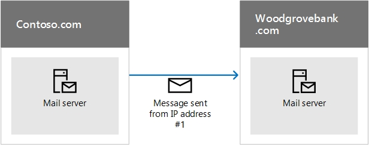
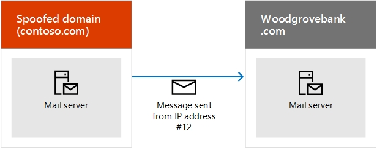

# <a name="how-office-365-uses-sender-policy-framework-spf-to-prevent-spoofing"></a>Utilizzo di Sender Policy Framework (SPF) in Office 365 per impedire lo spoofing

 **Sintesi:** In questo articolo viene descritto come Office 365 utilizza il record TXT Sender Policy Framework (SPF) in DNS per verificare che i sistemi di posta elettronica di destinazione ritengano attendibili i messaggi inviati dal dominio personalizzato. Si applica alla posta in uscita inviata da Office 365. I messaggi inviati da Office 365 a un destinatario all'interno di Office 365 passano sempre SPF. 
  
Un record TXT SPF è un record DNS che consente di impedire lo spoofing e il phishing verificando il nome del dominio da cui vengono inviati i messaggi di posta elettronica. SPF consente di convalidare l'origine dei messaggi di posta elettronica verificando l'indirizzo IP del mittente in base al proprietario del dominio del mittente. 
  
> [!NOTE]
> I tipi di record SPF sono stati deprecati dall'Internet Engineering Task Force (IETF) nel 2014. Assicurarsi quindi di utilizzare i record TXT in DNS per pubblicare le informazioni SPF. Il resto di questo articolo utilizza il termine record TXT SPF per maggiore chiarezza. 
  
Gli amministratori di dominio pubblicano le informazioni SPF in record TXT in DNS. Le informazioni SPF identificano i server di posta elettronica in uscita autorizzati. I sistemi di posta elettronica di destinazione verificano che l'origine dei messaggi sia un server di posta elettronica in uscita autorizzato. Se si ha già familiarità con SPF o si dispone di una distribuzione semplice e si vuole solo sapere cosa includere nel record TXT SPF in DNS per Office 365, è possibile passare a [Set up SPF in Office 365 to help prevent spoofing](set-up-spf-in-office-365-to-help-prevent-spoofing.md). Se non si dispone di una distribuzione completamente ospitata in Office 365 o si necessita di ulteriori informazioni sul funzionamento o sulla risoluzione dei problemi di SPF per Office 365, continuare la lettura di questo articolo.
  
> [!NOTE]
> In precedenza, era necessario aggiungere un record SPF o TXT diverso al dominio personalizzato se si utilizzava anche SharePoint Online. Ciò non è più necessario. Questa modifica dovrebbe ridurre il rischio che i messaggi di notifica di SharePoint Online finiscano nella cartella Posta indesiderata. Non è necessario apportare modifiche immediatamente, ma se si riceve l'errore relativo al "numero eccessivo di ricerche", modificare il record TXT SPF come descritto in [Set up SPF in Office 365 to help prevent spoofing](set-up-spf-in-office-365-to-help-prevent-spoofing.md). 
     
## <a name="how-spf-works-to-prevent-spoofing-and-phishing-in-office-365"></a>Funzionamento di SPF per prevenire spoofing e phishing in Office 365
<a name="HowSPFWorks"> </a>

SPF determina se un mittente è autorizzato a inviare per conto di un dominio. Se il mittente non è autorizzato a farlo, ovvero se la posta elettronica non supera il controllo SPF nel server di ricezione, i criteri contro la posta indesiderata configurati su tale server determinano cosa fare con il messaggio.
  
Ogni record TXT SPF è costituito da tre parti: la dichiarazione che si tratta di un record TXT SPF, gli indirizzi IP autorizzati all'invio della posta dal dominio e i domini esterni in grado di inviare per conto del dominio, e una regola di imposizione. È necessario disporre di tutti e tre gli elementi per avere un record TXT SPF valido. In questo articolo viene descritto come creare il record TXT SPF e vengono illustrate le procedure consigliate per l'utilizzo dei servizi in Office 365. Vengono inoltre forniti i collegamenti alle istruzioni sull'uso del registrar per pubblicare il record in DNS.
  
### <a name="spf-basics-ip-addresses-allowed-to-send-from-your-custom-domain"></a>Nozioni principali su SFP: Indirizzi IP autorizzati all'invio dal dominio personalizzato
<a name="SPFBasicsIPaddresses"> </a>

Ecco la sintassi di base di una regola SPF:
  
v=spf1 \<IP\> \<regola di imposizione\>
  
Si supponga, ad esempio, che sia presente la seguente regola SPF per contoso.com:
  
v=spf1 \<indirizzo IP #1\> \<indirizzo IP #2\> \<indirizzo IP #3\> \<regola di imposizione\>
  
In questo esempio la regola SPF indica al server di posta elettronica ricevente di accettare solo messaggi provenienti da questi indirizzi IP per il dominio contoso.com:
  
- Indirizzo IP #1
    
- Indirizzo IP #2
    
- Indirizzo IP #3
    
Questa regola SPF indica al server di posta elettronica ricevente che se un messaggio proviene da contoso.com, ma non da uno di questi tre indirizzi IP, il server di ricezione deve applicare la regola di imposizione al messaggio. La regola di imposizione è in genere una di queste opzioni:
  
- **Errore bloccante.** Contrassegnare il messaggio con "Errore bloccante" nella busta del messaggio e quindi seguire il criterio contro la posta indesiderata configurato del server di ricezione per questo tipo di messaggio. 
    
- **Errore non bloccante.** Contrassegnare il messaggio con "Errore non bloccante" nella busta del messaggio. In genere, i server di posta elettronica sono configurati per recapitare questi messaggi comunque. La maggior parte degli utenti finali non visualizza questo contrassegno. 
    
- **Neutro.** Non eseguire nessuna operazione, ovvero non contrassegnare la busta del messaggio. In genere è il criterio riservato a motivi di test ed è utilizzato raramente. 
    
Negli esempi seguenti viene illustrato il funzionamento di SPF in diverse situazioni. In questi esempi, contoso.com è il mittente e woodgrovebank.com è il destinatario.
  
### <a name="example-1-email-authentication-of-a-message-sent-directly-from-sender-to-receiver"></a>Esempio 1: Autenticazione di un messaggio di posta elettronica inviato direttamente dal mittente al destinatario
<a name="spfExample1"> </a>

SPF è ideale quando il percorso dal mittente al destinatario è diretto, ad esempio:
  

  
Quando woodgrovebank.com riceve il messaggio, se l'indirizzo IP #1 è nel record TXT SPF per contoso.com, il messaggio passa il controllo SPF e viene autenticato.
  
### <a name="example-2-spoofed-sender-address-fails-the-spf-check"></a>Esempio 2: Indirizzo del mittente falsificato non supera il controllo SPF
<a name="spfExample2"> </a>

Si supponga che un truffatore trovi un modo per effettuare lo spoofing di contoso.com:
  

  
Poiché l'indirizzo IP #12 non è nel record TXT SPF di contoso.com, il messaggio non supera il controllo SPF e il destinatario può scegliere di contrassegnarlo come posta indesiderata.
  
### <a name="example-3-spf-and-forwarded-messages"></a>Esempio 3: SPF e messaggi inoltrati
<a name="spfExample3"> </a>

Uno svantaggio di SPF consiste nel fatto che non funziona quando un messaggio di posta elettronica è stato inoltrato. Ad esempio, si supponga che l'utente in woodgrovebank.com abbia configurato una regola di inoltro per inviare tutta la posta elettronica a un account di outlook.com:
  

  
Il messaggio all'inizio supera il controllo SPF in woodgrovebank.com, ma poi non passa quello in outlook.com perché l'IP #25 non è nel record TXT SPF di contoso.com. Outlook.com potrebbe quindi contrassegnare il messaggio come posta indesiderata. Per risolvere il problema, utilizzare SPF insieme ad altri metodi di autenticazione di posta elettronica quali DKIM e DMARC.
  
### <a name="spf-basics-including-third-party-domains-that-can-send-mail-on-behalf-of-your-domain"></a>Nozioni principali su SFP: Inclusione di domini di terze parti in grado di inviare posta elettronica per conto del proprio dominio
<a name="SPFBasicsIncludes"> </a>

Oltre agli indirizzi IP, è possibile configurare il record TXT SPF anche in modo che includa domini come mittenti. Questi vengono aggiunti al record TXT SPF come istruzioni "#include". Ad esempio, contoso.com potrebbe includere tutti gli indirizzi IP dei server di posta da contoso.net e contoso.org, anch'essi di sua proprietà. A tale scopo, contoso.com pubblica un record TXT SPF simile al seguente:
  
```
IN TXT "v=spf1 include:contoso.net include:contoso.org -all"
```

Quando il server di ricezione visualizza questo record in DNS, esegue anche una ricerca DNS sul record TXT SPF per contoso.net e quindi per contoso.org. Se rileva un'ulteriore istruzione "#include" all'interno dei record per contoso.net o contoso.org, seguirà anche questi. Per evitare attacchi Denial of Service, il numero massimo di ricerche DNS per un singolo messaggio di posta elettronica è 10. Ogni istruzione #include rappresenta una ricerca DNS aggiuntiva. Se un messaggio supera il limite di 10, il messaggio non supera il controllo SPF. Una volta che un messaggio raggiunge tale limite, a seconda di come è configurato il server di ricezione, il mittente potrebbe ricevere un messaggio che indica che il messaggio ha generato un "numero eccessivo di ricerche" o che il "numero massimo di hop per il messaggio è stato superato". Per suggerimenti su come evitarlo, vedere [Risoluzione dei problemi: procedure consigliate per SPF in Office 365](how-office-365-uses-spf-to-prevent-spoofing.md#SPFTroubleshoot).
  
## <a name="requirements-for-your-spf-txt-record-and-office-365"></a>Requisiti per il record TXT SPF e Office 365
<a name="SPFReqsinO365"> </a>

Se si configura la posta elettronica quando si configura Office 365, è già stato creato un record TXT SPF che identifica i server di messaggistica Microsoft come origine legittima di posta per il dominio dell'utente. Questo record probabilmente sarà simile al seguente:
  
```
v=spf1 include:spf.protection.outlook.com -all
```

Se il cliente è completamente ospitato su Office 365, ovvero non dispone di server di posta in locale per l'invio della posta in uscita, questo è l'unico record TXT SPF necessario per pubblicare per Office 365.
  
Nel caso di distribuzione ibrida (ovvero nel caso di cassette postali in locale e alcune ospitate in Office 365) oppure se l'utente è un cliente di Exchange Online Protection (EOP) autonomo (ovvero l'organizzazione utilizza EOP per proteggere le cassette postali in locale), è necessario aggiungere l'indirizzo IP di uscita per ogni server di posta perimetrale in locale al record TXT SPF in DNS.
  
## <a name="form-your-spf-txt-record-for-office-365"></a>Creazione del record TXT SPF per Office 365
<a name="FormYourSPF"> </a>

Utilizzare le informazioni relative alla sintassi fornite in questo articolo per formare il record TXT SPF per il dominio personalizzato. Anche se sono disponibili altre opzioni di sintassi non menzionate qui, queste sono le opzioni più comunemente utilizzate. Dopo aver creato il record, è necessario aggiornare il record nel registrar del dominio.
  
Per informazioni sui domini che sarà necessario includere per Office 365, vedere [Record DNS esterni per SPF](https://support.office.com/article/External-Domain-Name-System-records-for-Office-365-c0531a6f-9e25-4f2d-ad0e-a70bfef09ac0?ui=en-US&amp;rs=en-US&amp;ad=US). Utilizzare le [istruzioni dettagliate ](https://office.microsoft.com/en-us/office365-suite-help/create-dns-records-for-office-365-HA102851099.aspx?CTT=5&amp;origin=HA102818404) per aggiornare i record (TXT) SPF per il registrar. Se il registrar non è nell'elenco, sarà necessario contattarlo separatamente per informazioni su come aggiornare il record. 
  
### <a name="spf-txt-record-syntax-for-office-365"></a>Sintassi del record TXT SPF per Office 365
<a name="SPFSyntaxO365"> </a>

Un tipico record TXT SPF per Office 365 presenta la sintassi seguente:
  
```
v=spf1 [<ip4>|<ip6>:<IP address>] [include:<domain name>] <enforcement rule>
```

Ad esempio:
  
```
v=spf1 ip4:192.168.0.1 ip4:192.168.0.2 include:spf.protection.outlook.com -all
```

dove:
  
- **v=spf1** è obbligatorio. Ciò definisce il record TXT come record TXT SPF. 
    
- **ip4** indica che si utilizzano indirizzi IP in versione 4. **ip6** indica che si utilizzano indirizzi IP in versione 6. Se sono in uso indirizzi IP IPv6, sostituire **ip4** con **ip6** negli esempi forniti in questo articolo. È inoltre possibile specificare intervalli di indirizzi IP utilizzando la notazione CIDR, ad esempio **ip4:192.168.0.1/26**.
    
-  _IP address_ è l'indirizzo IP da aggiungere al record TXT SPF. In genere, questo è l'indirizzo IP del server di posta in uscita per l'organizzazione. È possibile elencare più server di posta in uscita. Per ulteriori informazioni, vedere [Esempio: record TXT SPF per più server di posta in uscita locali e Office 365](how-office-365-uses-spf-to-prevent-spoofing.md#ExampleSPFMultipleMailServerO365).
    
-  _domain name_ è il dominio da aggiungere come mittente legittimo. Per un elenco di nomi di dominio che sarà necessario includere per Office 365, vedere [Record DNS esterni per SPF](https://support.office.com/article/External-Domain-Name-System-records-for-Office-365-c0531a6f-9e25-4f2d-ad0e-a70bfef09ac0?ui=en-US&amp;rs=en-US&amp;ad=US).
    
- La regola di imposizione in genere è una delle seguenti:
    
  - -all
    
    Indica un errore bloccante. Se si conoscono tutti gli indirizzi IP autorizzati per il dominio, elencarli nel record TXT SPF e utilizzare il qualificatore -all (errore bloccante). Inoltre, se si usa solo SPF, ovvero se non si utilizza DMARC o DKIM, è necessario usare il qualificatore -all. È consigliabile usare sempre questo qualificatore.
    
  - ~all
    
    Indica un errore non bloccante. Se non si è certi di avere l'elenco completo degli indirizzi IP, utilizzare il qualificatore ~all (errore non bloccante). Inoltre, se si utilizza DMARC con p=quarantine o p=reject, è possibile usare ~all. In caso contrario, utilizzare -all.
    
  - ?all
    
    Indica un elemento neutro. Si usa durante il test di SPF. Non è consigliabile usare questo qualificatore nella distribuzione in tempo reale.
    
### <a name="example-spf-txt-record-to-use-when-all-of-your-mail-is-sent-by-office-365"></a>Esempio: Record TXT SPF da utilizzare quando tutta la posta elettronica è inviata da Office 365
<a name="ExampleSPFNoSP"> </a>

Quando tutti i messaggi di posta elettronica vengono inviati da Office 365, usare questa opzione nel record TXT SPF:
  
```
v=spf1 include:spf.protection.outlook.com -all
```

### <a name="example-spf-txt-record-for-a-hybrid-scenario-with-one-on-premises-exchange-server-and-office-365"></a>Esempio: Record TXT SPF per uno scenario ibrido con un server Exchange locale e Office 365
<a name="ExampleSPFHybridOneExchangeServer"> </a>

In un ambiente ibrido, se l'indirizzo IP del server Exchange locale è 192.168.0.1, per impostare la regola di imposizione SPF sull'errore bloccante, formare il record TXT SPF come segue:
  
```
v=spf1 ip4:192.168.0.1 include:spf.protection.outlook.com -all
```

### <a name="example-spf-txt-record-for-multiple-outbound-on-premises-mail-servers-and-office-365"></a>Esempio: record TXT SPF per più server di posta in uscita locali e Office 365
<a name="ExampleSPFMultipleMailServerO365"> </a>

Se l'utente ha più server di posta in uscita, includere l'indirizzo IP per ciascun server di posta nel record TXT SPF e separare ogni indirizzo IP con uno spazio seguito da "ip4:". Ad esempio:
  
```
v=spf1 ip4:192.168.0.1 ip4:192.168.0.2 ip4:192.168.0.3 include:spf.protection.outlook.com -all
```

## <a name="next-steps-set-up-spf-for-office-365"></a>Passaggi successivi: configurare SPF per Office 365
<a name="SPFNextSteps"> </a>

Una volta formulato il record TXT SPF, seguire la procedura in [Set up SPF in Office 365 to help prevent spoofing](set-up-spf-in-office-365-to-help-prevent-spoofing.md) per aggiungerlo al dominio. 
  
SPF è progettata per prevenire spoofing, ma esistono tecniche spoofing che SPF non è in grado di evitare. Per proteggersi da queste tecniche, dopo aver configurato SPF, è necessario configurare anche DKIM e DMARC per Office 365. Per iniziare, vedere [Utilizzare DKIM per convalidare la posta elettronica in uscita inviata dal dominio personalizzato in Office 365](use-dkim-to-validate-outbound-email.md). Successivamente, vedere [Utilizzare DMARC per convalidare la posta elettronica in Office 365](use-dmarc-to-validate-email.md).
  
## <a name="troubleshooting-best-practices-for-spf-in-office-365"></a>Risoluzione dei problemi: procedure consigliate per SPF in Office 365
<a name="SPFTroubleshoot"> </a>

È possibile creare un solo record TXT SPF per il dominio personalizzato. La creazione di più record causa un round robin e SPF ha esito negativo. Per evitare questo problema, è possibile creare record distinti per ogni sottodominio. Ad esempio, creare un record per contoso.com e un altro per bulkmail.contoso.com.
  
Se un messaggio di posta elettronica causa più di 10 ricerche DNS prima di essere recapitato, il server di posta di ricezione risponderà con un errore permanente, noto anche come  _permerror_, e il messaggio non supererà il controllo SPF. Il server di ricezione può rispondere anche con un rapporto di mancato recapito (NDR) che contiene un errore simile al seguente:
  
- Il messaggio ha superato il numero massimo di hop.
    
- Il messaggio ha richiesto un numero eccessivo di ricerche.
    
## <a name="avoiding-the-too-many-lookups-error-when-you-use-third-party-domains-with-office-365"></a>Evitare l'errore relativo a un "numero eccessivo di ricerche" quando sono in uso domini di terze parti con Office 365
<a name="SPFTroubleshoot"> </a>

Alcuni record TXT SPF per i domini di terze parti passano direttamente al server di ricezione per eseguire un numero elevato di ricerche DNS. Ad esempio, al momento, Salesforce.com contiene 5 istruzioni #include nel relativo record:
  
```
v=spf1 include:_spf.google.com
include:_spfblock.salesforce.com
include:_qa.salesforce.com
include:_spfblock1.salesforce.com
include:spf.mandrillapp.com mx ~all
```

Per evitare l'errore, è possibile implementare un criterio in cui chiunque invia posta elettronica in blocco, ad esempio, deve utilizzare un sottodominio specifico per questo scopo. È quindi possibile definire un record TXT SPF diverso per il sottodominio che include la posta elettronica in blocco.
  
 In alcuni casi, come nell'esempio di salesforce.com, è necessario utilizzare il dominio nel record TXT SPF, ma altre volte la terza parte deve avere già creato un sottodominio da utilizzare per questo scopo. Ad esempio, exacttarget.com ha creato un sottodominio che è necessario usare per il record TXT SPF: 
  
```
cust-spf.exacttarget.com
```

Quando si includono domini di terze parti nel record TXT SPF, è necessario confermare con la terza parte quale dominio o sottodominio usare per evitare di superare il limite di 10 ricerche.
  
## <a name="how-to-view-your-current-spf-txt-record-and-determine-the-number-of-lookups-that-it-requires"></a>Come visualizzare il record TXT SPF corrente e determinare il numero di ricerche necessarie
<a name="SPFTroubleshoot"> </a>

È possibile utilizzare nslookup per visualizzare i record DNS, incluso il record TXT SPF. In alternativa, sono disponibili numerosi strumenti online gratuiti che consentono di visualizzare i contenuti del record TXT SPF. Osservando il record TXT SPF e seguendo la catena di istruzioni #include e reindirizzamenti, è possibile determinare il numero di ricerche DNS necessarie per il record. Alcuni strumenti online consentono anche di contare e visualizzare tali ricerche. Tenere traccia di questo numero consente di evitare che i messaggi inviati dall'organizzazione attivino un errore permanente, denominato permerror, dal server di ricezione.
  
## <a name="for-more-information"></a>Ulteriori informazioni
<a name="SPFTroubleshoot"> </a>

Sono necessarie informazioni sull'aggiunta del record TXT SPF? Sono disponibili [istruzioni dettagliate](https://office.microsoft.com/en-us/office365-suite-help/create-dns-records-for-office-365-HA102851099.aspx?CTT=5&amp;origin=HA102818404) per aggiornare i record (TXT) SPF in una serie di registrar popolari. [Intestazioni messaggi della protezione da posta indesiderata](anti-spam-message-headers.md) include i campi per intestazione e sintassi utilizzati da Office 365 per i controlli SPF. 
  

