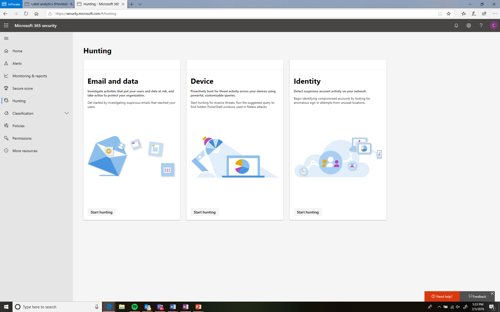

# Cercare malware e altre minacce in Microsoft 365Hunt for malware and other threats in Microsoft 365

Hunting fornisce ai team di sicurezza una visualizzazione delle possibili minacce nell'organizzazione tramite posta elettronica e dati, dispositivi e identità.Hunting provides security teams a view into possible threats in your organization across email and data, devices, and identities. All'interno di Windows Defender ATP, Office 365 ATP e portali di Azure ATP è possibile cercare gli account compromessi, file meno malware, messaggi di posta elettronica sospetti e altro ancora.Within Windows Defender ATP, Office 365 ATP, and Azure ATP portals you can look for compromised accounts, file less malware, suspicious emails, and more.

Ulteriori informazioni:Learn more:

* [Dispositivi](https://docs.microsoft.com/en-us/windows/security/threat-protection/windows-defender-atp/advanced-hunting-windows-defender-advanced-threat-protection) in Windows Defender Advanced Threat Protection[Devices](https://docs.microsoft.com/en-us/windows/security/threat-protection/windows-defender-atp/advanced-hunting-windows-defender-advanced-threat-protection) in Windows Defender Advanced Threat Protection
* [Messaggi di posta elettronica e dati](https://docs.microsoft.com/en-us/office365/securitycompliance/office-365-atp) in Office 365 Advanced Threat Protection[Email and data](https://docs.microsoft.com/en-us/office365/securitycompliance/office-365-atp) in Office 365 Advanced Threat Protection
* [Identità](https://docs.microsoft.com/en-us/azure-advanced-threat-protection/investigate-a-user) in Azure Advanced Threat Protection[Identities](https://docs.microsoft.com/en-us/azure-advanced-threat-protection/investigate-a-user) in Azure Advanced Threat Protection
