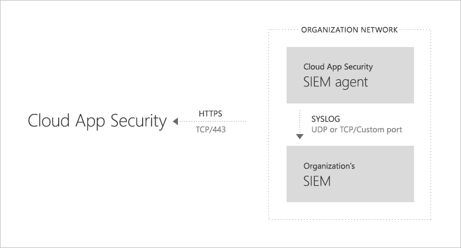

# <a name="integrate-your-siem-server-with-office-365-cloud-app-security"></a><span data-ttu-id="9df0f-104">Integrare il server SIEM con Office 365 Cloud App Security</span><span class="sxs-lookup"><span data-stu-id="9df0f-104">Integrate your SIEM server with Office 365 Cloud App Security</span></span>
  
|<span data-ttu-id="9df0f-105">Valutazione \* *\>*\*</span><span class="sxs-lookup"><span data-stu-id="9df0f-105">\*\*\*\*Evaluation\*\* \>\*\*</span></span>|<span data-ttu-id="9df0f-106">Pianificazione \* *\>*\*</span><span class="sxs-lookup"><span data-stu-id="9df0f-106">\*\*\*\*Planning\*\* \>\*\*</span></span>|<span data-ttu-id="9df0f-107">Distribuzione \* *\>*\*</span><span class="sxs-lookup"><span data-stu-id="9df0f-107">\*\*\*\*Deployment\*\* \>\*\*</span></span>|<span data-ttu-id="9df0f-108">Utilizzo \* \* \*</span><span class="sxs-lookup"><span data-stu-id="9df0f-108">\*\*\*\*Utilization\*\*\*\*</span></span>|
|:-----|:-----|:-----|:-----|
|[<span data-ttu-id="9df0f-109">Avviare la valutazione</span><span class="sxs-lookup"><span data-stu-id="9df0f-109">Start evaluating</span></span>](office-365-cas-overview.md) <br/> |[<span data-ttu-id="9df0f-110">Iniziare a pianificare</span><span class="sxs-lookup"><span data-stu-id="9df0f-110">Start planning</span></span>](get-ready-for-office-365-cas.md) <br/> |<span data-ttu-id="9df0f-111">Si è seguito!</span><span class="sxs-lookup"><span data-stu-id="9df0f-111">You are here!</span></span>  <br/> [<span data-ttu-id="9df0f-112">Passaggio successivo</span><span class="sxs-lookup"><span data-stu-id="9df0f-112">Next step</span></span>](utilization-activities-for-ocas.md) <br/> |[<span data-ttu-id="9df0f-113">Avviare utilizzando</span><span class="sxs-lookup"><span data-stu-id="9df0f-113">Start utilizing</span></span>](utilization-activities-for-ocas.md) <br/> |
   
## <a name="overview-and-prerequisites"></a><span data-ttu-id="9df0f-114">Panoramica e i prerequisiti</span><span class="sxs-lookup"><span data-stu-id="9df0f-114">Overview and prerequisites</span></span>

<span data-ttu-id="9df0f-p102">È possibile integrare [Protezione di Office 365 Cloud App](get-ready-for-office-365-cas.md) con il server di gestione (SIEM) eventi e informazioni sicurezza per abilitare il monitoraggio centralizzato degli avvisi. Ciò è particolarmente utile per le organizzazioni che utilizzano servizi cloud e le applicazioni server locale. Integrazione con un server SIEM consente al team di protezione migliorare la protezione delle applicazioni di Office 365 mantenendo il flusso di lavoro normale protezione automazione alcune procedure di sicurezza e la correlazione tra basata su cloud e locali degli eventi.</span><span class="sxs-lookup"><span data-stu-id="9df0f-p102">You can integrate [Office 365 Cloud App Security](get-ready-for-office-365-cas.md) with your security information and event management (SIEM) server to enable centralized monitoring of alerts. This is especially beneficial for organizations who are using cloud services and on-premises server applications. Integrating with a SIEM server allows your security team to better protect your Office 365 applications while maintaining your usual security workflow, by automating certain security procedures and correlating between cloud-based and on-premises events.</span></span>  
  
<span data-ttu-id="9df0f-p103">Quando si integra innanzitutto il server SIEM con Office 365 Cloud App protezione, gli avvisi dagli ultimi due giorni vengono inoltrati al server SIEM e tutti gli avvisi da quindi su (basato su alcun filtro selezionato). Inoltre, se si disattiva questa caratteristica per un periodo prolungato, quando si riattivarlo, inoltrerà ultimi due giorni di avvisi e quindi tutti gli avvisi in poi.</span><span class="sxs-lookup"><span data-stu-id="9df0f-p103">When you first integrate your SIEM server with Office 365 Cloud App Security, alerts from the last two days are forwarded to the SIEM server, as well as all alerts from then on (based on any filters you select). Additionally, if you disable this feature for an extended period, when you enable it again, it will forward the past two days of alerts and then all alerts from then on.</span></span>

### <a name="siem-integration-architecture"></a><span data-ttu-id="9df0f-120">Architettura dell'integrazione SIEM</span><span class="sxs-lookup"><span data-stu-id="9df0f-120">SIEM integration architecture</span></span>

<span data-ttu-id="9df0f-p104">Un agente SIEM è impostato nella rete dell'organizzazione. Se distribuito e configurato, l'agente SIEM tutti i tipi di dati che sono stati configurati (avvisi) utilizzando l'API REST di Office 365 Cloud App sicurezza. Il traffico viene quindi inviato attraverso un canale HTTPS crittografato sulla porta 443.</span><span class="sxs-lookup"><span data-stu-id="9df0f-p104">A SIEM agent is set up in your organization's network. When deployed and configured, the SIEM agent pulls the data types that were configured (alerts) using Office 365 Cloud App Security RESTful APIs. The traffic is then sent over an encrypted HTTPS channel on port 443.</span></span>
  
<span data-ttu-id="9df0f-124">Quando un agente SIEM recupera i dati di sicurezza di Office 365 Cloud App, invia i messaggi del Registro di sistema per server SIEM locale utilizzando le configurazioni di rete che sono disponibili durante l'installazione (TCP o UDP con una porta personalizzata).</span><span class="sxs-lookup"><span data-stu-id="9df0f-124">When a SIEM agent retrieves data from Office 365 Cloud App Security, it sends the Syslog messages to your local SIEM server using the network configurations that are provided during setup (TCP or UDP with a custom port).</span></span>



### <a name="supported-siem-servers"></a><span data-ttu-id="9df0f-126">Server SIEM supportati</span><span class="sxs-lookup"><span data-stu-id="9df0f-126">Supported SIEM servers</span></span>

<span data-ttu-id="9df0f-127">Protezione di Office 365 Cloud App supporta attualmente server SIEM seguenti:</span><span class="sxs-lookup"><span data-stu-id="9df0f-127">Office 365 Cloud App Security currently supports the following SIEM servers:</span></span>
- <span data-ttu-id="9df0f-128">Lo stato attivo Micro ArcSight</span><span class="sxs-lookup"><span data-stu-id="9df0f-128">Micro Focus ArcSight</span></span>
- <span data-ttu-id="9df0f-129">Formato CEF generico</span><span class="sxs-lookup"><span data-stu-id="9df0f-129">Generic CEF</span></span>

### <a name="prerequisites"></a><span data-ttu-id="9df0f-130">Prerequisiti</span><span class="sxs-lookup"><span data-stu-id="9df0f-130">Prerequisites</span></span>

- <span data-ttu-id="9df0f-p105">È necessario essere un amministratore globale o sicurezza per eseguire le attività descritte in questo articolo. Vedere [le autorizzazioni di sicurezza di Office 365 &amp; centro conformità](permissions-in-the-security-and-compliance-center.md)</span><span class="sxs-lookup"><span data-stu-id="9df0f-p105">You must be a global administrator or security administrator to perform the tasks described in this article. See [Permissions in the Office 365 Security &amp; Compliance Center](permissions-in-the-security-and-compliance-center.md)</span></span>

- <span data-ttu-id="9df0f-133">È necessario che [Office 365 Cloud App protetto](turn-on-office-365-cas.md) per l'organizzazione.</span><span class="sxs-lookup"><span data-stu-id="9df0f-133">You must have [Office 365 Cloud App Security enabled](turn-on-office-365-cas.md) for your organization.</span></span>

- <span data-ttu-id="9df0f-134">[Registrazione di controllo](turn-audit-log-search-on-or-off.md) deve essere attivata per Office 365</span><span class="sxs-lookup"><span data-stu-id="9df0f-134">[Audit logging](turn-audit-log-search-on-or-off.md) must be turned on for Office 365</span></span>

- <span data-ttu-id="9df0f-135">Deve disporre di un server standard che soddisfi i requisiti seguenti per configurare l'integrazione del server SIEM:</span><span class="sxs-lookup"><span data-stu-id="9df0f-135">You must have a standard server that meets the following requirements in order to configure SIEM server integration:</span></span>
    - <span data-ttu-id="9df0f-136">Sistema operativo: Windows o Linux (può essere una macchina virtuale)</span><span class="sxs-lookup"><span data-stu-id="9df0f-136">OS: Windows or Linux (this can be a virtual machine)</span></span>
    - <span data-ttu-id="9df0f-137">CPU: 2</span><span class="sxs-lookup"><span data-stu-id="9df0f-137">CPU: 2</span></span>
    - <span data-ttu-id="9df0f-138">Spazio su disco: 20 GB</span><span class="sxs-lookup"><span data-stu-id="9df0f-138">Disk space: 20 GB</span></span>
    - <span data-ttu-id="9df0f-139">RAM: 2 GB</span><span class="sxs-lookup"><span data-stu-id="9df0f-139">RAM: 2 GB</span></span>
    - <span data-ttu-id="9df0f-140">[Oracle Java 8](http://www.oracle.com/technetwork/java/javase/downloads/index.html) installato</span><span class="sxs-lookup"><span data-stu-id="9df0f-140">[Oracle Java 8](http://www.oracle.com/technetwork/java/javase/downloads/index.html) installed</span></span>
    - <span data-ttu-id="9df0f-141">Firewall configurati come descritto in [requisiti di rete](https://docs.microsoft.com/cloud-app-security/network-requirements)</span><span class="sxs-lookup"><span data-stu-id="9df0f-141">Firewall configured as described in [Network requirements](https://docs.microsoft.com/cloud-app-security/network-requirements)</span></span>

- <span data-ttu-id="9df0f-p106">È necessario disporre di dettagli del **Registro di sistema remoto host** e **numero di porta Syslot**. Un amministratore di rete o un amministratore di sicurezza deve essere in grado di individuare tali informazioni.</span><span class="sxs-lookup"><span data-stu-id="9df0f-p106">You must have details about your **Remote syslog host** and **Syslot port number**. A network administrator or security administrator should be able to help you locate that information.</span></span> 

- <span data-ttu-id="9df0f-144">È necessario accettare le [condizioni di licenza software](https://go.microsoft.com/fwlink/?linkid=862491) scaricare il [file JAR](https://go.microsoft.com/fwlink/?linkid=838596) è necessario effettuare l'integrazione del server SIEM.</span><span class="sxs-lookup"><span data-stu-id="9df0f-144">You must agree to [software license terms](https://go.microsoft.com/fwlink/?linkid=862491) to download the [JAR file](https://go.microsoft.com/fwlink/?linkid=838596) you'll need to integrate your SIEM server.</span></span>
 
## <a name="step-1-set-it-up-a-siem-agent-in-office-365-cloud-app-security"></a><span data-ttu-id="9df0f-145">Passaggio 1: Configurarlo in un agente SIEM nella sicurezza App Cloud di Office 365</span><span class="sxs-lookup"><span data-stu-id="9df0f-145">Step 1: Set it up a SIEM agent in Office 365 Cloud App Security</span></span>

1. <span data-ttu-id="9df0f-146">Accedere al portale di protezione di applicazione Cloud ([https://portal.cloudappsecurity.com](https://portal.cloudappsecurity.com)) ed eseguire l'accesso.</span><span class="sxs-lookup"><span data-stu-id="9df0f-146">Go to the Cloud App Security portal ([https://portal.cloudappsecurity.com](https://portal.cloudappsecurity.com)) and sign in.</span></span>
  
2. <span data-ttu-id="9df0f-147">Fare clic su **Impostazioni** \> **estensioni di protezione**e quindi fare clic su agenti SIEM.</span><span class="sxs-lookup"><span data-stu-id="9df0f-147">Click **Settings** \> **Security extensions**, and then choose SIEM agents.</span></span><br/>
<span data-ttu-id="9df0f-148"></span><span class="sxs-lookup"><span data-stu-id="9df0f-148"></span></span>

3. <span data-ttu-id="9df0f-149">Scegliere **Aggiungi SIEM agente**.</span><span class="sxs-lookup"><span data-stu-id="9df0f-149">Choose **Add SIEM agent**.</span></span><br/><span data-ttu-id="9df0f-150"></span><span class="sxs-lookup"><span data-stu-id="9df0f-150"></span></span>
    
4. <span data-ttu-id="9df0f-151">Scegliere **Avvia procedura guidata**.</span><span class="sxs-lookup"><span data-stu-id="9df0f-151">Choose **Start wizard**.</span></span><br/><span data-ttu-id="9df0f-152"></span><span class="sxs-lookup"><span data-stu-id="9df0f-152"></span></span> 
    
5. <span data-ttu-id="9df0f-p107">Nel passaggio **Generale** , specificare un nome e **Selezionare il formato SIEM** e impostare le **Impostazioni avanzate** di interesse per tale formato. Quindi scegliere **Avanti**.</span><span class="sxs-lookup"><span data-stu-id="9df0f-p107">In the **General** step, specify a name, and **Select your SIEM format** and set any **Advanced settings** that are relevant to that format. Then choose **Next**.</span></span><br/><span data-ttu-id="9df0f-155"></span><span class="sxs-lookup"><span data-stu-id="9df0f-155"></span></span>
    
6. <span data-ttu-id="9df0f-p108">Al passaggio del **Registro di sistema remoto** , specificare l'indirizzo IP o nome host dell' **host del Registro di sistema remoto** e il **numero di porta del Registro di sistema**. Selezionare TCP o UDP come protocollo di registro di sistema remoto. (È possibile utilizzare con l'amministratore di rete o un amministratore della sicurezza per ottenere queste informazioni dettagliate, se non disponi.) Quindi scegliere **Avanti**.</span><span class="sxs-lookup"><span data-stu-id="9df0f-p108">In the **Remote Syslog** step, specify the IP address or hostname of the **Remote syslog host** and the **Syslog port number**. Select TCP or UDP as the Remote Syslog protocol. (You can work with your network administrator or security administrator to get these details if you don't have them.) Then choose **Next**.</span></span><br/><span data-ttu-id="9df0f-159"></span><span class="sxs-lookup"><span data-stu-id="9df0f-159"></span></span>
  
7. <span data-ttu-id="9df0f-160">Nel passaggio **Tipi di dati** , effettuare una delle opzioni seguenti e quindi fare clic su **Avanti**:</span><span class="sxs-lookup"><span data-stu-id="9df0f-160">In the **Data Types** step, do one of the following, and then click **Next**:</span></span>
    - <span data-ttu-id="9df0f-161">Mantenere l'impostazione predefinita di **Tutti gli avvisi**</span><span class="sxs-lookup"><span data-stu-id="9df0f-161">Keep the default setting of **All Alerts**</span></span><br/><span data-ttu-id="9df0f-162">OPPURE</span><span class="sxs-lookup"><span data-stu-id="9df0f-162">OR</span></span>
    - <span data-ttu-id="9df0f-p109">Fare clic su **tutti gli avvisi**e quindi fare clic su **filtri specifici**. Definire i filtri per selezionare i tipi di avvisi che si desidera inviare al server SIEM.</span><span class="sxs-lookup"><span data-stu-id="9df0f-p109">Click **All alerts**, and then choose **Specific filters**. Define filters to select the kinds of alerts you want to send to your SIEM server. </span></span><br/><span data-ttu-id="9df0f-165"></span><span class="sxs-lookup"><span data-stu-id="9df0f-165"></span></span>
  
8. <span data-ttu-id="9df0f-166">Nella schermata Congratulazioni, copiare il token e salvarlo per utilizzi successivi.</span><span class="sxs-lookup"><span data-stu-id="9df0f-166">On the Congratulations screen, copy the token and save it for later.</span></span><br/> 

> [!IMPORTANT]
> <span data-ttu-id="9df0f-p110">A questo punto è stato impostato un agente SIEM nella sicurezza App Cloud di Office 365, ma l'integrazione del server SIEM non è ancora completato. Procedere al passaggio successivo per continuare l'integrazione del server SIEM.</span><span class="sxs-lookup"><span data-stu-id="9df0f-p110">At this point, you have set up a SIEM agent in Office 365 Cloud App Security, but your SIEM server integration is not yet finished. Proceed to the next step to continue your SIEM server integration.</span></span>

<span data-ttu-id="9df0f-p111">Dopo aver fare clic su Chiudi e uscire dalla procedura guidata, nella schermata di estensioni di protezione, è possibile visualizzare l'agente SIEM che è stato aggiunto nella tabella. Viene visualizzato lo stato **creato** fino a quando non si connette più avanti.</span><span class="sxs-lookup"><span data-stu-id="9df0f-p111">After you click Close and leave the wizard, on the Security extensions screen, you can see the SIEM agent you added in the table. It will show a status of **Created** until it's connected later.</span></span>


    
## <a name="step-2-download-a-jar-file-and-run-it-on-your-siem-server"></a><span data-ttu-id="9df0f-173">Passaggio 2: Scaricare un file con estensione JAR ed eseguirlo nel server SIEM</span><span class="sxs-lookup"><span data-stu-id="9df0f-173">Step 2: Download a JAR file and run it on your SIEM server</span></span>

1. <span data-ttu-id="9df0f-p112">Scaricare [Microsoft Cloud App sicurezza SIEM Agent](https://go.microsoft.com/fwlink/?linkid=838596) e decomprimere la cartella. (È necessario accettare le [condizioni di licenza software](https://go.microsoft.com/fwlink/?linkid=862491) per continuare.)</span><span class="sxs-lookup"><span data-stu-id="9df0f-p112">Download the [Microsoft Cloud App Security SIEM Agent](https://go.microsoft.com/fwlink/?linkid=838596) and unzip the folder. (You must agree to [software license terms](https://go.microsoft.com/fwlink/?linkid=862491) in order to proceed.)</span></span> 
    
2. <span data-ttu-id="9df0f-176">Estrarre il file JAR dalla cartella compressa ed eseguirlo nel server SIEM.</span><span class="sxs-lookup"><span data-stu-id="9df0f-176">Extract the .jar file from the zipped folder and run it on your SIEM server.</span></span>
    
3. <span data-ttu-id="9df0f-177">Dopo aver eseguito il file, eseguire le operazioni seguenti: comando:</span><span class="sxs-lookup"><span data-stu-id="9df0f-177">After running the file, run the following: command:</span></span><br/>
  ```
  java -jar mcas-siemagent-0.87.20-signed.jar [--logsDirectory DIRNAME] [--proxy ADDRESS[:PORT]] --token TOKEN
  ```
### <a name="important-notes"></a><span data-ttu-id="9df0f-178">Note importanti</span><span class="sxs-lookup"><span data-stu-id="9df0f-178">Important notes</span></span>

- <span data-ttu-id="9df0f-179">Il nome del file può variare a seconda della versione dell'agente SIEM.</span><span class="sxs-lookup"><span data-stu-id="9df0f-179">The file name may differ depending on the version of the SIEM agent.</span></span> 

- <span data-ttu-id="9df0f-180">È consigliabile eseguire il file JAR nel server SIEM durante l'installazione di server.</span><span class="sxs-lookup"><span data-stu-id="9df0f-180">We recommend that you run the JAR file on your SIEM server during server setup.</span></span>

    - <span data-ttu-id="9df0f-181">**Windows**: eseguito come attività pianificata, assicurandosi di configurare l'attività da **eseguire se l'utente è connesso o meno** e deselezionare l'opzione **interrompere l'operazione se non si verifica più di** .</span><span class="sxs-lookup"><span data-stu-id="9df0f-181">**Windows**: Run as a scheduled task, making sure to configure the task to **Run whether the user is logged on or not** and clear the **Stop the task if it runs longer than** option.</span></span>

    - <span data-ttu-id="9df0f-182">**Linux**: aggiungere il comando Esegui con un **&** per il `rc.local` file.</span><span class="sxs-lookup"><span data-stu-id="9df0f-182">**Linux**: Add the run command with an **&** to the `rc.local` file.</span></span> <br/><span data-ttu-id="9df0f-183">Esempio:</span><span class="sxs-lookup"><span data-stu-id="9df0f-183">Example:</span></span><br/> 
    ```
    java -jar mcas-siemagent-0.87.20-signed.jar [--logsDirectory DIRNAME] [--proxy ADDRESS[:PORT]] --token TOKEN &
    ```

- <span data-ttu-id="9df0f-p113">Parametri [] tra parentesi quadre sono facoltativi e devono essere utilizzati solo se pertinenti. Utilizzare le variabili seguenti:</span><span class="sxs-lookup"><span data-stu-id="9df0f-p113">Parameters in brackets [] are optional, and should be used only if relevant. Use the following variables:</span></span>

    - <span data-ttu-id="9df0f-186">**DIRNAME** è il percorso della directory da utilizzare per i registri di debug agente locale.</span><span class="sxs-lookup"><span data-stu-id="9df0f-186">**DIRNAME** is the path to the directory you want to use for local agent debug logs.</span></span>

    - <span data-ttu-id="9df0f-187">**Indirizzo [: porta]** è l'indirizzo del server proxy e la porta utilizzati dal server per la connessione a Internet.</span><span class="sxs-lookup"><span data-stu-id="9df0f-187">**ADDRESS[:PORT]** is the proxy server address and port that the server uses to connect to the Internet.</span></span>

    - <span data-ttu-id="9df0f-188">**TOKEN** è il token agente SIEM che sono stati copiati in routine prima.</span><span class="sxs-lookup"><span data-stu-id="9df0f-188">**TOKEN** is the SIEM agent token you copied in the first procedure.</span></span>

    - <span data-ttu-id="9df0f-189">Per visualizzare la Guida, digitare `-h`.</span><span class="sxs-lookup"><span data-stu-id="9df0f-189">To get help, type `-h`.</span></span> 
  
## <a name="step-3-validate-that-the-siem-agent-is-working"></a><span data-ttu-id="9df0f-190">Passaggio 3: Verificare che l'agente SIEM funzioni correttamente</span><span class="sxs-lookup"><span data-stu-id="9df0f-190">Step 3: Validate that the SIEM agent is working</span></span>

1. <span data-ttu-id="9df0f-191">Verificare che lo stato dell'agente SIEM nel portale di Office 365 Cloud App protezione non viene visualizzato come **errore di connessione** o **disconnesso** e che non sono presenti notifiche agente.</span><span class="sxs-lookup"><span data-stu-id="9df0f-191">Make sure the status of the SIEM agent in the Office 365 Cloud App Security portal is not displayed as **Connection error** or **Disconnected** and that there are no agent notifications.</span></span><br/><span data-ttu-id="9df0f-192">Ad esempio, qui è possibile visualizzare che è connesso il server SIEM:</span><span class="sxs-lookup"><span data-stu-id="9df0f-192">For example, here we can see the SIEM server is connected:</span></span><br/><span data-ttu-id="9df0f-193"></span><span class="sxs-lookup"><span data-stu-id="9df0f-193"></span></span><br/><span data-ttu-id="9df0f-194">E visualizzare in questo caso, che il server SIEM viene disconnesso:</span><span class="sxs-lookup"><span data-stu-id="9df0f-194">And here, we can see the SIEM server is disconnected:</span></span><br/><span data-ttu-id="9df0f-195"></span><span class="sxs-lookup"><span data-stu-id="9df0f-195"></span></span> 
  
2. <span data-ttu-id="9df0f-196">Nel server di registro di sistema/SIEM, verificare che sia incluso che avvisi ricevuti da sicurezza App Cloud di Office 365.</span><span class="sxs-lookup"><span data-stu-id="9df0f-196">In your Syslog/SIEM server, make sure you see that alerts have arrived from Office 365 Cloud App Security.</span></span>
  
## <a name="what-the-logfiles-look-like"></a><span data-ttu-id="9df0f-197">Che aspetto i file di registro</span><span class="sxs-lookup"><span data-stu-id="9df0f-197">What the logfiles look like</span></span>

<span data-ttu-id="9df0f-198">Ecco un esempio di file di registro degli avvisi che può essere inviato a un server SIEM:</span><span class="sxs-lookup"><span data-stu-id="9df0f-198">Here's an alerts logfile example that might be sent to a SIEM server:</span></span>

```
2017-07-15T20:42:30.531Z CEF:0|MCAS|SIEM_Agent|0.102.17|ALERT_CABINET_EVENT_MATCH_AUDIT|myPolicy|3|externalId=596a7e360c204203a335a3fb start=1500151350531 end=1500151350531 msg=Activity policy ''myPolicy'' was triggered by ''admin@box-contoso.com'' suser=admin@box-contoso.com destinationServiceName=Box cn1Label=riskScore cn1= cs1Label=portalURL cs1=https://cloud-app-security.com/#/alerts/596a7e360c204203a335a3fb cs2Label=uniqueServiceAppIds cs2=APPID_BOX cs3Label=relatedAudits cs3=1500151288183_acc891bf-33e1-424b-a021-0d4370789660 cs4Label=policyIDs cs4=59f0ab82f797fa0681e9b1c7

2017-07-16T09:36:26.550Z CEF:0|MCAS|SIEM_Agent|0.102.17|ALERT_CABINET_EVENT_MATCH_AUDIT|test-activity-policy|3|externalId=596b339b0c204203a33a51ae start=1500197786550 end=1500197786550 msg=Activity policy ''test-activity-policy'' was triggered by ''user@contoso.com'' suser=user@contoso.com destinationServiceName=Salesforce cn1Label=riskScore cn1= cs1Label=portalURL cs1=https://cloud-app-security.com/#/alerts/596b339b0c204203a33a51ae cs2Label=uniqueServiceAppIds cs2=APPID_SALESFORCE cs3Label=relatedAudits cs3=1500197720691_b7f6317c-b8de-476a-bc8f-dfa570e00349 cs4Label=policyIDs cs4=

2017-07-16T09:17:03.361Z CEF:0|MCAS|SIEM_Agent|0.102.17|ALERT_CABINET_EVENT_MATCH_AUDIT|test-activity-policy3|3|externalId=596b2fd70c204203a33a3eeb start=1500196623361 end=1500196623361 msg=Activity policy ''test-activity-policy3'' was triggered by ''admin@contoso.com'' suser=admin@contoso.com destinationServiceName=Office 365 cn1Label=riskScore cn1= cs1Label=portalURL cs1=https://cloud-app-security.com/#/alerts/596b2fd70c204203a33a3eeb cs2Label=uniqueServiceAppIds cs2=APPID_O365 cs3Label=relatedAudits cs3=1500196549157_a0e01f8a-e29a-43ae-8599-783c1c11597d cs4Label=policyIDs cs4=

2017-07-16T09:17:15.426Z CEF:0|MCAS|SIEM_Agent|0.102.17|ALERT_CABINET_EVENT_MATCH_AUDIT|test-activity-policy|3|externalId=596b2fd70c204203a33a3eec start=1500196635426 end=1500196635426 msg=Activity policy ''test-activity-policy'' was triggered by ''admin@contoso.com'' suser=admin@contoso.com destinationServiceName=Microsoft Office 365 admin center cn1Label=riskScore cn1= cs1Label=portalURL cs1=https://cloud-app-security.com/#/alerts/596b2fd70c204203a33a3eec cs2Label=uniqueServiceAppIds cs2=APPID_O365_PORTAL cs3Label=relatedAudits cs3=1500196557398_3e102b20-d9fa-4f66-b550-8c7a403bb4d8 cs4Label=policyIDs cs4=59f0ab35f797fa9811e9b1c7

2017-07-16T09:17:46.290Z CEF:0|MCAS|SIEM_Agent|0.102.17|ALERT_CABINET_EVENT_MATCH_AUDIT|test-activity-policy4|3|externalId=596b30200c204203a33a4765 start=1500196666290 end=1500196666290 msg=Activity policy ''test-activity-policy4'' was triggered by ''admin@contoso.com'' suser=admin@contoso.com destinationServiceName=Microsoft Exchange Online cn1Label=riskScore cn1= cs1Label=portalURL cs1=https://cloud-app-security.com/#/alerts/596b30200c204203a33a4765 cs2Label=uniqueServiceAppIds cs2=APPID_OUTLOOK cs3Label=relatedAudits cs3=1500196587034_a8673602-7e95-46d6-a1fe-c156c4709c5d cs4Label=policyIDs cs4=

2017-07-16T09:41:04.369Z CEF:0|MCAS|SIEM_Agent|0.102.17|ALERT_CABINET_EVENT_MATCH_AUDIT|test-activity-policy2|3|externalId=596b34b10c204203a33a5240 start=1500198064369 end=1500198064369 msg=Activity policy ''test-activity-policy2'' was triggered by ''user2@test15-adallom.com'' suser=user2@test15-adallom.com destinationServiceName=Google cn1Label=riskScore cn1= cs1Label=portalURL cs1=https://cloud-app-security.com/#/alerts/596b34b10c204203a33a5240 cs2Label=uniqueServiceAppIds cs2=APPID_33626 cs3Label=relatedAudits cs3=1500197996117_fd71f265-1e46-4f04-b372-2e32ec874cd3 cs4Label=policyIDs cs4=
```

<span data-ttu-id="9df0f-199">Inoltre, ecco un altro esempio, questa volta nel formato il formato CEF:</span><span class="sxs-lookup"><span data-stu-id="9df0f-199">And here's another sample, this time in CEF format:</span></span>


|<span data-ttu-id="9df0f-200">Nome del campo il formato CEF</span><span class="sxs-lookup"><span data-stu-id="9df0f-200">CEF field name</span></span>  | <span data-ttu-id="9df0f-201">Descrizione</span><span class="sxs-lookup"><span data-stu-id="9df0f-201">Description</span></span>  |
|---------|---------|
|<span data-ttu-id="9df0f-202">avviare</span><span class="sxs-lookup"><span data-stu-id="9df0f-202">start</span></span>     | <span data-ttu-id="9df0f-203">Data/ora degli avvisi</span><span class="sxs-lookup"><span data-stu-id="9df0f-203">alert timestamp</span></span>        |
|<span data-ttu-id="9df0f-204">fine</span><span class="sxs-lookup"><span data-stu-id="9df0f-204">end</span></span>     | <span data-ttu-id="9df0f-205">Data/ora degli avvisi</span><span class="sxs-lookup"><span data-stu-id="9df0f-205">alert timestamp</span></span>        |
|<span data-ttu-id="9df0f-206">round trip</span><span class="sxs-lookup"><span data-stu-id="9df0f-206">rt</span></span>     | <span data-ttu-id="9df0f-207">Data/ora degli avvisi</span><span class="sxs-lookup"><span data-stu-id="9df0f-207">alert timestamp</span></span>        |
|<span data-ttu-id="9df0f-208">msg</span><span class="sxs-lookup"><span data-stu-id="9df0f-208">msg</span></span>     | <span data-ttu-id="9df0f-209">descrizione di avviso, come illustrato nel portale di Office 365 Cloud App Security</span><span class="sxs-lookup"><span data-stu-id="9df0f-209">alert description as shown in the Office 365 Cloud App Security portal</span></span>        |
|<span data-ttu-id="9df0f-210">suser</span><span class="sxs-lookup"><span data-stu-id="9df0f-210">suser</span></span>     | <span data-ttu-id="9df0f-211">utente soggetto degli avvisi</span><span class="sxs-lookup"><span data-stu-id="9df0f-211">alert subject user</span></span>        |
|<span data-ttu-id="9df0f-212">destinationServiceName</span><span class="sxs-lookup"><span data-stu-id="9df0f-212">destinationServiceName</span></span>     | <span data-ttu-id="9df0f-213">avviso originari app, ad esempio Office 365, SharePoint o OneDrive</span><span class="sxs-lookup"><span data-stu-id="9df0f-213">alert originating app, such as Office 365, SharePoint, or OneDrive</span></span>        |
|<span data-ttu-id="9df0f-214">csLabel</span><span class="sxs-lookup"><span data-stu-id="9df0f-214">csLabel</span></span>     | <span data-ttu-id="9df0f-p114">Varia (etichette avere significati diversi). In genere, le etichette sono di chiara interpretazione, ad esempio targetObjects.</span><span class="sxs-lookup"><span data-stu-id="9df0f-p114">Varies (labels have different meanings). Typically, labels are self-explanatory, like targetObjects.</span></span>        |
|<span data-ttu-id="9df0f-217">cs</span><span class="sxs-lookup"><span data-stu-id="9df0f-217">cs</span></span>     | <span data-ttu-id="9df0f-218">Informazioni corrispondente a un'etichetta (ad esempio, l'utente di destinazione di un avviso come riportato nell'esempio di etichetta)</span><span class="sxs-lookup"><span data-stu-id="9df0f-218">Information corresponding to a label (such as the target user of an alert as per the label example)</span></span>        |

## <a name="additional-tasks-as-needed"></a><span data-ttu-id="9df0f-219">Attività aggiuntive (se necessario)</span><span class="sxs-lookup"><span data-stu-id="9df0f-219">Additional tasks (as needed)</span></span>

<span data-ttu-id="9df0f-p115">Dopo aver configurato il server SIEM e hanno integrato con protezione App Cloud di Office 365, potrebbe essere necessario rigenerare un token, modificare un agente SIEM o eliminare un agente SIEM. Nelle sezioni seguenti viene descritto come eseguire queste attività.</span><span class="sxs-lookup"><span data-stu-id="9df0f-p115">After you have configured your SIEM server and have integrated it with Office 365 Cloud App Security, you might need to regenerate a token, edit a SIEM agent, or delete a SIEM agent. The following sections describe how to perform these tasks.</span></span>

### <a name="regenerate-a-token"></a><span data-ttu-id="9df0f-222">Rigenerare un token</span><span class="sxs-lookup"><span data-stu-id="9df0f-222">Regenerate a token</span></span>

<span data-ttu-id="9df0f-223">Se si perde il token, sarà possibile rigenerare una.</span><span class="sxs-lookup"><span data-stu-id="9df0f-223">If you lose your token, you can regenerate one.</span></span> 

1. <span data-ttu-id="9df0f-224">Nel portale di Office 365 Cloud App Security ([https://portal.cloudappsecurity.com](https://portal.cloudappsecurity.com)), fare clic su **Impostazioni** > **estensioni di protezione**.</span><span class="sxs-lookup"><span data-stu-id="9df0f-224">In the Office 365 Cloud App Security portal ([https://portal.cloudappsecurity.com](https://portal.cloudappsecurity.com)), choose **Settings** > **Security extensions**.</span></span>

2. <span data-ttu-id="9df0f-225">Nella tabella, individuare la riga per l'agente SIEM.</span><span class="sxs-lookup"><span data-stu-id="9df0f-225">In the table, locate the row for the SIEM agent.</span></span> 

3. <span data-ttu-id="9df0f-226">Fare clic sui puntini di sospensione e quindi fare clic su **rigenerare token**.</span><span class="sxs-lookup"><span data-stu-id="9df0f-226">Click the ellipses, and then choose **Regenerate token**.</span></span><br/><span data-ttu-id="9df0f-227"></span><span class="sxs-lookup"><span data-stu-id="9df0f-227"></span></span>
  
### <a name="edit-a-siem-agent"></a><span data-ttu-id="9df0f-228">Modificare un agente SIEM</span><span class="sxs-lookup"><span data-stu-id="9df0f-228">Edit a SIEM agent</span></span>

1. <span data-ttu-id="9df0f-229">Nel portale di Office 365 Cloud App Security ([https://portal.cloudappsecurity.com](https://portal.cloudappsecurity.com)), fare clic su **Impostazioni** > **estensioni di protezione**.</span><span class="sxs-lookup"><span data-stu-id="9df0f-229">In the Office 365 Cloud App Security portal ([https://portal.cloudappsecurity.com](https://portal.cloudappsecurity.com)), choose **Settings** > **Security extensions**.</span></span>

2. <span data-ttu-id="9df0f-230">Individuare la riga per l'agente SIEM.</span><span class="sxs-lookup"><span data-stu-id="9df0f-230">Locate the row for the SIEM agent.</span></span> 

3. <span data-ttu-id="9df0f-p116">Fare clic sui puntini di sospensione e quindi fare clic su **Modifica**. (Se si modifica l'agente SIEM, non necessaria eseguire di nuovo il file JAR, aggiorna automaticamente).</span><span class="sxs-lookup"><span data-stu-id="9df0f-p116">Click the ellipses, and then choose **Edit**. (If you edit the SIEM agent, you do not need to re-run the .jar file; it updates automatically.) </span></span><br/><span data-ttu-id="9df0f-233"></span><span class="sxs-lookup"><span data-stu-id="9df0f-233"></span></span>
  
### <a name="delete-a-siem-agent"></a><span data-ttu-id="9df0f-234">Eliminare un agente SIEM</span><span class="sxs-lookup"><span data-stu-id="9df0f-234">Delete a SIEM agent</span></span>

1. <span data-ttu-id="9df0f-235">Nel portale di Office 365 Cloud App Security ([https://portal.cloudappsecurity.com](https://portal.cloudappsecurity.com)), fare clic su **Impostazioni** > **estensioni di protezione**.</span><span class="sxs-lookup"><span data-stu-id="9df0f-235">In the Office 365 Cloud App Security portal ([https://portal.cloudappsecurity.com](https://portal.cloudappsecurity.com)), choose **Settings** > **Security extensions**.</span></span>

2. <span data-ttu-id="9df0f-236">Individuare la riga per l'agente SIEM.</span><span class="sxs-lookup"><span data-stu-id="9df0f-236">Locate the row for the SIEM agent.</span></span> 

3. <span data-ttu-id="9df0f-237">Fare clic sui puntini di sospensione e quindi fare clic su **Elimina**.</span><span class="sxs-lookup"><span data-stu-id="9df0f-237">Click the ellipses, and then choose **Delete**.</span></span><br/><span data-ttu-id="9df0f-238"></span><span class="sxs-lookup"><span data-stu-id="9df0f-238"></span></span>

  
## <a name="next-steps"></a><span data-ttu-id="9df0f-239">Passaggi successivi</span><span class="sxs-lookup"><span data-stu-id="9df0f-239">Next steps</span></span>

- [<span data-ttu-id="9df0f-240">Attività di utilizzo dopo la distribuzione di Office 365 Cloud App Security</span><span class="sxs-lookup"><span data-stu-id="9df0f-240">Utilization activities after rolling out Office 365 Cloud App Security</span></span>](utilization-activities-for-ocas.md)
    
- [<span data-ttu-id="9df0f-241">Leggere ed eseguire l'azione gli avvisi</span><span class="sxs-lookup"><span data-stu-id="9df0f-241">Review and take action on alerts</span></span>](review-office-365-cas-alerts.md)
    
- [<span data-ttu-id="9df0f-242">Gli indirizzi IP per semplificare la gestione di gruppo</span><span class="sxs-lookup"><span data-stu-id="9df0f-242">Group your IP addresses to simplify management</span></span>](group-your-ip-addresses-in-ocas.md)
    

