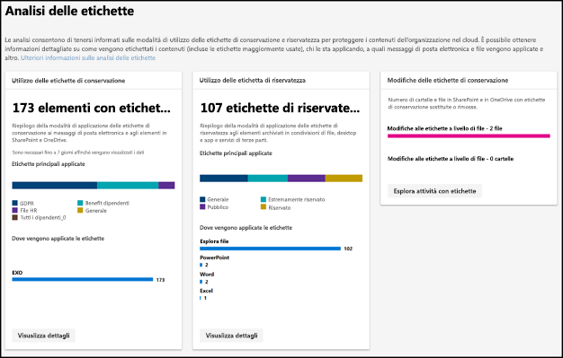
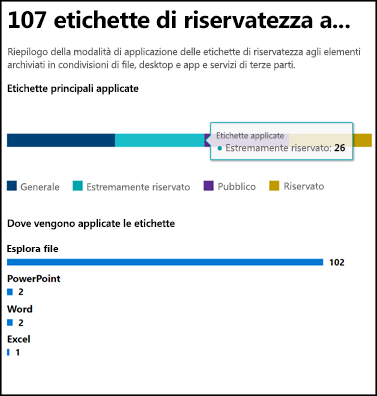
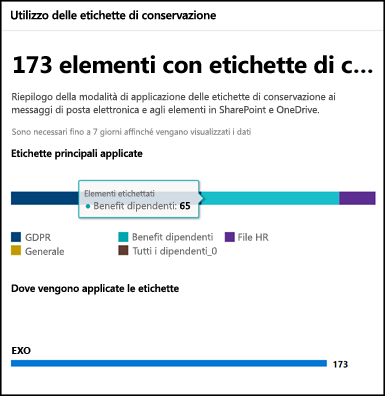
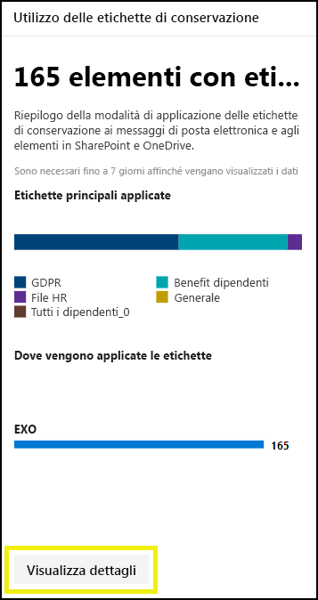
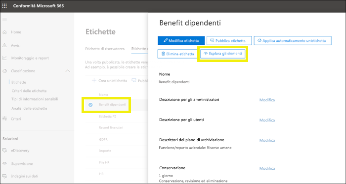
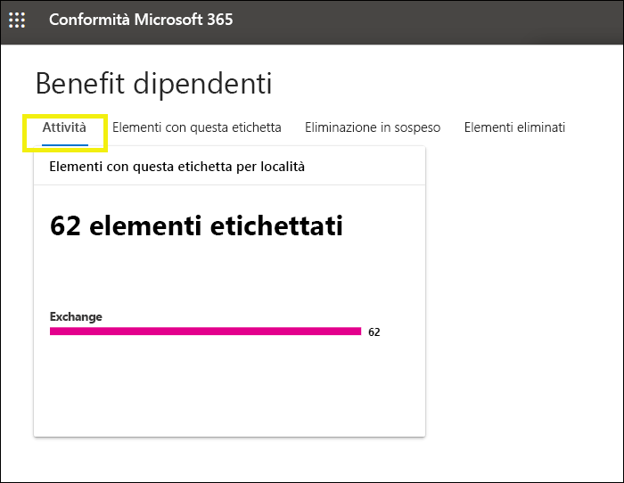
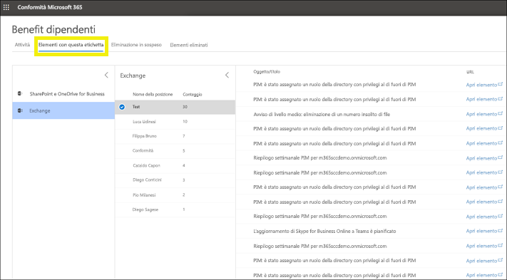

# Visualizzare l'utilizzo delle etichette con Analisi delle etichette

Dopo aver creato le etichette di conservazione e le etichette di riservatezza, è opportuno verificare l'utilizzo nel tenant. Con Analisi delle etichette, disponibile nel Centro conformità Microsoft 365 e nel Centro sicurezza Microsoft 365, è possibile visualizzare rapidamente le etichette usate più di frequente e sapere dove vengono applicate.

Ad esempio, con Analisi delle etichette è possibile visualizzare:

- Il numero totale di etichette di conservazione e di etichette di riservatezza applicate al contenuto.
- Le etichette principali e il numero di volte in cui è stata applicata ogni etichetta.
- Le posizioni in cui vengono applicate le etichette e il conteggio relativo a ogni posizione.
- Il conteggio del numero di file e cartelle di cui è stata modificata o rimossa l'etichetta di conservazione.

La funzionalità Analisi delle etichette è disponibile nel [Centro conformità Microsoft 365](https://compliance.microsoft.com/labelanalytics)o nel [Centro sicurezza Microsoft 365](https://security.microsoft.com/labelanalytics) > **Classificazione** > **Analisi delle etichette**.

## Utilizzo dell'etichetta di riservatezza

I dati relativi all'utilizzo dell'etichetta di riservatezza vengono estratti dai report di Azure Information Protection. Per altre informazioni, vedere [Reporting centralizzato per Azure Information Protection](https://docs.microsoft.com/it-IT/azure/information-protection/reports-aip).

Tenere presente che i [prerequisiti](https://docs.microsoft.com/it-IT/azure/information-protection/reports-aip#prerequisites-for-azure-information-protection-analytics) dei report di Azure Information Protection si applicano anche ad Analisi delle etichette per le etichette di riservatezza nel Centro conformità Microsoft 365 e nel Centro sicurezza Microsoft 365. È ad esempio necessaria una sottoscrizione di Azure che include Log Analytics perché questi report vengono generati in seguito all'invio di eventi di controllo per la protezione delle informazioni da client e scanner di Azure Information Protection a una posizione centralizzata basata sul servizio Azure Log Analytics.

Per l'utilizzo delle etichette di riservatezza:

- Non è prevista latenza nei dati. Si tratta di un report in tempo reale.
- Per visualizzare il conteggio per ogni etichetta principale, selezionare il grafico a barre e leggere la descrizione comando visualizzata.
- Il report mostra la posizione in cui sono applicate le etichette di riservatezza in base all'app (mentre le etichette di conservazione vengono visualizzate in base alla posizione).

## Utilizzo delle etichette di conservazione

Questo report mostra un'anteprima rapida delle etichette principali e della posizione in cui vengono applicate. Per informazioni più dettagliate sulla modalità di applicazione delle etichette al contenuto in SharePoint e OneDrive, vedere [Visualizzare le attività con etichette per i documenti](view-label-activity-for-documents.md).

Per l'utilizzo delle etichette di conservazione:

- I dati vengono aggregati settimanalmente, quindi la visualizzazione dei dati nel report può richiedere fino a sette giorni.
- Per visualizzare il conteggio per ogni etichetta principale, selezionare il grafico a barre e leggere la descrizione comando visualizzata.
- Il report mostra la posizione in cui sono applicate le etichette di conservazione in base alla posizione (mentre le etichette di riservatezza vengono visualizzate in base all'app).
- Per le etichette di conservazione si tratta di un riepilogo di tutti i dati del tenant non filtrati in base a un intervallo di date specifico. Con [Explorer attività etichette](view-label-activity-for-documents.md) sono invece visualizzati solo i dati relativi agli ultimi 30 giorni.

## Visualizzare tutto il contenuto con una specifica etichetta di conservazione

Dal report sull'utilizzo delle etichette di conservazione è possibile esplorare rapidamente tutto il contenuto a cui è applicata una data etichetta. Questa funzionalità è attualmente in corso di modifica per consentire di ridurre il numero di passaggi necessari per visualizzare tutto il contenuto con etichetta.

Scegliere prima di tutto **Visualizza dettagli** nella parte inferiore del report.

Scegliere quindi un'etichetta di conservazione > **Esplora gli elementi** nel riquadro destro.

Per tale etichetta è possibile scegliere la scheda **Attività** per visualizzare il numero di elementi che includono l'etichetta in base alla posizione.

È anche possibile scegliere la scheda **Elementi con questa etichetta** per accedere a posizioni specifiche:

- Per Exchange Online viene visualizzato un elenco di cassette postali con il conteggio degli elementi con etichetta in ogni cassetta postale.
- Per SharePoint Online e OneDrive for Business viene visualizzato un elenco di raccolte siti e account di OneDrive con il conteggio degli elementi con etichetta in ogni posizione.

Quando si sceglie una cassetta postale o una raccolta siti, è possibile visualizzare un elenco degli elementi con tale etichetta di conservazione nella posizione specifica.

## Autorizzazioni

Per visualizzare l'analisi delle etichette, è necessario disporre di uno dei ruoli seguenti in Azure Active Directory:

- Amministratore globale
- Amministratore di conformità
- Amministratore della sicurezza
- Ruolo con autorizzazioni di lettura per la sicurezza

Con questi report viene inoltre usato Monitoraggio di Azure per archiviare i dati in un'area di lavoro Log Analytics di proprietà dell'organizzazione. È quindi opportuno aggiungere l'utente come lettore all'area di lavoro di Monitoraggio di Azure in cui sono archiviati i dati. Per altre informazioni, vedere [Autorizzazioni necessarie per la funzionalità di analisi di Azure Information Protection](https://docs.microsoft.com/it-IT/azure/information-protection/reports-aip#permissions-required-for-azure-information-protection-analytics).

